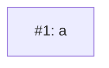

# PLAN: x

## Status

Active

## Implementation Issues

| Issue | Dependencies | Complexity |
|-------|--------------|------------|
| [#1: a](https://example.com/1) | None | simple |
| _Alpha._ | | |

## Dependency Graph

