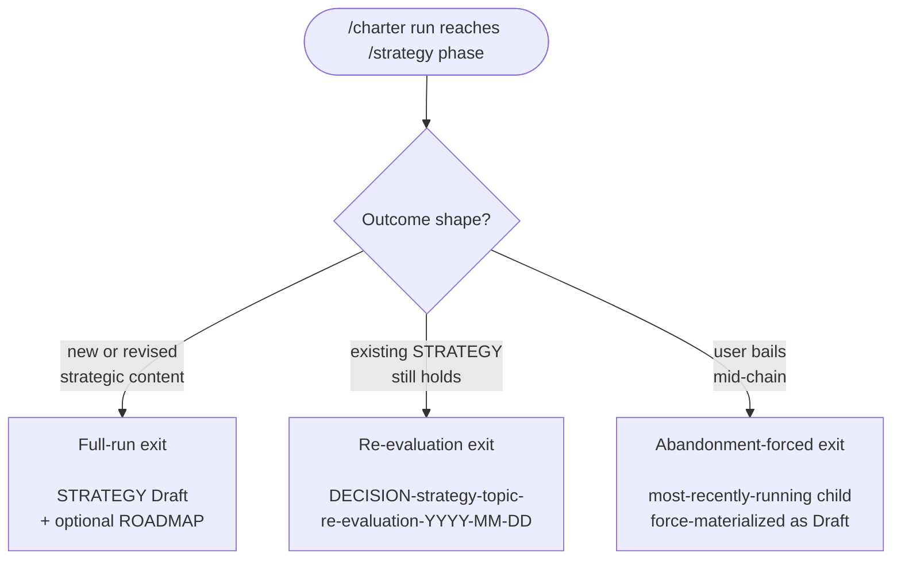

# BRIEF: shirabe-charter-skill

## Status

Done

Authored as the brief input to the downstream PRD and the
shared design (`DESIGN-shirabe-progression-authoring.md`, co-authored
across `/charter`, `/scope`, and the `/work-on` migration). Transitioned to Done on 2026-05-25 after the charter skill implementation landed on session/db61668b (PR #96).

This brief intentionally stops before requirements articulation. The
follow-on PRD owns the per-phase prose, the resume ladder, the
artifact-decision heuristics, and the exact delegation contracts at
each `/charter` → child interface.

## Problem Statement

shirabe ships VISION, STRATEGY, and ROADMAP at the strategic chain's
altitude — each as a loadable child skill (`/vision`, `/strategy`,
`/roadmap`) that authors invoke directly. COMP exists as an artifact
category by example and via workspace tooling; the `/comp` child
skill in shirabe core is parallel work. What's missing is the parent
layer: a skill that walks an author through the strategic
conversation as a *sequence*, deciding which children to invoke,
carrying scope between them, and enforcing the contract that the
conversation always lands at a durable artifact.

In the absence of a parent skill, authors today reach for the chain
as three separate invocations (with a fourth — `/comp` — in parallel
flight). This costs them in three ways. They
re-derive the sequencing decisions on every run (when does a vision
update fire? when is a roadmap warranted?). They carry context
between children manually, with no resume contract if the session
breaks. And they have no enforcement that the conversation produces a
durable terminal artifact — paused or abandoned chains leave evidence
files in `wip/` with no review surface.

The deeper problem is that the strategic chain has invariants that
cannot be enforced in the absence of `/charter`. `/charter`'s design
commits to a three-rule terminal-artifact contract: every chain ends
at a durable artifact for human review; re-evaluation of a healthy
upstream is a first-class lightweight exit; paused or abandoned
chains force-materialize the most-recent intermediate. None of these
invariants survive a manual chain. The discipline-vs-artifact
decoupling — the load-bearing principle that strategic work can be
*disciplined* without being forced to *produce* — depends on a
parent skill that enforces the three exits. Without it, every
strategic conversation is tempted into a STRATEGY revision
regardless of whether one is warranted, and the discipline collapses
into ad-hoc artifact creation.

The remaining gap has five parts:

- **No parent skill entry point.** Future strategic-chain authors
  have no `/charter` to load. They re-discover the sequencing logic
  per run.
- **No codified delegation graph.** The four `/charter` → child
  interfaces (`/vision`, `/comp`, `/strategy`, `/roadmap`) each have
  different inputs, outputs, conditionality, and visibility rules,
  but no document encodes them as a single contract.
- **No resume ladder across child boundaries.** Resume within a
  single skill (e.g., `/explore`'s Phase ladder) is precedent;
  resume across `/charter`'s children, including detection of
  partial child runs, is new.
- **No terminal-artifact enforcement.** The three exits — full-run,
  re-evaluation Decision Record, abandonment-forced materialization
  — exist as architectural intent but have no skill that implements
  them.
- **No parent-skill pattern.** `/charter` is the first of three
  parent skills shirabe needs. Without `/charter` as the validation
  point, downstream parent skills (`/scope`, the `/work-on`
  migration) have no precedent to inherit from.

The problem is not that authors can't sequence the strategic chain
by hand. It's that without `/charter`, the strategic chain's
invariants are unenforceable and the parent-skill pattern can't be
proven out for the parent skills that follow.

## User Outcome

A skill author opens Claude Code in a repo where a strategic
conversation needs to happen. They invoke `/charter`. The skill
opens with a discovery phase: it gathers context, detects whether
the conversation calls for a vision update, decides whether
competitive framing is in scope (private repos only), and converges
on a clear strategic question. From there it walks through the
chain — optional `/vision` if the long-term thesis is shifting,
optional `/comp` if competitive analysis is warranted, required
`/strategy` always, optional `/roadmap` if the strategy decomposes
into coordinated multi-block work. The author never has to remember
the order; the skill enforces it.

```mermaid
flowchart LR
    A([/charter topic]) --> P[Phase 1<br/>Discovery]
    P --> V{vision-update?<br/>thesis-shift signal}
    V -->|fire| Vy[/vision]
    V -->|skip| C{comp?<br/>private repo<br/>+ competitive signal}
    Vy --> C
    C -->|fire| Cy[/comp]
    C -->|skip| S[/strategy<br/>ALWAYS]
    Cy --> S
    S --> R{roadmap?<br/>multi-block strategy<br/>+ cross-deps}
    R -->|fire| Ry[/roadmap]
    R -->|skip| Exit([Exit])
    Ry --> Exit
```

The conversation ends at one of three durable exits, each suited to
the shape the strategic work took:

- **Full-run exit.** A new or revised STRATEGY (Draft) is written,
  plus a ROADMAP if the strategy's blocks have cross-block
  dependencies. The chain halts at the durable artifact for human
  review.
- **Re-evaluation exit.** When the upstream STRATEGY is healthy and
  the chain confirms the existing bet still holds, a Decision Record
  is written referencing the existing STRATEGY. This is the
  lightweight exit that satisfies the terminal-artifact contract
  without forcing a redundant STRATEGY revision.
- **Abandonment-forced exit.** When the user breaks the chain
  mid-flight, the most-recently-run skill is forced to materialize
  its artifact even if its decision rule said evidence-only. The
  chain leaves a review surface regardless of how it terminated.



A `/charter` run that closes without one of these three has violated
the terminal-artifact contract; the skill enforces all three
explicitly. The Re-evaluation exit is the novel contribution — it's
what prevents every `/charter` run from being tempted into a
STRATEGY revision when nothing changed, and it's what proves the
discipline-vs-artifact decoupling thesis empirically.

The author can resume `/charter` mid-chain if the session breaks. The
resume contract detects partial child runs (artifacts in `wip/` or
durable docs/) and offers continue-from-here. Manual re-invocation
of any child directly outside `/charter` remains a first-class path;
`/charter` warns but does not act on the staleness of downstream
artifacts. `/charter`'s design treats manual fallback as steady-state
capability rather than a temporary shim — the author can always step
outside the chain without losing the discipline the parent skill
provides.

In public repos, the chain skips the `/comp` sub-phase silently — the
skill never asks about competitive analysis in a repo where the
content would be inappropriate. In private repos, `/comp` is offered
as an optional discovery feeder. Visibility is layered defense:
`/charter` doesn't invoke `/comp` publicly, the downstream
`/strategy` jury catches any competitive-content leakage into a
public STRATEGY, and `shirabe validate` blocks PRs that violate the
rule at CI time.

Downstream, `/charter`'s shipping validates the parent-skill pattern
for the two siblings that follow: `/scope` will inherit the same
parent/child shape, and the future `/work-on` migration will pivot
from its current substrate into the same pattern. `/charter` is not
just a new skill — it's the first instance of the parent-skill
infrastructure shirabe is committing to.

## User Journeys

The brief calls out four journeys that exercise `/charter` and the
strategic chain from different entry points. Each names the user,
the trigger, the path through the chain, and the exit shape.

### Journey 1: Skill author, standalone invocation cold

A skill author opens Claude Code in a repo where a strategic
conversation needs to happen. They invoke `/charter` with a short
topic string describing the bet they want to pressure-test. The
skill opens with discovery: it gathers context, asks scoping
questions, detects whether the long-term thesis is shifting or only
an operational layer below it. The author confirms the thesis
holds; the chain skips `/vision`. The repo is public, so the chain
silently skips `/comp` without surfacing it as a question.
`/strategy` runs as the load-bearing child — Strategic Context
drafting, Defensibility Thesis, Building Blocks, Coordination
Dependencies, Falsifiability — and lands a STRATEGY Draft. Because
the building blocks have cross-block dependencies the author can't
sequence by inspection, `/charter` invokes `/roadmap` as the
closing child to produce a ROADMAP that sequences them. The chain
halts at the durable artifacts. The author reviews, ratifies, and
commits.

This is the primary mode. It validates that `/charter` walks an
author through the full strategic conversation without forcing them
to remember the chain order, the artifact-decision rules, or the
visibility gating — the skill enforces all three.

### Journey 2: `/charter` run ending in re-evaluation

A skill author returns to a strategic topic six weeks after the
original `/charter` run landed an Accepted STRATEGY. New evidence
has accumulated and the author wants to know whether the bet still
holds. They invoke `/charter` against the same topic. Discovery
surfaces the existing STRATEGY as upstream context and asks whether
the bet warrants revision. The conversation walks through the
falsifiability claims; none have flipped. The corrective actions
named in the original STRATEGY are still the right corrective
actions. The chain does not force a STRATEGY revision. Instead,
`/charter` writes a Decision Record at
`docs/decisions/DECISION-strategy-<scope>-re-evaluation.md`
referencing the existing STRATEGY by path, recording the evidence
reviewed and the conclusion that the bet still holds, and halts
there. No STRATEGY revision; no ROADMAP regeneration; the existing
Accepted STRATEGY remains the live artifact.

This journey validates the discipline-vs-artifact decoupling
principle empirically. Without it, every `/charter` run is tempted
into a STRATEGY revision even when nothing changed, and the
discipline collapses into ad-hoc artifact churn. The Decision
Record exit is the novel contribution — it lets a strategic
conversation conclude rigorously without producing a redundant
artifact.

### Journey 3: Mid-chain abandonment forcing materialization

A skill author starts a `/charter` run on a hard strategic
question. `/vision` runs and lands evidence in `wip/`; `/strategy`
enters its discover phase and gathers context. Before the strategy
draft is complete, the author switches to a different task, closes
the session, and doesn't return for a week. When they re-open
Claude Code and tell `/charter` to wrap up the strategic
conversation as it stands — or when the resume ladder detects the
partial state on its own — the chain does not abandon the work as
evidence-only files in `wip/`. Instead, `/charter` forces the
most-recently-run child to materialize its artifact even if its own
decision rule said evidence-only was acceptable. The strategic
conversation ends at a Draft STRATEGY (force-materialized from the
partial state), with a Status block noting it was
abandonment-forced rather than full-run. The chain leaves a review
surface no matter how it ended.

This journey validates the third exit path. It enforces the
terminal-artifact contract in the case the contract is weakest
under — interrupted, half-finished, low-information strategic
work. Without abandonment-forced materialization, the contract
holds only for runs the author completes, which is exactly the
wrong shape.

### Journey 4: Reviewer redirecting mid-chain via manual fallback

A reviewer reads a Draft STRATEGY produced by an earlier `/charter`
run. The bet's framing is close to right but the Building Blocks
lean toward implementation language that pre-supposes too much
sequencing. The reviewer decides to tighten the bet directly rather
than re-running the full chain. They invoke `/strategy` directly
outside `/charter`, against the existing Draft STRATEGY path, with
the tightened framing as the input. `/strategy` runs as a
standalone child the way it always has — phased authoring, jury
review, finalization — and produces a revised Draft. `/charter`
does not interfere with the manual re-invocation. When the author
later resumes `/charter` on the topic and the resume ladder notices
the STRATEGY has been edited outside the chain, the skill warns
that any downstream ROADMAP may be stale relative to the revised
STRATEGY but does not act on the staleness. The author decides
whether to re-run `/roadmap` or accept the existing ROADMAP as
still-valid.

This journey validates that manual fallback is first-class
steady-state capability rather than a workaround. Authors and
reviewers retain full control over the strategic chain at any
altitude; `/charter` provides discipline without becoming a
bottleneck. The parent-skill pattern stays compatible with the
author already knowing the chain by hand and stepping outside it
when the situation warrants.

## Scope Boundary

This brief, and the downstream PRD it points at, cover the
`/charter` parent skill as a loadable plain-English SKILL.md, plus
the scope-of-`/charter` portions of the shared design doc. The scope
holds the following inside:

- The `/charter` SKILL.md following the existing parent-skill
  template (input modes, execution-mode flag parsing, topic-slug
  constraint, workflow phases diagram, resume logic ladder, phase
  execution list, reference files table).
- The four delegation contracts at the `/charter` → child interfaces
  (`/vision`, `/comp`, `/strategy`, `/roadmap`), including inputs,
  outputs, conditionality rules, and review-halt behavior.
- The three exit paths (full-run, re-evaluation Decision Record,
  abandonment-forced materialization) as first-class skill behavior.
- The resume ladder across child boundaries, including dual-surface
  detection (`wip/` evidence and durable `docs/` artifacts) and
  status-aware re-entry for terminal STRATEGY.
- The visibility model that gates the `/comp` sub-phase to private
  repos and inherits shirabe's CLAUDE.md visibility regex pattern.
- The `/charter`-scoped portions of
  `DESIGN-shirabe-progression-authoring.md`, the shared design doc
  authored across the parent-skill pattern's three features.
- The discover/converge engine extraction from `/explore` as it
  applies to `/charter`'s Phase 1 discovery (the shared reference is
  consumed by `/charter`).
- Workspace and shirabe CLAUDE.md updates documenting `/charter`'s
  entry triggers and discovery surface.
- The per-skill artifact-decision contract as instantiated in
  `/charter`'s phase prose (`/explore` Phase 5's no-artifact path is
  the precedent).
- Manual-redirect workflow as a first-class steady-state surface,
  authored as explicitly as the parent-driven workflow.

The scope explicitly excludes:

- **The `/scope` tactical progression skill.** Separate feature with
  its own brief; shares the design doc but does not bind `/charter`'s
  scope.
- **The `/work-on` migration into the parent-skill pattern.**
  Separate feature; depends on amplifier-layer workflow-composition
  substrate that `/charter` does not require for its own ship.
- **The `/comp` skill body itself.** `/charter`'s contract for
  consuming `/comp` is in scope; authoring the `/comp` SKILL.md is
  the responsibility of the `/comp` feature.
- **Revisions to the `/strategy` SKILL.md.** `/charter` consumes
  `/strategy` as it ships today; if integration surfaces a need for
  `/strategy` revisions, that's a separate PR.
- **The amplifier-layer workflow substrate.** The migration into
  workflow-composition infrastructure is downstream; `/charter`
  ships against current shirabe patterns (wip/-based intermediates,
  plain-English phase prose).
- **The review-time redirect mechanism.** Manual fallback is
  first-class by design; the automatic-redirect substrate is
  amplifier-layer work and is not a prerequisite for `/charter`.
- **The niwa workspace context surface.** `/charter` uses current
  CLAUDE.md visibility detection; substrate cleanup is unrelated.
- **Migration of existing strategic-progression artifacts.**
  `/charter` adds a parent layer without renaming or restructuring
  the children's artifacts. Existing STRATEGY, ROADMAP, VISION docs
  continue to validate under their existing schemas.
- **The tone rubric, the writing-style discipline, and other shirabe
  substrate work.** `/charter` follows the same conventions shirabe
  uses today.

## Open Questions

These surface for the downstream PRD or design to resolve. None
block this brief.

1. **`/strategy` SKILL.md verification.** `/charter`'s
   `--upstream <strategy-path>` flag and the per-child handoff
   scope-file shape it writes both bind against the `/strategy`
   skill's actual input contract. The verification step — reading
   the shipped `/strategy` SKILL.md and confirming the contract
   matches what `/charter` produces — is a PRD prerequisite. If
   `/strategy`'s contract has drifted since this brief was authored,
   the PRD names the reconciliation.

2. **`/comp` skill ordering.** `/charter`'s `/comp` invocation
   contract is sketched in this brief, but the `/comp` child skill
   itself is parallel work in shirabe core. Two options: (a) ship
   `/charter` with `/comp` invocation as documented-but-disabled
   (skipped until the `/comp` skill lands), or (b) sequence
   `/comp` to ship first so `/charter` ships against a functional
   `/comp` from day one. The PRD picks one; either choice has
   downstream consequences for the chain's day-one behavior in
   private repos.

3. **Engine extraction location.** The discover/converge engine
   `/charter` consumes for Phase 1 discovery is currently inside
   `skills/explore/references/phases/`. Two options: (a) extract it
   into a top-level `references/` directory (the existing shirabe
   precedent for shared content), or (b) keep it inside
   `skills/explore/references/` with `/charter` referencing those
   paths cross-skill. (a) signals shared infrastructure; (b) is the
   lower-novelty path. The design picks one.

4. **Dual-implementation contract.** The shared design doc
   (`DESIGN-shirabe-progression-authoring.md`, co-authored across
   the parent-skill pattern's three features) must commit to a
   logical contract that satisfies both `/charter`'s wip/-based
   core-layer implementation AND the eventual amplifier-layer
   implementation that the `/work-on` migration needs. The contract
   is the freeze line; the implementations evolve. Picking the
   contract is the most novel design challenge from this brief and
   should be resolved before any of the three features lock in.

5. **`/charter` auto-handoff from `/explore`.** Should `/charter`
   be invocable as a Phase-5 handoff target from `/explore` (the
   crystallize phase routes to `/charter` when the conversation
   indicates a strategic artifact), or standalone-only at first?
   The PRD picks the integration timing.

6. **Resume-ladder source of truth.** Does `/charter`'s resume
   ladder check each child's artifact status independently
   (multi-source), or use a single `wip/charter_<topic>_state.md`
   file as the source of truth? The choice affects how robust
   resume is to manual edits outside `/charter` (Journey 4's case).

## Downstream Artifacts

- **`PRD-shirabe-charter-skill.md`** — requirements articulation for
  the `/charter` SKILL.md, the four delegation contracts, the
  three exit paths, the resume ladder, and the visibility model.
  Lives in `docs/prds/`.
- **`DESIGN-shirabe-progression-authoring.md`** — the shared design
  doc co-authored across the parent-skill pattern's three features
  (`/charter`, `/scope`, the `/work-on` migration). Anchors the
  parent-skill pattern's frozen contracts; the PRD points at the
  `/charter`-scoped portions. Lives in `docs/designs/current/`.
- **(Likely) per-feature design supplements** — `/scope` and the
  `/work-on` migration each consume the shared design and may need
  per-feature design notes for their specifics. Authored at design
  time when scope warrants.

## References

- Brief format precedent: `docs/briefs/BRIEF-shirabe-strategy-skill.md`.
- Parent-skill template precedents: `skills/strategy/SKILL.md` and
  `skills/explore/SKILL.md`.
- Phase-5 handoff pattern precedent:
  `skills/explore/references/phases/phase-5-produce-*.md` family.
- Discover/converge engine source:
  `skills/explore/references/phases/phase-2-discover.md` and
  `skills/explore/references/phases/phase-3-converge.md`.
- Resume-ladder precedent: the Resume Logic block in
  `skills/strategy/SKILL.md` (status-first ladder).
- Cross-repo visibility rules: `references/cross-repo-references.md`.
