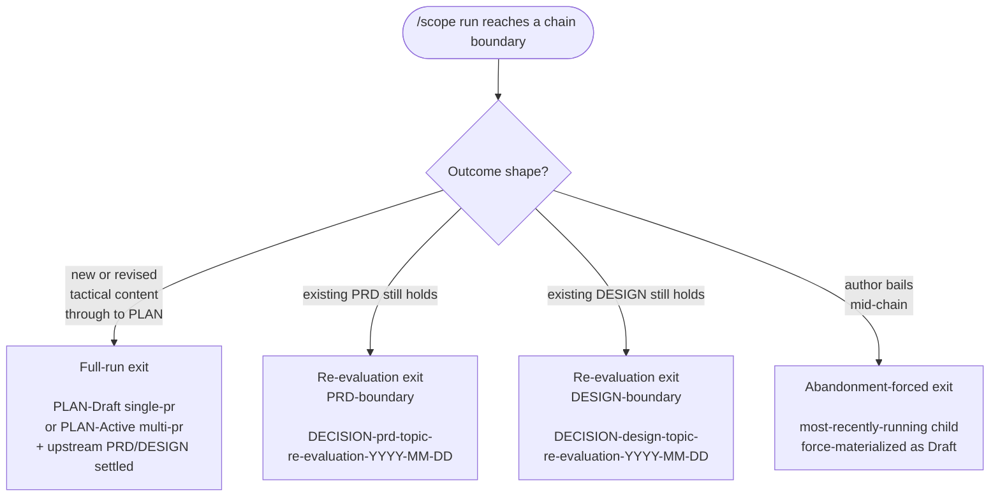

# BRIEF: shirabe-scope-skill

## Status

Draft

## Problem Statement

shirabe ships the tactical chain's four altitudes — BRIEF, PRD,
DESIGN, PLAN — as four loadable child skills that authors invoke
directly. `/brief` frames a feature before requirements; `/prd`
captures requirements; `/design` works the architecture; `/plan`
decomposes a design into atomic implementable issues, in either
single-pr or multi-pr output mode. The four exist; they validate
under their own format references; they are well-trodden. What's
missing is the parent layer: a skill that walks an author through
the tactical conversation as a *sequence*, deciding which children
to invoke against the upstream artifacts already on disk, carrying
scope between BRIEF and PRD and DESIGN and PLAN boundaries without
the author having to remember the order, and enforcing the same
three-exit contract `/charter` made first-class for the strategic
chain.

In the absence of a parent skill, authors today reach for the
tactical chain as four separate invocations. They re-derive the
sequencing decisions on every run: when does a BRIEF dog-foot in?
when is a DESIGN warranted given the PRD's complexity? when does
the PLAN's `single-pr` versus `multi-pr` choice fire? They carry
context manually with no resume contract if the session breaks
across child boundaries — and the tactical chain breaks across
boundaries more often than the strategic one, because requirements
and design churn faster than thesis. They have no enforcement that
the chain produces a durable terminal artifact rather than evidence
files in `wip/`. The work is done by discipline alone, and
discipline is exactly the wrong substrate for an invariant.

The deeper problem is that the parent-skill pattern v1 — the
contract `/charter` validated on the strategic chain — has
invariants that cannot be ratified for the parent skills that
follow until a second parent stands them against a chain with
genuinely different shape. The tactical chain's asymmetries
concentrate at three points where the strategic chain has no
analog:

- **Two settled-upstream boundaries instead of one.** The
  re-evaluation exit, which `/charter` exposes at exactly one point
  (an existing Accepted STRATEGY), multiplies in the tactical
  chain. A `/scope` run against a settled PRD asks the
  Re-evaluate/Revise/Bail question at the PRD boundary; against a
  settled DESIGN, at the DESIGN boundary. Two Decision Record
  sub-shapes need to exist, or the pattern's re-evaluation framing
  silently degrades to one of them.
- **No Phase-5 Reject finalization on `/prd` or `/design` today.**
  `/charter`'s rejection sub-shape on the re-evaluation exit is
  gated on `/strategy`'s Phase 5 Reject verdict firing inside the
  chain. The tactical chain's children have no analogous reject
  finalization in their current contracts. Either the pattern's
  rejection sub-shape silently disappears in `/scope` (asymmetry
  inside the pattern contract that has nothing to do with the
  strategic/tactical distinction), or `/prd` and `/design` grow
  Phase-N Reject contracts as prerequisites — substantial upstream
  contract work, but the only way to preserve symmetry.
- **A terminal child with two output modes.** `/plan`'s `single-pr`
  mode produces a self-contained PLAN doc; its `multi-pr` mode
  produces a PLAN doc plus a GitHub milestone with issues. The
  pattern's chain-tracking unit
  (`planned_chain`/`chain_ran`/`chain_skipped`) doesn't capture
  output-mode selection, and `/scope`'s state file needs to record
  the choice so re-entry against an Active PLAN reads the correct
  surface.

`/prd`'s invocation gate sits on top of those three asymmetries.
`/charter`'s three gate vocabularies — EITHER-signal, ALWAYS,
shape-dependent — don't fit `/prd` cleanly. The honest framing is
that `/prd` ALWAYS invokes unless an Accepted PRD already exists
for the topic; the auto-skip is real and load-bearing, but the
pattern doc has no name for it. Either the pattern's gate vocabulary
grows a fourth entry (Mandatory-with-auto-skip), or `/prd`'s gate
unifies into EITHER-signal with a contrived "requirements-shift"
signal that doesn't actually match `/prd`'s resume semantics.

The remaining gap has five parts:

- **No parent skill entry point.** Future tactical-chain authors
  have no `/scope` to load. They re-discover the sequencing logic
  per run, including which upstream artifact triggers which entry
  point — `/scope <PRD-path>` versus `/scope <DESIGN-path>` versus
  `/scope <topic-slug>` versus cold.
- **No codified delegation graph.** The four `/scope` → child
  interfaces (`/brief`, `/prd`, `/design`, `/plan`) each have
  different inputs, output shapes, lifecycles, and conditionality
  rules, but no document encodes them as a single contract.
- **No resume ladder across four child boundaries.** Resume within
  a single skill is precedent; resume across `/scope`'s four
  doc-emitting children, with three statuses on the terminal PLAN
  (`Draft`/`Active`/`Done`) and DESIGN's directory-move lifecycle
  (`docs/designs/` → `docs/designs/current/`), is new.
- **No terminal-artifact enforcement for the tactical chain.** The
  three exits — full-run at PLAN, re-evaluation Decision Record at
  either PRD- or DESIGN-boundary, abandonment-forced
  materialization — exist as architectural intent inherited from
  the pattern, but have no parent skill that implements them.
- **No pattern-validation evidence beyond `/charter`.** A contract
  validated on a single instance is a contract observed once.
  `/scope` is the second parent the pattern needs to ratify
  itself. The amplifier-layer parent skill (the `/work-on`
  migration that follows) cannot inherit from a pattern that has
  only one ground-truth example.

The problem is not that authors can't sequence the tactical chain
by hand. They do, every day. It's that without `/scope`, the
tactical chain's invariants are unenforceable, the parent-skill
pattern's contract surface stays untested against a chain it was
designed to hold, and the asymmetries the tactical chain exposes
go unresolved — silently degrading the pattern's symmetry as more
parent skills land.

## User Outcome

A skill author opens Claude Code in shirabe with a feature named on
the roadmap, surfaced from `/explore`'s crystallize phase, or
sitting in their head as a half-formed PRD intent. They invoke
`/scope`. The skill opens with discovery: it inspects the durable
artifacts already on disk for the topic — `docs/briefs/BRIEF-*.md`,
`docs/prds/PRD-*.md`, `docs/designs/current/DESIGN-*.md`,
`docs/plans/PLAN-*.md` — detects how far the tactical conversation
has already gone, and proposes a chain to run from the
most-downstream settled point. The author sees the chain plan, can
adjust it, and confirms. From there, `/scope` walks the children
under their per-gate semantics: `/brief` if no Accepted BRIEF
exists and the feature's framing isn't already settled in an
upstream PRD, `/prd` always unless an Accepted PRD already exists,
`/design` only when the just-produced PRD exposes architectural
decisions or surface complexity that warrant an explicit design,
`/plan` as the terminal child producing a PLAN doc and (in
`multi-pr` mode) a GitHub milestone with issues. The author never
has to remember the order, the gates, or which artifact triggers
which entry; the skill enforces the chain.

```mermaid
flowchart LR
    A([/scope topic-slug<br/>or upstream path]) --> P[Phase 1<br/>Discovery + Chain Proposal]
    P --> B{Accepted BRIEF<br/>at upstream?<br/>framing-shift signal?}
    B -->|fire| By[/brief]
    B -->|skip| Pr[/prd<br/>ALWAYS unless<br/>Accepted PRD exists]
    By --> Pr
    Pr --> D{Design surface?<br/>PRD complexity<br/>or new components?}
    D -->|fire| Dy[/design]
    D -->|skip| Pl[/plan<br/>single-pr or<br/>multi-pr]
    Dy --> Pl
    Pl --> Exit([Exit])
```

The conversation ends at one of three durable exits, mirroring
`/charter`'s contract across both the boundaries the tactical chain
exposes:

- **Full-run exit.** The chain reaches PLAN. In `single-pr` mode,
  the PLAN doc lands at `docs/plans/PLAN-<topic>.md` with status
  Draft and a complete Issue Outlines section; in `multi-pr` mode,
  the PLAN doc lands with status Active alongside a GitHub
  milestone and a set of issues. Intermediate PRD and DESIGN
  artifacts are settled (Accepted PRD; Accepted DESIGN moved to
  `docs/designs/current/`). The chain halts at the durable
  artifacts for human review.
- **Re-evaluation exit, at either boundary.** When the chain runs
  against an already-Accepted PRD or an already-Accepted DESIGN
  and the conversation concludes the existing artifact still
  holds, `/scope` writes a Decision Record referencing the
  existing artifact by path:
  `DECISION-prd-<topic>-re-evaluation-<date>.md` at the PRD
  boundary, or `DECISION-design-<topic>-re-evaluation-<date>.md`
  at the DESIGN boundary. No re-authoring; no proceeding to the
  next child. The lightweight exit satisfies the terminal-artifact
  contract without forcing a redundant PRD or DESIGN revision.
- **Abandonment-forced exit.** When the author breaks the chain
  mid-flight — closes the session, switches tasks for a week, or
  tells `/scope` to wrap up as it stands — the chain forces the
  most-recently-running child to materialize its artifact even if
  that child's own decision rule would have left evidence-only
  files in `wip/`. The tactical chain leaves a review surface
  regardless of how it ended.



A `/scope` run that closes without one of these has violated the
terminal-artifact contract; the skill enforces all three
explicitly. The two re-evaluation boundaries are the novel
contribution against `/charter`'s single boundary, and they're
what prevent every `/scope` run against a settled chain from being
tempted into a redundant PRD or DESIGN revision when nothing
changed.

The author can resume `/scope` mid-chain if the session breaks.
The resume ladder detects partial child runs across four positions
(`wip/brief_<topic>_*`, `wip/prd_<topic>_*`,
`wip/design_<topic>_*`, `wip/plan_<topic>_*`) and offers
continue-from-here. Status-aware re-entry against a PLAN handles
three statuses (Draft, Active, Done) rather than `/charter`'s two,
since the PLAN lifecycle has no Accepted state. Manual fallback
remains first-class: a `/prd` or `/design` run done directly
outside `/scope` leaves the same durable artifact the in-chain
run would have, at the same path with the same frontmatter, and
`/scope`'s resume ladder reads that surface identically either
way. Authors and reviewers retain full control over the tactical
chain at any altitude; `/scope` provides discipline without
becoming a bottleneck.

Downstream, `/scope` shipping validates the parent-skill pattern
v1 for the tactical chain the same way `/charter` validated it for
the strategic chain. The pattern's contract surface holds across
two parents with genuinely different chain shapes: the inheritance
promise (verbatim use of `parent-skill-pattern.md`,
`parent-skill-state-schema.md`,
`parent-skill-resume-ladder-template.md`, and
`parent-skill-child-inspection.md`) is observed empirically rather
than asserted; the asymmetries (extra re-evaluation boundary,
no-Phase-5-Reject-default, multi-output-mode terminal child) all
land inside the pattern's existing extension points — substitution
surfaces, body slots, the conditional-feeder MAY clause — without
forcing pattern-doc rewrites; and the contract is ratified for the
amplifier-layer parent skill (the `/work-on` migration that
follows) which can finally inherit from a pattern with two
ground-truth examples instead of one.

## User Journeys

Phase 3 will name the concrete journeys that exercise the feature.

## Scope Boundary

Phase 3 will record what this feature holds in and pushes out.
