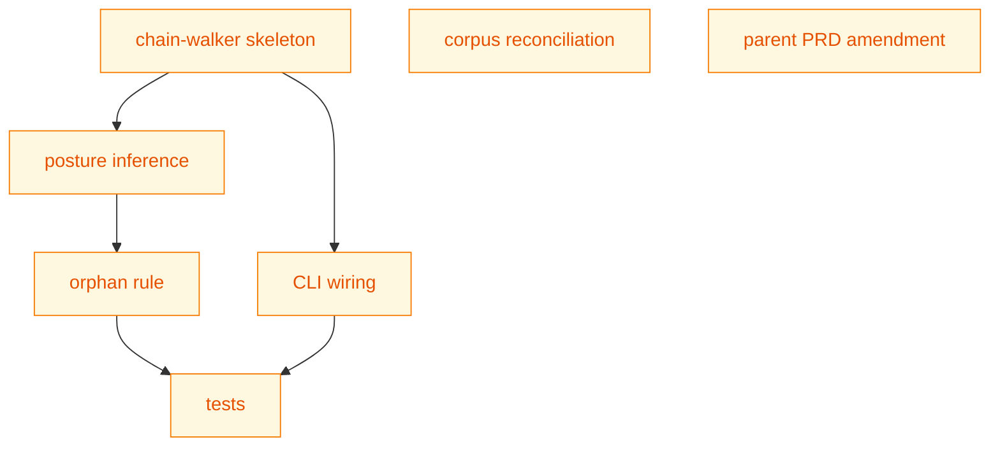

# DESIGN: lifecycle-passing-state-validation

## Status

Planned

The DESIGN is at `Planned` while the implementation is in flight. On
chain completion the file is promoted to `docs/designs/current/` at
status `Current`.

## Context and Problem Statement

shirabe's existing validator covers two axes today. The diff-scoped
content pass walks the files the PR touches and runs the FCnn family
of checks (FC01 required fields, FC02 valid statuses, FC03 frontmatter-
matches-body, FC04 required sections, FC05 schema check, FC06 cross-
reference, FC07 table-diagram reconciliation, FC08 legend-vs-classdef
reconciliation, FC09 doc-vs-github-state reconciliation). The Lnn
lifecycle pass treats each doc in isolation — L01 fails any present
multi-pr doc at non-Active status, L02 fails any present single-pr
PLAN. Both passes are useful, but neither relates one doc's state to
the other docs in the same artifact chain.

The result is a class of drift the check surface misses entirely. A
BRIEF stuck at Accepted while its single-pr chain has shipped and
deleted its PLAN doesn't fail any check — the BRIEF is at a valid
status, no diff-scoped rule touches it, and L01/L02 don't see it. The
two recent corpus reconciliation PRs (FC09 doc-vs-github-state and
FC08 legend-vs-classdef) both shipped this drift, and the absence of
a chain-aware check is what let them land. The team needs the check
to know the chain a doc belongs to, the posture that chain is in for
the PR under review, and the state every doc in the chain should be at
given that posture.

The PRD names 14 requirements (R1-R14) and leaves five architectural
alternatives open for the DESIGN to settle. Two larger questions — the
orphan-doc rule and the multi-pr posture-detection mechanism — were
contested enough to warrant their own Decision Records and have been
settled out-of-band; the DESIGN consumes both outcomes and the
implementation encodes them, but the DESIGN does not re-litigate
either.

## Decision Drivers

- **Doc-tree-only execution.** The check reads the working tree alone.
  No shell-out to `git`, no GitHub round-trip, no network. The
  validator behavior is identical in local pre-commit, CI, and
  copy-of-tree runs. PRD R11.
- **Reuse existing infrastructure.** The check ships inside
  `crates/shirabe-validate/`, runs through the existing `shirabe
  validate` CLI, and reuses the existing frontmatter parser, format
  spec registry, and error-reporting plumbing. PRD R12.
- **Single-PR delivery.** Chain-walker code, posture inference,
  passing-state computation, orphan rule, corpus reconciliation for
  FC08/FC09, and parent PRD R17/R18 amendment all ship in one PR. The
  PR is single-pr execution mode; the PLAN driving it is ephemeral.
  PRD R13.
- **Author-explainable failure messages.** Every Lnn error names the
  file, current state, and expected passing state — so the author can
  see the fix without reading code. PRD R6.
- **Defensive against malformed input.** Walker MUST NOT panic on any
  malformed frontmatter, upstream cycle, list-vs-scalar mismatch, or
  missing parent file. PRD R9.
- **Walk bounded to the given root.** No symlink escape; no `..`
  traversal past the root. PRD R9.

## Considered Options

The DESIGN settles five architectural alternatives the PRD left open
(D1-D5) and points at two pre-settled decisions (D6, D7).

### Decision 1: Chain-walker module placement

The chain-walker is a coherent abstraction with multiple internal
pieces — the inverse-upstream graph, the posture inferencer, the
passing-state computation, and the orphan rule. Three placements were
considered.

#### Chosen: new `crates/shirabe-validate/src/lifecycle.rs` module

A new module holds the chain-walker and everything it depends on
internally. The existing `checks.rs` stays focused on diff-scoped per-
doc checks; the existing `validate.rs` stays focused on dispatch and
orchestration. The new module exports a single public entry point —
`run_lifecycle_check(root: &Path, cfg: &Config) -> Vec<ValidationError>`
— that `validate.rs` calls when the `--lifecycle` CLI flag is set.

Rationale: the chain-aware check has more internal structure than a
typical FCnn check. A module-level seam keeps the structure local and
keeps `checks.rs` from growing a third concept (it already holds the
per-doc FCnn checks and the cross-reference plumbing). The PRD R12
infrastructure-reuse driver is satisfied by living in the same crate
and using the same parser and error plumbing.

#### Alternatives Considered

- **Extend `checks.rs` with new `check_lifecycle*` functions.** The
  pattern would mirror `check_fc07` and `check_fc08`, but those checks
  examine one doc at a time. The chain-walker examines the whole tree
  at once and carries its own internal graph data structure; `checks.rs`
  would gain a feature it doesn't currently have a shape for, and the
  walker's helpers (`build_inverse_upstream`, `infer_posture`, etc.)
  would clutter the per-doc-check namespace.

- **Extend `validate.rs` with a new dispatch path.** `validate.rs`
  today reads docs and routes them through the FCnn pipeline. Adding
  the chain-walker there mixes dispatch with logic and balloons the
  file. The chain-walker is a self-contained unit that doesn't need
  to share state with the per-doc dispatch.

### Decision 2: Target-state map shape

Each artifact type has a fixed target state — BRIEF Done, PRD Done,
DESIGN Current, PLAN DELETED, ROADMAP DELETED. The check needs to map
a frontmatter format name (`Brief`, `PRD`, `Design`, `Plan`, `Roadmap`)
to its target state. Three shapes were considered.

#### Chosen: centralized `target_state_for(format_name)` function in `lifecycle.rs`

A small lookup function in the new module:

```rust
pub fn target_state_for(format_name: &str) -> TargetState {
    match format_name {
        "Brief" => TargetState::Status("Done"),
        "PRD"   => TargetState::Status("Done"),
        "Design" => TargetState::Status("Current"),
        "Plan"  => TargetState::Deleted,
        "Roadmap" => TargetState::Deleted,
        _ => TargetState::Unknown,
    }
}
```

`TargetState` is a small enum with `Status(&'static str)`, `Deleted`,
and `Unknown` variants.

Rationale: the target-state concept exists only inside the lifecycle
check. Centralizing the lookup in the module that needs it keeps the
concept local — `formats.rs` does not gain a per-format field that
exists only for this one check, and the `match` is a single grep-able
source of truth.

#### Alternatives Considered

- **Add a `target_state: Option<String>` field to `FormatSpec`.** This
  would put the target state next to the other per-format metadata in
  `formats.rs` (valid statuses, required sections, etc.). Rejected
  because the multi-format machinery becomes coupled to a single
  feature: if the orphan-rule decision were ever revised, every
  `FormatSpec` definition would carry the change. Keeping the target-
  state lookup in the lifecycle module preserves the per-feature
  encapsulation the format spec is supposed to provide.

- **Per-format constants in each format's module.** shirabe-validate
  does not have per-format modules today (everything lives in a single
  `formats.rs`), so this would require splitting the format spec
  registry — a refactor far larger than this feature warrants.

### Decision 3: Cycle handling in upstream traversal

The chain-walker follows the inverse-upstream edge. In principle the
graph is a DAG (parent docs are upstream of children; the chain flows
BRIEF -> PRD -> DESIGN -> PLAN/ROADMAP), but malformed frontmatter
could introduce a cycle: doc A's `upstream:` points at B; B's points
at C; C's points at A. Two handlings were considered.

#### Chosen: hard error with the cycle path in the diagnostic

The walker maintains a visited-set per traversal. If a doc is visited
twice on the same walk, the walker emits an Lnn error (L03) naming
every doc participating in the cycle and exits the walk for that
chain. The other chains in the tree continue to validate.

Rationale: a cycle in the upstream graph is a bug, not an ambiguity.
The corpus today has no cycles, and if one appears it is the kind of
mistake the author wants to see surfaced immediately rather than
silently degraded. Warn-and-bail would let the cycle-participating
docs silently skip the passing-state check while every other check
continues to apply to them — a confusing partial-pass that hides the
actual defect.

#### Alternatives Considered

- **Warn-and-bail-walk.** Emit a notice naming the cycle, mark each
  cycle-participating doc as "unable to determine posture", and skip
  the passing-state check for those docs. Rejected because the failure
  mode is "the check silently doesn't validate some docs that look
  like they should be validated." The author has no incentive to fix
  the cycle if everything still passes on the other docs.

### Decision 4: --lifecycle composition with the existing diff-scoped validator

The existing `shirabe validate <file>...` invocation runs the FCnn
checks against the given file(s). The new chain-aware check needs the
whole tree, not a file list. Two composition shapes were considered.

#### Chosen: separate CLI mode flag (`--lifecycle <root>`)

`shirabe validate <file>...` keeps its current diff-scoped behavior.
`shirabe validate --lifecycle <root>` is a separate invocation mode
that takes a root path and runs only the chain-aware check. The two
modes can be invoked sequentially in CI:

```bash
shirabe validate $changed_files          # diff-scoped FCnn pass
shirabe validate --lifecycle .           # whole-tree chain-aware pass
```

Rationale: matches the issue's stated interface (`shirabe validate
--lifecycle <root>`); preserves the existing invocations untouched;
the two passes have different inputs (file list vs root path) and
making them one invocation creates an awkward argument-parsing
surface. The downstream CI integration issue picks how to wire both
modes into a single CI job.

#### Alternatives Considered

- **Always-on additional pass from repo root.** When `shirabe validate`
  runs against a tree containing docs/, run the chain-aware check
  alongside the diff-scoped one. Rejected because (a) the diff-scoped
  invocation does not need the whole tree, so adding a whole-tree pass
  to every invocation is wasted work; (b) ad-hoc `shirabe validate
  one-file.md` runs would gain surprising chain-aware failures the
  author wasn't expecting; (c) it muddies the input contract — does
  the file list filter the chain-aware pass or not?

### Decision 5: Concrete Lnn check-code numbering

The PRD names the `Lnn` family but leaves concrete numbering to the
DESIGN. The numbering is the canonical reference downstream issues and
the parent PRD R17/R18 amendment will cite.

#### Chosen: five concrete codes (L01-L05)

| Code | Failure mode | When it fires |
|------|--------------|---------------|
| L01 | Doc not at passing state | A chain member's frontmatter status differs from the passing state computed for the chain's posture. The message names the file, current state, expected state, and posture. Covers present-Done multi-pr PLAN (forcing function), present single-pr PLAN at merge, BRIEF stuck at Accepted while its PLAN is Done, and every other state-vs-posture mismatch. |
| L02 | Orphan doc at non-terminal status | A doc with no downstream `upstream:` reference is at a non-terminal status AND its own `upstream:` does not point at an Active ROADMAP. The orphan-rule violation. |
| L03 | Upstream cycle detected | The walker encountered a cycle in the upstream graph. The message names every doc in the cycle. |
| L04 | Chain member missing | A doc's `upstream:` field names a file that does not exist in the tree. |
| L05 | Malformed frontmatter | Defensive parsing fallback. The walker could not extract `upstream:` or `status:` from a chain-participating doc. The message names the file and the parse error. |

Rationale: keeping the umbrella L01 as the primary failure mode lets
the message carry the posture-specific reason rather than fragmenting
the code namespace. The previous PRD framing tried to split L01/L02
across multi-pr and single-pr cases; that's redundant once the message
encodes the posture. The orphan and cycle and missing-member cases
have distinctively different remediation paths (transition the orphan
to its terminal state vs fix the cycle vs author the missing parent),
so they get their own codes. Malformed frontmatter is the catch-all
parse-failure path.

#### Alternatives Considered

- **Seven codes (L01 doc-not-at-passing umbrella, L02 present-Done
  multi-pr PLAN, L03 present single-pr PLAN, L04 orphan non-terminal,
  L05 cycle, L06 missing member, L07 malformed).** Rejected because
  L02 and L03 are redundant with L01 — both are degenerate cases of
  "doc not at passing state for its chain's posture", and a fragmented
  code namespace forces downstream consumers to distinguish them when
  the only meaningful distinction is the posture-specific reason
  string in the message.

### Decision 6: Orphan-doc rule

Settled by `docs/decisions/DECISION-orphan-doc-passing-state-rule-2026-06-06.md`.

#### Chosen direction

The implementation encodes the terminal-aware orphan rule: an orphan
BRIEF, PRD, or DESIGN has passing state defined by its target state;
orphans at their artifact's target state (BRIEF Done, PRD Done, DESIGN
Current) pass; orphans at non-terminal status whose own `upstream:`
points at an Active ROADMAP pass; every other orphan fails with the
L02 code. The Decision Record carries the full Context, Options
Considered, and Consequences sections; the implementation file
references the record in a comment at the orphan-rule call site.

### Decision 7: Multi-pr posture detection

Settled by `docs/decisions/DECISION-multi-pr-posture-detection-2026-06-06.md`.

#### Chosen direction

The implementation reads the PLAN's frontmatter `status:` field as the
posture signal: PLAN present at `Active` is in-flight; PLAN present at
`Done` is work-completing-but-not-yet-deleted (the check fails to
force the deletion); PLAN absent is at-merge. The Decision Record
carries the full Context, Options Considered (PLAN status field,
strikethrough completeness, git introspection), and Consequences
sections; the implementation file references the record at the
posture-inference call site.

## Decision Outcome

The five DESIGN-altitude alternatives settle into a single coherent
implementation shape: a new `lifecycle` module holding the chain-
walker and its helpers; a centralized target-state function inside
that module; hard cycle detection; a separate `--lifecycle <root>`
CLI mode; five Lnn codes. The two out-of-band decisions (orphan rule,
posture detection) are encoded by reference, with call-site comments
pointing at the Decision Records.

## Solution Architecture

### Module layout

```
crates/shirabe-validate/src/
  lifecycle.rs       (new — chain-walker, posture, passing-state, orphan rule)
  validate.rs        (extended — dispatch to lifecycle module when --lifecycle flag set)
  checks.rs          (unchanged for the FCnn checks; not extended)
  formats.rs         (unchanged — target-state lookup lives in lifecycle.rs, not here)
  doc.rs             (unchanged — frontmatter parsing reused as-is)
  frontmatter.rs     (unchanged — reused)
  ...

crates/shirabe/src/
  main.rs            (extended — adds the --lifecycle CLI flag dispatch)
```

### Public surface of `lifecycle.rs`

```rust
pub fn run_lifecycle_check(
    root: &Path,
    cfg: &Config,
) -> Vec<ValidationError>;
```

`Config` is the existing config struct (carries visibility, etc.).
`ValidationError` is the existing error type (carries `code: String`,
`file: PathBuf`, `message: String`). Both come from the surrounding
crate; the new module imports them.

Internal helpers (private):

- `build_doc_index(root: &Path) -> DocIndex` — discovers all docs
  under `root/docs/{briefs,prds,designs,designs/current,plans,roadmaps}/`,
  parses each frontmatter, builds an in-memory index keyed by canonical
  path with metadata (artifact-type, status, execution_mode for PLANs,
  upstream pointers).
- `build_inverse_upstream(idx: &DocIndex) -> InverseGraph` — inverts
  the `upstream:` edge so the walker can go from a parent to its
  children.
- `discover_chains(idx: &DocIndex, inv: &InverseGraph) -> Vec<Chain>` —
  starts from each PLAN and each ROADMAP in `idx`, walks the inverse-
  upstream edge to discover chain members. Hard-fails on a cycle (L03).
- `infer_posture(chain: &Chain) -> Posture` — reads the PLAN's status
  to infer the chain's posture.
- `compute_passing_state(member: &ChainMember, posture: Posture) -> PassingState`
  — the table from PRD R4.
- `check_orphan(doc: &Doc, idx: &DocIndex) -> Option<ValidationError>`
  — the orphan rule. Called for every non-PLAN, non-ROADMAP doc that
  is not a chain member.
- `target_state_for(format_name: &str) -> TargetState` — the
  centralized lookup.

### Data shapes

```rust
enum TargetState {
    Status(&'static str),  // BRIEF -> "Done", PRD -> "Done", DESIGN -> "Current"
    Deleted,               // PLAN, ROADMAP
    Unknown,               // unknown format name (defensive)
}

enum Posture {
    MultiPrInFlight,
    MultiPrWorkCompleting,   // PLAN present at Done (will fail L01)
    MultiPrAtMerge,          // PLAN absent
    SinglePrMidPR,
    SinglePrAtMerge,
}

struct ChainMember {
    path: PathBuf,
    format: String,          // "Brief", "PRD", "Design", "Plan", "Roadmap"
    status: String,          // current frontmatter status
    role: ChainRole,         // Brief / PRD / Design / Plan / Roadmap
}

struct Chain {
    members: Vec<ChainMember>,  // ordered Roadmap?, Brief, PRD, Design, Plan
    root_kind: RootKind,        // PlanRoot, RoadmapRoot
}

enum PassingState {
    Status(&'static str),
    Deleted,                    // the doc should not be present
}
```

### Walker algorithm

1. `build_doc_index(root)`. Parse every doc's frontmatter once.
2. `build_inverse_upstream(idx)`.
3. `discover_chains(idx, inv)`. For each PLAN and ROADMAP:
   a. Add the PLAN/ROADMAP as the chain root.
   b. Walk the chain's PRD (the PLAN's `upstream:` points at a DESIGN,
      whose `upstream:` points at a PRD, whose `upstream:` points at
      a BRIEF — follow the forward `upstream:` edge from the PLAN to
      gather the chain's members in BRIEF-PRD-DESIGN-PLAN order).
   c. Track visited docs; on revisit, emit L03 (cycle).
   d. If a parent file is referenced but missing, emit L04.
4. For each chain:
   a. `infer_posture(chain)` from the PLAN's `execution_mode` and
      `status`.
   b. For each chain member:
      i. `compute_passing_state(member, posture)`.
      ii. Compare the member's current status against the passing
          state. If they differ, emit L01 with the file, current
          state, expected state, and posture in the message.
5. Compute the set of "chain-participating" docs (the union of
   members across all chains).
6. For each non-PLAN, non-ROADMAP doc in `idx` that is NOT in the
   chain-participating set:
   a. `check_orphan(doc, idx)` — applies the orphan rule (terminal-
      state passes; non-terminal-status with own upstream pointing at
      Active ROADMAP passes; otherwise fail L02).

The walker also enforces R9 path constraints during `build_doc_index`:
canonicalize each discovered path; reject any path that escapes
`root`'s canonical prefix; refuse to follow symlinks pointing outside
`root`.

### CLI wiring

In `crates/shirabe/src/main.rs`, a new `--lifecycle <root>` flag is
parsed. When present, the binary dispatches to
`shirabe_validate::lifecycle::run_lifecycle_check(root, &cfg)`. When
absent, the existing diff-scoped path runs unchanged. The two paths
are mutually exclusive — the binary errors out if both `--lifecycle`
and a file list are passed.

### Error rendering

`ValidationError` is rendered the same way every other check renders
errors today (the existing `ValidationError::Display` impl). Each Lnn
error's message follows the canonical shape:

- L01: `chain member docs/path/file.md at status 'X' (expected 'Y' for <posture-name> posture)`
- L02: `orphan docs/path/file.md at non-terminal status 'X' (expected 'Y' (target state) or an Active ROADMAP upstream)`
- L03: `upstream cycle detected: docs/a.md -> docs/b.md -> docs/c.md -> docs/a.md`
- L04: `chain member missing: docs/path/file.md upstream references docs/missing.md which does not exist`
- L05: `malformed frontmatter: docs/path/file.md (parse error: <detail>)`

## Implementation Approach

The work ships in a single PR (PRD R13). The PR's commit set lands in
this order:

1. Chain-walker module skeleton + target-state lookup + frontmatter
   parsing reuse (no posture inference yet; no orphan rule yet).
2. Posture inference + passing-state computation (covers R3, R4 from
   the PRD).
3. Orphan rule (R5).
4. CLI flag + dispatch wiring (R1).
5. Table-driven tests for all the synthetic-chain fixtures (R10).
6. Corpus reconciliation: four `shirabe transition ... Done` commits
   for FC09 BRIEF/PRD and FC08 BRIEF/PRD (R7).
7. Parent PRD R17/R18 amendment + parent DESIGN Decision 5 update
   (R8).
8. PLAN deletion + BRIEF and PRD transitions (the chain's own work-
   completing commit set, landing at the same time per the single-pr
   at-merge posture).

The PLAN doc (PLAN-lifecycle-passing-state-validation.md, status
Draft, single-pr execution_mode) sequences these eight commits as its
outline rows.

## Implementation Issues

| Issue | Dependencies | Complexity |
|-------|--------------|------------|
| chain-walker module skeleton + target-state lookup | — | M |
| posture inference + passing-state computation | chain-walker module skeleton | M |
| orphan rule (terminal-aware + ROADMAP-rooted exception) | posture inference | S |
| CLI flag + dispatch wiring in main.rs | chain-walker module skeleton | S |
| table-driven tests over synthetic chain fixtures | orphan rule, CLI wiring | M |
| corpus reconciliation: FC09 + FC08 BRIEF/PRD transitions | — | S |
| parent PRD R17/R18 amendment + parent DESIGN Decision 5 update | — | S |

Issues are sized at S (1-3 hours) or M (3-6 hours). The chain-walker
skeleton and the tests are the load-bearing rows; everything else is
mechanical. The corpus reconciliation and the parent PRD amendment
are independent and can land in any order relative to the code.

## Dependency Graph



**Legend**: Green = done, Yellow = ready, Red = blocked

## Security Considerations

The chain-walker reads frontmatter from files under the given root.
The security envelope:

- **Path-traversal containment.** The walker canonicalizes `root`,
  then canonicalizes each discovered path and verifies the canonical
  path is a prefix-of-root. Any path that escapes is dropped from
  the index with an L05 error.
- **Symlink discipline.** The walker uses non-following metadata
  reads to detect symlinks; any symlink that resolves outside `root`
  is treated as an L05 error and the link is not followed. Within-
  root symlinks are followed.
- **Frontmatter parsing.** The walker reuses the existing
  `frontmatter.rs` parser, which is total — every malformed input
  produces a structured error rather than a panic. The walker
  wraps any parse failure as L05.
- **Cycle defense.** Hard-fail on cycle (L03) prevents an infinite
  walk on a maliciously- or accidentally-cyclic upstream graph.
- **No network access.** The check executes entirely offline; no
  external state, no GitHub round-trip, no git shell-out. The
  validator behavior is identical regardless of network availability
  or `.git/` presence.
- **No untrusted-input interpolation.** No state-file field, no
  frontmatter value, and no path component is interpolated into a
  shell command. The walker uses Rust's `std::fs` and `std::path`
  APIs exclusively.

The check is read-only — it never writes files, never invokes
`shirabe transition`, never modifies the working tree.

## Consequences

### Positive

- The validator catches a class of drift it has not been able to
  catch before — chain incoherence between docs the PR does not
  touch. The two recent corpus reconciliation PRs both shipped
  drift the new check would have surfaced.
- The check failure messages are self-explanatory: file, current
  state, expected state, posture. The author does not need to read
  the validator source to diagnose a failure.
- The single-PR delivery shape ships the check, reconciles the
  existing corpus drift, and amends the parent PRD all at once.
  The new check passes on its own delivery PR.
- The new module's seam keeps the existing diff-scoped checks
  unchanged, so the FCnn pass continues to run exactly as today.

### Negative

- Authors must learn the gesture for the work-completing PR (edit
  PLAN status to Done + git rm + transition BRIEF/PRD to Done in
  one PR). The `shirabe transition` tool has no Plan state machine
  today, so the PLAN status edit is a manual frontmatter change.
  A future transition-tool extension is sequenced separately.
- The check fails on the intermediate "PLAN at Done, still present"
  working-tree state. That's the forcing function (R6 in the PRD),
  but local-dev workflows pausing between commits will see
  intermittent failures.
- The check adds a whole-tree pass to CI invocations. The pass is
  cheap (parse ~70 frontmatter blocks, walk a small in-memory
  graph), but it is not free.

### Mitigations

- The failure-message format names the expected state directly,
  so the author always knows the fix.
- Future work can introduce a `shirabe transition` Plan state
  machine to make the work-completing gesture discoverable; out of
  scope here.
- The whole-tree pass scales linearly with the doc count; the
  current corpus (~70 docs) parses in well under 100ms. The
  performance margin is generous.

## References

- `docs/prds/PRD-lifecycle-passing-state-validation.md` — the
  upstream PRD this DESIGN operationalizes (R1-R14).
- `docs/briefs/BRIEF-lifecycle-passing-state-validation.md` — the
  upstream BRIEF the PRD operationalizes.
- `docs/decisions/DECISION-orphan-doc-passing-state-rule-2026-06-06.md`
  — the orphan-doc rule D6 references and L02 encodes.
- `docs/decisions/DECISION-multi-pr-posture-detection-2026-06-06.md`
  — the posture-detection mechanism D7 references and the posture
  inferencer encodes.
- `docs/prds/PRD-roadmap-plan-standardization.md` — the parent PRD
  whose R17 and R18 this work amends.
- `docs/designs/DESIGN-roadmap-plan-standardization.md` — the parent
  DESIGN whose Decision 5 this work reshapes.
