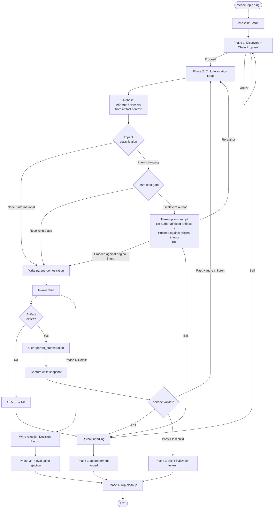

# DESIGN: shirabe-scope-skill

## Status

Current

## Context and Problem Statement

`/scope` is the second parent skill landing in shirabe. The first
parent, `/charter`, shipped against the strategic chain
(`/vision → /strategy → /roadmap`) under the shared design
`docs/designs/current/DESIGN-shirabe-progression-authoring.md`,
which lifts the parent-skill pattern v1 into a contract surface
that future parents bind to without re-deriving. The technical
problem this design solves is binding the same pattern surface to
the tactical chain (`/brief → /prd → /design → /plan`) — a chain
whose shape diverges from the strategic chain at three load-
bearing points the pattern doc has no v1 language for.

The asymmetries the design must absorb without breaking the v1
pattern contract:

- **Two settled-upstream boundaries instead of one.** `/charter`'s
  re-evaluation exit fires at one point (an existing Accepted
  STRATEGY). `/scope` fires at two — an Accepted PRD and an
  Accepted DESIGN, with separate Decision Record sub-shapes and a
  resume-ladder ordering rule (DESIGN above PRD when both exist).
  The pattern's `re-evaluation` exit must gain a `boundary:`
  discriminator without changing the three-exit count.
- **No Phase-N Reject finalization on `/prd` or `/design` today.**
  `/charter`'s rejection sub-shape rides on `/strategy`'s Phase 5
  Reject. The tactical-chain children have no analogous reject
  contract. Either the rejection sub-shape silently disappears in
  `/scope` (an asymmetry inside the pattern contract that has
  nothing to do with the strategic/tactical distinction), or
  `/prd` and `/design` grow Phase-N Reject contracts as `/scope`
  prerequisites. this work takes the latter path; this design enumerates
  the contract extensions to both children.
- **A terminal child with two output modes.** `/plan`'s `single-
  pr` mode produces a self-contained PLAN doc; `multi-pr` mode
  produces a PLAN doc plus a GitHub milestone with issues. The
  pattern's `planned_chain`/`chain_ran`/`chain_skipped` triad
  doesn't capture output-mode selection; `/scope`'s state file
  needs a new `plan_execution_mode:` field so re-entry against an
  Active PLAN reads the correct surface.

`/prd`'s invocation gate sits on top of those three. `/charter`'s
three gate vocabularies (EITHER-signal, ALWAYS, shape-dependent)
don't fit `/prd` cleanly. `/prd` is mandatory unless an Accepted
PRD already exists; that auto-skip is real and load-bearing. The
pattern's gate vocabulary needs a fourth entry
(Mandatory-with-auto-skip) so the gate is named honestly inside
the pattern doc, not jammed into a misnamed third gate.

System boundaries touched by this design:

- `skills/scope/SKILL.md` (new) — the loadable skill body, with
  the seven pattern-level structural elements R1 names and a body
  prose section per `/scope`-specific requirement (R2, R4-R8,
  R15-R23).
- `references/parent-skill-pattern.md` (edit) — add the fourth
  gate type (Mandatory-with-auto-skip) to the gate vocabulary,
  with `/prd`'s gate as the canonical example.
- `references/parent-skill-state-schema.md` (edit) — add the
  `boundary:` and `plan_execution_mode:` conditional-field
  semantics (with I-5 absent-when-ungated bindings).
- `references/parent-skill-resume-ladder-template.md` (edit) —
  document the two-boundary re-evaluation ordering rule (DESIGN
  above PRD) and the PLAN-status-aware refuse-and-redirect rows
  (Active → `/work-on`, Done → `/release`).
- `references/parent-skill-child-inspection.md` (no edit needed)
  — the per-parent surface table already covers doc-emitting
  children; `/scope`'s four children are all doc-emitting and
  fall under the existing row.
- `references/worktree-discipline.md` (new) — a
  top-level reference that captures R21's worktree-staleness
  trigger condition as shared infrastructure both `/charter` and
  `/scope` cite. `/charter`'s SKILL.md gains a follow-up reference-
  table citation in a back-edit.
- `skills/prd/SKILL.md` + phase references (edit) — ship the
  Phase-N Reject finalization contract at `/prd`'s Phase 4 (per
  R23 and AC30a).
- `skills/design/SKILL.md` + phase references (edit) — ship the
  Phase-N Reject finalization contract at `/design`'s Phase 6
  (per R23 and AC30b).
- `skills/scope/evals/evals.json` (new) — eval scenarios covering
  US-1 through US-6 (per R18 and AC24b).
- Workspace and shirabe `CLAUDE.md` — surface `/scope` entry
  triggers (R17a, R17b); shirabe's CLAUDE.md gains a "Tactical
  Chain Entry: /scope" section paralleling the existing
  "Strategic Chain Entry: /charter" section.

Existing architecture this design inherits without alteration:

- The two-layer contract (Layer 1 semantic invariants I-1 through
  I-7; Layer 2 reference implementation under the v1 substrate
  identifiers `wip-yaml-md` and `single-team-per-leader-no-
  nested`) carries verbatim from
  `DESIGN-shirabe-progression-authoring.md`. `/scope` v1 binds
  the same substrates.
- The pattern's seven semantic invariants stand as `/charter`
  ratified them; `/scope` adds gate vocabulary and one new
  top-level reference but does not edit the invariants. I-6
  (cross-branch resume) remains the named-but-unsatisfied
  invariant the amplifier-layer migration closes; `/scope`'s
  state file is branch-coupled in v1.
- The team-lead operating discipline (the 5-step sleep-check-
  nudge loop encoded as I-7) binds `/scope` at the child-
  dispatch layer; `/scope` v1 is single-agent at its own layer
  (no peers dispatched at the `/scope`-itself layer), so the
  binding is vacuous at the parent-itself layer and concrete at
  the child-skill dispatch layer (each `/brief`, `/prd`,
  `/design`, `/plan` invocation is a dispatch in the discipline
  sense).

## Decision Drivers

The drivers below combine PRD-derived constraints (from
`PRD-shirabe-scope-skill.md` Requirements and Acceptance
Criteria) with implementation-specific constraints the PRD does
not surface explicitly. Drivers are ordered from most-binding to
least.

1. **Pattern contract symmetry across both parent skills.** The
   parent-skill pattern v1 has only one ground-truth example
   (`/charter`). `/scope` shipping is what ratifies the pattern
   for the next two parents (`/work-on` migration, future
   tactical parents). Any asymmetry left unaddressed in `/scope`
   compounds across the `/work-on` migration/the review-time redirect/follow-up work. Per PRD Decision 1, the design
   chooses full symmetry over narrow shipping: the rejection
   sub-shape, the Mandatory-with-auto-skip gate, the worktree-
   discipline reference all land at the pattern level.

2. **L9 pattern-level requirement-tagging traceability.** The PRD
   tags every requirement `[pattern-level]` or `[/scope-
   specific]` so reviewers can grep-verify pattern-doc edits.
   The design MUST mirror this distinction in its Solution
   Architecture: components labeled as pattern-doc edits cover
   the eleven pattern-level requirements (R1, R3, R9, R10, R11,
   R12, R13, R14, R17a, R18, R19); components labeled as
   `/scope` body slots cover the fifteen `/scope`-specific
   requirements (R2, R4, R5, R6, R7, R7.5, R8, R15, R16, R16.5,
   R17b, R20, R21, R22, R23). 1:1 traceability is the design's
   reviewer-checkability surface.

3. **Two-substrate respect for the v1 core layer.** `/scope`
   ships against the existing core-layer substrates:
   `storage_substrate: wip-yaml-md` (state at
   `wip/scope_<topic>_state.md` as YAML-in-.md), `team_primitive:
   single-team-per-leader-no-nested` (no nested teams; inline
   decision walks; upfront upper-bound roster). Implementation
   choices that would require amplifier-layer substrates are
   out of scope for v1.

4. **Six user stories as the eval surface.** Per R18 and AC24b,
   `skills/scope/evals/evals.json` MUST cover US-1 through US-6.
   The design's architecture must make each story
   eval-reachable: the chain-proposal output (R7.5) must contain
   literal-grep-checkable substrings, the state file's
   `exit:`/`boundary:`/`decision_record_sub_shape:` fields must
   be observable post-run, the abandonment-forced HTML-comment
   marker must be schema-compliant.

5. **Cross-boundary resume across four child positions plus three
   PLAN statuses plus DESIGN's directory-move lifecycle.** The
   resume ladder (R11) is the most complex pattern component
   `/scope` ships against. The ladder must consult the state
   file, four child snapshots (status + content-hash dual-check
   per R10), four `wip/{child}_<topic>_*` partial-run signals,
   and emit refuse-and-redirect rows for PLAN-Active (→
   `/work-on`) and PLAN-Done (→ `/release`). The ladder is the
   surface where most contract-violation bugs would surface; the
   design must keep the row ordering reviewable.

6. **Manual fallback as first-class steady-state behavior.** R13
   binds: a child invoked directly outside `/scope` MUST leave
   identical externally-visible surfaces. The design must NOT
   add hooks, marker files, or coupling that would distinguish
   in-chain from out-of-chain invocations on the durable
   artifact. Child-snapshot drift detection (status OR
   content-hash differs) is the only allowed signal the parent
   reads on resume.

7. **PRD-defined design-altitude open questions land in this
   doc.** Five questions in the PRD's "Questions Deferred to
   Design" section (Phase-N Reject placement; R6 shape-predicate
   evaluation mechanism; PLAN-status-aware signaling to `/plan`;
   the worktree-discipline reference's exact prose; cross-
   boundary state-snapshot semantics) are explicit design-team
   territory. Each must be resolved here, not punted.

8. **Tactical chain spans longer than strategic.** Four children
   per full run vs three; requirements/design churn faster than
   thesis. Two implementation-specific consequences: (a)
   `--max-rounds=N` default of 5 instead of `/charter`'s 3 (per
   R16.5), and (b) the worktree-staleness check trigger fires
   before each Phase 2 child invocation (per R21) rather than
   once per parent invocation.

9. **Public-visibility content governance.** shirabe is a public
   repo. The design MUST NOT reference private resources, pre-
   announcement features, or competitive material. The upstream
   PRD is public; this design is public; both follow the
   public-content discipline shipped at `skills/public-
   content/SKILL.md`.

10. **wip-hygiene rule.** wip/ files are non-durable and cleaned
    before merge. The design MUST NOT reference any wip/... path
    from frontmatter, prose, or code comments that survives the
    cleanup commit. Phase 6's reference-hygiene grep enforces
    this; the design itself must self-comply.

## Considered Options

The design decomposes into eight decision questions, each with
two or three viable alternatives. The questions are independent
in the sense that the choice for one does not constrain the
choice for any other, with one exception flagged below: D3
(parent-to-child suppression signaling) and D8 (pattern-doc edit
surface) make complementary edits to the same pattern reference,
and D3's recommendation extends D8's pattern-doc edit set with
one additional pattern-level convention. The Decision Outcome
section addresses the merge explicitly.

### Decision 1: Phase-N Reject contract placement on /prd and /design

PRD R23 names a Phase-N Reject finalization contract on `/prd`
(Phase 4) and `/design` (Phase 6) that adds an Accept / Reject /
Continue-revising gate at the child's existing finalization step.
On Reject the child runs `git rm` against the durable artifact,
cleans up `wip/<child>_<topic>_*` files, and commits
`docs(<type>): discard <TYPE> draft for <topic>`. The PRD
defers to design the question of where exactly the gate inserts
into each child's existing finalization phase, whether it
replaces or augments the existing approval prompt, and (for
`/design` only) how it orders against the `docs/designs/` →
`docs/designs/current/` directory move on accept.

The placement question is contract-shaping rather than
cosmetic: the gate's location determines what is on disk when
the gate fires (is the artifact already committed? is it in the
"current" subdirectory?) and what the discard commit removes.
The contract surface must be identical between in-chain
(`/scope`-invoked) and out-of-chain (direct invocation) per
AC30c, so any choice must work in both contexts.

Key constraints:

- `/strategy` Phase 5.2 already ships an analogous 3-option gate
  (Accept / Reject-with-Reject-Pass-thru / Continue-revising);
  the `/scope`-prerequisite contracts on `/prd` and `/design`
  should mirror that precedent unless a tactical-chain
  asymmetry forces divergence.
- The `docs/designs/` → `docs/designs/current/` move belongs to
  the Planned → Current transition driven by `/plan` and
  post-implementation cascade — NOT Phase 6 acceptance. The
  PRD's framing of "ordering vs the directory move" rests on a
  misunderstanding of the lifecycle that this design resolves
  in favor of the canonical lifecycle: `/design` Phase 6
  acceptance flips status to `Accepted` without moving the
  file.
- AC30a and AC30b name the `git rm` and commit messages
  verbatim; any placement choice must produce those exact
  artifacts.

#### Chosen: Option A — Augment Existing Gates with a Third Option

`/prd` Phase 4 step 4.5's existing 2-option AskUserQuestion
(Approved / Needs iteration) becomes a 3-option AskUserQuestion
(Approved / Reject / Continue-revising). The handler for the
existing Approved branch stays unchanged. The Continue-revising
branch is renamed from "Needs iteration" but preserves identical
behavior. The new Reject branch is parallel to the existing two
branches: it asks the author for a one-sentence rejection
rationale (logged in the discard commit body), runs `git rm
docs/prds/PRD-<topic>.md`, removes `wip/prd_<topic>_*.md`, and
commits `docs(prd): discard PRD draft for <topic>` with the
rationale in the body.

`/design` Phase 6 step 6.7's existing 2-option AskUserQuestion
(Approved / Needs iteration) likewise becomes a 3-option gate.
The Reject branch runs `git rm docs/designs/DESIGN-<topic>.md`
(the file is still in `docs/designs/` at this point because the
Planned → Current move hasn't happened), removes
`wip/design_<topic>_*.md` and `wip/research/design_<topic>_*.md`,
and commits `docs(design): discard DESIGN draft for <topic>`.

The 3-option choice fires identically in-chain and out-of-chain
— the gate is the child's own, not `/scope`'s. On in-chain
Reject, control returns to `/scope`, which writes the
rejection-sub-shape Decision Record (per D5's frozen-snapshot
rule referencing the discard commit SHA, not the absent
artifact). On out-of-chain Reject, the discard commit is the
durable trace and no Decision Record is written (AC30c).

This works because the existing finalization step is already an
AskUserQuestion presenting binary choices; growing it to three
options is the minimal-surface-area change. The gate fires
after the child has produced a Draft artifact ready for
human-decision review — exactly the point at which "reject the
draft entirely" is a meaningful option. The artifact is on
disk and tracked at that point, so `git rm` works
deterministically.

#### Alternatives Considered

**Option B: Insert a new standalone Phase-N Reject Gate step
BEFORE the existing approval step.** A new step 4.4 (`/prd`) or
6.6 (`/design`) asks Continue vs Reject; the existing approval
step (4.5 / 6.7) fires only if Continue was chosen. Rejected
because the new step duplicates the AskUserQuestion surface
without adding evaluation. The author already has to evaluate
the artifact at the approval step; adding a pre-gate forces a
second evaluation moment without new evidence. Also breaks the
1:1 mapping to `/strategy` Phase 5.2's precedent (which is a
single 3-option gate, not a sequence of two gates).

**Option C: Reorder /design Phase 6 — move Commit and PR
AFTER the approval gate, then augment.** Currently `/design`
Phase 6 commits the design before the approval prompt fires
(step 6.6 Commit / 6.7 Approve). Option C swaps the order so
the commit happens after Approve, eliminating the need for `git
rm` on Reject (the design file would never have been committed).
Rejected because the swap creates a workflow gap where the
in-progress design exists only as a working-tree change for the
duration of the approval prompt — meaning a session interruption
loses the draft. The existing commit-then-approve ordering
preserves the Draft as a durable artifact across interruptions;
adding `git rm` on Reject is a smaller cost than losing
durability.

### Decision 2: R6 shape-predicate evaluation mechanism

PRD R6 names three shape predicates that `/scope` Phase 1
evaluates against the just-produced or existing PRD to decide
whether `/design` fires (shape-dependent gate). The predicates
are: (P1) the PRD's Requirements section contains 2+
requirements that imply architectural alternatives; (P2) the PRD
references components, interfaces, or data flows not yet defined
in the repo; (P3) the PRD's complexity assessment classifies
Complex per `/design`'s complexity table. The PRD specifies the
predicates but defers the evaluation mechanism to design — does
the agent walk a structured checklist during Phase 1 discovery,
respond to a structured prompt, or delegate to a sub-decision
skill?

Key constraints:

- `team_primitive: single-team-per-leader-no-nested` forbids
  spawning sub-decision teams inside Phase 1 (driver 3).
- The chain-proposal output (R7.5) must contain per-predicate
  reasons authors can review (AC9 names the chain proposal as a
  literal-substring-checkable surface).
- The mechanism must reproduce across runs against the same
  PRD (drivers 4 and 7).

#### Chosen: Option A — Structured Checklist Walk During Phase 1 Discovery

The R6 evaluation mechanism is a structured checklist walk
documented at `skills/scope/references/phases/phase-1-discovery.md`.
The walk inspects the PRD's named sections in order:

1. **P1 (architectural-alternatives count)**: parse the
   Requirements section, count requirements that imply choice
   between architectural alternatives or multiple components.
   The walk includes 3-4 worked examples in the phase reference
   showing positive cases (e.g., "the PRD says SHALL use TLS
   for transport; cipher suite to be decided" → 1 architectural
   alternative) and negative cases (e.g., "the PRD says SHALL
   log to stderr at INFO level" → 0 alternatives).
2. **P2 (new-component references)**: scan the PRD body for
   component-noun-phrases ("a new daemon", "a webhook
   receiver", "the X service") and check each against the
   current repo's component inventory (file paths matching
   `skills/*`, `recipes/*`, etc.). Positive when the
   noun-phrase has no corresponding repo entry.
3. **P3 (Complex classification)**: read the PRD's complexity
   assessment block (the table cited at
   `skills/design/SKILL.md:198-203`) if present; if absent,
   evaluate the four criteria (files-to-modify count, new test
   infrastructure, API surface changes, cross-package work)
   against the PRD body.

Each predicate emits a per-predicate verdict (`fires` /
`does-not-fire`) and a one-line reason. The reasons feed
directly into the chain-proposal output (R7.5): when one or more
predicates fires, the chain proposal includes `/design` with the
firing predicate's reason; when no predicate fires, the chain
proposal records `/design` in `chain_skipped` with the per-
predicate verdicts as the skip reason.

This is recommended because the walk is pattern-coherent with
`/charter`'s shape-dependent gate evaluation (both parent
skills evaluate shape-dependent gates inline during Phase 1
against named upstream-artifact sections), it costs zero
per-invocation overhead beyond the existing Phase 1
conversation, and it produces the chain-proposal one-liner as
its primary output rather than a derivative summary. Worked
examples in the phase reference bound the interpretive drift
P1 most exposes.

#### Alternatives Considered

**Option B: Delegate to a sub-decision skill.** `/scope` Phase
1 invokes `/decision` against an R6-shape-predicate
question, gets back a structured verdict, uses it. Rejected
because (a) the team-primitive constraint forces
`/decision` to run inline in the same agent context anyway, so
the framing as "sub-skill delegation" is misleading; (b)
`/decision` is overpowered for a 3-predicate evaluation — its
adversarial bakeoff and cross-examination phases are designed
for irreversible 3+ option choices, not for a "fires / doesn't
fire" verdict on each predicate; (c) the chain-proposal output
needs per-predicate reasons but `/decision`'s synthesis produces
a unified recommendation, not a structured verdict per
predicate.

**Option C: Pure structured prompt to the agent without a
checklist walk.** The agent receives an unstructured prompt
("evaluate R6 against this PRD") and responds freely. Rejected
because (a) reproducibility on P1's interpretive classification
is much worse without the walked structure — the agent's
free-form answer varies across runs; (b) the chain-proposal
output gains no canonical reason format; (c) the lack of worked
examples means new authors writing PRDs cannot calibrate
expectations for the gate.

### Decision 3: Parent-to-child resume-suppression signaling

PRD R11's last paragraph requires that when `/scope` re-enters
against an existing Draft child doc (BRIEF, PRD, DESIGN, PLAN)
and decides upfront that the re-entry is a fresh chain (not a
re-evaluation exit), `/scope` MUST signal the child to suppress
its own status-aware re-entry prompt — otherwise the child's
"Draft exists → Offer to continue or start fresh" prompt
hijacks `/scope`'s flow. The PRD names this generalization
across four children; the question is which mechanism `/scope`
SHALL use.

The decision sits at the intersection of three load-bearing
contracts: (a) the pattern-doc rule "parents do not extend
children's input surfaces" (L13 in the team-lead's framing,
named in `parent-skill-pattern.md` under Conditional Feeder
Invocation Shape) forbids adding flags or arguments to children;
(b) R14's child-isolation rule forbids `/scope` from inspecting
child internals; (c) `/charter` ships TODAY with a
`--parent-orchestrated` flag in `phase-resume.md` that
anticipates child-side recognition, but no shirabe child
currently recognizes that flag.

The honest framing surfaced during cross-validation: `/charter`'s
`--parent-orchestrated` flag IS in tension with L13 as written.
The pattern-doc literally says "SHALL NOT add flags or
arguments to the child". Either L13 is amended to permit a
pattern-level suppression flag (chosen here), or `/scope`
works strictly within L13 as written (the topic-slug-only or
refuse-and-restart alternatives).

#### Chosen: Option A — State-File Sentinel via parent_orchestration: Block, with L13 Amended at the Pattern-Doc Layer

`/scope`'s state file at `wip/scope_<topic>_state.md` gains a
new conditional block:

```yaml
parent_orchestration:
  invoking_child: <child-name>          # brief | prd | design | plan
  suppress_status_aware_prompt: true
  rationale: <fresh-chain | revise>
```

`/scope` writes the block immediately BEFORE invoking the
child; the block is cleared (entire `parent_orchestration:` key
removed from the state file) immediately AFTER the child
invocation returns. The block is ephemeral within the chain
and never persists across chain boundaries — it is gated by
"in-flight child invocation", an even more granular conditional
than the `exit:`-gated fields per I-5.

The child reads the sentinel by checking for the parent's state
file at the well-known path `wip/scope_<topic>_state.md` and
inspecting the `parent_orchestration:` block at child Phase 0
(immediately on invocation, before consulting its own resume
ladder). When the sentinel is present and names the invoking
child, the child suppresses its own status-aware re-entry
prompt and treats the run as a fresh invocation. When the
sentinel is absent (standalone invocation), the child's normal
resume ladder fires unmodified.

The L13 rule in `references/parent-skill-pattern.md` is amended
in this work. The new wording (replacing the existing "Parents do
not extend children's input surfaces" prose):

> Parents do not extend children's input surfaces with
> parent-specific flags or arguments. A pattern-level
> suppression signal — defined once in the pattern-doc, read
> by all parents, and recognized by all children identically —
> is permitted as a parent-orchestration primitive. The signal
> mechanism is the parent's state file's
> `parent_orchestration:` block at a substrate-defined path;
> children consult it as a pattern-level convention, not as a
> per-parent API.

The amendment keeps L13's intent (no per-parent flags, no
coupling to a specific parent's API) while permitting a uniform
pattern-level convention every parent uses identically. The
signal is NOT a `/scope`-specific flag and NOT a `/charter`-
specific flag; it is a pattern-doc-defined convention.

This is recommended because:

1. **The L13 amendment is honest, not weaseling.** The
   pattern-doc already grows new vocabulary for `/scope`'s
   shape (Mandatory-with-auto-skip gate, `boundary:`,
   `plan_execution_mode:`); the `parent_orchestration:`
   sentinel is one more entry on the same list. The
   alternative — leaving `/charter`'s `--parent-orchestrated`
   flag as an unmarked L13 exception — bakes in an asymmetry
   the next reviewer trips on.

2. **The filesystem substrate matches L13's spirit.** L13's
   stated concern is coupling the parent to the child's API:
   "Extending the child's input surface would couple the
   parent to the child's API and break the moment the child
   refactors its inputs." The state-file sentinel does NOT
   touch the child's `$ARGUMENTS`, flag parser, or env-var
   consumption. The child reads a file at a known path; that
   path is defined at the pattern-doc layer. If a child
   refactors its `$ARGUMENTS`, the sentinel still works.

3. **R14 child-isolation is unaffected.** R14 says the parent
   reads only the child's durable externally-visible surface
   — but it does NOT prohibit the CHILD from reading the
   parent's externally-visible state file. The asymmetry is
   intentional: the parent must not couple to child internals;
   the child reading a uniform pattern-level sentinel falls
   outside R14's prohibition.

4. **Backward-compatible deployment.** Children that do not
   yet recognize the sentinel default to surfacing their own
   prompts — the worst case is the status quo. As children
   adopt the sentinel in small per-child PRs, the prompt-
   hijack issue resolves child by child. `/charter`'s revision
   from `--parent-orchestrated` to the same state-file
   sentinel is a small follow-up PR.

#### Alternatives Considered

**Option B: Argument passthrough (`--parent-orchestrated` flag
added to each child's `$ARGUMENTS` parser).** This is the
mechanism `/charter`'s `phase-resume.md` documents today.
Rejected because (a) it requires modifying four children's
`$ARGUMENTS` surface, the literal violation L13 forbids; (b)
the flag name becomes part of each child's API, coupling the
parent to the child's input surface; (c) future child input-
surface refactors risk silently dropping the flag without the
parent noticing.

**Option C: Environment variable
(`SHIRABE_PARENT_ORCHESTRATED=true` set by `/scope` before
invoking the child).** Rejected because (a) it still extends
the child's input surface (the child has to read an env var it
didn't read before); (b) env vars don't survive across process
boundaries reliably in all skill-invocation substrates; (c) the
sentinel becomes invisible to humans reviewing the workflow
— the state file is reviewable, an in-process env var is not.

**Option D: Topic-slug-only with child's own resume logic (no
signal).** This is the strict L13-compliant option. `/scope`
invokes `/prd <topic>` with the slug alone; `/prd`'s own
resume ladder detects the Draft PRD and surfaces "Offer to
continue or start fresh"; the author chooses. Rejected because
R11's last paragraph explicitly forbids letting the child's
resume prompt hijack `/scope`'s flow. R11 requires upfront-
decided suppression; topic-slug-only forces the decision into
the child's prompt.

**Option E: Refuse-and-restart (parent destroys the partial wip
+ Draft child doc before invoking the child).** Rejected
because (a) it forces destructive action (a `git rm` on the
Draft child doc) BEFORE the author has confirmed the chain
proposal, violating "warn but never act unilaterally" (R13's
framing); (b) it loses information the author may have written
into the Draft and may want preserved for re-authoring.

### Decision 4: Worktree-discipline reference content

PRD R21 specifies the discipline: attempt a rebase before each
Phase 2 child invocation, then escalate based on whether upstream
changes invalidate the chain's intent — NOT based on whether the
rebase was mechanically clean. PRD Decision 4 specifies the
location (`references/worktree-discipline.md` at the
top-level reference root, not parent-specific). The question
deferred to design is the detailed prose: rebase mechanics, the
impact-classification taxonomy, the recording semantics, and how
the check integrates with the chain-proposal prompt.

#### Chosen: Contextual-Impact Escalation, Not Mechanical-Conflict Escalation

The reference body is parent-agnostic prose. The core insight is
that mechanical-conflict status (clean vs conflicted) is a poor
escalation signal: a clean rebase can land a contract change that
silently invalidates the chain's artifacts; a conflict can be in a
file the chain doesn't care about. The correct signal is whether
upstream changes touch something the chain depends on — which
requires reading the diff and cross-referencing the chain's
authored artifacts. Sub-agents can do this; the team lead and the
author are bothered only when the analysis finds intent-changing
impact.

The reference has six sections:

1. **Trigger Condition.** Defines "before each Phase 2 child
   invocation" precisely: after Phase 1 emits its chain-proposal
   output and the author confirms (R7.5), AND before each child
   invocation in `planned_chain`. The attempt fires up to four
   times per full-run chain for `/scope`, bounded by chain step
   count.
2. **Step 1: Rebase.** The parent SHALL execute the equivalent of
   `git fetch && git rebase origin/<tracking-branch>`. Clean
   rebases proceed to step 2 directly. Conflicted rebases are
   handled by the parent's conflict-resolution sub-agent using
   artifact context (BRIEF/PRD/DESIGN citations often make the
   correct resolution obvious); only conflicts that cannot be
   resolved from artifact context proceed to step 2's analysis
   with the unresolved conflict as part of the diff to classify.
3. **Step 2: Contextual Impact Analysis.** After the rebase
   (clean or with resolved conflicts), the parent reads the
   upstream commits that landed and cross-references them against
   the chain's authored artifacts (BRIEF, PRD, DESIGN, PLAN as
   they exist at this point) AND against the inputs the next
   child invocation will consume. The parent classifies impact at
   one of three levels:
   - **None**: no path, symbol, or contract the chain depends on
     was touched.
   - **Informational**: chain-referenced content was touched, but
     non-substantively (typo, comment, formatting).
   - **Intent-changing**: a contract, interface, or fact the
     chain has committed to was altered.
4. **Step 3: Escalate Based on Impact.** None or Informational
   impact: record in `worktree_rebases:` and proceed silently to
   child invocation. Intent-changing impact: route to the team
   lead with full evidence (which artifact, which referenced
   contract, what changed). The team lead decides whether the
   original session intent still holds. If yes, the team lead may
   resolve in-place (update citations, adjust artifact content,
   then proceed). If the intent has genuinely changed, the team
   lead escalates to the author with the three-option prompt:
   **re-author affected artifacts** / **proceed against original
   intent** / **bail per R8**.
5. **Recording.** Two state-file lists, both conditional per
   I-5: `worktree_rebases:` (informational; entries record
   `{phase, upstream_commits, impact, rebased_at}`, appended
   after every rebase that brought new upstream commits in,
   regardless of classification, except when the chain bailed;
   allowed `impact` values are `none | informational |
   intent-changing-resolved-in-place`, where the third value is
   recorded when the team lead resolves an intent-changing
   impact in-place per Step 3 without escalating to the author)
   and `worktree_divergences:` (decision audit; appended only
   when an Intent-changing event escalated to the author and
   the author chose "proceed against original intent"; entries
   record
   `{phase, affected_contracts, upstream_commits, accepted_at}`).
6. **Integration with Chain-Proposal Prompt.** The attempt is
   AFTER chain-proposal confirmation, not before. The
   chain-proposal prompt makes no network calls; running `git
   fetch` before the author confirms the chain would pay network
   cost on every Phase 1 termination.

A seventh "Binding Notes" section names per-parent bindings:
`/scope` v1 (load-bearing — 4 children, longest chain in shirabe);
`/charter` (back-edit; 3 children, also load-bearing); `/work-on`
(future; binding deferred to amplifier-layer parent). The Binding
Notes table also carries an "Analyzer actor" column capturing the
`team_primitive` substrate-substitution surface — in v1's
single-team-per-leader-no-nested substrate (solo mode) the parent
does its own impact analysis; in an amplifier-layer substrate the
analysis can be delegated to a worktree-sync-analyzer sub-agent.

The escalation contract (intent-change escalates; mechanical
status does not) is the key design choice. It means every actor
in the chain operates at the altitude appropriate to its
capability: sub-agents handle rebases and conflict resolution,
the team lead handles judgment about whether intent has changed,
and the author is brought in only when the chain's original
direction is in question. This eliminates the "every staleness
check bothers somebody" failure mode the manual-gate default
would have produced.

#### Alternatives Considered

**Option B: Place at `skills/scope/references/operational-
runbook.md`.** Rejected per PRD Decision 4 — the worktree
discipline isn't `/scope`-specific (`/charter` also benefits),
so parent-specific placement creates known re-home work in
follow-up work. The exploration's learning-fold-opportunities Lead
recommended parent-specific for velocity; the exploration's
decisions doc overrode this for the same reason captured
above.

**Option C: A single dense prose paragraph at the top-level
without sub-section structure.** Rejected because the four
concerns (Trigger, Prompt, Recording, Integration) are
genuinely independent dimensions reviewers grep separately;
the section structure makes the contract surface mechanically
auditable.

### Decision 5: Cross-boundary state-snapshot semantics on Decision Record write

PRD R10 specifies `child_snapshots:` as a per-child block
recording `{path, status, content_hash}` for each child the
parent has invoked. PRD R11 names drift detection (status OR
content-hash differs from snapshot) as a resume-ladder signal.
The question deferred to design: when `/scope` writes a
re-evaluation Decision Record, does `child_snapshots` advance
to record the Decision Record path, or stay frozen on the
referenced upstream artifact?

#### Chosen: child_snapshots Stays Frozen on the Referenced Upstream Artifact

The Decision Record is recorded exclusively in two places:
`exit_artifacts:` (with `status: Accepted`) and
`referenced_artifact:` (which names the upstream artifact —
the existing PRD or DESIGN — by path, NOT the Decision
Record). The `child_snapshots:` entry for the boundary's child
(`prd` on PRD-boundary; `design` on DESIGN-boundary) retains
the `{path, status, content_hash}` triple captured at the
moment the chain last advanced past or exited at that child.

For downstream children (those past the boundary), snapshots
retain their values from the last chain run that touched them
— typically `Absent` if the chain never reached that child
(e.g., `child_snapshots.plan` is `Absent` after a PRD-boundary
re-evaluation exit), or the values from the prior full-run
that produced them.

This is recommended because:

1. **Drift detection's job is to detect change.** A snapshot
   that always reflects the current state is by definition
   never drifted. Snapshotting the Decision Record path would
   freeze the boundary's snapshot to the Decision Record's
   blob hash, which never changes once written — drift
   detection on the upstream PRD/DESIGN would then never fire
   on a subsequent `/scope` resume, because the snapshot
   "advanced past" the artifact the drift check needs to
   compare against.
2. **The Decision Record is a re-evaluation conclusion, not a
   new chain advance.** A re-evaluation exit explicitly
   concludes the existing PRD/DESIGN still holds. The
   `referenced_artifact:` field is the explicit pointer to
   what the conclusion attaches to; `child_snapshots:` is the
   drift-detection backing store. Conflating them defeats the
   purpose of having both.
3. **Re-evaluation isn't chain advancement; abandonment-
   forced isn't either.** Only full-run advances the chain
   past each child boundary. The snapshot semantics follow
   the chain-advance semantics — snapshots advance when the
   chain crosses the corresponding child boundary, not when
   any chain-terminating exit fires.

#### Alternatives Considered

**Option B: Advance child_snapshots to the Decision Record
path on re-evaluation Decision Record write.** Rejected
because it defeats drift detection on subsequent
`/scope` resumes — the snapshot would point at the Decision
Record's never-changing blob hash, masking edits to the
underlying PRD/DESIGN. The hypothesis behind advancing
("the Decision Record IS what /scope concluded last") confuses
the conclusion artifact with the artifact-being-evaluated.

### Decision 6: Resume-ladder body-slot fills (Slots 5/6/7) for /scope

PRD R11 names a resume-ladder ordering for `/scope` and AC15-
AC18b specify the row vocabulary contract (which prompts must
or must not contain "Re-evaluate / Revise / Bail" literals,
the DESIGN-above-PRD ordering rule per AC17b, the PLAN-Active
refuse-and-redirect to `/work-on` per AC17c). The question
deferred to design: the specific row ordering and prompt
vocabulary for the parent-specific body slots (Slot 5 status-
aware re-entry, Slot 6 partial-child-run detection, Slot 7
feeder-doc-detected) inside the universal meta-ladder.

#### Chosen: Adopt PRD R11 Ordering Verbatim with Slot Labels and a Vocabulary Contract Sub-Section

**Slot 5 — Status-aware re-entry (nine rows in most-downstream-
first first-match-wins order):**

| Row | Match condition | Action | Vocabulary contract |
|-----|----------------|--------|---------------------|
| 5.1 | `docs/plans/PLAN-<topic>.md` status Active | Refuse re-entry; redirect to `/work-on` | Literal "redirect to /work-on"; MUST NOT contain "Re-evaluate / Revise / Bail" (AC17c) |
| 5.2 | `docs/plans/PLAN-<topic>.md` status Done | Refuse re-entry; redirect to `/release` | Literal "redirect to /release"; MUST NOT contain "Re-evaluate / Revise / Bail" (AC17c) |
| 5.3 | `docs/plans/PLAN-<topic>.md` status Draft | Two-option: Continue PLAN draft into `/plan` OR Start fresh | "Continue draft" / "Start fresh"; MUST NOT contain re-evaluation triad |
| 5.4 | `docs/designs/current/DESIGN-<topic>.md` status Accepted AND no PLAN at any status | Three-option entry against DESIGN-boundary | MUST contain "Re-evaluate / Revise / Bail"; MUST identify DESIGN-boundary (AC17b) |
| 5.5 | `docs/designs/DESIGN-<topic>.md` status Proposed AND no PLAN | Two-option: Continue DESIGN draft OR Start fresh | "Continue draft" / "Start fresh"; MUST NOT contain triad |
| 5.6 | `docs/prds/PRD-<topic>.md` status Accepted AND no DESIGN at any status AND no PLAN | Three-option entry against PRD-boundary | MUST contain "Re-evaluate / Revise / Bail"; MUST identify PRD-boundary; MUST NOT contain "Continue / Start fresh" (AC17a) |
| 5.7 | `docs/prds/PRD-<topic>.md` status Draft AND no DESIGN AND no PLAN | Two-option: Continue PRD draft OR Start fresh | "Continue draft" / "Start fresh"; MUST NOT contain triad |
| 5.8 | `docs/briefs/BRIEF-<topic>.md` status Accepted or Done AND no PRD AND no DESIGN AND no PLAN | Auto-skip `/brief` in chain proposal | No re-evaluation prompt — BRIEF is upstream input |
| 5.9 | `docs/briefs/BRIEF-<topic>.md` status Draft AND no PRD AND no DESIGN AND no PLAN | Two-option: Continue BRIEF draft OR Start fresh | "Continue draft" / "Start fresh" |

The ordering is most-downstream-first first-match-wins (PLAN
above DESIGN above PRD above BRIEF), ratifying AC17b's
"DESIGN above PRD" rule. The natural reading direction is
"the rightmost child that has produced an artifact" — that
child's status determines the prompt.

**Slot 6 — Partial-child-run detection (four rows):**

| Row | Match condition | Action |
|-----|----------------|--------|
| 6.1 | `wip/plan_<topic>_*.md` exists | Resume into `/plan` |
| 6.2 | `wip/design_<topic>_*.md` exists | Resume into `/design` |
| 6.3 | `wip/prd_<topic>_*.md` exists | Resume into `/prd` |
| 6.4 | `wip/brief_<topic>_*.md` exists | Resume into `/brief` |

Same most-downstream-first ordering. Slot 6 fires when no
durable child doc exists for the topic but a partial-run
`wip/` artifact does — the chain was interrupted mid-child.

**Slot 7 — Feeder-doc-detected (vacuous in v1):**

The slot exists in the meta-ladder template but is empty in
`/scope` v1. The tactical chain has no feeder analogous to
`/charter`'s `/comp`; per PRD Out-of-Scope #7, a future
feeder (e.g., `/spike-feasibility`) would populate this slot
when shipped. The slot is documented in `/scope`'s SKILL.md
explicitly as "No feeder defined in v1; reserved for future"
to keep the slot count consistent with the meta-ladder
template.

This is recommended because the PRD R11 ladder rows are
authored at requirement altitude precisely so the design can
ratify them verbatim with the AC vocabulary contract layered
on top. The slot labels (5.1-5.9, 6.1-6.4) are an
implementation convenience for the eval surface; the rows
themselves are PRD-authored. The vocabulary contract sub-
section is what the eval scenarios grep against.

#### Alternatives Considered

**Option B: Most-upstream-first ordering (BRIEF above PRD
above DESIGN above PLAN).** Rejected because it inverts
AC17b's explicit DESIGN-above-PRD rule and would force every
re-entry to find the most-upstream-existing artifact first,
which is conceptually inverted: when both an Accepted PRD and
an Accepted DESIGN exist, the more-downstream DESIGN is the
later-decided artifact and the natural starting point.

**Option C: Two-slot split — separate slots for re-evaluation
boundaries vs continuation prompts.** Rejected because the
meta-ladder template (universal pattern-doc fixture) names
exactly three body slots (5/6/7) and adding a fourth would
break the meta-ladder count contract every other parent's
SKILL.md inherits. The contract requires `/scope` to fit
inside the existing slot structure.

### Decision 7: Abandonment-forced HTML-comment marker schema

PRD R15 third bullet names the marker as "an HTML-comment
marker inside the artifact's existing Status section". AC13
specifies the marker's literal substring (`<!-- scope-status-
block: abandonment-forced; ... -->`). AC23 requires the marker
not invalidate the artifact-type schema (must stay inside the
existing Status section, not a new required section). The
question deferred to design: the exact marker text, what
metadata it carries beyond the abandonment flag, and whether
the marker is uniform across artifact types or tailored per
child.

#### Chosen: Uniform Single-Line HTML-Comment Marker at the End of the Existing Status Section

The literal marker text:

```
<!-- scope-status-block: abandonment-forced; triggering-child: <name>; partial-phase-reached: <phase>; chain-started: <ISO-8601 timestamp> -->
```

The marker is a single-line HTML comment. Whitespace inside
the comment is significant — readers (validators, scope's own
resume detection, human reviewers) match against the exact
substring `scope-status-block: abandonment-forced`; the marker
SHALL NOT add line breaks within the comment, SHALL NOT add
additional fields, and SHALL NOT reorder the fields.

The four fields are populated from the `/scope` state file at
chain finalization:

- `<name>` — substituted from `triggering_child:` in state.
  One of `brief`, `prd`, `design`, `plan` resolved by the R8
  tie-break.
- `<phase>` — substituted from `partial_phase_reached:` in
  state. The phase pointer the triggering child had reached.
- `<ISO-8601 timestamp>` — substituted from `chain_started:`
  in state. The original chain start time, not the
  force-materialization time.

The marker is placed at the END of the artifact's existing
Status section (after the status word `Draft`, on a new line).
Placement at the end of the section keeps the section's
parsing semantics intact for all four artifact types — every
artifact validator treats the Status section as "the word at
the start, optional prose lines afterwards"; an HTML comment
at the end falls inside the "optional prose" zone for all
four schemas.

This is recommended because the uniform-marker approach makes
the marker grep-checkable across artifact types with a single
substring (`scope-status-block: abandonment-forced`), satisfies
AC13's literal-substring requirement uniformly, and avoids
per-child schema variation that would expand the validator
surface. Single-line keeps the marker safe across artifacts
that strip or reformat multi-line comments.

#### Alternatives Considered

**Option B: Per-artifact-type tailored marker prose.** Each
child gets a marker phrased to match its existing Status
section's conventions (BRIEF's marker references "framing
not validated", PRD's "requirements not finalized", etc.).
Rejected because (a) per-child variation breaks the
grep-checkable uniformity AC13's eval scenarios require; (b)
the metadata carried in the comment is identical across all
four (triggering_child, partial_phase_reached, chain_started)
— variation in surrounding prose adds review burden without
adding contract value.

**Option C: Uniform marker but extended metadata (timestamp +
artifact-path + R8-step).** Rejected because the metadata
proliferation would force the marker to span multiple lines
(YAML-block-in-HTML-comment), which would conflict with
single-line schema-compliance assumptions. The four chosen
fields are the minimal set the abandonment-forced resume
surface needs.

### Decision 8: Pattern-doc edit surface for the fourth gate type and state-schema extensions

PRD R1, R3, R9, R10, R11, R12, R13, R14, R17a, R18, R19 are all
tagged `[pattern-level]`. The PRD's Downstream Artifacts
section names four pattern reference files as edit targets and
two new top-level references (`parent-skill-worktree-
discipline.md`; settled in D4). The question deferred to
design: where the new vocabulary (Mandatory-with-auto-skip
gate, `boundary:` and `plan_execution_mode:` state fields, the
PLAN-Active/Done refuse-and-redirect rows) lands inside the
four existing pattern reference files, and which parts of the
audit's "verbatim inheritance" recommendation hold vs need
softening.

#### Chosen: Surgical Reference Edits with One Universal-Meta-Ladder Addition, Three New State-Schema Fields, Two New Pattern-Doc Sections, Zero Child-Inspection Edits

The edit surface across the four pattern reference files:

**A. `references/parent-skill-pattern.md`.**

A.1. **New Gate Vocabulary section.** Inserted between the
existing "Three Exit Paths" and "Conditional Feeder Invocation
Shape" sections. Lists all four gate shapes (EITHER-signal,
ALWAYS, shape-dependent, Mandatory-with-auto-skip), with a
canonical example per shape: `/charter`'s `/vision` invocation
for EITHER-signal, `/charter`'s `/strategy` for ALWAYS,
`/charter`'s `/roadmap` for shape-dependent, `/scope`'s `/prd`
for Mandatory-with-auto-skip. The Mandatory-with-auto-skip
shape: "The child SHALL be invoked unless its durable artifact
already exists in the published-Accepted status at the
canonical path; in that case the child is recorded in
`chain_skipped` and the chain proceeds to the next gate."

A.2. **L13 amendment (per Decision 3 above).** The existing
"Parents do not extend children's input surfaces" paragraph is
rewritten to permit a pattern-level suppression signal as the
sole permitted form of parent-orchestration primitive,
mechanically defined as the parent's state file's
`parent_orchestration:` block at the substrate-defined path.
Combined with A.1, this is the only `parent-skill-pattern.md`
edit beyond the new Gate Vocabulary section.

**B. `references/parent-skill-state-schema.md`.**

B.1. **Two new conditional-field bullets in the Field
Semantics section.** `boundary:` (gated by `exit:
re-evaluation`; valid values `prd | design`) and
`plan_execution_mode:` (gated by `/plan` appearing in
`chain_ran`; valid values `single-pr | multi-pr`). Both are
parent-specific Layer-2 extensions per the existing extension
discipline; the bullets cite the extension discipline section
and link back to the design's Decision Outcome.

B.2. **Chain-tracking paragraph addition.** A new paragraph
under the Chain-tracking sub-section notes that
`plan_execution_mode:` is recorded separately from
`chain_ran`/`chain_skipped` because the chain-tracking unit
does not capture output-mode selection — the field decouples
execution-mode persistence from chain membership.

B.3. **R9 hard-finalization-check additions.** Part 2 ("Sub-
shape valid when applicable") gains a one-paragraph addition
naming `boundary:` as a sub-shape discriminator alongside
`decision_record_sub_shape:` (both must be set when `exit:
re-evaluation` fires). Part 3 ("Conditional fields absent when
ungated") gains a one-paragraph addition naming both
`boundary:` and `plan_execution_mode:` as I-5-conditional
fields.

**C. `references/parent-skill-resume-ladder-template.md`.**

C.1. **Single paragraph appended to Slot 5 spec.** The
paragraph documents the refuse-and-redirect prompt shape for
parents whose terminal artifact has an in-implementation or
completed lifecycle owned by a downstream skill. The 9-row
meta-ladder count is preserved (the addition lives inside the
existing Slot 5 spec, which is parent-specific by template
contract).

**D. `references/parent-skill-child-inspection.md`.**

D.1. **No edits.** The audit's verbatim recommendation holds:
all four tactical-chain children are doc-emitting and fall
under the existing "doc-emitting child" row in the per-parent
surface table. The PLAN doc's GitHub milestone side-effect is
NOT a child-inspection surface — `/scope` does NOT read
milestone state to drive its decisions; `plan_execution_mode:`
in the state file records the side-effect's selection.

Estimated total edit surface: ~90-112 added lines across three
of four pattern reference files; D4's new top-level reference
adds an additional ~80-100 lines.

This is recommended because surgical placement keeps the
pattern doc reviewable (each edit has a clear semantic home),
respects the audit's verbatim-inheritance call where it
genuinely holds (the child-inspection row), softens it where
the second parent's shape forces new vocabulary (the gate
list), and bounds `/charter`'s back-edit cost to a reference-
table citation addition.

#### Alternatives Considered

**Option B: Fold Mandatory-with-auto-skip into the existing
Conditional Feeder Invocation Shape section as a subsection.**
Rejected because the feeder shape is a *specific* three-
condition gate (signal + skill-exists + visibility);
Mandatory-with-auto-skip is a different category of gate
(main-chain, not feeder) that doesn't share the three-
condition structure. Folding it inside would conflate two
distinct gate categories.

**Option C: Add PLAN-Active and PLAN-Done as universal meta-
ladder rows (raising the 9-row count to 11).** Rejected
because the meta-ladder template explicitly promises "the same
9-row ladder shape" to readers of any parent's SKILL.md (lines
8-10 and 19 of the template). Slot 5's existing language
already admits the refuse-and-redirect prompt shape; the
single-paragraph addition makes it explicit without growing
the meta-ladder count.

**Option D: Add `boundary:` to the 5-field minimum (raising
it to a 6-field minimum).** Rejected because most parents
recognize one re-evaluation boundary or none. Making
`boundary:` minimum-required would force every parent to write
`boundary: <single-value>` or `boundary: null` — the latter
violates I-5. Conditional-field-with-extension-discipline is
the correct framing.

**Option E: Edit `parent-skill-child-inspection.md` to add a
row for "doc-emitting child plus side-effect resource" (PLAN
doc plus GitHub milestone).** Rejected because the milestone
is not a child-inspection surface — `/scope` does NOT read
milestone state. The "doc-emitting" row covers PLAN without
modification.

## Decision Outcome

**Chosen: 1A + 2A + 3A + 4A + 5A + 6A + 7A + 8A.**

### Summary

`/scope` ships as a single-agent loadable skill at
`skills/scope/SKILL.md` plus four pattern-doc edits (across
three of the four pattern-reference files), one new top-level
reference (`references/worktree-discipline.md`),
and two child-side contract extensions (Phase-N Reject
finalization gates on `/prd` Phase 4 and `/design` Phase 6).
The architecture is built around the parent-skill pattern v1's
two-layer contract — semantic invariants I-1 through I-7
inherited verbatim from `DESIGN-shirabe-progression-
authoring.md`, with `/scope`-specific bindings added inside
the v1 substitution surface (`storage_substrate: wip-yaml-md`,
`team_primitive: single-team-per-leader-no-nested`).

The chain runs in five phases: Phase 0 setup, Phase 1
discovery + chain proposal, Phase 2 child invocation loop
(per-child worktree-staleness check → invoke child via
state-file `parent_orchestration:` sentinel → read child's
durable status → record exit_artifacts), Phase 3 exit
finalization, Phase 4 wip cleanup. Each phase has a reference
file at `skills/scope/references/phases/`. The R6 shape-
predicate evaluation walks the PRD's named sections inline in
Phase 1 against three predicates (architectural-alternatives
count, new-component references, Complex classification),
emitting per-predicate verdicts whose reasons feed directly
into the chain-proposal output. The R7.5 chain-proposal output
contains the literal substrings `Proceed`, `Adjust`, and
`Bail` per AC9; the resume-ladder body-slot prompts contain
the literal `Re-evaluate / Revise / Bail` per AC17a/AC17b at
the PRD and DESIGN re-evaluation boundaries.

The three exit paths bind concretely to `/scope`'s tactical
shape. Full-run exits land at `docs/plans/PLAN-<topic>.md`
(Draft in single-pr mode; Active in multi-pr mode alongside a
GitHub milestone). Re-evaluation exits write a Decision
Record at `docs/decisions/DECISION-{prd|design}-<topic>-
{re-evaluation|rejection}-<YYYY-MM-DD>.md` with two boundary
positions (PRD or DESIGN) and two sub-shapes (re-evaluation
or rejection). Abandonment-forced exits force-materialize the
most-recently-running child's intermediate as a Draft
artifact, with the single-line HTML-comment marker
`<!-- scope-status-block: abandonment-forced; triggering-
child: <name>; partial-phase-reached: <phase>; chain-started:
<ISO-8601 timestamp> -->` at the end of the artifact's Status
section.

The state file at `wip/scope_<topic>_state.md` is pure YAML
under the `.md` extension. Its schema extends the pattern's
5-field minimum (`topic`, `last_updated`, `phase_pointer`,
`exit`, `exit_artifacts`) with `/scope`-specific fields:
`chain_started`, `chain_completed`, `planned_chain`,
`chain_ran`, `chain_skipped`, `boundary` (conditional on
`exit: re-evaluation`), `decision_record_sub_shape`
(conditional on `exit: re-evaluation`),
`plan_execution_mode` (conditional on `/plan` in `chain_ran`),
`referenced_artifact`, `discard_commit_sha`,
`rejection_rationale`, `triggering_child`,
`partial_phase_reached`, `child_snapshots` (the per-child
status + content-hash dual-check block), and the ephemeral
`parent_orchestration` block (present only during child
invocation; cleared on return). `worktree_divergences` is a
conditional list capturing each Proceed-against-original-intent
divergence accepted during Phase 2.

The resume ladder follows the universal meta-ladder template
with Slot 5 spanning 9 rows in most-downstream-first first-
match-wins order (PLAN-Active → `/work-on`, PLAN-Done →
`/release`, PLAN-Draft continue/start-fresh, DESIGN-Accepted
three-option at DESIGN-boundary, DESIGN-Proposed continue/
start-fresh, PRD-Accepted three-option at PRD-boundary, PRD-
Draft continue/start-fresh, BRIEF-Accepted auto-skip, BRIEF-
Draft continue/start-fresh), Slot 6 spanning 4 rows for
partial-`wip/`-child-run detection, and Slot 7 vacuous
(reserved for a future tactical-chain feeder).

Drift detection on the child snapshots' status OR content-
hash fires the three-option prompt (re-run downstream / accept
downstream as still-valid / proceed without downstream) per
AC18a/AC18b. The snapshot semantics on Decision Record write
stay frozen on the referenced upstream artifact — the Decision
Record is recorded in `exit_artifacts` and `referenced_artifact`
but does NOT advance `child_snapshots`. This preserves drift
detection on subsequent `/scope` resumes against the same
PRD/DESIGN.

The pattern-doc edits are surgical. `parent-skill-pattern.md`
gains a new "Gate Vocabulary" section between "Three Exit
Paths" and "Conditional Feeder Invocation Shape" listing all
four gate shapes, plus the L13 amendment permitting a
pattern-level `parent_orchestration:` state-file sentinel as
the sole permitted form of parent-to-child orchestration
signal. `parent-skill-state-schema.md` gains two new
conditional-field bullets, a Chain-tracking paragraph
addition, and R9 hard-finalization-check additions naming
`boundary:` as a sub-shape discriminator and both new fields
as I-5-conditional. `parent-skill-resume-ladder-template.md`
gains a single paragraph appended to the Slot 5 spec
documenting the refuse-and-redirect prompt shape (preserving
the 9-row meta-ladder count). `parent-skill-child-inspection.md`
is untouched — all four tactical-chain children are doc-
emitting and fit the existing row.

The Phase-N Reject contract extensions to `/prd` Phase 4 step
4.5 and `/design` Phase 6 step 6.7 replace each child's
existing 2-option AskUserQuestion with a 3-option gate
(Approved / Reject / Continue-revising), mirroring
`/strategy`'s Phase 5.2 precedent. On Reject, the child runs
`git rm` against the durable artifact, removes `wip/`
intermediates for the topic, and commits
`docs(<type>): discard <TYPE> draft for <topic>` with the
author's rationale in the body. The contract fires identically
in-chain and out-of-chain (AC30c).

`/charter`'s back-edit absorbs a single reference-table
citation addition for the new worktree-discipline reference
plus a Gate Vocabulary citation; no body-slot-5 row addition
is needed because `/charter`'s STRATEGY has no Active/Done
analog. `/charter`'s existing `--parent-orchestrated` flag
documentation in `phase-resume.md` is replaced by a pointer
to the new pattern-level `parent_orchestration:` sentinel
in a small follow-up PR. The migration is incremental: each
of the four shirabe children adopts the sentinel in a small
per-child PR; until adopted, the child surfaces its own
prompts (the worst case is the status quo).

### Rationale

The combination works because all eight decisions converge on
the same architectural principle: the pattern's two-layer
contract is the freeze line; `/scope`'s extensions ride inside
the substitution surface and the body slots, never outside
them. D1's Augment Existing Gates choice keeps the Phase-N
Reject contract inside each child's existing finalization
phase (no new phases). D2's Structured Checklist Walk keeps R6
evaluation inside Phase 1 discovery (no new sub-skills, no
team-primitive violation). D3's State-File Sentinel + L13
Amendment chooses a pattern-level convention over per-parent
flags, formalizing in the pattern doc what `/charter` ships
informally today. D4's Substrate-Agnostic Reference makes
worktree-discipline a shared infrastructure both parents (and
future parents) cite. D5's Frozen Snapshots preserves drift
detection's invariant: the snapshot tracks what the chain has
seen of the artifact, not what the chain has concluded about
it. D6's Verbatim Adoption of PRD R11 with a Vocabulary
Contract Sub-Section makes the resume ladder eval-checkable.
D7's Uniform Single-Line HTML-Comment Marker keeps the
abandonment-forced contract schema-checkable across all four
artifact types. D8's Surgical Edits absorb every pattern-
level requirement without re-doing the pattern doc's structure.

The accepted trade-offs:

- **Pattern doc grows three new sections plus one
  amendment.** The growth is one-time and load-bearing —
  every future parent benefits from a documented Gate
  Vocabulary, a parent-level state-file sentinel, and a
  surgical extension discipline for state-schema fields.
- **Four shirabe children eventually need a small per-child
  PR to recognize the `parent_orchestration:` sentinel.** The
  worst case before adoption is the status quo (child prompt
  may hijack parent flow); the migration is incremental and
  bounded by four small PRs.
- **The worktree-staleness check adds `git fetch` overhead
  four times per full-run chain.** Bounded operational cost
  (PRD line 1511); the trigger is bounded to before-each-
  child invocation, not per-operation.
- **`/scope`-specific resume ladder has 9 rows in Slot 5
  alone, plus 4 rows in Slot 6.** Higher than `/charter`'s
  slot fills, but the tactical chain has 4 children + 3 PLAN
  statuses + DESIGN's directory-move lifecycle — the row
  count tracks the chain's inherent complexity.

The L9 PRD-tag traceability holds: each pattern-level
requirement (R1, R3, R9, R10, R11, R12, R13, R14, R17a, R18,
R19) maps to a pattern-doc edit in D8 (covering R1 via the
SKILL.md structural elements list; R3 via the topic-slug
regex citation; R9 via state-schema's R9 additions; R10 via
schema's new field bullets; R11 via the resume-ladder slot
addition + ordering paragraph; R12, R13, R14 via no-edits-
needed pattern-level surfaces; R17a via CLAUDE.md updates;
R18 via the eval-suite requirement carried in this design's
implementation approach; R19 via inherited I-7 from
`progression-authoring`). Each `/scope`-specific requirement
(R2, R4, R5, R6, R7, R7.5, R8, R15, R16, R16.5, R17b, R20,
R21, R22, R23) maps to a section in `skills/scope/SKILL.md` or
its phase references, enumerated in Solution Architecture
below.

## Solution Architecture

### Overview

The architecture splits into two axes mirroring the PRD's L9
requirement tagging. **Pattern-doc-edit components** cover the
11 pattern-level requirements (R1, R3, R9, R10, R11, R12, R13,
R14, R17a, R18, R19) — they extend the four pattern reference
files plus one new top-level reference. **/scope-body
components** cover the 15 `/scope`-specific requirements (R2,
R4, R5, R6, R7, R7.5, R8, R15, R16, R16.5, R17b, R20, R21,
R22, R23) — they live in `skills/scope/SKILL.md` and its
phase references. Two additional **child-side contract
extensions** ship as `/scope` prerequisites (R23): the
Phase-N Reject contracts on `/prd` and `/design`.

A reviewer can verify L9 traceability by greping the PRD for
`[pattern-level]` and counting 11 matches against the
pattern-doc-edit components, then greping for `[/scope-
specific]` and counting 15 matches against the /scope-body
components. The 1:1 mapping is the design's reviewer-
checkability surface.

### Components

The architecture has **8 components** across three categories.
Each component lists its constituent edits, the requirements
it covers, and its dependencies on other components.

#### Component 1 — Pattern-doc edit: parent-skill-pattern.md (pattern-doc edit)

**Edits two pattern-level sections:**

1.1. NEW "Gate Vocabulary" section inserted between the
existing "Three Exit Paths" (lines 78-111) and "Conditional
Feeder Invocation Shape" (lines 113-148) sections. Lists all
four gate shapes with one canonical-example citation per
shape:

- **EITHER-signal** — `/charter`'s `/vision` invocation
  (PRD-charter R4) and `/scope`'s `/brief` invocation (PRD-
  scope R4).
- **ALWAYS** — `/charter`'s `/strategy` invocation (R6).
- **shape-dependent** — `/charter`'s `/roadmap` invocation
  (R7) and `/scope`'s `/design` invocation (R6).
- **Mandatory-with-auto-skip** — `/scope`'s `/prd` invocation
  (R5). Semantics: "The child SHALL be invoked unless its
  durable artifact already exists in the published-Accepted
  status at the canonical path; in that case the child is
  recorded in `chain_skipped` and the chain proceeds to the
  next gate." The auto-skip semantics mirror `/brief`'s
  resume logic; the parent MUST NOT silently overwrite an
  Accepted durable artifact.

1.2. L13 amendment. The existing "Parents do not extend
children's input surfaces" paragraph (currently inside
the "Conditional Feeder Invocation Shape" section) is
rewritten to permit a pattern-level suppression signal as
the sole permitted form of parent-orchestration primitive.
The new wording:

> Parents do not extend children's input surfaces with
> parent-specific flags or arguments. A pattern-level
> suppression signal — defined once in the pattern-doc,
> read by all parents, and recognized by all children
> identically — is permitted as a parent-orchestration
> primitive. The signal mechanism is the parent's state
> file's `parent_orchestration:` block at the substrate-
> defined path (`wip/<parent>_<topic>_state.md` under
> `wip-yaml-md`); children consult it as a pattern-level
> convention, not as a per-parent API. Extending children's
> `$ARGUMENTS`, env-var consumption, or flag parsers is
> forbidden.

**Requirements covered:** R12 (visibility detection inherits
unchanged from existing pattern-doc text — no edits to that
sub-section). R13 (manual-fallback non-interference — the
parent_orchestration: block ephemerality preserves R13:
absent on standalone invocation, present only during in-
chain invocation). R14 (child-isolation — explicitly
preserved by the L13 amendment's framing). R17a (CLAUDE.md
surfacing — pattern requirement inherited unchanged).

**Dependencies:** none (foundational).

**Estimated size:** ~50-60 added lines for Gate Vocabulary;
~10 lines for L13 amendment.

#### Component 2 — Pattern-doc edit: parent-skill-state-schema.md (pattern-doc edit)

**Edits four spots:**

2.1. Two new conditional-field bullets in the Field
Semantics section (lines 39-68 of the existing reference):

- `boundary:` — gated by `exit: re-evaluation`. Valid
  values: `prd | design`. Discriminates which upstream
  boundary the re-evaluation Decision Record attaches to.
  Parents whose chain has multiple settled-upstream
  boundaries (PRD and DESIGN in `/scope`; only STRATEGY
  in `/charter`) SHALL set the field when the gating `exit:`
  fires. Parents with only one boundary may omit the field
  (it is conditional on multi-boundary chains).
- `plan_execution_mode:` — gated by `/plan` appearing in
  `chain_ran`. Valid values: `single-pr | multi-pr`. Records
  the output-mode selection of a terminal child with two
  output modes. The field is parent-specific (only `/scope`
  has a terminal child with this property in v1).

2.2. Chain-tracking paragraph addition (under the existing
Chain-tracking sub-section):

> Output-mode selection is recorded separately from
> `chain_ran` / `chain_skipped` because the chain-tracking
> triad captures chain membership, not output mode. Parents
> whose terminal child has multiple output modes (e.g.,
> `/scope`'s `/plan` with `single-pr` and `multi-pr`) add a
> parent-specific `plan_execution_mode:` field gated by the
> terminal child appearing in `chain_ran`.

2.3. R9 Part 2 hard-finalization-check addition:

> When the parent has multiple sub-shape discriminators (e.g.,
> `/scope`'s `boundary:` + `decision_record_sub_shape:`
> combination gating the four re-evaluation Decision Record
> combinations), all discriminators MUST be set when the
> gating `exit:` value fires. UNSET or out-of-enum
> discriminator values fail R9 Part 2.

2.4. R9 Part 3 hard-finalization-check addition:

> Conditional fields whose triggering condition is a
> chain-membership property (e.g., `plan_execution_mode:`
> gated by `/plan` appearing in `chain_ran`) follow the same
> I-5 absent-when-ungated rule as `exit:`-gated fields. The
> field MUST be absent when its gating condition does not
> hold; null, empty string, or placeholder values fail R9
> Part 3.

**Requirements covered:** R9 (hard-finalization check with
new sub-shape discriminator + chain-membership-gated field
semantics). R10 (state file schema gains two new conditional
fields per the extension discipline).

**Dependencies:** Component 1's Gate Vocabulary section
(R10's `plan_execution_mode:` field documentation references
the Mandatory-with-auto-skip gate's chain-skipped semantics).

**Estimated size:** ~30-40 added lines.

#### Component 3 — Pattern-doc edit: parent-skill-resume-ladder-template.md (pattern-doc edit)

**Edits one spot:**

3.1. Single paragraph appended to the Slot 5 spec (under
"Slot 5 — status-aware re-entry"). The paragraph documents
the refuse-and-redirect prompt shape:

> Some parents' terminal artifacts have lifecycle states
> owned by downstream skills (e.g., `/scope`'s PLAN doc has
> an Active state owned by `/work-on` and a Done state
> owned by `/release`). The parent's Slot 5 entries for
> those states SHALL refuse re-entry and emit a redirect
> prompt naming the downstream-owning skill. The redirect
> prompt SHALL contain the literal substring
> `redirect to /<skill-name>` (case-insensitive) and SHALL
> NOT contain the Re-evaluate / Revise / Bail triad
> (refuse-and-redirect is not a re-evaluation exit; the
> downstream skill owns the artifact). When the parent's
> chain has no downstream-owning skill (e.g., `/charter`'s
> STRATEGY is Accepted-terminal), the parent's Slot 5
> entries for the corresponding lifecycle states are
> vacuous — the slot template accommodates both cases
> without changing the 9-row meta-ladder count.

**Requirements covered:** R11 (resume ladder body slot 5
gains documented refuse-and-redirect semantics).

**Dependencies:** none.

**Estimated size:** ~10-12 added lines.

#### Component 4 — New reference: worktree-discipline.md (pattern-doc edit)

A new top-level reference at the pattern-reference root,
sibling to the four existing `parent-skill-*.md` references.
The body has six named sections described in Decision 4:
Trigger Condition; Step 1 — Rebase; Step 2 — Contextual
Impact Analysis; Step 3 — Escalate Based on Impact;
Recording; Integration with Chain-Proposal Prompt. A
seventh Binding Notes section names per-parent bindings:
`/scope` v1 (load-bearing), `/charter` (back-edit; binding
notes added in `/charter`'s SKILL.md reference table),
`/work-on` (future; binding deferred to the the `/work-on` migration PR).

The reference's body is parent-agnostic prose. It does NOT
name parent-specific behaviors inline; per-parent specifics
live in the Binding Notes section. This separation lets
future parents add binding-notes rows without re-authoring
the reference body.

**Requirements covered:** R21 (worktree-staleness trigger
condition + three-option prompt + state-file divergence
recording, captured as shared infrastructure). R12
(visibility detection — the reference cites the existing
pattern-doc visibility rule unchanged).

**Dependencies:** Component 2's state-schema extension
discipline (the `worktree_divergences:` list is an example of
the extension discipline applied at the operational layer).

**Estimated size:** ~80-100 added lines (new file).

#### Component 5 — Skill body: skills/scope/SKILL.md (/scope body)

A new loadable Claude Code slash command following the seven
pattern-level structural elements R1 names. Each structural
element's content is `/scope`-specific:

5.1. **Input Modes** section — two input modes per R2:
empty `$ARGUMENTS` (cold start), and freeform-topic-string
(`/scope <topic-slug>`). The section explicitly forbids
paths to durable artifacts as input.

5.2. **Execution-mode flag parsing** — `--auto` /
`--interactive`, `--max-rounds=N` (default 5 per R16.5,
overriding `/charter`'s default of 3).

5.3. **Topic-slug constraint** — `^[a-z0-9-]+$` regex cited
from `references/parent-skill-state-schema.md` per R3.

5.4. **Workflow Phases** diagram — five phases: Phase 0
(setup + visibility detection + slug validation per R3,
R12), Phase 1 (discovery + chain proposal per R4, R5, R6,
R7, R7.5), Phase 2 (child invocation loop with worktree-
staleness check per R21 + parent_orchestration sentinel
write per Component 1 + child invocation + structural
file-existence check per R20 + child-snapshot capture per
R10), Phase 3 (exit finalization per R8, R9, R15), Phase 4
(wip cleanup).

5.5. **Resume Logic** ladder — meta-ladder rows 1-4 and
8-9 cited from the template; slot 5 filled with the 9 rows
listed in D6; slot 6 filled with the 4 partial-child-run
detection rows; slot 7 vacuous per D6.

5.6. **Phase Execution** list — one entry per phase, each
pointing at the corresponding phase reference file under
`skills/scope/references/phases/`.

5.7. **Reference Files** table — citing the four pattern-
level references (parent-skill-pattern, -state-schema,
-resume-ladder-template, -child-inspection) plus the new
parent-skill-worktree-discipline reference, plus the five
phase references.

The body extends the seven structural elements with prose
sections per `/scope`-specific requirement: chain-proposal
output (R7.5 with the literal Proceed/Adjust/Bail triad),
three exit paths semantics (R8), state file schema (R10),
visibility detection (R12), manual-fallback non-interference
(R13), validator pass-through (PRD Decision 10), Phase-N
Reject in-chain integration (R23).

**Requirements covered:** R1 (structural template). R2
(input modes). R3 (slug regex citation). R4, R5, R6, R7,
R7.5 (delegation gates). R8 (three exits). R10 (state
schema body slot). R11 (resume ladder body slots). R12
(visibility detection body slot). R13 (manual fallback
body slot). R14 (child isolation body slot). R15 (artifact
schema compliance — Decision Record + abandonment-forced
HTML-comment marker text spec). R16 (stale-session
threshold 7d). R16.5 (--max-rounds=5 default). R17a, R17b
(CLAUDE.md surfacing). R18 (eval suite — pointed at from
the reference table). R19 (team-lead operating discipline
binding — single-agent vacuous at parent-itself layer,
concrete at child-dispatch layer).

**Dependencies:** Components 1-4 (cites all four pattern-
doc references including the new worktree-discipline one).

**Estimated size:** ~600-800 lines of SKILL.md body.

#### Component 6 — Phase reference: skills/scope/references/phases/phase-1-discovery.md (/scope body)

Phase 1 detailing R4/R5/R6 gate evaluation. Key sections:

6.1. **Discovery prompt structure** — the prompt explicitly
includes the framing-shift question per R4. The literal
prompt text is documented verbatim for eval-grep checking.

6.2. **R6 shape-predicate walk** — the structured checklist
walk per Decision 2. Three predicates evaluated in order
against the just-produced or existing PRD; per-predicate
verdict + one-line reason. The reference includes 3-4
worked examples per predicate (positive and negative cases).

6.3. **Chain-proposal output construction** — assembles
the per-gate verdicts into the chain-proposal output per
R7.5. The output contains the literal substrings Proceed,
Adjust, Bail.

6.4. **Mandatory-with-auto-skip evaluation for /prd** —
checks for Accepted PRD at canonical path; records `/prd`
in `chain_skipped` with reason if present.

**Requirements covered:** R4, R5, R6, R7, R7.5.

#### Component 7 — Phase reference: skills/scope/references/phases/phase-2-chain-orchestration.md (/scope body)

Phase 2 detailing the child invocation loop. Key sections:

7.1. **Worktree-staleness check** — fires before each child
invocation per R21. Runs the three-step flow from
`references/worktree-discipline.md`: (1) the
conflict-resolution sub-agent rebases against the tracking
branch, resolving conflicts from artifact context where
possible; (2) upstream commits are classified at one of
three impact levels (None / Informational / Intent-changing)
against the chain's authored artifacts and the next child's
inputs; (3) None and Informational silently record into
`worktree_rebases:` and proceed, while Intent-changing halts
and routes to the team lead with evidence. The team lead
either resolves in-place (updating an affected citation,
recorded as `intent-changing-resolved-in-place`) or escalates
to the author with the three-option prompt (Re-author
affected artifacts / Proceed against original intent / Bail).
Divergences are recorded in `worktree_divergences:` only
when the author selects "Proceed against original intent."

7.2. **parent_orchestration: sentinel write** — writes the
ephemeral block to `/scope`'s state file naming the child,
suppression flag, rationale. Cites the L13 amendment.

7.3. **Child invocation** — `/scope` invokes the child via
the child's existing input modes. R14 child-isolation
preserved: `/scope` reads only the child's durable
artifact's frontmatter + git blob hash.

7.4. **Structural file-existence check** — fires after
child returns per R20. PASS-with-no-artifact maps to STALE
routed via R8's bail-handling.

7.5. **parent_orchestration: cleanup** — `/scope` removes
the entire block from the state file immediately after the
child returns.

7.6. **Child-snapshot capture** — captures the child doc's
frontmatter `status:` + git blob hash into
`child_snapshots.<child>` per R10.

7.7. **Phase-N Reject handling** — when `/prd` or
`/design` returns Reject (per Component 8 + R23), writes
the rejection-sub-shape Decision Record immediately,
referencing the discard commit SHA + rejection rationale.

The Reject verdict is observed via `git log` on the current
branch — `/scope` searches for the most recent `docs(prd):
discard PRD draft for <topic>` (or `docs(design): discard
DESIGN draft for <topic>`) commit; presence of that commit
between the parent_orchestration write and the child return
identifies the Reject outcome. This observability mechanism
is implementation-substrate rather than contract-shape:
the durable trace per AC30c is the discard commit itself,
and `git log` is the natural way to detect commits made by
a sub-process on the current branch. The alternative — a
structured stdout verdict format the parent reads from the
child's response — would couple the parent to the child's
output API in the same direction L13 forbids on the input
side, AND would diverge from the AC30c manual-fallback
observability channel (a reviewer running `/prd` directly
outside `/scope` discards the same way; the discard commit
is the durable signal in both contexts). `git log`
preserves R13 manual-fallback parity by reading the same
durable signal regardless of whether the child ran in-
chain or out-of-chain.

7.8. **Validator pass-through** — per PRD Decision 10,
runs `shirabe validate` against each intermediate before
invoking the next child. Failed validation halts the chain.

**Requirements covered:** R7, R14, R20, R21, R22.

#### Component 8 — Child-side contract extension: /prd Phase 4 + /design Phase 6 (child-side)

Two child-side edits ship as `/scope` prerequisites per R23:

8.1. **/prd Phase 4 step 4.5** — 2-option AskUserQuestion
becomes 3-option (Approved / Reject / Continue-revising).
The Reject branch asks for a rationale, runs `git rm
docs/prds/PRD-<topic>.md`, removes `wip/prd_<topic>_*.md`,
commits `docs(prd): discard PRD draft for <topic>` with
the rationale in the body. The Reject verdict is observable
from the discard commit SHA.

8.2. **/design Phase 6 step 6.7** — symmetric edit. The
3-option gate fires after `/design`'s commit step
(preserving Draft durability across interruptions). The
Reject branch runs `git rm
docs/designs/DESIGN-<topic>.md`, removes
`wip/design_<topic>_*.md` and `wip/research/design_<topic>_*.md`,
and commits `docs(design): discard DESIGN draft for <topic>`.

Both extensions function identically in-chain and out-of-
chain per AC30c. On in-chain Reject, `/scope` writes the
rejection-sub-shape Decision Record per Component 7.7. On
out-of-chain Reject, the discard commit alone is the
durable trace.

**Requirements covered:** R23.

### Key Interfaces

The architecture has three contract interfaces between
components.

#### Interface I.1: parent_orchestration: state-file sentinel (Component 1 ↔ Component 7)

Component 1's L13 amendment defines the sentinel as a
pattern-level convention; Component 7.2 / 7.5 writes and
clears the sentinel around each child invocation. YAML
block shape:

```yaml
parent_orchestration:
  invoking_child: brief | prd | design | plan
  suppress_status_aware_prompt: true
  rationale: fresh-chain | revise
```

The block is conditional on in-flight child invocation; it
satisfies I-5 by absence whenever the child is not
currently in flight.

#### Interface I.2: Decision Record path schema (Component 7 ↔ /scope state file)

`/scope` writes Decision Records at:

```
docs/decisions/DECISION-{prd|design}-<topic>-{re-evaluation|rejection}-<YYYY-MM-DD>.md
```

Two boundary positions × two sub-shapes = four
combinations. All four share the ADR-style body shape per
R15 with frontmatter (`status: {Draft | Accepted}`,
`decision:`, `rationale:`). Per-combination body templates
live at `skills/scope/references/decision-record-{prd|
design}-{re-evaluation|rejection}.md` (~50-80 lines each).

#### Interface I.3: Structural file-existence verification (Component 7 ↔ child contracts)

After every child invocation returns, `/scope` verifies the
durable artifact exists at the expected canonical path
BEFORE accepting the child's reported PASS verdict per
R20. Expected paths:

- `/brief` → `docs/briefs/BRIEF-<topic>.md`
- `/prd` → `docs/prds/PRD-<topic>.md`
- `/design` → `docs/designs/DESIGN-<topic>.md`
- `/plan` → `docs/plans/PLAN-<topic>.md`

PASS-with-no-artifact maps to STALE; STALE routes via R8's
bail-handling using the most-recently-running tie-break.

### Data Flow

The chain runs five phases:

1. **Phase 0 — Setup.** `/scope` reads `$ARGUMENTS`,
   validates the slug, detects visibility from CLAUDE.md,
   writes the initial state file with `topic`,
   `chain_started`, `last_updated`, `phase_pointer: phase-0`.

2. **Phase 1 — Discovery + Chain Proposal.** Walks
   discovery prompts (Component 6), evaluates R4/R5/R6
   gates against existing durable artifacts on disk,
   captures initial `child_snapshots:` for each existing
   artifact, assembles `planned_chain:`, emits the R7.5
   chain-proposal output. Author confirms Proceed → Phase 2;
   Adjust → re-enter Phase 1; Bail → R8 bail-handling.

3. **Phase 2 — Child Invocation Loop.** For each child in
   `planned_chain:` (skipping `chain_skipped`): worktree-
   staleness check, write sentinel, invoke child, structural
   file-existence check, clear sentinel, capture child-
   snapshot, validator pass-through. On Phase-N Reject:
   route to Component 7.7 + Phase 3. On successful
   completion of all children: advance to Phase 3 with
   `exit: full-run`.

4. **Phase 3 — Exit Finalization.** `/scope` sets `exit:`
   to the appropriate value, sets conditional fields per
   the exit (boundary, decision_record_sub_shape,
   plan_execution_mode, triggering_child, etc.) per R8 + R9
   + R10, writes the terminal artifact (full-run: PLAN
   already at canonical path; re-evaluation: write
   Decision Record; abandonment-forced: force-materialize
   the most-recently-running child's intermediate with the
   HTML-comment marker per D7). Runs R9 hard-finalization
   check; refuses finalization if any check fails.

5. **Phase 4 — wip Cleanup.** Removes
   `wip/scope_<topic>_state.md` and any
   `wip/scope_<topic>_*` ancillary files. The terminal
   artifact remains on disk.

### Resume Flow

The resume ladder consults: (1) the state file, (2) each
child's durable doc frontmatter `status:` + git blob hash
(per R10/R14), (3) each child's `wip/{child}_<topic>_*`
partial-run artifacts (Slot 6). First-match-wins ordering
ensures contract-violation behaviors fire before chain-
authoring slots. Drift detection fires when EITHER the
status OR the content-hash differs from snapshot per R10.

### Diagram



The diagram covers the happy path (full-run), the
re-evaluation rejection path (via Phase-N Reject), and the
abandonment-forced path. Bail is reached via three routes:
the author selecting Bail in response to a team-lead
escalation prompt on intent-changing upstream divergence;
structural-file-existence STALE; or validator failure
routing through R8 bail-handling. Worktree rebase itself
contributes no direct Bail edge — None/Informational impact
silently proceeds, and Intent-changing impact routes
through the team-lead gate before any Bail decision can
reach the author.

## Implementation Approach

The implementation lands in four phases sequenced to
minimize cross-phase dependencies.

### Phase A: Pattern-doc edits and new top-level reference

Ship Components 1, 2, 3, 4 in one PR. These edits stand
alone — `/scope` consumes them but `/charter` and any
future parent skills also consume them.

Deliverables:
- `references/parent-skill-pattern.md` — new Gate Vocabulary
  section + L13 amendment (Component 1).
- `references/parent-skill-state-schema.md` — two new
  conditional-field bullets + Chain-tracking paragraph + R9
  Part 2 and Part 3 additions (Component 2).
- `references/parent-skill-resume-ladder-template.md` —
  single Slot 5 paragraph addition (Component 3).
- `references/worktree-discipline.md` — new
  reference file with six body sections plus a Binding
  Notes section (Component 4).

### Phase B: Child-side contract extensions

Ship Component 8 (Phase-N Reject contracts on `/prd` and
`/design`) in two PRs (one per child) BEFORE the `/scope`
body lands. Each PR adds eval scenarios covering Approve /
Reject / Continue-revising outcomes; in-chain and out-of-
chain Reject behaviors are covered separately per AC30c.

Deliverables:
- `skills/prd/SKILL.md` + the relevant phase reference —
  3-option gate per 8.1.
- `skills/design/SKILL.md` + the relevant phase reference —
  3-option gate per 8.2.

### Phase C: /scope skill body + phase references + evals

Ship Components 5, 6, 7 plus the eval suite in one PR.

Deliverables:
- `skills/scope/SKILL.md` — Component 5.
- `skills/scope/references/phases/phase-0-setup.md` through
  `phase-4-cleanup.md` — Components 6 and 7 plus the other
  three phase references.
- `skills/scope/references/decision-record-{prd|design}-
  {re-evaluation|rejection}.md` — four small body templates
  for the four Decision Record combinations.
- `skills/scope/evals/evals.json` — six scenarios covering
  US-1 through US-6.
- Workspace + shirabe `CLAUDE.md` edits — `/scope` entry
  triggers and the "Tactical Chain Entry: /scope" section.

### Phase D: /charter back-edit (optional same-PR or follow-up)

Ship `/charter`'s reference-table additions and the
`--parent-orchestrated` flag migration to the new
`parent_orchestration:` sentinel.

Deliverables:
- `skills/charter/SKILL.md` — reference-table citations for
  the new worktree-discipline reference and Gate Vocabulary.
- `skills/charter/references/phases/phase-resume.md` —
  replaces existing `--parent-orchestrated` flag
  documentation with a pointer to the pattern-level
  `parent_orchestration:` sentinel.

### Sequencing rationale

Phase A first because Components 5-7 cite the pattern-doc
edits. Phase B before Phase C because Component 7.7
references the child-side discard-commit observability
that Component 8 ships. Phase C ships as one PR because
its components are internally coupled. Phase D is optional
same-PR-or-follow-up.

## Security Considerations

The design produces markdown files and slash-command behavior;
no external code execution beyond standard git commands and
`shirabe validate`. Phase 5 review verdict: **Concerns Flagged
— four addressable weaknesses, none blocking.** The five
sub-sections below capture the documented considerations and
mitigations.

### Command injection — slug re-validation on resume

The topic-slug regex `^[a-z0-9-]+$` (R3, cited from
`references/parent-skill-state-schema.md`) admits only
lowercase ASCII letters, digits, and ASCII hyphen — no shell
metacharacter can pass. The regex closes path-traversal and
shell-injection vectors at the single-enforcement-point in
Phase 0 setup. The resume ladder, however, recovers
candidate `<topic>` values from on-disk artifact paths
(Slot 5 file-glob matches against `docs/{briefs,prds,designs/
current,designs,plans}/<TYPE>-<topic>.md`), and a pre-
existing artifact with a non-conforming name could feed an
unvalidated slug into downstream interpolation sites (most
notably Component 8's `git rm docs/prds/PRD-<topic>.md` in
the Phase-N Reject branches).

**Mitigation.** Any slug recovered from an on-disk artifact
path during resume SHALL be re-validated against the
`^[a-z0-9-]+$` regex BEFORE entering interpolation into
emitted shell commands. An unparseable slug rejects the
resume entry, surfaces a diagnostic naming the offending
path, and routes to R8 bail-handling; the resume MUST NOT
silently proceed with an unvalidated slug.

### Command injection — git-commit rationale interpolation

The author-supplied rejection rationale (Component 8's
Reject branch on `/prd` Phase 4 and `/design` Phase 6) is a
free-form string that becomes the body of the discard
commit. The string is user-authored and may contain shell
metacharacters (quotes, backticks, dollar signs); inlining
it into `git commit -m "<rationale>"` is unsafe.

**Mitigation.** Author-supplied rejection rationale strings
SHALL be passed to `git commit` via `-F <tmpfile>` or stdin
(`git commit -F -`), never inlined into a `-m "..."`
argument. The tmpfile or stdin channel bypasses shell
interpolation; rationale content containing quotes,
backticks, or shell metacharacters cannot reach the shell.
The same discipline applies to any other free-form string
the skill writes into a commit body (the author-stated
rationale for "Proceed against original intent" on
worktree-staleness divergence per Component 4).

### Filesystem-write boundaries — enumerated write set and state-file enum re-validation

The slug regex closes path-traversal at the slug level; the
remaining filesystem-write surface is bounded by an
enumerated set of write targets named across Components
5/6/7. A future implementor adding a write target outside
this set would not encounter an enforcement checkpoint.

**Mitigation 1 — closed write-target set.** Implementations
of Components 5, 6, and 7 SHALL confine filesystem writes
to the following enumerated set:

- `docs/decisions/DECISION-{prd|design}-<topic>-{re-evaluation|rejection}-<YYYY-MM-DD>.md`
- `docs/plans/PLAN-<topic>.md` (produced by `/plan`, not
  directly by `/scope`, on full-run exit)
- `docs/{briefs,prds,designs}/{BRIEF,PRD,DESIGN}-<topic>.md`
  (for force-materialization only, on abandonment-forced
  exit)
- `wip/scope_<topic>_*` (state file + ancillary)
- removals of `wip/{brief,prd,design,plan}_<topic>_*` and
  `wip/research/{prd,design}_<topic>_*` (Phase-N Reject
  cleanup + Phase 4 wip cleanup)

Writes outside this enumerated set SHALL fail the Phase 6
hard-finalization check (R9 extension).

**Mitigation 2 — state-file enum re-validation.** Fields
read during resume — particularly `triggering_child:`,
`boundary:`, `decision_record_sub_shape:`, and
`plan_execution_mode:` — SHALL be validated against their
declared enums (`brief | prd | design | plan`,
`prd | design`, `re-evaluation | rejection`,
`single-pr | multi-pr` respectively) BEFORE being used to
construct write paths or interpolate into shell commands.
Out-of-enum values fail the resume ladder and route to R8
bail-handling. State-file tampering between sessions
(manual edits while debugging) is a hazard surface the
schema's authoritativeness alone does not close without
this read-time check.

### State-file race conditions — stale parent_orchestration: self-healing

The `parent_orchestration:` sentinel block (Interface I.1)
is written immediately before a child invocation and
cleared immediately after the child returns. If the parent
session is interrupted (Ctrl-C, kernel kill, network drop
to the AI service) between sentinel-write and child-return,
the sentinel persists in the state file. The next resume
would read the stale block and treat itself as still
in-flight, causing a child to suppress its own status-aware
prompt on a new invocation where suppression is not
warranted. This is a state-integrity hazard with workflow-
correctness consequences, not a security issue in the
classic sense.

**Mitigation.** Phase 0 setup SHALL clear any stale
`parent_orchestration:` block found at session start as a
self-healing step. The block's presence after a session
restart is by definition stale, because the block's
lifecycle is bounded by a single child-invocation round-trip
within one session. The Phase 0 cleanup is unconditional;
it MUST NOT prompt the author or surface a warning (the
self-heal is the contract).

Concurrent-multi-topic invocations are not a race surface:
each topic writes to a distinct `wip/scope_<topic>_state.md`
path (the slug regex ensures path-determinism), so two
simultaneous `/scope foo` and `/scope bar` invocations do
not contend on the same file. Same-topic concurrent
invocations on the same working tree are an explicit no-go
pattern.

### Visibility-boundary binding and Decision Record content disclosure

`/scope` v1 binds to the public shirabe tactical chain
exclusively. The pattern-doc edits in Components 1-4 are
parent-agnostic by design (the L13 amendment text
references no specific parent; the `parent_orchestration:`
sentinel mechanism is a pattern-level convention).
Cross-visibility extension is out of scope.

**Mitigation 1 — visibility binding statement.** Decision
Records written by `/scope` inherit the visibility of the
parent topic's repository. v1 binds `/scope` to public-repo
tactical chains exclusively. If a future PR binds `/scope`
to a private parent chain, the Decision Record placement
discipline (canonical `docs/decisions/` path; ADR-style body
shape per R15) SHALL be re-stated in that PR with explicit
public-vs-private content-governance review.

**Mitigation 2 — rationale-field public-history
disclaimer.** Authors invoking the Phase-N Reject branch
SHALL be advised that the rejection rationale is written
to the discard commit's body and becomes part of the
repository's permanent git history. Rationale text SHALL
NOT include secrets, customer identifiers, or content the
author intends to keep private. The Phase-N Reject prompt's
literal text in Component 8 SHALL include the disclaimer
substring "Rationale will be committed to git history".

### Out-of-scope dimensions (rubric coverage)

- **External artifact handling.** The skill downloads no
  external artifacts. `git fetch` retrieves git objects
  from the configured remote; the skill does not extract,
  execute, or parse external content beyond what git itself
  handles. No external-artifact-handling concern.
- **Permission scope.** The skill operates within the
  existing working-tree filesystem and the existing git
  remote authentication context. No additional permissions,
  no sudo, no network access beyond `git fetch`. No
  permission-escalation surface.
- **Supply chain or dependency trust.** The skill adds no
  runtime dependencies. It cites four pattern-reference
  files (existing in shirabe) and creates one new top-level
  pattern reference. No new package, no new binary, no new
  tool fetch. No supply-chain concern.
- **Data exposure.** The skill reads user-supplied topic
  slugs, BRIEF/PRD/DESIGN/PLAN document contents, and
  rejection rationales. All content was authored by the
  user driving the chain; the skill does not transmit it
  anywhere beyond the local git working tree and (on push,
  via downstream workflow) the configured remote. The
  rationale-field disclaimer above covers the one new
  data-retention surface.

## Consequences

### Positive

- **Pattern contract symmetry preserved across both parent
  skills.** The three asymmetries the tactical chain
  exposes all land inside the pattern's existing extension
  points; no semantic invariant gets re-litigated.
- **L9 traceability is mechanical.** A reviewer can grep
  PRD for `[pattern-level]` and verify 11 matches against
  Components 1-4; grep for `[/scope-specific]` and verify
  15 matches against Components 5-7. The 1:1 mapping is the
  design's reviewer-checkability surface.
- **/charter's `--parent-orchestrated` exception is
  rationalized.** The L13 amendment formalizes what
  `/charter` was doing informally; the pattern doc stops
  carrying an undocumented L13 exception.
- **Worktree-discipline becomes shared infrastructure.**
  `/work-on` (future work) inherits the discipline without
  re-deriving it.
- **Eval surface is grep-checkable.** R7.5's chain-proposal
  output, R8's exit-path enums, R15's Decision Record
  literals, R7's `plan_execution_mode:` field, and D6's
  resume-ladder vocabulary contract all contain literal
  substrings the eval scenarios match.

### Negative

- **Pattern doc grows three new sections plus one
  amendment.** Reviewers must absorb three new pattern-
  level structures (Gate Vocabulary, parent_orchestration:
  sentinel, refuse-and-redirect slot template) in one PR.
- **Four shirabe children need per-child PRs to adopt the
  parent_orchestration: sentinel.** Until each child
  adopts, `/scope` may surface duplicate prompts on Draft
  re-entry. The worst case is the status quo (the prompt
  hijacks `/scope`'s flow), not a regression.
- **Worktree-staleness check adds `git fetch` overhead.**
  Four `git fetch` calls per full-run chain. On slow
  networks the latency is noticeable.
- **R6 shape-predicate walk depends on agent judgment for
  P1 and P2.** False negatives cost re-work; false
  positives cost time. The worked-examples discipline
  mitigates but does not eliminate.
- **Phase-N Reject contract extensions are substantial
  work for two child skills.** Each child gains a new gate
  option plus `git rm` + cleanup + commit logic. Each
  child's existing evals should run against the new
  contract before merge.
- **State file is branch-coupled in v1.** Per PRD Known
  Limitations, resume across branches is not supported.
  The constraint bites harder for `/scope` than `/charter`
  because `/plan`'s `multi-pr` mode creates downstream
  feature branches.

### Mitigations

- **Pattern-doc edit review burden** — each edit's exact
  location (file + line range) is named in Component 1-4;
  D8's "Why NOT" sub-sections surface alternative
  placements explicitly so reviewers can challenge them.
- **Per-child sentinel adoption migration** — each PR is
  small (~5-15 lines per child's Phase 0 logic) and
  independently mergeable. The worst case before adoption
  is the status quo.
- **Worktree-staleness latency** — the trigger is bounded
  to four times per full-run chain; on slow networks,
  authors can override via Proceed against original intent.
- **R6 shape-predicate interpretive drift** — Component 6
  ships with 3-4 worked examples per predicate; the chain-
  proposal output includes per-predicate reasons so authors
  can challenge the verdict before any child fires.
- **Phase-N Reject contract test surface** — each child's
  PR adds eval scenarios covering Approve / Reject /
  Continue-revising; in-chain and out-of-chain Reject
  behaviors covered separately per AC30c.
- **Branch-coupled state** — flagged for the amplifier-
  layer migration's mandate (closing I-6); not addressed
  in v1.
