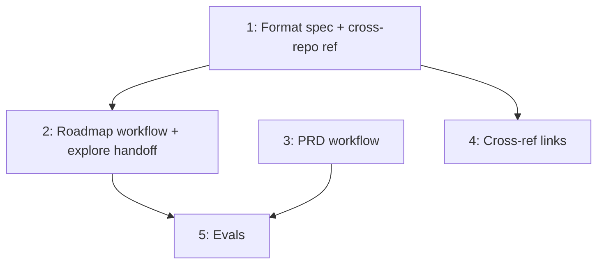

# PLAN: Artifact Traceability

## Status

Draft

## Scope Summary

Close the artifact traceability chain by adding `upstream` to roadmap
format, extending /roadmap and /prd to set upstream at creation time, and
documenting the cross-repo reference convention.

## Decomposition Strategy

Horizontal decomposition. All changes are markdown edits to skill files
with clear layer boundaries: format spec first (foundation), then workflow
changes (consumers), then cross-references (documentation), then evals.
No runtime integration risk.

## Issue Outlines

### Issue 1: docs(roadmap): add upstream field to roadmap format and create cross-repo reference

**Goal:** Add optional `upstream` field to roadmap frontmatter schema and
create the shared cross-repo reference convention document.

**Acceptance Criteria:**
- [ ] `skills/roadmap/references/roadmap-format.md` defines `upstream` as optional frontmatter field with VISION as expected target type
- [ ] `upstream` field documented alongside existing fields (status, theme, scope) with description and example
- [ ] `references/cross-repo-references.md` exists with: syntax (`owner/repo:path`), when to use, visibility rules, examples, anti-patterns
- [ ] Cross-repo reference doc explicitly states: public repos must not reference private artifacts
- [ ] No `private:` prefix in the convention

**Dependencies:** None

### Issue 2: docs(explore,roadmap): add upstream propagation to roadmap creation workflow

**Goal:** Update /explore roadmap handoff to pass `--upstream` when
invoking /roadmap, and update /roadmap to read `--upstream` and write it
to frontmatter.

**Acceptance Criteria:**
- [ ] `skills/explore/references/phases/phase-5-produce-roadmap.md` passes `--upstream <vision-path>` when invoking /roadmap, when a VISION was identified during exploration
- [ ] `skills/explore/references/phases/phase-5-produce-roadmap.md` omits `--upstream` when no VISION context exists
- [ ] `skills/roadmap/references/phases/phase-3-draft.md` reads `--upstream` from `$ARGUMENTS` and writes `upstream:` to frontmatter
- [ ] `skills/roadmap/references/phases/phase-3-draft.md` omits `upstream:` from frontmatter when `--upstream` is not provided
- [ ] `skills/roadmap/SKILL.md` documents the `--upstream` flag in its input/argument handling

**Dependencies:** Issue 1

### Issue 3: docs(prd): add upstream propagation to PRD creation workflow

**Goal:** Update /prd to read `--upstream` from arguments and write it to
frontmatter.

**Acceptance Criteria:**
- [ ] `skills/prd/references/phases/phase-3-draft.md` reads `--upstream` from `$ARGUMENTS` and writes `upstream:` to frontmatter
- [ ] `skills/prd/references/phases/phase-3-draft.md` omits `upstream:` from frontmatter when `--upstream` is not provided
- [ ] `skills/prd/SKILL.md` documents the `--upstream` flag in its input/argument handling

**Dependencies:** None

### Issue 4: docs(skills): add cross-repo reference links to format specs

**Goal:** Add cross-reference sentence to each format spec that documents
an upstream field, linking to the shared cross-repo reference convention.

**Acceptance Criteria:**
- [ ] `skills/vision/references/vision-format.md` has cross-reference sentence near upstream field docs
- [ ] `skills/prd/references/prd-format.md` has cross-reference sentence near upstream field docs
- [ ] `skills/design/SKILL.md` has cross-reference sentence near upstream field docs
- [ ] `skills/roadmap/references/roadmap-format.md` has cross-reference sentence near upstream field docs
- [ ] Cross-reference sentence reads: "For cross-repo upstream references, see `references/cross-repo-references.md`."

**Dependencies:** Issue 1

### Issue 5: chore(evals): update evals for modified skills

**Goal:** Update eval scenarios for roadmap, prd, and explore skills to
cover upstream propagation.

**Acceptance Criteria:**
- [ ] `skills/roadmap/evals/evals.json` has scenario testing upstream propagation via `--upstream` flag
- [ ] `skills/prd/evals/evals.json` has scenario testing upstream propagation via `--upstream` flag
- [ ] `skills/explore/evals/evals.json` has scenario testing roadmap handoff includes `--upstream` when VISION identified
- [ ] All evals pass when run via `scripts/run-evals.sh`

**Dependencies:** Issues 2, 3

## Dependency Graph

## Implementation Sequence

**Critical path:** Issue 1 -> Issue 2 -> Issue 5 (3 sequential steps)

**Parallelization:**
- After Issue 1: Issues 2, 3, and 4 can proceed in parallel
- After Issues 2 and 3: Issue 5 can proceed
- Issue 4 has no downstream dependencies and can land any time after Issue 1
