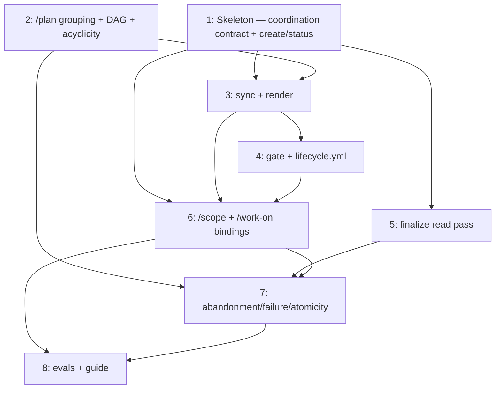

# PLAN: Coordinated Multi-Repo Orchestration

## Status

Active

Single-pr: the eight outlines below are implemented in one shirabe PR (no GitHub
milestone or issues). The coordination PR (#196) merges last, once the implementation
PR is in and the cascade has finalized the chain.

## Scope Summary

Implement the coordinated capability designed in DESIGN-capstone-orchestration: a canonical
contract reference, a pull-model `shirabe coordination` subcommand, `/plan` per-repo grouping
with an acyclic two-node merge-order DAG, a live-`gh` merge-last CI gate, a cross-repo
finalize read pass, coordination-aware `/scope` and `/work-on`, and the abandonment/failure/
atomicity edge handling.

## Decomposition Strategy

**Walking skeleton.** The design spans a Rust subcommand, `/plan`, the CI gate,
`finalize`, and two skills that interact at runtime, with high integration risk at the
cross-repo `gh` boundary. Issue 1 is a thin end-to-end slice (contract + minimal
create/status round-trip) that forces the integration path to surface first; every other
issue thickens one layer against it.

**Execution mode: single-pr.** The coordinated capability is one usable unit: it delivers
observable value only once the pieces are wired end-to-end (issue 6 binds the subcommand,
gate, and contract into `/scope` and `/work-on`). The earlier pieces are building blocks,
not independent increments, so neither named multi-pr escape applies — there is no hard
constraint forcing a split (it all builds on one branch), and only issue 2 is independently
useful to a reader. Per principle P1 (usable value is the unit), the whole capability ships
in one shirabe implementation PR; the coordination PR (#196) merges last.

The walking-skeleton decomposition below shapes the *work* (the order to build in), not the
*delivery* — all eight outlines are implemented within the single implementation PR, with
issue 1 landing first as the integration spine. (If review size later argues for a split,
issue 2 — the standalone `/plan` improvement — is the natural seam.)

## Issue Outlines

### Issue 1: Skeleton: coordination contract + minimal create/status round-trip
**Complexity**: critical
**Goal**: Author `references/coordination-strategy.md` (lifecycle: create-up-front → track →
finalize → merge-last; coarsest-legal-grouping rule; two-node merge-order DAG model;
done-signal; and the F1/F2/F4 hard rules) and a minimal `shirabe coordination create` +
`shirabe coordination status` that opens a docs-only coordination PR/branch, seeds the body from a
PLAN render, and reads one indexed PR via the existing `gh.rs` client.
**Acceptance Criteria**:
- `references/coordination-strategy.md` exists and states the lifecycle, grouping rule, DAG
  model, done-signal, and F1 (fail-closed private-identifier redaction), F2
  (`owner/repo:path` component validation), F4 (gate recomputes from live `gh`) as rules.
- `shirabe coordination create` opens a docs-only PR on a coordination branch with the seeded body
  (declaration, artifact-chain, PR-index, fenced merge-order block).
- `shirabe coordination status` reads an indexed PR via `gh.rs`, validates its `owner/repo:path`
  (F2), and renders the index redacting any private-repo identifier (F1).
- Unit test: a private-repo node fed into a public render produces only an opaque node id.
**Dependencies**: None

### Issue 2: `/plan` per-repo grouping + two-node DAG + acyclicity
**Complexity**: critical
**Goal**: Introduce the `coordinated` `execution_mode` value (schema + validator branch +
`/plan` emission), and add `repo` + `pr_group` tagging to `/plan`: collapse the issue-level
`waits_on` graph into a `(repo, pr_group)` PR DAG with non-PR gate nodes, run the
post-contraction acyclicity check (R13) with split-at-seam → re-sequence → stack resolution,
and serialize the two-node order (a `plan-to-tasks.sh` sibling).
**Acceptance Criteria**:
- `execution_mode: coordinated` is a recognized third value (`single-pr | multi-pr |
  coordinated`); the validator branches on it and a `coordinated`-mode PLAN validates.
- Issues carry validated `repo` + `pr_group` tags; default grouping is one PR per repo.
- Collapsing an issue DAG that would form a contraction cycle is detected and resolved or
  refused; no cyclic order is ever emitted (test: the X→Y→X contraction case).
- The R16-vs-R13 discriminator is applied (refuse only when no acyclic ordering exists
  after splitting).
- The serialized order includes non-PR gate nodes.
**Dependencies**: None

### Issue 3: `shirabe coordination sync` + merge-order recompute + PR-body render
**Complexity**: testable
**Goal**: `sync` refreshes the PR-index and recomputes the merge order from live `gh`,
rendering the merge-time canonical index + fenced order into the coordination PR body
(escaping `gh`-sourced titles, F3).
**Acceptance Criteria**:
- After an indexed PR changes state, `sync` updates the body index/order without a manual edit.
- The rendered body's authoritative fields derive from validated state, not free-text titles.
- Private-repo nodes stay redacted (F1) on every render.
**Dependencies**: <<ISSUE:1>>, <<ISSUE:2>>.

### Issue 4: `shirabe coordination gate` + `lifecycle.yml` merge-last check
**Complexity**: critical
**Goal**: `gate` recomputes "all indexed PRs merged + all upstreams terminal" from live
`gh api` (never PR-body text, F4), fails closed, and drives a strict-mode `lifecycle.yml`
check on the coordination PR pinned to `draft == false`.
**Acceptance Criteria**:
- The gate blocks the coordination PR while any indexed PR is unmerged; editing the PR body cannot
  make it pass (F4 test).
- An unresolvable indexed PR is treated as not-merged (fail closed).
- The check is pinned to strict-mode and cannot be skipped by toggling draft.
**Dependencies**: <<ISSUE:3>>.

### Issue 5: Cross-repo finalize read pass + `run-cascade.sh` single-origin relax
**Complexity**: testable
**Goal**: Add a `gh`-backed read pass to `finalize` that verifies cross-repo upstreams are
terminal (keeping the `Stop` wall for writes), and relax `run-cascade.sh`'s
`check_issue_closed` single-`origin` assumption.
**Acceptance Criteria**:
- Finalize verifies cross-repo upstreams are at terminal status read-only; it performs no
  cross-repo write.
- An incomplete/failed verification halts and the coordination PR does not merge (R21).
**Dependencies**: <<ISSUE:1>>.

### Issue 6: Coordination-aware `/scope` + `/work-on` + intent surface
**Complexity**: critical
**Goal**: Bind `/scope` and `/work-on` to the contract: detect coordination intent
(flag > CLAUDE.md-header > default), call `shirabe coordination create` up front and `sync` as
per-repo PRs progress, and announce smart-default activations with overrides (R18). Add the
grouping-policy + reviewability-ceiling workspace preferences (R2, R11).
**Acceptance Criteria**:
- With coordination intent, `/scope` creates the coordination PR up front; without it, behavior is
  unchanged (R3).
- Workspace default enables coordinated behavior; a per-invocation override to OFF suppresses it.
- Each smart default announces in output and is overridable (R18).
**Dependencies**: <<ISSUE:1>>, <<ISSUE:3>>, <<ISSUE:4>>.

### Issue 7: Abandonment, failure, and atomicity edge handling
**Complexity**: testable
**Goal**: Implement abandonment (close record without merging; force-materialize/mark
artifacts, R20), failure handling (halt + surface; no stale/partial state, R21), and
cross-repo atomicity detection + refusal with reshaping guidance (R16); enforce visibility
on all rendered/diagnostic paths (R15).
**Acceptance Criteria**:
- Abandoning closes the coordination PR without merging and documents the partial state.
- A failed coordination step halts and surfaces the error; the gate keeps the coordination PR unmerged.
- An atomicity requirement is refused with reshaping guidance, not silently planned.
**Dependencies**: <<ISSUE:2>>, <<ISSUE:5>>, <<ISSUE:6>>.

### Issue 8: Skill evals + adopter guide
**Complexity**: simple
**Goal**: Add/update evals for the changed skills (`/scope`, `/work-on`, `/plan`) and write
an adopter guide under `docs/guides/` covering coordination intent, the grouping preference, and
the merge-last lifecycle.
**Acceptance Criteria**:
- Evals exist and pass for the coordination-aware behaviors.
- A guide documents how to run a coordinated effort end-to-end.
**Dependencies**: <<ISSUE:6>>, <<ISSUE:7>>.

## Implementation Sequence

- **Build order within the implementation PR:** 1 → 3 → 4 → 6 → 7 → 8 (critical path), with
  issue 2 (`/plan` grouping) alongside issue 1 and issue 5 (finalize read pass) alongside
  issues 3–4. Issue 1 lands first as the integration spine.
- **Merge:** the eight outlines are implemented in one shirabe PR; the coordination PR (#196)
  merges last, once that PR is in and the cascade has finalized the chain.

Dependency edges (also declared per-outline above):

