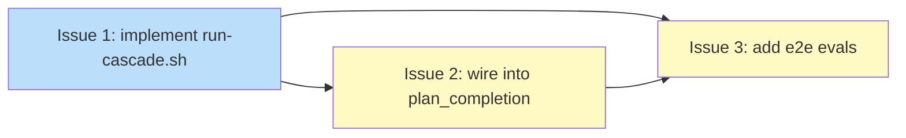

# PLAN: Completion Cascade

## Status

Draft

## Scope Summary

Automate the post-implementation artifact lifecycle sequence via a single shell script (`run-cascade.sh`) that walks the `upstream` frontmatter chain generically and calls existing per-skill transition scripts at each node. Replaces the hardcoded multi-step prose in the `plan_completion` koto directive.

## Decomposition Strategy

**Horizontal decomposition.** The design's three implementation phases map 1:1 to three issues with clear handoffs: the script must exist before it can be wired into the koto template, and both must exist before the eval fixtures can meaningfully test the integration. No walking skeleton is needed — there is no end-to-end integration risk between layers, and the phases have well-defined interfaces (script CLI, JSON output contract, fixture frontmatter).

## Issue Outlines

### Issue 1: feat(work-on): implement run-cascade.sh completion cascade script

**Goal**

Implement `skills/work-on/scripts/run-cascade.sh` with inline utilities, generic chain walker, per-node type dispatch, and JSON output contract; alongside `skills/work-on/scripts/run-cascade_test.sh` covering all five test scenarios.

**Acceptance Criteria**

- [ ] `skills/work-on/scripts/run-cascade.sh` exists and is executable
- [ ] Script accepts `[--push] <plan-doc-path>` as its CLI interface
- [ ] Script exits 0 and emits valid JSON for DESIGN→ROADMAP topology (no PRD)
- [ ] Script exits 0 and emits valid JSON for DESIGN→PRD→ROADMAP topology
- [ ] Emitted JSON matches the schema: `cascade_status` field (`completed | partial | skipped`) plus `steps` array with `action`, `target`, `found_in`, `status`, `detail` fields
- [ ] `get_frontmatter_field <field> <doc>` inlined: reads any YAML frontmatter field, outputs value or empty string, never exits non-zero
- [ ] `validate_upstream_path <path>` inlined: rejects paths outside `$REPO_ROOT` (realpath check), non-regular files, and untracked files (`git ls-files --error-unmatch`)
- [ ] `check_issue_closed <url>` inlined: parses URL components, validates owner/repo against `origin` remote, queries `gh issue view <N> --repo <owner/repo>`; returns 0 if closed, 1 if open or non-matching repo
- [ ] `strip_implementation_issues` inlined: idempotent `awk` strip of `## Implementation Issues` section; no-op if section absent
- [ ] `handle_design`: calls `strip_implementation_issues` then `skills/design/scripts/transition-status.sh <path> Current`, stages result
- [ ] `handle_prd`: calls `skills/prd/scripts/transition-status.sh <path> Done`, stages file
- [ ] `handle_roadmap`: locates feature entry via `grep -F <plan-slug>` on `**Downstream:**` fields; updates `**Status:**` and `**Downstream:**` using `awk ENVIRON`; guards ROADMAP Done transition via `check_issue_closed`; records `skipped` with prescribed message when feature not found
- [ ] All ROADMAP text substitutions use `awk` with `ENVIRON["varname"]` (not `-v`)
- [ ] Without `--push`, script stages changes and prints per-file before/after status summary but does not commit or push
- [ ] With `--push`, script commits and pushes: `chore(cascade): post-implementation artifact transitions`
- [ ] Each `failed` or `skipped` step includes a `detail` message matching the error contract table in the design doc
- [ ] VISION-* nodes terminate the chain without emitting a step entry
- [ ] Unknown filename prefix emits `partial` status with the prescribed message and stops chain walk
- [ ] `skills/work-on/scripts/run-cascade_test.sh` exists and is executable
- [ ] Test harness covers all 5 scenarios: DESIGN→ROADMAP, DESIGN→PRD→ROADMAP, idempotency, missing upstream (`cascade_status: skipped`), partial chain (`cascade_status: partial`)
- [ ] All 5 test scenarios pass when `run-cascade_test.sh` is executed

**Dependencies**: None

---

### Issue 2: feat(work-on): wire run-cascade.sh into plan_completion directive

**Goal**

Replace the multi-step plan_completion prose in `skills/work-on/koto-templates/work-on-plan.md` with a single `run-cascade.sh --push {{PLAN_DOC}}` invocation, and update `skills/work-on/SKILL.md` to reference the script.

**Acceptance Criteria**

- [ ] `plan_completion` directive in `skills/work-on/koto-templates/work-on-plan.md` invokes `run-cascade.sh --push {{PLAN_DOC}}` as its primary action
- [ ] Directive reads the JSON output from `run-cascade.sh` and uses `cascade_status` and `steps` to determine what to submit to koto
- [ ] A comment in the directive points maintainers to `run-cascade.sh`
- [ ] Directive handles all three `cascade_status` values (`completed`, `partial`, `skipped`) and routes all to the `done` koto state
- [ ] `skills/work-on/SKILL.md` Completion Cascade section references `run-cascade.sh` rather than listing manual cascade steps
- [ ] No other changes to `work-on-plan.md` beyond the plan_completion directive

**Dependencies**: Issue 1

---

### Issue 3: test(work-on): add e2e evals for completion cascade

**Goal**

Create 6 fixture files for two chain topologies, add 2 Tier 2 execute-mode eval scenarios to `skills/work-on/evals/evals.json`, and update eval #26 to assert that `plan_completion` invokes `run-cascade.sh --push` rather than individual manual steps.

**Acceptance Criteria**

- [ ] `skills/work-on/evals/fixtures/plans/PLAN-cascade-test-short.md` exists with valid PLAN frontmatter and `upstream: skills/work-on/evals/fixtures/designs/DESIGN-cascade-test-short.md`
- [ ] `skills/work-on/evals/fixtures/designs/DESIGN-cascade-test-short.md` exists with status `Planned` and `upstream: skills/work-on/evals/fixtures/roadmaps/ROADMAP-cascade-test.md`
- [ ] `skills/work-on/evals/fixtures/plans/PLAN-cascade-test-full.md` exists with valid PLAN frontmatter and `upstream: skills/work-on/evals/fixtures/designs/DESIGN-cascade-test-full.md`
- [ ] `skills/work-on/evals/fixtures/designs/DESIGN-cascade-test-full.md` exists with status `Planned` and `upstream: skills/work-on/evals/fixtures/prds/PRD-cascade-test-full.md`
- [ ] `skills/work-on/evals/fixtures/prds/PRD-cascade-test-full.md` exists with status `Accepted` and `upstream: skills/work-on/evals/fixtures/roadmaps/ROADMAP-cascade-test.md`
- [ ] `skills/work-on/evals/fixtures/roadmaps/ROADMAP-cascade-test.md` exists with two feature entries whose `**Downstream:**` fields reference `cascade-test-short` and `cascade-test-full` plan slugs; all other features at `**Status:** Done`
- [ ] All 6 fixture files are tracked by git
- [ ] `skills/work-on/evals/evals.json` contains `e2e-cascade-design-roadmap` Tier 2 eval asserting: DESIGN→Current, ROADMAP feature updated, `cascade_status: completed`
- [ ] `skills/work-on/evals/evals.json` contains `e2e-cascade-design-prd-roadmap` Tier 2 eval asserting: DESIGN→Current, PRD→Done, ROADMAP feature updated, `cascade_status: completed`
- [ ] `skills/work-on/evals/evals.json` eval #26 Tier 1 assertion updated: "agent invokes `run-cascade.sh --push {{PLAN_DOC}}` as the plan_completion step rather than executing the cascade steps individually"
- [ ] Both new Tier 2 evals pass when run via `scripts/run-evals.sh work-on`

**Dependencies**: Issue 1, Issue 2

---

## Dependency Graph

**Legend**: Green = done, Blue = ready, Yellow = blocked, Purple = needs-design, Orange = tracks-design/tracks-plan

## Implementation Sequence

**Critical path**: Issue 1 → Issue 2 → Issue 3 (length: 3)

**No parallelization available** — the three issues form a strict serial chain. Each phase depends on the previous phase's deliverables.

**Recommended order**:
1. Implement `run-cascade.sh` and `run-cascade_test.sh` (Issue 1). This is the foundation — all other issues depend on the script existing and behaving correctly.
2. Wire the script into the `plan_completion` directive and update `SKILL.md` (Issue 2). Requires the script path to be stable.
3. Create fixtures and evals (Issue 3). Requires stable script behavior for fixture-based assertions and the updated directive for the eval #26 assertion.
