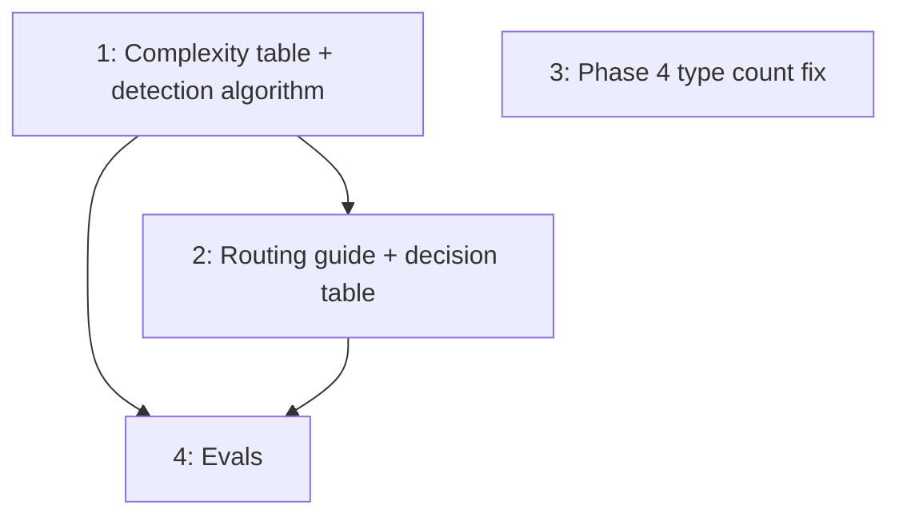

# PLAN: Complexity Routing Expansion

## Status

Draft

## Scope Summary

Expand /explore's complexity routing from 3 levels to 5, add a detection
algorithm with tiebreaker rules, update the routing guide and decision
table for consistency, and fix Phase 4's stale type count.

## Decomposition Strategy

Horizontal decomposition. All changes are markdown edits to /explore skill
files with clear section boundaries. The complexity table is the foundation;
other routing sections and Phase 4 follow from it.

## Issue Outlines

### Issue 1: docs(explore): expand complexity-based routing table to 5 levels

**Goal:** Replace the 3-row complexity table with the 5-row table from
the design and add the detection algorithm subsection with embedded
tiebreaker rules.

**Acceptance Criteria:**
- [ ] Complexity-Based Routing table has 5 rows: Trivial, Simple, Medium, Complex, Strategic
- [ ] Each row has observable signals and a recommended command path
- [ ] Simple, Medium, Complex rows preserve their current signal language
- [ ] Detection Algorithm subsection exists below the table with ordered checklist (Strategic first, Trivial last)
- [ ] Tiebreaker rules embedded at all 4 boundaries within the checklist steps
- [ ] Default step (step 6) routes to Simple

**Dependencies:** None

### Issue 2: docs(explore): update routing guide and decision table for 5 levels

**Goal:** Add strategic row to Artifact Type Routing Guide and
trivial + strategic entries to Quick Decision Table.

**Acceptance Criteria:**
- [ ] Artifact Type Routing Guide has a strategic row routing to `/explore --strategic`
- [ ] Existing "This is simple, just do it" row is consistent with Trivial level signals
- [ ] Quick Decision Table has a trivial entry ("Do I need any artifact at all?")
- [ ] Quick Decision Table has a strategic entry ("Should this project exist?")

**Dependencies:** Issue 1

### Issue 3: docs(explore): fix Phase 4 stale type count

**Goal:** Update Phase 4 crystallize step to reflect actual supported type
count and ensure VISION appears in the type list.

**Acceptance Criteria:**
- [ ] Type count in `skills/explore/references/phases/phase-4-crystallize.md` matches the crystallize framework's actual count
- [ ] VISION appears in the supported types list
- [ ] No scoring or signal changes (mechanical fix only)

**Dependencies:** None

### Issue 4: chore(evals): add complexity classification eval scenarios

**Goal:** Add eval scenarios testing complexity classification at boundary
levels.

**Acceptance Criteria:**
- [ ] `skills/explore/evals/evals.json` has scenario testing Trivial classification (fire-and-forget request)
- [ ] `skills/explore/evals/evals.json` has scenario testing Strategic classification (multi-feature / project inception request)
- [ ] All evals pass when run via `scripts/run-evals.sh`

**Dependencies:** Issues 1, 2

## Dependency Graph

## Implementation Sequence

**Critical path:** Issue 1 -> Issue 2 -> Issue 4 (3 sequential steps)

**Parallelization:**
- Issue 3 is independent and can land any time
- After Issue 1: Issues 2 and 3 can proceed in parallel
- After Issues 1 and 2: Issue 4 can proceed
