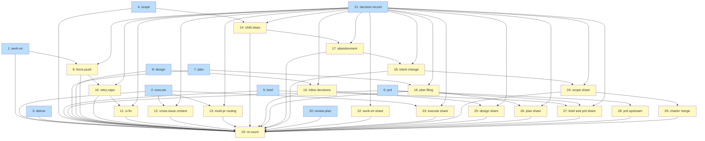

# PLAN: Contradiction Settlement

## Status

Active

## Scope Summary

Settle the 48 contradictions and remove the dead prose inventoried in
`docs/designs/DESIGN-contradiction-settlement.md`: nine per-skill items apply
the 38 mechanical winners and the dead-prose deletions, ten items each apply
one policy decision once it is recorded, and a final item re-counts every
profile against the baseline pin.

## Decomposition Strategy

**Horizontal, by skill.** A skill's SKILL.md, template and references change
together, so each mechanical item owns one skill's identifiers and one
reviewer reads one skill's diff. Each policy item owns exactly one policy
identifier, plus any mechanical or dead-prose entry that cannot land before
that decision, so a later feature can wait on the one identifier it needs.
Every identifier and dead-prose entry named below is defined, with its
locations and excerpts, in the DESIGN.

Rules every item follows:

- It starts only after the `baseline-pin` gate: pull request #488 has merged.
- It re-finds each span by the DESIGN's excerpt, not the line number. When an
  excerpt is missing or appears more than once, the item stops, reports the
  identifier, and leaves the other items unaffected.
- After it lands, each covered mechanical identifier's losing text is gone or
  rewritten to match the winner, the winner's text is still present, and each
  covered duplicate is down to its named survivor.
- It deletes nothing listed under "Withholding candidates (out of this
  feature)" in the DESIGN, and it does not touch the carve-out section of
  `references/fixes/sub-agent-dispatch.md`, which is handled separately.
- A policy item starts only after its decision is recorded: a file
  `docs/decisions/DECISION-contradiction-<identifier>-<YYYY-MM-DD>.md`
  carrying the policy owner's answer, merged to `main` by a person. Issue 21
  drafts all ten in one pull request; no agent merges it. Every item that
  applies a decision is blocked by Issue 21, and until it merges the policy
  statements stay as they are at `662f6ec`.
- Each statement lands in the pull request of the skill whose directory
  holds its file. Where an identifier has statements in several skills, the
  other skills' share is its own item in that skill's group, under the same
  identifier. A statement in a shared file under `references/` lands with the
  item that "Batching into pull requests" below names for it.

### Batching into pull requests

The items land in ten pull requests rather than twenty. Each carries one
skill's mechanical items and every policy item that edits that skill:

| Pull request (group) | Items | Waits on |
|---|---|---|
| `decisions` | 21 | nothing |
| `brief-prd-deliver` | 3, 5, 6 | nothing |
| `review-plan` | 20 | nothing |
| `work-on` | 1, 9, 10, 11, 22 | `decisions` |
| `execute` | 2, 12, 13, 23 | `decisions` |
| `scope` | 4, 14, 17, 18, 24, 29 | `decisions` |
| `design` | 8, 15, 25 | `decisions` |
| `plan` | 7, 16, 26 | `decisions` |
| `brief-prd-policy` | 27, 28 | `decisions`, `brief-prd-deliver` |
| `measure` | 19 | every other pull request |

Why batch:

- **Live sessions.** At most two work sessions run at once, so twenty
  pull requests would queue for most of the run.
- **Review cost.** Each merge takes a reviewer panel; ten merges cost half
  what twenty do, and one reviewer still reads one skill's diff.
- **Fewer stalls.** The coordinated run can't pass a gate node (#484), so
  every gate is a stop a person has to clear by hand. Batching leaves no gate:
  every wait is on a pull request merging, which the run reads for itself.
- **Fewer template versions.** Each change to a koto template starts a new
  version whose runs form their own small measurement population; one change
  per skill keeps that count low.

How the dependencies changed to allow it, since a wait can't sit inside one
pull request:

- **The ten decision gates become Issue 21.** Batched, each gate would fall
  between two items of the same pull request. Issue 21 drafts all ten decision
  files in one pull request, and every item that applies a decision is
  blocked by it. The condition is unchanged: a person merges the record.
- **Cross-skill items are split by skill.** Issue 9 was blocked by Issue 2,
  Issue 15 by Issue 14, Issue 16 by Issue 14 and Issue 17 by Issue 16, because they
  shared files across skills, which made the batched pull requests wait on
  each other in a cycle. Each statement now lands in its own skill's pull
  request (Issues 22 to 27 carry the shares), so no two skill pull requests
  edit the same file and none waits on another.
- **Shared references.** `references/worktree-discipline.md` and
  `references/koto-session-retention.md` land in the `work-on` pull request,
  and `references/fixes/sub-agent-dispatch.md` in the `scope` one, so each has
  one editor. With that, Issue 2 no longer waits on Issue 1: the one file they
  shared, `skills/execute/koto-templates/execute.md`, now changes only in the
  `execute` pull request (Issue 23).
- **`/brief` and `/prd`'s policy share gets its own pull request** (Issue 27),
  so the mechanical `brief-prd-deliver` one doesn't wait on the decisions.
- **`skills/writing-style/`** changes in the `brief-prd-deliver` pull
  request, since the text there is /brief's jury prompt (Issue 5).
- **Issue 19** counts every landed item, so it waits on all of them.
- **Plan-issue filing.** The recorded gate on filing lands in /scope's plan
  hop only: no coordinated /execute state runs /plan.
- **Introspection evidence.** Issue 1 deletes the part of
  `wh-work-on-introspection-evidence` that koto's evidence schema already
  delivers (the outcome values and the rationale's description), since text
  restating what koto enforces is dead prose rather than a rule's only
  statement. The rest stays a withholding candidate.

## Issue Outlines

### Issue 1: docs(work-on): settle /work-on's mechanical contradictions and dead prose

**Repo**: tsukumogami/shirabe

**Group**: work-on

**Goal**: Apply the winners of the /work-on mechanical items and delete the /work-on dead prose, without changing any policy item's statements.

**Acceptance Criteria**:
- [ ] Follows the PLAN's rules: its pull request opens only after pull request #488 has merged; it finds every span by the DESIGN's excerpt and stops, reporting the identifier, when an excerpt is missing or appears twice; and it leaves unchanged every withholding candidate, every mechanical winner, and every policy statement other than its own.
- [ ] Covers `panel-round-counter`, `panel-retry-fix-location`, `decision-recording-channel`, `commit-koto-context-artifacts`, `scratch-file-path`, `panel-detail-files-in-wip`, `implementation-escalate-outcome`, `plan-backed-init-mode`, `deferral-pr-body-pointer`, `decision-point-ids-unresolvable`, `retention-doc-runtime-status`, `pr-body-check-count` and `pr-body-rule-restated-inline`, each resolved to the DESIGN's winner.
- [ ] Deletes the spans of `dp-work-on-retry-rationale-copies`, `dp-work-on-pointer-loaded-docs`, `dp-work-on-rationale`, `dp-work-on-duplicates`, `dp-work-on-missing-files` and `dp-work-on-koto-restated`, keeping each named survivor.
- [ ] `references/decision-protocol.md` keeps its recording section and gains a clause saying koto-driven skills record through `koto decisions record`.
- [ ] The statement of `pr-body-rule-restated-inline` in `skills/execute/` is left to Issue 23.
- [ ] The spans of `wh-work-on-retry-clearing-blocks` are unchanged, and `skills/work-on/scripts/retry-clearing_test.sh` passes. Of `wh-work-on-introspection-evidence`, only the text koto's evidence schema already delivers (the outcome values and the rationale's description) is deleted; the remainder is unchanged.
- [ ] The repository's work-on tests and evals pass.

**Dependencies**: None

### Issue 2: docs(execute): settle /execute's mechanical contradictions and dead prose

**Repo**: tsukumogami/shirabe

**Group**: execute

**Goal**: Apply the winners of the /execute mechanical items and delete the /execute dead prose that no open decision holds back.

**Acceptance Criteria**:
- [ ] Follows the PLAN's rules: its pull request opens only after pull request #488 has merged; it finds every span by the DESIGN's excerpt and stops, reporting the identifier, when an excerpt is missing or appears twice; and it leaves unchanged every withholding candidate, every mechanical winner, and every policy statement other than its own.
- [ ] Covers `worktree-discipline-vs-drift-state`, `execute-pr-title-type`, `execute-state-file-projection`, `execute-sentinel-no-reader`, `execution-children-described-as-prs`, `execute-exit-artifacts-not-produced` and `no-cleanup-on-child-ticks`, each resolved to the DESIGN's winner.
- [ ] The statements of `worktree-discipline-vs-drift-state` and `no-cleanup-on-child-ticks` in `skills/work-on/` and `references/`, and the `skills/work-on/` spans of `dp-execute-pointer-loaded-refs`, are left to Issue 22.
- [ ] Deletes the spans of `dp-execute-skill-duplicates-template`, `dp-execute-skill-rationale`, `dp-execute-skill-dead-mechanisms`, `dp-execute-skill-koto-restated`, `dp-execute-template` and `dp-execute-pointer-loaded-refs`, keeping each named survivor.
- [ ] The pointer to `phase-6-pr.md` at `execute.md` ci_monitor is left to Issue 23, and the spans of `wh-execute-d5-rule` are unchanged.
- [ ] The repository's execute tests and evals pass.

**Dependencies**: None

### Issue 3: docs(deliver): settle /deliver's merged claim and dead prose

**Repo**: tsukumogami/shirabe

**Group**: brief-prd-deliver

**Goal**: Qualify /deliver's merged claim and delete its dead prose, keeping the caller leg contract.

**Acceptance Criteria**:
- [ ] Follows the PLAN's rules: its pull request opens only after pull request #488 has merged; it finds every span by the DESIGN's excerpt and stops, reporting the identifier, when an excerpt is missing or appears twice; and it leaves unchanged every withholding candidate, every mechanical winner, and every policy statement other than its own.
- [ ] Covers `deliver-merged-claim`, resolved to the DESIGN's winner.
- [ ] Deletes the spans of `dp-deliver-skill`; the leg contract listed as `wh-deliver-leg-contract` is unchanged.
- [ ] The repository's deliver tests and evals pass.

**Dependencies**: None

### Issue 4: docs(scope): settle /scope's mechanical contradictions and dead prose

**Repo**: tsukumogami/shirabe

**Group**: scope

**Goal**: Apply the winners of the /scope mechanical items and delete the /scope dead prose, including shared parent-skill references the /scope profile loads.

**Acceptance Criteria**:
- [ ] Follows the PLAN's rules: its pull request opens only after pull request #488 has merged; it finds every span by the DESIGN's excerpt and stops, reporting the identifier, when an excerpt is missing or appears twice; and it leaves unchanged every withholding candidate, every mechanical winner, and every policy statement other than its own.
- [ ] Covers `scope-reference-table-vs-lazy-load`, `scope-state-initial-values`, `r6-verdicts-no-reader`, `phase1-undocumented-state-field` and `design-planned-transition-uncommitted`, each resolved to the DESIGN's winner.
- [ ] The statement of `design-planned-transition-uncommitted` in `skills/plan/` is left to Issue 26.
- [ ] For `scope-state-initial-values`, the test fixtures and the eval that use `phase-1` or `UNSET` move to the probe's shape, and `resume-probe_test.sh` passes.
- [ ] Deletes the spans of `dp-scope-history`, `dp-scope-rationale`, `dp-scope-duplicates`, `dp-scope-no-reader` and `dp-scope-koto-restated`, keeping each named survivor and the span listed as `wh-scope-no-floor-guard`.
- [ ] The repository's scope tests and evals pass.

**Dependencies**: None

### Issue 5: docs(brief): settle /brief's contradictions and dead prose

**Repo**: tsukumogami/shirabe

**Group**: brief-prd-deliver

**Goal**: Correct /brief's upstream rule and the claim that mechanical terms are caught before the jury, and delete /brief's history prose.

**Acceptance Criteria**:
- [ ] Follows the PLAN's rules: its pull request opens only after pull request #488 has merged; it finds every span by the DESIGN's excerpt and stops, reporting the identifier, when an excerpt is missing or appears twice; and it leaves unchanged every withholding candidate, every mechanical winner, and every policy statement other than its own.
- [ ] Covers `brief-upstream-legal-parents` and `fc10-already-caught`, each resolved to the DESIGN's winner; the structural reviewer's prompt tells it to check the mechanical terms itself.
- [ ] The `skills/writing-style/` statements of `fc10-already-caught` and spans of `dp-brief-history` land here too: they are /brief's jury text, so this pull request is the one exception to one skill per pull request besides the brief, prd and deliver grouping itself.
- [ ] Deletes the spans of `dp-brief-history` and `dp-brief-internal-restatements`, keeping each named survivor.
- [ ] The repository's brief and writing-style tests and evals pass.

**Dependencies**: None

### Issue 6: docs(prd): add the schema field to the PRD format

**Repo**: tsukumogami/shirabe

**Group**: brief-prd-deliver

**Goal**: Make a PRD written from the format reference pass /scope's hop gate, and delete /prd's internal restatements.

**Acceptance Criteria**:
- [ ] Follows the PLAN's rules: its pull request opens only after pull request #488 has merged; it finds every span by the DESIGN's excerpt and stops, reporting the identifier, when an excerpt is missing or appears twice; and it leaves unchanged every withholding candidate, every mechanical winner, and every policy statement other than its own.
- [ ] Covers `prd-format-schema-field`: the frontmatter example and the required-fields sentence in `skills/prd/references/prd-format.md` include `schema: prd/v1`.
- [ ] Covers `prd-complexity-routing`: `skills/prd/SKILL.md`'s Output table has three rows, simple (file an issue, then /work-on), medium (/plan) and complex (/design), matching Phase 4.
- [ ] Deletes the spans of `dp-prd-internal-restatements`, keeping each named survivor.
- [ ] The repository's prd tests and evals pass.

**Dependencies**: None

### Issue 7: docs(plan): settle /plan's mechanical contradictions and dead prose

**Repo**: tsukumogami/shirabe

**Group**: plan

**Goal**: Align /plan's PLAN status, complexity values and required sections with the validator, and delete /plan's dead prose.

**Acceptance Criteria**:
- [ ] Follows the PLAN's rules: its pull request opens only after pull request #488 has merged; it finds every span by the DESIGN's excerpt and stops, reporting the identifier, when an excerpt is missing or appears twice; and it leaves unchanged every withholding candidate, every mechanical winner, and every policy statement other than its own.
- [ ] Covers `plan-single-pr-draft-commit`, `plan-complexity-values` and `plan-required-sections`, each resolved to the DESIGN's winner; FC11's message names `references/issues-table.md`, and the validator's tests pass.
- [ ] Deletes the spans of `dp-plan-history`, `dp-plan-rationale`, `dp-plan-duplicates`, `dp-plan-koto-restated` and `dp-plan-internal-restatements`, keeping each named survivor.
- [ ] The repository's plan tests and evals pass.

**Dependencies**: None

### Issue 8: docs(design): settle /design's mechanical contradictions and dead prose

**Repo**: tsukumogami/shirabe

**Group**: design

**Goal**: Align /design's spawned_from shape and superseded location with what runs, and delete /design's dead prose.

**Acceptance Criteria**:
- [ ] Follows the PLAN's rules: its pull request opens only after pull request #488 has merged; it finds every span by the DESIGN's excerpt and stops, reporting the identifier, when an excerpt is missing or appears twice; and it leaves unchanged every withholding candidate, every mechanical winner, and every policy statement other than its own.
- [ ] Covers `design-spawned-from-shape` and `design-superseded-location`, each resolved to the DESIGN's winner.
- [ ] `skills/design/SKILL.md` lines 221 to 243, a policy statement held for Issue 25, are unchanged by this item.
- [ ] Deletes the spans of `dp-design-rationale`, `dp-design-duplicates` and `dp-design-internal-restatements`, keeping each named survivor.
- [ ] The repository's design tests and evals pass.

**Dependencies**: None

### Issue 9: docs(work-on): apply the force-push-after-rebase decision

**Repo**: tsukumogami/shirabe

**Group**: work-on

**Goal**: Make the chosen option the single statement of force-push-after-rebase in every file the DESIGN lists for it.

**Acceptance Criteria**:
- [ ] Follows the PLAN's rules: its pull request opens only after pull request #488 has merged; it finds every span by the DESIGN's excerpt and stops, reporting the identifier, when an excerpt is missing or appears twice; and it leaves unchanged every withholding candidate, every mechanical winner, and every policy statement other than its own.
- [ ] Covers `force-push-after-rebase` only, in `skills/work-on/` and `references/worktree-discipline.md`; every listed statement now states the recorded option, or is deleted when another statement carries it. The `skills/execute/` statements are Issue 23's and the `skills/scope/` statements Issue 24's.
- [ ] The repository's work-on and execute tests and evals pass.

**Dependencies**: Blocked by <<ISSUE:1>>, <<ISSUE:21>>

### Issue 10: docs(work-on): apply the retry-caps decision

**Repo**: tsukumogami/shirabe

**Group**: work-on

**Goal**: State each retry cap once, as decided, and drop /execute's pointer to /work-on's PR phase file. The caps stated in directives are temporary: when koto enforces retry caps from its attempt counts, the numbers stay the same and that prose becomes a deletion candidate.

**Acceptance Criteria**:
- [ ] Follows the PLAN's rules: its pull request opens only after pull request #488 has merged; it finds every span by the DESIGN's excerpt and stops, reporting the identifier, when an excerpt is missing or appears twice; and it leaves unchanged every withholding candidate, every mechanical winner, and every policy statement other than its own.
- [ ] Covers `retry-caps` in `skills/work-on/`; every listed statement now states the recorded caps, or is deleted when another statement carries them.
- [ ] The `skills/execute/` side, `phase-6-pr-shared-with-execute` and `dp-execute-phase-6-pointer` (/execute's ci_monitor no longer points at `phase-6-pr.md`), is Issue 23's.
- [ ] The repository's work-on and execute tests and evals pass.

**Dependencies**: Blocked by <<ISSUE:9>>, <<ISSUE:21>>

### Issue 11: docs(work-on): apply the ci-fix-ends-run-unverified decision

**Repo**: tsukumogami/shirabe

**Group**: work-on

**Goal**: Make /work-on's CI routing and its CI promise agree, as decided, and unload the finishing-obligations document.

**Acceptance Criteria**:
- [ ] Follows the PLAN's rules: its pull request opens only after pull request #488 has merged; it finds every span by the DESIGN's excerpt and stops, reporting the identifier, when an excerpt is missing or appears twice; and it leaves unchanged every withholding candidate, every mechanical winner, and every policy statement other than its own.
- [ ] Covers `ci-fix-ends-run-unverified`; the template routing or the prose changes as the recorded option says.
- [ ] Covers `dp-work-on-finishing-obligations-pointer`: the pointer at `work-on.md` finalization is removed.
- [ ] The repository's work-on tests and evals pass.

**Dependencies**: Blocked by <<ISSUE:10>>, <<ISSUE:21>>

### Issue 12: docs(execute): apply the cross-issue-context decision

**Repo**: tsukumogami/shirabe

**Group**: execute

**Goal**: Delete the cross-issue context step or wire a reader for it, as decided.

**Acceptance Criteria**:
- [ ] Follows the PLAN's rules: its pull request opens only after pull request #488 has merged; it finds every span by the DESIGN's excerpt and stops, reporting the identifier, when an excerpt is missing or appears twice; and it leaves unchanged every withholding candidate, every mechanical winner, and every policy statement other than its own.
- [ ] Covers `cross-issue-context-no-consumer` in `skills/execute/`: no loaded file tells the agent to build `current-context.md`, and earlier children's summaries are readable through koto calls, as the recorded option says. The /work-on reader is Issue 22's.
- [ ] The repository's execute and work-on tests and evals pass.

**Dependencies**: Blocked by <<ISSUE:2>>, <<ISSUE:21>>

### Issue 13: docs(execute): apply the multi-pr routing decision

**Repo**: tsukumogami/shirabe

**Group**: execute

**Goal**: Make /execute's handling of multi-pr PLANs match its SKILL.md, as decided.

**Acceptance Criteria**:
- [ ] Follows the PLAN's rules: its pull request opens only after pull request #488 has merged; it finds every span by the DESIGN's excerpt and stops, reporting the identifier, when an excerpt is missing or appears twice; and it leaves unchanged every withholding candidate, every mechanical winner, and every policy statement other than its own.
- [ ] Covers `multi-pr-plan-routing`; `execute-open.sh` and `skills/execute/SKILL.md` agree on whether a multi-pr PLAN runs, with a test for the chosen behavior.
- [ ] The repository's execute tests and evals pass.

**Dependencies**: Blocked by <<ISSUE:2>>, <<ISSUE:21>>

### Issue 14: docs(scope): apply the child-steps-under-scope decision

**Repo**: tsukumogami/shirabe

**Group**: scope

**Goal**: Make the child skills' approval, push and pull-request steps under /scope match the decision, and the dispatch reference describe them.

**Acceptance Criteria**:
- [ ] Follows the PLAN's rules: its pull request opens only after pull request #488 has merged; it finds every span by the DESIGN's excerpt and stops, reporting the identifier, when an excerpt is missing or appears twice; and it leaves unchanged every withholding candidate, every mechanical winner, and every policy statement other than its own.
- [ ] Covers `child-steps-under-scope` in `skills/scope/` and `references/fixes/sub-agent-dispatch.md`, which state the recorded option, leaving that file's carve-out section untouched. The child skills' own steps are Issues 25 (/design), 26 (/plan) and 27 (/brief and /prd).
- [ ] `design-implementation-issues-owner`, whose statements sit in `skills/design/` and `skills/plan/`, lands in Issues 25 and 26.
- [ ] The repository's scope, brief, prd, design and plan tests and evals pass.

**Dependencies**: Blocked by <<ISSUE:4>>, <<ISSUE:21>>

### Issue 15: docs(design): apply the inline-decision fallback decision

**Repo**: tsukumogami/shirabe

**Group**: design

**Goal**: Delete /design's inline-decision fallback or make its condition checkable, as decided.

**Acceptance Criteria**:
- [ ] Follows the PLAN's rules: its pull request opens only after pull request #488 has merged; it finds every span by the DESIGN's excerpt and stops, reporting the identifier, when an excerpt is missing or appears twice; and it leaves unchanged every withholding candidate, every mechanical winner, and every policy statement other than its own.
- [ ] Covers `design-inline-decision-fallback` in `skills/design/`: /design's Phase 2 and the format reference state the recorded option. The dispatch reference and the /scope fixture are Issue 24's.
- [ ] The repository's design and scope tests and evals pass.

**Dependencies**: Blocked by <<ISSUE:8>>, <<ISSUE:21>>

### Issue 16: docs(plan): apply the issue-filing-under-auto decision

**Repo**: tsukumogami/shirabe

**Group**: plan

**Goal**: Make /plan's filing paths follow its approval rule, as decided.

**Acceptance Criteria**:
- [ ] Follows the PLAN's rules: its pull request opens only after pull request #488 has merged; it finds every span by the DESIGN's excerpt and stops, reporting the identifier, when an excerpt is missing or appears twice; and it leaves unchanged every withholding candidate, every mechanical winner, and every policy statement other than its own.
- [ ] Covers `plan-issue-filing-under-auto` in `skills/plan/`; every /plan path that files issues or a milestone states the recorded option for a direct run. The koto gate in /scope's plan hop and /scope's list of gh writes are Issue 24's.
- [ ] The repository's plan and scope tests and evals pass.

**Dependencies**: Blocked by <<ISSUE:7>>, <<ISSUE:21>>

### Issue 17: docs(scope): apply the abandonment-exit decision

**Repo**: tsukumogami/shirabe

**Group**: scope

**Goal**: Make /scope's abandonment exit agree with the lifecycle check, as decided.

**Acceptance Criteria**:
- [ ] Follows the PLAN's rules: its pull request opens only after pull request #488 has merged; it finds every span by the DESIGN's excerpt and stops, reporting the identifier, when an excerpt is missing or appears twice; and it leaves unchanged every withholding candidate, every mechanical winner, and every policy statement other than its own.
- [ ] Covers `scope-abandonment-draft-plan` in `skills/scope/`; an abandonment exit no longer leaves a committed Draft PLAN that fails L01, in the way the recorded option says. The `skills/plan/SKILL.md` statement is Issue 26's.
- [ ] The repository's scope tests and evals pass.

**Dependencies**: Blocked by <<ISSUE:14>>, <<ISSUE:21>>

### Issue 18: docs(scope): apply the intent-change decision

**Repo**: tsukumogami/shirabe

**Group**: scope

**Goal**: State who judges an intent-changing rebase under /scope, as decided.

**Acceptance Criteria**:
- [ ] Follows the PLAN's rules: its pull request opens only after pull request #488 has merged; it finds every span by the DESIGN's excerpt and stops, reporting the identifier, when an excerpt is missing or appears twice; and it leaves unchanged every withholding candidate, every mechanical winner, and every policy statement other than its own.
- [ ] Covers `worktree-intent-change-owner`; `skills/scope/SKILL.md` and the Phase 2 reference state the recorded option.
- [ ] The repository's scope tests and evals pass.

**Dependencies**: Blocked by <<ISSUE:17>>, <<ISSUE:21>>

### Issue 19: docs(measurement): re-count every profile against the baseline pin

**Repo**: tsukumogami/shirabe

**Group**: measure

**Goal**: Measure what the landed items removed from each profile's load.

**Acceptance Criteria**:
- [ ] Follows the PLAN's rules: its pull request opens only after pull request #488 has merged; it finds every span by the DESIGN's excerpt and stops, reporting the identifier, when an excerpt is missing or appears twice; and it leaves unchanged every withholding candidate, every mechanical winner, and every policy statement other than its own.
- [ ] Re-runs the baseline pin's count for `work-on`, `execute-single-pr`, `execute-coordinated`, `deliver` and `scope`, and records the before and after raw figures beside the DESIGN's dead-prose estimate less the withholding candidates and less the spans of any policy item still undecided.
- [ ] Reports each profile twice: with the pinned load manifest as it is, and with the rows removed for files that profile no longer loads after the landed items (dropped pointers, and the reference table `scope-reference-table-vs-lazy-load` corrects), since the pinned manifest keeps counting a file whose pointer is gone.
- [ ] Explains, per entry, any shortfall over 10% of that estimate.
- [ ] Changes no file under `skills/`, `references/`, `scripts/` or `crates/`.

**Dependencies**: Blocked by <<ISSUE:1>>, <<ISSUE:2>>, <<ISSUE:3>>, <<ISSUE:4>>, <<ISSUE:5>>, <<ISSUE:6>>, <<ISSUE:7>>, <<ISSUE:8>>, <<ISSUE:9>>, <<ISSUE:10>>, <<ISSUE:11>>, <<ISSUE:12>>, <<ISSUE:13>>, <<ISSUE:14>>, <<ISSUE:15>>, <<ISSUE:16>>, <<ISSUE:17>>, <<ISSUE:18>>, <<ISSUE:20>>, <<ISSUE:22>>, <<ISSUE:23>>, <<ISSUE:24>>, <<ISSUE:25>>, <<ISSUE:26>>, <<ISSUE:27>>, <<ISSUE:28>>, <<ISSUE:29>>

### Issue 20: docs(review-plan): delete /review-plan's internal restatements

**Repo**: tsukumogami/shirabe

**Group**: review-plan

**Goal**: Remove text in /review-plan's files that restates another of its own files; /plan loads it under /scope.

**Acceptance Criteria**:
- [ ] Follows the PLAN's rules: its pull request opens only after pull request #488 has merged; it finds every span by the DESIGN's excerpt and stops, reporting the identifier, when an excerpt is missing or appears twice; and it leaves unchanged every withholding candidate, every mechanical winner, and every policy statement other than its own.
- [ ] Deletes the spans of `dp-review-plan-internal-restatements`, keeping each named survivor.
- [ ] The repository's review-plan tests and evals pass.

**Dependencies**: None

### Issue 21: docs(decisions): record the ten contradiction-settlement policy decisions

**Repo**: tsukumogami/shirabe

**Group**: decisions

**Goal**: Record the policy owner's answer to each of the ten policy items, so the items that apply them can start once a person merges the record.

**Acceptance Criteria**:
- [ ] Follows the PLAN's rules: its pull request opens only after pull request #488 has merged.
- [ ] Adds one file per policy identifier, `docs/decisions/DECISION-contradiction-<identifier>-<YYYY-MM-DD>.md`, ten in all, each stating the policy owner's answer as given, with implementation notes kept apart from the stated decision.
- [ ] Changes no file under `skills/`, `references/`, `scripts/` or `crates/`.
- [ ] A person merges it; no agent does.

**Dependencies**: None

### Issue 22: docs(work-on): apply /work-on's share of cross-skill identifiers

**Repo**: tsukumogami/shirabe

**Group**: work-on

**Goal**: Land the statements in `skills/work-on/` and the shared references that belong to identifiers owned by /execute's items, so every file changes in one pull request.

**Acceptance Criteria**:
- [ ] Follows the PLAN's rules, as Issue 1 states them.
- [ ] Covers the `skills/work-on/` and `references/` statements of `worktree-discipline-vs-drift-state` and `no-cleanup-on-child-ticks`, each resolved to the DESIGN's winner, and deletes the `skills/work-on/` spans of `dp-execute-pointer-loaded-refs`.
- [ ] Covers the /work-on side of `cross-issue-context-no-consumer`: the analysis phase reads earlier children's summaries through koto calls, as the recorded option says, and no file tells the agent to build `current-context.md`.
- [ ] The repository's work-on tests and evals pass.

**Dependencies**: Blocked by <<ISSUE:21>>

### Issue 23: docs(execute): apply /execute's share of cross-skill identifiers

**Repo**: tsukumogami/shirabe

**Group**: execute

**Goal**: Land the statements in `skills/execute/` that belong to identifiers owned by /work-on's items.

**Acceptance Criteria**:
- [ ] Follows the PLAN's rules, as Issue 1 states them.
- [ ] Covers the `skills/execute/` statement of `pr-body-rule-restated-inline`, resolved to the DESIGN's winner.
- [ ] Covers the `skills/execute/` statements of `force-push-after-rebase` as recorded, including every gate or script that means "rebased" or asserts linear history.
- [ ] Covers the `skills/execute/` side of `retry-caps` as recorded, and `phase-6-pr-shared-with-execute` and `dp-execute-phase-6-pointer`: /execute's ci_monitor no longer points at `phase-6-pr.md`.
- [ ] The repository's execute tests and evals pass.

**Dependencies**: Blocked by <<ISSUE:2>>, <<ISSUE:21>>

### Issue 24: docs(scope): apply /scope's share of cross-skill identifiers

**Repo**: tsukumogami/shirabe

**Group**: scope

**Goal**: Land the statements in `skills/scope/` and the dispatch reference that belong to identifiers owned by other skills' items.

**Acceptance Criteria**:
- [ ] Follows the PLAN's rules, as Issue 1 states them.
- [ ] Covers the `skills/scope/` statements of `force-push-after-rebase` (the Phase 2 rebase section) as recorded.
- [ ] Covers `design-inline-decision-fallback` in `references/fixes/sub-agent-dispatch.md` and the /scope fixture, as recorded.
- [ ] Covers the /scope side of `plan-issue-filing-under-auto`: the plan hop's koto template gates filing on a recorded approval and the repository's declared tracking level, using gate types koto already has, and /scope's list of gh writes matches.
- [ ] The repository's scope tests and evals pass.

**Dependencies**: Blocked by <<ISSUE:18>>, <<ISSUE:21>>

### Issue 25: docs(design): apply /design's share of child-steps-under-scope

**Repo**: tsukumogami/shirabe

**Group**: design

**Goal**: Make /design's approval, push and pull-request steps under a parent match the recorded decision.

**Acceptance Criteria**:
- [ ] Follows the PLAN's rules, as Issue 1 states them.
- [ ] Covers the `skills/design/` statements of `child-steps-under-scope` as recorded.
- [ ] Covers the `skills/design/` statement of `design-implementation-issues-owner`, resolved to the DESIGN's winner.
- [ ] The repository's design tests and evals pass.

**Dependencies**: Blocked by <<ISSUE:15>>, <<ISSUE:21>>

### Issue 26: docs(plan): apply /plan's share of cross-skill identifiers

**Repo**: tsukumogami/shirabe

**Group**: plan

**Goal**: Land the statements in `skills/plan/` that belong to identifiers owned by /scope's items.

**Acceptance Criteria**:
- [ ] Follows the PLAN's rules, as Issue 1 states them.
- [ ] Covers the `skills/plan/` statements of `child-steps-under-scope` and `scope-abandonment-draft-plan` as recorded.
- [ ] Covers the `skills/plan/` statements of `design-implementation-issues-owner` and `design-planned-transition-uncommitted`, each resolved to the DESIGN's winner.
- [ ] The repository's plan tests and evals pass.

**Dependencies**: Blocked by <<ISSUE:16>>, <<ISSUE:21>>

### Issue 27: docs(brief): apply /brief's and /prd's share of child-steps-under-scope

**Repo**: tsukumogami/shirabe

**Group**: brief-prd-policy

**Goal**: Make /brief's and /prd's approval, push, branch and pull-request steps under a parent match the recorded decision.

**Acceptance Criteria**:
- [ ] Follows the PLAN's rules, as Issue 1 states them.
- [ ] Covers the `skills/brief/` and `skills/prd/` statements of `child-steps-under-scope` as recorded.
- [ ] The repository's brief and prd tests and evals pass.

**Dependencies**: Blocked by <<ISSUE:5>>, <<ISSUE:6>>, <<ISSUE:21>>

### Issue 28: docs(prd): name only a BRIEF as a PRD's upstream

**Repo**: tsukumogami/shirabe

**Group**: brief-prd-policy

**Goal**: Make /prd's Phase 3 upstream rule agree with the format reference and the validator.

**Acceptance Criteria**:
- [ ] Follows the PLAN's rules, as Issue 1 states them.
- [ ] Covers `prd-upstream-roadmap`, resolved to the DESIGN's winner: Phase 3 no longer says the upstream typically points to a ROADMAP, and the `upstream-propagation` eval expects a BRIEF recorded as upstream.
- [ ] The repository's prd tests and evals pass.

**Dependencies**: Blocked by <<ISSUE:6>>

### Issue 29: docs(charter): catch up with main by merging in /charter

**Repo**: tsukumogami/shirabe

**Group**: scope

**Goal**: Apply the force-push-after-rebase decision to /charter, which the inventory did not list but which still tells the agent to rebase.

**Acceptance Criteria**:
- [ ] Follows the PLAN's rules, as Issue 1 states them.
- [ ] Every /charter statement that tells the agent to rebase on main now merges `origin/main` in and pushes without force, as the recorded decision says, and every citation of `references/worktree-discipline.md` names its current heading.
- [ ] It lands with Issue 24, which settles the same decision in /scope's Phase 2 rebase section, so /scope and /charter agree with the merge-only reference in one pull request. This is the one pull request that touches two skills, because /charter's chain orchestration shares /scope's Phase 2 flow.
- [ ] The repository's charter and scope tests and evals pass.

**Dependencies**: Blocked by <<ISSUE:24>>

## Dependency Graph

**Legend**: Blue = ready, Yellow = blocked

Ready means startable now that the baseline pin has merged; blocked means
waiting on another item, most often the decision record.

## Implementation Sequence

**Critical path**: the decision record (Issue 21) merges, then the `work-on`,
`execute`, `scope`, `design`, `plan` and `brief-prd-policy` pull requests run,
and Issue 19 re-counts once every other pull request has merged.

**Parallelization**: the `decisions`, `brief-prd-deliver` and `review-plan`
pull requests start at once. After the decision record merges, the five skill
pull requests carrying policy touch disjoint files and can run in any order;
`brief-prd-policy` also waits for `brief-prd-deliver`.

**Ordering inside a pull request**: items run in number order within their
group, which keeps the pairs that share statement spans in sequence: Issue 9
before 10 and 10 before 11 in `work-on`; 14 before 17, 17 before 18 and 18
before 24 in `scope`; 7 before 16 and 16 before 26 in `plan`; 8 before 15 and
15 before 25 in `design`.
