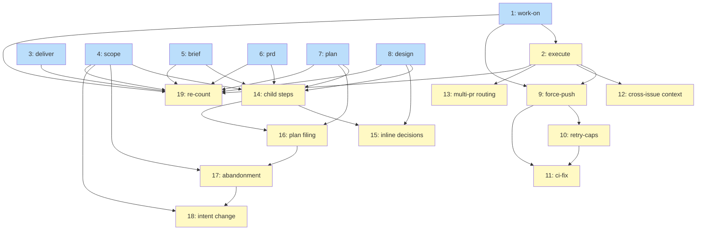

# PLAN: Contradiction Settlement

## Status

Active

## Scope Summary

Settle the 46 contradictions and remove the dead prose inventoried in
`docs/designs/DESIGN-contradiction-settlement.md`: seven per-skill items apply
the 36 mechanical winners and the dead-prose deletions, ten items each apply
one policy decision once it is recorded, and a final item re-counts every
profile against the baseline pin.

## Decomposition Strategy

**Horizontal, by skill.** A skill's SKILL.md, template and references change
together, so each mechanical item owns one skill's identifiers and one
reviewer reads one skill's diff. Each policy item owns exactly one policy
identifier, plus any mechanical or dead-prose entry that cannot land before
that decision, so a later feature can wait on the one identifier it needs.
Every identifier and dead-prose entry named below is defined, with its
locations and excerpts, in the DESIGN.

Rules every item follows:

- It starts only after the `baseline-pin` gate: pull request #488 has merged.
- It re-finds each span by the DESIGN's excerpt, not the line number. When an
  excerpt is missing or appears more than once, the item stops, reports the
  identifier, and leaves the other items unaffected.
- After it lands, each covered mechanical identifier's losing text is gone or
  rewritten to match the winner, the winner's text is still present, and each
  covered duplicate is down to its named survivor.
- It deletes nothing listed under "Withholding candidates (out of this
  feature)" in the DESIGN, and it does not touch the carve-out section of
  `references/fixes/sub-agent-dispatch.md`, which is handled separately.
- A policy item starts only after its decision gate: a file
  `docs/decisions/DECISION-contradiction-<identifier>-<YYYY-MM-DD>.md`
  carrying the policy owner's answer, merged to `main` by a person. An agent
  may draft that file; no agent merges it. Until then the policy item's
  statements stay as they are at `662f6ec`.

## Issue Outlines

### Issue 1: docs(work-on): settle /work-on's mechanical contradictions and dead prose

**Repo**: tsukumogami/shirabe

**Group**: work-on

**Goal**: Apply the winners of the /work-on mechanical items and delete the /work-on dead prose, without changing any policy item's statements.

**Acceptance Criteria**:
- [ ] Follows the PLAN's rules: its pull request opens only after pull request #488 has merged; it finds every span by the DESIGN's excerpt and stops, reporting the identifier, when an excerpt is missing or appears twice; and it leaves unchanged every withholding candidate, every mechanical winner, and every policy statement other than its own.
- [ ] Covers `panel-round-counter`, `panel-retry-fix-location`, `decision-recording-channel`, `commit-koto-context-artifacts`, `scratch-file-path`, `panel-detail-files-in-wip`, `implementation-escalate-outcome`, `plan-backed-init-mode`, `deferral-pr-body-pointer`, `decision-point-ids-unresolvable`, `retention-doc-runtime-status`, `pr-body-check-count` and `pr-body-rule-restated-inline`, each resolved to the DESIGN's winner.
- [ ] Deletes the spans of `dp-work-on-retry-rationale-copies`, `dp-work-on-pointer-loaded-docs`, `dp-work-on-rationale`, `dp-work-on-duplicates`, `dp-work-on-missing-files` and `dp-work-on-koto-restated`, keeping each named survivor.
- [ ] `references/decision-protocol.md` keeps its recording section and gains a clause saying koto-driven skills record through `koto decisions record`.
- [ ] The spans of `wh-work-on-retry-clearing-blocks` and `wh-work-on-introspection-evidence` are unchanged, and `skills/work-on/scripts/retry-clearing_test.sh` passes.
- [ ] The repository's work-on tests and evals pass.

**Dependencies**: None

### Issue 2: docs(execute): settle /execute's mechanical contradictions and dead prose

**Repo**: tsukumogami/shirabe

**Group**: execute

**Goal**: Apply the winners of the /execute mechanical items and delete the /execute dead prose that no open decision holds back.

**Acceptance Criteria**:
- [ ] Follows the PLAN's rules: its pull request opens only after pull request #488 has merged; it finds every span by the DESIGN's excerpt and stops, reporting the identifier, when an excerpt is missing or appears twice; and it leaves unchanged every withholding candidate, every mechanical winner, and every policy statement other than its own.
- [ ] Covers `worktree-discipline-vs-drift-state`, `execute-pr-title-type`, `execute-state-file-projection`, `execute-sentinel-no-reader`, `execution-children-described-as-prs`, `execute-exit-artifacts-not-produced` and `no-cleanup-on-child-ticks`, each resolved to the DESIGN's winner.
- [ ] Deletes the spans of `dp-execute-skill-duplicates-template`, `dp-execute-skill-rationale`, `dp-execute-skill-dead-mechanisms`, `dp-execute-skill-koto-restated`, `dp-execute-template` and `dp-execute-pointer-loaded-refs`, keeping each named survivor.
- [ ] The pointer to `phase-6-pr.md` at `execute.md` ci_monitor is unchanged, and the spans of `wh-execute-d5-rule` are unchanged.
- [ ] The repository's execute tests and evals pass.

**Dependencies**: Blocked by <<ISSUE:1>>

### Issue 3: docs(deliver): settle /deliver's merged claim and dead prose

**Repo**: tsukumogami/shirabe

**Group**: deliver

**Goal**: Qualify /deliver's merged claim and delete its dead prose, keeping the caller leg contract.

**Acceptance Criteria**:
- [ ] Follows the PLAN's rules: its pull request opens only after pull request #488 has merged; it finds every span by the DESIGN's excerpt and stops, reporting the identifier, when an excerpt is missing or appears twice; and it leaves unchanged every withholding candidate, every mechanical winner, and every policy statement other than its own.
- [ ] Covers `deliver-merged-claim`, resolved to the DESIGN's winner.
- [ ] Deletes the spans of `dp-deliver-skill`; the leg contract listed as `wh-deliver-leg-contract` is unchanged.
- [ ] The repository's deliver tests and evals pass.

**Dependencies**: None

### Issue 4: docs(scope): settle /scope's mechanical contradictions and dead prose

**Repo**: tsukumogami/shirabe

**Group**: scope

**Goal**: Apply the winners of the /scope mechanical items and delete the /scope dead prose, including shared parent-skill references the /scope profile loads.

**Acceptance Criteria**:
- [ ] Follows the PLAN's rules: its pull request opens only after pull request #488 has merged; it finds every span by the DESIGN's excerpt and stops, reporting the identifier, when an excerpt is missing or appears twice; and it leaves unchanged every withholding candidate, every mechanical winner, and every policy statement other than its own.
- [ ] Covers `scope-reference-table-vs-lazy-load`, `scope-state-initial-values`, `r6-verdicts-no-reader`, `phase1-undocumented-state-field` and `design-planned-transition-uncommitted`, each resolved to the DESIGN's winner.
- [ ] For `scope-state-initial-values`, the test fixtures and the eval that use `phase-1` or `UNSET` move to the probe's shape, and `resume-probe_test.sh` passes.
- [ ] Deletes the spans of `dp-scope-history`, `dp-scope-rationale`, `dp-scope-duplicates`, `dp-scope-no-reader` and `dp-scope-koto-restated`, keeping each named survivor and the span listed as `wh-scope-no-floor-guard`.
- [ ] The repository's scope tests and evals pass.

**Dependencies**: None

### Issue 5: docs(brief): settle /brief's contradictions and dead prose

**Repo**: tsukumogami/shirabe

**Group**: brief

**Goal**: Correct /brief's upstream rule and the claim that mechanical terms are caught before the jury, and delete /brief's history prose.

**Acceptance Criteria**:
- [ ] Follows the PLAN's rules: its pull request opens only after pull request #488 has merged; it finds every span by the DESIGN's excerpt and stops, reporting the identifier, when an excerpt is missing or appears twice; and it leaves unchanged every withholding candidate, every mechanical winner, and every policy statement other than its own.
- [ ] Covers `brief-upstream-legal-parents` and `fc10-already-caught`, each resolved to the DESIGN's winner; the structural reviewer's prompt tells it to check the mechanical terms itself.
- [ ] Deletes the spans of `dp-brief-history`.
- [ ] The repository's brief and writing-style tests and evals pass.

**Dependencies**: None

### Issue 6: docs(prd): add the schema field to the PRD format

**Repo**: tsukumogami/shirabe

**Group**: prd

**Goal**: Make a PRD written from the format reference pass /scope's hop gate.

**Acceptance Criteria**:
- [ ] Follows the PLAN's rules: its pull request opens only after pull request #488 has merged; it finds every span by the DESIGN's excerpt and stops, reporting the identifier, when an excerpt is missing or appears twice; and it leaves unchanged every withholding candidate, every mechanical winner, and every policy statement other than its own.
- [ ] Covers `prd-format-schema-field`: the frontmatter example and the required-fields sentence in `skills/prd/references/prd-format.md` include `schema: prd/v1`.
- [ ] The repository's prd tests and evals pass.

**Dependencies**: None

### Issue 7: docs(plan): settle /plan's mechanical contradictions and dead prose

**Repo**: tsukumogami/shirabe

**Group**: plan

**Goal**: Align /plan's PLAN status, complexity values and required sections with the validator, and delete /plan's dead prose.

**Acceptance Criteria**:
- [ ] Follows the PLAN's rules: its pull request opens only after pull request #488 has merged; it finds every span by the DESIGN's excerpt and stops, reporting the identifier, when an excerpt is missing or appears twice; and it leaves unchanged every withholding candidate, every mechanical winner, and every policy statement other than its own.
- [ ] Covers `plan-single-pr-draft-commit`, `plan-complexity-values` and `plan-required-sections`, each resolved to the DESIGN's winner; FC11's message names `references/issues-table.md`, and the validator's tests pass.
- [ ] Deletes the spans of `dp-plan-history`, `dp-plan-rationale`, `dp-plan-duplicates` and `dp-plan-koto-restated`, keeping each named survivor.
- [ ] The repository's plan tests and evals pass.

**Dependencies**: None

### Issue 8: docs(design): settle /design's mechanical contradictions and dead prose

**Repo**: tsukumogami/shirabe

**Group**: design

**Goal**: Align /design's spawned_from shape and superseded location with what runs, and delete /design's dead prose.

**Acceptance Criteria**:
- [ ] Follows the PLAN's rules: its pull request opens only after pull request #488 has merged; it finds every span by the DESIGN's excerpt and stops, reporting the identifier, when an excerpt is missing or appears twice; and it leaves unchanged every withholding candidate, every mechanical winner, and every policy statement other than its own.
- [ ] Covers `design-spawned-from-shape` and `design-superseded-location`, each resolved to the DESIGN's winner.
- [ ] `skills/design/SKILL.md` lines 221 to 243, a policy statement held for Issue 14, are unchanged.
- [ ] Deletes the spans of `dp-design-rationale` and `dp-design-duplicates`, keeping each named survivor.
- [ ] The repository's design tests and evals pass.

**Dependencies**: None

### Gate: decision-force-push-after-rebase

**After**: Issue 1, Issue 2

**Before**: Issue 9

**Condition**: `docs/decisions/DECISION-contradiction-force-push-after-rebase-<date>.md` carries the policy owner's answer and was merged to `main` by a person.

### Issue 9: docs(work-on): apply the force-push-after-rebase decision

**Repo**: tsukumogami/shirabe

**Group**: policy-force-push

**Goal**: Make the chosen option the single statement of force-push-after-rebase in every file the DESIGN lists for it.

**Acceptance Criteria**:
- [ ] Follows the PLAN's rules: its pull request opens only after pull request #488 has merged; it finds every span by the DESIGN's excerpt and stops, reporting the identifier, when an excerpt is missing or appears twice; and it leaves unchanged every withholding candidate, every mechanical winner, and every policy statement other than its own.
- [ ] Covers `force-push-after-rebase` only; every listed statement now states the recorded option, or is deleted when another statement carries it.
- [ ] The repository's work-on and execute tests and evals pass.

**Dependencies**: Blocked by <<ISSUE:1>>, <<ISSUE:2>>

### Gate: decision-retry-caps

**After**: Issue 1, Issue 2

**Before**: Issue 10

**Condition**: `docs/decisions/DECISION-contradiction-retry-caps-<date>.md` carries the policy owner's answer and was merged to `main` by a person.

### Issue 10: docs(work-on): apply the retry-caps decision and unload phase-6-pr from /execute

**Repo**: tsukumogami/shirabe

**Group**: policy-retry-caps

**Goal**: State each retry cap once, as decided, and drop /execute's pointer to /work-on's PR phase file.

**Acceptance Criteria**:
- [ ] Follows the PLAN's rules: its pull request opens only after pull request #488 has merged; it finds every span by the DESIGN's excerpt and stops, reporting the identifier, when an excerpt is missing or appears twice; and it leaves unchanged every withholding candidate, every mechanical winner, and every policy statement other than its own.
- [ ] Covers `retry-caps`; every listed statement now states the recorded caps, or is deleted when another statement carries them.
- [ ] Covers `phase-6-pr-shared-with-execute` and `dp-execute-phase-6-pointer`: /execute's ci_monitor no longer points at `phase-6-pr.md`.
- [ ] The repository's work-on and execute tests and evals pass.

**Dependencies**: Blocked by <<ISSUE:9>>

### Gate: decision-ci-fix-ends-run-unverified

**After**: Issue 1

**Before**: Issue 11

**Condition**: `docs/decisions/DECISION-contradiction-ci-fix-ends-run-unverified-<date>.md` carries the policy owner's answer and was merged to `main` by a person.

### Issue 11: docs(work-on): apply the ci-fix-ends-run-unverified decision

**Repo**: tsukumogami/shirabe

**Group**: policy-ci-fix

**Goal**: Make /work-on's CI routing and its CI promise agree, as decided, and unload the finishing-obligations document.

**Acceptance Criteria**:
- [ ] Follows the PLAN's rules: its pull request opens only after pull request #488 has merged; it finds every span by the DESIGN's excerpt and stops, reporting the identifier, when an excerpt is missing or appears twice; and it leaves unchanged every withholding candidate, every mechanical winner, and every policy statement other than its own.
- [ ] Covers `ci-fix-ends-run-unverified`; the template routing or the prose changes as the recorded option says.
- [ ] Covers `dp-work-on-finishing-obligations-pointer`: the pointer at `work-on.md` finalization is removed.
- [ ] The repository's work-on tests and evals pass.

**Dependencies**: Blocked by <<ISSUE:9>>, <<ISSUE:10>>

### Gate: decision-cross-issue-context-no-consumer

**After**: Issue 2

**Before**: Issue 12

**Condition**: `docs/decisions/DECISION-contradiction-cross-issue-context-no-consumer-<date>.md` carries the policy owner's answer and was merged to `main` by a person.

### Issue 12: docs(execute): apply the cross-issue-context decision

**Repo**: tsukumogami/shirabe

**Group**: policy-cross-issue-context

**Goal**: Delete the cross-issue context step or wire a reader for it, as decided.

**Acceptance Criteria**:
- [ ] Follows the PLAN's rules: its pull request opens only after pull request #488 has merged; it finds every span by the DESIGN's excerpt and stops, reporting the identifier, when an excerpt is missing or appears twice; and it leaves unchanged every withholding candidate, every mechanical winner, and every policy statement other than its own.
- [ ] Covers `cross-issue-context-no-consumer`; after the item, either no loaded file tells the agent to build `current-context.md`, or /work-on's analysis reads it and it is built outside the work tree.
- [ ] The repository's execute and work-on tests and evals pass.

**Dependencies**: Blocked by <<ISSUE:2>>

### Gate: decision-multi-pr-plan-routing

**After**: Issue 2

**Before**: Issue 13

**Condition**: `docs/decisions/DECISION-contradiction-multi-pr-plan-routing-<date>.md` carries the policy owner's answer and was merged to `main` by a person.

### Issue 13: docs(execute): apply the multi-pr routing decision

**Repo**: tsukumogami/shirabe

**Group**: policy-multi-pr

**Goal**: Make /execute's handling of multi-pr PLANs match its SKILL.md, as decided.

**Acceptance Criteria**:
- [ ] Follows the PLAN's rules: its pull request opens only after pull request #488 has merged; it finds every span by the DESIGN's excerpt and stops, reporting the identifier, when an excerpt is missing or appears twice; and it leaves unchanged every withholding candidate, every mechanical winner, and every policy statement other than its own.
- [ ] Covers `multi-pr-plan-routing`; `execute-open.sh` and `skills/execute/SKILL.md` agree on whether a multi-pr PLAN runs, with a test for the chosen behavior.
- [ ] The repository's execute tests and evals pass.

**Dependencies**: Blocked by <<ISSUE:2>>

### Gate: decision-child-steps-under-scope

**After**: Issue 4, Issue 5, Issue 6, Issue 7, Issue 8

**Before**: Issue 14

**Condition**: `docs/decisions/DECISION-contradiction-child-steps-under-scope-<date>.md` carries the policy owner's answer and was merged to `main` by a person.

### Issue 14: docs(scope): apply the child-steps-under-scope decision

**Repo**: tsukumogami/shirabe

**Group**: policy-child-steps

**Goal**: Make the child skills' approval, push and pull-request steps under /scope match the decision, and the dispatch reference describe them.

**Acceptance Criteria**:
- [ ] Follows the PLAN's rules: its pull request opens only after pull request #488 has merged; it finds every span by the DESIGN's excerpt and stops, reporting the identifier, when an excerpt is missing or appears twice; and it leaves unchanged every withholding candidate, every mechanical winner, and every policy statement other than its own.
- [ ] Covers `child-steps-under-scope`; each listed child step and `references/fixes/sub-agent-dispatch.md` state the recorded option, leaving that file's carve-out section untouched.
- [ ] Covers `design-implementation-issues-owner`, resolved to the DESIGN's winner; it waits here because its losing statement sits inside a `child-steps-under-scope` statement.
- [ ] The repository's scope, brief, prd, design and plan tests and evals pass.

**Dependencies**: Blocked by <<ISSUE:4>>, <<ISSUE:5>>, <<ISSUE:6>>, <<ISSUE:7>>, <<ISSUE:8>>

### Gate: decision-design-inline-decision-fallback

**After**: Issue 8

**Before**: Issue 15

**Condition**: `docs/decisions/DECISION-contradiction-design-inline-decision-fallback-<date>.md` carries the policy owner's answer and was merged to `main` by a person.

### Issue 15: docs(design): apply the inline-decision fallback decision

**Repo**: tsukumogami/shirabe

**Group**: policy-design-inline

**Goal**: Delete /design's inline-decision fallback or make its condition checkable, as decided.

**Acceptance Criteria**:
- [ ] Follows the PLAN's rules: its pull request opens only after pull request #488 has merged; it finds every span by the DESIGN's excerpt and stops, reporting the identifier, when an excerpt is missing or appears twice; and it leaves unchanged every withholding candidate, every mechanical winner, and every policy statement other than its own.
- [ ] Covers `design-inline-decision-fallback`; the dispatch reference, /design's Phase 2 and the format reference agree, and the /scope fixture matches.
- [ ] The repository's design and scope tests and evals pass.

**Dependencies**: Blocked by <<ISSUE:8>>, <<ISSUE:14>>

### Gate: decision-plan-issue-filing-under-auto

**After**: Issue 7

**Before**: Issue 16

**Condition**: `docs/decisions/DECISION-contradiction-plan-issue-filing-under-auto-<date>.md` carries the policy owner's answer and was merged to `main` by a person.

### Issue 16: docs(plan): apply the issue-filing-under-auto decision

**Repo**: tsukumogami/shirabe

**Group**: policy-plan-filing

**Goal**: Make /plan's filing paths follow its approval rule, as decided.

**Acceptance Criteria**:
- [ ] Follows the PLAN's rules: its pull request opens only after pull request #488 has merged; it finds every span by the DESIGN's excerpt and stops, reporting the identifier, when an excerpt is missing or appears twice; and it leaves unchanged every withholding candidate, every mechanical winner, and every policy statement other than its own.
- [ ] Covers `plan-issue-filing-under-auto`; every /plan path that files issues or a milestone behaves as the recorded option says, and /scope's list of gh writes matches.
- [ ] The repository's plan and scope tests and evals pass.

**Dependencies**: Blocked by <<ISSUE:7>>, <<ISSUE:14>>

### Gate: decision-scope-abandonment-draft-plan

**After**: Issue 4

**Before**: Issue 17

**Condition**: `docs/decisions/DECISION-contradiction-scope-abandonment-draft-plan-<date>.md` carries the policy owner's answer and was merged to `main` by a person.

### Issue 17: docs(scope): apply the abandonment-exit decision

**Repo**: tsukumogami/shirabe

**Group**: policy-scope-abandonment

**Goal**: Make /scope's abandonment exit agree with the lifecycle check, as decided.

**Acceptance Criteria**:
- [ ] Follows the PLAN's rules: its pull request opens only after pull request #488 has merged; it finds every span by the DESIGN's excerpt and stops, reporting the identifier, when an excerpt is missing or appears twice; and it leaves unchanged every withholding candidate, every mechanical winner, and every policy statement other than its own.
- [ ] Covers `scope-abandonment-draft-plan`; an abandonment exit no longer leaves a committed Draft PLAN that fails L01, in the way the recorded option says.
- [ ] The repository's scope tests and evals pass.

**Dependencies**: Blocked by <<ISSUE:4>>, <<ISSUE:16>>

### Gate: decision-worktree-intent-change-owner

**After**: Issue 4

**Before**: Issue 18

**Condition**: `docs/decisions/DECISION-contradiction-worktree-intent-change-owner-<date>.md` carries the policy owner's answer and was merged to `main` by a person.

### Issue 18: docs(scope): apply the intent-change decision

**Repo**: tsukumogami/shirabe

**Group**: policy-intent-change

**Goal**: State who judges an intent-changing rebase under /scope, as decided.

**Acceptance Criteria**:
- [ ] Follows the PLAN's rules: its pull request opens only after pull request #488 has merged; it finds every span by the DESIGN's excerpt and stops, reporting the identifier, when an excerpt is missing or appears twice; and it leaves unchanged every withholding candidate, every mechanical winner, and every policy statement other than its own.
- [ ] Covers `worktree-intent-change-owner`; `skills/scope/SKILL.md` and the Phase 2 reference state the recorded option.
- [ ] The repository's scope tests and evals pass.

**Dependencies**: Blocked by <<ISSUE:4>>, <<ISSUE:17>>

### Issue 19: docs(measurement): re-count every profile against the baseline pin

**Repo**: tsukumogami/shirabe

**Group**: measure

**Goal**: Measure what the landed items removed from each profile's load.

**Acceptance Criteria**:
- [ ] Follows the PLAN's rules: its pull request opens only after pull request #488 has merged; it finds every span by the DESIGN's excerpt and stops, reporting the identifier, when an excerpt is missing or appears twice; and it leaves unchanged every withholding candidate, every mechanical winner, and every policy statement other than its own.
- [ ] Re-runs the baseline pin's count for `work-on`, `execute-single-pr`, `execute-coordinated`, `deliver` and `scope`, and records the before and after raw figures beside the DESIGN's dead-prose estimate less the withholding candidates and less the spans of any policy item still undecided.
- [ ] Explains, per entry, any shortfall over 10% of that estimate.
- [ ] Changes no file under `skills/`, `references/`, `scripts/` or `crates/`.

**Dependencies**: Blocked by <<ISSUE:1>>, <<ISSUE:2>>, <<ISSUE:3>>, <<ISSUE:4>>, <<ISSUE:5>>, <<ISSUE:6>>, <<ISSUE:7>>, <<ISSUE:8>>

## Dependency Graph

**Legend**: Blue = ready, Yellow = blocked

Ready means startable once the baseline pin merges; blocked means waiting on
another item or on a recorded decision.

## Implementation Sequence

**Critical path**: the baseline pin merges, then Issues 1 and 3 to 8 run in
parallel, Issue 2 follows Issue 1, and Issue 19 re-counts once 1 to 8 have
landed. Policy items join whenever their decisions are recorded; Issue 19
counts only what has landed by then and does not wait for any decision.

**Parallelization**: Issues 1 and 3 to 8 touch different files. Issue 2
waits for Issue 1 because both edit `skills/execute/koto-templates/execute.md`
(Issue 1 through `pr-body-rule-restated-inline`).

**Ordering among policy items**: Issue 9 before 10, and 10 before 11, since
they edit `phase-6-pr.md` and `work-on.md`; Issue 14 before 15 and 16, since
they share the dispatch reference and a `/scope` SKILL.md span; Issue 16
before 17, and 17 before 18, since those pairs share statement spans in
`skills/plan/SKILL.md` and `skills/scope/SKILL.md`.
