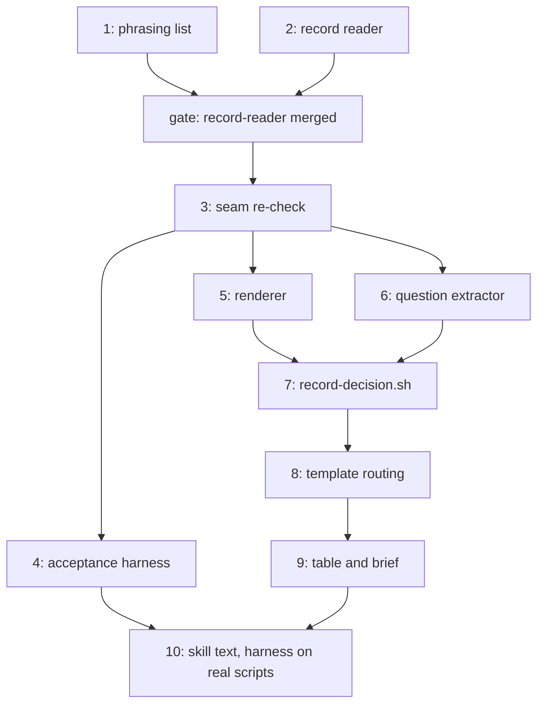

# PLAN: coordinate-decisions

## Status

Active

Authored at Active because this PLAN files no issues. Implementation starts only from a
default branch that already holds the dispatch path (shirabe#404) and reconcile
(shirabe#406): the second pull request extends states and scripts those features add
(`take_report`, `worker_report`, `report_facts`' arms, `render-brief.sh`, the reconcile
report), and both change the template, the verdict table and the rule-coverage fixture this
work also changes.

## Scope Summary

Implement decisions and escalation in the `coordinate` skill as designed in
`docs/designs/DESIGN-coordinate-decisions.md`, in two pull requests in one repository. The
first, group `record-reader`, carries the record reader: the phrasing list, the Decisions
section in the codec, the separate write core, and the refusals that keep any writer but the
decision script from changing the section; it writes no entry. The second, group
`decision-flow`, carries the decision flow and every gate on it: the seam re-check, the
acceptance harness, the renderer, the question extractor, the one writer of entries, the
routing check and template states, the progress table and brief, and the skill text. The
second waits for the first to merge.

## Decomposition Strategy

**Horizontal, in two pull requests.** The DESIGN fixes each script's interface (its modes,
arguments, exit codes, verdict words and the detail keys it writes), so each is built and
tested on its own before the states that call it. The split follows the one seam where a
piece is useful alone: the record reader protects coordinators on an older plugin before any
entry exists, and nothing in it writes an entry. Inside the second pull request the order is
what calls what, except that the acceptance harness comes first: the niwa#330 replay and the
three-level round trip are written against stand-ins at the start, so every later outline is
measured against them, and the last outline runs them against the real scripts.

## Issue Outlines

### Issue 1: feat(coordinate): the decision-phrasing list

**Repo**: tsukumogami/shirabe

**Group**: record-reader

**Goal**: Add `skills/coordinate/references/decision-phrasings.tsv` and its fixtures, the one
closed list of decision phrasings and person-addressing patterns that `progress-view.sh`,
`report-questions.sh` and `need-check.sh` read, with its reader in its own sourced library,
`phrasing-lib.sh`, so a caller needn't pull in the record library.

**Acceptance Criteria**:
- [ ] Each row is an extended regular expression with no back-references and a kind,
  `decision`, `addressed`, or `both` (one row for a phrasing that is both, so the two kinds
  can't drift apart); a test fails when a row uses a back-reference, an unknown kind, or an
  escape BSD grep doesn't take, and a failure to read the list is never "no match".
- [ ] `scripts/testdata/decision-phrasings/` holds at least three refused decision phrasings
  ("decide whether to ship", "needs your decision", "please decide"), three accepted texts
  ("needs an npm token", "run the release", "waiting on the release decision from the
  vendor"), and three addressed questions ("the human should decide", "your call", "up to
  you"); the matcher refuses every refused fixture, accepts every accepted one, and marks every
  addressed one, matched case-insensitively with `grep -E`.

**Tests**: new `decision-phrasings_test.sh`; `run-tests.sh` picks it up, and the bash 3.2
floor list in `scripts/check-bash-floor.sh` gains it.

**Dependencies**: None

**Type**: code
**Files**: `skills/coordinate/references/decision-phrasings.tsv`, `skills/coordinate/scripts/phrasing-lib.sh`, `skills/coordinate/scripts/testdata/decision-phrasings/`, `scripts/check-bash-floor.sh`

### Issue 2: feat(coordinate): read and guard the Decisions record section

**Repo**: tsukumogami/shirabe

**Group**: record-reader

**Goal**: Add the fifth record section to the codec (rendered only when it holds an entry or a
`Next decision` above 1), its stamp grammar, section-aware grammars, per-state required
columns, compaction and the shared escalation validator; move the write core into
`record-write-core.sh` with a size budget; make `record-write.sh` refuse any change to the
section and `record-open.sh` refuse a body carrying one; add the close-out stage and the
predecessor copy. Nothing in this outline writes an entry.

**Acceptance Criteria**:
- [ ] A record body written before this feature (four sections) parses to no entries and a
  next identifier of 1, renders back byte for byte, and `record-find.sh` adopts it (golden
  file).
- [ ] A record with entries in each of the four states, one held and one compacted, renders the
  section with its `Next decision:` line and nineteen columns and parses back byte for byte; a
  five-section body holding `Next decision: 1` and `None.` is refused, so the shape never
  toggles back.
- [ ] The codec refuses, as non-canonical, an unknown state, a non-integer, repeated or
  out-of-bound identifier, a ground outside `scope`, `supplied-decision`, `reserved-step`,
  `outside-scope`, a stamp that doesn't parse as `[<run> <kind> <seq>[.<i>]]`, an escalated
  entry missing recommendation, reason, context, problem, grounds or target, a settled entry
  missing outcome or decided by, and a held entry missing its reason; each case has a test.
- [ ] The Decisions `reason` and `target` columns use their own grammars, and the Reversals
  `reason` and Side effects `target` grammars are unchanged (tests for each).
- [ ] `@` in a Decisions free-text cell renders encoded and parses back; a cell with a pipe or
  a line break round-trips.
- [ ] The shared validator refuses a recommendation outside the options, a reason, context or
  problem empty after trimming, no ground, and a target other than the one given, and passes a
  complete verdict, including one whose only ground is `outside-scope`.
- [ ] The named-repository scan covers the Decisions text columns, and a cell with a home
  directory path or a token-shaped string is refused.
- [ ] `record-write-core.sh` is sourced only by `record-write.sh` and `record-holding.sh` here;
  `record-common.sh` still makes no GitHub write, and both headers say where writes live. The
  core refuses a body over 60,000 bytes with its own exit code.
- [ ] `record-write.sh` refuses (exit 65) a body whose Decisions section differs from the live
  one's and accepts one whose section is unchanged; `record-open.sh` refuses a body with a
  Decisions section; the existing tests of both still pass.
- [ ] The handoff renders only unsettled entries with the same `Next decision`, and a
  predecessor copy keeps the section as it stands.
- [ ] `closeout-read.sh` at roadmap scope reports a `decisions` stage, ahead of `ready`, while
  any entry isn't settled.

**Tests**: `record-codec_test.sh`, `record-write_test.sh`, `record-holding_test.sh`,
`record-open_test.sh`, `record-find_test.sh`, `closeout-read_test.sh`,
`predecessor-handoff_test.sh`; new golden files under `scripts/testdata/`.

**Dependencies**: None

**Type**: code
**Files**: `skills/coordinate/scripts/record-codec.jq`, `skills/coordinate/scripts/record-write-core.sh`, `skills/coordinate/scripts/record-common.sh`, `skills/coordinate/scripts/record-write.sh`, `skills/coordinate/scripts/record-holding.sh`, `skills/coordinate/scripts/record-open.sh`, `skills/coordinate/scripts/closeout-read.sh`, `skills/coordinate/scripts/predecessor-handoff.sh`, `skills/coordinate/references/record-template.md`

### Gate: record-reader-merged

**After**: Issue 1, Issue 2

**Before**: Issue 3

**Condition**: the `record-reader` pull request is merged on the default branch, so every
coordinator that installs the plugin afterwards reads a five-section record before the
`decision-flow` pull request lets any coordinator write one.

### Issue 3: docs(coordinate): re-check the design's seams against the merged sibling features

**Repo**: tsukumogami/shirabe

**Group**: decision-flow

**Goal**: With shirabe#404 and shirabe#406 on the default branch, re-read each seam the DESIGN
names and correct the DESIGN where the merged code differs, before any code of this pull
request is written.

**Acceptance Criteria**:
- [ ] Each of these is confirmed against the merged code, or the DESIGN is corrected in this
  pull request: `take_report` and the `worker_report` key and how a message report fills it;
  `report_facts`' three arms and their words; `render-brief.sh`'s Reporting section and its
  test; the reconcile report's "Blocked on you" rows; the verdict words and codes both
  features added to `coord-verdict.sh`; the koto floor in `skills/coordinate/requires.tsv`.
- [ ] The first free verdict-code block on the default branch is recorded in the DESIGN.

**Tests**: none; the outline's output is the corrected DESIGN. The DESIGN is on the
coordination branch, not the default branch, so the correction lands there.

**Dependencies**: None

**Type**: docs
**Files**: `docs/designs/DESIGN-coordinate-decisions.md`

### Issue 4: test(coordinate): the acceptance harness

**Repo**: tsukumogami/shirabe

**Group**: decision-flow

**Goal**: Write the niwa#330 replay and the three-level round trip as engine tests first,
against stand-ins for the scripts later outlines add, so every later outline is measured
against them.

**Acceptance Criteria**:
- [ ] The niwa#330 replay drives: an entry whose source is a worker, settled on option (d); a
  mixed check result recorded as evidence; the worker's "please decide whether to ship" in a
  report. It passes when the log shows `decision_verdict` entered before any render state, no
  escalation rendered, and no progress table in the sequence with a decision row lacking a
  recommendation.
- [ ] The same replay against a template variant whose evidence edge goes straight to
  `escalate` fails.
- [ ] The three-level test (a person, a workspace coordinator, a roadmap coordinator) shows the
  roadmap coordinator's escalation opened as a `proposed` entry above with its source, and its
  settlement rendered back down so the lower entry settles naming the final decider; a
  withdrawal from below reopens the upper entry, and nothing goes back down after it.
- [ ] The stand-ins are marked as such and removed by Issue 10, which runs both tests against
  the real scripts.

**Tests**: new `decisions-replay_engine_test.sh`; `run-tests.sh --engine` gains it.

**Dependencies**: Blocked by <<ISSUE:3>>

**Type**: code
**Files**: `skills/coordinate/scripts/decisions-replay_engine_test.sh`, `skills/coordinate/scripts/testdata/decisions/`

### Issue 5: feat(coordinate): render decision messages from the entry

**Repo**: tsukumogami/shirabe

**Group**: decision-flow

**Goal**: Add `decision-render.sh`, which renders an escalation, a withdrawal, a reply or a
redirect from the live entry through the shared validator and seals the text with
`coord-log.sh seal --file --key`.

**Acceptance Criteria**:
- [ ] A fixture escalation's first line is `Decision <n> round <r>.`, followed by the context
  paragraph, the problem paragraph, the question with the recommended option listed first
  carrying its reason, the answer line, and a last line with the SHA-256 digest of the text
  above; it carries one decision and no sender topic.
- [ ] Rendering prints `refused` for each of: empty recommendation, reason, context or problem;
  a recommendation outside the options; a target other than the run's `REPORTS_TO`; an entry
  that doesn't owe the kind asked for, including a second rendering after the owing cleared.
- [ ] A withdrawal names the decision and round and says no answer is needed; a reply names the
  decision, round, outcome, reason and who decided; a redirect tells the worker its questions
  go to the coordinator, which answers them or escalates them with a recommendation.
- [ ] On success the text is in `coord/decision_message.txt`, sealed, and the verdict is
  `message <kind> <n> <round>`; `coord-log.sh check --key` passes on it and fails after an edit.
- [ ] Every option of an escalation is rendered with its explanation (the Options line's
  `<option> -- <explanation>`), and an option without one is refused by the shared validator.
- [ ] An escalation also writes the structured form `coord/decision_question.json` (question,
  context, problem, options as `{label, explanation}` with the recommended one first), sealed
  beside the text.
- [ ] A redirect is rendered only for the report it names that addressed a person, and not
  twice for the same report.
- [ ] `record-decision.sh --list` and `--read`, which every reader of the section goes through,
  land here with the renderer, their first reader.

**Tests**: new `decision-render_test.sh`; `run-tests.sh` gains it.

**Dependencies**: Blocked by <<ISSUE:3>>

**Type**: code
**Files**: `skills/coordinate/scripts/decision-render.sh`, `skills/coordinate/scripts/record-decision.sh`, `skills/coordinate/scripts/record-codec.jq`

### Issue 6: feat(coordinate): extract a worker report's questions

**Repo**: tsukumogami/shirabe

**Group**: decision-flow

**Goal**: Add `report-questions.sh`, which extracts a report's questions from its Questions
part, question-shaped lines and phrasing matches, caps them, honors citations and fixed first
lines only from their own holding, checks a coordinator escalation's digest, and seals the list.

**Acceptance Criteria**:
- [ ] A report with a `Questions:` part yields its numbered items; a `(decision <n>)` citation
  is kept only when entry `<n>`'s Source is the reporting worker.
- [ ] A line outside the part ending in `?`, and one matching a `decision` phrasing, are each
  extracted; lines inside fenced code and `>` quotes are not; addressed items are marked.
- [ ] More than ten questions, or one over 400 characters, gives `overflow`; unreadable input
  gives `unreadable`; none gives `none`.
- [ ] Without a holding, every citation is uncited and no first line is honored.
- [ ] A `Decision <n> round <r>.` first line is one question with a coordinator source only from
  a holding whose entry point is `/shirabe:coordinate`, and only when its digest line matches; a
  second escalation for the same holding, entry and round yields nothing; a `Withdrawn:` line is
  evidence on the entry with that source; an `Answer:` line is ordinary text.
- [ ] Contract test: a report written to the exact `Questions:` shape `render-brief.sh` prints
  parses to its items.
- [ ] On `questions` the list is in `coord/questions.json`, sealed, and `check --key` passes.
- [ ] A coordinator's escalation keeps each option's explanation, and the acceptance harness
  runs with this script in place of its stand-in.

**Tests**: new `report-questions_test.sh`; `render-brief_test.sh` shares the contract fixture;
`decisions-replay_engine_test.sh` drops `report-questions.sh` from its stand-ins.

**Dependencies**: Blocked by <<ISSUE:3>>

**Type**: code
**Files**: `skills/coordinate/scripts/report-questions.sh`, `skills/coordinate/scripts/testdata/report-questions/`

### Issue 7: feat(coordinate): record-decision.sh, the one writer of decisions

**Repo**: tsukumogami/shirabe

**Group**: decision-flow

**Goal**: Add `record-decision.sh` with every mode of the DESIGN's table, its `--list` and
`--read` readers, bound to the workflow state and the routed entry, with run-qualified stamps,
evidence resets, release, and compaction; add `coord-log.sh current`.

**Acceptance Criteria**:
- [ ] `--open` writes a `proposed` entry with Source `self` or `dispatcher` and a `raise` stamp,
  the next identifier, and `Next decision` up by one; it refuses an empty question or options.
- [ ] `--take`, `--settle`, `--escalate` and `--hold` move and annotate entries as the DESIGN's
  table says, including `Owed: reply` exactly when the source is a worker, a coordinator or the
  dispatcher and the latest evidence isn't that source's withdrawal, Round up by one and Target
  equal to the run's `REPORTS_TO` on an escalation, and a `hold` stamp and reason on a hold.
- [ ] Refused with exit 65 and the record byte for byte unchanged: each transition the table
  doesn't list; `--settle` with an empty outcome or reason; `--hold` with an empty reason; each
  failing part of the escalation validator; a mode run outside its state (by `coord-log.sh
  current`); an entry other than the one the sealed capture names; an item holding a line break.
- [ ] `--evidence` in each of the four states leaves the entry in `coordinator-verdict` with the
  Verdict blank (a hold included) and the line appended last with its time, source and `wait`
  stamp; on a settled entry the old outcome and decider go to Evidence and an owed reply clears;
  on a sent escalation `Owed` becomes `withdrawal`; on an unsent one it clears.
- [ ] A queued escalation is released, or its verdict blanked, in the write that frees the slot.
- [ ] `--open-from-report` refuses an uncovered or doubly covered item, a list that fails
  `check --key`, and a report this run already wrote; a second run replaying the same sequence
  numbers against the first run's record writes its own entries.
- [ ] `--answer` settles an escalated entry naming its round with Decided by from the run's
  target (and the final decider for a nested reply); an earlier round or a non-escalated entry
  gets evidence; an identical re-sent answer changes nothing.
- [ ] `--sent` refuses unless the message key checks against the render's seal and names this
  entry, kind and round; it stamps `Asked` for an escalation only; `--route tool|message`
  records the route an escalation to a person took as an Evidence line.
- [ ] `--escalate` refuses an option without an explanation (`<option> -- <explanation>` in the
  Options line), through the shared validator.
- [ ] A settling answer writes an Evidence line with its `wait` stamp; an identical answer sent
  again changes nothing and counts as recorded.
- [ ] `--carry` copies the handoff's unsettled entries and `Next decision` before the first
  dispatch and refuses after it or when already present.
- [ ] A settled entry that owes nothing is compacted at the next write, keeping its Options and
  its `redirect`-stamped Evidence lines; evidence on a compacted entry can escalate it again.
- [ ] The acceptance harness runs with this script in place of its stand-in.
- [ ] The free-text refusals accept ordinary prose: "and/or", "n/a" and "CI/CD" in a question
  make no repository read; `task-runner-integration-tests`, `disk-space-reclamation-policy`
  and `~/.config` are accepted; a `github.com/<owner>/<repo>` link or `<owner>/<repo>#<n>` to a
  private repository, a real token shape and a `/home/<user>/` path are still refused.
- [ ] A live body over the budget, including one past the parser's limit, exits 13.
- [ ] Only `record-decision.sh` sets `DECISIONS_WRITER=1` (a structure test with a failing
  fixture); the write core's header states the caller's contract.
- [ ] Reconcile salvages a non-canonical record and handoff that carry a Decisions section
  (a `reconcile-read_test.sh` case each, canonical and not).
- [ ] Exit 13 is in `record-write.sh`'s and `record-holding.sh`'s contracts, and
  `dispatch-common.sh` reports it as a full record.

**Tests**: new `record-decision_test.sh`; `coord-log_test.sh` gains `current`;
`coordinate-template-structure_engine_test.sh`'s write-script pattern gains `record-decision`;
`record-codec_test.sh`, `record-write_test.sh`, `reconcile-read_test.sh`,
`dispatch-common_test.sh`.

**Dependencies**: Blocked by <<ISSUE:5>>, <<ISSUE:6>>

**Type**: code
**Files**: `skills/coordinate/scripts/record-decision.sh`, `skills/coordinate/scripts/coord-log.sh`, `skills/coordinate/scripts/record-write-core.sh`, `skills/coordinate/scripts/record-codec.jq`, `skills/coordinate/scripts/reconcile-salvage.jq`, `skills/coordinate/scripts/record-holding.sh`, `skills/coordinate/scripts/dispatch-common.sh`

### Issue 8: feat(coordinate): route the decision loop in the template

**Repo**: tsukumogami/shirabe

**Group**: decision-flow

**Goal**: Add `decision-next.sh` with its `--owed` mode, `need-check.sh`, the `decision-owed`
guard, the `decisions` verdict and unsettled entries in `pick-facts.sh`, `REPORTS_TO` and
`--reports-to`, the new states and edges, the verdict codes, and the shadow decider.

**Acceptance Criteria**:
- [ ] `decision-next.sh` prints each of its words from a fixture record and log; for each
  adjacent pair of rules a fixture owing both yields the higher, and the suite fails against a
  copy with two adjacent rules swapped.
- [ ] Held entries are skipped; an all-cited report counts as recorded; a stale report after
  `overflow` or a detour through `wait` gives `clear`; only this run's stamps count; the verdict
  arm's `context-exists` gate refuses without `coord/decision.json`.
- [ ] `deferral-check.sh` and `pick-facts.sh` call `decision-next.sh --owed` and follow the
  DESIGN's blocking table row by row (a test per row), with nothing blocking `wait`.
- [ ] `need-check.sh` refuses a need outside the kinds or whose argument matches the list.
- [ ] `coordinate-open.sh --reports-to <topic>` sets `REPORTS_TO`; a malformed topic is refused
  at `koto init`.
- [ ] The template compiles; every state and edge in the DESIGN's table exists; `roadmap_close`'s
  `decisions` stage goes to `roadmap_blocked`; `report_facts`' three arms go to
  `report_questions`; no cycle is made of check states only (a structure test).
- [ ] Every new verdict word has one code in the first free block and one arm, and
  `coord-verdict-table_test.sh` fails on a word that appears twice.
- [ ] An answer that reverses a supplied decision settles the entry and passes `decision_apply`
  with `change: reversal`, adding a Reversals row that `record` confirms (engine test).
- [ ] A roadmap close with every feature done and one entry escalated and sent reaches
  `roadmap_blocked` and then `wait` (engine test).
- [ ] A restart against a record with an entry in each state takes up the proposed one, routes
  the unjudged one, leaves a sent escalation and a held entry alone, and renders an unsent
  escalation once, before the first dispatch (engine test).
- [ ] `decision_verdict`'s decider is declared shadow with a fixture per answer, and flipping its
  answer changes no transition; its directive requires `/shirabe:decision` for a question that
  isn't obviously answerable.
- [ ] `escalate_send` for a person target has one switch point between AskUserQuestion and a
  message, both from `coord/decision_question.json`: the tool only when the turn was started by
  a message from that person, the message otherwise and whenever the tool is unavailable,
  refused or times out; `answered` goes to `decision_answer` (engine test for both routes).
- [ ] The acceptance harness runs with `decision-next.sh` and `coord-verdict.sh` in place of
  their stand-ins and its states cut from `coordinate.md`.

**Tests**: new `decision-next_test.sh`, `need-check_test.sh`; `deferral-check_test.sh`,
`pick-facts_test.sh`, `coordinate-open_engine_test.sh`, `coord-verdict-table_test.sh`,
`coordinate-template-structure_engine_test.sh` (state set, context-gate pattern, decider list,
check-only cycles), `coordinate_engine_test.sh`; `coordinate.mermaid.md` regenerated.

**Dependencies**: Blocked by <<ISSUE:7>>

**Type**: code
**Files**: `skills/coordinate/scripts/decision-next.sh`, `skills/coordinate/scripts/need-check.sh`, `skills/coordinate/scripts/deferral-check.sh`, `skills/coordinate/scripts/pick-facts.sh`, `skills/coordinate/scripts/coordinate-open.sh`, `skills/coordinate/scripts/coord-verdict.sh`, `skills/coordinate/koto-templates/coordinate.md`, `skills/coordinate/koto-templates/coordinate.mermaid.md`, `skills/coordinate/koto-templates/coordinate.decision_verdict.verdict.decider.jsonl`, `scripts/decider-declarations.tsv`

### Issue 9: feat(coordinate): decision rows and need kinds in the progress table, and the brief's channel

**Repo**: tsukumogami/shirabe

**Group**: decision-flow

**Goal**: Render decision rows from the entries `pick-facts.sh` adds, take blocked needs only in
closed kinds, check `--next` text, and put the channel sentence, the `Questions:` shape and the
repeat-unanswered instruction in every brief.

**Acceptance Criteria**:
- [ ] An entry escalated to a person renders a "Blocked on you" row with its question, status
  `decide`, recommendation and reason, and is refused when either is empty; an entry escalated
  to a coordinator renders "with `<topic>` for a decision"; a proposed or unjudged entry "with me
  for a verdict", a held one with what it waits on.
- [ ] `--blocked` accepts only `credential <name>`, `reserved-step <kind> <link>` and
  `access <owner/repo>`, words the cell itself, and refuses anything else, including "decide
  whether to ship".
- [ ] `--next` text on any row refuses each refused phrasing fixture and accepts each accepted
  one.
- [ ] Every brief `render-brief.sh` renders carries the channel sentence, the `Questions:` shape
  and the repeat-unanswered instruction; its test fails on a brief without them.
- [ ] The reconcile report puts a holding whose pull request was closed in "Ongoing" reading
  "with me: re-dispatch or drop", and its "Blocked on you" rows are only escalated entries and
  reserved steps.

**Tests**: `progress-view_test.sh`, `render-brief_test.sh`, `reconcile-report_test.sh`.

**Dependencies**: Blocked by <<ISSUE:8>>

**Type**: code
**Files**: `skills/coordinate/scripts/progress-view.sh`, `skills/coordinate/scripts/render-brief.sh`, `skills/coordinate/scripts/reconcile-report.sh`

### Issue 10: docs(coordinate): skill text, references, rule coverage, and the harness on real scripts

**Repo**: tsukumogami/shirabe

**Group**: decision-flow

**Goal**: Describe the decision flow in SKILL.md by the template's states and checks, replace the
free-text "Waiting on the human" section with the table's rows, update the references and rule
coverage, add an eval, and run the acceptance harness against the real scripts.

**Acceptance Criteria**:
- [ ] SKILL.md has a decisions section naming only template states and checks, and a check fails
  when it names one the template doesn't have (with a failing fixture).
- [ ] SKILL.md, `references/loop.md` and the template's `reconcile` guidance no longer ask for a
  free-text "Waiting on the human" section; they point at the table's "Blocked on you" rows, and
  the reconcile report lists only escalated entries and reserved finishing steps.
- [ ] `references/loop.md`'s escalation shape points at the rendered form; `record-template.md`
  shows the Decisions section with a table of the columns each state requires and what each
  state means; SKILL.md's glossary defines a decision entry; the template's description names the decision writes' return
  through `decision_next`; `testdata/rule-coverage.tsv` carries rows for the new rules and
  `rule-coverage_test.sh` passes.
- [ ] An eval covers a worker report asking the human to decide and expects the question opened
  as an entry, not surfaced.
- [ ] SKILL.md states how a coordinator reaches a verdict (`/shirabe:decision` for a question
  that isn't obviously answerable) and the two routes for asking a person, with the reason;
  evals cover both routes: a person in conversation is asked with AskUserQuestion, recommended
  option first with every option explained, and a person who isn't gets the same content as a
  message while the loop goes on.
- [ ] Issue 4's stand-ins are gone, and the niwa#330 replay and the three-level test pass against
  the real scripts, with the escalate-edge variant still failing.
- [ ] Every test this pull request adds runs in CI, read job by job.

**Tests**: `rule-coverage_test.sh`, `skill-hygiene_test.sh`, `decisions-replay_engine_test.sh`,
the evals via `scripts/run-evals.sh`.

**Dependencies**: Blocked by <<ISSUE:4>>, <<ISSUE:9>>

**Type**: docs
**Files**: `skills/coordinate/SKILL.md`, `skills/coordinate/references/loop.md`, `skills/coordinate/references/record-template.md`, `skills/coordinate/koto-templates/coordinate.md`, `skills/coordinate/scripts/testdata/rule-coverage.tsv`, `skills/coordinate/evals/evals.json`, `skills/coordinate/scripts/decisions-replay_engine_test.sh`

## Dependency Graph

## Implementation Sequence

Two pull requests in tsukumogami/shirabe, merged in order. The first, group `record-reader`,
carries Issues 1 and 2: the record reader and the refusals that guard the section. It writes no
entry and lands on its own. The second, group `decision-flow`, carries Issues 3 to 10: the
decision flow and every gate on it. It starts only after the first has merged (the
`record-reader-merged` gate) and after shirabe#404 and shirabe#406 are on the default branch.

Inside the second, Issue 3 comes first, then Issue 4's harness beside Issues 5 and 6; the
critical path is 3, 5 or 6, 7, 8, 9, 10. The coordination pull request merges last.
