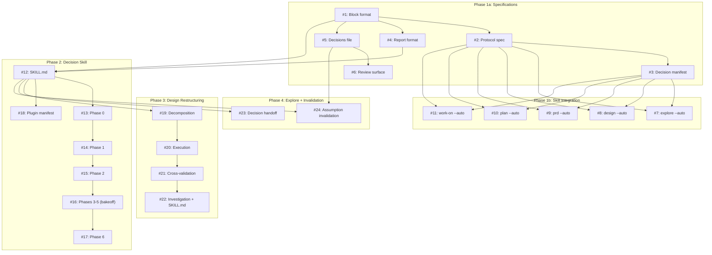

# PLAN: Decision Framework

## Status

Draft

## Scope Summary

Implement the three-layer decision system from DESIGN-decision-framework.md:
a heavyweight decision skill (7-phase bakeoff), a lightweight decision protocol
(3-step micro-workflow), and a non-interactive execution mode (--auto flag).
14 architectural decisions, 11 components, 12 eval scenarios.

## Decomposition Strategy

**Horizontal decomposition.** The design defines 5 sequential implementation
phases (1a, 1b, 2, 3, 4) with clear boundaries. Components within each phase
are independent and can be built in parallel. No integration risk that warrants
a walking skeleton — each phase's deliverables stand alone and are consumed by
the next phase.

## Issue Outlines

### Phase 1a: Protocol and Format Specifications

#### Issue 1: docs(decision): create decision block format specification

- **Complexity**: testable
- **Goal**: Define the HTML comment delimiter format, required/optional fields, compact variant, status values (confirmed/assumed/escalated), and the category-based status threshold from D9.
- **Section**: D1 (block format), D9 (status threshold)
- **Dependencies**: None

**Acceptance criteria:**
- [ ] `references/decision-block-format.md` created
- [ ] Full variant with all fields documented and exemplified
- [ ] Compact variant for simple decisions documented
- [ ] Status threshold rules from D9 with category table
- [ ] Machine extraction regex documented

---

#### Issue 2: docs(decision): create lightweight decision protocol specification

- **Complexity**: testable
- **Goal**: Define the 3-step micro-protocol (frame, gather, decide), trigger conditions, tier classification signals from D12, and the escalation path from D3.
- **Section**: Component 2, D3, D12
- **Dependencies**: <<ISSUE:1>>

**Acceptance criteria:**
- [ ] `references/decision-protocol.md` created
- [ ] Three-step protocol with examples
- [ ] Trigger conditions (4 criteria)
- [ ] Tier classification: manifest-based pre-classification + 3-signal checklist for emergent decisions
- [ ] Escalation from lightweight to heavyweight documented (status="escalated")

---

#### Issue 3: docs(decision): create decision point manifest

- **Complexity**: testable
- **Goal**: Catalogue all 39 known decision points from the ask inventory with location, category, pre-classified tier, and expected behavior in interactive vs --auto modes.
- **Section**: D12, Component 7
- **Dependencies**: <<ISSUE:2>>

**Acceptance criteria:**
- [ ] `references/decision-points.md` created
- [ ] All 39 points from the ask inventory catalogued
- [ ] Each entry has: skill, phase file, line reference, category (researchable/judgment/approval/safety), tier (1-4), interactive behavior, --auto behavior
- [ ] Organized by skill

---

#### Issue 4: docs(decision): create decision report format specification

- **Complexity**: testable
- **Goal**: Define the canonical decision report structure (Context, Assumptions, Chosen, Rationale, Alternatives, Consequences) with consumer rendering sections for Considered Options and ADR per D11.
- **Section**: Component 1 output format, D11
- **Dependencies**: <<ISSUE:1>>

**Acceptance criteria:**
- [ ] Decision report format documented with all 6 fields
- [ ] "How to render as Considered Options" section with field mapping
- [ ] "How to render as ADR" section with field mapping
- [ ] Input/output contract YAML schemas from Component 1

---

#### Issue 5: docs(decision): create consolidated decisions file format

- **Complexity**: simple
- **Goal**: Define the format for `wip/<workflow>_<topic>_decisions.md` with index table and assumption detail entries per D14.
- **Section**: D14, Component 8
- **Dependencies**: <<ISSUE:1>>

**Acceptance criteria:**
- [ ] File format documented: index table at top, assumption details below
- [ ] Review priority field (high/low) documented
- [ ] "If wrong" restart path field documented
- [ ] Source-of-truth clarification: consolidated file is authoritative, inline blocks are snapshots

---

#### Issue 6: docs(decision): create review surface templates

- **Complexity**: simple
- **Goal**: Define the terminal summary format and PR body section template per D2. Terminal summary includes actionable next steps per assumption.
- **Section**: D2, Component 11
- **Dependencies**: <<ISSUE:5>>

**Acceptance criteria:**
- [ ] Terminal summary format with high-priority assumptions and next steps (accept/override/re-run)
- [ ] PR body section template for assumptions
- [ ] Progress feedback protocol documented (phase transition lines, per-agent completion, significant assumption logging)

---

### Phase 1b: Integration into Existing Skills

#### Issue 7: feat(explore): add --auto flag and decision protocol integration

- **Complexity**: testable
- **Goal**: Add --auto flag handling, --max-rounds=3 default, and research-first pattern at all 11 explore decision points.
- **Section**: D7, D10, Component 7
- **Dependencies**: <<ISSUE:2>>, <<ISSUE:3>>

**Acceptance criteria:**
- [ ] --auto flag parsed from $ARGUMENTS in SKILL.md
- [ ] CLAUDE.md `## Execution Mode:` header read as default
- [ ] --max-rounds=N flag parsed, default 3 for explore
- [ ] All 11 explore decision points updated to reference decision-protocol.md
- [ ] Consolidated decisions file created during workflow
- [ ] Progress feedback emitted in --auto mode

---

#### Issue 8: feat(design): add --auto flag and decision protocol integration

- **Complexity**: testable
- **Goal**: Add --auto flag handling, --max-rounds=1 default, and research-first pattern at all 10 design decision points. This is a preparatory step before the full Phase 3 restructuring.
- **Section**: D7, D10, Component 7
- **Dependencies**: <<ISSUE:2>>, <<ISSUE:3>>

**Acceptance criteria:**
- [ ] --auto flag parsed in SKILL.md
- [ ] --max-rounds=1 default for design's loop
- [ ] All 10 design decision points updated to reference decision-protocol.md
- [ ] Consolidated decisions file created during workflow

---

#### Issue 9: feat(prd): add --auto flag and decision protocol integration

- **Complexity**: testable
- **Goal**: Add --auto flag handling, --max-rounds=2 default, and research-first pattern at all 8 prd decision points.
- **Section**: D7, D10, Component 6, Component 7
- **Dependencies**: <<ISSUE:2>>, <<ISSUE:3>>

**Acceptance criteria:**
- [ ] --auto flag parsed in SKILL.md
- [ ] --max-rounds=2 default for prd's loop
- [ ] All 8 prd decision points updated
- [ ] Jury review stays as-is (quality assurance, not decision-making)

---

#### Issue 10: feat(plan): add --auto flag and decision protocol integration

- **Complexity**: testable
- **Goal**: Add --auto flag handling and research-first pattern at all 6 plan decision points.
- **Section**: D7, Component 7
- **Dependencies**: <<ISSUE:2>>, <<ISSUE:3>>

**Acceptance criteria:**
- [ ] --auto flag parsed in SKILL.md
- [ ] All 6 plan decision points updated
- [ ] Execution mode selection auto-follows heuristic in --auto

---

#### Issue 11: feat(work-on): add --auto flag and decision protocol integration

- **Complexity**: simple
- **Goal**: Add --auto flag handling at all 4 work-on decision points. Safety gates (W3, W4) remain blocking in both modes.
- **Section**: D7, Component 7
- **Dependencies**: <<ISSUE:2>>, <<ISSUE:3>>

**Acceptance criteria:**
- [ ] --auto flag parsed in SKILL.md
- [ ] 2 non-safety decision points updated (W1 needs-triage, W2 spec ambiguity)
- [ ] 2 safety gates (W3 CI failure, W4 red checks) explicitly remain blocking
- [ ] Minimal overhead: at most 1-2 decision blocks per invocation

---

### Phase 2: Decision Skill

#### Issue 12: feat(decision): create SKILL.md with input/output contracts

- **Complexity**: testable
- **Goal**: Create the decision skill's orchestrator file with the agent hierarchy description, input/output YAML contracts, fast path vs full path branching, tier handling, and sub-operation interface.
- **Section**: Component 1, D4, D8
- **Dependencies**: <<ISSUE:1>>, <<ISSUE:4>>

**Acceptance criteria:**
- [ ] `skills/decision/SKILL.md` created, under 500 lines
- [ ] Input contract (decision_context YAML) documented
- [ ] Output contract (decision_result YAML) documented
- [ ] Agent hierarchy described (orchestrator > decider > validators)
- [ ] Fast path (phases 0,1,2,6) and full path (all 7) branching
- [ ] Sub-operation interface section (how parents invoke)
- [ ] argument-hint and description for triggering

---

#### Issue 13: feat(decision): implement Phase 0 - context and framing

- **Complexity**: simple
- **Goal**: Create phase-0-context.md. Accept decision question from parent or user, extract constraints, create wip/ context artifact.
- **Section**: Component 1 Phase 0
- **Dependencies**: <<ISSUE:12>>

**Acceptance criteria:**
- [ ] `references/phases/phase-0-context.md` created, under 150 lines
- [ ] Accepts decision_context from parent or parses $ARGUMENTS for standalone
- [ ] Creates `wip/decision_<topic>_context.md`
- [ ] Resume check: skip if context artifact exists

---

#### Issue 14: feat(decision): implement Phase 1 - research

- **Complexity**: testable
- **Goal**: Create phase-1-research.md. Spawn research agent to build context and identify critical unknowns. Produces research report and clean summary.
- **Section**: Component 1 Phase 1
- **Dependencies**: <<ISSUE:13>>

**Acceptance criteria:**
- [ ] `references/phases/phase-1-research.md` created, under 150 lines
- [ ] Research agent spawned (disposable, single-task)
- [ ] Outputs: research report in wip/, clean summary passed to next phase
- [ ] In non-interactive mode: makes assumptions for unknowns it can't resolve

---

#### Issue 15: feat(decision): implement Phase 2 - alternative presentation

- **Complexity**: testable
- **Goal**: Create phase-2-alternatives.md. Generate alternatives via separate agents (or from pre-identified options), present side-by-side comparison.
- **Section**: Component 1 Phase 2
- **Dependencies**: <<ISSUE:14>>

**Acceptance criteria:**
- [ ] `references/phases/phase-2-alternatives.md` created, under 150 lines
- [ ] Alternative agents spawned (disposable) if options not pre-identified
- [ ] Side-by-side comparison with recommendation
- [ ] In interactive mode: AskUserQuestion with evidence
- [ ] In --auto mode: follow recommendation, record decision block

---

#### Issue 16: feat(decision): implement Phases 3-5 - bakeoff, peer revision, cross-examination

- **Complexity**: critical
- **Goal**: Create phase-3-bakeoff.md, phase-4-revision.md, phase-5-examination.md. Implement the validator agent lifecycle with persistent agents via SendMessage across three phases. This is the core differentiator of the heavyweight framework.
- **Section**: Component 1 Phases 3-5, Component 10 (validator contract), D8 (agent hierarchy)
- **Dependencies**: <<ISSUE:15>>

**Acceptance criteria:**
- [ ] Three phase files created, each under 150 lines
- [ ] Phase 3: spawn one validator per alternative, each argues FOR their option
- [ ] Phase 4: SendMessage to each validator with peer summaries, validators revise
- [ ] Phase 5: SendMessage with cross-examination challenges, validators defend/concede
- [ ] Validator contract documented inline: input/output per phase, timeout fallback
- [ ] Skipped entirely for fast path (Tier 3)
- [ ] Decider reads all final positions for Phase 6

---

#### Issue 17: feat(decision): implement Phase 6 - synthesis and report

- **Complexity**: testable
- **Goal**: Create phase-6-synthesis.md. Decider reads all validator outputs (or alternatives comparison for fast path), synthesizes decision, writes canonical decision report.
- **Section**: Component 1 Phase 6, D11 (format with rendering sections)
- **Dependencies**: <<ISSUE:16>>

**Acceptance criteria:**
- [ ] `references/phases/phase-6-synthesis.md` created, under 150 lines
- [ ] Reads validator final positions (full path) or alternatives comparison (fast path)
- [ ] Writes decision report using canonical format with all 6 fields
- [ ] Consumer rendering sections applied (Considered Options or ADR based on context)
- [ ] Cleanup: intermediate artifacts deleted, only report persists
- [ ] Resume check: skip if report exists

---

#### Issue 18: feat(decision): add to plugin manifest and create plugin entry

- **Complexity**: simple
- **Goal**: Register the decision skill in the plugin manifest so it's discoverable and invocable via /decision.
- **Section**: Component 1
- **Dependencies**: <<ISSUE:12>>

**Acceptance criteria:**
- [ ] `skills/decision/` registered in `.claude-plugin/plugin.json`
- [ ] Skill invocable as `/decision <question>`
- [ ] Skill discoverable in skill listing

---

### Phase 3: Design Skill Restructuring

#### Issue 19: refactor(design): implement Phase 1 - decision decomposition

- **Complexity**: testable
- **Goal**: Replace current Phase 1 (approach discovery) with decision decomposition. Identify independent decision questions from problem statement and decision drivers. Apply D13 scaling heuristic.
- **Section**: D6, D13, Component 4
- **Dependencies**: <<ISSUE:12>>

**Acceptance criteria:**
- [ ] `references/phases/phase-1-decomposition.md` created, under 150 lines
- [ ] Reads Context + Decision Drivers, identifies independent decision questions
- [ ] Applies coupling criterion (merge related questions before counting)
- [ ] D13 scaling: 1-5 proceed, 6-7 warn, 8-9 assumption in --auto, 10+ refuse
- [ ] Presents decomposition for confirmation (interactive) or proceeds (--auto)
- [ ] Old phase-1-approach-discovery.md removed

---

#### Issue 20: refactor(design): implement Phase 2 - decision execution

- **Complexity**: critical
- **Goal**: Replace current Phase 2 (present approaches) with parallel decision skill delegation. Spawn one decider agent per decision question. Manage coordination manifest.
- **Section**: D4, D6, Component 4, Component 9
- **Dependencies**: <<ISSUE:19>>, <<ISSUE:12>>

**Acceptance criteria:**
- [ ] `references/phases/phase-2-execution.md` created, under 150 lines
- [ ] Spawns Task agents (one per question) with run_in_background
- [ ] Each agent reads decision SKILL.md directly (D8)
- [ ] Independent decisions run parallel, coupled sequential
- [ ] coordination.json manifest created and updated per agent completion
- [ ] Progress lines emitted per-agent completion (Component 11)
- [ ] Old phase-2-present-approaches.md removed

---

#### Issue 21: refactor(design): implement Phase 3 - cross-validation

- **Complexity**: critical
- **Goal**: New phase for checking assumptions across completed decisions. Single pass with bounded restart per D5.
- **Section**: D5, D6, Component 4
- **Dependencies**: <<ISSUE:20>>

**Acceptance criteria:**
- [ ] `references/phases/phase-3-cross-validation.md` created, under 150 lines
- [ ] Reads all decision reports and their assumptions
- [ ] Checks each assumption against peer decisions' choices
- [ ] Flags conflicts, restarts conflicting decisions once with peer constraints
- [ ] Remaining conflicts accepted as high-priority assumptions
- [ ] Writes unified Considered Options to design doc
- [ ] Cleanup: intermediate decision artifacts deleted post-validation

---

#### Issue 22: refactor(design): slim Phase 4 investigation and update SKILL.md

- **Complexity**: testable
- **Goal**: Narrow the current Phase 3 (deep investigation) to implementation-focused research only (approach validation moved to decision skill). Update SKILL.md to reflect 8-phase structure with new resume logic.
- **Section**: D6, Component 4
- **Dependencies**: <<ISSUE:21>>

**Acceptance criteria:**
- [ ] phase-4-investigation.md updated (was phase-3-deep-investigation.md)
- [ ] No longer validates the chosen approach (decision skill did that)
- [ ] Focuses on implementation unknowns: codebase integration, edge cases, dependencies
- [ ] SKILL.md updated with 8-phase workflow
- [ ] Resume logic updated for new phase numbering
- [ ] Phase 5-7 renumbered from old Phase 4-6

---

### Phase 4: Explore Integration + Assumption Invalidation

#### Issue 23: feat(explore): add decision skill handoff for Decision Record

- **Complexity**: testable
- **Goal**: When crystallize selects Decision Record, write a decision brief and hand off to the decision skill instead of producing an ADR inline. Move Decision Record from deferred to supported types.
- **Section**: Component 5, D3 (escalation)
- **Dependencies**: <<ISSUE:12>>

**Acceptance criteria:**
- [ ] `phase-5-produce-decision.md` created alongside other produce sub-files
- [ ] Decision brief format: question, known options, constraints, research paths, complexity signal
- [ ] crystallize-framework.md updated: Decision Record moved to supported types
- [ ] phase-5-produce.md routing table updated
- [ ] SKILL.md reference table updated
- [ ] Escalation from lightweight: explore spawns agent on status="escalated"

---

#### Issue 24: feat: implement assumption invalidation flow

- **Complexity**: critical
- **Goal**: Implement Component 8 -- the flow for when a user says an assumption is wrong. Trigger by assumption ID, re-evaluate affected decision, cascade detection.
- **Section**: Component 8
- **Dependencies**: <<ISSUE:5>>, <<ISSUE:12>>

**Acceptance criteria:**
- [ ] Agent can locate assumption by ID in consolidated decisions file
- [ ] Reads "if wrong" restart path to determine affected decision and phase
- [ ] Heavyweight: re-invokes decision skill with correction as constraint
- [ ] Lightweight: re-runs micro-protocol with correction as constraint
- [ ] Cascade: checks other decisions' assumptions for references to invalidated choice
- [ ] --auto mode: auto-reruns all flagged cascade decisions
- [ ] Interactive mode: presents flagged cascades for user confirmation
- [ ] Updated consolidated decisions file with new decision, removed old assumption

---

## Dependency Graph

## Implementation Sequence

**Critical path:** Issue 1 → 2 → 3 → 7-11 (Phase 1a → 1b) and Issue 1 → 4 → 12 → 13 → ... → 17 (Phase 1a → 2) run in parallel.

**Parallelization opportunities:**

| Parallel group | Issues | Notes |
|---------------|--------|-------|
| Phase 1a specs | 1 first, then 2+4+5 in parallel, then 3+6 | Block format is the foundation |
| Phase 1b integrations | 7, 8, 9, 10, 11 all parallel | Each skill is independent |
| Phase 2 skill | 12 first, then 13→14→15→16→17 sequential, 18 parallel with any | Phases are sequential by nature |
| Phase 3 restructuring | 19→20→21→22 sequential | Each phase builds on prior |
| Phase 4 | 23 and 24 parallel | Independent concerns |

**Phases 1b and 2 can run in parallel** once Phase 1a is complete.
**Phases 3 and 4 depend on Phase 2** (need the decision skill to exist).

**Recommended execution order:**
1. Issues 1-6 (Phase 1a) — foundation specs
2. Issues 7-11 (Phase 1b) + Issues 12-18 (Phase 2) in parallel
3. Issues 19-22 (Phase 3) + Issues 23-24 (Phase 4) in parallel
