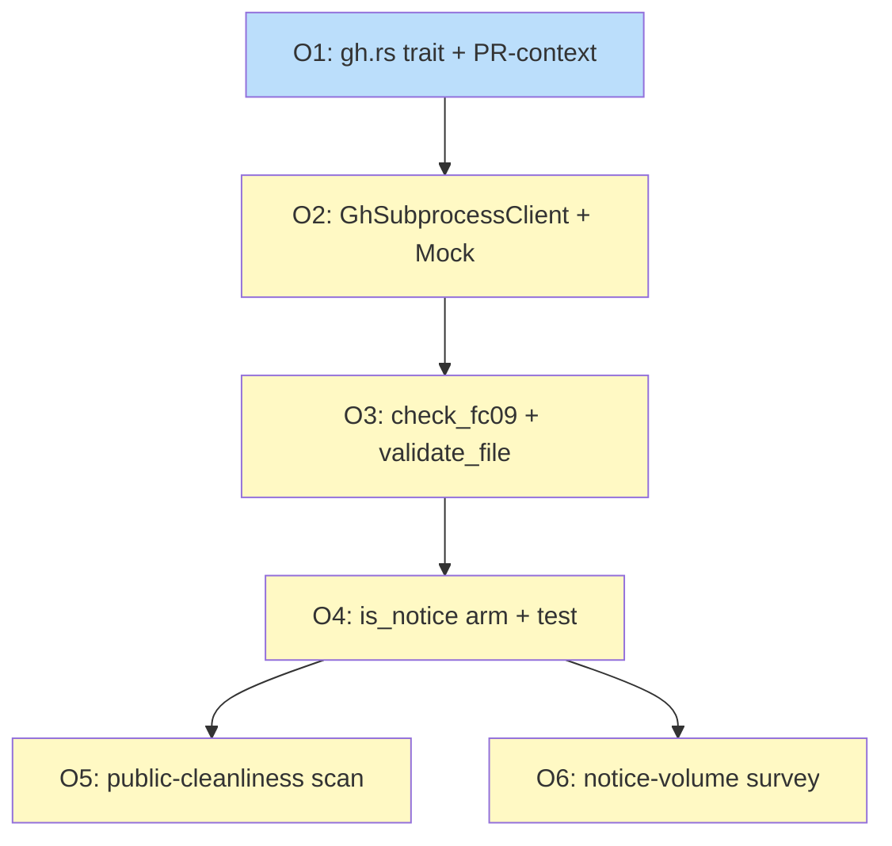

# PLAN: doc-vs-github-state-reconciliation

## Status

Draft

Single-pr ephemeral plan per the parent PRD's R16: this PLAN lives
only on the FC09 PR branch and is verified-and-deleted before that
PR merges. It never reaches main. The corresponding FC09 row in
`PLAN-roadmap-plan-standardization.md` is the parent's tracking
surface; this PLAN exists to give /work-on the outline-level
decomposition the implementation PR consumes.

## Scope Summary

FC09 closes the third reconciliation axis in `shirabe-validate` by
adding `check_fc09` to `crates/shirabe-validate/src/checks.rs` and
its supporting `crates/shirabe-validate/src/gh.rs` module. The
check reconciles plan/roadmap doc claims (table strikethrough,
diagram class assignments) against GitHub's observed issue state
plus the current PR's `Closes #N` body lines, ships notice-level
via the existing `is_notice` membership, and self-disables
gracefully on missing credentials, missing PR context, rate-limit
exhaustion, or per-row cross-repo access denial.

## Decomposition Strategy

**Horizontal.** The upstream DESIGN's `## Implementation Approach`
section names six implementation steps with a clear prerequisite
chain -- a new module's surface (O1), its impl plus test stand-in
(O2), its consumer (O3), the membership wiring that turns
emissions into notices (O4), and two corpus-scope verification
scans (O5 and O6). There is no end-to-end runtime path to thicken;
each step builds one capability fully before the next can build on
top. This matches the parent DESIGN's Decision 3 posture and the
FC07 sub-DESIGN's Decision 6 single-bundled-PR default.

The work-slicing decision above is named as separate from the
single-pr/multi-pr execution-mode decision per the parent PRD's
R10: the execution mode is **single-pr**, pre-committed by the
parent /scope chain. The six outlines compose into one observable
increment (the wired-in notice-level check with corpus
verification) -- the value-confirmation guard (R11/R12) is
degenerate for a single-pr plan; the one PR delivers the whole
feature.

## Issue Outlines

### Outline O1: feat(validate): add gh.rs with IssueStateClient trait and PR-context detector

**Goal**: Create `crates/shirabe-validate/src/gh.rs` with the
`IssueStateClient` trait, the supporting data types
(`IssueState`, `ClientError`, `PrContext`), the constructor-only
`GhSubprocessClient` struct, and the `detect_pr_context()`
env-var reader; register the module in `lib.rs`. No network
method impls yet -- the impl ships in O2.

**Acceptance Criteria**:

- [ ] `crates/shirabe-validate/src/gh.rs` declares
  `pub trait IssueStateClient` with the two-method shape from
  DESIGN Decision 2 (`fetch_issue_state(owner, repo, number) ->
  Result<IssueState, ClientError>`,
  `fetch_pr_body(owner, repo, number) -> Result<String,
  ClientError>`).
- [ ] `pub enum IssueState { Open, Closed }` derives `Clone, Copy,
  Debug, PartialEq, Eq`.
- [ ] `pub enum ClientError` declares the six variants
  `Auth, NotFound, Forbidden, RateLimit, Network, Malformed(String)`
  with `#[derive(Clone, Debug)]`.
- [ ] `pub struct GhSubprocessClient` declares the three private
  fields (timeout, gh_bin, auth_ok) and exposes `pub fn new() ->
  Self`; method impls are placeholders that return
  `Err(ClientError::Network)` (filled in O2).
- [ ] `pub struct PrContext { owner, repo, number }` derives
  `Clone, Debug, PartialEq, Eq`.
- [ ] `pub fn detect_pr_context() -> Option<PrContext>` reads, in
  priority order, `SHIRABE_PR_NUMBER`, then `GITHUB_REF` matched
  against `^refs/pull/(\d+)/merge$`; `owner` and `repo` come from
  `GITHUB_REPOSITORY` of form `<owner>/<repo>`.
- [ ] Unit tests cover the seven env-var cases from DESIGN
  Decision 7 (override-only, `GITHUB_REF`-only, both-set,
  neither-set, malformed `GITHUB_REF`, malformed
  `GITHUB_REPOSITORY`, malformed override).
- [ ] `crates/shirabe-validate/src/lib.rs` adds `pub mod gh;` (no
  re-exports per the crate's "Public exports are unstable across
  shirabe versions" posture).
- [ ] `cargo build -p shirabe-validate` succeeds; `cargo test -p
  shirabe-validate` passes the new env-var matrix.

**Dependencies**: None

**Type**: code
**Files**: `crates/shirabe-validate/src/gh.rs`,
`crates/shirabe-validate/src/lib.rs`

### Outline O2: feat(validate): implement GhSubprocessClient and MockIssueStateClient

**Goal**: Implement the two `IssueStateClient` methods on
`GhSubprocessClient` (subprocess spawn, 5-second user-space
poll-and-kill timeout, depth-aware top-level JSON field
extraction, stderr-pattern classification), add the
`#[cfg(test)] MockIssueStateClient` test stand-in, and unit-test
the surface against the cases pinned in DESIGN Decision 3.

**Acceptance Criteria**:

- [ ] `GhSubprocessClient::fetch_issue_state` shells out to
  `gh api repos/<owner>/<repo>/issues/<n>` using
  `std::process::Command` with an explicit argument array (no
  shell interpolation).
- [ ] `GhSubprocessClient::fetch_pr_body` shells out to
  `gh api repos/<owner>/<repo>/pulls/<n>` with the same
  spawn-and-poll discipline.
- [ ] The 5-second timeout is enforced via the
  `Child::try_wait` + `Child::kill` + `std::thread::sleep`
  poll-and-kill loop from DESIGN Security Considerations
  ("Subprocess timeout enforcement"); the 50ms poll interval is
  honored.
- [ ] Subprocess stdout reading is capped at 4 MiB; overshoot
  returns `Err(ClientError::Malformed("response exceeded 4 MiB
  ceiling"))` and the polling loop kills the child.
- [ ] The depth-aware top-level field extractor from DESIGN
  Security Considerations ("Defensive parsing of `gh api`
  stdout") is implemented for both the issue `state` field and
  the PR `body` field; nested fields like `milestone.state` or
  `pull_request.merged_at` do not match.
- [ ] Stderr classification maps the documented `gh api`
  rate-limit substrings (`API rate limit exceeded`,
  `secondary rate limit`) to `Err(ClientError::RateLimit)`; any
  other non-zero exit maps to `Err(ClientError::Network)`.
- [ ] `owner` and `repo` arguments are validated against
  `^[A-Za-z0-9][A-Za-z0-9._-]{0,38}$` before being passed to `gh
  api`; failing inputs return `Err(ClientError::NotFound)`
  without a subprocess call. The validation gate runs in **every**
  source path (`PrContext`, cross-repo Dependencies cell,
  `Closes owner/repo#N` substring).
- [ ] `GhSubprocessClient::new()` runs `gh auth status` once at
  construction; non-zero exit sets `auth_ok: false` and every
  subsequent `fetch_*` returns `Err(ClientError::Auth)`.
- [ ] `#[cfg(test)] pub(crate) struct MockIssueStateClient`
  implements `IssueStateClient` by consulting two `HashMap`s
  (`issues`, `prs`) populated inline at test setup, per DESIGN
  Decision 3.
- [ ] Unit tests using fixture-script `gh` binaries (gated on
  `gh` presence on `$PATH`, skipped with a warning when absent)
  cover: success path, each `ClientError` variant, the timeout
  (fixture script sleeps longer than 5s), the auth probe
  (fixture script exits non-zero), and the 4 MiB ceiling.
- [ ] Unit tests for `MockIssueStateClient` cover all six pinned
  cases (open, closed, malformed, rate-limit, 403, 404).
- [ ] `cargo test -p shirabe-validate` passes the new tests; no
  test ever exits the process on a panic from malformed JSON.

**Dependencies**: Blocked by <<ISSUE:O1>>

**Type**: code
**Files**: `crates/shirabe-validate/src/gh.rs`

### Outline O3: feat(validate): add check_fc09 with three sub-checks and wire into validate_file

**Goal**: Implement
`check_fc09(doc: &Doc, spec: &FormatSpec, client: &dyn
IssueStateClient, pr_ctx: Option<&PrContext>) ->
Vec<ValidationError>` in `crates/shirabe-validate/src/checks.rs`
with the three sub-checks (Sub A: doc claims done vs GH open;
Sub B: doc claims non-done vs GH closed; Sub C: PR `Closes #N`
reconciliation in both directions), and wire the dispatch into
the `Plan` and `Roadmap` arms of `validate_file` in
`crates/shirabe-validate/src/validate.rs`.

**Acceptance Criteria**:

- [ ] `check_fc09` returns an empty vec when
  `spec.issues_table_columns` is empty (no-op gate matching
  FC05/FC06/FC07).
- [ ] Sub A and Sub B reuse the FC07 `class_vs_status_pass`
  shape: same profile-aware `row_by_id` lookup, same
  `STATUS_CLASSES` filter (`done`, `ready`, `blocked`), same
  `^I[0-9]+$` node id regex; the only swap is `Row.terminal` ->
  `client.fetch_issue_state` for the observed state.
- [ ] Sub C extracts `Closes #N` lines via a `LazyLock<Regex>`
  matching
  `(?i)(?:closes|fixes|resolves)\s+(?:([^\s/]+)/([^\s#]+))?#(\d+)`
  (case-insensitive, optional cross-repo qualifier), and
  reconciles in both directions per PRD R13 (over-claims and
  under-claims).
- [ ] Notices emitted match the eight canonical wordings in
  DESIGN Decision 4 (Sub A defect, Sub B defect, Sub C
  over-claims same-repo, Sub C over-claims cross-repo, Sub C
  under-claims, missing-credentials skip, missing-PR-context
  skip, rate-limit-exhausted skip, per-row cross-repo skip).
- [ ] The rate-limit retry orchestration sits at the call site,
  not inside the client: on first `Err(RateLimit)`,
  `std::thread::sleep(Duration::from_secs(2))` then a single
  re-invocation; on second `RateLimit`, emit the rate-limit skip
  notice and break the per-row loop (subsequent rows are not
  reconciled in that run).
- [ ] If `pr_ctx` is `None`, Sub C emits the missing-PR-context
  skip notice once and is skipped; Sub A and Sub B still run.
- [ ] If the initial credential probe returns
  `Err(ClientError::Auth)`, emit the missing-credentials skip
  notice and return without iterating further.
- [ ] Cross-repo access denial on a row's
  `owner/repo#N` reference emits the per-row cross-repo skip
  notice and continues to subsequent rows.
- [ ] `validate_file` constructs `GhSubprocessClient::new()` once
  per call and calls `detect_pr_context()` once; both are passed
  by reference to `check_fc09` in both the `Plan` and `Roadmap`
  arms.
- [ ] FC09 dispatch runs after FC07 in both format arms; a
  `MissingBlock` from the diagram extractor short-circuits FC09
  the same way it short-circuits FC07.
- [ ] Integration tests cover the eleven pinned fixtures from
  DESIGN Decision 3 (Sub A reconciled+defect, Sub B
  reconciled+defect, Sub C over-claims+under-claims, the four
  self-disable paths, and the bounded-over-malformed-input case)
  for both the Plan and Roadmap profiles; every test uses
  `MockIssueStateClient`.
- [ ] No test ever invokes `gh` directly; offline CI runs the
  whole suite without network access.
- [ ] `cargo test -p shirabe-validate` passes.

**Dependencies**: Blocked by <<ISSUE:O2>>

**Type**: code
**Files**: `crates/shirabe-validate/src/checks.rs`,
`crates/shirabe-validate/src/validate.rs`

### Outline O4: feat(validate): extend is_notice membership to include FC09

**Goal**: Extend the existing `is_notice` `matches!` expression
in `crates/shirabe-validate/src/validate.rs` to include the
`"FC09"` arm (DESIGN Decision 6), rewrite the doc comment to the
FC09-aware wording, rename the membership test to reflect the
new arm, and update the test body so the FC09 positive
assertion lands and the negative for-loop drops FC09.

**Acceptance Criteria**:

- [ ] `pub fn is_notice(err: &ValidationError) -> bool {
  matches!(err.code.as_str(), "SCHEMA" | "FC07" | "FC09") }`
  exactly matches the wording in DESIGN Decision 6.
- [ ] The doc comment above `is_notice` is rewritten to the
  wording in DESIGN Decision 6 (names FC07 and FC09 together as
  notice-level pending their respective corpus-cleanup PRs,
  cites the single-line promotion seam, and points at the
  matching test).
- [ ] The existing test `is_notice_only_schema_and_fc07` is
  renamed to `is_notice_only_schema_fc07_fc09`; the body adds an
  FC09 positive assertion and removes `"FC09"` from the
  for-loop of codes that must not be notices.
- [ ] No other call site in the crate references the old test
  name (a workspace-wide `git grep is_notice_only_schema_and_fc07`
  returns empty after the rename).
- [ ] `cargo test -p shirabe-validate` passes; the membership
  test fails-then-passes on the FC09 arm landing.

**Dependencies**: Blocked by <<ISSUE:O3>>

**Type**: code
**Files**: `crates/shirabe-validate/src/validate.rs`

### Outline O5: chore(validate): public-cleanliness scan of FC09 notices against the committed corpus

**Goal**: Run the built validator with FC09 enabled against the
full `docs/plans/*.md` and `docs/roadmaps/*.md` corpus on the
implementer's local machine. Inspect every emitted notice body
for the public-cleanliness defects DESIGN Implementation
Approach Step 5 names: token bytes, private repo names, paths
to private files, pre-announcement features, or external issue
numbers from private repos. Confirm the
`ClientError::Malformed(String)` payload never reaches a notice
body, log message, or any user-visible surface.

**Acceptance Criteria**:

- [ ] The implementer runs the built validator with FC09 enabled
  against every doc under `docs/plans/` and `docs/roadmaps/`;
  the run executes in a shell that has `gh auth status` working
  (so Sub A and Sub B run) and against a real PR branch with
  `SHIRABE_PR_NUMBER` set (so Sub C runs).
- [ ] Every emitted notice body is inspected against the PRD
  R17 public-cleanliness criteria: no token bytes (no string
  matching the `GITHUB_TOKEN` value if set in the shell), no
  private repo names, no paths to private files, no
  pre-announcement features, no external issue numbers from
  private repos.
- [ ] `git grep -nE 'ClientError::Malformed\([^_]' crates/`
  returns only test/internal-debug sites; no production code
  path embeds the `Malformed` payload in a notice body, log
  message, or `println!`/`eprintln!` call.
- [ ] A grep of the compiled binary's notice output against any
  string that could plausibly originate from `gh api`'s stdout
  returns empty (the payload-non-emission invariant from DESIGN
  Security Considerations).
- [ ] The PR body's verification section records the result as
  one bullet ("FC09 public-cleanliness scan: pass").

**Dependencies**: Blocked by <<ISSUE:O4>>

**Type**: task

### Outline O6: chore(validate): notice-volume corpus impact survey

**Goal**: Run the built validator with FC09 enabled against the
full `docs/plans/*.md` and `docs/roadmaps/*.md` corpus locally
and capture the notice count. The number lands in the PR body's
verification section as evidence FC09 ships at a tractable
notice volume (parent DESIGN's no-day-one-breakage invariant;
PRD Known Limitation #1).

**Acceptance Criteria**:

- [ ] The implementer runs the built validator with FC09 enabled
  against every plan and roadmap doc and captures the total
  FC09 notice count.
- [ ] The notice count is recorded in the PR body's
  verification section in one bullet ("FC09 notice volume on
  committed corpus: N notices over M docs").
- [ ] If the count is non-zero, the PR body cites the parent
  DESIGN's no-day-one-breakage invariant and the PRD's Known
  Limitation #1, confirming notice-level shipping is the
  designed posture for this volume.

**Dependencies**: Blocked by <<ISSUE:O4>>

**Type**: task

## Implementation Issues

Empty in single-pr mode per the plan format spec. The outlines
above carry the issue work; no GitHub issues are created. The
PR that lands the feature carries every outline's acceptance
criteria and is verified-and-deleted before merge (R16).

## Dependency Graph

**Legend**: Green = done, Blue = ready, Yellow = blocked. Outline
IDs (`O<n>`) instead of GitHub issue IDs (`I<n>`) because
single-pr mode does not create GitHub issues -- the outlines
exist only inside this PLAN doc and disappear with it when the
PR merges (R16).

## Implementation Sequence

The six outlines form one critical path with a parallelization
fork at the end:

1. **O1 first.** The trait surface and the PR-context detector
   are the foundation; no other outline can land until O1's
   types are declared.
2. **O2 after O1.** The subprocess impl and the test stand-in
   require the trait declarations from O1.
3. **O3 after O2.** `check_fc09` calls into the impl O2 lands
   and consumes the `MockIssueStateClient` for integration
   tests.
4. **O4 after O3.** The `is_notice` arm has no semantic content
   without the check that produces the FC09 emissions; landing
   the arm before the check would point at nothing.
5. **O5 and O6 in parallel after O4.** Both are corpus-scope
   verification scans against a notice-shaped check; they
   answer two distinct questions (R17 cleanliness and R20 no-
   day-one-breakage volume) and produce two PR-body bullets.
   They can run in either order or simultaneously.

**Recommended order** for the implementing /work-on session:
O1 -> O2 -> O3 -> O4 -> (O5 + O6 together).

The DESIGN explicitly states a single bundled PR is the default
shape; the FC07 sub-DESIGN's Decision 6 also defaults to a
single bundled PR and notes that splitting at the trait/impl
boundary (O1 alone) is acceptable if the maintainer prefers a
smaller diff. In single-pr mode this is presentation only -- the
whole PLAN lands in one PR regardless.
