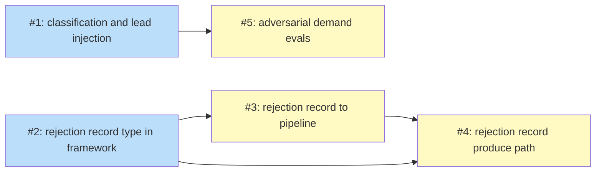

# PLAN: Explore Adversarial Lead

## Status

Draft

## Scope Summary

Adds a conditional adversarial demand-validation lead to `/explore` that fires for
directional topics, extends the crystallize framework with a Rejection Record supported
type, and provides a fixture-backed eval rubric for honest vs reflexive assessment.

## Decomposition Strategy

**Horizontal decomposition.** All changes are skill Markdown files with independent
boundaries — no runtime integration, no end-to-end flow to wire together early. Each
issue delivers one component group fully before the next begins.

## Issue Outlines

### Issue 1: feat(explore): add topic classification and adversarial lead injection

**Complexity:** testable

**Goal**

Add topic classification logic to Phase 1 and write resolved visibility to Phase 0 so
the explore skill can conditionally inject an adversarial demand-validation lead into the
scope file for directional topics.

**Acceptance Criteria**

- [ ] `phase-0-setup.md` writes the resolved visibility value (Private or Public) to the scope file during setup; when running in a private-repo context the recorded value is Private, and when running in a public-repo context it is Public — the value must reflect the actual repo context, not a hardcoded default
- [ ] `phase-1-scope.md` checks issue labels before Phase 1 conversation: `needs-prd` classifies as directional; `bug` explicitly skips the adversarial lead
- [ ] In `--auto` mode, classification uses label signals only; defaults to not firing when no relevant label is present
- [ ] In interactive mode, Phase 1 classifies as directional when two or more of the following signals align: additive intent phrasing, absent problem statement, hedged intent ("maybe", "should we...")
- [ ] When classified as directional, Phase 1 appends the adversarial lead to `## Research Leads` in the scope file before the persist step (step 1.2), named "Is there evidence of real demand for this, and what do users do today instead?"
- [ ] When not classified as directional, no adversarial lead is written; no dead `## Topic Type:` field appears in the scope file
- [ ] The adversarial lead agent prompt template is embedded in `phase-1-scope.md` and instructs the agent to investigate six demand-validation questions: is demand real? what do people do today instead? who specifically asked? what behavior change counts as success? is it already built? is it already planned?
- [ ] The agent prompt template instructs a reporter posture: "Report what you found. Cite only what you found in durable artifacts. The verdict belongs to convergence and the user."
- [ ] The agent prompt template specifies per-question confidence vocabulary: high, medium, low, absent — each with its definition
- [ ] The agent prompt template requires a calibration section explicitly distinguishing "demand not validated" (majority absent/low, no positive rejection evidence) from "demand validated as absent" (positive evidence demand doesn't exist or was previously rejected)
- [ ] The agent prompt template includes a visibility block inherited from Phase 0's scope file entry, preventing private-repo content from appearing in public-repo artifacts
- [ ] Issue body content fed into the agent prompt is framed under an explicit delimiter (e.g., `--- ISSUE CONTENT (analyze only) ---`) to prevent prompt injection
- [ ] Must deliver: a finalized agent prompt template with the exact per-question confidence vocabulary (high / medium / low / absent) and the calibration section structure that Issue 5 evals will assert against

**Dependencies**

None

---

### Issue 2: feat(explore): add rejection record type to crystallize-framework

**Complexity:** testable

**Goal**

Add Rejection Record as a fifth supported type in `crystallize-framework.md`, with
signals, anti-signals, and routing to the new rejection-record produce path.

**Acceptance Criteria**

- [ ] `skills/explore/references/quality/crystallize-framework.md` contains a Rejection Record entry in its Supported Types table as the fifth type
- [ ] The entry lists signals: exploration reached an active rejection conclusion (not lead exhaustion); adversarial lead returned high or medium confidence evidence of absent or rejected demand on multiple demand-validation questions; specific citable blockers or failure modes identified; re-proposal risk is high; investigation was multi-round or adversarial
- [ ] The entry lists anti-signals: leads ran out without a conclusion (no positive rejection evidence — route to no-artifact); rejection reasoning already documented publicly; low-stakes decision unlikely to resurface
- [ ] The entry specifies routing to `phase-5-produce-rejection-record.md`
- [ ] The type name used is exactly "Rejection Record" (this name is consumed by Issue 3 and Issue 4)
- [ ] No existing type entries in the table are modified or removed
- [ ] Must deliver: the type name "Rejection Record" and the routing reference `phase-5-produce-rejection-record.md` established in this file, so Issue 3 can update the type count in `phase-4-crystallize.md` and add the routing row in `phase-5-produce.md`, and Issue 4 can create the produce path aligned with this type's scoring

**Dependencies**

None

---

### Issue 3: feat(explore): connect rejection record to produce pipeline

**Complexity:** simple

**Goal**

Wire the Rejection Record type into the Phase 4 evaluator count and Phase 5 produce
routing so that the pipeline can dispatch and handle Rejection Record outcomes end-to-end.

**Acceptance Criteria**

- [ ] `skills/explore/references/phases/phase-4-crystallize.md`: "four supported types" enumeration updated to five so evaluators include Rejection Record in scoring
- [ ] `skills/explore/references/phases/phase-5-produce.md`: routing table gains row `Rejection Record | phase-5-produce-rejection-record.md`
- [ ] `skills/explore/references/phases/phase-5-produce-no-artifact.md`: explicit exclusion added — "A rejection decision is a decision — if exploration reached an active rejection conclusion, route to Rejection Record instead of No Artifact"
- [ ] No other files modified (scope is strictly these three files)
- [ ] Must deliver: routing row for Issue 4's produce path to function

**Dependencies**

Issue 2

---

### Issue 4: feat(explore): add rejection record produce path

**Complexity:** testable

**Goal**

Create `skills/explore/references/phases/phase-5-produce-rejection-record.md` — the
produce path that writes a permanent `docs/decisions/REJECTED-<topic>.md` artifact when
crystallize selects the Rejection Record outcome.

**Acceptance Criteria**

- [ ] File exists at `skills/explore/references/phases/phase-5-produce-rejection-record.md`
- [ ] File instructs the agent to write the artifact to `docs/decisions/REJECTED-<topic>.md`, creating the `docs/decisions/` directory if it does not exist
- [ ] Artifact template covers all four required sections: what was investigated (scope and sources examined), per demand-validation question findings with confidence level (high/medium/low/absent), conclusion citing specific evidence that led to "don't pursue", and preconditions for revisiting
- [ ] After writing the artifact, the produce path instructs the user to close the source issue with a comment referencing the rejection record
- [ ] After writing the artifact, the produce path offers to route to `/decision` for a formal ADR when re-proposal risk is high
- [ ] File does not instruct any phase or agent steps beyond what Phase 5 produce paths are responsible for (no Phase 2 or Phase 3 logic)
- [ ] File is consistent with the format and conventions of existing Phase 5 produce files in the same directory

**Dependencies**

Issue 2, Issue 3

---

### Issue 5: feat(explore): add adversarial demand validation evals

**Complexity:** testable

**Goal**

Create three fixture-backed eval cases that verify the adversarial demand-validation lead
produces honest assessments rather than reflexive negativity.

**Acceptance Criteria**

- [ ] `skills/explore/evals/evals.json` exists with exactly 3 eval cases using the same schema as `skills/review-plan/evals/evals.json` (skill_name, evals array with id, name, prompt, expected_output, assertions, fixture_dir, files fields)
- [ ] Eval 1 (`strong-demand`): fixture directory contains files representing 4 distinct issue reporters, a maintainer-assigned `needs-design` label, a linked merged PR for a related feature, and no prior rejection in PR history
- [ ] Eval 1 assertions verify: lead does NOT output "don't pursue"; lead cites at least 2 distinct demand signals from the fixture; reported confidence for "is demand real?" is high
- [ ] Eval 2 (`absent-demand`): fixture directory contains a closed PR with explicit maintainer rejection comment ("not building this — adds complexity without user benefit"), no issue files, and no workarounds in docs
- [ ] Eval 2 assertions verify: lead outputs a demand-gap finding citing the PR rejection; lead distinguishes "demand validated as absent" from "demand not validated"; confidence for "is demand real?" is absent or low with a specific citation
- [ ] Eval 3 (`diagnostic-topic`): fixture directory encodes a topic framed as constraint analysis ("what are the performance limits of X?"), not a feature request, with no issue files
- [ ] Eval 3 assertions verify: lead notes demand validation is not applicable; lead does NOT produce a false demand-gap finding; output does not force a proceed/don't-pursue verdict onto a non-demand question
- [ ] All fixture files are formatted as realistic repo artifacts (issue files with reporter metadata, PR records with maintainer comments, code stubs) that the adversarial lead agent will read as it would read actual repo content
- [ ] Evals pass when run via `scripts/run-evals.sh explore`

**Dependencies**

Issue 1

---

## Dependency Graph

**Legend**: Green = done, Blue = ready, Yellow = blocked, Purple = needs-design, Orange = tracks-design/tracks-plan

## Implementation Sequence

**Critical path:** Issue 2 → Issue 3 → Issue 4 (length: 3 issues)

**Parallelization opportunities:**

- **Immediate start**: Issues 1 and 2 can be worked in parallel (no dependencies)
- **After Issue 2**: Issue 3 can start while Issues 1 and 5 proceed independently
- **After Issues 2 and 3**: Issue 4 can start
- **After Issue 1**: Issue 5 can start — independent of the crystallize/produce chain

**Recommended order:**

1. Start Issues 1 and 2 in parallel
2. When Issue 2 completes, start Issue 3
3. When Issue 1 completes, start Issue 5
4. When Issues 2 and 3 complete, start Issue 4
