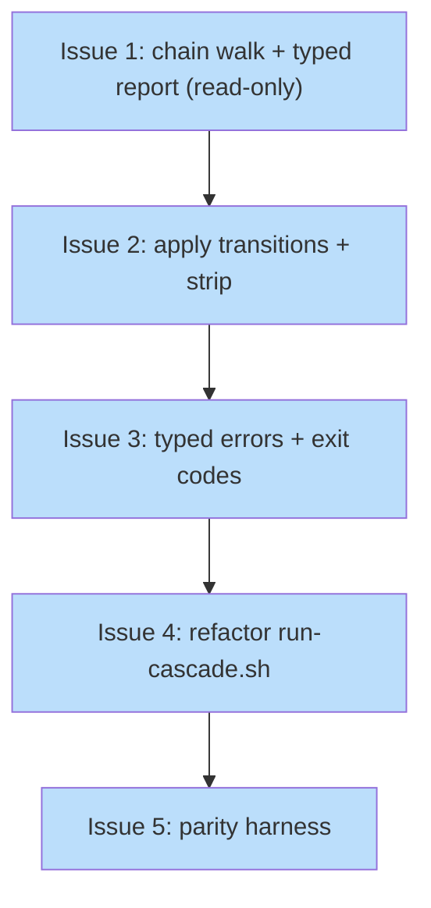

# PLAN: finalize-chain

## Status

Draft

## Scope Summary

Add a `shirabe finalize-chain <plan>` subcommand that walks a PLAN's upstream chain and
applies each tactical node's terminal transition in-process via the existing engine, then
shrink `run-cascade.sh` to git orchestration over it -- preserving the cascade's external
`cascade_status`/`steps` contract. Implements `docs/designs/DESIGN-finalize-chain.md`.

## Decomposition Strategy

**Horizontal.** This is a refactor with a stable target contract, not a new end-to-end
feature, so the build proceeds layer by layer: first the subcommand's read-only walk and
typed report, then transition application, then the error/exit-code surface, then the bash
refactor that consumes it, and finally the parity harness. The layering is dictated by the
design's "read-only walk first, then apply, then errors, then refactor the script, then
parity" order, which surfaces walk and type-resolution bugs before any mutation or any
caller change is wired in. The issues are sequential commits within one PR (single-pr): the
deliverable -- the cascade backed by the engine -- is one cohesive unit of usable value,
and the parity gate (Issue 5) only makes sense once the refactor (Issue 4) lands, so a
multi-PR split would produce building blocks no reader could use on their own.

## Issue Outlines

### Issue 1: feat(finalize): chain walk and typed report (read-only)

**Goal**: Add the `finalize-chain` subcommand and a `finalize` module that walks a PLAN's
upstream chain, resolves each node's format, and emits a typed JSON report, without mutating
any document.

**Acceptance Criteria**:
- [ ] A `finalize-chain` variant is added to the clap `Commands` enum taking one positional `plan` argument, slotted beside `Transition` in `crates/shirabe/src/main.rs`.
- [ ] A new `finalize` module in `crates/shirabe-validate` walks the chain by reading `parse_doc(node).fields.get("upstream").value`, following each link until a node has no `upstream`.
- [ ] Each node's format is resolved via `detect_format`; dispatch keys on the resolved format name (`Design`, `Prd`, `Brief`, `Roadmap`, `Vision`, `Plan`).
- [ ] A node whose format carries no `transition_spec` (`Plan`) is reported as a delete node; `Roadmap`/`Vision` are reported as a handoff/stop and end the walk; an unrecognized prefix produces a typed error entry.
- [ ] The subcommand emits an ordered JSON report (no document is modified in this issue), following the `Outcome::to_json()` envelope style; each entry carries an `action` from a fixed set (`delete_plan`, `transition_design`, `transition_prd`, `transition_brief`, `roadmap_handoff`, `stop`).
- [ ] Unit tests cover: a full DESIGN->PRD->BRIEF chain, the no-upstream case, the ROADMAP/VISION stop, the unknown-prefix error, and the PLAN-as-delete classification.

**Dependencies**: None

**Type**: code
**Files**: `crates/shirabe/src/main.rs`, `crates/shirabe-validate/src/finalize.rs`, `crates/shirabe-validate/src/lib.rs`

### Issue 2: feat(finalize): apply tactical transitions and strip Implementation Issues

**Goal**: Make the subcommand apply each tactical node's terminal transition in-process and
strip a DESIGN's stale Implementation Issues section, populating the report with results.

**Acceptance Criteria**:
- [ ] For a DESIGN node, the subcommand strips the `## Implementation Issues` section (a ported `strip_implementation_issues` helper) and then calls `run_transition(path, "Current")`, recording `new_path` and `moved` in the report.
- [ ] For a PRD node it calls `run_transition(path, "Done")`; for a BRIEF node, `run_transition(path, "Done")`; each result is recorded.
- [ ] The single-document `transition` subcommand and its output are unchanged (verified: no edits to its code path or tests beyond shared helpers).
- [ ] The ported strip helper is idempotent (a second run with no Implementation Issues section is a no-op) and unit-tested against the bash behavior.
- [ ] Unit tests run the subcommand against fixture chains and assert the on-disk status/`new_path` results match expectations.

**Dependencies**: Blocked by <<ISSUE:1>>

**Type**: code
**Files**: `crates/shirabe-validate/src/finalize.rs`

### Issue 3: feat(finalize): typed errors and exit-code contract

**Goal**: Give the subcommand node-and-type-aware structured errors and a multi-level
exit-code contract, replacing any bare-payload error surface.

**Acceptance Criteria**:
- [ ] A refused transition produces a structured error (`{success:false, error, code}`) whose message names the node path, its resolved type, the attempted transition, and the engine's reason.
- [ ] Exit codes follow the single-document transition's levels: 0 clean success, 2 lifecycle violation (illegal/precondition-failing transition), 1 tool error (missing/unreadable/unparseable input), 3 I/O error.
- [ ] A node that looks like a cross-repo `owner/repo:path` upstream stops the walk with a clear report entry rather than being resolved.
- [ ] Each upstream path is validated (within repo root, regular tracked file, not a symlink) before any read or transition.
- [ ] Unit tests assert one case per exit-code level and the cross-repo stop.

**Dependencies**: Blocked by <<ISSUE:2>>

**Type**: code
**Files**: `crates/shirabe-validate/src/finalize.rs`, `crates/shirabe/src/main.rs`

### Issue 4: refactor(work-on): shrink run-cascade.sh to git orchestration over finalize-chain

**Goal**: Replace the cascade's tactical-type dispatch and frontmatter parsing with a call
to `finalize-chain`, keeping git operations, the roadmap handler, and the preserved output
contract in the script.

**Acceptance Criteria**:
- [ ] `run-cascade.sh` no longer contains a tactical-type `case` block (DESIGN/PRD/BRIEF) or its own frontmatter reader (`get_frontmatter_field`); a grep for those constructs finds none.
- [ ] The script `git rm`s the PLAN, invokes `finalize-chain`, and translates the report into the existing `steps[]` (action/target/found_in/status/detail) and `cascade_status` (completed/partial/skipped), `git add`ing each reported path (using `new_path` for a moved design).
- [ ] The ROADMAP feature-status handler and the `gh`-issue completion guard remain in the script and run on any roadmap node the report hands off, using the report's DESIGN `new_path` for the Downstream rewrite.
- [ ] The script preserves exit 0 whenever the cascade ran and exit 1 only on a setup/precondition failure (PLAN missing, path validation, not a git repo, binary unresolved); the commit and push stay in the script.

**Dependencies**: Blocked by <<ISSUE:3>>

**Type**: code
**Files**: `skills/work-on/scripts/run-cascade.sh`

### Issue 5: test(work-on): parity harness for the refactored cascade

**Goal**: Prove the refactor is invisible downstream by keeping the existing cascade
scenarios green and adding subcommand-level coverage.

**Acceptance Criteria**:
- [ ] All seven `run-cascade_test.sh` scenarios pass against the refactored script with their assertions unchanged; if any single assertion must change, the PR description names that exact assertion and the reason, and no other assertion is touched.
- [ ] The test's shirabe stub is reconciled with the new integration point (the script invokes `finalize-chain` rather than per-node `transition`), with the stub emitting the report the script consumes.
- [ ] A new test exercises `finalize-chain` directly on a fixture chain and asserts the typed report and exit codes.
- [ ] `cargo test` and the cascade test script both pass in CI.

**Dependencies**: Blocked by <<ISSUE:4>>

**Type**: code
**Files**: `skills/work-on/scripts/run-cascade_test.sh`, `crates/shirabe-validate/src/finalize.rs`

## Implementation Issues

This plan is single-PR (`execution_mode: single-pr`): the decomposition lives in the Issue
Outlines above as commits within one pull request, and no GitHub issues or milestone are
created. This section is intentionally empty -- it is populated only in multi-PR mode.

## Dependency Graph

**Legend:** Linear chain; blue = planned (not yet started). Each node is a commit within
the single PR; the arrow is a hard "must land first" order.

## Implementation Sequence

Critical path: Issue 1 -> Issue 2 -> Issue 3 -> Issue 4 -> Issue 5 (fully sequential; no
parallelism, by design). The subcommand is built and unit-green (Issues 1-3) before the
script is touched (Issue 4), and the parity harness (Issue 5) gates the PR: the cascade
refactor is only proven once the seven existing scenarios stay green against it. Issues 1-3
are pure additions (new module + subcommand) that cannot regress existing behavior; the
risk concentrates in Issue 4 (the caller swap) and is caught by Issue 5.
