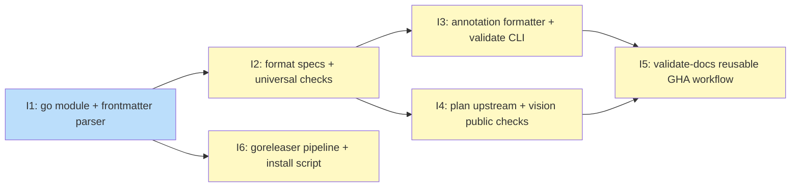

# PLAN: GHA Doc Validation

## Status

Draft

## Scope Summary

Implements the `shirabe` Go CLI and `validate-docs.yml` reusable GHA workflow
that validate shirabe doc formats in downstream repos, with a GoReleaser release
pipeline for local distribution via tsuku and curl.

## Decomposition Strategy

**Horizontal decomposition.** Each design phase maps to one issue with a clear
prerequisite interface. The parser (Phase 1) produces the `Doc` struct that all
checks consume. Checks (Phase 2) produce `ValidationError` values that the CLI
(Phase 3a) emits as GHA annotations. Format-specific checks (Phase 3b) extend
the check layer in parallel with 3a. The GHA workflow (Phase 4) depends on the
complete binary; the release pipeline (Phase 5) is mostly independent once the
module is bootstrapped.

## Issue Outlines

### Issue 1: feat(shirabe): go module scaffold and frontmatter parser

**Goal**: Bootstrap the `github.com/tsukumogami/shirabe` Go module and implement the frontmatter parser that all validation checks depend on.

**Acceptance Criteria**:
- [ ] `go.mod` exists at repo root with `module github.com/tsukumogami/shirabe` and `go 1.21` (or higher)
- [ ] `go.sum` committed with `gopkg.in/yaml.v3` and `github.com/spf13/cobra` entries
- [ ] `internal/validate/doc.go` defines `Doc`, `FieldValue`, `Section`, `ValidationError` types exactly as specified in the design
- [ ] `internal/validate/frontmatter.go` implements `---` delimiter byte-scan, yaml.Node parsing, body `## ` heading extractor
- [ ] yaml.Node key line numbers are offset correctly by the frontmatter block start line so they refer to absolute file line numbers
- [ ] `internal/validate/frontmatter_test.go` has table-driven tests covering: no frontmatter, malformed YAML, block scalars (`|`), missing closing delimiter, heading detection with and without frontmatter
- [ ] `go test ./internal/...` passes

**Dependencies**: None

**Files**: `go.mod`, `go.sum`, `internal/validate/doc.go`, `internal/validate/frontmatter.go`, `internal/validate/frontmatter_test.go`

---

### Issue 2: feat(validate): format specs and universal checks

**Goal**: Add all five format definitions and the four universal check functions (checkSchema, checkFC01–checkFC04) plus the `validateFile` orchestrator.

**Acceptance Criteria**:
- [ ] `internal/validate/formats.go` defines `FormatSpec` entries for all five formats: Design (`DESIGN-`, `design/v1`), PRD (`PRD-`, `prd/v1`), VISION (`VISION`, `vision/v1`), Roadmap (`ROADMAP-`, `roadmap/v1`), Plan (`PLAN-`, `plan/v1`)
- [ ] Each `FormatSpec` has `RequiredFields`, `ValidStatuses`, and `RequiredSections` populated per the PRD requirements
- [ ] `internal/validate/checks.go` implements `checkSchema`, `checkFC01`, `checkFC02`, `checkFC03`, `checkFC04`
- [ ] FC03 body extraction: reads next non-blank line after `## Status` heading from `doc.Body`; comparison is case-insensitive; does not fire when `## Status` has no non-blank body
- [ ] FC02 custom-statuses: when `cfg.CustomStatuses` contains an entry for a format, it replaces (not extends) `ValidStatuses`
- [ ] `internal/validate/validate.go` implements `validateFile(doc Doc, spec FormatSpec, cfg Config) []ValidationError`; `Config` type defined
- [ ] `internal/validate/checks_test.go` has table-driven tests: per-check pass/fail cases, custom-statuses replacement, FC03 absent-section behavior, schema gate skip
- [ ] `go test ./internal/...` passes

**Dependencies**: Blocked by <<ISSUE:1>>

**Files**: `internal/validate/formats.go`, `internal/validate/checks.go`, `internal/validate/validate.go`, `internal/validate/checks_test.go`

---

### Issue 3: feat(shirabe): annotation formatter and validate CLI

**Goal**: Implement the annotation formatter (with newline sanitization) and the cobra `validate` subcommand so `shirabe validate <files>` can be invoked end-to-end.

**Acceptance Criteria**:
- [ ] `internal/annotation/annotation.go` implements `FormatError(err ValidationError) string` and `FormatNotice(file, msg string) string` producing `::error`/`::notice` strings
- [ ] Both functions strip `\n` and `\r` from all embedded field values before formatting (annotation injection prevention — required security constraint)
- [ ] `cmd/shirabe/main.go` sets up cobra root command and `validate` subcommand
- [ ] `validate` accepts `--visibility` (string) and `--custom-statuses` (string) flags and file path arguments
- [ ] `--custom-statuses` enforces a 64KB size guard on the raw YAML string before parsing; oversized input exits with a clear error message
- [ ] `--custom-statuses` YAML parsed into `map[string][]string` using `yaml.v3`; invalid YAML exits with a descriptive error
- [ ] For each file argument: detect format by basename prefix, parse with frontmatter parser, call `validateFile`, emit annotation strings to stdout
- [ ] Exit 1 if any `ValidationError` was produced; exit 0 otherwise
- [ ] Files that cannot be opened: emit `::error` annotation and continue (collect-all, not fail-fast)
- [ ] `shirabe validate` with no file arguments exits 0

**Dependencies**: Blocked by <<ISSUE:2>>

**Files**: `internal/annotation/annotation.go`, `cmd/shirabe/main.go`

---

### Issue 4: feat(validate): plan upstream and vision public checks

**Goal**: Add the two format-specific checks: `checkPlanUpstream` (git ls-files verification) and `checkVisionPublic` (prohibited sections for public repos).

**Acceptance Criteria**:
- [ ] `checkPlanUpstream` added to `checks.go`: checks that `doc.Fields["upstream"]` exists on disk and is tracked by `git ls-files HEAD` in the working directory
- [ ] `checkPlanUpstream` uses `exec.Command("git", "ls-files", "HEAD")` with discrete arguments — no shell interpolation of the upstream field value
- [ ] `checkPlanUpstream` runs in the caller's repo working directory (not `.shirabe-src`)
- [ ] `checkVisionPublic` added to `checks.go`: when `cfg.Visibility == "public"`, checks `doc.Sections` for prohibited headings per the VISION format spec
- [ ] Both checks integrated into `validateFile`'s `switch spec.Name` block
- [ ] Table-driven tests: upstream exists + tracked (pass), upstream missing (fail), upstream not tracked (fail); vision public with prohibited section (fail), vision private/empty (pass)
- [ ] `go test ./internal/...` passes

**Dependencies**: Blocked by <<ISSUE:2>>

**Files**: `internal/validate/checks.go`

---

### Issue 5: feat(workflows): validate-docs reusable GHA workflow

**Goal**: Implement the `validate-docs.yml` reusable GHA workflow that builds the shirabe binary from source and invokes it against changed doc files on PRs.

**Acceptance Criteria**:
- [ ] `.github/workflows/validate-docs.yml` exists with `on: workflow_call:`
- [ ] Workflow declares `permissions: contents: read` at the job level
- [ ] Single workflow input: `custom-statuses` (type: string, required: false, default: empty)
- [ ] Non-PR context detection: if `github.base_ref` is empty, step emits `::notice` and the job exits 0
- [ ] Checkout step: `actions/checkout@v4` with `repository: tsukumogami/shirabe`, `ref: ${{ github.action_ref }}`, `path: .shirabe-src`
- [ ] Cache step: `actions/cache@v4` with paths `~/go/pkg/mod` and `~/.cache/go-build`; key `${{ runner.os }}-go-${{ hashFiles('.shirabe-src/go.sum') }}`
- [ ] Build step: `cd .shirabe-src && go build -o /usr/local/bin/shirabe ./cmd/shirabe`
- [ ] Changed-files step uses `git diff --name-only ${{ github.event.pull_request.base.sha }}...${{ github.event.pull_request.head.sha }}`
- [ ] Invocation: `shirabe validate --visibility=${{ github.repository_visibility }} --custom-statuses=${{ inputs.custom-statuses }} <files>`
- [ ] Job ID is `validate-docs`
- [ ] A caller example is documented (inline comments or companion doc)

**Dependencies**: Blocked by <<ISSUE:3>>, <<ISSUE:4>>

**Files**: `.github/workflows/validate-docs.yml`

---

### Issue 6: feat(release): goreleaser pipeline and install script

**Goal**: Ship the GoReleaser config, release workflow, `install.sh`, and tag protection setup to enable binary distribution via tsuku and curl.

**Acceptance Criteria**:
- [ ] `.goreleaser.yaml` exists following niwa pattern: four build targets (linux/darwin × amd64/arm64), binary name `shirabe`, `checksums.txt` output
- [ ] `.github/workflows/release-binaries.yml` triggers on tag push; runs `goreleaser/goreleaser-action` with `--skip=publish`; uploads artifacts to draft release via `gh release upload`
- [ ] `install.sh` exists: detects OS/arch, downloads binary + `checksums.txt`, verifies SHA256, renames artifact to plain `shirabe`, installs to `~/.shirabe/bin/`, offers optional PATH guidance
- [ ] `install.sh` does not use `sudo`; writes only to `~/.shirabe/bin/`
- [ ] `expected-assets` in `finalize-release.yml` updated to `5` (4 binaries + checksums.txt)
- [ ] Tag protection enabled on `tsukumogami/shirabe` before first v1 tag push: disallow force-push, noted as done in PR comment
- [ ] Stable download URL pattern: `https://github.com/tsukumogami/shirabe/releases/download/v{VERSION}/shirabe-{os}-{arch}` and `.../checksums.txt`

**Dependencies**: Blocked by <<ISSUE:1>>

**Files**: `.goreleaser.yaml`, `.github/workflows/release-binaries.yml`, `install.sh`

---

## Dependency Graph

**Legend**: Green = done, Blue = ready, Yellow = blocked

## Implementation Sequence

**Critical path:** I1 → I2 → I3 → I5 (or I1 → I2 → I4 → I5 — both paths have the same length)

**Parallelizable:** I3 and I4 both depend on I2 and can be worked simultaneously after I2 merges (or by two people on the same PR). I6 depends only on I1 and can proceed independently after the module is bootstrapped.

**Recommended order for a solo single-PR:**

1. **I1** — parser + types; required foundation; establish `Doc` and `FormatSpec` interfaces
2. **I2** — format specs + checks; all five format definitions and FC01–FC04
3. **I3** — annotation + CLI; `shirabe validate` runnable end-to-end after this
4. **I4** — format-specific checks; small addition to `checks.go` after the pattern is established
5. **I5** — GHA workflow; needs complete binary from I3 + I4
6. **I6** — release pipeline; mostly config files; save for last so the full binary surface is known

The annotation injection sanitization (I3) and the `exec.Command` discrete-argument requirement (I4) are the two implementation constraints with security implications — both should be called out explicitly in code review.
