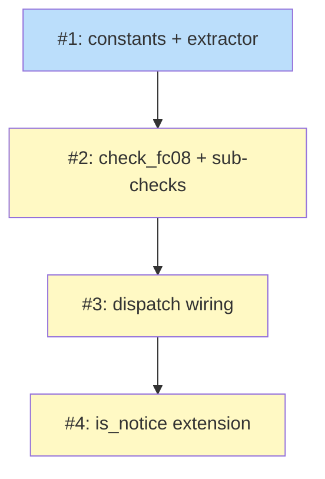

# PLAN: legend-vs-classdef-reconciliation

## Status

Draft

This is an ephemeral single-pr PLAN: the four steps below land in one
PR, and this doc is deleted in the work-completing commit before the
PR can merge. The implementation precedent is the FC07 sub-PLAN (which
also rode as a single PR) and the FC09 sub-DESIGN's Implementation
Approach.

## Scope Summary

FC08 closes the third drift surface in the validator's reconciliation
family. FC07 reconciles the intra-document table-and-diagram pair;
FC09 reconciles the doc against external GitHub state; FC08 reconciles
the Legend prose against the diagram's `classDef` declarations and
the canonical class palette.

The implementation ships as a single PR that adds:

- One new check function `check_fc08` in
  `crates/shirabe-validate/src/checks.rs`.
- One Legend prose extractor `extract_legend` plus a helper
  `parse_legend_entries` and a `normalize_kebab_to_camel` function,
  all in `checks.rs`.
- Two module-level `const` arrays (`FC08_STATUS_PALETTE`,
  `FC08_PIPELINE_STAGE_CLASSES`).
- A one-line dispatch extension in each of the `"Plan"` and
  `"Roadmap"` arms of `validate_file`.
- A one-line extension to the `is_notice` match expression in
  `validate.rs` adding `"FC08"`.
- Approximately 12-15 table-driven tests in `checks.rs`'s `tests`
  module.

The check ships at notice level via the `is_notice` membership; the
promotion seam is the one-line removal of the `"FC08"` arm in a
follow-up cleanup PR.

## Decomposition Strategy

**Single PR, four logical steps.** The DESIGN's Implementation
Approach decomposes the work into four sequential steps -- constants
and extractor, the check function and sub-checks, the dispatch
wiring, and the `is_notice` extension. Each step has clear deliverables
but the dependency between steps (Step 2 calls the extractor Step 1
lands; Step 3 calls the check Step 2 lands; Step 4 turns the check
into a notice) makes splitting across PRs more friction than value.

The single-pr execution mode is the right call because:

- The four steps are small (the total diff is under ~500 lines of
  Rust including tests).
- Splitting at the Step 1 / Step 2 boundary would land a dead-code
  extractor with no consumer; splitting at the Step 3 / Step 4
  boundary would land an FC08 check at error level (since
  `is_notice` would not yet include it), forcing a same-week
  follow-up to flip it to notice.
- The PRD's R10 (notice-level shipping) and R11 (promotion seam)
  bind a one-PR landing for the seam to be coherent.

The PLAN is single-pr ephemeral: this doc lives only on the feature
branch and is deleted in the work-completing commit. The parent
PLAN at `docs/plans/PLAN-roadmap-plan-standardization.md` row #152
strikes through the GitHub issue tracking this work after merge; this
PLAN doc does not survive the merge.

## Issue Outlines

The four outlines below are the single-PR work breakdown. They are
NOT separate GitHub issues; they document the logical decomposition
the implementer follows when landing the PR.

### Outline 1: Add constants, extractor, and normalization helper

**Goal.** Land the two `const` arrays (`FC08_STATUS_PALETTE`,
`FC08_PIPELINE_STAGE_CLASSES`), the `extract_legend` function, the
`parse_legend_entries` helper, and the `normalize_kebab_to_camel`
function in `crates/shirabe-validate/src/checks.rs`. Add focused
unit tests for each function.

**Acceptance criteria.**

- `FC08_STATUS_PALETTE` is a module-level `const &[&str]` containing
  exactly `["done", "ready", "blocked"]`, with a doc-comment naming
  the section in `references/dependency-diagram.md` it tracks.
- `FC08_PIPELINE_STAGE_CLASSES` is a module-level `const &[&str]`
  containing exactly the eight names listed in PRD R9
  (`needsDesign`, `needsPrd`, `needsPlanning`, `needsSpike`,
  `needsDecision`, `needsExplore`, `tracksDesign`, `tracksPlan`),
  with a doc-comment naming the reference section.
- `extract_legend(body: &[String], fence_end_line: usize) ->
  Vec<String>` is implemented per the DESIGN's Solution Architecture
  sketch.
- `extract_legend` is total: no panics on malformed input, no
  unbounded loops, no byte-indexing across UTF-8 boundaries.
- Unit tests cover at least: bold-wrapper variants (`**Legend**:`
  outside and inside the colon), absent Legend, malformed Legend
  (stray comma, missing `=`, empty entry, trailing whitespace),
  slash-separated composite entry (`tracks-design/tracks-plan`),
  multiple Legend lines (first wins).
- `normalize_kebab_to_camel` is total over arbitrary UTF-8 input.
- Unit tests cover at least: `needs-design` → `needsDesign`,
  `tracks-design` → `tracksDesign`, `done` (no change), empty
  string (no change), leading hyphen, trailing hyphen, multiple
  consecutive hyphens.

**Complexity.** Simple.

### Outline 2: Add `check_fc08` with three sub-check functions

**Goal.** Land the `check_fc08` function and its three sub-check
helpers (`check_fc08_sub_a`, `check_fc08_sub_b`, `check_fc08_sub_c`)
in `checks.rs`. Add table-driven tests for each PRD acceptance
criterion.

**Acceptance criteria.**

- `check_fc08(doc: &Doc, spec: &FormatSpec) -> Vec<ValidationError>`
  is implemented per the DESIGN's Solution Architecture.
- The function returns an empty Vec when `spec.issues_table_columns`
  is empty (non-Plan, non-Roadmap formats no-op).
- The function returns an empty Vec when no Dependency Graph block
  is present (FC08 does not invent the diagram surface FC07 owns).
- Sub-check A fires only on Legend entries naming a class outside
  the local `classDef` set AND outside the canonical Status palette,
  with the exact notice string from the DESIGN's Decision 2.
- Sub-check B fires only on `classDef` declarations outside the
  canonical Status palette that the Legend does not name (with
  normalization applied), with the exact notice string from the
  DESIGN's Decision 2.
- Sub-check C fires only on Legend entries matching a `classDef`
  only under kebab-to-camel normalization, with the exact notice
  string from the DESIGN's Decision 2.
- All notices have `code = "FC08"`.
- Notice ordering is deterministic: Sub A by Legend order, Sub B by
  sorted `classDef` name, Sub C by Legend order.
- Tests cover every PRD acceptance criterion. Each test function's
  doc-comment names the AC it covers, matching the FC07 convention
  (PRD R13).

**Complexity.** Testable.

### Outline 3: Wire `check_fc08` into `validate_file`

**Goal.** Extend the `"Plan"` and `"Roadmap"` arms of `validate_file`
in `validate.rs` to invoke `check_fc08`. Add integration-style tests
verifying the dispatch fires alongside the other format-specific
checks.

**Acceptance criteria.**

- The `"Plan"` arm of `validate_file`'s match expression invokes
  `check_fc08(doc, spec)` between the `check_fc07` call and the
  FC09 client/context construction.
- The `"Roadmap"` arm invokes `check_fc08(doc, spec)` between the
  `check_fc07` and `check_fc09` calls.
- An integration test constructs a full plan doc with one FC08
  defect and asserts the FC08 notice is in the
  `validate_file` output.
- An integration test constructs a full roadmap doc with one FC08
  defect and asserts the FC08 notice is in the
  `validate_file` output.
- No existing test regresses (FC01 through FC07 and FC09 tests
  continue passing).

**Complexity.** Simple.

### Outline 4: Extend `is_notice` to include FC08

**Goal.** Update the `is_notice` match expression in `validate.rs` to
the four-arm form. Update the accompanying test and the doc-comment.

**Acceptance criteria.**

- `is_notice` matches `"SCHEMA" | "FC07" | "FC08" | "FC09"`.
- The doc-comment above `is_notice` is updated to name FC08
  alongside FC07 and FC09 in the notice-level membership.
- The existing test `is_notice_only_schema_fc07_fc09` is renamed to
  `is_notice_only_schema_fc07_fc08_fc09` and its body extended with
  an FC08 case.
- The test asserts FC08 is notice-level (`is_notice(...)` returns
  true) and asserts that a Vec containing only FC08 notices produces
  an exit code of 0 from the validator (the PRD's R10 acceptance
  criterion).
- The removal of the `| "FC08"` arm is documented in the
  doc-comment as a one-line change that promotes the check to
  error (PRD R11).
- `cargo build --release --bin shirabe && cargo test
  -p shirabe-validate` both succeed.
- A manual run of `./target/release/shirabe validate
  --visibility=public docs/plans/PLAN-roadmap-plan-standardization.md`
  exits 0 (the present committed corpus produces FC08 notices but
  not errors).

**Complexity.** Simple.

## Implementation Issues

The four rows below are placeholder outline indices, NOT real GitHub
issues. This is a single-pr ephemeral PLAN -- the doc is deleted in
the work-completing commit before the PR can merge, and the `#1` -
`#4` keys exist only to satisfy the plan-profile validator's row-key
shape (the corpus has no real outline-row schema until FC10 lands).
The work is tracked by the parent PLAN's row #152.

| Issue | Dependencies | Complexity |
|-------|--------------|------------|
| [#1: Add constants, extractor, and normalization helper](#outline-1-add-constants-extractor-and-normalization-helper) | None | simple |
| _Lands the two `const` arrays plus `extract_legend`, `parse_legend_entries`, and `normalize_kebab_to_camel` in `checks.rs` with focused unit tests covering bold-wrapper variants, malformed input, normalization edge cases, and the canonical happy path._ | | |
| [#2: Add `check_fc08` with three sub-check functions](#outline-2-add-check_fc08-with-three-sub-check-functions) | [#1](#outline-1-add-constants-extractor-and-normalization-helper) | testable |
| _Lands `check_fc08` plus the three sub-check helpers with table-driven tests covering every PRD acceptance criterion. Reuses FC07 infrastructure; introduces no new field on the `Diagram` struct._ | | |
| [#3: Wire `check_fc08` into `validate_file`](#outline-3-wire-check_fc08-into-validate_file) | [#2](#outline-2-add-check_fc08-with-three-sub-check-functions) | simple |
| _Extends the Plan and Roadmap arms of `validate_file` to invoke `check_fc08` alongside the existing FC05, FC06, FC07, and FC09 calls. Integration tests construct a full plan doc and a full roadmap doc each with one FC08 defect._ | | |
| [#4: Extend `is_notice` to include FC08](#outline-4-extend-is_notice-to-include-fc08) | [#3](#outline-3-wire-check_fc08-into-validate_file) | simple |
| _Extends the `is_notice` match expression to the four-arm form, renames and extends the membership test, and updates the doc-comment. The single-line promotion seam is the removal of the FC08 arm in a follow-up cleanup PR._ | | |

## Dependency Graph

**Legend**: Blue = ready, Yellow = blocked, Green = done.

## Implementation Sequence

Sequential, single PR. The implementer lands the four outlines in
order:

1. **O1 first.** The constants and extractor have no upstream
   dependency and can be tested in isolation.
2. **O2 next.** `check_fc08` consumes the extractor and the
   constants O1 lands. Its tests pin the PRD acceptance criteria.
3. **O3 third.** The dispatch wiring consumes the `check_fc08`
   function O2 lands. Integration tests verify the dispatch fires
   in both Plan and Roadmap arms.
4. **O4 last.** Extending `is_notice` is the final step that turns
   the check into a notice rather than an error. Until O4 lands,
   the dispatch in O3 produces error-level surfaced items; landing
   O4 in the same PR keeps CI green from the moment the PR merges.

After all four outlines land:

- Run `cargo build --release --bin shirabe && cargo test
  -p shirabe-validate` to verify everything compiles and passes.
- Run `./target/release/shirabe validate --visibility=public` over
  the present committed `docs/plans/*.md` and `docs/roadmaps/*.md`
  corpus to capture the FC08 notice volume (the PRD's
  "no-day-one-breakage" invariant; the notice count goes into the
  PR body's verification section).
- Delete this PLAN doc in the work-completing commit (single-pr
  ephemeral discipline).
- Open the PR. The PR body cites #152 in its closing line.
- After merge, the parent PLAN at
  `docs/plans/PLAN-roadmap-plan-standardization.md` row #152 gets
  strikethrough'd and `I152` moves from `ready` to `done` in the
  class assignment line, mirroring the bookkeeping PR that
  followed FC09.
