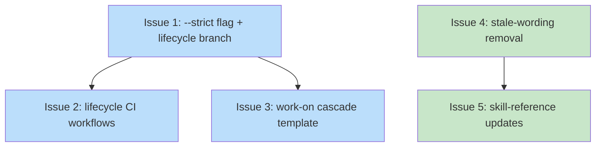

# PLAN: lifecycle-draft-ready-discipline

## Status

Active

The plan sequences the work for a single ephemeral PR. PLAN docs use
a unified Draft -> Active -> Done -> DELETED lifecycle; the Draft ->
Active gate auto-fires for single-pr execution when /shirabe:plan
finishes authoring, so the on-disk state for a committed single-pr
PLAN is Active. The doc is ephemeral — /work-on drives the outlines
to completion, then the cascade transitions Active -> Done and
deletes the file in the same PR per the single-pr at-merge posture
defined by the parent DESIGN.

## Scope Summary

Wire the chain-aware lifecycle check into the workspace's CI surface
and the work-on cascade with a DRAFT-vs-READY gating discipline.
Implementation lands the `--strict` CLI flag and lifecycle-module
branch, the two CI workflows (reusable + self-caller), the work-on
cascade template update, and the stale-wording removal plus skill
reference updates. Whole delivery ships in one PR.

## Decomposition Strategy

Horizontal layer-by-layer decomposition. The DESIGN's components are
loosely coupled with stable interfaces — the strict-mode flag is a
single addition to the validator; the lifecycle workflows are
standalone YAML files; the cascade template update is a skill-doc
edit; the stale-wording removal and skill-reference updates are
documentation edits. Walking skeleton buys nothing here — no
integration risk to surface early, and the seams are already drawn
by the DESIGN.

Phase 3.5a value-confirmation guard: every outline below is a
building block of one coherent delivery, not an independently-
shippable increment. The upstream issue explicitly bundles them as a
single closure of Slice D. Under `--auto` the guard records
`confirmed` for the single-pr decision and proceeds.

## Issue Outlines

### Issue 1: strict-mode flag and lifecycle-module branch

**Goal**: Add a `--strict` boolean CLI flag to the `validate`
subcommand, thread it into `run_lifecycle_check`, and branch the
single-pr posture's passing-state computation to the at-merge shape
when strict mode is set.

**Acceptance Criteria**:
- [ ] `ValidateArgs` in `crates/shirabe/src/main.rs` gains
      `#[arg(long, default_value_t = false)] strict: bool`.
- [ ] `run_lifecycle` passes `args.strict` through to a new third
      parameter on `run_lifecycle_check(root, cfg, strict)` in
      `crates/shirabe-validate/src/lifecycle.rs`.
- [ ] `compute_passing_state` (or the chain-iteration loop in
      `run_lifecycle_check`) consumes the strict flag: when strict
      is set, `Posture::SinglePrMidPR` re-targets to the
      `SinglePrAtMerge` passing-state row (BRIEF Done, PRD Done,
      DESIGN Current, PLAN Deleted).
- [ ] Multi-pr postures are unchanged in both strict and non-strict.
- [ ] `lib.rs` re-exports the updated `run_lifecycle_check`
      signature.
- [ ] Unit tests cover six shapes:
      - DRAFT-mode-equivalent: SinglePrMidPR + strict=false passes
        (current behavior preserved).
      - READY-mode equivalent: SinglePrMidPR + strict=true fails on
        the present PLAN.
      - SinglePrAtMerge + strict=true passes.
      - MultiPrInFlight + strict=true passes.
      - MultiPrWorkCompleting + strict=true fails (forcing-function
        preserved).
      - Multi-pr mid-transition (PLAN Done, BRIEF Accepted) +
        strict=true fails.
- [ ] `cargo build --release` passes.
- [ ] `cargo test -p shirabe-validate` passes.

**Dependencies**: None (foundational change).

**Complexity**: testable

### Issue 2: lifecycle CI workflow YAML

**Goal**: Add the reusable lifecycle workflow at
`.github/workflows/lifecycle.yml` and the self-caller workflow at
`.github/workflows/validate-lifecycle.yml`. The reusable workflow
builds the shirabe binary from source and invokes the check with
strict mode set conditional on the PR's draft state. SHA-pinned
actions throughout.

**Acceptance Criteria**:
- [ ] `.github/workflows/lifecycle.yml` declares
      `on: workflow_call:` with no required inputs.
- [ ] The reusable workflow's `permissions:` block grants only
      `contents: read`.
- [ ] The reusable workflow checks out the caller repo at full
      history, checks out shirabe at `job.workflow_sha`, installs
      the Rust toolchain via `dtolnay/rust-toolchain` pinned to a
      commit SHA, caches Cargo, builds the shirabe binary, and runs
      `shirabe validate --lifecycle .` with the strict flag
      templated via a shell conditional reading
      `github.event.pull_request.draft`.
- [ ] All actions use commit-SHA pins. The SHAs match those in the
      existing `validate-docs.yml` where the action overlaps
      (`actions/checkout@de0fac2e4500dabe0009e67214ff5f5447ce83dd`,
      `actions/cache@5a3ec84eff668545956fd18022155c47e93e2684`,
      `dtolnay/rust-toolchain@29eef336d9b2848a0b548edc03f92a220660cdb8`).
- [ ] The shell conditional reads `${{ github.event.pull_request.draft }}`
      and sets `STRICT_FLAG="--strict"` when the value is `false`,
      empty otherwise. The check is invoked as `shirabe validate
      --lifecycle . $STRICT_FLAG`.
- [ ] The workflow's "Check PR context" guard exits 0 (with a
      `::notice::` log) when `github.base_ref` is empty, matching
      the `validate-docs.yml` precedent.
- [ ] `.github/workflows/validate-lifecycle.yml` is the self-caller
      that triggers on `pull_request` events with
      `types: [opened, synchronize, reopened, ready_for_review,
      converted_to_draft]` and no `paths:` filter. It invokes the
      reusable workflow via `uses: ./.github/workflows/lifecycle.yml`.

**Dependencies**: Issue 1 (the strict flag must exist before the
workflow can invoke it).

**Complexity**: testable

### Issue 3: work-on cascade template update

**Goal**: Update `skills/work-on/SKILL.md` and the relevant koto
templates with the atomic chain-finalization step that runs before
`gh pr ready`. The cascade detects chain posture (single-pr,
multi-pr work-completing, multi-pr intermediate) and performs the
right transitions atomically.

**Acceptance Criteria**:
- [ ] `skills/work-on/SKILL.md` documents the cascade step: detect
      posture, run strict-mode check (expect a specific failure),
      perform the atomic finalization commit, push, re-run the
      strict-mode check (expect pass), then `gh pr ready`.
- [ ] The relevant koto template (`work-on-plan.md` or `work-on.md`,
      whichever drives `gh pr ready`) has the cascade step in the
      pr_finalization state directive.
- [ ] The cascade's posture detection reads the PLAN's
      `execution_mode` and `status:` frontmatter fields via shell-
      level grep (the existing template pattern), distinguishing
      single-pr from multi-pr work-completing from multi-pr
      intermediate.
- [ ] The finalization commit performs:
      - single-pr: `git rm` the PLAN, `shirabe transition` BRIEF
        and PRD to Done (skipping any chain member absent from the
        tree), single commit.
      - multi-pr work-completing: edit PLAN frontmatter Active to
        Done (the existing manual-edit pattern; `shirabe transition`
        does not cover PLAN today), `git rm` the PLAN, `shirabe
        transition` BRIEF and PRD to Done, single commit.
      - multi-pr intermediate: no-op; the cascade logs "Multi-pr
        chain in flight; no finalization needed" and proceeds to
        `gh pr ready`.
- [ ] The template guards the cascade behind a check that the
      strict-mode validator is available (the shirabe binary in
      use must support `--strict`); a missing flag triggers a
      diagnostic, not a silent skip.

**Dependencies**: Issue 1 (the strict flag must exist before the
cascade can invoke it).

**Complexity**: testable

### Issue 4: stale-wording removal in plan-doc-structure

**Goal**: Remove the `docs/plans/done/` wording from
`skills/plan/references/quality/plan-doc-structure.md`. Two
sections carry the stale wording today.

**Acceptance Criteria**:
- [ ] Line 50's prose no longer references `docs/plans/done/`. The
      surrounding sentence is reworded to describe the
      verify-then-delete terminal: when a PLAN reaches Done, it is
      deleted from `docs/plans/` in the same commit set the work
      ships in.
- [ ] Line 80's state-table row for Done no longer references
      `docs/plans/done/`. The cell is reworded to describe the
      delete-on-Done discipline.
- [ ] `grep -rn 'docs/plans/done' skills/` returns no matches.

**Dependencies**: None (independent documentation edit).

**Complexity**: simple

### Issue 5: /shirabe:roadmap and /shirabe:plan skill reference updates

**Goal**: Update the `/shirabe:roadmap` and `/shirabe:plan` skill
references to describe the verify-then-delete terminal, the
whole-tree CI gate, and the DRAFT-vs-READY discipline. The
updates align the prose with the implemented mechanism.

**Acceptance Criteria**:
- [ ] `skills/roadmap/SKILL.md` (or the relevant reference file)
      mentions the whole-tree CI gate by name (the lifecycle
      workflow) and the DRAFT-vs-READY discipline in the context
      of roadmap-driven multi-pr chains.
- [ ] `skills/plan/SKILL.md` and any plan-skill reference that
      describes PLAN lifecycle includes the verify-then-delete
      terminal and the DRAFT-vs-READY discipline. Stale references
      implying a PLAN move to `docs/plans/done/` are removed.
- [ ] At least one cross-link points readers at the
      `DECISION-lifecycle-strict-mode-interface-2026-06-06.md` and
      `DECISION-cascade-trigger-mechanism-2026-06-06.md` Decision
      Records so future readers can find the rationale for the
      mechanism.
- [ ] `grep -rn 'docs/plans/done' skills/` returns no matches after
      this issue and issue 4 land together.

**Dependencies**: Issue 4 (the wording removal in
plan-doc-structure must land first so this issue's grep check
finds zero matches; or the two issues can land in the same
commit). For simplicity, treat Issue 4 as the dependency.

**Complexity**: simple

## Implementation Issues

Empty for single-pr execution mode. The Issue Outlines section above
is the load-bearing decomposition; /work-on drives the outlines as
commits inside the single PR rather than as separate GitHub issues.

## Dependency Graph

**Legend**: Blue = testable, Green = simple

## Implementation Sequence

**Critical path**: Issue 1 → Issue 2 → Issue 3 (length 3). The
validator change is the foundation; the CI workflow and the work-on
cascade both consume the new `--strict` flag.

**Immediate start**: Issue 1 (the only no-dependency code change)
and Issue 4 (the no-dependency documentation edit) can begin in
parallel.

**Parallelization**:
- After Issue 1: Issues 2 and 3 can proceed in parallel.
- Issue 4 is independent of all code changes.
- After Issue 4: Issue 5 can proceed.

**Recommended commit sequence**: Issue 1 first (the foundation),
then Issues 2 and 3 in either order, then Issues 4 and 5 together.
Single PR; the commits do not have to be split into multiple PRs
because each issue's scope is bounded and the whole delivery is
one closure of the DRAFT-vs-READY discipline.

**Single-pr finalization**: At the end of /work-on, the PLAN is
deleted, the BRIEF and PRD transition Accepted to Done, and the
DESIGN promotes from `docs/designs/` to `docs/designs/current/`
with status Current. The whole transition is one atomic commit
before `gh pr ready` fires — the cascade this PLAN is itself
delivering performs the gesture.
