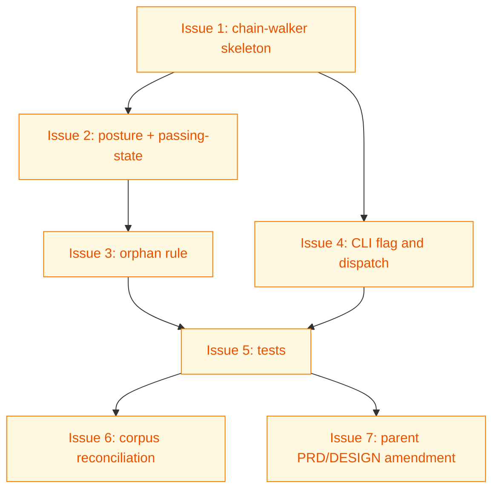

# PLAN: lifecycle-passing-state-validation

## Status

Draft

The plan sequences the work for a single ephemeral PR. The doc is
ephemeral — /work-on drives the outlines to completion and deletes
this file in the same PR per the single-pr at-merge posture defined
by the parent DESIGN.

## Scope Summary

Implement the chain-aware passing-state lifecycle validation mode
(`shirabe validate --lifecycle <root>`) per the upstream DESIGN,
reconcile the FC08 and FC09 chain corpus drift, and amend the parent
PRD R17/R18 to codify the chain-aware model. The whole delivery ships
in one PR.

## Decomposition Strategy

Horizontal layer-by-layer decomposition. The DESIGN's components are
loosely coupled with stable interfaces — the chain-walker module
exports a single public entry point; the CLI wiring calls that entry
point; the corpus reconciliation and the parent PRD amendment touch
durable artifacts independent of the code. Walking skeleton would
buy nothing here: there's no integration risk to surface early; the
module's seam is already drawn cleanly by the DESIGN. Each outline
below builds one component fully before the next picks up its work.

The Phase 3.5a value-confirmation guard: every outline below is a
building block of one coherent delivery, not an independently-
shippable increment. The upstream issue's "Must deliver" criterion
explicitly bundles all of them. Under `--auto` the guard records
`confirmed` for the single-pr decision (this is the single-pr default
case the guard exists to validate) and proceeds.

## Issue Outlines

### Issue 1: chain-walker module skeleton

**Goal**: Create the `crates/shirabe-validate/src/lifecycle.rs`
module with the doc index builder, the inverse-upstream graph
builder, the target-state lookup, and the shared data types
(`Posture`, `ChainMember`, `Chain`, `TargetState`, `PassingState`,
`ChainRole`, `RootKind`).

**Acceptance Criteria**:
- [ ] `crates/shirabe-validate/src/lifecycle.rs` exists with the
      data types and helper functions named in the DESIGN.
- [ ] `build_doc_index(root)` walks `docs/{briefs,prds,designs,designs/current,plans,roadmaps}/`
      and parses each doc's frontmatter into a `DocIndex` keyed by
      canonical path.
- [ ] `build_inverse_upstream(idx)` returns an `InverseGraph` mapping
      parent paths to the children that point at them.
- [ ] `target_state_for(format_name)` returns `TargetState` per the
      DESIGN's Decision 2 table.
- [ ] The module is wired into `lib.rs` with a `pub mod lifecycle;`.
- [ ] Path-traversal containment: paths whose canonical form escapes
      `root` are dropped from the index and produce an `L05` error.
- [ ] `cargo build --release` passes.

**Dependencies**: None

**Type**: code
**Files**: `crates/shirabe-validate/src/lifecycle.rs`, `crates/shirabe-validate/src/lib.rs`

### Issue 2: posture inference and passing-state computation

**Goal**: Implement `discover_chains`, `infer_posture`, and
`compute_passing_state` per the DESIGN's algorithm. Chains are
discovered from each PLAN and ROADMAP root; the walker follows
forward `upstream:` edges through DESIGN, PRD, BRIEF; posture is
inferred from the PLAN's `execution_mode` and `status`; the passing-
state table from PRD R4 is the lookup.

**Acceptance Criteria**:
- [ ] `discover_chains(idx, inv)` returns a `Vec<Chain>` rooted at
      every PLAN and ROADMAP in the index.
- [ ] `infer_posture(chain)` returns the right `Posture` variant
      for all five postures from PRD R3 (multi-pr in-flight, multi-
      pr work-completing, multi-pr at-merge, single-pr mid-PR,
      single-pr at-merge).
- [ ] `compute_passing_state(member, posture)` returns the right
      `PassingState` for every (member-role, posture) pair from PRD
      R4.
- [ ] Upstream cycles produce a structured `L03` error naming the
      cycle path; the walker exits the cyclic chain but continues
      with the rest of the tree.
- [ ] Missing chain members (a doc's `upstream:` points at a
      non-existent file) produce a structured `L04` error.
- [ ] No panics on malformed frontmatter (empty `upstream:`,
      list-vs-scalar shape mismatches, missing fields).
- [ ] `cargo build --release` passes.

**Dependencies**: Blocked by <<ISSUE:1>>

**Type**: code
**Files**: `crates/shirabe-validate/src/lifecycle.rs`

### Issue 3: orphan-doc rule

**Goal**: Implement `check_orphan` per the orphan-doc passing-state
decision record. The function applies the terminal-aware rule: an
orphan at the artifact's target state passes; an orphan at non-
terminal status whose own `upstream:` points at an Active ROADMAP
passes; every other orphan produces an `L02` error.

**Acceptance Criteria**:
- [ ] `check_orphan(doc, idx)` returns `None` for terminal-state
      orphans (BRIEF Done, PRD Done, DESIGN Current).
- [ ] `check_orphan` returns `None` for non-terminal orphans whose
      own `upstream:` resolves to a ROADMAP at status Active.
- [ ] `check_orphan` returns `Some(L02 error)` for every other
      orphan, with a message naming the file, current state, and
      expected state (target state for the format).
- [ ] The orphan-rule call site has a comment referencing
      `docs/decisions/DECISION-orphan-doc-passing-state-rule-2026-06-06.md`.
- [ ] `cargo build --release` passes.

**Dependencies**: Blocked by <<ISSUE:2>>

**Type**: code
**Files**: `crates/shirabe-validate/src/lifecycle.rs`

### Issue 4: CLI flag and dispatch wiring

**Goal**: Extend `crates/shirabe/src/main.rs` to parse the
`--lifecycle <root>` flag and dispatch to
`shirabe_validate::lifecycle::run_lifecycle_check`. Wire `run_lifecycle_check`
as the public entry point exported by `lifecycle.rs`.

**Acceptance Criteria**:
- [ ] `shirabe validate --lifecycle <root>` runs the chain-walker
      against `<root>`, exits 0 on pass, non-zero on any chain-
      member-not-at-passing-state.
- [ ] `shirabe validate <file>...` (the existing diff-scoped
      invocation) is unchanged.
- [ ] Passing both `--lifecycle` and a file list produces a clear
      error.
- [ ] `run_lifecycle_check(root, cfg)` is a public function in
      `lifecycle.rs` that returns `Vec<ValidationError>`.
- [ ] Errors are rendered through the existing `ValidationError`
      Display impl.
- [ ] `cargo build --release` passes.

**Dependencies**: Blocked by <<ISSUE:1>>

**Type**: code
**Files**: `crates/shirabe/src/main.rs`, `crates/shirabe-validate/src/lifecycle.rs`

### Issue 5: table-driven tests over synthetic chain fixtures

**Goal**: Add `#[cfg(test)]` test modules covering all 11 scenarios
named in PRD R10. Each test constructs a temp-directory synthetic
chain (BRIEF, PRD, DESIGN, PLAN files with the right frontmatter
shapes) and asserts the expected check verdict.

**Acceptance Criteria**:
- [ ] Test: multi-pr in-flight chain passes.
- [ ] Test: multi-pr work-completing PR (PLAN absent, BRIEF/PRD Done,
      DESIGN Current) passes.
- [ ] Test: single-pr chain mid-PR (BRIEF/PRD Accepted, DESIGN
      Current, PLAN Draft) passes.
- [ ] Test: single-pr chain at-merge (PLAN absent, BRIEF/PRD Done,
      DESIGN Current) passes.
- [ ] Test: present Draft multi-pr PLAN fails with L01.
- [ ] Test: present Done multi-pr PLAN fails with L01 (deletion
      forcing function).
- [ ] Test: single-pr PLAN present at merge fails with L01.
- [ ] Test: BRIEF stuck at Accepted while its multi-pr PLAN is Done
      fails with L01.
- [ ] Test: orphan BRIEF at Done passes (terminal-state orphan).
- [ ] Test: orphan BRIEF at Accepted with no Active-ROADMAP upstream
      fails with L02.
- [ ] Test: orphan PRD at Accepted whose upstream points at an
      Active ROADMAP passes.
- [ ] Test: upstream cycle produces L03 with the cycle path in the
      message.
- [ ] Test: missing chain member produces L04.
- [ ] Test: malformed frontmatter produces L05 (no panic).
- [ ] `cargo test` passes; total test count increases by at least 14.

**Dependencies**: Blocked by <<ISSUE:3>>, Blocked by <<ISSUE:4>>

**Type**: code
**Files**: `crates/shirabe-validate/src/lifecycle.rs`

### Issue 6: corpus reconciliation

**Goal**: Land four `shirabe transition ... Done` commits to
reconcile the FC09 and FC08 chain corpus drift documented in the
BRIEF. Each transition is one commit; the four commits ship as part
of the same PR as the chain-walker code so the new check passes on
its own delivery PR.

**Acceptance Criteria**:
- [ ] `docs/briefs/BRIEF-doc-vs-github-state-reconciliation.md`
      transitions Accepted to Done.
- [ ] `docs/prds/PRD-doc-vs-github-state-reconciliation.md`
      transitions Accepted to Done.
- [ ] `docs/briefs/BRIEF-legend-vs-classdef-reconciliation.md`
      transitions Accepted to Done.
- [ ] `docs/prds/PRD-legend-vs-classdef-reconciliation.md`
      transitions Accepted to Done.
- [ ] Each transition uses `shirabe transition <path> Done`; FC03
      stays consistent (frontmatter and body Status match).
- [ ] FC07 chain verified already at Done; no transition required.
- [ ] `shirabe validate --lifecycle .` (after Issue 5 lands) passes
      against the working tree.

**Dependencies**: Blocked by <<ISSUE:5>>

**Type**: task
**Files**: `docs/briefs/BRIEF-doc-vs-github-state-reconciliation.md`, `docs/prds/PRD-doc-vs-github-state-reconciliation.md`, `docs/briefs/BRIEF-legend-vs-classdef-reconciliation.md`, `docs/prds/PRD-legend-vs-classdef-reconciliation.md`

### Issue 7: parent PRD R17/R18 amendment and parent DESIGN Decision 5 update

**Goal**: Amend `docs/prds/PRD-roadmap-plan-standardization.md` R17
and R18 to codify the chain-aware passing-state model in place of
the two-stateless-checks framing. Update
`docs/designs/DESIGN-roadmap-plan-standardization.md` Decision 5 to
reflect the chain-aware implementation. Keep the `Lnn` check-code
family name.

**Acceptance Criteria**:
- [ ] Parent PRD R17 rewritten to describe the chain-aware passing-
      state check (the umbrella rule, the posture-derived passing
      states per artifact type, the orphan rule with the ROADMAP-
      rooted exception). The `Lnn` family name is preserved.
- [ ] Parent PRD R18 rewritten to describe the forcing function as
      the L01 failure on a present-Done multi-pr PLAN (the
      degenerate case captured by the umbrella rule).
- [ ] Parent DESIGN Decision 5 updated: the chosen-approach prose
      reflects the chain-aware reshape; references the two Decision
      Records by path.
- [ ] No new `L01`/`L02` Lnn-code definitions outside the family
      named here (L01 umbrella, L02 orphan, L03 cycle, L04 missing,
      L05 malformed).
- [ ] `shirabe validate <amended files>` passes.

**Dependencies**: Blocked by <<ISSUE:5>>

**Type**: docs
**Files**: `docs/prds/PRD-roadmap-plan-standardization.md`, `docs/designs/DESIGN-roadmap-plan-standardization.md`

## Implementation Issues

Empty for single-pr execution mode. The Issue Outlines section above
is the load-bearing decomposition; /work-on drives the outlines as
its task list and lands all the work in a single PR. No GitHub
milestone or issues are created for this plan.

## Dependency Graph

**Legend**: Green = done, Yellow = ready, Red = blocked

## Implementation Sequence

The seven outlines have one critical path and two parallel branches
at the tail.

Critical path: Issue 1 -> Issue 2 -> Issue 3 -> Issue 5. The chain-
walker skeleton is the foundation everything else depends on;
posture-inference depends on the walker; the orphan rule depends on
posture-inference; the tests depend on the orphan rule being in
place.

Parallel branch A: Issue 4 (CLI wiring) depends only on Issue 1, so
it can land between Issue 1 and Issue 5. Issue 5 picks it up as
soon as Issue 3 also lands.

Parallel branch B: Issue 6 (corpus reconciliation) and Issue 7
(parent PRD/DESIGN amendment) both depend on Issue 5 but are
independent of each other. They can land in either order once the
tests pass against the working tree.

The PLAN itself transitions Draft -> Active when /work-on starts
implementation against it. At PR-merge time (per the single-pr at-
merge posture from the DESIGN), the BRIEF transitions Accepted to
Done, the PRD transitions Accepted to Done, the DESIGN gets
promoted from `docs/designs/` to `docs/designs/current/`, and the
PLAN is deleted — all in the same final commit set. The new
`--lifecycle` check then passes on the resulting working tree.
