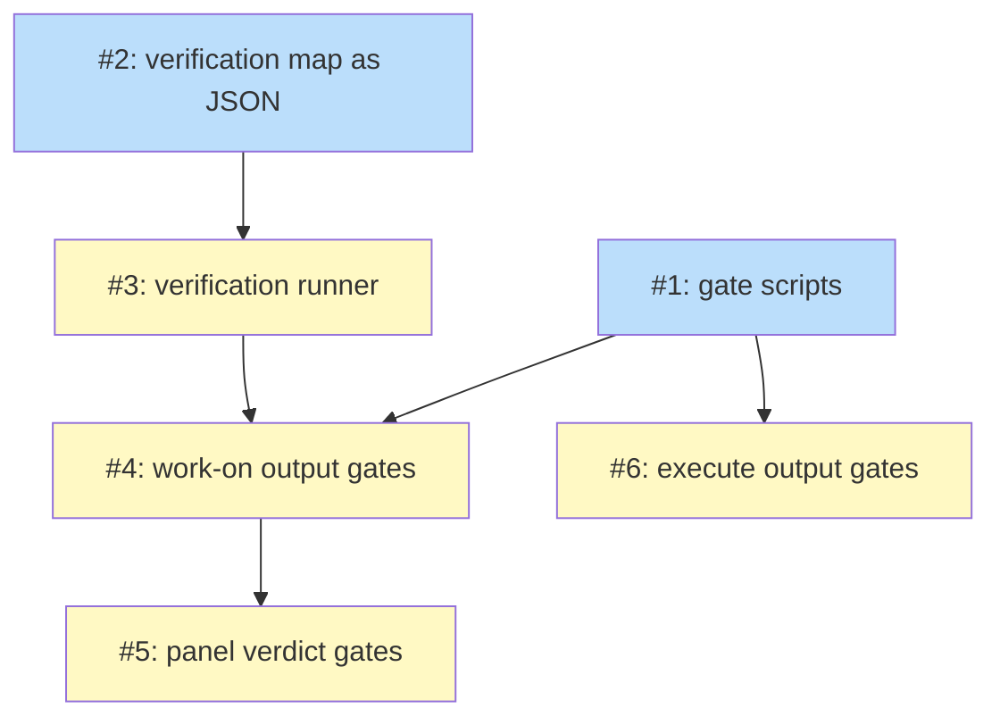

# PLAN: Output Gates

## Status

Active

Authored at Active: activation files no GitHub issues. The build starts after
#545 (/execute's contradiction-settlement change) merges, since both edit
/execute's template and SKILL.md; the outlines below also mark each rule a
gate waits on and whether that rule has landed.

## Scope Summary

Build the output gates in docs/designs/DESIGN-output-gates.md: the gate
scripts, shirabe's own machine-readable verification map, the bounded
verification runner, /work-on's output and panel gates, and /execute's output
gates, removing every answer value that restated a script's result.

## Decomposition Strategy

**Horizontal decomposition.** The design names components with stable
interfaces between them: gate scripts with a fixed exit convention and finding
format, a runner with an on-disk result, and template states that call them.
Each script is built and tested on its own with fixtures before any template
routes on it, so the template issues change routing only and inherit tested
commands. A walking skeleton would buy little: the integration point, koto
routing on an exit code, is already exercised by the gates that ship today.

All six issues land in one pull request. No split trigger fires: the
verification gate reads the map from the default branch, but the build's own
runs use the installed plugin, so the map and the gate can merge together, and
the repository's delivery preference is consolidated.

## Issue Outlines

### Issue 1: feat(work-on): add the commit, wip and PR-body gate scripts

**Goal**: Ship `check-branch-output.sh` (`--commits`, `--wip`) and
`check-pr-output.sh` (`--pr-body`, `--owned-pr`) with their rule tables, the
exit convention 0 pass, 1 finding, 2 could not decide, and `::koto-finding::`
output, as the design's Decision Outcome specifies.

**Acceptance Criteria**:
- [ ] `skills/work-on/scripts/check-branch-output_test.sh` passes and covers: a non-conventional subject in `impl_base..HEAD` below a conventional tip exits 1 with a finding whose `rule_id` starts `references/pr-body-conformance.md#L`; a `Co-Authored-By: Claude` trailer exits 1; a merge commit with git's default subject exits 0; a tree with a `wip/` file exits 1; a clean fixture exits 0; an unreadable range exits 2.
- [ ] `skills/work-on/scripts/check-pr-output_test.sh` passes and covers, with fake `gh`, `shirabe` and `owned-pr.sh` on `PATH`: validator exit 0, 2, 1, 3 and 4 map to 0, 1, 2, 2 and 2; `owned-pr.sh` exit 0 with one URL maps to 0, exit 0 with empty output and exits 3, 4, 5 map to 3, exits 2 and 64 map to 2; the title reaches the validator as one argument when it contains `$(` and a quote.
- [ ] `skills/work-on/scripts/gate-rule-keys_test.sh` passes: every rule table row's excerpt occurs inside its line range at `HEAD`, and changing a range in a fixture copy makes it fail.
- [ ] Every finding line either script prints parses as koto's finding shape (`jq -e '.rule_id and .level and .message'` on the text after `::koto-finding::`), checked inside the two test files.
- [ ] `.github/workflows/check-work-on-scripts.yml` runs the three new test files, shown by `grep -c -E 'check-branch-output_test|check-pr-output_test|gate-rule-keys_test' .github/workflows/check-work-on-scripts.yml` printing 3.

**Dependencies**: None

**Waits on**: no unsettled rule.

**Type**: code
**Files**: `skills/work-on/scripts/check-branch-output.sh`, `skills/work-on/scripts/check-branch-output_test.sh`, `skills/work-on/scripts/check-pr-output.sh`, `skills/work-on/scripts/check-pr-output_test.sh`, `skills/work-on/scripts/gate-rules.tsv`, `skills/work-on/scripts/gate-rule-keys_test.sh`, `.github/workflows/check-work-on-scripts.yml`

### Issue 2: docs(work-on): commit shirabe's verification map as JSON

**Goal**: Define the `shirabe-verification-map/v1` schema in
`skills/work-on/references/verification-map.md` and commit shirabe's own map
at `.claude/shirabe-extensions/verification-map.json`, equivalent to the
Markdown map it replaces, with the Markdown section pointing at the file.

**Acceptance Criteria**:
- [ ] `jq -e '.schema == "shirabe-verification-map/v1"' .claude/shirabe-extensions/verification-map.json` exits 0.
- [ ] The map's `default` list names the same three commands the Markdown default names today (`cargo test --workspace`, `skills/plan/scripts/plan-to-tasks_test.sh`, `skills/work-on/scripts/run-cascade_test.sh`), and its `skills/**` entry runs `scripts/run-evals.sh` with `each: "skills/*"`, checked by a `jq` query in `skills/work-on/scripts/verification-map-schema_test.sh`.
- [ ] Every command marked `network: true` also sets `unattended` explicitly, checked by the same test.
- [ ] `verification-map.md` documents every field the design lists (`run`, `each`, `timeout_secs`, `network`, `unattended`, `max_procs`, `entries`, `default`) and the merge-base read, shown by the test grepping each field name in it.
- [ ] `.claude/shirabe-extensions/work-on.md` no longer lists commands itself and names `verification-map.json`, shown by `grep -c 'verification-map.json' .claude/shirabe-extensions/work-on.md` printing at least 1 and `grep -c 'cargo test' .claude/shirabe-extensions/work-on.md` printing 0.

**Dependencies**: None

**Waits on**: whatever #507 settles about the verification map's wording. /work-on's items landed in #557 (merged); re-read `verification-map.md` and the `verification` directive at the build's base before editing.

**Type**: docs
**Files**: `.claude/shirabe-extensions/verification-map.json`, `.claude/shirabe-extensions/work-on.md`, `skills/work-on/references/verification-map.md`, `skills/work-on/scripts/verification-map-schema_test.sh`

### Issue 3: feat(work-on): add the bounded verification runner

**Goal**: Ship `run-verification.sh` (`--start`) and `check-verification.sh`
(`--settled`, `--verdict`, `--record`) as the design's Verification section
specifies: the map read at the merge-base, a detached supervisor that never
calls koto, per-command deadlines, a process-count bound, logs in 0700
directories outside every repository, and an on-disk result keyed by head and
attempt.

**Acceptance Criteria**:
- [ ] `skills/work-on/scripts/run-verification_test.sh` passes and shows the verdict exit for each case: all commands pass gives 0; a failing command gives 1; a command that forks past `max_procs` gives 4 and leaves no process of its group alive; a command past its `timeout_secs` gives 4; no map at the merge-base gives 3; a map that selects nothing gives 3; a map edited only on the branch is not used; a dirty tracked file gives 4; an `unattended: false` command gives 4 and is never started.
- [ ] `--start` returns in under two seconds in every case above, measured in the test.
- [ ] A stale lock whose process is gone does not block a new start, shown in the test.
- [ ] One test case runs the launcher as a `default_action` under a real `koto next` against a fixture template and reaches the verdict state, shown by the session's current state name.
- [ ] Log directories are created with mode 0700 and only the last ten heads per session are kept, shown by `stat` in the test.
- [ ] Neither script uses `setsid` or GNU `timeout`, shown by `grep -c -E '\bsetsid\b|\btimeout ' skills/work-on/scripts/run-verification.sh skills/work-on/scripts/check-verification.sh` printing 0 for each file, and both pass `scripts/check-bash-floor.sh`.

**Dependencies**: Blocked by <<ISSUE:2>>

**Waits on**: the same verification wording as <<ISSUE:2>>.

**Type**: code
**Files**: `skills/work-on/scripts/run-verification.sh`, `skills/work-on/scripts/check-verification.sh`, `skills/work-on/scripts/run-verification_test.sh`, `.github/workflows/check-work-on-scripts.yml`

### Issue 4: feat(work-on): gate commits, wip, the PR body, CI role, staleness and verification

**Goal**: Wire gates 1 to 5, 9 and 10 of the design into
`skills/work-on/koto-templates/work-on.md`, add the `verification` and
`verification_verdict` states, and remove the evidence values the design's
before-and-after table removes from `staleness_check`, `verification` and
`ci_monitor`.

**Acceptance Criteria**:
- [ ] `koto template compile skills/work-on/koto-templates/work-on.md` succeeds, and `scripts/validate-template-mermaid.sh` and `scripts/check-template-interpolation.sh` pass on it.
- [ ] No transition in `staleness_check` names `staleness_signal: fresh`, `stale_requires_introspection` or `unavailable`, no state accepts `commands_run` or `verification_outcome`, and `ci_monitor` accepts no `session_role` and no `ci_outcome: passing`, each shown by a `grep -c` printing 0 in `skills/work-on/scripts/output-gates-routing_test.sh`.
- [ ] `output-gates-routing_test.sh` drives each new route with fake gate results and passes: staleness exits 0, 1, 3 and -1 reach `analysis`, `introspection`, `analysis`, `analysis` with no evidence; `verification_verdict` exits 0, 1, 3, 4 reach `finalization`, `implementation`, `done_blocked`, `done_blocked`, and 2 holds; `is_root` 0 and 1 with green CI reach `cascade_entry` and `done`; a failing `commit_convention` holds at `finalization` and ends at `done_blocked` at `pre_pr_evidence`; failing `branch_wip_clean` holds at `pr_precheck` unless `SHARED_BRANCH` is set; failing `pr_body_conformant` holds at `pr_creation`.
- [ ] The existing suites `pre-pr-evidence_test.sh`, `finalization-shape_test.sh` and `ci-monitor-role_test.sh` pass, updated for the new gate commands.
- [ ] `skills/work-on/references/finishing-obligations.md` lists each new gate in its gated table and no longer lists `session_role` as carried evidence, shown by `grep -c 'session_role' skills/work-on/references/finishing-obligations.md` printing 0.
- [ ] No directive is removed: every directive line in `work-on.md` at the build's base that mentions verification commands, the PR body rule, or the commit convention is still present, shown by a `diff` of those lines in the routing test.

**Dependencies**: Blocked by <<ISSUE:1>>, <<ISSUE:3>>

**Waits on**: the CI-fix loop-back rule for /work-on (#557, merged); the PR-body conformance sections restored under #557 (merged); the verification wording as in <<ISSUE:2>>.

**Type**: code
**Files**: `skills/work-on/koto-templates/work-on.md`, `skills/work-on/references/finishing-obligations.md`, `skills/work-on/scripts/output-gates-routing_test.sh`, `skills/work-on/scripts/pre-pr-evidence_test.sh`, `skills/work-on/scripts/finalization-shape_test.sh`, `skills/work-on/scripts/ci-monitor-role_test.sh`

### Issue 5: feat(work-on): recompute panel verdicts from per-reviewer findings

**Goal**: Ship `check-panel-verdict.sh` and wire gates 6 to 8, with each
reviewer writing a head-stamped `<panel>.<focus>.json` key, the panel states
advancing on the gate with no `passed` evidence, and the retry-clearing lists
naming the per-reviewer keys.

**Acceptance Criteria**:
- [ ] `skills/work-on/scripts/check-panel-verdict_test.sh` passes and covers: all keys present on the current head with only advisory findings gives 0; one blocking finding gives 1 even when the key says `"passed": true` and `"blocking_count": 0`; a missing reviewer key gives 2; a key naming an older head gives 2; unparseable JSON gives 2.
- [ ] No panel state accepts `scrutiny_outcome: passed`, `review_outcome: passed` or `qa_outcome: passed`, and no panel gate is a `context-exists` gate, shown by `grep -c` printing 0 in `output-gates-routing_test.sh`.
- [ ] `output-gates-routing_test.sh` shows each panel gate at 0 advancing with no evidence, at 1 accepting only `blocking_retry` or `blocking_escalate`, and at 2 holding.
- [ ] The three panel phase files and `phase-4-implementation.md` tell each reviewer to write its own head-stamped key and list the per-reviewer keys in their clearing loops, shown by `grep -c 'scrutiny_results.json'` printing 0 across `skills/work-on/references/`.
- [ ] Each panel state keeps an `override_default`, shown by the routing test.
- [ ] `retry-clearing_test.sh` passes, updated for the per-reviewer keys.

**Dependencies**: Blocked by <<ISSUE:4>>

**Waits on**: where reviewer detail files live versus wip hygiene (#557, merged: `mktemp` outside the repository); the panel retry cap (#531 decision, applied in #557, merged: 2 blocking retries shared by the three panels).

**Type**: code
**Files**: `skills/work-on/scripts/check-panel-verdict.sh`, `skills/work-on/scripts/check-panel-verdict_test.sh`, `skills/work-on/koto-templates/work-on.md`, `skills/work-on/references/phases/phase-4a-scrutiny.md`, `skills/work-on/references/phases/phase-4b-review.md`, `skills/work-on/references/phases/phase-4c-qa.md`, `skills/work-on/references/phases/phase-4-implementation.md`, `skills/work-on/scripts/retry-clearing_test.sh`

### Issue 6: feat(execute): gate the owned PR, its output and the cascade verdict

**Goal**: Wire gates 11 to 19 of the design into
`skills/execute/koto-templates/execute.md`, have `run-cascade.sh --session`
record its verdict as `cascade_result.json`, and remove the evidence values
the before-and-after table removes from `orchestrator_setup`,
`pr_finalization`, `plan_completion` and `ci_monitor`.

**Acceptance Criteria**:
- [ ] `koto template compile skills/execute/koto-templates/execute.md` succeeds, and `scripts/validate-template-mermaid.sh` and `scripts/check-template-interpolation.sh` pass on it.
- [ ] No state accepts `pr_adopt` or `status_read` as an evidence value, `plan_completion` accepts no `cascade_status`, and `ci_monitor` accepts no `dirty_merge_state` and no `passing`, shown by `grep -c` printing 0 in `skills/execute/scripts/output-gates-routing_test.sh`.
- [ ] `output-gates-routing_test.sh` drives each new route with fake gate results and passes: the owned-PR gates at 0, 3 and 2 reach the next state, the `execute:pr-adopt` terminal and the `execute:status-read` terminal; failing PR-body, commit and wip gates hold at `pr_finalization`; `cascade_result.json` with `completed` or `skipped` reaches `ci_monitor` and with `partial` holds; a DIRTY merge state reaches `escalate_dirty_merge_state` with no evidence.
- [ ] `run-cascade_test.sh` passes and shows `--session` recording `cascade_result.json` whose `cascade_status` equals the verdict the script prints.
- [ ] `execute-template-structure_test.sh`, `owned-pr-callers_test.sh` and `settled-branch-record_test.sh` pass.
- [ ] `worktree_sync`'s ancestry gate prints a finding line with a `rule_id` when it fails, shown in `check-branch-output_test.sh` under a `--synced` case.

**Dependencies**: Blocked by <<ISSUE:1>>

**Waits on**: #545 merging, which settles merge-never-rebase with ancestry tests (gate 19), the CI-fix loop-back rule for /execute (gate 18), and /execute's PR-title type (gates 11 to 17).

**Type**: code
**Files**: `skills/execute/koto-templates/execute.md`, `skills/execute/SKILL.md`, `skills/work-on/scripts/run-cascade.sh`, `skills/work-on/scripts/run-cascade_test.sh`, `skills/execute/scripts/output-gates-routing_test.sh`, `skills/work-on/scripts/check-branch-output.sh`, `skills/work-on/scripts/check-branch-output_test.sh`

## Implementation Issues

Not populated: single-pr mode files no GitHub issues.

## Dependency Graph

**Legend**: Blue = ready, Yellow = blocked

## Implementation Sequence

**Critical path:** Issue 2, Issue 3, Issue 4, Issue 5.

**Parallel start:** Issues 1 and 2 have no dependencies. Issue 6 needs only
Issue 1, but it also waits on #545 merging; until then it is the last to
start.

**Before any issue starts:** #545 merges, since this build and that change
edit the same /execute files and /work-on's shared references. Issues 1 to 5
touch no rule #545 still settles and can start once it has merged; Issue 6
re-reads `execute.md` at the build's base for the gate names and titles #545
lands.
