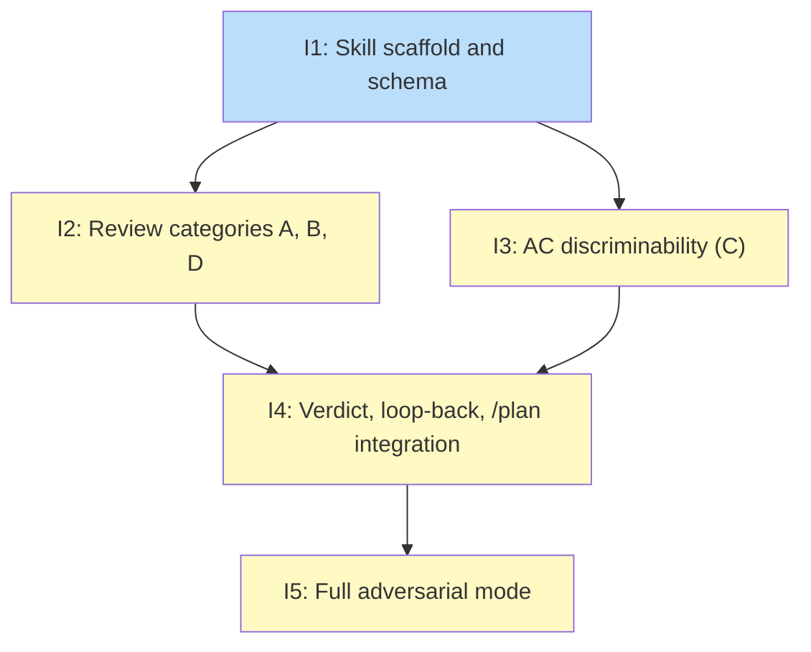

## Status

Draft

## Scope Summary

Implement the `/review-plan` skill — an adversarial plan review that replaces `/plan`'s passive Phase 6 with a four-category challenge (Scope Gate, Design Fidelity, AC Discriminability, Sequencing/Priority Integrity), loop-back capability, and a two-file verdict artifact scheme. The skill is callable standalone or as a sub-operation inside `/plan`.

## Decomposition Strategy

**Horizontal decomposition.** The design defines five sequential implementation phases with explicit dependency boundaries. Each phase produces distinct file artifacts with stable interfaces — the skill scaffold (phase 1) is a hard prerequisite; categories A, B, D (phase 2) and category C (phase 3) both depend only on the scaffold and can be parallelized; verdict synthesis and /plan integration (phase 4) depends on the correction_hint schema from phase 3; full adversarial mode (phase 5) extends the base SKILL.md and requires the fast-path integration to be complete.

## Issue Outlines

### Issue 1: feat(review-plan): add skill scaffold and schema artifacts

**Goal**: Create the `review-plan` skill scaffold including SKILL.md, phase-0-setup.md, review-result-schema.md, and a stub ac-discriminability-taxonomy.md.

**Acceptance Criteria**:
- [ ] `skills/review-plan/SKILL.md` exists and defines entry point behavior, including execution mode detection (fast-path vs. standalone)
- [ ] `skills/review-plan/references/phases/phase-0-setup.md` exists and describes reading the plan artifact, detecting `input_type`, and selecting execution mode
- [ ] `skills/review-plan/references/templates/review-result-schema.md` exists and contains the complete `review_result` YAML schema with all fields: `verdict`, `loop_target`, `round`, `confidence`, `critical_findings` (with `category`, `description`, `affected_issue_ids`, `correction_hint`), and `summary`
- [ ] `skills/review-plan/references/templates/ac-discriminability-taxonomy.md` exists as a stub (placeholder content is acceptable; full 7-pattern spec is added in Issue 3)
- [ ] Phase stub files exist for phases 1–6 under `skills/review-plan/references/phases/`
- [ ] The directory structure matches the layout specified in the design doc's Components section

**Dependencies**: None

---

### Issue 2: feat(review-plan): implement review categories A, B, and D

**Goal**: Implement the three phase files for review categories A (Scope Gate), B (Design Fidelity), and D (Sequencing/Priority Integrity) within the `/review-plan` skill.

**Acceptance Criteria**:
- [ ] `skills/review-plan/references/phases/phase-1-scope-gate.md` exists and specifies inputs to read, checks to run, finding criteria, loop-back target (`loop_target: 3`), and output format
- [ ] `skills/review-plan/references/phases/phase-2-design-fidelity.md` exists and specifies inputs to read (including upstream design doc), contradiction checks, finding criteria, loop-back target (`loop_target: 1`), and output format
- [ ] `skills/review-plan/references/phases/phase-4-sequencing.md` exists and specifies inputs, checks for deprioritized must-run QA scenarios, finding criteria, loop-back targets (dependency errors → `loop_target: 5`; structural deferral → `loop_target: 3`), and output format
- [ ] All three phase files use the `review_result` finding format from `review-result-schema.md`
- [ ] All three phase files specify that `correction_hint` is left empty (correction hints are only populated for category C)
- [ ] All three phase files specify their behavior for roadmap input types (B, C, D return empty findings immediately; A checks issue count vs. roadmap item count)

**Dependencies**: Blocked by Issue 1

---

### Issue 3: feat(review-plan): implement AC discriminability review (category C)

**Goal**: Implement the two-pass AC discriminability assessment logic and complete the 7-pattern taxonomy template that adversarial reasoning agents use verbatim.

**Acceptance Criteria**:
- [ ] `skills/review-plan/references/phases/phase-3-ac-discriminability.md` exists and describes the full two-pass assessment: pattern pass (patterns 1, 3, 7) runs first; adversarial pass (patterns 2, 4, 5, 6) runs second for any AC that did not match in pass 1
- [ ] `phase-3-ac-discriminability.md` specifies exact detection triggers for each pattern-pass pattern: "all fixture"/"test data"/"sample"/"seed" without clean-state scenario (pattern 1); no AC mentioning failure/error/edge case in the entire issue body (pattern 3); "exists"/"is created"/"is populated"/"is not empty" without content check (pattern 7)
- [ ] `phase-3-ac-discriminability.md` specifies that pattern 5 is only flagged when integration scope is the only observable path — not for every unit AC
- [ ] `phase-3-ac-discriminability.md` specifies the `critical_findings` entry format: `category: "C"`, `description`, `affected_issue_ids`, and a non-empty `correction_hint`
- [ ] `skills/review-plan/references/templates/ac-discriminability-taxonomy.md` contains all 7 patterns, each with pattern name and number, failure mode description, detection method, and concrete example
- [ ] The taxonomy entry for pattern 5 includes the false-positive guard
- [ ] Every Category C finding includes a non-empty `correction_hint`; no Category C finding is produced when no ACs match any pattern

**Dependencies**: Blocked by Issue 1

---

### Issue 4: feat(review-plan): add verdict synthesis, loop-back, and /plan integration

**Goal**: Wire the /review-plan verdict into /plan by writing the two verdict phase files, rewriting Phase 6 to invoke /review-plan as a sub-operation, and threading correction hints into Phase 4 agent prompts with prompt-injection-safe framing.

**Acceptance Criteria**:

*phase-5-verdict.md*
- [ ] Reads findings from all four categories and synthesizes them into a single `review_result` YAML block
- [ ] Verdict is "proceed" if no critical findings; "loop-back" otherwise
- [ ] `loop_target` uses deterministic mapping (B → Phase 1, A → Phase 3, C → Phase 4, D → Phase 5); earliest phase wins when multiple categories have findings
- [ ] "proceed" verdict writes `wip/plan_<topic>_review.md` only; "loop-back" verdict writes `wip/plan_<topic>_review_loopback.md` only

*phase-6-loop-back.md*
- [ ] Reads `review_result` from the loopback file as first step
- [ ] Extracts `correction_hints` from Category C critical_findings
- [ ] Deletes wip/ artifacts back to `loop_target` without deleting the loopback file itself
- [ ] Artifact deletion sequence is explicit per loop_target (1, 3, 4, 5)
- [ ] Increments `review_rounds` in `wip/plan_<topic>_analysis.md` after deletion

*Updated skills/plan/references/phases/phase-6-review.md*
- [ ] Replaces passive check with sub-operation invocation of /review-plan (plan_topic, round, mode: fast-path)
- [ ] Resume check handles both file variants: `_review.md` → Phase 7; `_review_loopback.md` → loop-back
- [ ] Includes infinite-loop guard: abort if `review_rounds` reaches maximum (default 3)

*Updated skills/plan/references/phases/phase-4-agent-generation.md*
- [ ] Adds `{{REVIEW_CORRECTION_HINTS}}` placeholder to step 4.4
- [ ] On first round: placeholder resolves to empty string
- [ ] On subsequent rounds: populated from `correction_hint` values in the loopback file, wrapped with explicit framing before injection
- [ ] Documents prompt injection risk and the framing wrapper as a mitigation

**Dependencies**: Blocked by Issue 2, Issue 3

---

### Issue 5: feat(review-plan): add full adversarial mode with multi-agent bakeoff

**Goal**: Extend `skills/review-plan/SKILL.md` with `--adversarial` flag detection, multi-agent bakeoff logic per review category, and documentation for standalone invocation.

**Acceptance Criteria**:
- [ ] SKILL.md detects the `--adversarial` flag and branches into the correct execution path
- [ ] Without `--adversarial`: fast-path behavior is unchanged (one agent per category)
- [ ] With `--adversarial`: spawns multiple validator agents per category; all validators complete before cross-examination runs
- [ ] Adversarial path includes cross-examination step where validator disagreements are resolved before producing a per-category verdict
- [ ] Both modes produce the same `review_result` YAML schema
- [ ] SKILL.md documents standalone invocation syntax (`/review-plan <plan-artifact-or-topic> [--adversarial]`)
- [ ] Documentation explains that omitting `--adversarial` runs fast-path depth and `--adversarial` is appropriate when thoroughness matters more than speed

**Dependencies**: Blocked by Issue 4

---

## Dependency Graph

**Legend**: Green = done, Blue = ready, Yellow = blocked, Purple = needs-design, Orange = tracks-design/tracks-plan

## Implementation Sequence

**Critical path**: Issue 1 → Issue 2 → Issue 4 → Issue 5 (tied with Issue 1 → Issue 3 → Issue 4 → Issue 5). Length: 4 issues.

**Parallelization**: Issues 2 and 3 can be worked in parallel after Issue 1 completes. Both depend only on the scaffold; neither depends on the other. This is the only parallel window in the plan.

**Recommended order**:
1. Issue 1 — no dependencies; must be first
2. Issues 2 and 3 — in parallel (or either order on a single branch)
3. Issue 4 — requires both Issues 2 and 3 to be complete; this is the most complex issue and should be allocated extra time
4. Issue 5 — leaf node; extends the completed fast-path with adversarial mode
