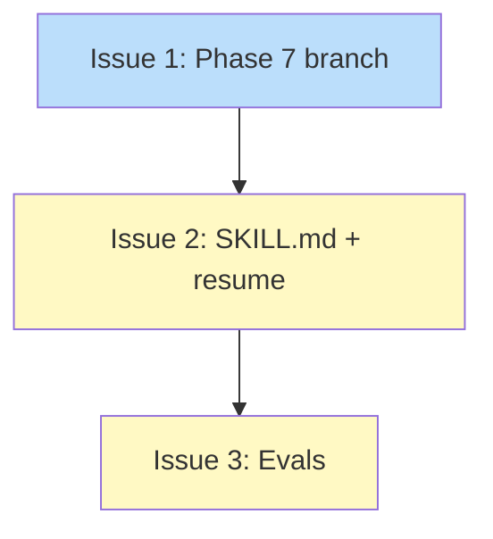

# PLAN: Plan Skill Rework

## Status

Draft

## Scope Summary

Rework /plan's Phase 7 to write Implementation Issues table and Dependency
Graph directly into roadmaps instead of producing a separate PLAN doc. Design
doc and PRD modes are unchanged.

## Decomposition Strategy

Horizontal decomposition. All changes are markdown skill files with no runtime
integration flow. Each issue builds on the previous: core Phase 7 branch first,
then SKILL.md updates, then evals.

## Issue Outlines

### Issue 1: feat(plan): add roadmap enrichment branch to Phase 7

**Goal:** Add a roadmap-specific write path to phase-7-creation.md. When
input_type is roadmap, Phase 7 writes the Implementation Issues table and
Dependency Graph directly into the roadmap's reserved sections instead of
producing a PLAN doc.

**Acceptance Criteria:**
- Phase 7 checks input_type from decomposition artifact frontmatter
- When input_type is roadmap:
  - Validates reserved sections exist (HTML comment markers present)
  - Rejects --single-pr with an error message
  - Locates Implementation Issues section by HTML comment marker
  - Replaces content from comment to next ## heading with populated table
  - Table uses Feature/Issues/Status format with needs-* labels in Status
  - Locates Dependency Graph section by HTML comment marker
  - Replaces empty mermaid stub with full dependency diagram
  - Skips PLAN doc creation
  - No status transition (roadmap stays Active)
- Design doc and PRD paths are unchanged

**Dependencies:** None

### Issue 2: feat(plan): update SKILL.md output and resume logic for roadmap mode

**Goal:** Update the plan SKILL.md's Output section to document that roadmap
input produces enriched roadmaps, not PLAN docs. Update resume logic to detect
roadmap enrichment completion.

**Acceptance Criteria:**
- SKILL.md Output section documents roadmap enrichment behavior
- SKILL.md resume logic includes roadmap-aware completion check
- Resume detects completion by checking for populated Implementation Issues
  table rows in the roadmap file
- phase-7-creation.md resume section updated to match

**Dependencies:** Issue 1

### Issue 3: chore(plan): add roadmap enrichment eval scenarios

**Goal:** Add eval scenarios testing that roadmap enrichment works correctly
and that existing design/prd modes are unchanged.

**Acceptance Criteria:**
- Eval scenario: roadmap input populates Implementation Issues table in roadmap
- Eval scenario: roadmap input populates Dependency Graph in roadmap
- Eval scenario: roadmap input does not produce a PLAN doc
- Eval scenario: design doc input still produces a PLAN doc (regression check)

**Dependencies:** Issue 1, Issue 2

## Dependency Graph

## Implementation Sequence

Linear critical path: Issue 1 -> Issue 2 -> Issue 3. No parallelization --
each issue builds on the previous. Issue 1 is the core change, Issue 2
documents it, Issue 3 tests both.
