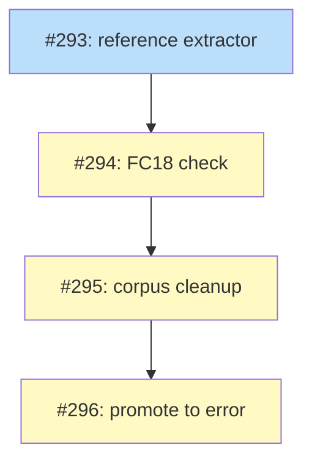

# PLAN: prose-reference-staleness

## Status

Active

Issues created and tracked under the
[Prose Reference Staleness](https://github.com/tsukumogami/shirabe/milestone/8)
milestone. The PLAN closes when #293, #294, #295, and #296 are all merged and
`FC18` is an error over a clean corpus.

## Scope Summary

Add `FC18` to `shirabe validate`: a check that reports a body-prose reference
whose path names no file when a file of the same basename survives elsewhere in
the repository's artifact directories. That surviving basename is the whole
discriminator, and it separates the 21 references a relocation actually broke
from the 119 unresolvable paths that are template placeholders, eval fixture
names, and deliberately-deleted working artifacts.

The check ships as a notice against the corpus it inherits, the corpus gets
cleaned, and the check is promoted to an error. Prevention, meaning teaching
`shirabe transition` to repoint inbound references as it moves a file, is
deliberately out of scope: it is the more invasive half and it fixes none of
the 21 references that are already stale.

## Decomposition Strategy

**Horizontal, four layers, strictly sequential.** Each issue is one layer of
the design's Implementation Approach, and every dependency edge is real rather
than stylistic:

- The extractor lands alone (#293) because it has a parser behind it and
  because no finding count means anything until its context handling is right.
- The check lands next (#294), consuming the extractor and pinning the corpus
  count at 21.
- The cleanup (#295) can only be scoped by the check's own output, which is why
  it cannot precede it and why it is not folded into it: a change that adds a
  check, edits 17 files, and turns CI red if either half is wrong is not one
  reviewable thing.
- The promotion (#296) is one line and would turn CI red before the cleanup
  lands, so it goes last.

The chain is worth stating plainly because its shape is the design's staging
argument: notice, then clean, then error. Issues #295 and #296 are the two a
maintainer may reasonably defer. The check is useful from #294 onward, and the
corpus-count test that lands with it keeps the number honest in the meantime.

## Issue Outlines

_Empty in multi-pr mode per the PLAN format spec. Issue content is owned by the
GitHub issues linked in the Implementation Issues table below._

## Implementation Issues

### Milestone: [Prose Reference Staleness](https://github.com/tsukumogami/shirabe/milestone/8)

| Issue | Dependencies | Complexity |
|-------|--------------|------------|
| [#293: feat(validate): reference extractor over the CommonMark parse](https://github.com/tsukumogami/shirabe/issues/293) | None | testable |
| _Add `prose::reference_spans`, a second selection over the parse `prose_spans` already runs: inline code spans and link destinations in, fenced and indented code out. All 21 defects live in code spans, which `prose_spans` deliberately excludes._ | | |
| [#294: feat(validate): FC18 reports a prose reference invalidated by a relocation](https://github.com/tsukumogami/shirabe/issues/294) | [#293](https://github.com/tsukumogami/shirabe/issues/293) | critical |
| _Add the candidate filter, the per-file repo-root resolver, the memoized target index, and the `FC18` notice registered in `validate_prose` so it reaches schema-less instruction files. Pin the corpus count at 21._ | | |
| [#295: docs: repoint the 21 stale prose references FC18 reports](https://github.com/tsukumogami/shirabe/issues/295) | [#294](https://github.com/tsukumogami/shirabe/issues/294) | simple |
| _Fix the 21 references across 15 documents under `docs/` and 2 instruction files under `skills/`. Paths only; no prose is reworded. Drops the corpus count to zero._ | | |
| [#296: feat(validate): promote FC18 from notice to error](https://github.com/tsukumogami/shirabe/issues/296) | [#295](https://github.com/tsukumogami/shirabe/issues/295) | simple |
| _Delete the `FC18` arm from `is_intrinsic_notice` and flip the severity test. One line of non-test code, gated on the corpus being clean._ | | |

## Dependency Graph

**Legend**: Blue = ready, Yellow = blocked, Green = done

A ready issue is unblocked and implementable now; a blocked one is waiting on
the issue its edge points from.

## Implementation Sequence

Strictly serial: #293, then #294, then #295, then #296. Nothing here
parallelizes, and the chain is short enough that a single implementing agent
can carry it end to end.

**Start with #293.** It is the only unblocked issue and the only one whose
correctness is independently checkable: the context split (code span, fenced,
plain) is what every count downstream rests on.

**#294 is the load-bearing one.** It is the only `complex` issue in the set,
and its acceptance criteria are unusually long on purpose: the discriminator,
the resolution base, the archive directory, the parity constraint, and the
corpus count are each a way the check can be subtly wrong while still looking
right. The parity constraint deserves particular care: the check must read
`doc.body` only, because a Layer-1 golden fixture carries
`DESIGN-roadmap-plan-standardization.md` under the pre-move `docs/designs/` in
its `upstream:` field, and a frontmatter-reading check would produce a new
finding on pinned bytes.

**#295 and #296 are a pair.** Landing #295 without #296 leaves the check
correct and quiet; landing #296 without #295 turns CI red. If the milestone
stalls, stall it between #294 and #295 rather than between #295 and #296.

**Re-measure rather than trusting line numbers.** The table in #295 records
lines from the branch point, and any merge in between moves them. Re-run the
check to get the current set.

## References

- `docs/designs/DESIGN-prose-reference-staleness.md` — the design this PLAN
  decomposes; its Implementation Approach names the same four batches.
- `docs/prds/PRD-prose-reference-staleness.md` — the requirements each issue's
  acceptance criteria cite.
- `docs/plans/PLAN-work-on-friction-fixes.md` — the multi-pr PLAN this one
  follows for table, diagram, and legend shape.
