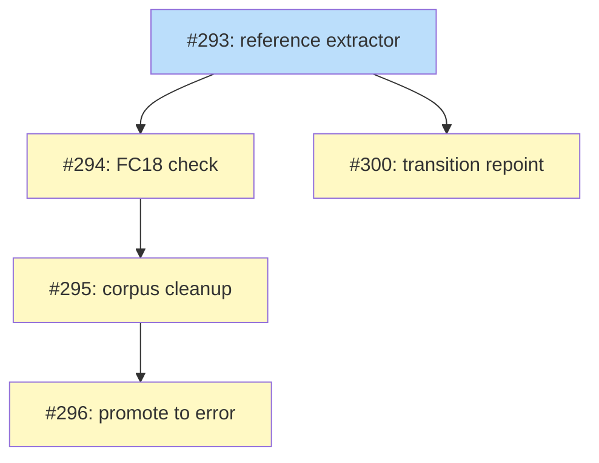

# PLAN: prose-reference-staleness

## Status

Active

Issues created and tracked under the
[Prose Reference Staleness](https://github.com/tsukumogami/shirabe/milestone/8)
milestone. The PLAN closes when #293, #294, #300, #295, and #296 are all merged
and `FC18` is an error over a clean corpus.

## Scope Summary

Two halves over one extractor.

**Prevention.** `shirabe transition` repoints inbound references as part of each
of the four moving transitions, so a correct lifecycle move stops stranding the
documents that named the old path. It is deterministic: the command holds the
old path and the new one, so nothing is inferred and nothing is left for a
person to edit by hand.

**Detection.** `FC18` reports a body-prose reference whose path names no file
when a file of the same basename survives elsewhere in the repository's artifact
directories. That surviving basename is the whole discriminator, and it
separates the 21 references a relocation actually broke from the 119
unresolvable paths that are template placeholders, eval fixture names, and
deliberately-deleted working artifacts. Detection is not made redundant by
prevention: it is the only thing that finds references broken by moves that
already happened, or by a rename that went around `shirabe transition`.

The check ships as a notice against the corpus it inherits, the corpus gets
cleaned by hand, and the check is promoted to an error. The cleanup stays manual
because those documents moved before the repoint existed, so no transition will
run over them. A `validate --fix` would have cleared them in one command and is
deliberately not built: validate reads and reports, and never writes.

## Decomposition Strategy

**Horizontal, five layers, one fork.** Each issue is one layer of the design's
Implementation Approach, and every dependency edge is real rather than
stylistic:

- The extractor lands alone (#293) because it has a parser behind it, because
  no finding count means anything until its context handling is right, and
  because two later issues consume it. It must carry `RefSpan.range` from the
  start — #300 substitutes into that exact range, and an extractor that returns
  only `(line, text)` forces a second matcher that can disagree with the first.
- The check (#294) and the repoint (#300) both depend on #293 and on nothing
  else. This is the plan's only fork: the repoint needs the extractor's spans
  and ranges, not the check's basename resolution, so the two can proceed at
  once.
- The cleanup (#295) can only be scoped by the check's own output, which is why
  it cannot precede #294 and why it is not folded into it: a change that adds a
  check, edits 17 files, and turns CI red if either half is wrong is not one
  reviewable thing.
- The promotion (#296) is one line and would turn CI red before the cleanup
  lands, so it goes last.

The shape is the design's staging argument: prevent, detect, clean, promote.
Issues #295 and #296 are the two a maintainer may reasonably defer. The repoint
is useful from #300 onward whether or not the backlog is ever cleaned, the check
is useful from #294 onward, and the corpus-count test that lands with it keeps
the number honest in the meantime.

## Issue Outlines

_Empty in multi-pr mode per the PLAN format spec. Issue content is owned by the
GitHub issues linked in the Implementation Issues table below._

## Implementation Issues

### Milestone: [Prose Reference Staleness](https://github.com/tsukumogami/shirabe/milestone/8)

| Issue | Dependencies | Complexity |
|-------|--------------|------------|
| [#293: feat(validate): reference extractor over the CommonMark parse](https://github.com/tsukumogami/shirabe/issues/293) | None | testable |
| _Add `prose::reference_spans`, a second selection over the parse `prose_spans` already runs: inline code spans and link destinations in, fenced and indented code out. Carries a byte range per span, which #300 substitutes into. All 21 defects live in code spans, which `prose_spans` deliberately excludes._ | | |
| [#294: feat(validate): FC18 reports a prose reference invalidated by a relocation](https://github.com/tsukumogami/shirabe/issues/294) | [#293](https://github.com/tsukumogami/shirabe/issues/293) | critical |
| _Add the candidate filter, the per-file repo-root resolver, the memoized target index, and the `FC18` notice registered in `validate_prose` so it reaches schema-less instruction files. Pin the corpus count at 21._ | | |
| [#300: feat(transition): repoint inbound references when a transition moves a doc](https://github.com/tsukumogami/shirabe/issues/300) | [#293](https://github.com/tsukumogami/shirabe/issues/293) | critical |
| _Rewrite every reference to the old path when any of the four moving transitions relocates a document, staging the rewritten files with the moved one. Prose and frontmatter `upstream:`; code blocks excluded. Stops the problem recurring._ | | |
| [#295: docs: repoint the 21 stale prose references FC18 reports](https://github.com/tsukumogami/shirabe/issues/295) | [#294](https://github.com/tsukumogami/shirabe/issues/294) | simple |
| _Fix the 21 references across 15 documents under `docs/` and 2 instruction files under `skills/`. Paths only; no prose is reworded. Stays a hand edit: these moved before the repoint existed. Drops the corpus count to zero._ | | |
| [#296: feat(validate): promote FC18 from notice to error](https://github.com/tsukumogami/shirabe/issues/296) | [#295](https://github.com/tsukumogami/shirabe/issues/295) | simple |
| _Delete the `FC18` arm from `is_intrinsic_notice` and flip the severity test. One line of non-test code, gated on the corpus being clean._ | | |

## Dependency Graph

**Legend**: Blue = ready, Yellow = blocked, Green = done

A ready issue is unblocked and implementable now; a blocked one is waiting on
the issue its edge points from.

## Implementation Sequence

#293 first, then #294 and #300 in either order or at once, then #295, then #296.

**Start with #293.** It is the only unblocked issue, the only one whose
correctness is independently checkable, and the one both later pieces consume.
The context split (code span, fenced, plain) is what every count downstream
rests on, and the byte range is what #300's substitution needs. Land it without
the range and #300 either duplicates the matching logic or changes a signature
under tests that already passed.

**#294 and #300 are the two `critical` ones, and they fail differently.** The
check can be subtly wrong while still looking right: the discriminator, the
resolution base, the moving-transition destinations, the parity constraint, and
the corpus count are each a way that happens. The parity constraint deserves
particular care: the check must read `doc.body` only, because a Layer-1 golden
fixture carries `DESIGN-roadmap-plan-standardization.md` under the pre-move
`docs/designs/` in its `upstream:` field, and a frontmatter-reading check would
produce a new finding on pinned bytes. The repoint fails more loudly and does
more damage: it writes across the tree, so its criteria pin the diff shape (only
the substituted substrings change), the edit order (right to left, or a second
edit on the same line corrupts), and the failure mode (validate every file
before writing any).

**The two differ on frontmatter, deliberately.** The check reads the body only;
the repoint rewrites `upstream:` as well. That is not an inconsistency to tidy
up. R6 already reports a dangling `upstream:` loudly, so the check has nothing
to add there, while the repoint is in a position to fix it and a person
otherwise has to.

**#295 and #296 are a pair.** Landing #295 without #296 leaves the check
correct and quiet; landing #296 without #295 turns CI red. If the milestone
stalls, stall it between #294 and #295 rather than between #295 and #296.

**#300 is the one to protect if the milestone is cut short.** It is the only
issue that stops the defect recurring; everything else describes or repairs a
backlog. A milestone that ships #293 and #300 and nothing else is in better
shape than one that ships #293, #294, and #295.

**Re-measure rather than trusting line numbers.** The table in #295 records
lines from the branch point, and any merge in between moves them. Re-run the
check to get the current set.

## References

- `docs/designs/DESIGN-prose-reference-staleness.md` — the design this PLAN
  decomposes; its Implementation Approach names the same five batches.
- `docs/prds/PRD-prose-reference-staleness.md` — the requirements each issue's
  acceptance criteria cite.
- `docs/plans/PLAN-work-on-friction-fixes.md` — the multi-pr PLAN this one
  follows for table, diagram, and legend shape.
