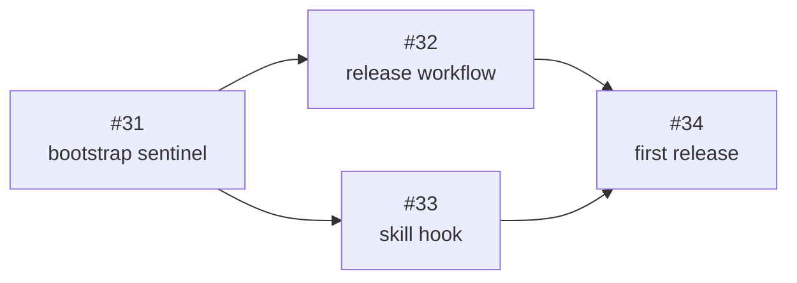

# PLAN: Release Process

## Status

Active

## Scope Summary

Automated release process for shirabe that keeps git tags, plugin.json, and
marketplace.json versions in sync using a sentinel value on main, /release skill
manifest stamping, and tag-triggered GitHub Actions.

## Decomposition Strategy

**Horizontal decomposition.** Components are independent modules (CI script, CI
workflow, release workflow, skill hook) with clear boundaries and no runtime
interaction. The sentinel bootstrap must come first; the release workflow and skill
hook can be worked in parallel after it merges.

## Implementation Issues

| # | Title | Complexity | Status |
|---|-------|------------|--------|
| #31 | chore(release): bootstrap sentinel version in manifests | simple | open |
| #32 | ci(release): add tag-triggered release workflow | testable | open |
| #33 | feat(release): add pre-tag manifest hook to /release skill | simple | open |
| #34 | chore(release): execute first release with new process | simple | open |

## Dependency Graph

## Implementation Sequence

1. **#31** (sentinel bootstrap) -- no blockers, start here
2. **#32 + #33** (parallel) -- both blocked by #31
3. **#34** (first release) -- blocked by #32 and #33
