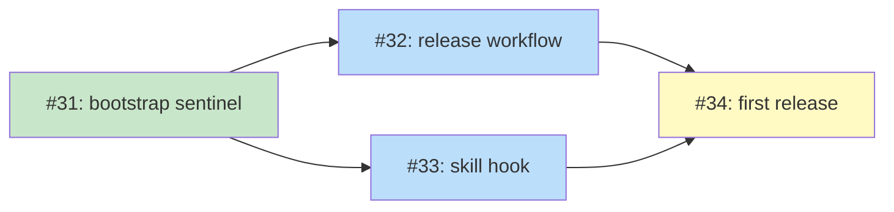

# PLAN: Release Process

## Status

Active

## Scope Summary

Automated release process for shirabe that keeps git tags, plugin.json, and
marketplace.json versions in sync using a rolling dev sentinel on main, /release
skill manifest stamping, and tag-triggered GitHub Actions.

## Decomposition Strategy

**Horizontal decomposition.** Components are independent modules (CI script, CI
workflow, release workflow, skill hook) with clear boundaries and no runtime
interaction. The sentinel bootstrap must come first; the release workflow and skill
hook can be worked in parallel after it merges.

## Implementation Issues

### Milestone: [Release Process](https://github.com/tsukumogami/shirabe/milestone/1)

| Issue | Dependencies | Complexity |
|-------|--------------|------------|
| ~~[#31: chore(release): bootstrap sentinel version in manifests](https://github.com/tsukumogami/shirabe/issues/31)~~ | ~~None~~ | ~~simple~~ |
| ~~_Switches both manifests to a rolling `-dev` sentinel and adds `check-sentinel.sh` with a path-filtered CI workflow that validates the `-dev` suffix on every PR touching `.claude-plugin/`._~~ | | |
| [#32: ci(release): add tag-triggered release workflow](https://github.com/tsukumogami/shirabe/issues/32) | [#31](https://github.com/tsukumogami/shirabe/issues/31) | testable |
| _Creates `release.yml` with a release job that publishes a GH release from the tag annotation and a finalize-release job that advances manifests to the next dev version on main._ | | |
| [#33: feat(release): add pre-tag manifest hook to /release skill](https://github.com/tsukumogami/shirabe/issues/33) | [#31](https://github.com/tsukumogami/shirabe/issues/31) | simple |
| _Adds a conditional block in the /release skill that detects `.claude-plugin/plugin.json`, stamps both manifests with the release version (stripping the `v` prefix), and commits before tagging._ | | |
| [#34: chore(release): execute first release with new process](https://github.com/tsukumogami/shirabe/issues/34) | [#32](https://github.com/tsukumogami/shirabe/issues/32), [#33](https://github.com/tsukumogami/shirabe/issues/33) | simple |
| _Runs `/prepare-release` and `/release` end-to-end, verifies the tag has correct manifests, and confirms the finalize-release job advances the sentinel on main._ | | |

## Dependency Graph

**Legend**: Green = done, Blue = ready, Yellow = blocked

## Implementation Sequence

1. ~~**#31** (sentinel bootstrap) -- no blockers, start here~~
2. **#32 + #33** (parallel) -- both unblocked now that #31 is done
3. **#34** (first release) -- blocked by #32 and #33
