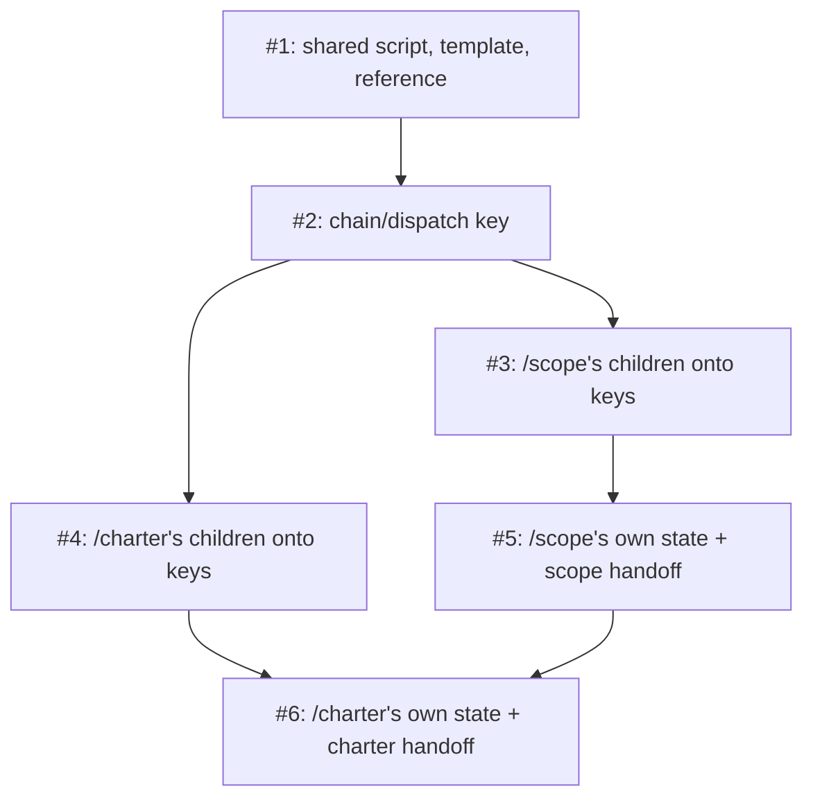

# PLAN: Resume convention and the two chains

## Status

Active

## Scope Summary

Implement `docs/designs/DESIGN-resume-convention.md`: the shared session
convention's code and reference, then move `/scope`, `/charter`, their seven
direct children, `/review-plan`, `/decision` and `/explore`'s two handoffs
onto koto session keys, in six pull requests that each move both ends of the
interfaces they touch.

## Decomposition Strategy

Horizontal. The convention's shared script and template form a stable
interface that every later group calls, so they land first and alone; each
later group is one interface moved end to end (the dispatch signal, one
chain's children, one parent's own state), following the design's
Decision 5 so that no merge leaves a writer and a reader of one interface
disagreeing. A walking skeleton would cut across the coupled pairs the design
says must move together.

## Issue Outlines

### Issue 1: feat(scripts): add the skill-session convention's shared script, template and reference

**Repo**: tsukumogami/shirabe

**Group**: convention

**Goal**: Land `scripts/skill-session.sh`, `koto-templates/skill-session.md`,
`scripts/skill-session_test.sh`, `.github/workflows/check-skill-session.yml`
and `references/skill-session-convention.md` as the design's Solution
Architecture describes them, changing no skill.

**Acceptance Criteria**:
- [ ] `skill-session.sh` implements `name`, `open`, `status`, `has-work`,
      `close`, `dispatch write|read|clear`, `adopt`, `close-children`,
      `scratch`, `ingest`, `get`, `put` and `reclaimable`, each validating
      its arguments before any koto call.
- [ ] The test suite runs against real koto in a store isolated by
      `KOTO_SESSIONS_BASE`, skips engine cases with exit 0 when koto is
      absent, and covers: valid and invalid names (`Foo`, `a_b`, `../x`,
      empty) with no koto call on refusal; open creating, attaching with keys
      kept, replacing a finished session with old keys gone, and refusing a
      session of another template or another branch; status reporting
      absent, live and finished, and leaving the state log unchanged in
      length; close leaving the session finished and readable; the dispatch
      key round-tripping its three fields and being gone after clear; ingest
      turning plain files into keys, skipping a symlink, a bad name and an
      oversized file, and removing its directory on success and on a failed
      key write; `get` and `put` refusing `..` and keys outside `work/` and
      `research/`; the reclaimable rule's four cases; koto absent from `PATH`
      and koto below the floor each stopping with a message naming koto.
- [ ] A parent-and-child case: the parent writes `chain/dispatch` naming the
      child; the child's `dispatch read` finds `scope-<topic>` by name,
      `adopt` writes `chain/parent`, and the child writes `work/` keys; the
      parent reads them from the child's session by name, writes its `exit`,
      and only then `close-children` closes the child; a stale key is
      removed at parent start, a key naming another child is no match, and
      two matching parents exit 3.
- [ ] The koto-absent and below-floor cases also assert that no file was
      created under the staging folder.
- [ ] `open` and `close` never pass `--parent`, and every `koto next` the
      script issues carries `--no-cleanup` (a test greps the script and
      checks the retention object of a close).
- [ ] The CI workflow installs koto, asserts the floor, runs the suite, and is
      green per job; `scripts/check-bash-floor.sh` passes on the new script.
- [ ] `references/skill-session-convention.md` states the rules from the
      design's "The convention, rule by rule" section and its per-skill key
      table, and contains no staging-folder path.
- [ ] `scripts/ablation/check-public-content.sh --diff origin/main` passes.

**Dependencies**: None

**Type**: code
**Files**: `scripts/skill-session.sh`, `scripts/skill-session_test.sh`, `koto-templates/skill-session.md`, `references/skill-session-convention.md`, `.github/workflows/check-skill-session.yml`

### Issue 2: feat(chains): carry the parent-to-child signal as the chain/dispatch key

**Repo**: tsukumogami/shirabe

**Group**: dispatch

**Goal**: Replace the `parent_orchestration:` block with `chain/dispatch`:
`/scope` writes and clears it around each hop and removes a stale one at
setup; `/charter` opens `charter-<topic>`, does the same, and closes its
session at its current finalization; all seven children and `/design`'s
sentinel-gated PRD transition decide with `skill-session.sh dispatch read`.

**Acceptance Criteria**:
- [ ] `/scope`'s phase files and template directives write the key before
      each child, clear it after, and remove a stale one at setup; no file
      in `skills/scope` describes a `parent_orchestration:` block.
- [ ] `/charter`'s phase files open `charter-<topic>`, write and clear the key
      around each of `/vision`, `/strategy` and `/roadmap`, and close the
      session at finalization; the unread `--parent-orchestrated` marker is
      gone.
- [ ] The first resume row of `/brief`, `/prd`, `/design`, `/plan`,
      `/vision`, `/strategy` and `/roadmap` reads `chain/dispatch` through
      `dispatch read` by session name; none opens a session yet.
- [ ] `/design`'s PRD auto-transition under a parent reads the key, not a
      glob.
- [ ] The parents' prose clears the key after the child returns whatever its
      outcome (landed, skipped, rejected, error), and each child's sentinel
      row states the four no-match cases: no parent session, a finished
      parent, a key naming another child, and two matching parents (stop,
      naming both sessions).
- [ ] The five contract documents named in the design describe the dispatch
      key and the start-of-run removal, and no longer describe a block at a
      path.
- [ ] Evals of these skills that assert on the block are rewritten to the
      key; the scenarios this change bears on run once and pass, and the PR
      body names them.
- [ ] `scripts/ablation/check-public-content.sh --diff origin/main` passes.
- [ ] `skills/execute/scripts/node-push.sh`, `skills/deliver/scripts/deliver-report.sh`
      and `.github/workflows/check-public-content.yml` are unchanged.

**Dependencies**: Blocked by <<ISSUE:1>>

**Type**: code

### Issue 3: feat(scope): move /scope's children and the skills they run onto session keys

**Repo**: tsukumogami/shirabe

**Group**: scope-children

**Goal**: `/brief`, `/prd`, `/design` (with `/decision`) and `/plan` (with
`/review-plan` and its issue-body hand-off) keep every working, research and
verdict file as a key per the design's per-skill table, whether chained or
direct; `/scope`'s resume probe child checks and `bail` gate use `has-work`;
`/scope` closes its children at exit.

**Acceptance Criteria**:
- [ ] Each of the six skills calls `open` and `adopt` at its first phase,
      writes the keys the design's table lists, has its resume table stated
      in keys, and closes its own session at the end of a direct run.
- [ ] Reviewer and research agents write into a `scratch` directory that the
      orchestrator ingests; no prompt pins a staging-folder path.
- [ ] `/plan` materializes issue bodies into a scratch directory for
      `create-issue.sh` and `create-issues-batch.sh`, whose interfaces are
      unchanged.
- [ ] `/review-plan` reads and writes `plan-<topic>`, removes `/plan`'s keys on
      loop-back, and on a topic with no `plan-<topic>` reviews the PLAN alone
      and closes the session it opened.
- [ ] `resume-probe.sh` checks the four children with `has-work`; its tests
      include an empty staging folder with a live `design-<topic>` holding a
      `work/` key routing back into the design hop, and the same with the
      session finished routing past it.
- [ ] The `bail` gate in `skills/scope/koto-templates/scope.md` calls
      `skill-session.sh has-work` instead of `find`;
      `scripts/check-template-directives.sh` and its test are updated so a
      gate command naming the staging folder is flagged, and both pass.
- [ ] `/scope` calls `close-children` after writing `exit` on every exit path.
- [ ] `git grep -n 'wip/' -- skills/{brief,prd,design,plan,review-plan,decision}`
      returns only lines on the design's allowlist; evals included.
- [ ] One `/scope` eval scenario this change bears on runs once and passes,
      asserting that after the run no file under the staging folder carries
      a child's prefix (`brief_`, `prd_`, `design_`, `plan_`); the PR body
      names it.
- [ ] Each moved child states that under a parent it never closes its own
      session, and every `koto next` it shows carries `--no-cleanup`;
      `git grep -n -- '--parent'` over the six skills finds no `koto init`
      call with it.
- [ ] Readers outside the moved set that name a moved skill's files are
      updated, including `references/decision-report-format.md`.
- [ ] `skills/execute/scripts/node-push.sh`, `skills/deliver/scripts/deliver-report.sh`
      and `.github/workflows/check-public-content.yml` are unchanged.
- [ ] `scripts/ablation/check-public-content.sh --diff origin/main` passes.

**Dependencies**: Blocked by <<ISSUE:2>>

**Type**: code

### Issue 4: feat(charter): move /charter's children onto session keys

**Repo**: tsukumogami/shirabe

**Group**: charter-children

**Goal**: `/vision`, `/strategy` and `/roadmap` keep their files as keys per
the design's table; `/charter`'s ladder rows over their files use `has-work`;
`/roadmap` reads `chain/roadmap-scope` instead of a pre-populated file;
`/charter` closes its children at exit.

**Acceptance Criteria**:
- [ ] Each of the three skills calls `open` and `adopt`, writes the keys the
      design lists, states its resume table in keys, ingests its agents'
      outputs from a scratch directory, and closes its own session on a
      direct run.
- [ ] `/charter` writes `chain/roadmap-scope` and `/roadmap` reads it when its
      dispatch matches; nothing pre-populates a roadmap scope file.
- [ ] `/charter`'s ladder rows that checked `/vision`'s, `/strategy`'s and
      `/roadmap`'s files call `has-work`, and a scripted test of that check
      (in `scripts/skill-session_test.sh` or a charter test) shows an empty
      staging folder with a live `strategy-<topic>` holding a `work/` key
      reported as mid-flight and the same session finished reported as not.
- [ ] `/roadmap` ignores `chain/roadmap-scope` when `chain/dispatch` names
      another child or no parent matches, and states so.
- [ ] `/charter` calls `close-children` at finalization before closing its own
      session.
- [ ] `git grep -n 'wip/' -- skills/{vision,strategy,roadmap}` returns only
      allowlisted lines; evals included.
- [ ] One `/charter` eval scenario this change bears on runs once and passes,
      asserting that after the run no file under the staging folder carries
      a child's prefix (`vision_`, `strategy_`, `roadmap_`); the PR body names
      it.
- [ ] Each moved child states that under a parent it never closes its own
      session; `git grep -n -- '--parent'` over the three skills finds no
      `koto init` call with it.
- [ ] `skills/execute/scripts/node-push.sh`, `skills/deliver/scripts/deliver-report.sh`
      and `.github/workflows/check-public-content.yml` are unchanged.
- [ ] `scripts/ablation/check-public-content.sh --diff origin/main` passes.

**Dependencies**: Blocked by <<ISSUE:2>>

**Type**: code

### Issue 5: feat(scope): keep /scope's own state in its session and take the exploration handoff as a key

**Repo**: tsukumogami/shirabe

**Group**: scope-state

**Goal**: `/scope`'s state file becomes `work/state.md` in `scope-<topic>`,
finished-run facts reach the next run through `work/prior-run.md` written
from koto's replaced result, `/explore` writes `handoff/scope.md` in
`explore-<topic>` for `/scope` to read and remove, and the scope adoption
design records that its exception is closed.

**Acceptance Criteria**:
- [ ] `resume-probe.sh`, `run-intake.sh`, `resolve-intent.sh` and
      `check-recorded-intent.sh` read `work/state.md` and `work/prior-run.md`
      from the session (`--session` replaces `--state-file`), re-validating
      every field against its closed set; every other script in
      `skills/scope/scripts/` was re-checked for a state-file read.
- [ ] `scope-open.sh` writes `work/prior-run.md` after a replace, keeping
      only values that match closed patterns; tests show a replaced finished
      session's intent, exit and failed publish step reaching the new run,
      and a missing result key falling through to the artifact rows.
- [ ] A successful publish and the cleanup phase remove `work/prior-run.md`.
- [ ] Every directive in `skills/scope/koto-templates/scope.md` that names
      the state file or the handoff file is rewritten, the two per-tick
      retention sentences become the every-tick rule, and the lint's routing
      allowlist no longer names `resume-probe.sh`.
- [ ] `/explore` writes `handoff/scope.md` through the shared script;
      `/scope` reads it by name, removes it once consumed, and closes
      `explore-<topic>` when it holds nothing else.
- [ ] `docs/designs/current/DESIGN-scope-koto-adoption.md` carries a dated
      note saying its state-file exception is closed.
- [ ] `git grep -n 'wip/' -- skills/scope` returns only allowlisted lines (the
      unchanged publish untrack step and its tests); `scope.md` has no
      command reading the staging folder; all `skills/scope` tests pass.
- [ ] `skills/execute/scripts/node-push.sh`, `skills/deliver/scripts/deliver-report.sh`
      and `.github/workflows/check-public-content.yml` are unchanged.
- [ ] One `/scope` eval scenario this change bears on runs once and passes,
      asserting `git status --porcelain -- wip/` is empty after the run and
      every file the run committed is under `docs/`; the PR body names it.
- [ ] `/scope`'s handoff read covers an absent handoff (no row fires), a
      handoff already consumed (removed, not re-read), and a run that exits
      early (the handoff key stays for the next run).
- [ ] `/explore`'s evals and phase files that name the scope handoff file are
      updated.
- [ ] `scripts/ablation/check-public-content.sh --diff origin/main` passes.

**Dependencies**: Blocked by <<ISSUE:3>>

**Type**: code

### Issue 6: feat(charter): keep /charter's own state in its session and take the exploration handoff as a key

**Repo**: tsukumogami/shirabe

**Group**: charter-state

**Goal**: `/charter`'s state file becomes `work/state.md` in
`charter-<topic>`; `/explore` writes `handoff/charter.md` for `/charter` to
read and remove.

**Acceptance Criteria**:
- [ ] `/charter`'s phase files and resume ladder rows 1 to 4 read and write
      `work/state.md`; no row names a staging-folder path.
- [ ] `/explore` writes `handoff/charter.md`; `/charter` reads it by name,
      removes it once consumed, and closes `explore-<topic>` when it holds
      nothing else.
- [ ] `/charter`'s finalization closes its children and then its own session
      on every exit path.
- [ ] `git grep -n 'wip/' -- skills/charter` returns only allowlisted lines;
      evals included.
- [ ] One `/charter` eval scenario this change bears on runs once and passes,
      asserting `git status --porcelain -- wip/` is empty after the run and
      every file the run committed is under `docs/`; the PR body names it.
- [ ] `/charter`'s handoff read covers an absent handoff, one already
      consumed, and a run that exits early, as Issue 5's does.
- [ ] `/explore`'s evals and phase files that name the charter handoff file
      are updated.
- [ ] `skills/execute/scripts/node-push.sh`, `skills/deliver/scripts/deliver-report.sh`
      and `.github/workflows/check-public-content.yml` are unchanged.
- [ ] `scripts/ablation/check-public-content.sh --diff origin/main` passes.

**Dependencies**: Blocked by <<ISSUE:4>>, <<ISSUE:5>>

**Type**: code

## Dependency Graph

## Implementation Sequence

Critical path: 1, 2, 3, 5, 6. Issue 4 runs in parallel with 3 and 5 once 2
has landed. Issue 6 waits on 5 as well as 4 because both change `/explore`'s
handoff step, and landing them in order keeps that file's edits from
conflicting.
