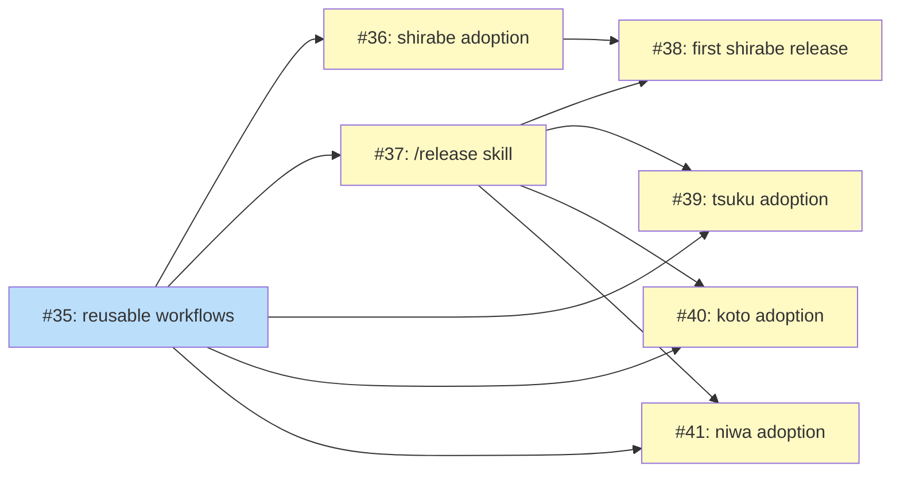

# PLAN: Reusable Release System

## Status

Active

## Scope Summary

Two reusable GitHub Actions workflows (release + finalize) published from shirabe,
a /release skill for version recommendation and draft management, convention-based
hooks for repo-specific logic, and adoption across all public tsukumogami repos.

## Decomposition Strategy

**Horizontal decomposition.** Components have clear boundaries and sequential
dependencies: reusable workflows must exist before any repo adopts them, shirabe
adopts first (bootstrapping), the skill depends on a working workflow, and
migration of other repos proceeds in parallel once the skill exists.

## Implementation Issues

### Milestone: [Reusable Release System](https://github.com/tsukumogami/shirabe/milestone/2)

| Issue | Dependencies | Complexity |
|-------|--------------|------------|
| [#35: ci(release): create reusable release and finalize workflows](https://github.com/tsukumogami/shirabe/issues/35) | None | testable |
| _Creates release.yml (Maven-style prepare dance via workflow_dispatch) and finalize-release.yml (draft promotion with optional artifact verification). Both support dry-run, configurable token, and dev-suffix. SHA-pinned action dependencies._ | | |
| [#36: chore(release): adopt reusable workflows in shirabe](https://github.com/tsukumogami/shirabe/issues/36) | [#35](https://github.com/tsukumogami/shirabe/issues/35) | simple |
| _Adds shirabe's caller workflow wiring release and finalize as sequential jobs, .release/set-version.sh for plugin.json and marketplace.json, and updates check-sentinel.sh for configurable suffix._ | | |
| [#37: feat(release): create /release skill](https://github.com/tsukumogami/shirabe/issues/37) | [#35](https://github.com/tsukumogami/shirabe/issues/35) | testable |
| _Creates the /release skill with conventional commit analysis for version recommendation, precondition validation, release note generation, draft creation via gh, workflow dispatch with 3 inputs, and 5-minute polling with graceful timeout._ | | |
| [#38: chore(release): first shirabe release with new system](https://github.com/tsukumogami/shirabe/issues/38) | [#36](https://github.com/tsukumogami/shirabe/issues/36), [#37](https://github.com/tsukumogami/shirabe/issues/37) | simple |
| _Runs /release end-to-end on shirabe, verifying the tag points to correct manifest versions, the draft is promoted, and the sentinel advances on main._ | | |
| [#39: chore(release): adopt reusable workflows in tsuku](https://github.com/tsukumogami/shirabe/issues/39) | [#35](https://github.com/tsukumogami/shirabe/issues/35), [#37](https://github.com/tsukumogami/shirabe/issues/37) | simple |
| _Adds prepare-release.yml caller workflow, .release/set-version.sh for Cargo.toml files, and a finalize bridge workflow triggered after the existing release.yml build completes._ | | |
| [#40: chore(release): adopt reusable workflows in koto](https://github.com/tsukumogami/shirabe/issues/40) | [#35](https://github.com/tsukumogami/shirabe/issues/35), [#37](https://github.com/tsukumogami/shirabe/issues/37) | simple |
| _Adds caller workflow, .release/post-release.sh for version pinning in check-template-freshness.yml, and a finalize bridge. Switches koto to draft-then-promote._ | | |
| [#41: chore(release): adopt reusable workflows in niwa](https://github.com/tsukumogami/shirabe/issues/41) | [#35](https://github.com/tsukumogami/shirabe/issues/35), [#37](https://github.com/tsukumogami/shirabe/issues/37) | simple |
| _Adds caller workflow and finalize bridge. Fixes the draft-never-promoted bug by routing promotion through the reusable finalize workflow._ | | |

## Dependency Graph

**Legend**: Green = done, Blue = ready, Yellow = blocked

## Implementation Sequence

1. **#35** (reusable workflows) -- no blockers, start here
2. **#36 + #37** (parallel) -- shirabe adoption + /release skill, both unblocked after #35
3. **#38** (first shirabe release) -- validates the full cycle, blocked by #36 and #37
4. **#39 + #40 + #41** (parallel) -- tsuku, koto, niwa migration, all unblocked after #35 and #37
