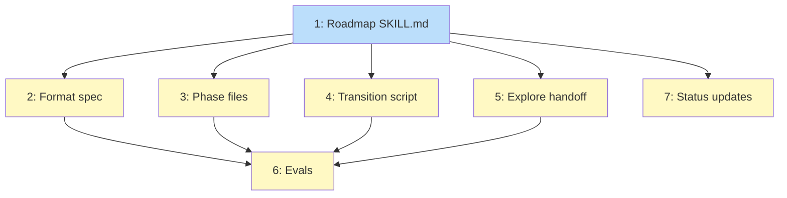

# PLAN: Roadmap Creation Skill

## Status

Draft

## Scope Summary

Add a /roadmap creation skill with format spec, 4-phase creation workflow,
lifecycle transition script, /explore auto-continue handoff, and evals.
Replaces inline roadmap production.

## Decomposition Strategy

**Horizontal.** All deliverables are markdown skill files and a bash script.
The SKILL.md comes first (defines the format and workflow structure), then
phase files and transition script in parallel, then explore handoff (depends
on the skill existing), then evals last.

Split from F1's pattern: the format spec is a separate issue from the SKILL.md
because R6 (reserved planning positions) adds new sections not in the private
plugin's format, requiring careful design rather than a straight adoption.

## Issue Outlines

### 1. feat(roadmap): add roadmap skill with creation workflow

**Goal:** Create the core SKILL.md that defines the /roadmap creation
workflow, references the format spec, handles lifecycle verbs (activate,
done), detects /explore handoff artifacts, and supports standalone entry.

**Acceptance Criteria:**
- [ ] `skills/roadmap/SKILL.md` exists with creation workflow structure
- [ ] Input modes: empty (prompt user), lifecycle verb (activate/done),
      topic (start creation)
- [ ] Standalone entry detects `wip/roadmap_<topic>_scope.md` handoff
- [ ] Resume logic covers all phases
- [ ] References `references/roadmap-format.md` for format spec
- [ ] Creation workflow phases documented (0-4)
- [ ] Lifecycle verbs delegate to `scripts/transition-status.sh`

**Dependencies:** None

---

### 2. feat(roadmap): add format spec with reserved planning sections

**Goal:** Create the roadmap format reference adopting the private plugin's
format spec and extending it with reserved positions for Implementation
Issues table and Mermaid Dependency Graph (R6). These sections are empty at
creation time and populated by /plan.

**Acceptance Criteria:**
- [ ] `skills/roadmap/references/roadmap-format.md` exists
- [ ] Frontmatter schema: status, theme, scope (adopted from private plugin)
- [ ] Required sections in order: Status, Theme, Features, Sequencing
      Rationale, Progress
- [ ] Reserved sections (after Progress): Implementation Issues (empty),
      Dependency Graph (empty)
- [ ] Lifecycle states: Draft, Accepted, Active, Done with transition rules
- [ ] Validation rules (minimum 2 features, status consistency, etc.)
- [ ] Quality guidance per section (adopted from private plugin)
- [ ] Content boundaries (not a PRD, not a plan, not a timeline)

**Dependencies:** <<ISSUE:1>>

---

### 3. feat(roadmap): add creation workflow phase files

**Goal:** Create the 4 phase reference files that /roadmap loads during
execution. Phase 1 (scope) tracks 6 roadmap-specific dimensions. Phase 2
(discover) uses 3 fixed agent roles. Phase 3 (draft) produces the roadmap
from findings. Phase 4 (validate) runs a 3-role jury.

**Acceptance Criteria:**
- [ ] `phase-1-scope.md` exists with 6 coverage dimensions (theme clarity,
      feature identification, dependency awareness, sequencing constraints,
      downstream artifact state, scope boundaries)
- [ ] `phase-2-discover.md` exists with 3 fixed roles (feature completeness
      analyst, dependency validator, sequencing analyst)
- [ ] `phase-3-draft.md` exists with section-by-section population from
      findings, loads format reference
- [ ] `phase-4-validate.md` exists with 3 jury roles (theme coherence,
      sequencing/dependencies, annotation/boundary)
- [ ] Each phase follows the /vision phase file structure (resume check,
      steps, quality checklist, artifact state, next phase)

**Dependencies:** <<ISSUE:1>>

---

### 4. feat(roadmap): add lifecycle transition script

**Goal:** Create `transition-status.sh` for roadmap lifecycle management.
Follows the design doc transition script pattern. Enforces Draft -> Active
(human approval), Active -> Done (all features terminal). Forbids
Done -> any and Active -> Draft.

**Acceptance Criteria:**
- [ ] `skills/roadmap/scripts/transition-status.sh` exists and is executable
- [ ] Handles: Draft -> Active, Active -> Done
- [ ] Rejects: Done -> any, Active -> Draft, Draft -> Done (skip Active)
- [ ] Draft -> Active validates feature list exists (at least 2 features)
- [ ] No directory movement (all roadmaps stay in docs/roadmaps/)
- [ ] JSON output matches design doc transition script format
- [ ] Exit codes: 0=success, 1=invalid args, 2=invalid transition,
      3=file operation failed

**Dependencies:** <<ISSUE:1>>

---

### 5. feat(explore): add Phase 5 roadmap handoff handler

**Goal:** Create the auto-continue handoff handler and update routing.
Writes `wip/roadmap_<topic>_scope.md` with theme statement + candidate
features, then invokes `/shirabe:roadmap`. Remove Roadmap section from
deferred handler.

**Acceptance Criteria:**
- [ ] `phase-5-produce-roadmap.md` exists with handoff template (Theme
      Statement, Initial Scope, Candidate Features, Coverage Notes,
      Decisions from Exploration)
- [ ] `phase-5-produce.md` routing table updated: Roadmap row points to
      `phase-5-produce-roadmap.md` with auto-continue
- [ ] Roadmap section removed from `phase-5-produce-deferred.md`
- [ ] Deferred handler retains: Prototype, Spike Report, Competitive
      Analysis
- [ ] Handler synthesizes from exploration findings (not raw copy)

**Dependencies:** <<ISSUE:1>>

---

### 6. test(roadmap): add skill evals

**Goal:** Create eval scenarios covering: standalone creation, /explore
handoff detection, lifecycle transitions (activate, done), minimum 2
features validation, jury review quality, and crystallize discrimination.

**Acceptance Criteria:**
- [ ] `skills/roadmap/evals/evals.json` exists with scenario definitions
- [ ] Scenarios cover: standalone creation, /explore handoff, lifecycle
      activate, lifecycle done, minimum features, jury review, crystallize
- [ ] Each scenario has assertions that can be graded
- [ ] Evals pass when run via `scripts/run-evals.sh roadmap`

**Dependencies:** <<ISSUE:1>>, <<ISSUE:2>>, <<ISSUE:3>>, <<ISSUE:4>>,
<<ISSUE:5>>

---

### 7. chore(roadmap): accept PRD, transition design to Planned

**Goal:** Update PRD status to In Progress, design status to Planned.
Verify all artifacts are consistent.

**Acceptance Criteria:**
- [ ] PRD-roadmap-skill.md status is In Progress
- [ ] DESIGN-roadmap-creation-skill.md status is Planned

**Dependencies:** <<ISSUE:1>>

## Dependency Graph



**Legend**: Blue = ready, Yellow = blocked

## Implementation Sequence

**Critical path:** Issue 1 -> Issue 5 -> Issue 6

**Parallelization:** After Issue 1, Issues 2, 3, 4, 5, and 7 can proceed
in parallel. Issue 6 (evals) waits for everything.

```
Issue 1 (SKILL.md)
  |
  +---> Issue 2 (format spec)       --+
  |                                   |
  +---> Issue 3 (phase files)        -+
  |                                   |
  +---> Issue 4 (transition script)  -+---> Issue 6 (evals)
  |                                   |
  +---> Issue 5 (explore handoff)    -+
  |
  +---> Issue 7 (status updates)
```
