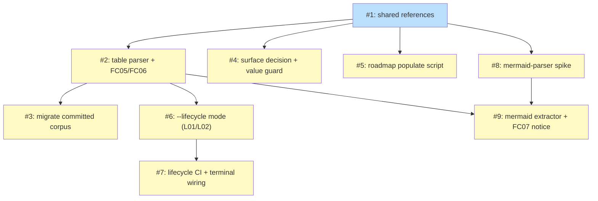

# PLAN: roadmap-plan-standardization

## Status

Draft

This plan is in the pre-approval state: the full decomposition is captured below with
`<<ISSUE:N>>` placeholders, but no GitHub milestone or issues have been created yet.
Issue creation is a separate, human-authorized step (the R14 approval gate this feature
itself designs). The plan transitions to Active when the issues are created.

## Scope Summary

Standardize shirabe's own `/roadmap` and `/plan` skills around shared, define-once
conventions: three plugin-root shared references, a Markdown-table parser plus two
error-level content checks in `internal/validate`, a migrated committed corpus, the
single-pr/multi-pr decision surfaced with a value-confirmation guard, a native
roadmap-to-issues script, and a whole-tree lifecycle CI gate -- with table-diagram
reconciliation staged behind a mermaid-parser spike as a later increment.

## Decomposition Strategy

**Horizontal.** The design describes loosely-coupled capability slices with stable,
already-existing interfaces (the `Doc` IR, `create-issues-batch.sh`, the `IsNotice`
gate) and one explicit prerequisite chain -- the table parser before reconciliation, and
the mermaid-parser spike before reconciliation. There is no thin end-to-end thread to
thicken, so this is horizontal decomposition, not a walking skeleton: each issue builds
one capability fully, and the single hard ordering constraint (spike before
reconciliation) is captured as dependency edges rather than a skeleton.

The nine issues group into five value-delivering PR slices, each landing observable
incremental value on its own (the usable-value principle this work surfaces):

- **Slice A (Issues 1, 2, 3)** -- table validation + corpus migration, one PR. References +
  parser + FC05/FC06 going error-level + the corpus migrated to pass them, bundled so the
  checks never redden CI on a divergent committed doc in a gap window.
- **Slice B (Issue 4)** -- the single-pr/multi-pr decision surfaced on the plan skill, anchored
  on value, with a value-confirmation guard that can fail.
- **Slice C (Issue 5)** -- a native roadmap-to-issues script, retiring the plan re-entry's prose
  string surgery.
- **Slice D (Issues 6, 7)** -- the whole-tree `--lifecycle` mode plus the CI gate and the
  verify-then-delete terminal wiring.
- **Slice E (Issues 8, 9)** -- the mermaid-parser spike, then the reconciliation check as a
  notice. Hard-gated: reconciliation cannot start until the spike resolves.

The work-slicing (decomposition-strategy) decision above is named as separate from the
single-pr/multi-pr execution-mode decision, which is recorded with the issues: multi-pr,
on the incremental-value rationale, with the spike-to-reconciliation merge gate as a
second independent justification.

## Implementation Issues

### Milestone: roadmap-plan-standardization

| Issue | Dependencies | Complexity |
|-------|--------------|------------|
| <<ISSUE:1>>: docs(references): add shared workflow-principles, issues-table, and dependency-diagram references | None | simple |
| _Creates the three plugin-root shared references and trims the two skill references to cite them; finalizes the five-principle wording. The foundation every other slice consumes -- the validator is the enforcement twin of these references._ | | |
| <<ISSUE:2>>: feat(validate): add Markdown issues-table parser and FC05/FC06 content checks | <<ISSUE:1>> | testable |
| _Adds `table.go` (`parseIssuesTable` + `Table`) and the error-level `checkFC05` (schema) and `checkFC06` (cross-reference), wired into the Plan arm and a new Roadmap arm. The one new parser the first pass allows; its `Table` is what the later reconciliation check reuses._ | | |
| <<ISSUE:3>>: docs(corpus): migrate committed roadmap and plan tables to the canonical profiles | <<ISSUE:2>> | testable |
| _Migrates the divergent committed roadmap and legacy plan tables onto the canonical profiles so error-level FC05/FC06 pass on the whole corpus. Lands in the same PR as <<ISSUE:2>> so the checks never see an unmigrated corpus._ | | |
| <<ISSUE:4>>: docs(plan): surface the single-pr/multi-pr decision and add the value-confirmation guard | <<ISSUE:1>> | testable |
| _Lifts the single-pr/multi-pr rule onto the plan SKILL surface anchored on the usable-value principle, de-conflated from work-slicing, and adds a value-confirmation step that can fail and records-and-proceeds under `--auto`. Shares the record-and-proceed gate shape with <<ISSUE:5>>'s approval gate._ | | |
| <<ISSUE:5>>: feat(roadmap): add native populate-issues-table script reusing create-issues-batch | <<ISSUE:1>> | testable |
| _Adds `populate-issues-table.sh` that builds a per-feature manifest, reuses the generic `create-issues-batch.sh`, and writes the reserved sections by structural replacement, with issue creation routed through the R14 approval gate. Retires the plan re-entry's prose string surgery for the roadmap case._ | | |
| <<ISSUE:6>>: feat(validate): add whole-tree --lifecycle mode with L01 and L02 checks | <<ISSUE:2>> | testable |
| _Adds a `--lifecycle <root>` mode that walks the doc tree and runs Check A (L01: a present roadmap or multi-pr plan must be Active) and Check B (L02: no single-pr plan may exist), reusing the Doc IR and frontmatter parsing <<ISSUE:2>> exercises._ | | |
| <<ISSUE:7>>: ci(lifecycle): add reusable lifecycle workflow and wire the verify-then-delete terminal | <<ISSUE:6>> | testable |
| _Adds the reusable lifecycle workflow plus self-caller (no `paths:` filter, read-only) running the `--lifecycle` mode on every PR, wires the verify-then-delete terminal into the cascade, and removes the stale move-to-done wording. Completes the lifecycle enforcement Slice D began._ | | |
| <<ISSUE:8>>: docs(spike): mermaid-parser feasibility spike for table-diagram reconciliation | <<ISSUE:1>> | simple |
| _Writes the spike investigating the mermaid graph subset the corpus uses, a line-oriented extraction approach with no external dependency, and the reconciliation strictness. The explicit upstream that gates the reconciliation increment._ | | |
| <<ISSUE:9>>: feat(validate): add mermaid extractor and checkFC07 table-diagram reconciliation as a notice | <<ISSUE:2>>, <<ISSUE:8>> | testable |
| _Adds `mermaid.go` and `checkFC07` reconciling the parsed `Table` against the extracted diagram, shipped as a notice via `IsNotice` so an unreconciled committed diagram does not redden CI, with a one-line path to error-level promotion after corpus reconciliation. The final, spike-gated increment._ | | |

## Dependency Graph

**Legend**: Green = done, Blue = ready, Yellow = blocked, Purple = needs-design, Orange = tracks-design/tracks-plan

## Implementation Sequence

**Critical path**: <<ISSUE:1>> -> <<ISSUE:8>> -> <<ISSUE:9>> (length 3). The reconciliation
increment is the longest chain because it is hard-gated behind the references, the table
parser (<<ISSUE:2>>), and the spike (<<ISSUE:8>>) -- the single genuine hard sequencing
constraint the design names. The <<ISSUE:1>> -> <<ISSUE:2>> -> <<ISSUE:9>> path is also
length 3; <<ISSUE:9>> waits on the later of {<<ISSUE:2>>, <<ISSUE:8>>}.

**Immediate start**: <<ISSUE:1>> (the only no-dependency issue; the foundation).

**Parallelization**:
- After <<ISSUE:1>>: <<ISSUE:2>>, <<ISSUE:4>>, <<ISSUE:5>>, and <<ISSUE:8>> can proceed in
  parallel (the four direct children of the references).
- After <<ISSUE:2>>: <<ISSUE:3>> (bundled into Slice A's PR) and <<ISSUE:6>> can proceed in
  parallel.
- After <<ISSUE:6>>: <<ISSUE:7>>.
- After <<ISSUE:2>> and <<ISSUE:8>>: <<ISSUE:9>>.

**Recommended PR order**: Slice A (<<ISSUE:1>>, <<ISSUE:2>>, <<ISSUE:3>>) first, since it is
the foundation and lands repo-wide error-level table validation. Once Slice A merges,
Slices B (<<ISSUE:4>>), C (<<ISSUE:5>>), D (<<ISSUE:6>>, <<ISSUE:7>>), and the Slice E spike
(<<ISSUE:8>>) can proceed in parallel; the reconciliation increment (<<ISSUE:9>>) lands last,
after the spike resolves.
