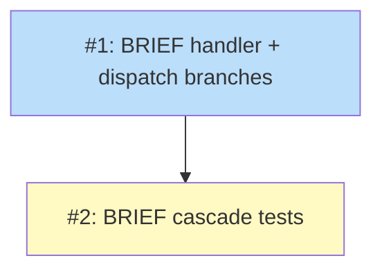

# PLAN: scope-completion-cascade

## Status

Active

Draft plan, ready for `/work-on`. The PLAN transitions to Active when
implementation starts and to Done when the single PR merges.

## Scope Summary

Add a `BRIEF-*` handler to `skills/work-on/scripts/run-cascade.sh` so the
completion cascade transitions a BRIEF to Done and keeps walking its upstream
chain, plus a paired test in `run-cascade_test.sh` that covers a BRIEF with and
without an upstream ROADMAP.

## Decomposition Strategy

**Horizontal, two issues, one PR.** The change is small and additive: one new
handler plus a branch in each of the two existing case statements, then the
test that exercises it. The work splits cleanly into a code change and its test.

Issue 1 adds `handle_brief` and the two `BRIEF-*` branches (main dispatch and
validation-error) to `run-cascade.sh`. Issue 2 adds the `write_brief` fixture
helper, the stub's `BRIEF-*` case, and two BRIEF scenarios to
`run-cascade_test.sh`. Issue 2 depends on Issue 1 because the test asserts
behavior the handler introduces.

The sequence keeps the tree and the existing test suite green at each step:
Issue 1 is purely additive, so every existing scenario still passes after it;
Issue 2 only adds new scenarios and a new fixture helper, touching no existing
test. This is a single-pr change — `/work-on` lands both issues on one branch.

## Issue Outlines

### Issue 1: feat(work-on): add BRIEF handler and dispatch branches to run-cascade.sh

**Goal**: Transition a BRIEF node to Done during the cascade walk and continue
up its upstream chain instead of failing on an unrecognized prefix.

**Acceptance Criteria**:
- [ ] A `handle_brief(path, found_in)` helper sits beside `handle_prd`, mirroring
      its shape: logs `Transitioning BRIEF: <path> → Done`, runs
      `"$SHIRABE_BIN" transition "$path" Done`, sets `ANY_FAILED=true` and
      records a `failed` `transition_brief` step with the first error line on
      non-zero exit, otherwise `git add "$path"`, appends to `STAGED_FILES`, and
      records an `ok` `transition_brief` step.
- [ ] The handler carries no move-path state (a BRIEF never moves directories).
- [ ] The main dispatch case gains a `BRIEF-*)` branch after `PRD-*)` that calls
      `handle_brief "$next_path" "$found_in" || true`, sets
      `current_doc="$next_path"`, and does not `break`, so the loop reads the
      BRIEF's `upstream` and continues.
- [ ] The validation-error case gains a `BRIEF-*)` branch setting
      `artifact_type="BRIEF"` and `target_status="Done"`, plus a matching
      `BRIEF-*)` entry in that block's `add_step` switch recording
      `transition_brief`.
- [ ] No existing handler or case branch is altered; DESIGN, PRD, ROADMAP,
      VISION, and PLAN-deletion behavior is byte-for-byte unchanged.

**Dependencies**: None

**Type**: code
**Files**: `skills/work-on/scripts/run-cascade.sh`

### Issue 2: test(work-on): cover BRIEF cascade with and without upstream

**Goal**: Add a fixture helper, a stub branch, and two scenarios that prove the
BRIEF handler transitions the node and the walk continues or ends cleanly.

**Acceptance Criteria**:
- [ ] A `write_brief` helper writes a BRIEF fixture with `status: Draft` and an
      optional `upstream` argument: when given it writes an `upstream:` line,
      when empty it omits the field, matching the optional real-format field.
- [ ] The `shirabe` stub gains a `BRIEF-*)` case parallel to `PRD-*)` that
      rewrites status in place and emits the base result shape
      (`{success, doc_path, old_status, new_status}`, no `new_path`).
- [ ] A scenario for a chain through a BRIEF with an upstream ROADMAP asserts the
      `transition_brief` step exists with status `"ok"` and that the walk reaches
      the ROADMAP (the roadmap-update step is present).
- [ ] A scenario for a chain through a BRIEF with no upstream asserts the
      `transition_brief` step exists with status `"ok"`, no catchall failure
      occurs, and `cascade_status` is `completed`.
- [ ] Existing scenarios are unchanged and still pass.

**Dependencies**: Blocked by <<ISSUE:1>>

**Type**: code
**Files**: `skills/work-on/scripts/run-cascade_test.sh`

## Implementation Issues

_Single-pr mode: no GitHub issues are created. The table below records the local
decomposition; issue links use document-local anchors. Issue content lives in
the Issue Outlines section above._

| Issue | Dependencies | Complexity |
|-------|--------------|------------|
| [#1: feat(work-on): add BRIEF handler and dispatch branches](#issue-1-featwork-on-add-brief-handler-and-dispatch-branches-to-run-cascadesh) | None | testable |
| _Add `handle_brief` plus the two `BRIEF-*` case branches to `run-cascade.sh`; purely additive._ | | |
| [#2: test(work-on): cover BRIEF cascade with and without upstream](#issue-2-testwork-on-cover-brief-cascade-with-and-without-upstream) | [#1](#issue-1-featwork-on-add-brief-handler-and-dispatch-branches-to-run-cascadesh) | testable |
| _Add the `write_brief` fixture, the stub `BRIEF-*` case, and two scenarios to `run-cascade_test.sh`._ | | |

## Dependency Graph

**Legend**: Blue = ready to implement, Yellow = blocked on a prerequisite,
Green = done.

## Implementation Sequence

Two issues on the critical path, no parallelism. Issue 1 lands the handler and
both case branches; it is additive, so the existing test suite stays green.
Issue 2 then adds the fixture helper, the stub branch, and the two BRIEF
scenarios that assert the new behavior. Both land in a single PR.

Sequencing matters for a clean tree at each step: Issue 1 introduces the code
the tests need, and Issue 2 only adds new test scenarios, so the suite passes
after each issue rather than only at the end.
