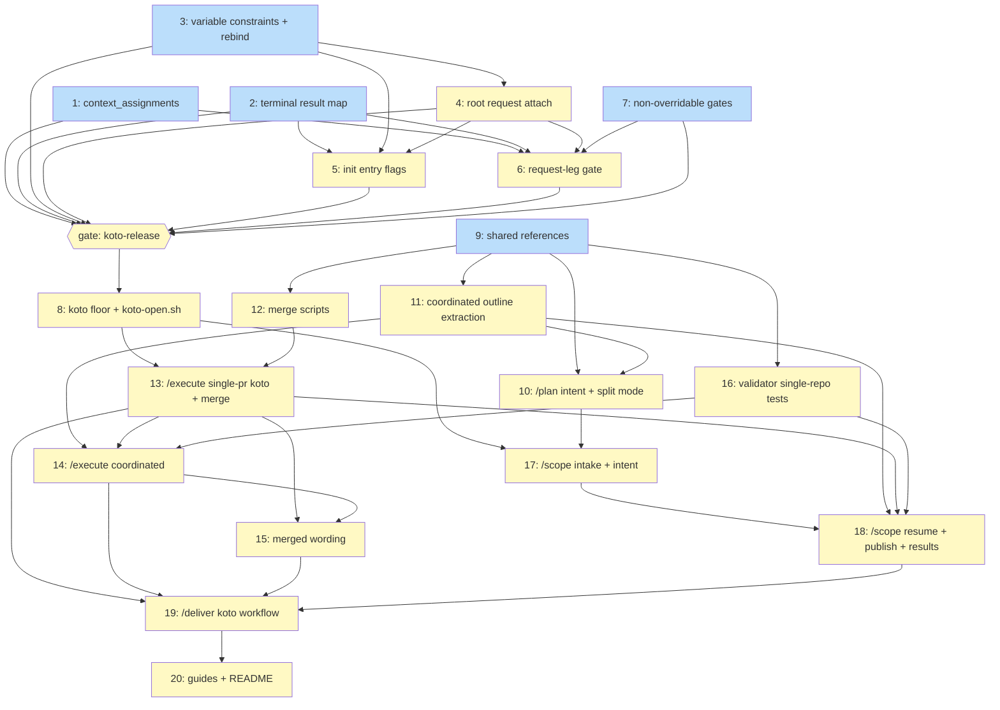

# PLAN: scope-then-execute

## Status

Active

Revision 2. This PLAN replaces the earlier single-pr revision after the
design moved `/deliver` and the children's outcomes into koto workflows. It is
a coordinated PLAN across `tsukumogami/koto` and `tsukumogami/shirabe`,
authored outline-shaped at `tracking_level: none`: no GitHub issues are filed,
and every work item below names its repository and PR group. Authored at
Active because activation creates no GitHub artifacts.

## Scope Summary

This PLAN implements `docs/designs/DESIGN-scope-then-execute.md`. A caller
declares intent when launching the tactical chain, and every run under that
intent ends in a named, koto-recorded state. koto gains seven features
(transition context assignments, terminal result maps, variable constraints
and rebind, root attach to request legs, init entry flags, a request-leg gate,
and non-overridable gates) and ships them in a release. shirabe then raises
its koto floor; `/plan` gains intent and coordination flags, resolves the
split mode with a deterministic script, and emits issue-free coordinated
PLANs; coordinated mode works inside one repository, per PR node;
`/execute --merge` merges only what the repository's own rules allow, with
results recorded in koto; `/scope` validates arguments and routes resume in
its template and reports every outcome as a result; and `/deliver`, a koto
workflow, runs `/scope --intent=continue` and `/execute` as leg-attached
children. Plain `/scope`, `/plan`, and `/execute` runs keep today's artifacts
and behavior apart from the koto floor and corrected wording.

## Decomposition Strategy

Horizontal across two repositories, one PR group per repository (the
coarsest legal grouping): `tsukumogami/koto` group `runtime` holds Issues
1-7; `tsukumogami/shirabe` group `default` holds Issues 8-20. The
`koto-release` gate sits between them, before shirabe's koto floor (Issue
8). Shirabe items that use no new koto feature (Issues 9, 10, 11, 12, 16)
have no path through the gate and can be built in parallel with the koto
work, though they land in the same shirabe PR. Each issue ships its own eval
or test scenarios naming the PRD requirement IDs it covers.

Grouping rules: one issue per koto feature; in shirabe, one issue per skill
surface or script pair, split where a DESIGN phase held independent
deliverables (`/plan` flags vs extraction, merge scripts vs koto wiring,
`/scope` intake vs resume and publish, single-pr vs coordinated `/execute`).

## Issue Outlines

### Issue 1: feat(template): apply context_assignments on transitions

**Repo**: tsukumogami/koto

**Group**: runtime

**Goal**: Make transition-level `context_assignments` (koto#204) compile and run: literals, `{{VAR}}`, `${evidence.<field>}` and `${gates.<g>.<path>}` values are written to the session's context atomically with the transition that carries them, and any unknown key on a transition fails compilation instead of being dropped.

**Context**: (Solution Architecture > koto changes, K2; Implementation Approach > Phase 1, item KA; Decision 6).

Today `SourceTransition` in `src/template/compile.rs` is an `#[serde(untagged)]` enum whose only variant deserializes `target` and `when`, so every other key on a transition is dropped silently. `Transition` in `src/template/types.rs` carries only `target` and `when`. shirabe's templates already declare 58 `context_assignments:` blocks (38 in `work-on.md`, 10 each in `scope.md` and `execute.md`), including every `failure_reason` write that koto's own batch view reads for failed children. None of them run.

shirabe's scope-then-execute work needs them to run. Every edge into a terminal assigns `outcome`, and assigns `step` and `reason` where the edge fixes them as literals; the terminal `result:` map (Issue 2) reads them back as `${context.<key>}`. A `step` or `reason` that comes from a script's output isn't assigned on the edge (an assignment can't read `${context.<key>}`); the script's default action writes it with `koto context add` and the result map reads it the same way. `/deliver` copies a leg's payload fields into context with `${gates.scope_leg.payload.pr}`-style paths. The design requires the path syntax to be generic over any gate's output so the `request-leg` gate needs no special support.

Relevant koto code:

- `src/template/compile.rs`: `SourceTransition`, `SourceState` (already `deny_unknown_fields`), and the transition transform in `compile()`.
- `src/template/types.rs`: `Transition`, `CompiledTemplate::validate`, and the W5 warning (the `TODO(issue-8/W5)` comment names `context_assignments` as the missing credit path).
- `src/engine/advance.rs`: the three places a `Transitioned` event is appended (the `skip_if` path, the `resolve_transition` path, and the evidence path) and the `evidence_value` map that already nests gate output under `gates`.
- `src/engine/types.rs`: `EventPayload::Transitioned` (additive fields use `skip_serializing_if` so older logs round-trip).
- `src/session/context.rs`: the `ContextStore` trait the context gates and `koto context get` read from.
- `src/engine/substitute.rs`: `Variables` and `VariableOverlay` for `{{VAR}}` resolution.

Resolved semantics this issue pins (the design leaves them implicit):

- A `${evidence.<field>}` reference whose field is declared but wasn't submitted, or a `${gates.<g>.<path>}` whose path doesn't exist in that tick's gate output, resolves to the empty string. The transition still happens.
- Resolved values are written literally. A value that itself contains `{{X}}` or `${context.y}` is not expanded a second time.

**Acceptance Criteria**:

Compile-time:

- [ ] `SourceTransition` rejects unknown keys: a template with `transitions: [{target: done, context_assignment: {a: b}}]` (typo) fails `koto template compile` with an error naming the state, the target and the unknown field. The same template compiled on the base commit succeeds, and a unit test in `src/template/compile.rs` pins the failure.
- [ ] A transition may declare `context_assignments:` as a map of context key to string. Each key must pass `crate::session::validate::unusable_context_key_reason`; a key that fails (for example one containing a space) fails compilation with that reason in the message.
- [ ] A mapping or sequence as an assignment value fails compilation.
- [ ] `${evidence.<field>}` must name a field declared in the source state's `accepts` block. A reference to an undeclared field fails compilation naming the state, the transition target and the field, including on a state with no `accepts` block at all.
- [ ] `${gates.<g>.<path>}` must name a gate declared on the source state. A reference to an undeclared gate fails compilation, using the same message shape as the existing when-clause check for undeclared gates.
- [ ] `{{VAR}}` inside an assignment value must name a declared variable. An undeclared one fails compilation with the existing "is not declared in the template's variables block" wording.
- [ ] Any other `${...}` namespace inside an assignment value (for example `${context.x}` or `${foo.bar}`) fails compilation.
- [ ] `Transition` in `src/template/types.rs` gains a `context_assignments` field that is omitted from the compiled JSON when empty, so the compiled output of a template without assignments is byte-identical to the base commit's.
- [ ] All three shirabe templates (`skills/work-on/koto-templates/work-on.md`, `skills/scope/koto-templates/scope.md`, `skills/execute/koto-templates/execute.md`, at the shirabe commit named in the PR) compile under the new rules, or the PR description lists each block that fails and why. The list is an input to Issue 8.

Runtime:

- [ ] On every path that appends a `Transitioned` event (skip_if, gate-resolved auto-advance, evidence-resolved), the transition's assignments are resolved and written, and `koto context get <session> <key>` returns the resolved value afterwards. An integration test under `tests/` covers each of the three paths.
- [ ] A literal value is written as-is. `{{VAR}}` resolves through the session's variables, including one captured earlier in the same tick through `VariableOverlay`.
- [ ] `${evidence.<field>}` resolves to the value submitted in the evidence that drove the transition. A reference embedded in a string literal (`"blocked: ${evidence.detail}"`, the form shirabe's `execute.md` uses) resolves inside the literal.
- [ ] `${gates.<g>.<path>}` resolves a dot path into the gate's structured output for that tick (for example `${gates.ci.exit_code}` on a command gate). A unit test over a synthetic nested output (`{"payload": {"pr": "x"}}`) resolves `${gates.g.payload.pr}` to `x`, so the `request-leg` gate in Issue 6 needs no assignment-side changes.
- [ ] An optional evidence field that wasn't submitted and a gate path absent from the output both resolve to the empty string, and the transition still happens. Each case has a test.
- [ ] A resolved value containing `{{X}}` or `${context.y}` is stored literally; a test submits evidence `detail: "{{TOPIC}}"` and asserts the stored value is the literal string `{{TOPIC}}`.
- [ ] The `Transitioned` event carries the resolved assignments as an additive field, omitted when empty. A log written by the base commit still deserializes, and a new log's event round-trips through `src/engine/types.rs`'s serde tests.
- [ ] Atomicity: assignments land in the same event append as the transition. If the context-store write fails after that append, the next read (`koto context get`, or a context gate on the next tick) returns the assigned value. A test forces the store write to fail after the event append and asserts the value is readable afterwards.
- [ ] A transition that doesn't fire writes nothing. On a state with two guarded edges, only the taken edge's assignments are present afterwards.
- [ ] A later assignment to the same key replaces the earlier value, matching `koto context add` semantics.

Lint and docs:

- [ ] W5 no longer warns for a `failure: true` terminal when every transition into it assigns `failure_reason`. It still warns when at least one incoming edge doesn't. The `TODO(issue-8/W5)` comment is resolved for the assignment path, and unit tests pin both cases.
- [ ] `docs/guides/custom-skill-authoring.md` documents `context_assignments`: the four value forms, the compile-time rules, the empty-string rule for absent evidence or gate paths, and that values aren't re-expanded.
- [ ] `cargo test` and `cargo clippy --all-targets` pass.

Downstream deliverables:

- [ ] Must deliver: assignments that write `outcome` (and literal `step` and `reason`) on edges into terminals, readable as `${context.<key>}` by the result map (required by Issue 2's consumers Issue 13, Issue 14, Issue 18, Issue 19).
- [ ] Must deliver: `${gates.<g>.<path>}` resolution over arbitrary nested gate output, so `/deliver` can copy `${gates.scope_leg.payload.<k>}` and `${gates.exec_leg.payload.<k>}` into context once the leg gate exists (required by Issue 6 and Issue 19).
- [ ] Must deliver: strict compile validation plus the list of shirabe assignment blocks that fail it, so the template sweep knows what to fix (required by Issue 8).
- [ ] Must deliver: the feature in the koto release the `koto-release` gate waits on (required by Issue 8 through the gate).

**Dependencies**: None

**Type**: code

**Complexity**: critical

### Issue 2: feat(template): declare a result map on terminal states

**Repo**: tsukumogami/koto

**Group**: runtime

**Goal**: Let a terminal state declare a `result:` map (at most 32 keys; values are literals, `{{VAR}}` or `${context.<key>}`) that koto resolves into the existing `WorkflowResult.payload` and carries on every path a result already takes: the child's `request_store.result` event, leg promotion, the parent's `ChildCompleted`, the terminal `koto next` response, and `koto status` for a retained terminal session.

**Context**: (Solution Architecture > koto changes, K1; Key Interfaces > Terminal results; Implementation Approach > Phase 1, item KB; PRD R31).

A workflow result today is `WorkflowResult { status, summary, payload }` (`src/engine/types.rs`). `synthesize_workflow_result` in `src/cli/mod.rs` builds `payload` from the latest `EvidenceSubmitted` fields on the terminal state, and `finish_terminal_tick` hands that one envelope to the child-log append, `promote_leg_result`, and `append_child_completed_to_parent`. A terminal can't say what its outcome was. So shirabe's printed exit lines are composed by the agent, and `/deliver` has nothing structured to route on.

With this issue, a terminal can declare, for example:

```yaml
done_error:
  terminal: true
  failure: true
  result:
    outcome: error
    step: "${context.step}"
    pr: "${context.home_pr}"
    topic: "{{TOPIC}}"
```

The `${context.<key>}` values are typically written by transition `context_assignments` (Issue 1), but this issue doesn't depend on that: the context store can be filled with `koto context add` in tests.

Two things aren't possible today. The `Terminal` variant of `NextResponse` in `src/cli/next_types.rs` carries no result. `handle_status` in `src/cli/mod.rs` reports `is_terminal` but no result. And under `--no-cleanup` with no leg pointer, `finish_terminal_tick` returns before synthesizing anything, deliberately, so a parked terminal ticked repeatedly doesn't append unbounded events.

Resolved semantics this issue pins (the design says "listed in `missing`" without naming the location):

- Unresolved keys go in a `missing` array inside `payload`, present only when non-empty. `missing` is reserved: a template that declares a result key named `missing` fails compilation, so the 32-key limit counts only declared keys.
- The map is resolved once, on the first terminal tick, and every later read returns that recorded value. A `koto context add` after the terminal doesn't change the result.

**Acceptance Criteria**:

Compile-time (`src/template/compile.rs`, `src/template/types.rs`):

- [ ] `SourceState` and `TemplateState` gain an optional `result` map. It's omitted from compiled JSON when absent, so a template without it compiles byte-identically to the base commit.
- [ ] `result:` on a non-terminal state fails compilation naming the state.
- [ ] A map with 32 keys compiles. A map with 33 keys fails compilation with a message naming the state, the count and the limit (32). Unit tests pin both sides of the boundary.
- [ ] A key that fails `crate::session::validate::unusable_context_key_reason`, or the reserved key `missing`, fails compilation.
- [ ] Values must be strings. A mapping or sequence value fails compilation.
- [ ] An undeclared `{{VAR}}` in a value fails compilation with the existing "is not declared in the template's variables block" wording.
- [ ] `${context.<key>}` with a key that fails the context-key grammar fails compilation. Any other `${...}` namespace (`${evidence.x}`, `${gates.g.x}`) fails compilation, because only literals, `{{VAR}}` and `${context.<key>}` are allowed here.

Runtime:

- [ ] With a declared map, `payload` is exactly the resolved map (plus `missing` when non-empty). Terminal evidence fields aren't merged in. `status` is still projected from `failure`/`skipped_marker`, and `summary` keeps today's derivation.
- [ ] Without a declared map, `synthesize_workflow_result` behaves exactly as today. The existing `synthesize_workflow_result_*` unit tests pass unchanged.
- [ ] Literals are copied as-is. `{{VAR}}` resolves through the session's variables. `${context.<key>}` resolves to the context content for that key read as UTF-8, and references may sit inside a string literal (`"merge-state:${context.state}"`).
- [ ] Missing context key: `${context.absent}` resolves to the empty string and the result key is listed in `payload.missing`. Context content that isn't valid UTF-8 is treated the same way. A test covers each case and asserts the terminal tick still succeeds (exit 0).
- [ ] A resolved value containing `{{X}}` or `${context.y}` is copied literally and not expanded again (test: context content `{{TOPIC}}` comes through unchanged).
- [ ] The same resolved payload appears in all five carriers, and an integration test under `tests/` asserts each one against a single template: the child's `request_store.result` event; the leg's result after promotion (a session bound to a leg with the existing dispatch-child attach in `tests/request_cli.rs`'s harness); the parent's `ChildCompleted.result` for a `--parent` child; the `koto next` response on reaching the terminal; and `koto status` on the retained session.
- [ ] Both terminal write sites (the advance-loop path and `koto next --to <terminal>`) produce the declared payload. There's a test for each.
- [ ] `NextResponse::Terminal` gains a `result` field carrying the `WorkflowResult`. `tests/next_response_baseline.rs` fixtures are updated for the new field and no other response variant changes.
- [ ] `koto status` on a terminal session prints the recorded result under a `result` key. A non-terminal session's status output doesn't change.
- [ ] Under `--no-cleanup` with no leg pointer, the first terminal tick records the resolved result once. Ticking the parked terminal three more times appends no further result, `ChildCompleted` or terminal-index events (count the events in the state log), and `koto status` still returns the recorded result. The existing tests asserting that a parked terminal child emits no parent event pass unchanged.
- [ ] A `koto context add` on the key after the terminal tick doesn't change what `koto status` or a later leg read returns.

Docs and tests:

- [ ] `docs/guides/custom-skill-authoring.md` documents `result:`: the three value forms, the 32-key limit, the reserved `missing` key and how unresolved keys are reported, that the map replaces the evidence-derived payload, and where the result appears (`koto next`, `koto status`, request legs, `ChildCompleted`).
- [ ] `cargo test` and `cargo clippy --all-targets` pass.

Downstream deliverables:

- [ ] Must deliver: a public way to build a `WorkflowResult` whose `payload` is a flat JSON object of string values, so `koto init --koto-leg` can record the refusal payload `{outcome: refused, reason, var, recorded, requested}` on the leg with `source: refused` (required by Issue 5).
- [ ] Must deliver: a promoted leg result whose `payload` is a flat object keyed by the declared names, so the `request-leg` gate can expose `outcome`, `step`, `reason` and `payload` and apply `expect: {key: [values]}` without knowing the template (required by Issue 6).
- [ ] Must deliver: result maps with 32 keys working end to end. `/scope`'s terminals declare up to 16 keys and `/deliver`'s about 11 (required by Issue 18, Issue 19).
- [ ] Must deliver: the result on `koto next`'s terminal response and on `koto status`, which is what `print-scope-exit.sh`, `/execute`'s `print-exit.sh` and `deliver-report.sh` render from (required by Issue 13, Issue 14, Issue 18, Issue 19).
- [ ] Must deliver: the feature in the koto release the `koto-release` gate waits on (required by Issue 8 through the gate).

**Dependencies**: None

**Type**: code

**Complexity**: testable

### Issue 3: feat(template): constrain and rebind template variables

**Repo**: tsukumogami/koto

**Group**: runtime

**Goal**: Let koto template variables declare `values:`, `pattern:`, and `rebind: true`, enforce the constraints at compile time and at `koto init` with typed errors, and add the engine primitive that rebinds `rebind: true` variables on a non-terminal session as a recorded event, with no standalone rebind verb.

**Context**: (Solution Architecture > koto changes, K3; Implementation Approach > Phase 1, item KC; Security Considerations > "Inputs from GitHub and from files are data" and "Merge intent is per invocation").
PRD: `docs/prds/PRD-scope-then-execute.md` (R1, R17, R31, R32).

shirabe wants `/scope`'s and `/execute`'s argument checks to be koto refusals rather than skill prose: an invalid or repeated `--intent` must fail at `koto init` with exit 2 and no session (R1), and the topic, `--upstream`, `PLUGIN_ROOT`, and `--max-rounds` patterns must hold before any gate command sees a value. It also needs per-invocation settings (`MERGE`, `PAUSE_BEFORE_FINALIZE`, `EXEC_MODE`, `MAX_ROUNDS`, `PLUGIN_ROOT`) to change on a live session that a later invocation picks up, while identity variables (`TOPIC`, `INTENT_FLAG`, `PLAN_DOC`, ...) never change.

Today's koto can't express either:

- `SourceVariable` in `src/template/compile.rs` has only `description`, `required`, and `default`, and it isn't `deny_unknown_fields`, so a `values:` or `pattern:` key written today is silently dropped. `VariableDecl` in `src/template/types.rs` mirrors those three fields.
- `resolve_variables` in `src/cli/mod.rs` refuses a malformed, duplicate, unknown, or missing `--var` and checks each value against the `VALUE_PATTERN` allowlist in `src/engine/substitute.rs`, but its errors are free-text strings that `handle_init` wraps as `{"error": ..., "command": "init"}` at exit 2 (via `VAR_RESOLUTION_MSG_PREFIX`). There is no machine-readable code, and no enum or pattern constraint.
- A session's variables are fixed by the `WorkflowInitialized` event. `bindings_from_events` folds that block plus `VariableCaptured` values, and nothing can change a declared variable afterwards. (`koto session rebind` exists but moves only the execution anchor.)

This issue adds the declaration fields, the enforcement, and the rebind engine primitive. It deliberately adds no CLI surface for rebinding: per K3, a `rebind: true` variable changes only inside an accepted attach, which `koto init --attach-live` wires up in Issue 5. That's what stops a stale driver from flipping `MERGE` on a session another run owns.

**Acceptance Criteria**:

*Declaration and compile-time validation*

- [ ] `SourceVariable` and `VariableDecl` gain `values` (list of strings), `pattern` (string), and `rebind` (bool, default false). The compiled fields use `skip_serializing_if` so a template that declares none of them compiles to byte-identical JSON as before this change (a compile-output snapshot test over an existing fixture proves it), which keeps existing sessions' template hashes valid.
- [ ] `SourceVariable` rejects unknown keys (`deny_unknown_fields`): a template declaring `variables: {X: {valuez: [a]}}` fails `koto template compile` with a non-zero exit and an error naming the variable and the unknown key.
- [ ] A variable may declare at most one of `values:` and `pattern:`; declaring both is a compile error naming the variable.
- [ ] `values:` must be non-empty, and every entry must pass `VALUE_PATTERN`; an empty list or an entry such as `a;b` is a compile error naming the variable and the entry.
- [ ] `pattern:` must compile with the `regex` crate; an invalid expression (for example `[a-`) is a compile error naming the variable. koto matches it against the whole value (it applies the pattern as `^(?:<pattern>)$`), so `pattern: "[a-z]+"` rejects `abc-1` even without author-written anchors.
- [ ] A non-empty `default` must satisfy the variable's constraint: `default: maybe` with `values: [yes, no]` is a compile error naming the variable, the default, and the constraint.
- [ ] An optional variable with no default whose constraint rejects the empty string (for example `values: [yes, no]`, not required, no default) is a compile error, because `resolve_variables` would otherwise materialize an empty binding the constraint forbids. With `pattern: "([1-9]|[1-4][0-9]|50)?"` and no default it compiles.
- [ ] `rebind` accepts only a YAML boolean; `rebind: "yes"` is a compile error.
- [ ] The existing compile check that a `capture_stdout_as` name can't collide with a declared variable still holds, so a default action can't write a declared (including `rebind: true`) variable.

*Enforcement at `koto init`*

- [ ] `resolve_variables` checks each resolved value (explicit `--var`, default, or materialized empty) against the declaration's `values:` or `pattern:` in addition to `VALUE_PATTERN`. `koto init s --template t.md --var INTENT_FLAG=maybe` against `pattern: ^(continue|stop)?$` exits 2, prints no session, and leaves no session directory or state file under the test's `HOME`.
- [ ] Variable refusals carry a typed code in the init error body alongside today's `error` and `command` fields:
  - `invalid_var` for a value that fails its constraint or the allowlist, with `var`, `value`, and `constraint` (`values:[...]`, `pattern:<re>`, or `allowlist`);
  - `duplicate_var` for a repeated key, with `var`;
  - `unknown_var` for an undeclared key, with `var`.

  Exit code stays 2 for all three. The existing `error` message text for duplicate and unknown keys is unchanged, so callers that match today's wording keep working.
- [ ] A value that satisfies its constraint is accepted: `--var INTENT_FLAG=continue` initializes the session, and `koto status` (or the `WorkflowInitialized` event) shows `INTENT_FLAG=continue`.
- [ ] A constrained variable that isn't passed resolves to its default and the session initializes (for example `INTENT_FLAG`, declared with `pattern: ^(continue|stop)?$`, defaults to empty).
- [ ] The same constraint checks apply on the batch child spawn path (`init_child.rs`, which also calls `resolve_variables`): a `materialize_children` task whose `vars` violate a child template's `values:` fails with a spawn error whose message names the variable, and no child session is created.
- [ ] `docs/reference/error-codes.md` documents the three codes under `init`.

*Rebind engine primitive*

- [ ] A new additive event, wire type `variables_rebound`, carries the map of variables it changes. It doesn't bump the state-file schema version; an older koto build reads it as `Unknown` and keeps reading the log. `docs/reference/session-feed.md` documents it next to `variable_captured`.
- [ ] `bindings_from_events` folds `variables_rebound` in event order, so both `Variables::from_events` and the advance loop's `vars.*` view see the rebound value on the next tick. A unit test with `WorkflowInitialized {MERGE: false}` followed by `variables_rebound {MERGE: true}` resolves `MERGE` to `true`; the reverse order of two rebounds resolves to the later value.
- [ ] A library entry point (no CLI) takes the template's declarations, the session's current bindings and state, and one invocation's explicit variable pairs, and runs every check before writing anything. It's split into a side-effect-free validate step and an apply step that appends exactly one `variables_rebound` event, so Issue 5 can run the attach checks between them.
- [ ] The validate step resolves each `rebind: true` variable from the invocation (explicit value, else its declared default) and reports those whose value differs from the current binding. An omitted `rebind: true` variable resets to its default rather than keeping the earlier run's value: a session initialized with `MERGE=true` and validated with no `MERGE` pair yields `MERGE=false` (the "never inherited" rule in Key Interfaces > Merge intent per invocation).
- [ ] The validate step refuses, with a typed error and no event appended:
  - an explicit pair for a non-rebind variable whose value differs from the recorded one, as `var_mismatch` naming the variable, the recorded value, and the requested one (an explicit pair equal to the recorded value is accepted);
  - a value failing its constraint or the allowlist, as `invalid_var`;
  - an undeclared key, as `unknown_var`; a repeated key, as `duplicate_var`;
  - a session whose current state is terminal, as a distinct terminal-session error.
- [ ] Omitted non-rebind variables keep their recorded values and are never reported as a mismatch.
- [ ] When no `rebind: true` value differs, apply appends nothing and the log length is unchanged.
- [ ] A refused validate leaves the log byte-identical (test compares the state file before and after).
- [ ] No CLI subcommand or flag reaches the rebind primitive in this issue: `koto --help` and `koto session --help` list the same verbs as before, and `koto session rebind` still changes only the execution anchor (an existing anchor-rebind test asserts no `variables_rebound` event is appended).

*Tests and docs*

- [ ] Unit tests cover each compile error above in `src/template/compile.rs`'s test module, each `resolve_variables` refusal and acceptance in `src/cli/mod.rs`'s test module, and the fold plus validate/apply cases next to `bindings_from_events` in `src/engine/substitute.rs` (or a new engine module). An `assert_cmd` integration test under `tests/` (using the `HOME`-isolated `koto_cmd` helper) covers the `invalid_var` exit-2, no-session case end to end.
- [ ] `docs/guides/custom-skill-authoring.md` documents `values:`, `pattern:` (whole-value match, `regex` crate syntax, no lookaround), and `rebind: true`, including that rebinding happens only through an accepted `koto init --attach-live`.
- [ ] `cargo test` and `cargo clippy --all-targets -- -D warnings` pass.

*Downstream deliverables*

- [ ] Must deliver: `VariableDecl.rebind` as a public field and `bindings_from_events` returning the post-rebind bindings, so root attach can compare a session's non-rebind variables with a leg's declared inputs (required by Issue 4).
- [ ] Must deliver: the validate/apply rebind entry point with the typed `invalid_var`, `duplicate_var`, `unknown_var`, `var_mismatch`, and terminal-session errors, usable before any write so `--attach-live` and `--koto-leg` can run attach checks first and record a refusal payload `{outcome: refused, reason, var, recorded, requested}` from these fields (required by Issue 5).

**Dependencies**: None

**Type**: code

**Complexity**: testable

### Issue 4: feat(request): attach root sessions to request legs

**Repo**: tsukumogami/koto

**Group**: runtime

**Goal**: Add `koto request attach <req> <leg> --session <s>` so a root session can bind itself to a request leg, gated by template identity, leg-input and pointer checks, with the fenced verbs refused outright on a self-attached leg and the carve-out written into koto's request-lifecycle design (K5).

**Context**: `/deliver` opens one koto request per run with a `scope` leg and an `execute` leg, and `/scope` and `/execute` report to it by attaching their stable, root, `--no-cleanup` sessions (`scope-<topic>`, `execute-<topic>`) to those legs (Decision 4). koto today only lets a dispatched child bind a leg: `bind` in `src/cli/request.rs` refuses any session whose header fails `crate::engine::epoch::fence_applies_to` (`parent_workflow.is_some() && needs_agent == Some(true)`) with `child_not_fenceable`, and never checks the leg's declared `template`. Promotion is already in place for a bound root: `finish_terminal_tick` in `src/cli/mod.rs` reads the leg pointer and calls `promote_leg_result` even under `--no-cleanup`, and a promotion onto an abandoned leg or closed request is refused with a warning. So the missing piece is admission, and admission is the security boundary. A throwaway template that declares `outcome: merged` must not be able to bind the leg, one run must not take over another live run's leg, and a root has no dispatch epoch, so the fence in `fence()` can't protect `progress`, `resolve`, or leg-scoped `abandon` on its leg.

The design's answer (K5, Security Considerations > "Leg attach and refusal are koto's, not the agent's") is: admit roots, check the template the leg names and the session's non-rebind variables against the leg's inputs, re-point a session only away from an abandoned leg or a closed request, record `attach: self` and the template identity on the bind event, and refuse the fenced verbs on a self-attached leg because roots are never redelegated and their results arrive only by promotion. The leg view also gains `result_source: refused`, which Issue Issue 5 writes when an init under `--koto-leg` is refused. This issue serves PRD R30 (outcomes reach `/deliver` as koto results recorded against the current run, and a leftover result is never read as current) and R17 (a re-invoked `/deliver` re-points the topic's live session to its new request).

Grounding in koto: `src/cli/request.rs` (`RequestCommand`, `bind`, `fence`, `progress`, `resolve`, `abandon`, `RequestErrorCode`), `src/engine/request_store/mod.rs` (`bind_leg`, `record_result`, `abandon_leg`), `src/engine/request_store/view.rs` (`LegView`), `src/engine/types.rs` (`LegDeclaration`, `LegResultSource`, `EventPayload::RequestLegBound`), `src/engine/leg_pointer.rs`, and `docs/designs/current/DESIGN-request-lifecycle.md` (Decisions 3 and 6). The rebind/non-rebind distinction comes from Issue Issue 3's `rebind:` field on `VariableDecl`.

**Acceptance Criteria**:

Verb and admission

- [ ] `koto request attach <request-id> <leg> --session <session-id> [--issued-by <id>]` exists, validates the request id, leg name and session id with the same grammar helpers `bind` uses (`request_id`, `session_identifier`), and prints the standard request envelope on success.
- [ ] A root session (header `parent_workflow` is `None`) that passes every check below binds the leg: a `request.leg_bound` event is appended under the request lock and the session's leg pointer is written, exactly as `bind` does today.
- [ ] A dispatched child (a header that satisfies `fence_applies_to`) attached through `attach` behaves as `bind` does today, epoch captured and fenced; `bind`'s existing behavior and tests are unchanged.
- [ ] A session that is neither a root nor a fenceable dispatched child (for example a non-dispatched `--parent` child) is still refused with `child_not_fenceable`, and that message now names the root carve-out.
- [ ] The `request.leg_bound` event for a root records `attach: self` and the session's template identity (the compiled template `name`, the `template_hash` from the state-file header, and the source file name from `WorkflowInitialized.template_path`), as additive serde-optional fields so existing request logs still replay; `koto request get` shows them on the leg.

Template identity

- [ ] A leg declaration's `template` accepts either one string (today's form, still valid) or a short bounded list of strings, and `koto request create` rejects an empty list or one over the bound with `invalid_submission`.
- [ ] Attach succeeds only when the session's template identity matches an entry the leg names; the matching rule (which part of the identity an entry compares against) is stated once in the request-lifecycle amendment and in a doc comment on the comparison.
- [ ] Negative: a session built from a template the leg doesn't name (including a same-shaped throwaway template, and a session created with `--from-stdin`, which has no template file) is refused with a new typed code `template_mismatch` (exit 2), and the request log and the session's leg pointer are byte-for-byte unchanged.

Leg inputs versus non-rebind variables

- [ ] For each key in the leg's `inputs`, the session's template must declare that variable, and when the variable isn't `rebind: true` the session's recorded value must equal the input's value; a mismatch is refused with a new typed code `input_mismatch` naming the key, the recorded value and the leg's value, and nothing is written.
- [ ] Negative: an input key naming a variable the template doesn't declare is refused the same way; a `rebind: true` variable named in `inputs` isn't compared.

Terminal sessions

- [ ] Negative: a session whose current state is terminal (or that was cancelled) is refused with a new typed code `session_terminal` (exit 2), with no event appended and no pointer written.

Pointers, idempotence, and takeover

- [ ] Attaching the same session to the same leg again is a no-op success (`written: false`), with no second `request.leg_bound` event.
- [ ] Negative: a leg already bound to a different session is refused with `leg_bound_to_different_child`, whatever the other session's state.
- [ ] Negative: a session whose current pointer names a different leg is refused with `child_bound_to_different_leg` unless that pointer's leg is abandoned or its request is closed; in those two cases attach binds the new leg and overwrites the pointer.
- [ ] Negative: attach on a closed request or on a resolved or abandoned leg is refused with the existing `request_closed`, `leg_already_resolved` and `leg_abandoned` codes.
- [ ] All admission checks that read the request (leg open, bound child, pointer target's disposition) are re-evaluated inside `append_under_lock`, so an attach racing a concurrent bind or abandon can't slip past a check made on an unlocked read.

Fenced verbs on a self-attached leg

- [ ] Negative: `koto request progress`, `koto request resolve`, and leg-scoped `koto request abandon` on a self-attached leg are refused outright with a new typed code (for example `self_attached_leg`, exit 2) whether or not `--dispatch-epoch` is presented, and the refusal is enforced inside the store's lock as well as in `fence()`, so the request log is unchanged.
- [ ] `koto request abandon-request` and `koto request close` stay available on a request whose legs are self-attached (the design accepts that request-scoped abandon is unfenced).

Promotion and stale runs

- [ ] A self-attached root ticked to a terminal with `--no-cleanup` resolves its leg with `result_source: promoted` carrying the session's `WorkflowResult`, and the session stays on disk; a second terminal tick writes nothing more.
- [ ] Negative: after the leg's request is abandoned, the root's terminal tick doesn't resolve the leg (the existing warn-and-drop path), the leg stays `abandoned`, and the result stays readable from the session's own log.

Refused source for Issue Issue 5

- [ ] `LegResultSource` gains `Refused` (wire value `refused`), and `LegView.result_source` projects it; replay of existing logs is unchanged.
- [ ] The request store exposes a lock-guarded write that resolves a leg with `source: refused` only when the leg is open and unbound, and returns a typed rejection (no write) when the leg is bound, resolved, abandoned, or its request is closed.
- [ ] Negative: `koto request resolve` can't write `source: refused`; only the store function above can.

Contract, docs, and tests

- [ ] `CLI_CONTRACT_MINOR` is bumped for the new verb, the new error codes, and the new leg fields, and every new `RequestErrorCode` lands in the caller-error class (exit 2); `every_code_lands_in_one_of_four_classes_and_avoids_sysexits` is extended to cover them.
- [ ] `docs/designs/current/DESIGN-request-lifecycle.md` gains the root carve-out amendment: roots are never redelegated and their results arrive only by promotion, so the fenced verbs are refused on a self-attached leg rather than fenced at an epoch, plus the template-identity, input and re-point rules.
- [ ] `docs/guides/cli-usage.md` documents `koto request attach`, and `cargo test --test doc_names` passes.
- [ ] Integration tests in `tests/request_cli.rs` (or a new `tests/request_attach.rs` using the same `koto_cmd`/`run_err` helpers and a temp `HOME`/`KOTO_SESSIONS_BASE`) cover every negative case above and assert the request log's bytes are unchanged after each refusal; unit tests in `src/engine/request_store/tests.rs` cover the refused-source write and the locked re-checks.
- [ ] `cargo test`, `cargo clippy`, and `cargo fmt --check` pass.

Downstream deliverables

- [ ] Must deliver: the admission path (root attach with template, input, terminal and pointer checks) as a function Issue Issue 5's `--koto-leg` can call with every check running before any write, plus the lock-guarded refused-source write (required by Issue 5).
- [ ] Must deliver: `attach: self`, the template identity, `bound`, and `result_source` values (`promoted`, `explicit`, `refused`) readable from the leg view so the `request-leg` gate can output `bound`, `source` and `template` (required by Issue 6).
- [ ] Must deliver: legs that accept a list of templates, so `/deliver`'s `execute` leg can name both `execute.md` and `execute-coordinated.md` (required by Issue 19).

**Dependencies**: Issue 3

**Type**: code

**Complexity**: critical

### Issue 5: feat(cli): add koto init entry flags for leg-attached runs

**Repo**: tsukumogami/koto

**Group**: runtime

**Goal**: Add `koto init --vars-file`, `--replace-terminal`, `--attach-live` (with template, origin and variable checks) and `--koto-leg <req>:<leg>`, where every check runs before any write so a refused invocation changes nothing, rebind variables are re-applied only inside an accepted attach, and a refusal under `--koto-leg` is recorded on the leg with `source: refused` (K4).

**Context**: Every koto-backed skill in the chain enters through `koto-open.sh`, which runs `koto init <session> --vars-file <file> [--attach-live] [--replace-terminal] [--koto-leg <req>:<leg>]` and expects exactly four outcomes: a new session, an attached live session, a fresh session replacing a retained terminal one, or a refusal with exit 2 and a typed error (Key Interfaces > koto entry). Today `handle_init` in `src/cli/mod.rs` refuses any existing name with the same "already exists" text (exit 1) whether the session is live or terminal, takes variables only as repeated `--var`, and has no notion of attaching. `/scope`'s retained-terminal bug and its `--intent` refusal (PRD R1: an invalid or repeated value refused before any state file or session exists) both need these flags, and so does per-invocation merge intent: `MERGE` is `rebind: true` and must be re-applied from each invocation's own flags (R17), but only inside an attach koto accepted.

The security rules this issue carries (Security Considerations > "Leg attach and refusal are koto's", "Two drivers on one topic", and Key Interfaces > "Merge intent per invocation"): attach, leg attach and rebind are one step, and every check, K5's included, runs before any rebind variable is re-applied, so a stale invocation naming an abandoned leg can't flip `MERGE`; session names are machine-wide, so `--attach-live` compares the session's origin record (worktree and store) and refuses a same-named session from another worktree or repository; and every refusal under `--koto-leg` is recorded on the leg by koto itself, so `/deliver` never waits on a leg whose child was refused (R30).

Grounding in koto: `handle_init` and `resolve_variables` in `src/cli/mod.rs`, `init_child_from_parent_at` / `init_child_core` and `VAR_RESOLUTION_MSG_PREFIX` in `src/cli/init_child.rs`, `StateFileHeader.execution_dir` and `WorkflowInitialized { template_path, variables }` in `src/engine/types.rs`, `build_local_backend` (`KOTO_SESSIONS_BASE`), and the attach and refused-source functions Issue Issue 4 adds to `src/cli/request.rs` and `src/engine/request_store/mod.rs`. Variable constraints, the typed `invalid_var`/`duplicate_var`/`unknown_var` errors and the rebind event come from Issue Issue 3; the refusal payload uses Issue Issue 2's result `payload` shape.

**Acceptance Criteria**:

`--vars-file`

- [ ] `koto init <name> --template <t> --vars-file <path>` reads variables as a JSON list of `[key, value]` pairs; a repeated key survives parsing and is refused as `duplicate_var` naming the key.
- [ ] Values pass the same character rule as `--var`, and each pair is checked against Issue Issue 3's `values:`/`pattern:` constraints, refusing with `invalid_var` or `unknown_var` naming the variable, value and constraint.
- [ ] Negative: a file that isn't valid JSON of that shape, is over a stated size cap, is a symlink, or isn't a regular file is refused with a typed error and exit 2; `--vars-file` combined with `--var` is a usage error.
- [ ] Variable validation runs before the name-exists check, so an invalid or duplicate variable against an existing session is reported as the variable error, not "already exists", and creates, attaches, replaces and rebinds nothing (the R1 path: exit 2, no session, no state file).

`--replace-terminal`

- [ ] On a terminal session, init removes it, creates a fresh session under the same name, and returns the old session's workflow result in the JSON output (for example under `replaced_result`).
- [ ] Negative: on a live session, `--replace-terminal` alone is refused with a typed error (exit 2) and the live session's log is byte-for-byte unchanged.
- [ ] With no existing session, it creates one as plain init does.

`--attach-live`

- [ ] On a live session whose template identity, origin record and explicit non-rebind variables match, init attaches without creating a session, and the output says it attached.
- [ ] Negative: a session created from a different template (for example `execute-coordinated.md` against `execute.md` under one `execute-<topic>` name) is refused with `template_mismatch`, using the same identity rule as Issue Issue 4.
- [ ] Every new session records an origin record: the canonical execution anchor plus the session store's identity (backend kind and canonical sessions base). Negative: a live session whose recorded origin differs from the caller's, or that has no origin record (created before this field existed), is refused with `origin_mismatch` and not adopted.
- [ ] Sessions created before this koto version have no origin record and are refused at attach; there is no migration that backfills one. The `origin_mismatch` refusal for such a session says the session has no origin record (distinct from the text for a recorded origin that differs) and tells the user to finish the session with the koto version that started it or remove it with `koto session cleanup <name>`. An integration test builds a live session with no origin record, attaches with `--attach-live`, and asserts exit 2, that the error text contains the phrase "no origin record" and the `koto session cleanup` command naming the session, and that the session's state file is byte-for-byte unchanged.
- [ ] Negative: an explicitly passed non-rebind variable whose value differs from the recorded one is refused with `var_mismatch` naming the variable, the recorded value and the requested one (for example `INTENT_FLAG` recorded `stop`, requested `continue`), and the session is untouched. Non-rebind variables the caller didn't pass aren't compared.
- [ ] On an accepted attach, every `rebind: true` variable is re-resolved as init would (this invocation's value, else the declared default) and recorded through Issue Issue 3's rebind event, so an omitted `MERGE` returns to its default instead of keeping an earlier run's `true`.
- [ ] Negative: `--attach-live` alone on a terminal session is refused with a typed error; with both `--attach-live` and `--replace-terminal`, a live session attaches, a terminal one is replaced, and a missing one is created.
- [ ] Without either flag, an existing session still gets today's "already exists" message and exit status, so direct callers see no change.

`--koto-leg <req>:<leg>`

- [ ] The value is validated against koto's request-id grammar and leg-name grammar; a malformed value is a usage error with exit 2.
- [ ] With `--koto-leg`, init performs Issue Issue 4's attach on the created, attached or replacement session in the same invocation, so the session ends bound to the leg and its pointer names it.
- [ ] Every check (variables, template, origin, `var_mismatch`, and Issue Issue 4's leg checks: request open, leg open, leg unbound or bound to this session, template listed, inputs matching, pointer re-point rule, session not terminal) runs before any write. Writes then happen in a fixed order: session create or replace, leg bind, then rebind.
- [ ] Negative: a refused attach performs no rebind. A live session with `MERGE=false` attached by an invocation passing `MERGE=true` and naming an abandoned leg or a leg bound to another session is refused, and the session's `MERGE` and its whole log are unchanged.
- [ ] Negative: if the leg bind loses a race after the checks passed, the invocation exits with the typed refusal, a session it just created is removed, and an attached session's variables are unchanged.
- [ ] `--attach-live`, `--replace-terminal` and `--koto-leg` are rejected with `--from-stdin` and with `--parent`.

Refusal recorded on the leg

- [ ] On any refusal under `--koto-leg` (variable, template, origin, `var_mismatch`, terminal or live-session refusal, or a leg-check refusal) where the named leg is open and unbound, koto resolves that leg through Issue Issue 4's refused-source write: `source: refused`, status `failure`, and a payload `{outcome: refused, reason, var, recorded, requested}`, where `reason` is `invalid-var:<V>`, `duplicate-var:<V>`, `unknown-var:<V>`, `var-mismatch:<V>`, `template-mismatch` or `origin-mismatch`, and any other refusal uses its error code in the same kebab form.
- [ ] The exit code and the typed error on stdout/stderr are the same with and without `--koto-leg`; recording the refusal doesn't change them.
- [ ] Negative: when the leg is bound, resolved or abandoned, or its request is closed or doesn't exist, nothing is written to the request log, and the invocation still refuses with its original error.
- [ ] Negative: a refusal never binds the leg and never writes a leg pointer on the session.

Docs and tests

- [ ] `docs/guides/cli-usage.md` and `docs/guides/custom-skill-authoring.md` document the four flags, the four outcomes, the origin record, and the refusal recording; `cargo test --test doc_names` passes.
- [ ] Integration tests (for example `tests/init_entry_flags.rs`, following `tests/request_cli.rs`'s temp `HOME`/`KOTO_SESSIONS_BASE` pattern and running the real binary) cover each outcome and each negative case above, asserting the session's state-file bytes and the request log's bytes are unchanged after every refusal, and that a refused stale invocation leaves `MERGE` as it was.
- [ ] `cargo test`, `cargo clippy`, and `cargo fmt --check` pass.

Downstream deliverables

- [ ] Must deliver: a stable JSON output that tells created, attached and replaced apart (with the replaced session's result) and typed refusal codes with the variable, recorded and requested fields, for `koto-open.sh` to render in shirabe's wording (required by Issue 8).
- [ ] Must deliver: `--koto-leg` with refusal recording and atomic attach-then-rebind, so `/execute` resumed with `--merge` merges, a stale invocation can't flip `MERGE`, and a session from the other `/execute` template is refused (required by Issue 13, Issue 14).
- [ ] Must deliver: `--vars-file` with duplicate and constraint refusals before any session exists, `--attach-live` `var_mismatch` on `INTENT_FLAG`, and `--replace-terminal` for a finished topic (required by Issue 17).
- [ ] Must deliver: `origin_mismatch` under `--attach-live` as the only way a caller learns that a same-named session belongs to another worktree or store; no other command prints the origin record, and `/deliver`'s `deliver-open.sh` detects a collision through `koto-open.sh --attach-live` on this refusal (required by Issue 19 through Issue 8).
- [ ] Must deliver: refusals recorded on the leg with `source: refused` and the payload keys `/deliver`'s `scope_leg` and `exec_leg` arms route on (required by Issue 19).

**Dependencies**: Issue 2, Issue 3, Issue 4

**Type**: code

**Complexity**: critical

### Issue 6: feat(gate): add a request-leg gate type

**Repo**: tsukumogami/koto

**Group**: runtime

**Goal**: Add a `request-leg` gate type to koto that reads one request leg's disposition, status, and promoted result payload, filters the payload through an `expect:` set, ships a built-in default, and lets `when` clauses route on payload keys (K6).

**Context**: Repository: `tsukumogami/koto` (group `runtime`). This is Phase 1 item KF.

`/deliver` sequences `/scope` and `/execute` as root sessions attached to the legs of a per-run koto request (Decision 4). Its `scope_run` and `execute_run` states have to route on what each child reported, and PRD R30 says that routing lives in the koto workflow, never in parsing a child's printed lines. Today koto has four gate types (`command`, `context-exists`, `context-matches`, `children-complete`, dispatched in `evaluate_gates()` in `src/gate.rs`) and none of them reads a request leg. A `command` gate over `koto request get` isn't enough, because it yields only an exit code and the arms need to copy the leg's values into context. The design's fallback if this slips (a default action that captures `koto request get` output) is weaker on D9, so this issue is on the critical path to the koto release.

The contract shirabe consumes (Solution Architecture > koto changes, K6):

- Gate fields: `request`, `leg`, and an optional `expect: {key: [values]}`.
- Output: `found`, `disposition` (`open`, `resolved`, `abandoned`, `missing`), `bound`, `source` (`promoted`, `explicit`, `refused`), `status`, `final_state`, `template`, `outcome`, `step`, `reason`, `valid`, `payload`, `error`.
- An open leg is a temporal block.

What the current code implies for the change:

- `Gate` in `src/template/types.rs` has no field for a request id or leg name, and `Gate::substitutable_fields()` destructures `self` exhaustively, so the new fields must be classified there. `/deliver` writes `request: "{{REQ}}"` with `REQ` captured by `open_request`'s default action. The drift test in `src/cli/mod.rs` (`every_field_the_compiler_validates_is_one_the_tick_substitutes`) then enforces the runtime side.
- `gate_type_schema()` has no object-typed field (`GateSchemaFieldType` is `Number`, `Str`, `Boolean`, `Array`), so `payload` needs a new variant.
- The when-clause validator (D3 in `src/template/types.rs`, the "validate gates.* path structure" block) requires exactly `gates.<gate>.<field>` and rejects any other segment count. Routing on `gates.scope_leg.payload.outcome` is rejected today. The runtime resolver (`resolve_value()` in `src/engine/advance.rs`, mirrored by `resolve_gates_path()` in `types.rs`) already walks arbitrary dot paths.
- `built_in_default()` in `src/gate.rs` and `gate_type_builtin_default()` in `types.rs` carry a sync contract that a test asserts for every `GATE_TYPE_*` constant. The compile-time reachability check (D4, `validate_gate_reachability()` in `src/template/types.rs`) builds evidence from each gate's `override_default` or built-in default and, in strict mode, fails the state unless at least one pure-gate transition fires on that evidence. Issue 7 makes `override_default` a compile error on an `overridable: false` gate, and this gate's built-in default resolves no specific `payload.outcome`, so a state whose only arms route on a non-overridable `request-leg` or `context-matches` gate fails D4 today with no way to satisfy it. `/deliver`'s `scope_run` and `execute_run` (Issue 19) are exactly that shape. D4's premise (an override must be able to move the state) doesn't hold for a gate that can't be overridden, so this issue changes D4 to match.
- `gate_blocking_category()` returns `temporal` only for `children-complete`, and `next_types.rs` reports the category on the blocking condition.
- Gate output is merged into the resolver's evidence whether or not the gate passed (`advance.rs`), so arms keyed on `disposition` or `source` can fire on a failed gate. An open leg that matches no arm blocks.
- The leg view (`LegView` in `src/engine/request_store/view.rs`) carries `disposition`, `bound_child`, `result: Option<WorkflowResult>`, and the result source. `WorkflowResult.payload` is where Issue 2 (K1) writes a terminal's declared `result:` map. The `refused` source and the leg-bound event's template identity come from Issue 4 (K5).

Downstream, `/deliver` (Issue 19) declares `scope_leg` and `exec_leg` with this type, copies `outcome`, `plan_path`, `pr` and the rest out of the payload through transition `context_assignments` (`${gates.scope_leg.payload.pr}`, Issue 1's K2), and marks both gates `overridable: false` (Issue 7's K8).

**Acceptance Criteria**:

**Declaration and compile-time validation**

- [ ] A `GATE_TYPE_REQUEST_LEG` constant (`"request-leg"`) is added, and the compiler accepts a gate of that type with `request` and `leg` set; either field empty or absent is a compile error naming the state and gate.
- [ ] A literal `request` or `leg` value is checked at compile time against the request store's own request-id and leg-name rules (the same validators `koto request` uses), and a value that fails is a compile error; a value with a `{{VAR}}` reference is checked after substitution at tick time, and a bad substituted value yields gate outcome `Error` with the reason in `error`, never a store read.
- [ ] `request` and `leg` are listed in `Gate::substitutable_fields()`, so the compiler validates their `{{VAR}}` references and the tick substitutes them. The existing drift test passes and covers both new fields.
- [ ] `expect` is optional; when present it must be a non-empty map from payload key to a non-empty list of scalar values, and anything else (a non-list value, an empty list, an object or array element) is a compile error.
- [ ] `gate_type_schema("request-leg")` returns every output field listed in Context with its type (`found`, `bound`, `valid` boolean; `payload` a new object type; the rest string), and it stays in step with the evaluator's output shape; a unit test asserts that every key the evaluator emits is in the schema and vice versa.
- [ ] A `request-leg` gate declared on a state with no `when` clause referencing it gets the same no-routing warning or error (D5) as the other structured gate types.

**Runtime evaluation**

- [ ] `evaluate_gates()` evaluates `request-leg` gates through the request store rather than the "unsupported gate type" fallback. With no request store available (for example a non-unix host or the cloud backend), the gate returns outcome `Error` with a non-empty `error` and `found: false`; it does not panic or silently pass.
- [ ] Request or leg not found: `found: false`, `disposition: missing`, gate not passing, `error` names what was missing. An arm keyed on `gates.<g>.disposition: missing` can fire.
- [ ] Open leg (bound or unbound): `found: true`, `disposition: open`, `bound` reflecting whether a session is bound, gate outcome not passing, and `gate_blocking_category("request-leg")` is `temporal`. A state whose arms all key on a resolved result stays blocked while the leg is open and reports the blocking condition with category `temporal`. It doesn't advance, doesn't raise `UnresolvableTransition`, and doesn't mark the condition corrective.
- [ ] An engine test covers the open-to-resolved transition: the same state blocks on an open leg, then advances down the matching arm once the leg's result is recorded.
- [ ] Resolved leg: gate passes; `disposition: resolved`; `source` is `promoted`, `explicit`, or `refused` from the leg record; `status` is the result's `status` (`success`, `failure`, `skipped`); `payload` is the result's payload object (or `{}` when the result carries none); `outcome`, `step`, and `reason` are copied from the payload's string keys of the same name and are `""` when absent or not a string.
- [ ] `final_state` names the terminal state a promoted result came from and `template` the bound session's template identity (as K5 records it on the leg-bound event); both are `""` for explicit and refused results. If the promotion record doesn't carry the terminal state today, this issue adds it.
- [ ] Abandoned leg, or a leg whose request was abandoned: gate passes with `disposition: abandoned`, so `/deliver` can route it to `deliver:request-abandoned`.
- [ ] `valid` is `true` only when the leg is resolved and every `expect` key is present in the payload with a value in that key's list. A missing key, a value outside the list, or a non-object payload makes it `false`, and so does any non-resolved disposition. With no `expect`, `valid` is `true` for any resolved leg whose payload is an object. Tests cover each of those cases, including a payload that carries an extra key `expect` doesn't name (still valid).
- [ ] The gate is read-only: evaluating it never appends to the request log, binds, resolves, or abandons a leg; a test asserts the log's revision is unchanged after evaluation.

**Payload key access in `when` clauses**

- [ ] D3 accepts `gates.<gate>.payload.<key>` (one or more segments after `payload`) for a `request-leg` gate, and still rejects deeper paths under every other field and every other gate type with today's message.
- [ ] A when clause on the whole `gates.<g>.payload` object is rejected at compile time (the value must be a scalar), the same way the compiler treats non-scalar when values today.
- [ ] Runtime routing on `gates.<g>.payload.outcome: scoped` fires when the promoted payload carries `outcome: scoped` and doesn't when it carries anything else or lacks the key; `resolve_value()` and `resolve_gates_path()` stay in sync, and a test covers a nested payload key.
- [ ] An engine test compiles a template whose transition assigns `pr: "${gates.leg.payload.pr}"` through `context_assignments` (Issue 1's K2) and shows the value lands in context on the transition. This is the end-to-end test the design defers from KA to KF.
- [ ] Mixed when clauses combining a `request-leg` field and an agent evidence field (for example `gates.scope_leg.bound: false` with `child_returned: yes`) compile and route correctly. `/deliver`'s absent arm depends on this.

**Built-in default and override interaction**

- [ ] `built_in_default("request-leg")` and `gate_type_builtin_default("request-leg")` return the same value, which the existing sync test now covers. The value is a schema-valid resolved record (`found: true`, `disposition: resolved`, `bound: true`, `source: promoted`, `valid: true`, `payload: {}`, empty strings elsewhere), and an `override_default` on a `request-leg` gate is validated against the schema like any other gate's (D2), including the object-typed `payload`.
- [ ] The default resolves no specific child outcome, so a state with an overridable `request-leg` gate whose pure-gate arms all key on non-empty `payload.outcome` values still fails D4 in strict compilation unless an `override_default` makes an arm fire; a compile test asserts that error.

**D4 reachability for non-overridable gates (`src/template/types.rs`)**

- [ ] `validate_gate_reachability()` leaves out of its "must fire on defaults" check every pure-gate transition whose `when` clause references a gate marked `overridable: false` (Issue 7's field), and a state whose pure-gate transitions all reference such a gate is exempt from D4. Transitions that reference only overridable gates are still checked exactly as today.
- [ ] A strict `koto template compile` passes for a state whose only gate is an `overridable: false` `request-leg` gate with no `override_default` and whose every arm keys on `gates.<g>.payload.outcome` values (the `/deliver` `scope_run` shape). The same passes for a state whose only arms route on an `overridable: false` `context-matches` gate with no `override_default`.
- [ ] A regression test compiles the same two states with the gates overridable (no `overridable` key) and asserts D4's existing "no pure-gate transition fires" error, so the old failure case is still covered and the exemption applies only to non-overridable gates.
- [ ] A state with one overridable and one non-overridable gate, whose transitions referencing only the overridable gate all fail to fire on that gate's default, still fails D4 in strict compilation; a test covers it.
- [ ] The D4 section of `docs/guides/custom-skill-authoring.md` (or wherever koto documents the reachability rule) states that arms routed on `overridable: false` gates are exempt, and why.
- [ ] `koto overrides record` on an overridable `request-leg` gate resolves the override value in today's order (`--with-data`, then `override_default`, then the built-in default), and the blocking condition reports `agent_actionable` the way `next_types.rs` does for other types. Refusing overrides on `overridable: false` gates is Issue 7's job, and no special case for this gate type is added here.

**Docs**

- [ ] `docs/guides/custom-skill-authoring.md` documents the `request-leg` gate: fields, output schema, disposition meanings, the temporal block on an open leg, `expect` and `valid`, payload paths in `when` and in `context_assignments`, and the recommendation to pair it with `overridable: false`.
- [ ] The "unsupported gate type" message in `evaluate_gates()` and the compiler's gate-type rejection name `request-leg` among the supported types.

**Downstream deliverables**

- [ ] Must deliver: a `request-leg` gate that `/deliver`'s `scope_leg` and `exec_leg` can declare with `request: "{{REQ}}"`, `leg: scope|execute`, and an `expect` over the outcome set, whose `disposition`, `source`, `bound`, `valid`, `outcome`, `step`, `reason`, and `payload.<key>` outputs are routable in `when` clauses and readable through `${gates.<g>.payload.<key>}` assignments (required by Issue 19, through the koto-release gate).
- [ ] Must deliver: a documented, schema-stable output so shirabe's evals can assert which arm a leg result took (required by Issue 19).

**Dependencies**: Issue 1, Issue 2, Issue 4, Issue 7

**Type**: code

**Complexity**: testable

### Issue 7: feat(gate): allow gates to refuse overrides

**Repo**: tsukumogami/koto

**Group**: runtime

**Goal**: Add `overridable: false` to koto gate declarations so that `koto overrides record` is refused for such a gate, with or without `--with-data`, and so that the engine never treats such a gate as passed on the strength of an override record.

**Context**: (Solution Architecture > koto changes, K8; Security Considerations > "Gate overrides can't manufacture progress or a report" and "Override records"; Implementation Approach > Phase 1, item KG).
PRD: `docs/prds/PRD-scope-then-execute.md` (R30, R32).

Today any gate can be forced. `handle_overrides_record` in `src/cli/overrides.rs` validates that the gate exists in the current state, resolves the value through `resolve_override_applied` (`--with-data`, then the gate's `override_default`, then `built_in_default` from `src/gate.rs`), and appends a `GateOverrideRecorded` event. `--with-data` isn't checked against the gate type's output schema. During a tick, `advance.rs` reads the current epoch's overrides through `derive_overrides` and injects each one as a synthetic `Passed` result with the override value as the gate's output, without evaluating the gate. So one override on a leg gate could drive any `when` arm, including arms with no durable re-check behind them. `blocking_conditions_from_gates` in `src/cli/next_types.rs` also advertises every gate that has a default as `agent_actionable: true`.

shirabe marks the gates that decide progress, a merge, or a `merged` report as non-overridable: `/deliver`'s `scope_leg` and `exec_leg` leg gates and its `scoped_check`, `executed_check`, and `merged_check` re-checks; `/execute`'s `merge_route` and `merge_confirm` gates and `merge_attempt`'s `merge_intent` gate, plus the coordinated envelope's `coord_verdict` and `coord_merge_confirm` gates; and `/scope`'s `intake` and `executed_report` gates. Every gate that routes on a context key a default action's script wrote is among them. Every other gate stays overridable, with the override logged as today.

`SourceGate` in `src/template/compile.rs` doesn't reject unknown keys today, so a misspelled `overrideable: false` would compile and leave the gate overridable. This issue closes that too.

**Acceptance Criteria**:

*Declaration*

- [ ] `SourceGate` and the compiled `Gate` in `src/template/types.rs` gain `overridable` (bool, default `true`). The compiled field is omitted from JSON when `true`, so a template that doesn't use it compiles byte-identical to before (snapshot test over an existing fixture), and existing sessions' template hashes stay valid.
- [ ] The field applies to every gate type (`command`, `context-exists`, `context-matches`, `children-complete`, and any type added later, including the `request-leg` type from Issue 6). A test compiles `overridable: false` on each existing type.
- [ ] `SourceGate` rejects unknown keys: a gate declaring `overrideable: false` fails `koto template compile` with a non-zero exit and an error naming the state, the gate, and the unknown key.
- [ ] `overridable` accepts only a YAML boolean; `overridable: "no"` is a compile error.
- [ ] Declaring `override_default` on a gate with `overridable: false` is a compile error naming the state and gate, since no override can ever apply it.

*Refusing the override*

- [ ] `koto overrides record <s> --gate <g> --rationale r` on a gate with `overridable: false` exits 2 with an error body carrying a typed code (`gate_not_overridable`) and naming the gate and state. No `GateOverrideRecorded` event is appended: the state file is byte-identical before and after.
- [ ] The same refusal happens with `--with-data '{...}'` and with `--with-data @file.json`, whatever the payload (a schema-valid one included), and the check runs before any `--with-data` parsing error could be reported instead.
- [ ] `koto overrides record` on an overridable gate in the same state still succeeds and appends the event exactly as today (regression test).
- [ ] After a refused override, `koto next` on that state evaluates the gate for real: with a failing gate the response is still blocked (or `EvidenceRequired` on a state with `accepts`), and `koto overrides list` shows no entry for it.

*Defense in depth at evaluation*

- [ ] If the log already holds a `GateOverrideRecorded` event for a gate the current template marks `overridable: false` (written by an older koto or appended by hand), the tick ignores it: the gate is evaluated through `evaluate_gates`, a `GateEvaluated` event is emitted, and the override value never reaches `gates.<name>.*` in `when` resolution. A unit test in `src/engine/advance.rs` builds that log and asserts the real gate output drives routing.
- [ ] `blocking_conditions_from_gates` reports `agent_actionable: false` for a failing non-overridable gate, and `true` for an overridable gate with a default, as today.

*Tests and docs*

- [ ] Unit tests cover the compile errors in `src/template/compile.rs` and the refusal in `src/cli/overrides.rs`'s test module. An `assert_cmd` integration test under `tests/` (using the `HOME`-isolated `koto_cmd` helper) initializes a session on a template with one non-overridable and one overridable gate on the same state, and asserts: refusal with and without `--with-data`, success on the other gate, and an unchanged state file after the refusal.
- [ ] `docs/reference/error-codes.md` documents `gate_not_overridable` under `overrides record`; `docs/guides/custom-skill-authoring.md` documents `overridable: false` and when to use it; `docs/designs/current/DESIGN-gate-override-mechanism.md` gains a note that a gate can opt out.
- [ ] `cargo test` and `cargo clippy --all-targets -- -D warnings` pass.

*Downstream deliverables*

- [ ] Must deliver: `overridable: false` accepted on any gate type in template frontmatter, and refused overrides at both record time and evaluation time, so shirabe can mark `merge_route`, `merge_attempt`'s `merge_intent`, and `merge_confirm` in `execute.md` (required by Issue 13), `coord_verdict` and `coord_merge_confirm` in `execute-coordinated.md` (required by Issue 14), `intake` and `executed_report` in `scope.md` (required by Issue 17, Issue 18), and the `scope_leg`, `exec_leg`, `scoped_check`, `executed_check`, and `merged_check` gates in `deliver.md`, whose evals include an override attempt with `--with-data` that koto refuses (required by Issue 19).

**Dependencies**: None

**Type**: code

**Complexity**: critical

### Gate: koto-release

**After**: Issue 1, Issue 2, Issue 3, Issue 4, Issue 5, Issue 6, Issue 7

**Before**: Issue 8

**Condition**: A koto release containing Issues 1-7 is published (R32); Issue 8 moves shirabe's CI koto pin to it. This is a gate node, not a PR: nothing in shirabe that uses the new koto features merges before it holds.

### Issue 8: chore(koto): raise shirabe's koto floor and share koto-open.sh

**Repo**: tsukumogami/shirabe

**Group**: default

**Goal**: Move shirabe onto the koto release that carries K1-K6 and K8: pin CI to it, declare the new koto surface as `/scope`'s and `/execute`'s prerequisite, sweep every shirabe template and eval for health now that `context_assignments` execute, and add the shared `scripts/koto-open.sh` entry script with its `_test.sh` (Phase 2).

**Context**: Repository: `tsukumogami/shirabe` (group `default`). This is Phase 2, the first shirabe item behind the koto-release gate, and every shirabe phase that uses a new koto feature (5a, 5b, 6, 7) goes through it. PRD R32 requires the koto features to ship in a release before the shirabe changes merge, and requires `/scope`, `/execute`, and `/deliver` to declare that koto as their minimum.

**The CI pin.** There's no `koto-version` file in shirabe, though the design's Phase 1 table calls it one. koto reaches CI through tsuku from `.tsuku.toml`, which today says `"tsukumogami/koto" = "latest"`. Every workflow that runs koto installs it with `tsuku install -y` from that manifest: `validate-templates.yml`, `check-scope-scripts.yml`, `check-preflight-scripts.yml`, `check-execute-scripts.yml`, and `check-work-on-scripts.yml`. `.tsuku.toml` is the pin, and moving it is this issue's job: the koto-release gate opens as soon as the release is published, and nothing upstream of this issue touches shirabe's pin. `check-templates.yml`'s freshness job calls koto's reusable `check-template-freshness.yml@main`, which is koto's own CI surface and not shirabe's pin.

**The floor, under the tool-declaration policy.** `references/tool-declaration-policy.md` ("No version, ever") and `docs/decisions/DECISION-skill-preflight-verification-depth-2026-08-14.md` settle that no `requires.tsv` record carries a version number or floor, and that `scripts/skill-preflight.sh` never compares versions. It probes the declared subcommands and flags against `koto <subcommand> --help` and names what's missing. So R32's "declare that koto version as their minimum" is met the way the policy allows: each skill declares the release-only koto surface it calls, and preflight on an older koto reports the missing surface, with its install route, before any work starts. `scripts/check-skill-requires.sh`'s parity check is one-directional, so a declared flag whose call site lives in a shared script (as `run-cascade.sh`'s calls already do for `/execute` and `/work-on`) isn't a finding.

**The template sweep.** koto's compiler used to drop transition `context_assignments` silently (koto#204). Under the release, K2 executes and strictly validates all 58 existing blocks: 38 in `skills/work-on/koto-templates/work-on.md`, 10 in `skills/scope/koto-templates/scope.md`, and 10 in `skills/execute/koto-templates/execute.md`. Nearly all of them write `failure_reason` from `${evidence.<field>}` (`detail`, `rationale`, ...). K2 requires every such field to be a declared `accepts` field of the source state, and an unknown transition field now fails compilation instead of being dropped. `/work-on` starts writing `failure_reason` at runtime, which koto's batch view reads for failed children, and its W5 lint result changes. The design leaves it to this phase to decide whether `/work-on`'s own koto floor moves.

**koto-open.sh.** Every koto-backed skill in the chain enters through one shared script (Key Interfaces > koto entry). It runs `koto init <session> --vars-file <file> [--attach-live] [--replace-terminal] [--koto-leg <req>:<leg>]` and has four outcomes: a new session; an attached live session, when its template, origin record, and non-rebind variables match, with `rebind` variables re-applied in the same step; a fresh session replacing a retained terminal one, whose old result the caller may print; or a refusal with exit 2 and a typed error (`invalid_var`, `duplicate_var`, `unknown_var`, `var_mismatch`, template or origin mismatch, a live session under `--replace-terminal`). A refusal changes nothing on the session, and under `--koto-leg` koto records it on the leg itself. User tokens never pass through a shell. The skill writes them to an args file outside the work tree (the koto session directory or a private `mktemp -d` directory), they're mapped to `[name, value]` pairs with `jq` (never `eval`) so a repeated flag survives as a duplicate koto refuses, and the file is removed on every exit path so a crash can't leave it for `/scope`'s publish commit (Security Considerations > Inputs). The per-skill thin wrappers (`scope-open.sh` in Issue 17, `/execute`'s entry in Issue 13 and Issue 14, `deliver-open.sh` in Issue 19) sit on top of it. Today `/scope` Phase 0 (`skills/scope/references/phases/phase-0-setup.md`) and `/execute` call `koto init --template --var` directly, and their refusals print fixed wording that D2 requires to stay byte-identical.

**Migration.** Sessions created by an older koto have no origin record, and the new koto refuses to attach them (Issue 5 keeps that refusal and makes it name the missing origin record). So a `/scope` or `/execute` run in flight when the floor moves can't be resumed through `koto-open.sh`. It has to finish on the old koto, or be cleaned up with `koto session cleanup <name>`, before the user upgrades. There is no automatic migration.

**Acceptance Criteria**:

**CI pin**

- [ ] `.tsuku.toml` pins `"tsukumogami/koto"` to the exact koto release version that carries Issues 1-7 (K1-K6, K8) instead of `latest`, and a comment next to it names why the pin exists and what moves it.
- [ ] Every shirabe workflow that installs koto gets that version: a CI step (or an existing assert step, extended) prints `koto version` and fails when it isn't the pinned release. At minimum this covers `validate-templates.yml` and the script-suite workflows that run real koto sessions.
- [ ] No workflow installs koto from a different source that bypasses the pin.

**Migration**

- [ ] The PR description has a "Migration" section stating that in-flight `/scope` and `/execute` runs must finish on the old koto, or be removed with `koto session cleanup <name>`, before the koto floor moves, because the new koto refuses to attach a session with no origin record.
- [ ] `koto-open.sh`'s rendering of the no-origin-record `origin_mismatch` refusal keeps koto's instruction to finish or clean the session (it isn't replaced by generic mismatch wording), and `scripts/koto-open_test.sh` asserts the rendered text names the missing origin record and `koto session cleanup`.

**Koto floor for /scope and /execute**

- [ ] `skills/scope/requires.tsv` and `skills/execute/requires.tsv` declare the release-only `koto init` surface koto-open.sh passes (`--vars-file`, `--attach-live`, `--replace-terminal`, `--koto-leg`) on their `koto init` records, with a comment saying the call site is `scripts/koto-open.sh` and that the records are the declared koto floor under the policy's no-version rule. No record carries a version number.
- [ ] With a koto older than the release on PATH (a stub whose `init --help` lacks those flags), `bash scripts/skill-preflight.sh scope` and `... execute` each print a block naming the missing `koto init` flags and the install route; with the pinned koto they print zero bytes. Both cases are asserted in the existing preflight test suites (`scripts/skill-preflight_test.sh` or `scripts/lib/preflight-probe_test.sh`).
- [ ] `scripts/check-skill-requires.sh` passes over the changed sidecars.
- [ ] `/deliver` has no skill directory yet; the issue leaves a note in the PR description that Issue 19's `skills/deliver/requires.tsv` declares the same `koto init` records plus the `koto request` subcommands `/deliver` calls.
- [ ] The decision on `/work-on`'s floor is made and recorded in `skills/work-on/requires.tsv`'s comment block: either its `koto init` record gains the same flags (if `/work-on` must refuse to run on a koto that drops its assignments), or a comment states why `/work-on` keeps today's declaration and what behavior differs on an older koto.

**Template compile and eval sweep**

- [ ] `koto template compile` under the pinned release succeeds for every `skills/*/koto-templates/*.md` (excluding `*.mermaid.md`): `execute.md`, `scope.md`, and `work-on.md`, as `validate-templates.yml` runs it.
- [ ] Every one of the 58 `context_assignments` blocks compiles under strict validation: each `${evidence.<field>}` it references is a declared `accepts` field of its source state, and no transition carries a field koto doesn't know. Any block that fails is fixed in the template, keeping the key it writes (`failure_reason` and the rest) and the wording of its value, rather than being deleted.
- [ ] The regenerated mermaid for each touched template matches (`scripts/validate-template-mermaid.sh`), and `check-templates.yml`'s interpolation, directives, and init-sites checks pass.
- [ ] Engine-backed suites that drive real koto sessions pass under the pinned release: `skills/scope/scripts/scope-substrate_test.sh`, `skills/execute/scripts/terminal-retention_test.sh`, `skills/execute/scripts/settled-branch-record_test.sh`, `skills/work-on/scripts/terminal-retention_test.sh`, and the other `_test.sh` suites the `check-*-scripts.yml` workflows run.
- [ ] A new engine-backed case in the `/work-on` suite drives `work-on.md` through one blocked edge and asserts `failure_reason` now lands in the session's context with the evidence value interpolated. This proves the assignments execute rather than just compile.
- [ ] The existing eval suites for the skills with koto templates (`skills/execute/evals`, `skills/scope/evals`, `skills/work-on/evals`) pass under the pinned release with no assertion weakened. The execute eval `koto` shim (`skills/execute/evals/fixtures/bin/koto`) still answers every command those scenarios issue. Any eval text that changes because assignments now run is updated only where the new behavior is the intended one, and the PR lists each changed expectation.

**scripts/koto-open.sh**

- [ ] `scripts/koto-open.sh` exists with a usage header documenting its arguments: session name, template path, args file, and the optional `--attach-live`, `--replace-terminal`, and `--koto-leg <request-id>:<leg>`. It runs exactly one `koto init <session> --template <path> --vars-file <file> [...]` and prints one machine-readable result line (`opened=new|attached|replaced`, or `refused=<error-kind>`) that the thin wrappers parse.
- [ ] Args-file transport: the script reads variables only from the args file, a JSON list of `[name, value]` pairs built with `jq`, and passes them to koto only through `--vars-file`. No token is interpolated into a shell command, and the script contains no `eval`. A test feeds a value holding `$(...)`, backticks, `;`, a newline, and a leading `-`, and asserts koto receives it byte-for-byte as data.
- [ ] Duplicate preservation: a flag given twice yields two pairs in the file, and koto's `duplicate_var` refusal comes back through the script as `refused=duplicate_var` with exit 2.
- [ ] Outside the work tree: the script refuses (exit 2, no `koto init` call) an args file whose resolved path lies inside `git rev-parse --show-toplevel`, including through a symlink or `..` segment, and accepts one under the koto session directory or a private `mktemp -d` directory. It creates that directory with mode 0700 when asked to allocate one.
- [ ] Removal on every exit path: the args file (and a directory the script allocated) is removed on success, on each koto refusal, on a usage error, on a `koto` binary that's missing or crashes, and on SIGINT and SIGTERM, all through one `trap` installed before the file is touched. The test asserts the file is gone after each path, the signal paths included.
- [ ] `--attach-live`, `--replace-terminal`, and `--koto-leg` are passed through only when given. The `--koto-leg` value is checked against koto's request-id pattern and a leg-name pattern before the call, and a malformed value is a usage error, not a koto call. For `--replace-terminal`, the replaced session's old result is written to stdout in a documented form the caller may print.
- [ ] Error rendering: each typed koto refusal maps to the wording skills print today for the same condition. An existing session that `/scope` or `/execute` would refuse today prints today's text byte-identically, and each variable error names the variable, the value, and the constraint, in the form the thin wrapper supplies. The script accepts a per-skill wording table from its caller (so Issue 17's `scope-open.sh` can supply `/scope`'s exact refusal text), and a typed error with no mapped wording prints koto's own message rather than nothing. Exit codes pass through: 0 on open, attach, or replace, 2 on a koto refusal, and a distinct non-zero code for the script's own usage errors.
- [ ] The script never writes to the koto request store itself. A refusal under `--koto-leg` is recorded on the leg by koto, and a test asserts the leg shows `source: refused` after a refused invocation while the session's `rebind` variables stay unchanged.
- [ ] `scripts/koto-open_test.sh` covers all four outcomes against the pinned koto (new, attach with a rebind variable re-applied, replace-terminal returning the old result, and each refusal kind: `invalid_var`, `duplicate_var`, `unknown_var`, `var_mismatch`, template mismatch, origin mismatch, and a live session under `--replace-terminal`), plus the transport, location, removal, and rendering cases above. The koto-dependent cases skip with a message when koto is absent, the way the existing suites do.
- [ ] The test runs in CI in a workflow that installs the pinned koto and asserts it's present (so a skip can't pass as green), and is registered as a suite in `scripts/check-bash-floor.sh` so it runs on bash 3.2. The script uses no post-3.2 construct.

**Downstream deliverables**

- [ ] Must deliver: `scripts/koto-open.sh` with `--attach-live --replace-terminal --koto-leg` support, the result line, old-result output on replace, and pass-through exit 2 refusals, which `/execute`'s single-pr entry uses under `--koto-leg` (required by Issue 13).
- [ ] Must deliver: the same entry for `execute-coordinated.md`, where a live `execute-<topic>` session from `execute.md` is refused as a template mismatch and a finished one is replaced (required by Issue 14).
- [ ] Must deliver: the per-skill wording-table hook and duplicate-preserving pairs transport that `scope-open.sh` wraps to render `/scope`'s R1 refusals in today's wording (required by Issue 17).
- [ ] Must deliver: a `refused=origin_mismatch` (and `refused=template_mismatch`) result line under `--attach-live` that tells a foreign same-named session apart from this worktree's own, so `deliver-open.sh`, a thin wrapper over this script, detects a `deliver-<topic>` collision through it instead of reading an origin record koto doesn't expose (required by Issue 19).
- [ ] Must deliver: CI on the pinned koto release, with all three templates compiling and their assignment blocks executing, so the shirabe items that use result maps, assignments, constraints, init flags, and leg gates can merge (required by Issue 13, Issue 14, Issue 17).

**Dependencies**: None (the koto-release gate's Before line carries the edge)

**Type**: code

**Complexity**: testable

### Issue 9: docs(references): update shared contracts

**Repo**: tsukumogami/shirabe

**Group**: default

**Goal**: Update the shared reference contracts (coordination strategy, parent-skill state schema, draft/ready discipline, parent-skill pattern, child inspection, session retention, and default-action conversion) so they describe coordinated mode in one or more repositories, the mode precedence, opt-in agent merging, and koto-leg-attached children before any skill implements them.

**Context**: Every shirabe skill this feature touches (`/plan`, `/execute`, `/scope`, `/deliver`) binds to the shared references rather than restating them, so the contracts change first (Phase 3). This work uses no new koto feature and runs in parallel with the koto changes. It covers the edits listed under Components > Shared references.

One gap needs an explicit decision here: the design says the `## PR Grouping Policy:` / `## Reviewability Ceiling:` values that mean "coordinated by default" are pinned in `references/coordination-strategy.md`, "pinned to what `/scope` Phase 0 resolves today". No file currently lists those values; `skills/scope/SKILL.md` names only the headers and the `flag > CLAUDE.md-header > default` order. This issue must choose the value list and write it down as the single definition that `/plan`'s `resolve-split-mode.sh` (Issue 10) and `/scope` both read.

Relevant PRD requirements: R5 and R8 (precedence), R6 (single-repo coordinated, no "multi-repo" wording), R7 (coordinated tracking level defaults to `none`), R19-R22 (merge and pause), R25 (state schema lists `coordinated`), R30-R31 (koto-leg results).

**Acceptance Criteria**:

*`references/coordination-strategy.md`*

- [ ] States that coordinated mode spans one or more repositories; no sentence says or implies coordinated requires more than one repository (PRD AC for R6).
- [ ] Documents the four-level mode precedence for a split: explicit `--coordinated` / `--no-coordinated` flag, then `--intent` (`continue` resolves to `coordinated`, `stop` to `multi-pr`), then a coordinated-by-default header, then `multi-pr`; and states that an unsplit PLAN is `single-pr` regardless of flags or intent.
- [ ] Documents the `split_mode_source: none|flag|intent|header|default` values recorded alongside the mode, stating that `none` is recorded when the work doesn't split (the mode is then `single-pr`) and that `flag`, `intent`, `header`, and `default` appear only on a split.
- [ ] Contains an explicit, closed list of the `## PR Grouping Policy:` and `## Reviewability Ceiling:` header values that mean "coordinated by default", written as the single definition (a table or enumerated list, not prose), with matching rules spelled out (case sensitivity, whitespace trimming, what an unrecognized value means).
- [ ] The list states that it is mirrored by `skills/plan/scripts/resolve-split-mode.sh` and that the two must change together.
- [ ] Adds a Branches paragraph: one branch per PR node (`impl/<slug>-<node-id>`), cut from the default branch, never from the coordination branch; multi-repo PLANs with `Group: default` keep one node per repository.
- [ ] Documents the merge step (each node PR merges only after all its predecessors in merge order; the coordination PR merges last) and the `paused-awaiting-merges` pause, with the coordination PR left open and resume reading it.
- [ ] States that a coordinated PLAN follows the resolved tracking level with `none` as its default: work items are outlines carrying `**Repo**:` and `**Group**:`, and nothing is filed unless the tracking level asks for issues.
- [ ] The template blockquote keeps the fixed prefix `This is a **coordination PR**` unchanged and drops "multi-repo" after it.

*`references/parent-skill-state-schema.md`*

- [ ] `plan_execution_mode` lists `single-pr`, `multi-pr`, and `coordinated` (R25).
- [ ] Where the schema lists `split_mode_source`, its values are `none|flag|intent|header|default`, with `none` meaning the work didn't split, the same set `coordination-strategy.md` documents.
- [ ] Documents that a parent may declare an always-present invocation-intent field (`intent: continue|stop|none`).
- [ ] Notes that the state file's `intent:` records `continue`, `stop` or `none`, and that the empty value exists only on the koto variable (the `INTENT_FLAG` default) and never appears in a state file.

*`docs/designs/current/DESIGN-lifecycle-draft-ready-discipline.md`*

- [ ] Adds an "Opt-in agent merge" paragraph: `/execute --merge` may merge only through `merge-exec.sh` under the verdict rules; without `--merge` the "agent marks ready, human merges" rule is unchanged.
- [ ] Amends the coordination-PR exception so `/execute` marks the coordination PR ready once every indexed PR has merged.

*`references/parent-skill-pattern.md`*

- [ ] Documents `--koto-leg=<request-id>:<leg>` as a pattern-level, child-owned flag usable with any koto coordinator, which changes only where the terminal result goes.
- [ ] Adds a "Parent-of-the-Parent Binding" subsection: the driver is a koto template, opens one koto request per run, and its children run as leg-attached root sessions that report through declared terminal `result:` maps; no parent skill invokes another.

*`references/parent-skill-child-inspection.md`*

- [ ] Adds a row for a leg-attached child: its observable surface is the leg's promoted payload, read only through the `request-leg` gate; its state file stays off-limits.

*`references/koto-session-retention.md`*

- [ ] States that `/scope` and `/execute` retain on every tick (`--no-cleanup`), unconditionally.
- [ ] States that a leg-attached root reports its result by promotion to the leg at its terminal tick while keeping its session.
- [ ] Replaces the "read, then clean up" recovery for a retained terminal session with `koto init --replace-terminal`.

*`references/default-action-conversion.md`*

- [ ] Lists `merge_readiness` (`record-merge-verdict.sh`), `merge_confirm` and `coord_merge_confirm` (`record-merge-verdict.sh --confirm`), `republish_record` (`record-scope-exit.sh`), `intake` (`run-intake.sh`), `executed_report` (`record-executed-report.sh`), `coord_verdict` (`record-coordination-verdict.sh`), `open_request`, `scope_absent`, `execute_absent`, and `/deliver`'s `scoped_check`, `executed_check`, and `merged_check` (`deliver-probe.sh`) as converted states, each noting it writes no GitHub state.
- [ ] States the rule: a script's output reaches context, and so routing or a result, only through a default action's `koto context add`, never through a command gate, because a command gate exposes only `exit_code` and `error`. A state that routes on such output does so with `overridable: false` `context-matches` gates over the written keys, and its record script clears those keys before rewriting them. A command gate is used only where the script's exit code itself carries the decision; `merge-verdict.sh --confirm` exits 0 on both outcomes, which is why the confirm states record its line instead. Transition `context_assignments` may assign literals, `{{VAR}}`, `${evidence.*}`, and `${gates.*}` paths but not `${context.*}`, so a script-derived `reason` or `step` is written by the record script and read by the terminal's `result:` map.

*General*

- [ ] No edited file references a `wip/` path.
- [ ] `shirabe validate` passes on the edited design doc.

**Dependencies**: None

**Type**: docs

**Complexity**: simple

### Issue 10: feat(plan): add intent flags and resolve splits deterministically

**Repo**: tsukumogami/shirabe

**Group**: default

**Goal**: Give `/plan` its own `--intent=continue|stop`, `--coordinated`, and `--no-coordinated` flags, resolve a split's mode in a new step 5a through a deterministic `resolve-split-mode.sh`, tag every coordinated work item with Repo/Group, make coordinated follow the tracking level (default `none`, outlines, nothing filed), add a Phase 7 coordinated branch that files issues only when the tracking level asks, and route next-step advice by mode.

**Context**: Today `/plan` never writes `execution_mode: coordinated`. Step 3.6 of `skills/plan/references/phases/phase-3-decomposition.md` has two outcomes, `/plan` doesn't parse `--coordinated`/`--no-coordinated` or read the CLAUDE.md coordination headers, and `references/phases/phase-7-creation.md` has no coordinated branch. Phase 7's "Resolve the Tracking Level first" step also exempts coordinated PLANs from the tracking level, so a coordinated PLAN could only ever be issue-carrying. `/scope` hands the `/plan` hop only the DESIGN path and `--upstream`, so neither caller intent nor the coordination flags reach the mode. And the closing advice for a `single-pr` PLAN still names `/work-on`.

Decision 1 keeps the split question exactly as it is (does the work split, on which branch, recorded in `split_branch`/`split_rationale`) and adds a second question that runs only on a split: step 5a picks the mode by the precedence explicit coordination flag > `--intent` > coordinated-by-default header > `multi-pr`, recording `split_mode_source: flag|intent|header|default`; a no-split records `split_mode_source: none`. Because the split is settled before intent is read, intent can't change the split reason (R4). The flags are child-owned and documented for direct use, which is what lets `/scope` forward them without breaking the parent-skill rule (D1). A run with no intent and no flag behaves as today (D2).

Coordinated now follows the resolved tracking level the way `multi-pr` does, on the same `flag > CLAUDE.md ## Tracking Level: > mode default` stack, with `none` as its default (R7). At `none` its work items are outlines, each with `**Repo**:` and `**Group**:` lines, and nothing is filed. Only `issues` or `issues-and-milestone` files GitHub issues, through `create-issues-batch.sh` behind an explicit filing approval, and then the items carry the `_Repo: <owner/repo> | Group: <unit-slug>_` table row. Phase 7 always writes `tracking_level` on a coordinated PLAN, because the extractor and validator select the outline form only on an explicit `tracking_level: none` (a coordinated PLAN with no field keeps the issue-table path; Issue 11 owns that rule in the Rust parser, validator, and `plan-to-tasks.sh`). Phase 7 runs `shirabe validate` on the PLAN it writes, so the outline-shaped coordinated PLAN passes only once Issue 11's `plan_is_outline_shaped()` change is in; that is why this issue is blocked by Issue 11 as well as Issue 9.

This issue covers the `/plan` authoring surface: flags, step 5a, Repo/Group and gate declarations on work items, Phase 4 depth, every edit to `phase-7-creation.md` (the coordinated-exemption paragraph and the new coordinated branch), R23 advice, a `gh` shim, and evals. The shared precedence and header definition come from Issue 9 (`references/coordination-strategy.md`).

Design: `docs/designs/DESIGN-scope-then-execute.md` (Considered Options > Decision 1; Solution Architecture > Components > `/plan`; Implementation Approach > Phase 4)
PRD: `docs/prds/PRD-scope-then-execute.md` (R4, R5, R6, R7, R8, R23, R26, R27, and the Intent and mode / Routing acceptance criteria)

**Acceptance Criteria**:

*Flags and rejection (`skills/plan/SKILL.md`)*

- [ ] Context Resolution > "1. Parse Flags" documents `--intent=continue|stop`, `--coordinated`, and `--no-coordinated` as flags usable on a direct `/plan` run, and the frontmatter `argument-hint` lists all three (R5).
- [ ] An `--intent` value other than `continue` or `stop`, a repeated `--intent` (e.g. `--intent=stop --intent=continue`), or `--coordinated` together with `--no-coordinated` is rejected with an error naming the offending flag before any `wip/plan_<topic>_*` file is written (Interfaces table, `/plan` row).
- [ ] `### Coordinated Mode (multi-repo)` is renamed `### Coordinated Mode`, and neither it nor "Execution Mode Decision" says coordinated requires, or is the generalization for, more than one repository; the subsection says coordinated work items are outlines with Repo/Group at the default tracking level and issues with Repo/Group rows only when the tracking level files them (R6, R7).
- [ ] "Execution Mode Decision" gains a "Split mode" rule naming the four-level precedence, stating `continue` resolves to `coordinated` and `stop` or no intent to `multi-pr`, stating a non-split is `single-pr` regardless of intent or flags, and binding to `${CLAUDE_PLUGIN_ROOT}/references/coordination-strategy.md` for the header values instead of restating them (R5, R8).
- [ ] The SKILL.md paragraph on the Draft -> Active gate and the "### Output" list include coordinated: an outline-shaped coordinated PLAN (tracking level `none`) is authored at `Active` with nothing filed; a coordinated PLAN at `issues`/`issues-and-milestone` files issues behind the filing approval.

*`resolve-split-mode.sh` and step 5a (`phase-3-decomposition.md`)*

- [ ] Step 3.6 keeps steps 1-5 (split decision, `split_branch`, `split_rationale`) unchanged in meaning and states that `--intent` and the coordination flags are not read by them, so `split_branch` for a DESIGN is identical under `--intent=continue`, `--intent=stop`, and no intent (R4).
- [ ] When the work doesn't split, the decomposition frontmatter records `execution_mode: single-pr` and `split_mode_source: none`, the same values `resolve-split-mode.sh --split no` prints.
- [ ] A new step 5a runs only when the work splits. It runs `skills/plan/scripts/resolve-split-mode.sh` and copies its output into the decomposition frontmatter as `execution_mode` and `split_mode_source`; the phase text forbids the agent from resolving the precedence itself or overriding the script except through step 6's interactive override, which re-runs the script with the override as `--split yes|no`.
- [ ] Step 5a also runs after the step 6 override (when the confirmed mode splits) and on roadmap input (whose split branch is Incremental Value).
- [ ] `resolve-split-mode.sh --split <yes|no> [--intent <continue|stop|none>] [--coordinated|--no-coordinated] [--claude-md <path>]` prints exactly two lines, `execution_mode=<single-pr|multi-pr|coordinated>` and `split_mode_source=<none|flag|intent|header|default>`, and exits 0. `--split no` always prints `single-pr` with source `none`, and `--split yes` never prints source `none`, matching the value set Issue 9 documents in `coordination-strategy.md` and `parent-skill-state-schema.md`.
- [ ] With `--split yes` it applies explicit flag > `--intent` > coordinated-by-default header > `multi-pr`, reading the header values defined in `references/coordination-strategy.md` (Issue 9); the script carries the value list as a constant and its test fails if the two lists differ.
- [ ] The script rejects, with non-zero exit, empty stdout, and a stderr line naming the argument: a missing or invalid `--split`, an `--intent` outside `continue|stop|none`, a repeated flag, both coordination flags, and a `--claude-md` path that doesn't exist. It makes no network or `gh` call and runs under the repo's bash 3.2 floor.
- [ ] `skills/plan/scripts/resolve-split-mode_test.sh` covers the precedence as a table: `--split no` with each intent/flag combination; an explicit flag beating a contrary intent and header (`--no-coordinated --intent continue`; `--coordinated --intent stop` with a non-coordinated header); intent beating a coordinated header (`--intent stop` gives `multi-pr`, source `intent`); a header alone (source `header`); nothing at all (`multi-pr`, source `default`); and every rejection case. The test is wired into `.github/workflows/check-plan-scripts.yml`.
- [ ] The step 3.5/3.R4 templates and the step 8 example show `execution_mode: <single-pr | multi-pr | coordinated>` and `split_mode_source`, and step 6's AskUserQuestion lists `coordinated` as an option when the work splits.

*Tracking level and work-item shape for coordinated*

- [ ] Step 5a, on a `coordinated` outcome, resolves the tracking level on the `flag > CLAUDE.md ## Tracking Level: > mode default` stack with `none` as coordinated's default and records it as `tracking_level` in the decomposition frontmatter, so Phase 4 can pick body depth before Phase 7 runs.
- [ ] On a `coordinated` outcome every work item names its repository and PR group, with `<owner/repo>` the current repository and one distinct `^[a-z][a-z0-9-]*$` group slug per split unit (so a single-repo split yields at least two groups) (R6). At tracking level `none` these are `**Repo**: <owner/repo>` and `**Group**: <slug>` lines in the outline; at `issues`/`issues-and-milestone` they become the `_Repo: <owner/repo> \| Group: <slug>_` annotation row under the issue's table row.
- [ ] A coordinated non-PR gate is declared at `none` as a `### Gate: <name>` block in `## Issue Outlines` with `**After**: Issue <N>[, Issue <M>...]`, `**Before**: Issue <N>[, ...]`, and `**Condition**: <text>` lines, in the form `plan-doc-structure.md` documents (Issue 11); at `issues` levels it is the existing `^_Gate: <name> \| After: ... \| Before: ..._` row.

*Phase 4 depth (`phase-4-agent-generation.md`)*

- [ ] "## Execution Mode" and step 4.4 list `coordinated`: at tracking level `none` it gets single-pr outline depth (`{{EXECUTION_MODE}}` single-pr, step 4.7's single-pr validation); when issues will be filed it gets full multi-pr issue bodies with step 4.7's multi-pr validation.

*Phase 7 coordinated branch (`phase-7-creation.md`)*

- [ ] This issue is the only one that edits `phase-7-creation.md`. "Resolve the Tracking Level first" replaces the paragraph beginning "`coordinated` PLANs are exempt" with text naming `none` as coordinated's default alongside `single-pr`, and states Phase 7 always writes `tracking_level` into a coordinated PLAN's frontmatter. After the change, `grep -n "PLANs are exempt" skills/plan/references/phases/phase-7-creation.md` returns nothing, and no sentence in the file says a coordinated PLAN always carries issues.
- [ ] A new coordinated-mode section, listed in the Table of Contents, writes the PLAN with `execution_mode: coordinated`, `split_rationale`, `split_mode_source`, and `tracking_level`.
- [ ] At `none` the section writes an outline-shaped PLAN at `status: Active`: `## Issue Outlines` with each outline's Goal, Acceptance Criteria, Dependencies, `**Repo**:`, and `**Group**:`, any `### Gate:` blocks, a `## Dependency Graph`, and no `## Implementation Issues` table. It makes no `gh issue` or `gh api` milestone call (R7). Phase 7's `shirabe validate` run on that PLAN exits 0 with no FC04 or FC14 finding.
- [ ] Only at `issues` or `issues-and-milestone` does the section file issues, by reusing `${CLAUDE_SKILL_DIR}/scripts/create-issues-batch.sh`, and write the Implementation Issues table with a `_Repo: ... \| Group: ..._` row per issue and `^_Gate:` rows (R7).
- [ ] That filing path runs an explicit approval before the first `gh issue create`: interactively through AskUserQuestion; under `--auto` resolved by `${CLAUDE_PLUGIN_ROOT}/references/decision-protocol.md` with a decision block in `wip/plan_<topic>_decisions.md` and no blocking prompt (R7).
- [ ] The multi-pr and single-pr creation branches are unchanged in behavior; the approval step exists only in the coordinated filing path (D2).
- [ ] Step 7.2 "Suggest Next Steps" and the 7.7 summaries name `/execute docs/plans/PLAN-<topic>.md` for `single-pr` and `coordinated`, and `/work-on` for `multi-pr` (R23).

*`gh` shim and evals*

- [ ] A new executable `skills/plan/evals/fixtures/bin/gh` serves canned responses per `EVAL_SCENARIO` and appends each invocation's arguments, one line per call, to a call log named by an env var (e.g. `GH_CALL_LOG`), so a scenario can count `issue create` lines (R26).
- [ ] Fixtures exist under `skills/plan/evals/fixtures/`: a forced-split single-repo DESIGN (split forced by a Hard Constraint stated in the DESIGN), a no-split DESIGN too small for any branch to fire, a multi-repo DESIGN, a CLAUDE.md whose coordination header resolves to coordinated, and a CLAUDE.md with `## Tracking Level: issues`.
- [ ] `skills/plan/evals/evals.json` gains scenarios, each naming the requirement IDs it covers, asserting:
  - [ ] `--intent=continue` on the forced-split DESIGN produces `coordinated` with every work item's Repo equal to the one repository and at least two distinct Groups; `--intent=stop` produces `multi-pr` (R5, R6).
  - [ ] `split_branch` on the forced-split DESIGN is the same for `--intent=continue`, `--intent=stop`, and no intent (R4).
  - [ ] On the no-split DESIGN, `--intent=continue`, `--intent=stop`, and no intent all produce `single-pr` (R5).
  - [ ] `--intent=continue --no-coordinated` on the forced-split DESIGN produces `multi-pr` with `split_mode_source: flag`; `--intent=stop --coordinated` on the multi-repo DESIGN produces `coordinated` with `split_mode_source: flag` (R5, R8).
  - [ ] With the coordinated-header CLAUDE.md, the forced-split DESIGN with `--intent=stop` produces `multi-pr` and with no intent produces `coordinated` (`split_mode_source: header`) (R5, R8).
  - [ ] `--auto --intent=continue` on the forced-split DESIGN with no tracking-level header writes a coordinated PLAN with `tracking_level: none`, outlines each carrying `**Repo**:` and `**Group**:`, no Implementation Issues table, zero `issue create` lines in the shim log, and `shirabe validate` on the written PLAN exits 0 (R7).
  - [ ] The same run with the `## Tracking Level: issues` CLAUDE.md logs exactly one `issue create` per outline and the transcript contains no approval question (R7).
  - [ ] An interactive `--intent=continue` run with `## Tracking Level: issues` asks the filing-approval question before the first `issue create` line appears in the shim log (R7).
  - [ ] `--intent=bogus`, `--intent=stop --intent=continue`, and `--coordinated --no-coordinated` each end with an error naming the flag and leave no `wip/plan_<topic>_*` file (Interfaces).
  - [ ] Closing advice names `/execute` for a `single-pr` and a `coordinated` PLAN and `/work-on` for a `multi-pr` PLAN (R23).
- [ ] Existing evals 5 (`single-pr-execution-mode`) and 7 (`auto-mode-non-interactive`) pass unchanged. Eval 26 is edited only where it asserts "Coordinated Mode (multi-repo)" or "multi-repo generalization" text, and eval 24 only there and where it asserts issue annotation rows (at the default level its multi-repo run now writes outlines with Repo/Group). All existing `/plan` evals pass (R27).
- [ ] Each new scenario passes with `--runs 3` (R26).

*Downstream deliverables*

- [ ] Must deliver: `/plan` accepts `--intent=continue|stop`, `--coordinated`, `--no-coordinated`, and `--auto` in any order after the DESIGN path, documented as direct-use flags, so `/scope` can forward them verbatim (required by Issue 17).
- [ ] Must deliver: an invalid or repeated `--intent`, or both coordination flags, fails with an error naming the flag before any `wip/` write (required by Issue 17).
- [ ] Must deliver: a `/plan` run with no intent and no coordination flag produces the same mode and artifacts as today, so `/scope`'s no-intent hop is unchanged (required by Issue 17).
- [ ] Must deliver: `resolve-split-mode.sh`'s argument and two-line output interface, stable and documented in the script header, plus `split_mode_source` written into the PLAN frontmatter next to `execution_mode`, so `check-plan-mode.sh` can re-run the resolver over a PLAN's split record and compare (required by Issue 17).

**Dependencies**: Issue 9, Issue 11

**Type**: code

**Complexity**: testable

### Issue 11: feat(plan): extract coordinated PLANs from outlines or issues

**Repo**: tsukumogami/shirabe

**Group**: default

**Goal**: Let a coordinated PLAN at an explicit `tracking_level: none` carry its work in `## Issue Outlines`: the Rust outline parser behind `shirabe plan outlines` reads `**Repo**:`, `**Group**:`, and `### Gate:` declarations, the validator treats that PLAN as outline-shaped and flags outlines missing Repo/Group, `plan-to-tasks.sh`'s `process_coordinated` gains an outline path, both coordinated paths emit `REPO`/`PR_GROUP`/`ISSUES` node vars, and the format docs stop calling coordinated "always issue-carrying".

**Context**: Decision 2 makes the PR node, not the repository, the unit of branching, and R7 makes a coordinated PLAN issue-free by default: at `tracking_level: none` its work items are outlines with local IDs, each naming a repository and PR group. Today three places assume coordinated always carries issues. `plan_is_outline_shaped()` in `crates/shirabe-validate/src/checks.rs` excludes coordinated outright (its doc comment says the tracking level "does not move its shape", and `outline_shape_does_not_leak_to_issue_carrying_plans` asserts `("coordinated", "none")` stays table-shaped). `skills/plan/scripts/plan-to-tasks.sh` routes every coordinated PLAN to `process_coordinated`, which only walks the Implementation Issues table and its `^_Repo:`/`^_Gate:` rows. And `plan-format.md` and `plan-doc-structure.md` say coordinated is always issue-carrying (`phase-7-creation.md` says the same, but Issue 10 owns every edit to that file).

The outline form is selected only by an explicit `tracking_level: none`. A coordinated PLAN with no `tracking_level` field (every coordinated PLAN written before this change, including `skills/execute/evals/fixtures/plans/PLAN-coordinated-test.md` and the coordinated fixtures in `plan-to-tasks_test.sh`) keeps the issue-table path, so the validator and the extractor apply the same rule. Issue 10 makes Phase 7 always write the field on new coordinated PLANs.

There is still one outline parser. `OutlineBlock` and `OutlineSection` live in `crates/shirabe-validate/src/table.rs` (`parse_issue_outlines`), and `crates/shirabe/src/plan_outlines.rs` renders them as the `shirabe-plan-outlines/v1` envelope `plan-to-tasks.sh` reads. The outline path reads Repo, Group, dependencies, and gates from that envelope and never re-parses the markdown. It contracts to `(repo, pr_group)` nodes through the same `build_contracted_graph`/`kahn_order`/`split_repo_at_seam` code the table path uses.

Today coordinated node entries carry only `vars.NODE_KIND`, so `/execute` would have to re-parse the PLAN to learn a node's repository, group, and work items. The design adds `REPO`, `PR_GROUP`, and `ISSUES` to each PR node on both paths, and the refusal text changes from "cross-repo atomicity" to "atomicity across PR groups", since every group may now sit in one repository.

Design: `docs/designs/DESIGN-scope-then-execute.md` (Considered Options > Decision 2; Solution Architecture > Components > `/plan` (the Rust outline parser, `plan-to-tasks.sh`, the validator); Implementation Approach > Phase 4)
PRD: `docs/prds/PRD-scope-then-execute.md` (R6, R7, R8, R27)

**Acceptance Criteria**:

*Rust outline parser (`crates/shirabe-validate/src/table.rs`, `crates/shirabe/src/plan_outlines.rs`)*

- [ ] `OutlineBlock` gains `repo: Option<String>` and `group: Option<String>`, read from `**Repo**:` and `**Group**:` lines in the block (value trimmed, surrounding backticks stripped). Neither field is validated by the parser; it stays total.
- [ ] `OutlineSection` gains `gates`, one entry per `### Gate: <name>` heading in `## Issue Outlines`, with `name`, `line`, the outline numbers named on its `**After**:` and `**Before**:` lines (`Issue <N>` or `<<ISSUE:N>>` references, resolved as dependencies are), any unresolved After/Before tokens verbatim, and the `**Condition**:` text.
- [ ] A `### Gate:` heading is no longer reported in `nonconforming_headings`, and it closes the preceding outline block: lines under it don't change that outline's goal, acceptance criteria, dependencies, repo, or group.
- [ ] The `shirabe plan outlines` envelope always emits `"repo"` and `"group"` on every outline (`null` when undeclared) and a top-level `"gates"` array (empty when none). The schema stays `shirabe-plan-outlines/v1`, since the change only adds keys; existing keys and their values are unchanged.
- [ ] Unit tests in `table.rs` and `plan_outlines.rs` cover: an outline with both fields, with one, with neither; a gate with After/Before/Condition; a gate naming an outline that doesn't exist (reported unresolved); a gate between two outlines leaving the first outline's fields intact; and the envelope shape. Existing parser tests pass unchanged.

*Validator (`crates/shirabe-validate/src/checks.rs`)*

- [ ] `plan_is_outline_shaped()` returns true for `coordinated` at an explicit `tracking_level: none`, exactly as for `multi-pr`; `coordinated` with the field absent, `issues`, or `issues-and-milestone` stays false. Its doc comment drops the "coordinated is deliberately excluded" paragraph and states this rule.
- [ ] `outline_shape_does_not_leak_to_issue_carrying_plans` moves `("coordinated", "none")` into a positive assertion, and a new test asserts `("coordinated", "issues")`, `("coordinated", "issues-and-milestone")`, and coordinated with no field stay table-shaped.
- [ ] An outline-shaped coordinated PLAN (outlines with Repo/Group plus a `## Dependency Graph`, no Implementation Issues table) produces no FC04 or FC14 finding, matching the issueless multi-pr shape; the same PLAN with a populated Implementation Issues table as well gets the FC14 mutual-exclusion notice (R7; PRD AC "shirabe validate accepts the outline-shaped coordinated PLAN and reports FC14 when a coordinated PLAN populates both").
- [ ] A new FC14 sub-check flags, per outline, an outline in an outline-shaped coordinated PLAN whose `**Repo**:` or `**Group**:` is missing or invalid, using the rules `plan-to-tasks.sh` applies to the table path's annotation row (repo matches the GitHub owner/repo charset with exactly one slash; group matches `^[a-z][a-z0-9-]*$`), naming the outline key and the field. It also flags a gate whose After or Before names no outline, and a gate name outside `^[a-z][a-z0-9-]*$`. Outlines in single-pr and multi-pr PLANs are never flagged for missing Repo/Group.
- [ ] `check_fc14_well_formed_coordinated_no_notice` and `check_fc14_coordinated_with_outlines_fires_mutual_exclusion` (coordinated with no `tracking_level`) pass unchanged, and the `check_fc14` comment calling coordinated "the multi-repo generalization of multi-pr" is reworded to "one or more repositories".

*`plan-to-tasks.sh` coordinated outline path*

- [ ] The `coordinated)` case routes to the outline path only when the PLAN's `tracking_level` is `none`; absent, unrecognized, `issues`, and `issues-and-milestone` keep the table path.
- [ ] The outline path reads the envelope through `resolve_shirabe_bin` and `shirabe plan outlines`, with the same failure handling as `process_single_pr` (missing binary, non-zero exit, unrecognized schema). If the envelope lacks the `repo`, `group`, or `gates` keys it exits 1 with the existing "out of step; rebuild or reinstall" guidance instead of reporting missing fields.
- [ ] It refuses with exit 2 and empty stdout: no outlines; an outline with unresolved dependencies (same wording as `process_single_pr`); an outline missing Repo or Group, worded like the table path with the outline in place of the issue number (e.g. `coordinated outline Issue 3 is missing a Repo/Group declaration (**Repo**: owner/repo and **Group**: <pr-group>)`); an invalid repo or group, checked with `validate_repo_tag` and `validate_pr_group`; a gate name that fails `validate_pr_group`; and a gate whose After or Before names no outline.
- [ ] `### Gate:` blocks become gate nodes exactly as `^_Gate:` rows do: node `gate-<name>`, `vars.NODE_KIND: "gate"`, an edge from the node holding each After outline to the gate, and from the gate to the node holding each Before outline. Outline references resolve to their current node on every contraction attempt, so a split at the seam retargets gate edges.
- [ ] Contraction, Kahn ordering, split-at-seam, and the irreducible-cycle refusal run through the existing `build_contracted_graph`, `kahn_order`, and `split_repo_at_seam`; the script has no second contraction implementation.

*Node vars on both paths*

- [ ] Every `NODE_KIND: "pr"` entry on both paths carries `vars.REPO` (full `owner/repo`), `vars.PR_GROUP` (the group as written), `vars.ISSUES` (a comma-separated string with no spaces or `#`, in PLAN order: GitHub issue numbers on the table path, outline numbers from the `### Issue <N>:` headings on the outline path), and `vars.ISSUE_SOURCE` (`github` on the table path, `plan_outline` on the outline path). All values are JSON strings.
- [ ] Gate entries carry none of `REPO`, `PR_GROUP`, `ISSUES`, or `ISSUE_SOURCE`.
- [ ] A split-at-seam node (`pr-<repo-name>-<group>-i<N>`) carries its origin node's `REPO`, `PR_GROUP`, and `ISSUE_SOURCE`, and `ISSUES` equal to `"N"`.
- [ ] Across PR nodes, `ISSUES` partitions the PLAN's work items: each appears in exactly one node.
- [ ] For every existing coordinated fixture (`test_coordinated_basic`, `test_coordinated_contraction_cycle_resolved`, `test_coordinated_gate_node`, `test_coordinated_invalid_tags`, and both atomicity tests), node names, `waits_on`, order, and exit codes are unchanged; only the added vars differ.

*Refusal wording*

- [ ] The irreducible-cycle `log` and `die_schema` lines say "atomicity across PR groups" and no longer "cross-repo atomicity", still contain "compatible-intermediate sequence", and still name `references/coordination-strategy.md`; exit 2, empty stdout.
- [ ] `grep -n "cross-repo atomicity"` over `skills/plan/scripts/plan-to-tasks.sh`, `skills/plan/references/plan-to-tasks-contract.md`, and `skills/plan/SKILL.md` returns nothing, and the header comment calls coordinated "one or more repositories" rather than "the multi-repo generalization".

*Tests (`skills/plan/scripts/plan-to-tasks_test.sh`)*

- [ ] `test_coordinated_atomicity_refused_pr_nodes` greps for "atomicity across PR groups" and "compatible-intermediate sequence".
- [ ] `test_coordinated_basic` also asserts `REPO`/`PR_GROUP`/`ISSUES`/`ISSUE_SOURCE` on both nodes (`acme/repo-a`/`default`/`"1"`/`github` and `acme/repo-b`/`default`/`"2"`/`github`), covering the multi-repo `Group: default` shape (R8); `test_coordinated_gate_node` asserts the gate has none of the four keys; `test_coordinated_contraction_cycle_resolved` asserts each split node's single-number `ISSUES` and inherited `REPO`/`PR_GROUP`.
- [ ] New `test_coordinated_single_repo_two_groups` (table path, all issues in `acme/repo-a`, groups `core` and `cli`) asserts two nodes `pr-repo-a-core` and `pr-repo-a-cli`, the edge between them, and `ISSUES` `"1,2"` and `"3"`.
- [ ] New `test_coordinated_outlines_two_groups` (`tracking_level: none`, three outlines in one repo, two groups, a dependency across groups) asserts the same node names and edges as the table-path equivalent, `ISSUES` as outline numbers, and `ISSUE_SOURCE: plan_outline` (R7; PRD AC "one PR node per group with `ISSUES` listing local outline IDs").
- [ ] New outline-path tests cover a `### Gate:` block (gate node and its edges match the equivalent `^_Gate:` row), a missing Group, an invalid repo tag, a gate naming a missing outline, and a coordinated PLAN with `tracking_level: none` and no outlines (each exit 2), plus the envelope-missing-`repo` skew case (exit 1).
- [ ] New `test_coordinated_without_tracking_level_uses_table`: a coordinated PLAN with outlines and a table but no `tracking_level` extracts from the table.
- [ ] Every non-coordinated test passes without edits, all new tests are in the run list, and `bash skills/plan/scripts/plan-to-tasks_test.sh` exits 0.

*Format docs*

- [ ] `skills/plan/references/plan-to-tasks-contract.md` documents the outline path (selection only on `tracking_level: none`, the envelope fields it reads, the refusals), the four PR-node vars and their formats on both paths including split nodes, the "atomicity across PR groups" wording, that one PLAN's groups may all be in one repository, a single-repo two-group example for each path, and that multi-pr entries are emitted in Implementation Issues table order as part of the contract.
- [ ] `skills/plan/references/plan-format.md` drops "`coordinated` is always issue-carrying" and "Absent on `coordinated` PLANs", states that coordinated follows `tracking_level` with default `none`, that the outline form needs an explicit `tracking_level: none`, and that a coordinated PLAN without the field is read as issue-carrying; `coordinated` is no longer called "the multi-repo generalization".
- [ ] `skills/plan/references/quality/plan-doc-structure.md`'s Execution Mode Differences table and Coordinated Mode section document both coordinated shapes: outline-shaped (outlines each with `**Repo**:` and `**Group**:`, `### Gate: <name>` blocks with `**After**:`/`**Before**:`/`**Condition**: (gate edges live only on the gate block; an outline's `**Dependencies**:` never names a gate)`, a Dependency Graph, authored at `Active`) and issue-carrying (the existing table rows), with an example of each. They drop "the work spans more than one repository".
- [ ] `grep -rn "always issue-carrying"` over `skills/plan/` and `crates/shirabe-validate/src/checks.rs` returns nothing.
- [ ] This issue makes no edit to `skills/plan/references/phases/phase-7-creation.md`; Issue 10 owns that file's coordinated-exemption paragraph and coordinated branch.

*Downstream deliverables*

- [ ] Must deliver: `plan_is_outline_shaped()` returning true for coordinated at `tracking_level: none`, so the outline-shaped coordinated PLAN `/plan`'s Phase 7 writes passes `shirabe validate` with no FC04 finding, and the `### Gate: <name>` block format (`**After**:`, `**Before**:`, `**Condition**:`) documented in `plan-doc-structure.md` (required by Issue 10).
- [ ] Must deliver: per-PR-node `vars.REPO`, `vars.PR_GROUP`, `vars.ISSUES`, and `vars.ISSUE_SOURCE` on both coordinated paths, documented in the contract, so the coordinated loop can cut `impl/<slug>-<node-id>` in the right repository and dispatch the node's work items, with outline children read from `PLAN_DOC` when `ISSUE_SOURCE` is `plan_outline`, without re-parsing the PLAN (required by Issue 14).
- [ ] Must deliver: an outline-shaped coordinated PLAN that `plan-to-tasks.sh` extracts with no `gh` call and `shirabe validate` accepts, so a coordinated run needs no GitHub issue (required by Issue 14).
- [ ] Must deliver: an unchanged, documented multi-pr output shape (`name: issue-<N>`, `vars.ISSUE_NUMBER`, `waits_on`) in PLAN table order, and documented coordinated node output, so `startable-issues.sh` can wrap `plan-to-tasks.sh` and list roots (`waits_on == []`) in PLAN order (required by Issue 18).
- [ ] `docs/plans/PLAN-scope-then-execute.md` drops its placeholder `## Implementation Issues` section (kept only so the pre-change validator's section check passed), and `shirabe validate` on it reports no FC04 error and no FC11 or FC14 notice about that section.

**Dependencies**: Issue 9

**Type**: code

**Complexity**: testable

### Issue 12: feat(execute): add merge-verdict and merge-exec scripts

**Repo**: tsukumogami/shirabe

**Group**: default

**Goal**: Add `skills/execute/scripts/merge-verdict.sh`, a read-only script that applies the design's merge decision table to one live GitHub snapshot and prints one verdict line, and `skills/execute/scripts/merge-exec.sh`, which recomputes that verdict itself and then makes the repository's single fixed-text `gh pr merge` call, each with a table-driven `_test.sh` that runs on the bash 3.2 floor.

**Context**: Decision 3 puts `/execute`'s opt-in merge behind two scripts so the check and the action can disagree. `merge-verdict.sh` only reads. `merge-exec.sh` only merges after a fresh verdict it computed itself says the PR is mergeable at the exact commit the run expects. The PRD's R19 and R20 say when a merge is allowed, and the design turns them into the 19-row merge decision table under Key Interfaces. Security Considerations rests on these scripts being the whole enforcement surface at skill level: one merge call site, no `--admin` or `--auto`, closed-pattern validation of every value, `--match-head-commit` on the call, and `merged` reported only after a live read says `MERGED`. Rows 12 to 14 read the base's requirements directly rather than trusting `mergeStateStatus`, so a token that could bypass protection still can't merge what an ordinary contributor couldn't.

Key Interfaces > Script interfaces pins the interface and it must be implemented exactly. Both scripts take everything they decide on as arguments, and neither reads koto context, a state file, or stdin. Merge intent arrives as `--merge <true|false>`: the caller, `record-merge-verdict.sh` in the next item, passes the session's `MERGE` variable, which koto rebinds from each invocation's own `--merge` (Merge intent per invocation). There's no second intent value to AND with; the old `merge_requested` context value is gone. The expected head arrives as `--expected-head <sha|none>` and always comes from the durable record the push scripts write (Expected-head record), never from the live PR; `none` makes row 8 fire. Because the scripts keep no state, the CI deadline and the no-checks grace window are anchored on the head commit's `committedDate` from the same PR snapshot, so a resumed run measures the same deadline without bookkeeping.

`merge-verdict.sh` also runs as the body of a koto `default_action` (through `record-merge-verdict.sh`) and as `/deliver`'s `merged_check` confirm read, so it has to finish one snapshot read inside koto's 30-second default-action limit on a normal network (Decision 6 key assumption).

This item delivers only the scripts and their tests. Wiring them into the single-pr template, the verdict recorder, the write-set declaration, and the eval `gh` shim is Issue 13's; calling them per node and on the coordination PR is Issue 14's.

**Acceptance Criteria**:

Interface and input handling:

- [ ] `merge-verdict.sh` accepts exactly `--repo <owner/repo> --pr <n> --merge <true|false> --expected-head <sha|none> [--confirm]` in any order. A missing required flag, an unknown flag, a repeated flag, or a value outside its pattern exits non-zero with empty stdout, a usage message on stderr, and no `gh` call logged.
- [ ] Closed patterns, applied in both scripts before any `gh` call: repository `^[A-Za-z0-9_.-]+/[A-Za-z0-9_.-]+$`, PR `^[1-9][0-9]*$`, `--merge` exactly `true` or `false`, expected head `^[0-9a-f]{40}$` or the literal `none`, method `squash`, `merge`, or `rebase`. Tests cover `0`, `012`, `1;rm`, a 39-character sha, an uppercase sha, and `owner/repo/extra`, each rejected.
- [ ] Neither script reads stdin, koto context, or any file under `wip/` or `~/.koto`. A test runs each with stdin closed (`</dev/null`) and with `koto` absent from `PATH` and gets the same verdicts, and `grep -E 'koto|wip/|/dev/stdin'` over both scripts' non-comment lines finds nothing. A second check flags only a `read` that would take the terminal or the caller's stdin: every `read` must take its input from a here-string (`<<<`), a redirect, or a `done <<<`/`done <` on its enclosing loop, so `while IFS= read -r line; do ...; done <<<"$files"` over captured `gh` output passes and a bare `read -r answer` fails.
- [ ] On success `merge-verdict.sh` prints exactly one line to stdout, the verdict, and exits 0; every diagnostic goes to stderr.
- [ ] Every verdict the script can print matches one documented closed grammar: `merged`, `pending:(checks|merge-state)`, `mergeable:(squash|merge|rebase):[0-9a-f]{40}`, `awaiting:<condition>`, `error:execute:(pr-closed|ready|ci|ci-timeout|status-read)`, or `not-merged:(merge-call-failed|merge-not-observed)`, with `<condition>` drawn from the table's closed set. The header comment lists the grammar as anchored patterns, and a test asserts every verdict any other test produces matches one of them.
- [ ] `EXECUTE_CI_WAIT_LIMIT_SECS` is honored only when it matches `^[0-9]+$` and lies in 1..86400; any other value (empty, `abc`, `-5`, `0`, `99999999`) falls back to 1800 s, and a test shows each fallback.
- [ ] Retries on a failed `gh` read are bounded (at most 3 attempts per read) with a total backoff under 10 s, so one call fits koto's 30-second default-action limit; a test with a stub that fails every read asserts the attempt count and that the script exits within the budget.

Decision table (one test case per row, first match wins, each asserted against the exact verdict string):

- [ ] Row 1: `state MERGED` prints `merged`.
- [ ] Row 2: `state CLOSED` prints `error:execute:pr-closed`.
- [ ] Row 3: `isDraft true` prints `error:execute:ready`.
- [ ] Row 4: `mergeStateStatus DIRTY` prints `awaiting:merge-state:DIRTY`, even when checks are failing (row 4 outranks row 5).
- [ ] Row 5: any check in the `fail` or `cancel` bucket prints `error:execute:ci`, with `--merge false` and with `--merge true`.
- [ ] Row 6, check buckets follow `scripts/ci-gate-expression_test.sh`: `pass` and `skipping` count as succeeded; `pending` and any unrecognized bucket (a test uses `weird`) count as pending, never as passed. A pending check within the deadline prints `pending:checks`.
- [ ] Row 6, required-but-unreported: with `--merge true` and a base whose rules require a check named `build` that is absent from `gh pr checks` output while every reported check passed, the verdict is `pending:checks`.
- [ ] Row 6, grace window: zero checks and a head `committedDate` 60 s old prints `pending:checks`.
- [ ] Row 6, deadline: a pending check with a head `committedDate` older than the wait limit prints `error:execute:ci-timeout`; with `EXECUTE_CI_WAIT_LIMIT_SECS=300`, a 400 s-old head fires the same and a 200 s-old head prints `pending:checks`.
- [ ] Row 7: `--merge false` on an otherwise mergeable PR prints `awaiting:merge-not-requested`, and the call log shows no read of `repos/<repo>/branches/<base>`, `repos/<repo>/rules/branches/<base>`, or the repository's allowed merge methods.
- [ ] Row 8: `--expected-head none`, and separately an expected head that differs from `headRefOid`, each print `awaiting:head-moved`.
- [ ] Row 9: zero checks and a head `committedDate` older than 120 s print `awaiting:no-checks`.
- [ ] Row 10: `mergeStateStatus UNKNOWN` prints `pending:merge-state` within the deadline and `awaiting:merge-state:UNKNOWN` past it.
- [ ] Row 11: `BLOCKED`, `BEHIND`, `UNSTABLE`, and `HAS_HOOKS` each print `awaiting:merge-state:<S>`; `BLOCKED` with `reviewDecision REVIEW_REQUIRED` prints `awaiting:merge-state:BLOCKED:review=REVIEW_REQUIRED`; `CLEAN` with `reviewDecision CHANGES_REQUESTED` prints `awaiting:merge-state:CLEAN:review=CHANGES_REQUESTED`.
- [ ] Row 12: with both protection sources empty (classic endpoint reports `protected: false`, rules endpoint returns `[]`) the verdict is `awaiting:base-unprotected`; with the classic endpoint returning 404 and the rules endpoint failing, it's also `awaiting:base-unprotected` (an unreadable source counts as unprotected, not as an error).
- [ ] Row 12 protection sources, each alone sufficient: (a) classic protection only (`protected: true` with a non-empty required status check list, rules endpoint `[]`) prints `mergeable:<method>:<sha>` on an otherwise mergeable PR, and the same fixture with `protected: false` prints `awaiting:base-unprotected`; (b) a ruleset `required_status_checks` rule with a non-empty `parameters.required_status_checks` list only (classic endpoint `protected: false`, and in a second case a 404) prints `mergeable:<method>:<sha>`, and the same fixture with the rules endpoint returning `[]` prints `awaiting:base-unprotected`.
- [ ] Row 13: a rules-endpoint `pull_request` rule with `required_approving_review_count >= 1` on a `CLEAN` PR whose `reviewDecision` is empty prints `awaiting:review` (a `REVIEW_REQUIRED` decision never reaches this row, because row 11 catches it first).
- [ ] Row 14: a PR on a checks-only base whose files include a path under `.github/workflows/`, separately `.github/actions/`, and separately `CODEOWNERS`, `.github/CODEOWNERS`, or `docs/CODEOWNERS`, with `reviewDecision` not `APPROVED`, prints `awaiting:workflow-change`; the same PR with `APPROVED` reaches row 16.
- [ ] Row 14 reads the complete changed-file list from `gh api repos/<repo>/pulls/<n>/files --paginate`, never from the `files` field of the `gh pr view` snapshot (which stops at the first 100 files), and the header's list of exact `gh` invocations includes that call. The list counts as complete only when its length equals the snapshot's `changedFiles`. A read that fails on every attempt, or a list shorter than `changedFiles`, prints `error:execute:status-read` and never `mergeable:*`. Tests: a 101-file PR whose only `.github/workflows/` path is the 101st, served across two pages, prints `awaiting:workflow-change`; a failing files read prints `error:execute:status-read`; a files read returning fewer paths than `changedFiles` prints `error:execute:status-read`.
- [ ] Row 15: when the repository's allowed-method read fails or reports no method allowed, the verdict is `awaiting:merge-method-unresolved`.
- [ ] Row 16 method choice: only rebase allowed gives `mergeable:rebase:<sha>`; only merge commits gives `mergeable:merge:<sha>`; squash plus merge gives `mergeable:squash:<sha>`; merge plus rebase (no squash) gives `mergeable:merge:<sha>`. `<sha>` is the live `headRefOid`, which row 8 has already required to equal the expected head.
- [ ] A PR view or checks read that fails on every attempt prints `error:execute:status-read`. A `gh pr checks` exit that means "no checks reported" is read as zero checks, and its pending exit code (8) with valid JSON is read as the JSON says, not as a read failure; tests cover both.

Confirm mode (rows 17 and 19):

- [ ] `--confirm` reads only the PR state, re-reading until `MERGED` or until a 20 s window elapses. It prints `merged` if a read reports `MERGED` and `not-merged:merge-not-observed` otherwise, and evaluates no other row. Tests may shorten the window through `MERGE_CONFIRM_WAIT_SECS`, honored only in 0..20 (it can narrow the window, never widen it).
- [ ] A shim that reports `OPEN` twice and then `MERGED` gives `merged`; one that reports `OPEN` throughout gives `not-merged:merge-not-observed`; one that reports `MERGED` on the first read gives `merged` with exactly one read logged (the path Issue 13's already-merged route takes).

`merge-exec.sh` (rows 16 and 18):

- [ ] Usage is exactly `merge-exec.sh <owner/repo> <pr> <expected-head>`; any other argument count, or a value outside the closed patterns (including `none` as the expected head), exits non-zero with empty stdout and no `gh pr merge` logged. There's no flag parsing and no pass-through of extra arguments.
- [ ] It runs `merge-verdict.sh --repo <repo> --pr <pr> --merge true --expected-head <expected-head>`, locating that script by its own directory (not `PATH`), so a `merge-verdict.sh` placed earlier on `PATH` in a test is never run.
- [ ] Unless the fresh verdict is exactly `mergeable:<method>:<expected-head>`, it prints `merge-refused:<verdict>` and exits 0 without calling `gh pr merge`. Tests cover a fresh `awaiting:head-moved`, `awaiting:base-unprotected`, `pending:checks`, `merged`, and a `mergeable:squash:<other-sha>` whose sha doesn't equal the expected head.
- [ ] On a mergeable verdict it makes exactly one call, byte-for-byte `gh pr merge <pr> --repo <repo> --<method> --match-head-commit <expected-head>`, and prints `merge-called:<method>:<expected-head>` when that call exits 0.
- [ ] When the merge call exits non-zero it prints `merge-refused:not-merged:merge-call-failed`, logs exactly one `pr merge` call, and makes no second attempt with another method or option.
- [ ] End to end: `gh pr merge` exits 0 but the following `merge-verdict.sh --confirm` still reads `OPEN`; `merge-exec.sh` prints `merge-called:<method>:<sha>` and the confirm prints `not-merged:merge-not-observed`. The test asserts neither output line is `merged`.
- [ ] No logged `pr merge` call in any test carries `--admin`, `--auto`, or `--delete-branch`.
- [ ] A grep test asserts the string `gh pr merge` appears on exactly one non-comment line across every `*.sh` file (excluding `*_test.sh`), every `.github/workflows/*.yml`, and every `command:` or `default_action` line in `skills/*/koto-templates/*.md`, and that line is in `skills/execute/scripts/merge-exec.sh`.

Tests and CI:

- [ ] `skills/execute/scripts/merge-verdict_test.sh` and `merge-exec_test.sh` drive the scripts through a test-local `gh` stub on `PATH` that serves per-case JSON fixtures and appends every invocation to a call log; cases are table-driven, one row per verdict above.
- [ ] Date arithmetic uses `jq` (`fromdateiso8601`, `now`), not `date -d` or `date -j`, and fixture timestamps are generated relative to the test's own clock, so cases don't depend on wall time.
- [ ] Both tests pass under `scripts/check-bash-floor.sh --backend system execute` (the `execute` suite lists them) and run on both legs of `.github/workflows/check-execute-scripts.yml`. Both scripts use `set -uo pipefail` and no bash 4 features (no associative arrays, `mapfile`, `${var,,}`, or `|&`).
- [ ] Each script's header comment documents usage, every verdict it can print (the anchored grammar), its exit codes, and the exact `gh` invocations it makes (endpoint and `--json` field list), in the style of `record-settled-branch.sh`.
- [ ] `bash scripts/check-skill-requires.sh` passes; any `gh`, `jq`, or `git` record the scripts need is in `skills/execute/requires.tsv`.

Downstream deliverables:

- [ ] Must deliver: `merge-verdict.sh --repo --pr --merge <true|false> --expected-head <sha|none> [--confirm]` printing exactly the verdict strings in the decision table, with the anchored grammar documented in its header so `merge_route`'s `context-matches` gates can key on it, and `merge-exec.sh <owner/repo> <pr> <expected-head>` printing `merge-called:<method>:<sha>` or `merge-refused:<verdict>`, both reading only arguments and GitHub (required by Issue 13).
- [ ] Must deliver: the same two scripts usable per node PR and for the coordination PR with no per-mode variant or flag, where a caller passing an index-recorded `head=<sha>` or `none` gets row 8 behavior identical to single-pr (required by Issue 14).
- [ ] Must deliver: the header's list of exact `gh` invocations, so each skill's eval `gh` shim can route every read to its own fixture (required by Issue 13, Issue 14).
- [ ] Must deliver: `merge-verdict.sh --confirm` callable from a default action's record script on a PR number another script resolved, with no dependency on `/execute`'s session, for `merge_confirm`, `coord_merge_confirm`, and `/deliver`'s `merged_check`. It exits 0 on both `merged` and `not-merged:merge-not-observed`, so callers route on the printed line written to context, never on its exit code (used by Issue 13, Issue 14, and Issue 19 through Issue 13).

**Dependencies**: Issue 9

**Type**: code

**Complexity**: critical

### Issue 13: feat(execute): run single-pr PLANs to a recorded, optionally merged outcome

**Repo**: tsukumogami/shirabe

**Group**: default

**Goal**: Take `/execute`'s single-pr path to a recorded, optionally merged outcome: four merge states and two terminals after `ci_monitor`, a `record-merge-verdict.sh` default action, an expected-head record written only by push scripts, `MERGE` and `PAUSE_BEFORE_FINALIZE` rebound per invocation, `--koto-leg` entry through `koto-open.sh`, the `owned-pr.sh` ownership filter at every PR lookup, result maps with `outcome` assigned on every terminal edge and `step`/`reason` either assigned as literals or written by a record script, exit lines rendered by `print-exit.sh`, and the write-set addition.

**Context**: Today the single-pr template ends `plan_completion -> ci_monitor -> done`, nothing merges, `ci_monitor`'s `failing_fixed` edge reaches `done` with no gate, the 10 `context_assignments` blocks in `execute.md` are silently dropped by koto, and the agent composes the exit summary. Decision 3 adds the merge after `ci_monitor` as koto states backed by Issue 12's scripts. Decision 6 takes every value the merge decision depends on out of the agent's hands. Decision 4 makes every `/execute` run end in a result-declaring terminal that a `/deliver` leg can read.

The Key Interfaces this item must honor:

- **Merge intent per invocation.** Merge intent is the session's `MERGE` variable and nothing else: `values: [true, false]`, default `false`, `rebind: true`. Every invocation passes `MERGE` explicitly from its own `--merge` (`false` without it), so koto re-applies it on every accepted attach (K3, K4). It's never agent evidence and never inherited. An attach that koto refuses changes nothing, so a stale invocation can't flip it. There's no `merge_intent` context value and no AND of two intents; that mechanism from the previous revision is removed.
- **Script interfaces.** `merge-verdict.sh --repo --pr --merge <MERGE> --expected-head <sha|none> [--confirm]`, `merge-exec.sh <owner/repo> <pr> <expected-head>`, and `record-merge-verdict.sh --repo <owner/repo> --head-branch <branch> [--confirm]`, which takes the repository and head branch it looks up as explicit arguments in both modes and never reads the `repos` context key. `merge-called` is never read as merged.
- **Expected-head record.** Written by the push itself, never by the agent: `run-cascade.sh --push` and a new `push-and-record.sh` record `git rev-parse HEAD` in the session's context after a successful push. `plan_completion`'s `expected_head_recorded` gate makes a missing record visible. With no record the verdict fires row 8 (`head-moved`).
- **PR ownership.** Every head-branch lookup goes through `owned-pr.sh`, which this item owns for every caller (`/execute`, `/scope`, `/deliver`). It keeps only `isCrossRepository == false`, author equal to the authenticated user, the expected base, and the expected head branch, and never picks among several. Its exit contract carries no step name: one survivor prints the URL and exits 0, zero survivors print nothing and exit 0, several survivors exit 3, a failed read exits 2. Each caller maps those codes to its own steps. The repository write set is fixed at start.
- **Outcome versus exit.** Encoded on template edges through `context_assignments` (K2) and carried by the terminals' `result:` maps (K1), which koto writes into the workflow result's `payload` (no new field, no exported variables). Every edge into a terminal assigns `outcome`; it assigns `step` and `reason` only when the value is a literal fixed by that edge. A value that comes from a script's output (the verdict's condition or step) is written into context by the record script and read by the result map as `${context.reason}` or `${context.step}`, because a transition's `context_assignments` may not read `${context.<k>}` (Issue 1) and a `context-matches` gate exposes only `matches`.
- **Script output reaches routing only through context.** A command gate exposes only its exit code, and `merge-verdict.sh` exits 0 for every verdict. So every state that routes on a script's output runs the script as a `default_action` that writes context keys with `koto context add`, and routes on `overridable: false` `context-matches` gates over those keys.
- **Exit lines.** Rendered from the terminal result by `print-exit.sh`: `outcome=`, `step=` on error, `repos=`, and per unmerged PR `pr=<url> waiting=human|predecessor reason=<condition>`, plus the resume command on a pause.
- **koto entry.** `/execute` enters through Issue 8's `koto-open.sh` with `--vars-file --attach-live --replace-terminal [--koto-leg <req>:execute]`.

The pinned eval route `ci_monitor -> escalate_dirty_merge_state -> done_blocked` must keep passing (R27). The coordinated envelope and loop are Issue 14's, and "merged" wording plus `check-merged-wording.sh` are Issue 15's; this item must leave both of them reusable pieces rather than single-pr inline logic.

**Acceptance Criteria**:

*Variables, flags, and koto entry*

- [ ] `koto-templates/execute.md` declares `MERGE` (`values: [true, false]`, default `false`, `rebind: true`) and makes `PAUSE_BEFORE_FINALIZE` `values: [true, false]`, `rebind: true`. `PLUGIN_ROOT` takes the pattern `^/([^/.][^/]*|\.[^/.][^/]*|\.\.[^/]+|\.)?(/([^/.][^/]*|\.[^/.][^/]*|\.\.[^/]+|\.)?)*$` (absolute, no `..` segment), the same literal pattern Issue 17 declares in `scope.md`. `PLAN_DOC` and `PLAN_SLUG` (pattern `^[a-z0-9-]+$`) are not rebindable.
- [ ] `skills/execute/SKILL.md` documents `--merge` (boolean, default off, never remembered across runs) and `--koto-leg=<request-id>:<leg>`, the latter checked against koto's request-id pattern and a closed leg-name set before use. `--koto-leg` changes nothing but where the result goes.
- [ ] Every invocation, fresh or resumed, writes its tokens to an args file outside the work tree and enters through `koto-open.sh` with `--attach-live --replace-terminal` (plus `--koto-leg` when given), passing `MERGE` and `PAUSE_BEFORE_FINALIZE` explicitly from this invocation's flags and mode. Tokens are mapped to pairs with `jq`, never `eval`; a repeated `--merge` is koto's `duplicate_var` and `--merge=yes` is `invalid_var`, each exit 2 with no session and today's wording.
- [ ] `/execute` makes no refusal of its own before `koto init` for anything a koto variable can express, so under `--koto-leg` every argument refusal is koto's and is recorded on the leg. Its only own pre-init refusals are the ones where no koto call can be built at all (a malformed `--koto-leg` value, an args file inside the work tree, a missing `koto` binary). SKILL.md says so, and notes that `/deliver` never produces them because it builds the `--koto-leg` value itself.
- [ ] The Resume section's read-then-clean recovery of a retained terminal is replaced by `--replace-terminal`; a replaced session's old result may be printed. `grep -n 'session cleanup' skills/execute/SKILL.md` shows no recovery step that cleans a terminal before init.
- [ ] A live `execute-<topic>` session created from another template (`execute-coordinated.md`), another worktree, or another store is refused at attach; the run prints `outcome=error` and `step=execute:refused`, and under `--koto-leg` koto records the refusal on the leg with source `refused`. The session is untouched, `MERGE` included.
- [ ] The session stays a root with `--no-cleanup` on every tick; `scripts/terminal-retention_test.sh` still pins the flag count.

*Expected-head record*

- [ ] New `skills/execute/scripts/push-and-record.sh` pushes the current branch with an explicit `HEAD:refs/heads/<branch>` refspec, never a force option, refuses a detached HEAD and the remote's default branch, and only after a successful push writes `expected_head` (checked against `^[0-9a-f]{40}$`) into the named koto session's context. A failed push writes nothing. Its `_test.sh` covers success, push failure, detached HEAD, the default branch, and an invalid session name.
- [ ] `run-cascade.sh --push` records `expected_head` the same way after its push when the caller supplies the koto session; a `/work-on` caller that supplies none behaves exactly as today, and the existing cascade tests pass.
- [ ] Every push `/execute`'s single-pr directives make (the initial branch push, follow-up fix pushes from `ci_monitor`) goes through `push-and-record.sh`. No directive tells the agent to write `expected_head`, and `grep -n headRefOid` over `execute.md` and `SKILL.md` finds no line that feeds `expected_head`.
- [ ] `plan_completion` gains an `expected_head_recorded` gate over the context key. A run that reaches `merge_readiness` without a record passes `--expected-head none` and ends `ready-awaiting-merge` with `reason=head-moved`.

*Merge states and terminals*

- [ ] `ci_monitor`'s `passing` and `failing_fixed` edges target `merge_readiness`; no transition anywhere in `execute.md` targets `done`. `ci_monitor`'s gates keep their pass conditions and its `dirty_merge_state -> escalate_dirty_merge_state -> done_blocked` route is unchanged. Its directive says CI waiting is bounded by `merge_readiness`'s per-head-commit deadline and names the evidence that moves a still-pending run on.
- [ ] New `skills/execute/scripts/record-merge-verdict.sh --repo <owner/repo> --head-branch <branch> [--confirm]` is `merge_readiness`'s `default_action`. Both inputs are explicit arguments, pattern-checked (a single `owner/repo`, never a comma-joined list; a branch name without `..` or a leading `-`), and a missing or invalid one exits non-zero with nothing written; the script never reads the `repos` context key. `execute.md` passes the single-pr run's one repository and its head branch. It first clears `merge_verdict`, `home_pr`, `reason`, and `step`, then reads `MERGE` (interpolated as `{{MERGE}}`) and `expected_head`, resolves the PR through `owned-pr.sh --state all` on `--repo` and `--head-branch` (so row 1's already-merged PR is found) and writes it as `home_pr`, runs `merge-verdict.sh`, and writes the single verdict line with `koto context add` only if it matches Issue 12's verdict grammar. From the same verdict it writes `reason` (the condition after an `awaiting:` or `not-merged:` prefix, checked against the decision table's closed condition set) and `step` (the `execute:<step>` of an `error:` verdict, checked against `^execute:(pr-closed|ready|ci|ci-timeout|status-read)$`); a value failing its pattern writes neither that key nor the verdict. It pushes, merges, and writes nothing to GitHub. Its `_test.sh` covers a normal write; a stale earlier `merge_verdict`, `home_pr`, `reason`, and `step`, each cleared; a failing `merge-verdict.sh` (nothing written); a missing `expected_head` (passes `none`); one case per key asserting the written `reason` (for `awaiting:merge-state:BLOCKED:review=REVIEW_REQUIRED` and `awaiting:head-moved`) and `step` (for `error:execute:ci-timeout`); a condition outside the closed set (nothing written); and a comma-joined `--repo`, a missing `--head-branch`, and each invalid one (usage exit, nothing written).
- [ ] `home_pr` is written only by a script from `owned-pr.sh`'s output through `koto context add` (`record-merge-verdict.sh`, and the adopt-or-create script at `orchestrator_setup`), never by a transition. No `context_assignments` in `execute.md` writes `home_pr`, from `${evidence.*}` or any other source, and the structural shell test fails on such an assignment.
- [ ] `merge_route` keys only on anchored `context-matches` gates over `merge_verdict`, each declared `overridable: false` (K8), never on agent evidence alone: `merged` goes to `merge_confirm`; `mergeable:<method>:<sha>` to `merge_attempt`; `awaiting:*` to `ready_awaiting_merge`; `error:execute:<step>` to `done_blocked` (the step reaches the result through the record script's `step` key); a present verdict matching none of the patterns to `done_blocked` with `execute:status-read`. A `pending:*` verdict or an absent one (a failed or timed-out action, since the key was cleared) returns to `merge_readiness` only through agent evidence `recheck: waited`, so one tick never revisits a state (no `CycleDetected`).
- [ ] `merge_attempt` declares no `default_action`. It carries gate `merge_intent`, a command gate `test "{{MERGE}}" = true` declared `overridable: false` (K8) and evaluated on every tick that reaches the state. Its failure edge routes to `ready_awaiting_merge` with the literal `reason=merge-not-requested` before any evidence is requested, and the evidence edges require it to pass. So a run that stopped at `merge_attempt` with a recorded `mergeable` verdict and is resumed without `--merge` (which rebinds `MERGE` to `false`) never runs `merge-exec.sh`. The directive runs exactly `merge-exec.sh <repo> <pr> <expected-head>`, and only once `koto next` presents the state asking for evidence, with the repo from the start-time `repos` record, the PR from the script-written `home_pr`, and the expected head from context. `merge-called:*` goes to `merge_confirm`; `merge-refused:*` goes to `ready_awaiting_merge` with the literal `reason=merge-call-failed` (design row 18 covers both a failed call and a fresh verdict that differs).
- [ ] `merge_confirm` runs the confirm read as a `default_action`, never as a command gate: `merge-verdict.sh --confirm` exits 0 on both outcomes, so a gate routing on its exit code would always pass. The action, `record-merge-verdict.sh --confirm --repo <repo> --head-branch <branch>` with the same two inputs `merge_readiness` passes, clears `confirm_verdict`, re-resolves the PR through `owned-pr.sh --state all` on that repository and head branch (never from agent evidence), runs `merge-verdict.sh --confirm` on it, and writes `confirm_verdict` only when the line matches `^(merged|not-merged:merge-not-observed)$`. The state routes on `context-matches` gates over `confirm_verdict`, each `overridable: false` (K8): `^merged$` goes to `merged`; anything else, an absent verdict included, goes to `ready_awaiting_merge` with the literal `reason=merge-not-observed`. `merge_confirm` is the only state with an edge into `merged`, and row 1's already-merged verdict passes through it too. With a `gh` shim that keeps reporting `OPEN`, the run ends at `ready_awaiting_merge`, not `merged`. A `koto overrides record` on `merge_confirm`'s gates, with or without `--with-data`, is refused, and a test shows it.
- [ ] `merged` and `ready_awaiting_merge` are `terminal: true` without `failure: true`, each with a directive section. The legacy `done` terminal stays declared so an old session still resolves, with a result map giving `outcome: ready-awaiting-merge`.
- [ ] `koto-templates/execute.mermaid.md` is regenerated: `ci_monitor --> merge_readiness` for `passing` and `failing_fixed`, no edge into `done`, the new states and terminals. `validate-template-mermaid.sh`, `check-template-directives.sh`, and `check-template-interpolation.sh` pass.
- [ ] A shell test wired into `check-execute-scripts.yml` asserts that `merge_attempt` has no `default_action` and carries the `merge_intent` gate (`test "{{MERGE}}" = true`, `overridable: false`) whose failure edge targets `ready_awaiting_merge`; that every `merge_route` and `merge_confirm` gate is a `context-matches` gate declared `overridable: false`, and `merge_confirm` has no command gate; that no transition targets `done`; that `merged`'s only incoming edge is from `merge_confirm`; that no `context_assignments` block writes `home_pr`; and that `escalate_dirty_merge_state` still routes to `done_blocked`.

*Results and outcome mapping*

- [ ] Every terminal (`merged`, `ready_awaiting_merge`, `paused_for_review`, `done_blocked`, legacy `done`) declares a `result:` map with keys `outcome`, `step`, `reason`, `pr`, `repos`, `resume`, and `waiting`, built from `${context.<k>}` and literals, with `step` as `${context.step}` and `reason` as `${context.reason}`. No terminal relies on the evidence-derived payload.
- [ ] Every edge into a terminal assigns `outcome` through `context_assignments`. It assigns `step` and `reason` only as literals, and only where that edge fixes them; no edge copies script output (Issue 1 rejects `${context.<k>}` in an assignment). Per the design's outcome-versus-exit table: `merge_confirm -> merged` is `merged`; `merge_route -> ready_awaiting_merge` is `ready-awaiting-merge` and assigns no `reason`, so the result reads the record script's `reason` (the verdict minus its `awaiting:` or `not-merged:` prefix); `paused_for_review` is `paused-for-review`; the DIRTY edge is `ready-awaiting-merge` with the literal `reason=merge-state:DIRTY`; `ci_monitor`'s `failing_unresolvable` is `error` with the literal `step=execute:ci`; `merge_route`'s verdict-error edge is `error` and assigns no `step`, so the result reads the record script's `step`; `merge_confirm`'s not-merged edge assigns the literal `reason=merge-not-observed`; the `merge_intent` failure edge assigns the literal `reason=merge-not-requested`; an `owned-pr.sh` exit 3, or zero survivors where the run must adopt an existing PR, is `execute:pr-adopt`, and an exit 2 is `execute:status-read`; `re-evaluation` is `error` with `execute:re-evaluation`; every other blocker is `error` with `execute:<state>`.
- [ ] Record states capture `repos` at start (the current repository's `owner/repo`, checked against a closed pattern and fixed as the write set), and scripts write `home_pr` from `owned-pr.sh`'s output as above; both merge scripts and every lookup receive only these values, passed as explicit arguments (for single-pr, `repos` holds one repository, which `record-merge-verdict.sh` receives as `--repo`, with the run's branch as `--head-branch`).
- [ ] Engine-backed cases in `terminal-retention_test.sh` walk declared edges to `merged`, `ready_awaiting_merge`, the DIRTY `done_blocked`, a verdict-error `done_blocked`, and `paused_for_review`, and assert each terminal's result `payload` holds the expected `outcome`, `step`, and `reason`, each with a no-flag control.

*Ownership filter*

- [ ] `owned-pr.sh` (one script at one shared location, owned by this item and reused unchanged by `/scope` and `/deliver`) takes the repository, head branch, expected base, and `--state open|all`, where `open` keeps OPEN PRs and `all` keeps OPEN plus MERGED PRs and drops CLOSED-unmerged ones (a PR the user closed is never a survivor), and keeps only PRs with `isCrossRepository == false`, `author.login ==` the login from `gh api user`, `baseRefName ==` the base, and `headRefName ==` the head branch. Its contract: exactly one survivor prints the PR URL and exits 0; zero survivors print nothing and exit 0 (a branch with only fork, other-author, or wrong-base PRs counts as zero); several survivors print nothing and exit 3; a failed `gh` read prints nothing and exits 2. It names no caller step in its output. Every value is pattern-checked.
- [ ] Its table-driven `_test.sh` covers the four outcomes: one owned PR (URL, exit 0); no PR, a fork PR only, another author's PR only, a wrong-base PR only, and a wrong-head PR only (empty stdout, exit 0 each); two owned PRs (empty stdout, exit 3); under `--state all`, one closed-unmerged owned PR plus one open owned PR (the open URL, exit 0) and one merged owned PR alone (its URL, exit 0); and a failing `gh` shim for `pr list` and for `api user` (empty stdout, exit 2 each).
- [ ] `/execute` maps the codes in one place: zero survivors create a PR where the directive creates one (`orchestrator_setup`) and end `execute:pr-adopt` where it must adopt one; exit 3 ends `execute:pr-adopt`; exit 2 ends `execute:status-read`. `grep -n 'pr-adopt' skills/execute/scripts/owned-pr.sh` returns nothing.
- [ ] Every PR lookup in `execute.md` goes through it: the `ci_passing` gate, `orchestrator_setup`'s prose check and creation script, `pr_finalization`'s `PR_NUMBER`, and `plan_completion`'s `gh pr ready`. `grep -n "gh pr list" skills/execute/koto-templates/execute.md` shows no line ending in a bare `.[0]` pick, and `merge_state_clean` reads the PR by the resolved number.
- [ ] At an adopt point, a branch whose PRs exist but none is owned (zero survivors) ends `done_blocked` with `execute:pr-adopt`, without adopting it or opening a second PR, on the current branch and on `impl/<slug>`; at `orchestrator_setup`, zero survivors lead to one `pr create`, and the eval call log shows it.
- [ ] The Resume ladder's `gh pr list --search "<topic> in:title"` becomes an `owned-pr.sh` head-branch lookup over the checked-out branch, `impl/<slug>`, and `docs/<slug>`; `grep -n 'in:title' skills/execute/SKILL.md` returns nothing.

*Exit lines*

- [ ] New `skills/execute/scripts/print-exit.sh` reads the terminal result (from the final `koto next` response or `koto status`) and prints one `key=value` per line: `outcome=` always, `step=` on `error`, `repos=`, `pr=<url>` on `merged`, `pr=<url> waiting=human reason=<condition>` for each unmerged PR, the resume command on a pause, and on `merge-not-observed` a line saying the PR may still be queued and may merge later. It validates each value against a closed pattern and drops anything else. The agent never composes these lines, and SKILL.md's exit section says so.
- [ ] Its `_test.sh` covers every row of the outcome-versus-exit table plus the refused case (`outcome=error`, `step=execute:refused`).
- [ ] SKILL.md's Exit Paths section carries one outcome-versus-exit table with the single-pr rows, and the `phase_pointer` enum lists the four new states.

*Write set (R28) and requires*

- [ ] SKILL.md's closed write-target section lists `gh pr merge` reached only through `scripts/merge-exec.sh`, pushes only through `push-and-record.sh` and `run-cascade.sh --push`, and the new koto context keys (`expected_head`, `merge_verdict`, `confirm_verdict`, `home_pr`, `repos`, `outcome`, `step`, `reason`). It states `gh pr review` is outside the set and that no default action writes to GitHub.
- [ ] `requires.tsv` records the new koto flags (`--vars-file`, `--attach-live`, `--replace-terminal`, `--koto-leg`) and any new `gh`/`git`/`jq` calls, and `bash scripts/check-skill-requires.sh` passes.

*gh shim and evals*

- [ ] `skills/execute/evals/fixtures/bin/gh` appends every call's argument list to `GH_CALL_LOG` when set and serves per-scenario fixtures for `pr list` with ownership fields, `pr view` with the verdict fields (`changedFiles` included), `pr checks`, the paginated files read `api repos/<repo>/pulls/<n>/files --paginate` (with a failing variant, and a variant whose file count differs from `changedFiles`), `pr ready` (with a failing variant), `pr merge` (success, failure, accepted-but-still-`OPEN`), `api user`, the protection and rules reads, and the merge-method read. Existing scenarios, including the DIRTY fixture, behave byte-for-byte as before. Issue 14 and Issue 19 reuse this shim and its fixture format rather than writing their own call surface.
- [ ] New scenarios in `skills/execute/evals/evals.json`, each naming the requirement IDs it covers, running a real koto at the floor, and asserting on the call log and printed exit lines:
  - [ ] Mergeable with `--merge`: exactly one `pr merge` with `--match-head-commit <expected_head>`, then `outcome=merged`, `exit: full-run`, and `pr=` and `repos=` lines (R19).
  - [ ] Mergeable without `--merge`: no `pr merge`, `outcome=ready-awaiting-merge` with `reason=merge-not-requested` (R20).
  - [ ] With `--merge` on a review-required state, and separately on DIRTY: no `pr merge`, each `ready-awaiting-merge` naming the condition; the DIRTY case still passes through `escalate_dirty_merge_state` (R19, R20).
  - [ ] With `--merge` on a failing non-required check, a check pending past a small `EXECUTE_CI_WAIT_LIMIT_SECS`, and a draft PR whose `pr ready` fails: `step=execute:ci`, `execute:ci-timeout`, and `execute:ready`, none logging `pr merge` (R19).
  - [ ] Every pre-check passes but `pr merge` fails: exactly one `pr merge`, `reason=merge-call-failed`, no `outcome=merged` anywhere (R20).
  - [ ] `pr merge` exits 0 but every later `pr view` is `OPEN`: `reason=merge-not-observed`, the may-still-be-queued line, no `outcome=merged` anywhere (R19, R20).
  - [ ] Unprotected base, no checks ever reported, and a head that differs from `expected_head`: no `pr merge`, `reason=base-unprotected`, `no-checks`, and `head-moved` (R19).
  - [ ] Review-required base with no approval, and a checks-only base with a PR editing `.github/workflows/`: no `pr merge`, `reason=review` and `workflow-change` (R19).
  - [ ] A same-named fork PR, and separately another author's PR, on the head branch: not adopted, edited, readied, or merged, ending `step=execute:pr-adopt` (R19).
  - [ ] A PR already `MERGED` when `merge_readiness` runs: the run passes `merge_confirm` before `merged` and logs no `pr merge` (R19).
  - [ ] Started with `--merge`, interrupted before `merge_readiness`, resumed without it: no `pr merge`, `reason=merge-not-requested` (R17, R19).
  - [ ] Started with `--merge`, stopped at `merge_attempt` with a recorded `mergeable:<method>:<sha>` verdict, resumed without `--merge`: no `pr merge` logged, `outcome=ready-awaiting-merge`, `reason=merge-not-requested` (R17, R19, R20).
  - [ ] With `MERGE=false`, `koto overrides record --with-data` on each `merge_route` gate (the `mergeable` arm's included) is refused, the run doesn't reach `merge_attempt`, and no `pr merge` is logged (R19, R20).
  - [ ] Agent evidence at `merge_attempt` claiming `merge-called` and naming a different, already-`MERGED` PR, while the owned PR stays `OPEN`: `home_pr` is unchanged, `merge_confirm` reads the owned PR, and the run ends `ready-awaiting-merge` with `reason=merge-not-observed`, not `merged` (R19).
  - [ ] Started without `--merge`, interrupted, resumed with it on the mergeable scenario: exactly one `pr merge`, `outcome=merged` (R17, R19).
  - [ ] A stale invocation whose attach koto refuses (another template's live session, or a `--koto-leg` naming an abandoned leg) leaves the session's `MERGE` unchanged, checked with `koto status` (R17, R30).
  - [ ] An override attempt on `merge_confirm`'s gates with `--with-data` is refused and the run doesn't reach `merged` (R19).
  - [ ] Merge and squash allowed: the call uses `--squash`; only rebase: `--rebase` (R19).
  - [ ] On the branch a single-pr `/scope --intent=continue` run pushed, with one owned open draft PR, `/execute` adopts it: no `pr create`, no push to or checkout of `impl/<slug>` (R9, R13).
  - [ ] Under `--koto-leg`, a run reaching `merged` and one reaching `ready_awaiting_merge` each leave a promoted leg result whose `payload` carries `outcome`, `pr`, `repos`, and `reason`, read with `koto request get` (R30, R31).
  - [ ] No `pr merge` line in any call log contains `--admin` or `--auto` (R19).
- [ ] Each new scenario passes `scripts/run-evals.sh --runs 3 execute` (R26). The existing `/execute` evals pass, the DIRTY route's assertions are unchanged, and no assertion changes except R24 text owned by Issue 15 and deliberate exit-summary changes (R27).

*Downstream deliverables*

- [ ] Must deliver: `owned-pr.sh` with the four-outcome exit contract (URL/exit 0, empty/exit 0, exit 3, exit 2) and no caller step names, reused unchanged by Issue 18 and Issue 19; `push-and-record.sh`'s record semantics, `print-exit.sh` rendering from a result payload, the `repos` write-set record, the `koto-open.sh` entry pattern with `--attach-live --replace-terminal --koto-leg`, and the result key set and `context_assignments` pattern, `record-merge-verdict.sh`'s `--confirm` mode with its explicit `--repo <owner/repo> --head-branch <branch>` inputs, so the coordinated envelope can confirm a PR in a repository and on a branch it names; and the `gh` shim with the files read; each callable from a second template rather than inline to `execute.md` (required by Issue 14).
- [ ] Must deliver: the `merged` and `ready_awaiting_merge` terminals, the outcome-versus-exit table in SKILL.md, and the exit-line spelling, so "merged" wording can be checked against them (required by Issue 15).
- [ ] Must deliver: a promoted leg result whose `payload` carries `outcome` (`merged`, `ready-awaiting-merge`, `paused-for-review`, `error`, plus koto's `refused`), `step`, `reason`, `pr`, `repos`, `resume`, and `waiting`; `--koto-leg=<req>:execute` accepted on `execute.md`; and `owned-pr.sh --state all` plus `merge-verdict.sh --confirm` usable by `merged_check` without the leg's `pr`, on the topic branch `/scope` published, which is the branch whose PR this item adopts on a `/deliver` run (no `impl/<slug>` exists there) (required by Issue 19).

**Dependencies**: Issue 8, Issue 12

**Type**: code

**Complexity**: critical

### Issue 14: feat(execute): run coordinated PLANs per PR node in one or more repositories

**Repo**: tsukumogami/shirabe

**Group**: default

**Goal**: Run a coordinated PLAN, in one repository or several, through a new `execute-coordinated.md` koto envelope that drives the script-decided loop (`coordinated-next.sh`, `node-cut.sh`, `node-push.sh`, `coordination-verdict.sh`), gives every PR node its own `impl/<slug>-<node-id>` branch and PR, dispatches outline-sourced children with `PLAN_DOC` pointing into the coordination checkout, merges node PRs in merge order and the coordination PR last, pauses and resumes from the coordination PR, and ends in result-declaring terminals.

**Context**: Today the Coordinated Execution Path in `skills/execute/SKILL.md` assumes more than one repository, cuts one branch per repository, reads "issue/PR status", dispatches a node's "issue(s)", waits for merges it never performs, and runs as prose with no koto session, so it ends in no terminal a parent could read. PRD R6 lets every PR group of a coordinated PLAN sit in one repository, which under the current loop would put two groups on one branch. R21 requires node PRs to merge only after their predecessors, with the coordination PR last. R22 requires a paused run to leave the coordination PR open and a later `/execute` or `/deliver` to resume from it without re-scoping. R7 (delivered by Issue 11) makes coordinated PLANs issue-free by default, so the loop has to run from outlines with no GitHub issue at all.

Decision 2 makes the PR node `(repo, pr_group)` the unit of branching. Each unblocked node is cut as `impl/<slug>-<node-id>` from the default branch in its own worktree (never from the coordination branch, a predecessor's branch, or `HEAD`), its work items run through `work-on.md` with that branch as `SHARED_BRANCH`, and `/execute` pushes and opens one draft PR per node, marking it ready once CI is green. Because node branches never carry the PLAN, outline children get `PLAN_DOC` set to the PLAN's absolute path in the coordination checkout (the checkout holding the coordination branch) and `ISSUE_SOURCE=plan_outline`; issue-carrying PLANs keep reading GitHub as today. `plan-to-tasks.sh` (Issue 11) already emits `REPO`, `PR_GROUP`, and `ISSUES` per node, so `/execute` never re-parses the PLAN.

Decision 6 moves the loop's decisions out of prose. The stateless `coordinated-next.sh` reads the PLAN's nodes, the coordination PR's index through the ownership filter, and live `gh`, and prints exactly one action: `dispatch:<node>`, `evaluate:<node>`, `merge:<node>`, `cascade`, `evaluate-coordination`, `merge-coordination`, `pause`, `done:<outcome>`, or `error:<step>`. `node-cut.sh` and `node-push.sh` own the node mechanics, and `head=<sha>` fields in the index are written only by `node-push.sh`, after `shirabe validate --coordination-body` passes on the new body. A thin envelope, `execute-coordinated.md`, wraps the loop: agent-run `coord_setup` records the write set, agent-run `coord_loop` runs `coordinated-next.sh` and the action it names until it prints `done:`, `pause`, or `error:`, and `coord_verdict` runs `coordination-verdict.sh` through a `default_action` that writes its fields into context with `koto context add`, then routes on non-overridable `context-matches` gates over those keys to `coord_merge_confirm` (the only way into `merged`), `ready_awaiting_merge`, `paused_awaiting_merges`, or `done_blocked`. koto's command gates expose only `exit_code` and `error`, so no state copies script output out of a command gate, and no state routes on a script whose exit code doesn't carry the decision: `coord_merge_confirm` runs its confirm read as a default action too. Every terminal declares a `result:` map (K1). Edges assign `outcome` (K2), and `step` and `reason` only where the edge fixes a literal; values from script output are written to context by the record script and read by the result map, matching single-pr's terminals from Issue 13.

The merge itself reuses Issue 12's scripts unchanged: `merge-verdict.sh --repo --pr --merge --expected-head [--confirm]` and `merge-exec.sh <owner/repo> <pr> <expected-head>`, with the expected head read from the node's `head=` field (or the coordination PR's own record), never from the live PR, and `merge-called` never read as merged. `execute-coordinated.md` shares the `execute-<topic>` session name with `execute.md`, and `/execute` enters through `koto-open.sh` with `--attach-live --replace-terminal [--koto-leg]` as Issue 13 set up, so a finished session from the other template is replaced and a live one is refused.

This revision replaces the previous PLAN's coordinated outline. Kept from it: merge-not-observed handling, the index-control evals (foreign author, wrong head branch, out-of-set repository), node-branch base checked through git ancestry, and a `resume=` line carrying `--merge` exactly when the paused run had it. New here: the koto envelope, the four scripts, outline-sourced children, `--koto-leg` entry, the template-mismatch refusal, and an end-to-end eval with an outline-shaped PLAN and no `gh issue` call. Validator single-repo tests and the `lifecycle.yml` filter belong to Issue 16, not here.

Design: `docs/designs/DESIGN-scope-then-execute.md` (Decision 2; Decision 6, "The coordinated loop"; Decision Outcome, "Coordinated envelope"; Solution Architecture > Components > `/execute`; Key Interfaces > koto entry, Requests and legs, Terminal results, Exit lines, Script interfaces, Merge decision table, Expected-head record, PR ownership, Outcome versus exit; Security Considerations; Implementation Approach > Phase 5b)

PRD: `docs/prds/PRD-scope-then-execute.md` (R6, R21, R22, R24, R27)

**Acceptance Criteria**:

*`execute-coordinated.md` envelope*

- [ ] `skills/execute/koto-templates/execute-coordinated.md` exists with `coord_setup` as its initial state, then `coord_loop`, then `coord_verdict` (a `default_action` plus `context-matches` gates), then `coord_merge_confirm` (also a `default_action` plus `context-matches` gates), and the terminals `merged`, `ready_awaiting_merge`, `paused_awaiting_merges`, `done_blocked`, plus `done_error` as a failure terminal, and no `done_refused` terminal (an init refusal creates no session, so koto records it on the leg, never in this template); a regenerated mermaid file sits beside it and `validate-template-mermaid.sh` passes on it.
- [ ] Its variables are `PLAN_DOC` and `PLAN_SLUG` (not rebindable), `MERGE` and `PAUSE_BEFORE_FINALIZE` (`rebind: true`), and `PLUGIN_ROOT` with the same absolute-path, no-`..` pattern as `execute.md`.
- [ ] `coord_setup` is agent-run and records the write set as context key `repos`: the sorted, comma-joined `owner/repo` list taken from the node `REPO` values `plan-to-tasks.sh` emits, fixed for the run. It also records `home_repo`, the single repository holding the coordination branch, checked against the closed `^[A-Za-z0-9_.-]+/[A-Za-z0-9_.-]+$` pattern and required to be one of the `repos` entries.
- [ ] `coord_loop` is agent-run; its directive tells the agent to run `coordinated-next.sh`, perform exactly the action it prints, and repeat, and it accepts evidence only when the script printed `done:<outcome>`, `pause`, or `error:<step>`. No transition out of `coord_loop` is keyed on agent-described merge state.
- [ ] `coord_verdict` has no agent evidence. Its `default_action` is `record-coordination-verdict.sh`, which first clears `coord_verdict`, `pr`, `waiting`, `resume`, `reason`, and `step`, then runs `coordination-verdict.sh`, checks each field against a closed pattern, and writes them with `koto context add` only when all pass; `reason` and `step` are separate keys, `reason` checked against the decision table's closed condition set (plus `merge-not-requested` and the pause conditions) and `step` against `^execute:[a-z-]+$` drawn from the closed step set. It writes nothing to GitHub. Its `_test.sh` covers a normal write, stale earlier keys that are cleared (each of the six), a failing `coordination-verdict.sh` (nothing written), a field failing its pattern (nothing written), and one case each asserting the written `reason` and the written `step`.
- [ ] `coord_verdict`'s arms are `context-matches` gates over `coord_verdict`, each `overridable: false` (K8), routing to `coord_merge_confirm`, `ready_awaiting_merge`, `paused_awaiting_merges`, or `done_blocked`; an absent or unmatched verdict goes to `done_blocked` with `execute:status-read`. Terminal results read `pr`, `waiting`, `resume`, `reason`, and `step` as `${context.<k>}`. No assignment in `execute-coordinated.md` uses `${gates.<g>.<path>}` over a command gate, and a shell test greps for it.
- [ ] `coord_merge_confirm` doesn't route on a command gate's exit code, because `merge-verdict.sh --confirm` exits 0 on both outcomes. Its `default_action` runs Issue 13's `record-merge-verdict.sh --confirm --repo <home_repo> --head-branch <coordination-branch>`, passing the recorded `home_repo` (never the comma-joined `repos` list) and the coordination branch; the script finds the coordination PR itself through `owned-pr.sh --state all` on that repository and branch (never from agent evidence or an index entry); it clears `confirm_verdict` and writes it only when the line matches `^(merged|not-merged:merge-not-observed)$`. The state routes on `context-matches` gates over `confirm_verdict`, each `overridable: false` (K8): `^merged$` goes to `merged`; anything else, an absent verdict included, goes to `ready_awaiting_merge` with the literal `reason=merge-not-observed`. With a shim that keeps reporting the coordination PR `OPEN`, the envelope ends at `ready_awaiting_merge`. An engine test that records an override on its gates, with and without `--with-data`, shows koto refusing it.
- [ ] A shell test wired into `check-execute-scripts.yml` parses `execute-coordinated.md` and asserts that every edge into `merged` comes from `coord_merge_confirm` and from no other state, that `coord_merge_confirm` declares no command gate and every `coord_merge_confirm` and `coord_verdict` gate is a `context-matches` gate declared `overridable: false`, that no edge out of `coord_verdict` assigns `reason` and only its absent-or-unmatched edge assigns `step` (the literal `execute:status-read`), and that no `done_refused` state is declared.
- [ ] Every terminal declares a `result:` map with `outcome`, `step`, `reason`, `pr`, `repos`, `resume`, and `waiting`, with `step` and `reason` read as `${context.step}` and `${context.reason}`. Every edge into a terminal assigns `outcome`; an edge assigns `step` or `reason` only where it fixes a literal (`coord_merge_confirm`'s `merge-not-observed`, and `execute:status-read` for an absent or unmatched verdict), and edges whose reason or step comes from the verdict assign neither, so they never overwrite the value `record-coordination-verdict.sh` wrote (a DIRTY blocker's `merge-state:DIRTY` arrives that way). The Outcome versus exit rows: coordination PR merged gives `merged`; nothing left to start with something unmerged gives `ready-awaiting-merge`; a node waiting on an unmerged predecessor gives `paused-awaiting-merges`; a DIRTY blocker gives `ready-awaiting-merge` with `reason=merge-state:DIRTY`; any other blocker gives `error` with its step. `refused` appears only as koto's leg-result value for an attach refusal, never as a terminal outcome or a printed token.
- [ ] An engine-backed test, in the style of `terminal-retention_test.sh`, walks the envelope to each terminal under a real koto with `--no-cleanup` and asserts the session is retained and `koto status` shows the declared result keys.
- [ ] On the happy paths, the recorded result is non-empty where it must be: the `merged` terminal's result has non-empty `pr`, `repos`, and `outcome=merged`; the `paused_awaiting_merges` result has non-empty `pr`, `waiting`, `resume`, and `reason`; the `ready_awaiting_merge` result has non-empty `pr`, `waiting`, and `reason`. The engine test asserts each with `koto status` (and `koto request get` under `--koto-leg`), so a verdict that never reached context fails it.

*Coordinated scripts (each under `skills/execute/scripts/` with a `_test.sh`, bash 3.2 clean, registered in the `execute` suite of `scripts/check-bash-floor.sh`)*

- [ ] `coordinated-next.sh` is stateless and read-only: it reads the PLAN's nodes (through `plan-to-tasks.sh`), the coordination PR's index through the ownership filter, and live `gh`, writes nothing, and prints exactly one line from the closed set `dispatch:<node>`, `evaluate:<node>`, `merge:<node>`, `cascade`, `evaluate-coordination`, `merge-coordination`, `pause`, `done:<outcome>`, `error:<step>`. Its table test covers each action, first-match order, a predecessor with `merge-called` but no confirmed `MERGED` (does not unblock its successors), and a `gh` read failure (`error:execute:status-read`).
- [ ] `coordinated-next.sh` receives `MERGE` as an explicit `--merge true|false` argument that the caller (the `coord_loop` directive, interpolating `{{MERGE}}`) computes from this invocation's rebound variable; the script reads no koto variable or environment for it and exits non-zero on a missing or other value. It prints `merge:<node>` or `merge-coordination` only when that argument is `true`; with `MERGE=false` a clean, green node is reported through `pause` or `done:ready-awaiting-merge`, never a merge action.
- [ ] `node-cut.sh <slug> <node-id>` validates `<slug>` against `^[a-z0-9-]+$` and `<node-id>` against the `plan-to-tasks.sh` node-name pattern, fetches the default branch, and cuts `impl/<slug>-<node-id>` from the default-branch tip into a dedicated `git worktree`; re-running it for a node whose worktree already exists reuses it and never re-cuts or rebases.
- [ ] `node-push.sh` pushes with `git push origin HEAD:refs/heads/<branch>` and no force option, refuses a detached `HEAD` or a target equal to the remote's default branch, opens a draft PR against the default branch when the node has no owned PR (title `feat(<slug>): <node-id>`, body from a fixed template of node id, work-item IDs, and the coordination PR link, passed with `--body-file`), and then writes `head=<40-hex sha>` on that node's index line.
- [ ] `node-push.sh` runs `shirabe validate --coordination-body` on the rewritten body before `gh pr edit`; a failing validation leaves the posted body untouched and exits non-zero. It has a coordination mode used after the finalization cascade that pushes the coordination branch and records the coordination PR's `head=` the same way.
- [ ] No other script, template, or SKILL.md text writes a `head=` field: `git grep -n 'head='` over `skills/execute/` shows writes only in `node-push.sh` (reads and tests excepted).
- [ ] `coordination-verdict.sh` is read-only (it writes neither GitHub nor koto context) and prints one verdict with the `pr`, `waiting` (one comma-joined `<pr-url>:<human|predecessor>` entry per unmerged PR), `resume`, `reason`, and `step` fields `coord_verdict` routes on and the terminals report; its table test covers each of the four routes.

*Branches, children, and PRs*

- [ ] Each node's work items (from `ISSUES`, in order) go to `work-on.md` with `SHARED_BRANCH=impl/<slug>-<node-id>`; no child opens a PR (each submits `pr_status: shared`).
- [ ] For an outline-shaped PLAN, each child gets `ISSUE_SOURCE=plan_outline` and `PLAN_DOC` set to the absolute path of `docs/plans/PLAN-<topic>.md` in the coordination checkout, and reads its outline from there; for an issue-carrying PLAN, the child reads GitHub as today.
- [ ] Before `gh pr ready` on a node PR, the node branch runs the same `wip/` sweep single-pr finalization runs, and `git ls-files wip/` on the pushed node head is empty.
- [ ] A node PR is marked ready only after its checks pass, then evaluated with `merge-verdict.sh`; it is merged only through `merge-exec.sh` with the expected head taken from its index `head=` field.
- [ ] The chain-finalization cascade runs exactly once, on the coordination branch, after every node PR reports `MERGED` on a `--confirm` read and before the coordination PR is marked ready; the coordination PR is then marked ready and merged through `merge-exec.sh` only after `shirabe validate --merge-gate --mode=ready` passes.
- [ ] Before building `--pr` arguments for its own `shirabe validate --merge-gate` call, `/execute` drops any index entry pointing at the coordination PR itself.

*Ownership and write set*

- [ ] Every PR number read from the index, and every head-branch lookup, keeps only PRs with `isCrossRepository == false`, the authenticated user as author, the default branch as base, and, for index entries, head branch `impl/<slug>-<node-id>` for that node's id, all through Issue 13's `owned-pr.sh`. The callers map its codes: zero survivors let `node-push.sh` open the node's PR and end `outcome=error step=execute:pr-adopt` wherever an existing PR must be adopted (an index entry, the coordination PR); exit 3 ends `step=execute:pr-adopt`; exit 2 ends `step=execute:status-read`.
- [ ] The coordination PR is found by an ownership-filtered head-branch lookup on the coordination branch (not a title search) and must carry the `This is a **coordination PR**` marker.
- [ ] An index entry, an outline `**Repo**:` field, or a `_Repo:` row naming a repository outside `repos` is refused and ends the run `outcome=error` with a `step=` line.
- [ ] The write-target section of `skills/execute/SKILL.md` lists pushes to `impl/<slug>-<node-id>` branches and the coordination branch, `gh pr create` for node PRs, `gh pr edit` for the coordination body, `gh pr ready` for node PRs and the coordination PR, and `gh pr merge` through `merge-exec.sh` only.

*Entry, resume, and template mismatch*

- [ ] A coordinated PLAN enters through `koto-open.sh` with `execute-coordinated.md`, `--attach-live --replace-terminal`, and `--koto-leg=<req>:<leg>` when given, keeps `--no-cleanup` on every tick, and stays a root session.
- [ ] With `--koto-leg`, the terminal's result reaches the leg: a test with a real koto request shows the `execute` leg's promoted payload carrying `outcome`, `pr`, `repos`, `resume`, and `waiting`, and the leg's template identity is `execute-coordinated.md`.
- [ ] Template mismatch: when a live `execute-<topic>` session built from `execute.md` exists, a coordinated invocation is refused by koto with `template-mismatch`, the session is unchanged, the run prints `outcome=error` and `step=execute:refused` (the same lines as Issue 13's refused case, through `print-exit.sh`), and under `--koto-leg` the leg records `source: refused`. `grep -n 'outcome=refused'` over `skills/execute/` returns nothing. A retained terminal `execute.md` session is replaced instead.
- [ ] `paused_awaiting_merges` leaves the coordination PR open (no `gh pr close`) and prints `outcome=paused-awaiting-merges`, one `pr=<url> waiting=human|predecessor reason=<condition>` line per unmerged PR, the `repos=` line, and `resume=/execute docs/plans/PLAN-<topic>.md`, with ` --merge` appended exactly when this invocation had `--merge`.
- [ ] A resumed run replaces the retained paused session, reads node state from the coordination index and live `gh`, doesn't re-dispatch work items of a node whose PR is `MERGED`, opens no PR for an already-indexed node, and makes no scoping commit (nothing under `docs/briefs/`, `docs/prds/`, `docs/designs/`, or `docs/plans/` outside the cascade).

*Rewritten coordinated section of `skills/execute/SKILL.md`*

- [ ] The section and the skill's opening paragraph say a coordinated PLAN spans one or more repositories, that the PR node is the unit of branching, and that the loop runs inside `execute-coordinated.md` driven by `coordinated-next.sh`; nothing says "more than one repository", "one branch per repo", "multi-repo PLAN", or that there's no koto session.
- [ ] It reads "work items and PR status" (not "issue/PR status") and "dispatches a node's work items" (not "its issue(s)"), and states where `PLAN_DOC` points for outline children.
- [ ] It names `merge-verdict.sh` and `merge-exec.sh` with exactly the argument shapes in the design's Script interfaces and contains no `gh pr merge` command of its own.
- [ ] It carries the coordinated rows of the Outcome versus exit table and uses "merged" only for the `merged` final state or a PR GitHub reports `MERGED`, never for a pause, a `ready-awaiting-merge` end, a `merge-called` result, or the coordination PR being marked ready.
- [ ] The State section lists `paused_awaiting_merges:` as present only while a coordinated run is paused, and says no CI-deadline bookkeeping is stored.

*Evals (`skills/execute/evals/evals.json`, `gh` shim with call log; each scenario names its requirement IDs and passes 3 of 3)*

- [ ] End to end, outline-shaped (R6, R7, R21): a coordinated PLAN at `tracking_level: none` in one repository, with at least two groups, one root node and one node with a predecessor, run with `--merge`. The shim log shows no `gh issue` call of any kind, one `pr create` per node, each `pr merge` ordered after all its predecessors and the coordination PR last, every `pr merge` carrying `--match-head-commit` equal to that PR's index `head=` and none carrying `--admin` or `--auto`; children ran with `ISSUE_SOURCE=plan_outline` and an absolute `PLAN_DOC` inside the coordination checkout; the run prints `outcome=merged`.
- [ ] Multi-repo merged (R6, R19, R21): a coordinated PLAN whose nodes span two repositories, run with `--merge` on the mergeable fixture, merges every node PR and then the coordination PR, passes `coord_merge_confirm` with `--repo` equal to `home_repo` (not the comma-joined `repos` value, which the shim log shows no lookup using), and ends `outcome=merged`; `koto status` shows the `merged` terminal with a non-empty `pr` naming the coordination PR and `repos` listing both repositories.
- [ ] Node-branch base (R6): for each node branch, `git merge-base <node-branch> <default-tip-at-cut>` equals the default tip recorded at cut time, `git merge-base --is-ancestor <c> <node-branch>` fails for every coordination-branch commit `c` not on the default branch, and `git ls-tree -r --name-only <node-branch> -- docs/plans/PLAN-<topic>.md` prints nothing.
- [ ] Pause and resume (R22): with only root PRs mergeable, the run ends `outcome=paused-awaiting-merges`, logs no `pr create` for a non-root node and no `pr close`, and prints a `resume=` line; after the shim marks the roots `MERGED`, a second run opens PRs for exactly the next layer and makes no scoping commit.
- [ ] Merge not observed (R21): a root's `pr merge` exits 0 but `pr view` keeps returning `OPEN`; no successor PR is created or merged, no `pr merge` is logged for the coordination PR, and that root's line reads `reason=merge-not-observed`.
- [ ] Coordination merge not observed (R19, R21): every node PR is `MERGED`, the coordination PR's `pr merge` exits 0, and every later `pr view` of it returns `OPEN`. The run logs exactly one `pr merge` for the coordination PR, prints no `outcome=merged` anywhere, ends `outcome=ready-awaiting-merge` with `reason=merge-not-observed` and the may-still-be-queued line, and `koto status` shows the session's terminal is `ready_awaiting_merge`, not `merged`.
- [ ] Head moved: a node PR whose live `headRefOid` differs from its index `head=`, and separately one with no `head=` field, logs no `pr merge` for that PR and reads `reason=head-moved`.
- [ ] Index control: an index entry authored by someone else, one whose head branch isn't `impl/<slug>-<node-id>`, and one naming an out-of-set repository each end `outcome=error` with a `step=` line, and the shim logs no `pr edit`, `pr ready`, `pr merge`, or `pr close` against that PR or repository.
- [ ] Without `--merge` (R20): the mergeable fixture logs no `pr merge` and ends `outcome=ready-awaiting-merge` with `reason=merge-not-requested` on each open PR.
- [ ] Cascade order: the cascade commit lands on the coordination branch after every node PR merged and before the coordination PR's `pr ready` call in the shim log; a self-referencing index entry doesn't stop the merge gate passing.
- [ ] Template mismatch: the refusal scenario above, asserting exit and output with the working tree unchanged.
- [ ] Existing scenarios (R27): `coordinated-cross-unit-carry-forward`, `coordinated-effort-syncs-as-per-repo-prs-progress`, `coordinated-merge-last-gate-blocks-while-pr-unmerged`, and `coordinated-plan-verifies-its-mode-scoped-record` still pass, edited only where they assert one-branch-per-repository or multi-repo-only text; a multi-repo PLAN with `Group: default` still yields one node per repository.

*Downstream deliverables*

- [ ] Must deliver: the final coordinated section of `skills/execute/SKILL.md` and the directive text of `execute-coordinated.md`, with "merged" used only for the `merged` final state and PRs GitHub reports `MERGED`, so the wording pass and allowlist can be written against it (required by Issue 15).
- [ ] Must deliver: a leg-attached coordinated run whose promoted result carries `outcome` in {`merged`, `ready-awaiting-merge`, `paused-awaiting-merges`, `error`} (or koto's own `refused` leg value when the attach is refused) plus `pr`, `repos`, `resume`, and `waiting`, with `execute-coordinated.md` as the template identity the `execute` leg names (required by Issue 19).
- [ ] Must deliver: a coordination PR findable by an ownership-filtered head-branch lookup on the coordination branch, so `/deliver`'s `merged_check` can re-read it without trusting the leg's `pr` (required by Issue 19).

**Dependencies**: Issue 11, Issue 13, Issue 16

**Type**: code

**Complexity**: critical

### Issue 15: fix(execute): describe only merged runs as merged

**Repo**: tsukumogami/shirabe

**Group**: default

**Goal**: Make "merged" in `/execute`'s and `/work-on`'s SKILL.md describe only the `merged` final state (or a PR GitHub reports as merged), and enforce that with a new `scripts/check-merged-wording.sh`, its test, and an allowlist wired into CI, all written against the final single-pr and coordinated text from Issue 13 and Issue 14.

**Context**: Both skills promise more than they do. `/execute`'s description says it drives a plan "all the way to merged code", its opening says it "drives the plan's issues to merged code", and its Exit Paths define `full-run` as the "merged-PR done-signal" ("the single PR merges", "the merged home PR is it", `exit_artifacts:` records "the merged PR(s)"), with the same phrase in the paused-for-review paragraph and in Slot 6. `/work-on`'s description says "to a merged pull request" and its Output section says "A merged PR with passing CI", though `/work-on` never merges. After Issue 13, a single-pr run without `--merge` ends `ready-awaiting-merge` with `exit: full-run`; after Issue 14, a coordinated run can end `ready-awaiting-merge` or `paused-awaiting-merges`. The current text is false for the default run on both paths.

PRD R24 requires that in these two SKILL.md files' descriptions, output sections, and exit definitions, "merged" describe only the `merged` final state, and that `full-run` be defined by the Final States. The PRD's acceptance criterion asks for a script, added with this change, that checks `grep -n merged` over both files. R27 requires existing evals that assert this text to be updated in the same change and otherwise left alone.

This issue runs after Issue 13 (single-pr merge states and terminals with result maps, the outcome-to-exit table, `outcome=` printing) and Issue 14 (the rewritten coordinated section and the `execute-coordinated.md` envelope, which bring their own "merged" prose about node PRs, merge order, and the coordination PR merging last). The wording pass and the allowlist are written against the final text of both, so the check passes on the tree as it stands after all three. Some lines legitimately describe GitHub's PR state rather than a run outcome, such as a node being unblocked once its predecessor's PR is `MERGED` on a confirm read; those are what the allowlist is for.

Design: `docs/designs/DESIGN-scope-then-execute.md` (Solution Architecture > Components > `/execute`, R24 wording and `check-merged-wording.sh`; `/work-on`; Key Interfaces > Outcome versus exit; Implementation Approach > Phase 5a)

PRD: `docs/prds/PRD-scope-then-execute.md` (R24, R27)

**Acceptance Criteria**:

*Wording in `skills/execute/SKILL.md`*

- [ ] The frontmatter `description` no longer says the skill drives a plan "to merged code" unconditionally; any "merged" left in it is qualified by `--merge` (for example, "to ready pull requests, merged when run with `--merge`").
- [ ] The opening paragraph no longer says `/execute` "drives the plan's issues to merged code" unconditionally.
- [ ] The `full-run` bullet under Exit Paths is defined through the Final States and the Outcome versus exit table: it says `full-run` ends with `outcome=merged` or `outcome=ready-awaiting-merge`, and contains none of "merged-PR done-signal", "the merged home PR is it", or "the single PR merges" as an unconditional claim.
- [ ] `exit_artifacts:` for `full-run` records the run's PR(s) and finalized docs, not "the merged PR(s)".
- [ ] The paused-for-review paragraph and Slot 6 no longer use "merged-PR done-signal" or "merged-PR terminal"; Slot 6 names `/work-on`'s actual terminal.
- [ ] The single-pr section from Issue 13 and the coordinated section from Issue 14 use "merged" only for the `merged` final state or a PR GitHub reports `MERGED`, never for `ready-awaiting-merge`, `paused-awaiting-merges`, a `merge-called` result, or a PR being marked ready.

*Wording in `skills/work-on/SKILL.md`*

- [ ] The frontmatter `description` no longer says `/work-on` takes work "to a merged pull request"; it names a ready PR with passing CI instead.
- [ ] The `## Output` section no longer says "A merged PR"; it describes the PR `/work-on` actually leaves (ready, CI passing, referencing the source issue or outline).

*Templates*

- [ ] In `skills/execute/koto-templates/execute.md` and `execute-coordinated.md`, the directive text of `ready_awaiting_merge`, `paused_for_review`, `paused_awaiting_merges`, and `done_blocked` contains no "merged" other than `unmerged`, `not-merged`, or a `MERGED` GitHub state.

*`scripts/check-merged-wording.sh`*

- [ ] Scans exactly `skills/execute/SKILL.md` and `skills/work-on/SKILL.md`, listed in one variable at the top of the script, and flags every line containing "merged" case-insensitively.
- [ ] Accepts without an allowlist record the final-state token (`` `merged` ``, `outcome=merged`, `pr_state=merged`), GitHub's `MERGED` state token, and the negations `unmerged` and `not-merged`; every other occurrence needs a record.
- [ ] Reads `scripts/check-merged-wording.allow`: tab-separated `<file>`, `<fixed-string line match>`, `<reason>` records, blank lines and `#` comments ignored, with a header comment documenting the format, modeled on `scripts/check-template-directives.allow`.
- [ ] Exits 1 naming `file:line` for any flagged line no record covers.
- [ ] Exits 1 naming the record for a record matching zero lines or more than one line in its file, a stale record (its matched line has no flagged occurrence), an empty reason, or a file outside the scanned list.
- [ ] Exits 0 on the tree after Issue 13, Issue 14, and this issue, and every record's reason says why that line describes GitHub PR state rather than a run outcome.
- [ ] Runs under bash 3.2 (no associative arrays, no `mapfile`, no `${var,,}`).

*`scripts/check-merged-wording_test.sh`*

- [ ] Runs the script against temporary fixture copies (through an env var or argument overriding the repo root) and covers, each as its own case with an asserted exit code: a clean file passes; an unallowlisted "merged" line fails; `` `merged` ``, `outcome=merged`, `MERGED`, `unmerged`, and `not-merged` pass with no record; a record matching zero lines fails; a record matching two lines fails; a stale record fails; an empty reason fails; the real repository passes.

*CI wiring*

- [ ] `.github/workflows/check-execute-scripts.yml` runs `bash scripts/check-merged-wording_test.sh` and `bash scripts/check-merged-wording.sh`, and its `paths:` filter includes the script, its test, and `scripts/check-merged-wording.allow` (both SKILL.md files are already covered by `skills/**`).
- [ ] Both scripts are in the `execute` suite of `scripts/check-bash-floor.sh`'s registry, so the macOS leg runs them on bash 3.2, and `bash scripts/check-bash-floor_test.sh` still passes.

*Evals (R27)*

- [ ] In `skills/execute/evals/evals.json`, no `expected_output` or assertion of a scenario whose prompt lacks `--merge` says the run reaches a merged PR (for example, `single-pr-plan-to-merged-pr-unchanged`'s "to a single merged PR" text becomes the ready PR and the `ready-awaiting-merge` outcome if Issue 13 left it); scenario names and all other fields are unchanged.
- [ ] The existing `/execute` and `/work-on` eval suites pass, and this issue's diff to them touches only assertions about R24 text.

*Downstream deliverables*

- [ ] Must deliver: `/execute`'s Exit Paths define `full-run` through the `outcome=` tokens (`merged`, `ready-awaiting-merge`), so a caller reads the outcome rather than inferring a merge from `exit: full-run` (required by Issue 19).
- [ ] Must deliver: `check-merged-wording.sh` keeps its scanned-file list in one variable, so `/deliver`'s SKILL.md can be added with a one-line change (required by Issue 19).

**Dependencies**: Issue 13, Issue 14

**Type**: code

**Complexity**: testable

### Issue 16: test(validate): cover single-repo coordination bodies

**Repo**: tsukumogami/shirabe

**Group**: default

**Goal**: Cover single-repo coordination bodies in the Rust validator and merge-gate tests, and make `lifecycle.yml`'s merge-last gate drop any PR-index entry that points at the coordination PR itself, with a test for that filter.

**Context**: Coordinated mode now runs in one repository (Decision 2, R6). The validator in `crates/shirabe-validate/src/coordination.rs` and `merge_gate.rs` never counts repositories, and `check_coordination_body` matches only the fixed prefix `This is a **coordination PR**`, so a single-repo body should already validate. Nothing tests that, though: the fixtures in `crates/shirabe/tests/coordination_body.rs` all say "for a coordinated multi-repo effort" and index PRs from different repos. This issue pins the single-repo case with tests (Components > Validator and CI; Phase 5b).

`lifecycle.yml`'s merge-last step extracts every `owner/repo:path#N` ref from the coordination PR body and passes each to `shirabe validate --merge-gate`. In one repository, an index entry can name the coordination PR's own number (same repo, same number). The gate would then wait on the coordination PR merging before it lets the coordination PR merge, and never pass. The step must drop that entry before building the gate arguments.

**Acceptance Criteria**:

*Validator tests*

- [ ] `coordination.rs` gains unit tests showing `check_coordination_body` returns no findings for a body whose declaration uses the unchanged prefix without "multi-repo" and whose PR index lists two or more PRs from the same `owner/repo`.
- [ ] `coordination.rs` gains a test that a single-repo merge-order block (two or more nodes, one repo) parses and passes `is_acyclic_order`, and that a cyclic single-repo order is still rejected.
- [ ] `merge_gate.rs` gains tests for single-repo indexes: all same-repo PRs merged passes; one same-repo PR unmerged blocks.
- [ ] `crates/shirabe/tests/coordination_body.rs` gains a CLI test running `shirabe validate --coordination-body` on a single-repo body (declaration without "multi-repo", every index ref in one repo) that exits 0, and a single-repo body missing the marker still fails.
- [ ] Existing multi-repo tests keep passing unchanged.
- [ ] If any single-repo test fails because the validator does count repositories, the fix lands here, and multi-repo behavior is unchanged.

*`lifecycle.yml` self-reference filter*

- [ ] The merge-last step drops any extracted ref whose repository equals `${{ github.repository }}` and whose number equals the coordination PR's own number, before building the `--pr` arguments.
- [ ] Refs to other PRs in the same repository, and refs to the same number in a different repository, are kept.
- [ ] When the only indexed ref is the self-reference, the index counts as empty and the step still fails closed with the existing empty-index error.
- [ ] The filter logic is testable outside GitHub Actions (for example extracted into a small script under the repo's scripts or `.github` tree and called from the workflow) and has a test covering: self-ref dropped, same-repo other PR kept, same number in another repo kept, self-ref-only index treated as empty.
- [ ] The test runs in CI.
- [ ] The workflow's comments no longer describe the coordination PR as multi-repo only.

**Dependencies**: Issue 9

**Type**: code

**Complexity**: testable

### Issue 17: feat(scope): validate and record intent in the workflow

**Repo**: tsukumogami/shirabe

**Group**: default

**Goal**: Move `/scope`'s argument checks into constrained koto variables and a new `intake` state, enter through `scope-open.sh` with `--koto-leg` support, forward intent and the caller's coordination flags to the `/plan` hop behind a plan-mode consistency gate, and stop creating up-front coordination PRs on intent runs.

**Context**: Today `/scope`'s Phase 0 (`skills/scope/references/phases/phase-0-setup.md`) parses and validates every flag in prose, runs the upstream battery before `koto init`, and hands the `/plan` hop only the DESIGN path plus `--upstream`. Nothing the caller says reaches `/plan`'s split-mode decision, and `SKILL.md`'s "Coordination Intent" section opens a coordination PR up front whenever `--coordinated` or a coordinated-by-default header is present. The template (`skills/scope/koto-templates/scope.md`) starts at `branch_check`, declares only `TOPIC` and `PLUGIN_ROOT`, and has no terminal a refusal or intake failure can reach.

The design moves the static checks into koto. Variables get `values:`, `pattern:` and `rebind:` constraints, so a bad or repeated `--intent` is refused by `koto init` with exit 2 and no session or state file (R1). Under `--koto-leg`, koto records that refusal on the leg itself. The user's flag reaches koto as its own variable, `INTENT_FLAG` (`pattern: ^(continue|stop)?$`, empty when the flag is missing), passed through unmodified, so koto itself refuses `--intent=none`, `--intent=unset`, `--intent=absent`, or any other value, and under `--koto-leg` records that refusal on the leg. The effective intent, `RUN_INTENT` (`continue|stop|none`), is derived by the `intake` state and is never user-settable. Checks that need the working tree (the upstream battery, and the recorded intent of an unfinished run whose session is gone) run in a new `intake` state that becomes `initial_state`. Its default action resolves the effective intent, `RUN_INTENT`, which every later intent check keys on. The `/plan` hop forwards `--intent`, the coordination flags exactly as the caller passed them, and `/scope`'s resolved mode flag. A `plan_mode_consistent` gate on `hop_plan`'s `landed` edge re-runs `/plan`'s `resolve-split-mode.sh` and catches a hop that dropped or invented a flag. A no-intent run keeps today's argument string and today's up-front coordination behavior (D2).

This issue reuses the previous PLAN revision's intent-forwarding and coordination-intent criteria and replaces its prose parsing with the koto-driven shape. It adds `done_refused` and `done_error` with result maps. The resume router, the publish states, the other terminals' result maps, the retained-terminal fix (`--replace-terminal`), `print-scope-exit.sh` and the `gh` shim all belong to Issue 18.

Design: `docs/designs/DESIGN-scope-then-execute.md` (Decision 1; Decision 4; Decision 5, Key assumptions on `INTENT_FLAG`/`RUN_INTENT`; Decision 6, "The `/plan` hop" and "`--intent` parsing and mismatch refusal"; Decision Outcome seams "Intent mismatch", "Per-run settings on a shared session", "Effective intent"; Solution Architecture > Components > `/scope`; Key Interfaces > Flags, koto entry, Requests and legs, Terminal results; Data Flow step 1; Security Considerations, "Inputs from GitHub and from files are data"; Implementation Approach > Phase 6)
PRD: `docs/prds/PRD-scope-then-execute.md` (R1, R2, R3, R5, R8, R13, R30, R31; Interfaces; Acceptance Criteria "Intent and mode" and the `--koto-leg` refusal criterion)

**Acceptance Criteria**:

*Constrained variables in `scope.md`*

- [ ] `skills/scope/koto-templates/scope.md` declares these variables with koto constraints (K3), each with a description naming its rule:
  - `TOPIC`: `pattern: ^[a-z0-9][a-z0-9-]*$` (no leading `-`), required, not rebindable
  - `PLUGIN_ROOT`: pattern `^/([^/.][^/]*|\.[^/.][^/]*|\.\.[^/]+|\.)?(/([^/.][^/]*|\.[^/.][^/]*|\.\.[^/]+|\.)?)*$` (absolute, no `..` segment; the same literal pattern Issue 13 declares in `execute.md`), `rebind: true`. koto's pattern can't see the work tree, so the "doesn't lie inside the repository being worked on" rule is carried by its own variable, below, rather than by a refusal in `scope-open.sh`
  - `PLUGIN_ROOT_PLACEMENT`: `pattern: ^outside$`, required, `rebind: true`. `scope-open.sh` computes it on every invocation from the resolved `PLUGIN_ROOT` and `git rev-parse --show-toplevel` (`outside`, or `inside-worktree` when the plugin root lies in the work tree, symlinks resolved) and always passes it, so koto refuses a plugin root inside the work tree at `koto init` with exit 2 and no session, and under `--koto-leg` records `invalid-var:PLUGIN_ROOT_PLACEMENT` on the leg
  - `INTENT_FLAG`: `pattern: ^(continue|stop)?$`, default empty, not rebindable. It carries the user's `--intent` token unmodified (it is empty when the flag is missing: `scope-open.sh` leaves the variable out and koto applies the default, so a bare re-invocation isn't compared at attach), so any other token, `none`, `unset` and `absent` included, is refused by `koto init` itself. A lone, explicitly empty `--intent=` is treated as a missing flag: `scope-open.sh` leaves the variable out for it too (omitting a variable refuses nothing, so no leg is left open), and it behaves exactly as a bare invocation, attach included. There is no user-settable `INTENT` variable; `intake` derives `RUN_INTENT` from `INTENT_FLAG` and the recorded intent
  - `COORDINATION`: `values: [none, coordinated, no-coordinated]`, `default: none`, not rebindable
  - `EXEC_MODE`: `values: [auto, interactive, default]`, `default: interactive`, `rebind: true`
  - `MAX_ROUNDS`: 1 to 50 or empty, `rebind: true`
  - `UPSTREAM`: empty, a repository-relative `docs/roadmaps/ROADMAP-*.md` path, or `owner/repo:` followed by that path, with no `..` segment, not rebindable
- [ ] `koto template compile`, `scripts/check-template-interpolation.sh`, `scripts/check-template-directives.sh` and `scripts/check-init-site-vars.sh` pass on the edited template, and every gate command quotes each `{{VAR}}` it uses.

*Phase 0 reduced to tokenizing, and `scope-open.sh`*

- [ ] `phase-0-setup.md` keeps only tokenizing and the residue rule. The agent writes the raw tokens to an args file outside the work tree (the koto session directory or a private `mktemp -d` directory) and calls `scripts/scope-open.sh`. Topic-slug, `--intent`, `--max-rounds`, `--upstream` shape and mutual-exclusion checks are no longer restated as prose steps. The cold-start prompt stays before init on a standalone run.
- [ ] `skills/scope/scripts/scope-open.sh` is a thin wrapper over the shared `scripts/koto-open.sh` from Issue 8. It maps each flag occurrence to one `[key, value]` pair with `jq` (never `eval`, never a shell-expanded token), so `--intent=stop --intent=continue`, `--auto --interactive`, and `--coordinated --no-coordinated` each become a duplicate key that koto refuses. `--intent` maps this way: a single `--intent=<v>` with non-empty `<v>` becomes one `INTENT_FLAG` pair carrying `<v>`; a single `--intent=` is omitted (below); a bare `--intent` with no `=` becomes an `INTENT_FLAG` pair carrying the literal token `--intent`, which the pattern rejects, so koto refuses it as `invalid_var` and records `invalid-var:INTENT_FLAG` on the leg; and when `--intent` occurs more than once, every occurrence, an empty one included, is written as its own pair, so `--intent=stop --intent=` is a repeat koto refuses as `duplicate_var`. It passes `--vars-file`, `--attach-live`, and `--koto-leg` when given, and removes the args file on every exit path.
- [ ] `scope-open.sh` never refuses on its own for a check a koto variable can express: it computes the value (as with `INTENT_FLAG` and `PLUGIN_ROOT_PLACEMENT`) and lets koto refuse it, so under `--koto-leg` every such refusal is recorded on the leg. Its only own refusals are the ones where no koto call can be built at all: a malformed `--koto-leg` value, an args file inside the work tree (refused by `koto-open.sh`), or a missing `koto` binary. `/deliver` never produces these, since it builds the `--koto-leg` value itself and the skill fixes the args file's location; if one did occur, the leg stays open and `/deliver` ends `deliver:child-absent`.
- [ ] `scope-open.sh` renders koto's typed errors (`invalid_var`, `duplicate_var`, `unknown_var`, `var_mismatch`, template and origin mismatch) in today's refusal wording. `--intent=bogus` and a repeated `--intent` each produce an error naming `--intent`. An invalid slug produces today's slug-refusal text.
- [ ] `scope-open.sh` passes the user's `--intent` token to koto as `INTENT_FLAG` unmodified; `--intent=none` and `--intent=unset` are refused by `koto init`'s `INTENT_FLAG` constraint with exit 2 and the same wording as `--intent=bogus` (only the echoed value differs), no session or state file exists afterwards, and under `--koto-leg` the refusal is recorded on the leg so `/deliver` never waits on an open leg. This keeps PRD R1's "only `continue` and `stop`" rule true.
- [ ] Every refusal `scope-open.sh` reports (koto's typed refusals and its few own can't-build-a-call rejections alike) prints today's refusal text plus `outcome=error` and `step=scope:refused`, and never an `outcome=refused` line; `refused` is only a result-payload value.
- [ ] `skills/scope/scripts/scope-open_test.sh` covers, against a real koto at the new floor: `--intent=bogus`, `--intent=absent`, bare `--intent`, `--intent=stop --intent=continue`, and `--intent=stop --intent=` (koto exit 2, error names `--intent`, no `scope-<topic>` session, no `wip/scope_<topic>_state.md`; the vars file for bare `--intent` holds one `INTENT_FLAG` pair with the literal `--intent` and under `--koto-leg` the leg records `invalid-var:INTENT_FLAG`, and the vars file for `--intent=stop --intent=` holds two `INTENT_FLAG` pairs and the leg records `duplicate-var:INTENT_FLAG`); `--intent=none` and `--intent=unset` (koto exit 2, stderr identical to the `--intent=bogus` case apart from the echoed value, no session, no state file, and under `--koto-leg` a leg record with `outcome: refused`); each refusal's output containing `outcome=error` and `step=scope:refused` and no `outcome=refused` line; a leading-`-` topic; a `PLUGIN_ROOT` inside the work tree (the vars file carries `PLUGIN_ROOT_PLACEMENT=inside-worktree`, koto refuses it with exit 2, `scope-open.sh` makes no refusal of its own, and under `--koto-leg` the leg records `invalid-var:PLUGIN_ROOT_PLACEMENT`) and one with a `..` segment; `--max-rounds=0` and `--max-rounds=51`; an `--upstream` with `..`; both mode flags; both coordination flags; a token containing shell metacharacters that reaches koto as a literal value; an explicitly empty `--intent=` (not refused: no `INTENT_FLAG` in the vars file, koto exit 0, a session is created, `intake` resolves `RUN_INTENT` exactly as for a run with no `--intent`, `none` with no state file, and against a live `stop` session it attaches as a bare call does); and removal of the args file after success and after each refusal.

*R1 refusals as koto refusals, recorded on the leg*

- [ ] `skills/scope/SKILL.md` documents `--intent=continue|stop` (omitting it means today's behavior) and `--koto-leg=<request-id>:<leg>`, and `argument-hint` lists both. `--koto-leg` is validated against koto's request-id pattern and a closed leg-name set before init, and changes nothing but where the terminal result goes.
- [ ] Every tick runs with `--no-cleanup`, unconditionally, whether or not `--koto-leg` is given.
- [ ] Under `--koto-leg`, an argument refusal leaves the leg resolved by koto with `source: refused` and a payload whose `reason` is `invalid-var:INTENT_FLAG` or `duplicate-var:INTENT_FLAG` (and the matching `invalid-var:<V>`/`duplicate-var:<V>` for other variables). No `scope-<topic>` session and no state file exist afterwards. An eval pins this with a real koto request.
- [ ] On a live `scope-<topic>` session recorded with `INTENT_FLAG=stop`, `--intent=continue` is refused by `--attach-live` as `var-mismatch:INTENT_FLAG`, the session and its state file are unchanged, and under `--koto-leg` the leg carries `{outcome: refused, reason: var-mismatch:INTENT_FLAG, var, recorded, requested}`. A bare re-invocation (`INTENT_FLAG` left out, so empty) attaches without refusal, and the `rebind: true` variables take this invocation's values.

*The `intake` state*

- [ ] `intake` becomes `initial_state`, tagged `# phase: 0`, and routes to `branch_check` on success. Its read-only default action is `skills/scope/scripts/run-intake.sh`, which prints `RUN_INTENT` for koto to capture, exactly as `resolve-intent.sh` computes it (`INTENT_FLAG` when non-empty, else the state file's recorded `intent:`, else `none`; a state file written before this change with no `intent:` field reads as `none`), and runs the two working-tree checks below, writing their verdict to context.
- [ ] The intake checks follow the design's rule that script output reaches routing only through a default action writing context: no intake gate is a command gate over a check script, because a command gate exposes only its exit code. `run-intake.sh` first clears `intake_verdict`, `reason`, and `recorded`, then runs `skills/scope/scripts/check-upstream.sh` (the Phase 0 upstream battery moved out of prose, printing `upstream-wip`, `upstream-untracked`, `upstream-outside` or `upstream-basename` on failure) and `skills/scope/scripts/check-recorded-intent.sh` (when a state file exists and a non-empty `INTENT_FLAG` differs from its `intent:`, it prints `intent-mismatch` and the recorded value). It writes with `koto context add`: `intake_verdict` (`ok`, `refused` or `error`), and on `refused` the `reason` (checked against `^(upstream-wip|upstream-untracked|upstream-outside|upstream-basename|intent-mismatch)$`) and, for `intent-mismatch`, `recorded` (checked against `^(continue|stop|none)$`). A check that can't read what it needs writes `intake_verdict=error`. `intake` routes on `context-matches` gates over `intake_verdict`, each `overridable: false` (K8): `ok` to `branch_check`; `refused` to `done_refused`, whose edge assigns the literal `outcome=refused` and `step=scope:refused` and `requested` from `{{INTENT_FLAG}}`, while the result map reads `reason` and `recorded` from context; `error` or an absent verdict to `done_error` with the literal `step=scope:intake`.
- [ ] On success `intake` writes `intent: <RUN_INTENT>` to the state file (always present, `continue|stop|none`), and `skills/scope/references/state-schema.md` documents the field and that the empty value exists only on the `INTENT_FLAG` variable and never appears in a state file. The state-file enum re-validation list adds `intent:` against `{continue, stop, none}`.
- [ ] Each of `run-intake.sh`, `resolve-intent.sh`, `check-upstream.sh` and `check-recorded-intent.sh` has a `_test.sh` covering every output it can produce, including the pre-change state file with no `intent:` field, an equal explicit intent (which proceeds), stale `intake_verdict`, `reason` and `recorded` keys that `run-intake.sh` clears, and a reason outside the closed set (nothing written). An engine-backed test drives `intake` to `done_refused` once per refusal reason (each of the four upstream reasons and `intent-mismatch`) and asserts from `koto status` that the recorded result carries that non-empty `reason`, and for `intent-mismatch` a non-empty `recorded` and `requested`. A shell test asserts no assignment in `scope.md` uses `${gates.<g>.<path>}` over a command gate.

*Terminals added here*

- [ ] `done_refused` and `done_error` are terminal failure states with `result:` maps (K1) carrying at least `outcome` (`refused` or `error`), `reason`, `step`, `intent`, `recorded` and `requested`. `done_refused`'s `outcome: refused` and `step: scope:refused` are result-payload values; the printed exit line for it (Issue 18's `print-scope-exit.sh`) is `outcome=error` with `step=scope:refused`. Every edge into them assigns `outcome` through `context_assignments` (K2), plus `step` and `requested` where the edge fixes them (literals and `{{INTENT_FLAG}}`); `reason` and `recorded` come from the keys `run-intake.sh` wrote, read by the result map as `${context.reason}` and `${context.recorded}`, since an assignment can't read context. No agent-written evidence supplies `outcome`.
- [ ] `skills/scope/koto-templates/scope.mermaid.md` is regenerated, `scripts/validate-template-mermaid.sh` passes, and the frontmatter `description` state count matches the new total.

*Forwarding to the `/plan` hop and the consistency gate*

- [ ] The `/plan` row of `phase-2-chain-orchestration.md`'s per-child argument table and the `hop_plan` directive both state: when `RUN_INTENT` is `continue` or `stop`, the hop receives `--intent=<value>`, `--coordinated` or `--no-coordinated` only when `COORDINATION` says the caller passed it, and `/scope`'s own resolved mode flag, all before the `--` that precedes the DESIGN path. `/scope` never forwards a header-derived `--coordinated`. A no-intent hop sends exactly today's argument string.
- [ ] `hop_plan`'s `landed` edge requires gate `plan_mode_consistent`, running `skills/scope/scripts/check-plan-mode.sh`. It exits 0 at once when `RUN_INTENT` is `none`. Otherwise it re-runs `/plan`'s `resolve-split-mode.sh` (from Issue 10) over the PLAN's `split_branch`, the forwarded intent and coordination flag, and the CLAUDE.md coordination headers, and compares the result with the PLAN's `execution_mode` and `split_mode_source`. A mismatch routes to `bail`. `check-plan-mode_test.sh` covers a match, each mismatch, the no-split case and the no-intent short-circuit.
- [ ] Evals: `/scope <topic> --intent=continue` shows the `/plan` Skill call carrying `--intent=continue`; `--intent=continue --no-coordinated` shows both flags; a no-intent run shows none of `--intent`, `--coordinated` or `--no-coordinated` (R5, R8, D2).

*No up-front coordination PR on intent runs*

- [ ] `SKILL.md` "Coordination Intent" states that with `--intent` set, `/scope` never creates a coordination PR up front (the publish step opens it at exit once the mode is known), and that without intent the up-front behavior is unchanged. One sentence distinguishes the `--intent` flag from coordination intent.
- [ ] The abandonment directive in `scope.md` and `phase-3-exit-finalization.md` "Coordinated abandonment closes the coordination PR" skip the `gh pr close` on intent runs, because no coordination PR exists before exit.
- [ ] The existing evals `coord-intent-creates-coordination-pr-up-front` and `coord-intent-absent-behavior-unchanged-r3` pass unchanged. A new eval for `/scope <topic> --intent=continue --coordinated` asserts, from the run transcript, that no `gh pr create` command runs before the first child (R8, R9 up-front half); Issue 18's call-log `gh` shim later pins the same property by call order.

*Boundaries and evals*

- [ ] No file under `skills/scope/` gains a Skill call to `/execute`, and an eval asserts no `execute-<topic>` session and no `/execute` state file exist after an intent run (R13).
- [ ] Evals for `--intent=continue`, `--intent=stop` and no intent assert the state file records `intent: continue`, `intent: stop` and `intent: none` (R3, state-file half).
- [ ] An eval covers the session-less mismatch: a state file recording `intent: stop` with no live session, re-invoked with `--intent=continue`, ends at `done_refused` with `reason=intent-mismatch` and an unchanged state file.
- [ ] Every new eval declares the requirement IDs it covers, every `skills/scope/scripts/*_test.sh` passes, and the existing `/scope` evals pass.

*Downstream deliverables*

- [ ] Must deliver: `RUN_INTENT` captured by `intake` and interpolable as `{{RUN_INTENT}}` in later gates, so the `intent_declared` gate and the publish states can key on the effective intent (required by Issue 18).
- [ ] Must deliver: `scope-open.sh` built on `koto-open.sh` with a documented slot for `--replace-terminal`, so the retained-terminal fix is one added flag (required by Issue 18).
- [ ] Must deliver: `done_refused` and `done_error` with the result-map key set above and the edge-assignment pattern (literals on the edge, script-written values read from context), so the remaining terminals, `resume_route`'s refusal rows (`plan-active`, `plan-done`) and the publish-failure edges reuse them (required by Issue 18).
- [ ] Must deliver: the always-present, enum-validated `intent:` state field and no coordination PR before exit on intent runs, so the publish step's reuse-or-create logic never finds an up-front coordination PR (required by Issue 18).

**Dependencies**: Issue 8, Issue 10

**Type**: code

**Complexity**: testable

### Issue 18: feat(scope): route resume, publish, and report every outcome as a result

**Repo**: tsukumogami/shirabe

**Group**: default

**Goal**: Route every `/scope` re-entry through a table-tested `resume_route` state, publish one owned PR on intent runs through gated publish states, end every run at a terminal that declares its result, and render the printed exit block from that result.

**Context**: After Issue 17, `/scope` enters through `scope-open.sh`, resolves `RUN_INTENT` in `intake`, and can end at `done_refused` or `done_error`. The rest of the run still follows the old shape. `branch_check` routes straight to `setup`, so the resume ladder in `phase-resume.md` (Slots 5, 6 and 7) runs as agent prose. The template goes `finalize -> exit_* -> cleanup_* -> done_*` with no push and no PR, and cleanup deletes the state file R12 needs after a failure. `phase-4-cleanup.md` "Success Summary" prints only `/scope finished: exit=<exit>; artifact=<path>`. And `/scope` retains its terminal session but never checks `is_terminal` on reattach, so a re-run ticks a finished session into nothing.

The design replaces the prose ladder with `resume-probe.sh`, one probe that exits with the row codes in Key Interfaces, and `resume_route` sends each code to a state. The ladder's prompts become states with identical wording. The two `--intent` shortcuts become template states: `republish` re-runs the publish script on an existing PLAN, and `executed_report` reads the owned PR of an executed topic through Issue 13's `owned-pr.sh`, which this issue reuses unchanged. koto's command gates expose only `exit_code` and `error`, so every value a state needs from a script (the executed PR's URL and state, a publish failure's step) is written into context by a `default_action` or script with `koto context add`, and routing reads it through non-overridable `context-matches` gates. Three publish states sit between each exit state and its cleanup, behind an `intent_declared` gate keyed on `RUN_INTENT`, so a no-intent run makes no `gh` call (D2). A failed publish records `publish_error:` and ends at `done_error` with `scope:push` or `scope:pr-create` before cleanup runs. The next invocation's `resume_route` sees `exit:` plus `publish_error:` and goes straight back to the matching publish state. Every terminal declares a `result:` map (K1) assigned on its edges (K2), and `print-scope-exit.sh` renders the exit block from it (R31). `--replace-terminal` gives a finished topic a fresh session.

This issue reuses the previous PLAN revision's Issue 10 criteria for the publish script, startable issues, exit lines, status table and write set. What changes: the parked-publish retry becomes `done_error` with a state-file-routed retry, the resume shortcuts become states, exit lines are rendered from results rather than composed, and the PR body carries `intent=`.

Design: `docs/designs/DESIGN-scope-then-execute.md` (Decision 4, the `/scope` paragraphs and the retained-terminal fix; Decision 5; Decision 6, "Outcomes"; Decision Outcome seams "Intent mismatch" and "Finished single-pr topics"; Solution Architecture > Components > `/scope`; Key Interfaces > koto entry, Terminal results, Exit lines, PR ownership, `/scope` resume routing; Data Flow step 3; Security Considerations, "Pushes never touch the default branch", "Published content is bounded", "Inputs from GitHub and from files are data", "No default action writes to GitHub"; Implementation Approach > Phase 6)
PRD: `docs/prds/PRD-scope-then-execute.md` (R3, R9, R10, R11, R12, R13, R17, R23, R25, R26, R28, R31; Final States; Acceptance Criteria "`/scope` exit" and "Routing, status, and non-functional")

**Acceptance Criteria**:

*`resume_route` and `resume-probe.sh`*

- [ ] `branch_check`'s success edges target `resume_route` instead of `setup`. `resume_route` has one gate running `skills/scope/scripts/resume-probe.sh`, and its edges send each exit code to the target in Key Interfaces > `/scope` resume routing: 10, 11 and 12 to `setup`; 20, 21 and 22 to `discovery`, `hop_select` and `finalize`; 24 to `resume_stale`; 25 to `resume_malformed`; 26 to `resume_exit_set`; 27, 28 and 29 to `publish_full_run`, `publish_re_evaluation` and `publish_abandonment`; 40 to `republish`; 41 to `done_refused` (`plan-active`); 42 to `done_refused` (`plan-done`, `next=/release <topic>`); 43, 46, 48 and 50 to `resume_draft`; 44 to `executed_report`; 45 and 47 to `resume_boundary`; 49 to `setup`; 60 to 63 to `setup`, from which `hop_select` routes to the partial's hop; 2 to `done_error` (`scope:resume-probe`).
- [ ] `resume-probe.sh` reads the artifact tree, the state file, the child partials and the `/explore` handoff, reads `RUN_INTENT` as an argument, and makes no write and no `gh` call. `resume-probe_test.sh` has one fixture per row, including the `--intent` shortcut rows (40 with an Active and with a Draft PLAN, 44 with the PLAN absent and the DESIGN under `docs/designs/current/`), the publish-retry rows 27 to 29, and the first-match order where two rows could fire (for example an executed topic without intent reaching 45/47, never 44).
- [ ] `resume_stale`, `resume_malformed`, `resume_exit_set`, `resume_draft` and `resume_boundary` carry the ladder's existing prompt wording and choices unchanged. `resume_stale` under `--auto` takes Resume and announces it. `phase-resume.md` stays the normative spec and names the probe's exit code on each row. The Slot 5 row count and the summary in `SKILL.md` Resume Logic match the new row set.

*Retained-terminal fix*

- [ ] `scope-open.sh` passes `--replace-terminal`, so a `scope-<topic>` session at a terminal is replaced by a fresh one that walks `intake` and `resume_route`. A live session is still attached, never replaced. `koto-session-retention` wording in `SKILL.md` drops the "read, then clean up" recovery.
- [ ] Evals: a second `/scope <topic>` after an earlier run reached its terminal starts a new session rather than ticking the finished one, on both the no-intent and the intent path (R31).

*The `--intent` shortcuts*

- [ ] `republish` is agent-run (never a default action). Its directive re-runs `publish-scoping-pr.sh` for the PLAN's mode, which reuses or opens the owned PR and rewrites the body's `intent=` field to `RUN_INTENT`. Its `published` gate runs `publish-scoping-pr.sh --verify --expect-intent "{{RUN_INTENT}}"`. It routes to `republish_record`, a default action running `skills/scope/scripts/record-scope-exit.sh`, and then to `done_republished`, whose result carries `outcome=scoped` or `handed-off-multi-pr` by mode, `pr`, `next`, `plan_path`, `plan_execution_mode`, `intent` and `startable`. No child runs, and no BRIEF, PRD or DESIGN commit is made.
- [ ] A finished run whose PR records `intent=stop`, re-invoked with `--intent=continue`, isn't a mismatch: `republish` rewrites the field and `--verify --expect-intent continue` passes.
- [ ] `executed_report`'s `default_action` is `skills/scope/scripts/record-executed-report.sh`. It first clears `executed_verdict`, `executed_pr` and `executed_pr_state`, then runs Issue 13's `owned-pr.sh --state all` on the topic branch, reads the single survivor's state with `gh pr view <url> --json state`, and writes with `koto context add`: `executed_verdict` (`one`, `none`, `several` or `read-failed`), and on `one` the URL as `executed_pr` (checked against the `pr=` URL pattern) and `executed_pr_state` (`merged`, `open` or `closed`). It writes nothing to GitHub. Its `_test.sh` covers a merged, an open and a closed owned PR, zero survivors (including a foreign-only branch), several (exit 3), a failing read (exit 2), and stale keys from an earlier run that get cleared.
- [ ] `executed_report` has no agent evidence and routes only on `context-matches` gates over those keys, each `overridable: false`: `one` with `merged` or `open` ends at `done_executed` with `outcome=executed`, `pr=${context.executed_pr}` and `pr_state=${context.executed_pr_state}`; `one` with `closed`, `none`, `several`, `read-failed`, or an absent verdict ends at `done_error` with `step=scope:pr-create`. No foreign PR's URL reaches the result, and no assignment in `scope.md` uses `${gates.<g>.<path>}` over a command gate (a shell test greps for it).
- [ ] On the happy path, `done_executed`'s recorded result has non-empty `pr` and `pr_state` matching the owned PR; the engine-backed test asserts both with `koto status`, and under `--koto-leg` with `koto request get`.
- [ ] `/scope` maps `owned-pr.sh`'s codes in one place: zero survivors (empty output, exit 0) lead `publish-scoping-pr.sh` to create the PR and `executed_report` to `scope:pr-create`; exit 3 (several) ends `scope:pr-create`; exit 2 (read failure) ends `scope:pr-create`. `/scope` adds no second ownership script and no exit-code contract of its own: `git ls-files 'skills/scope/**/owned-pr*'` returns nothing, and `grep -n 'owned-pr.sh' skills/scope/` resolves every call to the shared path.

*Publish states and `publish-scoping-pr.sh`*

- [ ] `publish_full_run`, `publish_re_evaluation` and `publish_abandonment` (each `# phase: 3`, agent-run) sit between each exit state and its cleanup. `exit_full_run`, `full_run_blocked`, `exit_re_evaluation` and `exit_abandonment` carry an `intent_declared` gate, `test "{{RUN_INTENT}}" != none`. Every edge into a `cleanup_*` state requires exit code 1, and a parallel edge with exit code 0 targets the matching publish state, so no intent run reaches cleanup without passing a publish state. If koto can't combine the gate with an evidence field, every exit routes through its publish state and a no-intent run passes through with `not-requested`, making no `gh` call.
- [ ] Each publish state's `published` gate runs `publish-scoping-pr.sh --verify --expect-intent "{{RUN_INTENT}}"`. Pass routes to cleanup and then to the terminal. Failure routes to `done_error` with `step=scope:push` or `scope:pr-create`, chosen by context key `publish_step`, which `publish-scoping-pr.sh` clears when it starts and writes with `koto context add` when it fails. Routing reads it through `overridable: false` `context-matches` gates, never from a command gate's output: the arm whose gate matches `^scope:push$` assigns the literal `step=scope:push`, and every other failure arm, a missing `publish_step` included, assigns the literal `step=scope:pr-create` (an assignment can't copy `${context.publish_step}`). The directive also writes `publish_error: <step>` to the state file. Cleanup doesn't run on that path, so the state file keeps `exit:` and its exit-path fields (R12).
- [ ] `skills/scope/scripts/publish-scoping-pr.sh`:
  - validates `--topic` against the slug pattern, and reads the mode from the PLAN's frontmatter, never from evidence
  - refuses a detached HEAD, the remote's default branch, or a branch failing `git check-ref-format --branch`, with `scope:push` and no push or `gh` write
  - untracks the topic's own `wip/` prefixes with `git rm --cached` and a pathspec-restricted commit (the files stay on disk for cleanup)
  - lists every `wip/` path in commits not yet on `origin`, runs the public-content visibility check over those files, stops with `scope:push` on a hit, and otherwise prints the paths as `wip_paths=`
  - pushes only with `git push origin HEAD:refs/heads/<branch>`, never with a force option or a `+` refspec
  - looks PRs up through Issue 13's `owned-pr.sh`: one match is reused (its body rewritten with `gh pr edit --body-file` only when the `intent=` field differs); zero survivors, including a foreign-only branch, issue one `gh pr create --head <branch> --base <default> --title <title containing the slug> --body-file <file>`; several (exit 3) and a failed read (exit 2) each exit `scope:pr-create` with no write
  - opens a draft for a `single-pr` or `coordinated` full-run and for `re-evaluation` and `abandonment-forced` exits, and a ready PR for a `multi-pr` full-run (R9); a `coordinated` body starts with the fixed coordination-PR declaration prefix and passes `shirabe validate --coordination-body`
  - renders the body from a fixed template over the slug, exit, outcome, `intent=`, mode, `docs/` artifact paths and work-item IDs, with no free-text state field
  - `--verify` exits 0 only when `git ls-remote origin refs/heads/<branch>` equals `git rev-parse HEAD`, exactly one owned open PR exists, and, with `--expect-intent`, its body's `intent=` field equals the expected value; it makes no write call
- [ ] `publish-scoping-pr_test.sh` runs against a stub `gh` and a local bare `origin`, and covers: no PR (one `pr create`); one owned PR (none, URL printed); cross-repository-only, other-author-only and non-default-base-only PRs (one fresh `pr create`, foreign URL never printed); two owned PRs plus a foreign one (`scope:pr-create`, no write); detached HEAD and the default branch (`scope:push`, no push, no `gh` write); a failing `pr create`; no `origin`; a visibility-check hit in unpushed `wip/` (`scope:push`, no push); `--verify` with the remote differing from HEAD (exit 1); `--verify --expect-intent continue` against a body recording `intent=stop` (exit 1); and a second run after a successful one (no second `pr create`, no new push). A grep in the test fails if `--force`, `-f`, `--force-with-lease`, a `+` refspec, `gh pr merge`, `gh pr review`, `--admin` or `--auto` appears anywhere under `skills/scope/`.

*`startable-issues.sh`*

- [ ] `skills/scope/scripts/startable-issues.sh <plan-path>` calls `plan-to-tasks.sh` (from Issue 11), prints one `#<N> <title>` line per work item with no in-PLAN dependency, in PLAN order, reads titles from the PLAN's cells without calling `gh`, and strips CR, LF and other control characters from each title. `startable-issues_test.sh` uses a mixed-dependency fixture (two roots, a chain and a diamond), asserts exactly the two roots in order, covers a title containing a newline followed by `outcome=merged`, and fails if the script invokes `gh`.

*Terminals, result maps and `print-scope-exit.sh`*

- [ ] `done_full_run`, `done_republished`, `done_executed`, `done_re_evaluation`, `done_abandonment` and `done_cancelled` declare `result:` maps alongside Issue 17's `done_refused` and `done_error`. `outcome` is one of `scoped`, `handed-off-multi-pr`, `executed`, `re-evaluation`, `abandonment`, `cancelled`, `refused` or `error`. The other keys are drawn from `exit`, `intent`, `next`, `pr`, `pr_state`, `plan_path`, `plan_execution_mode`, `wip_paths`, `startable`, `boundary`, `via`, `reason`, `recorded`, `requested` and `step`, assigned on the edges through `context_assignments` where the edge fixes them, or written by a record script (`record-scope-exit.sh`, `record-executed-report.sh`, Issue 17's `run-intake.sh`) and read by the result map as `${context.<k>}`, since an assignment can't read context. A test walks every edge into every terminal and fails on a terminal without `outcome`.
- [ ] `skills/scope/scripts/print-scope-exit.sh` reads the terminal result (the terminal `koto next` response or `koto status`) and prints the block in Key Interfaces > Exit lines: `/scope finished: exit=<exit>; artifact=<path>`, then `intent=` always, `outcome=` on full-run, executed or error, `step=` on error only, `next=` on full-run only, `pr=` on intent runs only, `pr_state=` on executed only, `wip_paths=` when set, and the multi-pr `#<N> <title>` lines plus one closing line. Re-evaluation, abandonment and cancel print today's exit record with no `outcome=`. Refusals print today's refusal text plus `outcome=error` and `step=scope:refused`; `refused` stays a result-payload value and is never printed as an `outcome=` token (`print-scope-exit_test.sh` asserts no `outcome=refused` line for any terminal). Each value is checked against a closed pattern (the `pr=` URL against `^https://github\.com/[A-Za-z0-9._-]+/[A-Za-z0-9._-]+/pull/[1-9][0-9]*$`) and dropped if it fails. `phase-4-cleanup.md` "Success Summary" names the script and the agent composes no exit line. `print-scope-exit_test.sh` covers every terminal.
- [ ] A full-run prints `outcome=scoped` and `next=/execute docs/plans/PLAN-<topic>.md` for `single-pr` and `coordinated`, and `outcome=handed-off-multi-pr` with `next=/work-on #<first startable>` for `multi-pr`, with and without intent (R10). On a multi-pr intent run the closing line says the listed items can start once the scoping PR merges and names it; without intent it says once the PLAN is on the default branch and names no PR (R11).

*Routing, status table, schema and write set*

- [ ] Row 41's refusal (Active PLAN, no intent) names `/execute docs/plans/PLAN-<topic>.md` for `single-pr` and `coordinated` and `/work-on` for `multi-pr` as `next=` (R23).
- [ ] `phase-3-exit-finalization.md` "Full-Run Exit" lists `single-pr`, `multi-pr` and `coordinated` each with the status `/plan` writes for a committed PLAN (outline-shaped coordinated at `Active`), and the `exit_artifacts` example matches (R25). `phase-2-chain-orchestration.md` and `state-schema.md` stop calling `coordinated` multi-repo only. The enum re-validation accepts `plan_execution_mode: coordinated` and rejects `bogus`.
- [ ] `state-schema.md` documents `published_pr:` (re-validated against the URL pattern on read) and `publish_error:` (`{scope:push, scope:pr-create}`, cleared on a successful retry), and both join the re-validation list.
- [ ] `SKILL.md` Security Considerations gains a Publish group (the `git rm --cached` untrack, the no-force refspec push never to the default branch or a detached HEAD, `gh pr create` and the `intent=`-only `gh pr edit --body-file` on an owned PR as the only `gh` writes, the ownership filter, the fixed-template body, the `wip_paths=` report and the visibility check), replacing "Nothing pushes." `phase-3-exit-finalization.md` "Closed Write-Target Set" restates it and `phase-4-cleanup.md` reads it back, with the same verbs and targets in all three (R28). `requires.tsv` gains `gh - - mode:intent`, and preflight runs with `--mode intent` when `RUN_INTENT` isn't `none`. `scripts/check-skill-requires.sh` passes.
- [ ] `scope.mermaid.md` is regenerated, `validate-template-mermaid.sh`, `check-template-interpolation.sh`, `check-template-directives.sh` and `koto template compile` pass, and the `description` state count matches.

*`gh` shim and evals*

- [ ] `skills/scope/evals/fixtures/bin/gh` serves canned JSON per `EVAL_SCENARIO`, honors a trailing `--jq`, and appends each invocation's argument list to a call log. Scenarios cover a local bare `origin`, no `origin`, a failing `pr create`, an existing owned PR, a foreign-only PR, an owned PR body recording `intent=stop`, and a merged and an open owned PR for the executed topic.
- [ ] Eval `no-intent-makes-no-gh-call`: no intent on the no-split fixture leaves the call log empty and `git ls-remote origin` without the topic branch (R2).
- [ ] Evals (R9): `--intent=continue` on the no-split fixture logs one `pr create --draft` whose title contains the slug and pushes the branch; the forced-split fixture logs exactly one `pr create`, a draft with the declaration prefix; `--intent=stop` on it creates a non-draft PR; `--intent=continue --coordinated` on the multi-repo fixture logs exactly one `pr create`, after the PLAN hop; `re-evaluation` and `abandonment-forced` intent runs each log a push and one `pr create --draft`.
- [ ] Evals (R12): with a failing `pr create` the state file keeps `exit:` and `publish_error: scope:pr-create`, the run ends at `done_error` and prints `outcome=error` and `step=scope:pr-create`; with no `origin` it prints `step=scope:push`; a re-run after fixing the scenario routes through `resume_route` to the publish state and reaches `done_full_run`.
- [ ] Evals (R10, R11): on the mixed-dependency fixture an `--intent=stop` multi-pr run lists exactly the two roots in order, names the scoping PR and prints `next=/work-on #<first root>`; the no-intent run lists the same roots and names no PR.
- [ ] Evals (R17): `--intent=continue` on an Active single-pr PLAN with no owned PR logs one `pr create` and no BRIEF/PRD/DESIGN commit; with an owned PR it logs no `pr create` and prints that PR; an executed topic with a merged owned PR prints `outcome=executed`, `pr_state=merged` and the URL; an executed topic whose only PR is cross-repository ends `outcome=error step=scope:pr-create` and never prints the foreign URL.
- [ ] Evals (R3, R13, R23, R31): every intent and no-intent exit prints the matching `intent=`; no `execute-<topic>` session or `/execute` state file exists after any run; the Active-PLAN redirect names the right command per mode; each eval asserts its outcome from the terminal result as well as the printed line.
- [ ] Every new eval declares its requirement IDs, every `skills/scope/scripts/*_test.sh` passes, and the existing `/scope` evals pass with only R10 or R23 assertions changed.

*Downstream deliverables*

- [ ] Must deliver: every `/scope` terminal's result, promoted to the `scope` leg under `--koto-leg`, carrying `outcome` in the closed set above plus `plan_path`, `plan_execution_mode`, `pr`, `pr_state`, `startable`, `wip_paths`, `next`, `step` and `reason`, each pinned by an eval, so `/deliver`'s `scope_leg` gate can route on them and copy them into context (required by Issue 19).
- [ ] Must deliver: `publish-scoping-pr.sh --verify --expect-intent <value>` as a read-only check `/deliver`'s `scoped_check` can call (required by Issue 19).
- [ ] Must deliver: the `/scope` step mapping for Issue 13's `owned-pr.sh` codes (zero to create, several and read failure to `scope:pr-create`), exercised by `executed_report` and `publish-scoping-pr.sh`, so `/deliver` can call the same script with `--state all` and the same meanings (required by Issue 19).
- [ ] Must deliver: on a PLAN branch with no owned PR, `/scope --intent=continue` opens it through `republish`, so `/execute` only ever adopts a PR `/scope` opened on a `/deliver` run. For a single-pr topic, that PR's head is the topic branch `/scope` pushed, which is where `/deliver`'s `executed_check` and `merged_check` look it up with `owned-pr.sh --state all` (required by Issue 19).

**Dependencies**: Issue 17, Issue 11, Issue 13, Issue 16

**Type**: code

**Complexity**: critical

### Issue 19: feat(deliver): add the koto-driven /deliver skill

**Repo**: tsukumogami/shirabe

**Group**: default

**Goal**: Add `/deliver` as a koto-driven skill whose `deliver.md` template opens a fresh koto request per run, runs `/scope --intent=continue` and then `/execute` as leg-attached root children read only through `request-leg` gates, re-checks every forward step against durable state, asks one confirmation when interactive, and ends in a result-declaring terminal rendered by `deliver-report.sh`.

**Context**: This replaces the previous PLAN revision's stateless `/deliver` (a SKILL.md that parsed its children's printed exit lines), which is superseded. Decision 4 makes `/deliver` a koto workflow: each invocation opens a fresh `deliver-<topic>` session and a fresh koto request with a `scope` leg and an `execute` leg. The children keep their stable root sessions (`scope-<topic>`, `execute-<topic>`), join the legs through their own `--koto-leg=<request-id>:<leg>` flag (delivered by the `/scope` and `/execute` work this depends on), and report through declared terminal `result:` maps that koto promotes to the leg. The request id is the stale-run fence: older requests are abandoned before the new one is created, so a late result from an earlier run is refused at promotion.

A child's word never moves the run forward on its own. Every progress arm needs a promoted, valid result, and each is re-checked before the next step: `scoped_check` (PLAN tracked, owned PR records `intent=continue`), `mode_route` (the PLAN's mode), `executed_check` (owned PR re-read), and `merged_check` (GitHub re-read through `merge-verdict.sh --confirm`). `merged_check` and `executed_check` find the PR themselves through Issue 13's `owned-pr.sh` and never trust a leg's `pr` value. koto's command gates expose only `exit_code` and `error`, so each re-check runs its script as a `default_action` that writes its verdict and the PR it verified into context with `koto context add` (as `checked_pr` and as the result key `pr`, replacing whatever the leg copied), and the state routes on `context-matches` gates over those keys. A transition's `context_assignments` can't read `${context.<k>}` (Issue 1), so a re-checked `pr` reaches the result only because the probe wrote it, never because an edge copied it. The two leg gates and every re-check gate are `overridable: false` (K8), so an override, with or without `--with-data`, can't manufacture progress or a report.

Relevant design sections: Decision 4; Solution Architecture > Components > `/deliver` (new) and the `/deliver` template states table; Key Interfaces > Flags, koto entry, Requests and legs, Terminal results, Exit lines, PR ownership, Merge intent per invocation; Implementation Approach > Phase 7 and Eval coverage; Security Considerations (leg attach and refusal, gate overrides, no default action writes to GitHub, published content bounded, two drivers on one topic, unattended runs). PRD: R14-R18, R28-R32, Final States, and the `/deliver` and routing/non-functional acceptance criteria in `docs/prds/PRD-scope-then-execute.md`.

**Acceptance Criteria**:

Template (`skills/deliver/koto-templates/deliver.md` and its regenerated mermaid):

- [ ] Declares variables `TOPIC`, `PLUGIN_ROOT`, `COORDINATION`, `UPSTREAM`, `MAX_ROUNDS` with the same `values:`/`pattern:`/`rebind:` constraints as `scope.md`, plus `MODE` (`auto|interactive`) and `MERGE` (`true|false`); invalid or duplicate values are refused by `koto init` with exit 2 and no session.
- [ ] `preflight` is gate-only over `deliver-preflight.sh` (R29): public goes to `open_request`; private or unknown goes to `done_refused` with `reason=private-repo`.
- [ ] `open_request` is a default action touching only koto's request store (safe to re-run) that runs `deliver-open-request.sh` and captures `REQ`; it goes to `scope_run`.
- [ ] `scope_run` is agent-run (`Skill /scope <topic> --intent=continue --<mode> --koto-leg=REQ:scope` plus forwarded `--upstream`, `--max-rounds`, `--coordinated`/`--no-coordinated`) and gated by `scope_leg`, a `request-leg` gate on `scope` with the scope outcome set (`refused` included) as `expect`. An open leg waits.
- [ ] Every `scope_run` arm copies `outcome`, `plan_path`, `plan_execution_mode`, `pr`, `pr_state`, `startable`, `wip_paths`, and `next` from the leg's `payload` into context through `context_assignments` (K2).
- [ ] `scope_run` routing: promoted and valid `scoped` or `handed-off-multi-pr` to `scoped_check`; `executed` to `executed_check`; `re-evaluation`, `abandonment`, `cancelled` to `done_stopped` (`scope-ended-early`, naming which); `error` to `done_error` carrying the child's step; promoted `refused` with `reason=intent-mismatch` and source `refused` with `var-mismatch:INTENT_FLAG` both to `done_error` (`deliver:intent-mismatch`); any other refusal to `done_error` (`scope:refused`); invalid result to `done_error` (`deliver:child-outcome`); source `explicit` to `done_error` (`deliver:child-absent`); disposition `abandoned` to `done_error` (`deliver:request-abandoned`); evidence `child_returned: yes` on an open, unbound leg to `scope_absent`.
- [ ] `scope_absent` and `execute_absent` are default actions that resolve their leg with the fixed value `{outcome: error, step: deliver:child-absent}` and return to the run state; when the child bound the leg in the meantime koto refuses the resolve and the run state keeps waiting. The `child_returned` evidence can reach only an error arm.
- [ ] `scoped_check`'s `default_action` is `deliver-probe.sh scoped` (PLAN tracked and unchanged at HEAD, `publish-scoping-pr.sh --verify --expect-intent continue`, and the owned PR found through `owned-pr.sh`). It clears `scoped_verdict`, `checked_pr`, and `pr`, then writes `scoped_verdict` (`pass` or `fail`) and, on `pass`, the verified PR's URL as both `checked_pr` and `pr`. A `context-matches` gate requiring `scoped_verdict` = `pass` and a non-empty `checked_pr` routes to `mode_route`; anything else, an absent verdict included, goes to `done_error` (`deliver:child-outcome`).
- [ ] `mode_route` is gate-only over `plan-mode.sh`: 0 (single-pr) and 10 (coordinated) go to `confirm`; 20 (multi-pr) goes to `done_stopped` with `outcome=handed-off-multi-pr` and the copied `startable` value, without starting `/execute` (R16); 4 goes to `done_error` (`deliver:child-outcome`).
- [ ] `confirm` has gate `test "{{MODE}}" = auto`: auto goes to `execute_run` ignoring stray evidence; otherwise `decision: proceed` goes to `execute_run` and `decision: stop` to `done_stopped` with `outcome=scoped` and `next=/deliver <topic>` (R15).
- [ ] `execute_run` is agent-run (`Skill /execute docs/plans/PLAN-<topic>.md --<mode> [--merge] --koto-leg=REQ:execute`, `--merge` present exactly when `MERGE` is `true`) gated by `exec_leg`, a `request-leg` gate on `execute`. Every arm copies `pr`, `repos`, `resume`, and `waiting` from the payload. Promoted and valid: `merged` to `merged_check`; `ready-awaiting-merge` to `done`; `paused-for-review` and `paused-awaiting-merges` to `done_stopped`; `error` to `done_error` with the step; any refusal to `done_error` (`execute:refused`); invalid, explicit, abandoned, and child-returned arms as in `scope_run`, through `execute_absent`.
- [ ] `executed_check`'s `default_action` is `deliver-probe.sh executed` (PLAN absent, DESIGN under `docs/designs/current/`, one owned PR found by `owned-pr.sh --state all` on the topic branch). It clears `executed_verdict`, `checked_pr`, `pr`, and `pr_state`, then writes `executed_verdict` (`merged`, `open` or `fail`) and, on `merged` or `open`, the PR's URL as both `checked_pr` and `pr` and its state as `pr_state`. Its `context-matches` gates route `merged` to `done` (`merged`), `open` to `done` (`ready-awaiting-merge`), and anything else, an absent verdict included, to `done_error` (`deliver:child-outcome`).
- [ ] `merged_check`'s `default_action` is `deliver-probe.sh merged`, which finds the PR itself with `owned-pr.sh --state all` (a merged PR drops out of an open-only lookup), never from the leg's `pr`: for a single-pr PLAN on the topic branch `/scope` published, the one `executed_check` also uses and whose PR `/execute` adopts on a `/deliver` run (no `impl/<slug>` is cut); for a coordinated PLAN on the coordination branch. It clears `merged_verdict`, `checked_pr`, and `pr` first, runs `merge-verdict.sh --confirm` on the PR it found, and writes `merged_verdict` (`merged` or `not-merged`) and that PR's URL as both `checked_pr` and `pr`, whichever the verdict. A failed or ambiguous lookup writes `merged_verdict=not-merged` and leaves `checked_pr` and `pr` empty, so the downgraded result carries no PR rather than the leg's. A `context-matches` gate requiring `merged_verdict` = `merged` and a non-empty `checked_pr` goes to `done` with `outcome=merged`; anything else, an absent verdict or a failed lookup included, downgrades to `done` with `outcome=ready-awaiting-merge`. No arm can upgrade to `merged`.
- [ ] Edges in `deliver.md` assign only literals, `{{VAR}}` values, and `${gates.scope_leg.payload.*}` or `${gates.exec_leg.payload.*}` paths. No assignment uses `${context.` (Issue 1 rejects it at compile time) or `${gates.<g>.<path>}` over a command gate. A shell test greps every `context_assignments` block in `deliver.md` and fails on either.
- [ ] `scope_leg`, `exec_leg`, and every `context-matches` gate in `scoped_check`, `executed_check`, and `merged_check` are declared `overridable: false` (K8).
- [ ] Four terminals, `done`, `done_stopped`, `done_error` (failure), `done_refused` (failure), each declare a `result:` map with `outcome`, `step`, `reason`, `pr`, `pr_state`, `repos`, `resume`, `waiting`, `next`, `startable`, and `wip_paths`, read as `${context.<k>}` (`pr` as `${context.pr}`). Those keys are assigned on the edges where the value is literal or leg-derived, and otherwise written by `deliver-probe.sh`; where a re-check ran, its `pr` has replaced the leg's.
- [ ] Every path into `done` yields a correct `pr`: `execute_run`'s promoted `ready-awaiting-merge` arm carries the `/execute` leg's own `pr` (copied from its payload); `executed_check` and `merged_check` carry the owned PR the probe wrote, replacing the leg's, or no `pr` when the probe's lookup failed. No path into `done` reports a leg `pr` that a re-check didn't confirm or replace. An engine test walks each of the three paths and asserts the result's `pr` with `koto status`.
- [ ] On the happy paths the recorded result is non-empty where it must be: an `--auto` merged run's `done` result has `outcome=merged` and a non-empty `pr` equal to the owned PR's URL and to `checked_pr`; the executed shortcut's result has a non-empty `pr` from `executed_check`; `scoped_check` leaves a non-empty `checked_pr` in context before `mode_route`. Each is asserted from `koto status` on the `deliver-<topic>` session.
- [ ] No state pushes, merges, or writes to GitHub as a default action. The default actions are `open_request`, `scope_absent`, and `execute_absent`, which touch only the koto request store, and the three re-checks, which only read git and GitHub and write only `deliver-<topic>`'s own context keys.

Skill and scripts:

- [ ] `skills/deliver/SKILL.md` (no phase files) writes user tokens to an args file outside the work tree (mapped with `jq`, never `eval`, removed on every exit path), runs `deliver-open.sh`, ticks with `--no-cleanup`, prints the terminal result through `deliver-report.sh`, and closes the request on the way out. Its write-target section declares the per-run koto request as its only own write and names every repository write as its children's (R28).
- [ ] `deliver-open.sh` resolves the mode once from `--auto`/`--interactive` or the CLAUDE.md `## Execution Mode:` header (default interactive), sets `MERGE=false` only for `--no-merge`, and is a thin wrapper over Issue 8's `koto-open.sh`; it never reads a session's origin record or state file, which koto doesn't expose. It first probes with `koto-open.sh --attach-live --replace-terminal` and an args file carrying only `TOPIC` and `PLUGIN_ROOT`, so no other non-rebind variable is compared: `refused=origin_mismatch` (another worktree or store) or `refused=template_mismatch` is a collision and stops the run with koto's refusal, leaving that session untouched; `opened=new`, `attached`, or `replaced` means the name is this worktree's, and it removes that session with `koto session cleanup deliver-<topic>`. It then calls `koto-open.sh` once more, with no attach flags and the full args file, so every invocation starts a fresh session, and prints koto's refusals. Its `_test.sh` covers a same-named session from another worktree (collision, session unchanged), a same-origin live session and a terminal one (each replaced by a fresh session), and no session.
- [ ] `deliver-preflight.sh` applies the same visibility check `/scope` applies (R29).
- [ ] `deliver-open-request.sh` abandons every open request for this coordinator (`deliver-<topic>` for this topic) and no other, then creates one with legs `scope` (role `scope`, template `scope.md`, inputs `TOPIC`, `INTENT_FLAG: continue`) and `execute` (role `execute`, templates `execute.md` and `execute-coordinated.md`, input `PLAN_SLUG`), and prints the id. Its `_test.sh` includes a row where another topic's `/deliver` request is open: after the script runs, that request is still open and its legs unchanged.
- [ ] `deliver-probe.sh` implements the `scoped`, `executed`, and `merged` re-checks, each finding the owned PR itself through Issue 13's `owned-pr.sh` and writing only the context keys above. It maps the codes: zero survivors (empty output, exit 0), several (exit 3), and a failed read (exit 2) each write a failing verdict (`fail`, or `not-merged` for `merged`) and no `checked_pr` or `pr`. Its `_test.sh` covers each verdict, each `owned-pr.sh` code, and stale keys from an earlier tick being cleared; a row where a stale leg-copied `pr` naming another PR is in context and the probe replaces it with the owned PR's URL, and one where the lookup fails and `pr` is left empty; plus a `merged` row for the single-pr case: the merged PR's head is the `/scope` topic branch, no `impl/<slug>` branch or PR exists, and the probe writes `merged_verdict=merged` with that PR's URL as `checked_pr`.
- [ ] `deliver-report.sh` prints `outcome=`, `step=` on error, and the PR/`repos`/`waiting`/`resume`/`next`/`startable`/`wip_paths` lines from the terminal result, validating each value against a closed pattern (PR URL, `owner/repo` list, enumerated outcome, step, and reason) and dropping anything else. For `ready-awaiting-merge` and `paused-awaiting-merges` it lists each unmerged PR as waiting on a human or a predecessor, and for `paused-awaiting-merges` the resume command (R18).
- [ ] Shared `scripts/plan-mode.sh` maps a PLAN's `execution_mode` to exit 0 (single-pr), 10 (coordinated), 20 (multi-pr), or 4 (missing or invalid).
- [ ] Each script under `skills/deliver/scripts/` and `scripts/plan-mode.sh` has a `_test.sh` covering its success paths and every refusal or error exit, including report values with control characters or prose being dropped.
- [ ] `skills/deliver/requires.tsv` declares the koto minimum from the koto-floor work and read-only `gh` and `git`; preflight on an older koto names the minimum before any work starts (R32).

Evals (`skills/deliver/evals/`, real koto, per-skill `gh` shim with a call log, fixtures; each scenario lists its requirement IDs and passes `--runs 3`; outcomes asserted from the session's terminal result, not printed lines, R30):

- [ ] `--auto` on the no-split fixture with the mergeable scenario logs exactly one `pr merge`, ends `merged`, and asks nothing between `/scope` and `/execute` (R14, R15, R19). The merged PR's head is the topic branch `/scope` published and no `impl/<slug>` exists, so the `merged` end rests on `merged_check` finding that PR on the topic branch (the probe row above).
- [ ] `--interactive` asks one confirmation naming `single-pr` before `/execute` starts; `decision: stop` ends `scoped` with `next=/deliver <topic>`; declining finalization at `/execute`'s review pause ends `paused-for-review` with the home PR still draft (R15).
- [ ] No mode flag with `## Execution Mode: auto` asks nothing (R15).
- [ ] `--auto --no-merge` logs no `pr merge` and ends `ready-awaiting-merge` (R14, R20).
- [ ] `--auto --no-coordinated` on the forced-split fixture starts no `/execute` session and ends `handed-off-multi-pr` with the root-issue list (R16).
- [ ] `/scope` ending `re-evaluation` ends `scope-ended-early` naming it with no `/execute` session; CI-red ends `error` with `execute:ci`; a coordinated not-mergeable run ends `paused-awaiting-merges` listing each unmerged PR and a resume command (R18, R22).
- [ ] Stale-run fence: an old request with a live mid-hop `/scope` session is abandoned, the session re-pointed and resumed, and no second `scope-*` session exists (R17, R30).
- [ ] A late result from a superseded run is refused at promotion and the new run reports its own `/scope` result (R30).
- [ ] A live `intent=stop` run is refused as `deliver:intent-mismatch` with the working tree unchanged (R17).
- [ ] Republish shortcut (PLAN exists, no PR: one `pr create` on the topic branch before `/execute` adopts it; PLAN with open PR: adopted) and executed shortcut (`executed` relayed as `merged` or `ready-awaiting-merge` without running `/execute`), with no BRIEF, PRD, or DESIGN commit (R17).
- [ ] A publish failure ends `error` with `scope:push` or `scope:pr-create`, and the next `/deliver` invocation retries the publish before `/execute` runs (R17).
- [ ] A `/scope` that returns without attaching ends `error step=deliver:child-absent` (R30).
- [ ] Explicit resolve with a progress-shaped payload (R30): with the `scope` leg open and unbound, `koto request resolve` by hand with `{outcome: scoped}`, and separately with the `execute` leg open and unbound, `koto request resolve` with `{outcome: ready-awaiting-merge, pr: <url>}` (and a third case with `{outcome: merged}`). Each run ends `outcome=error step=deliver:child-absent`, reaches none of `scoped_check`, `execute_run` (from the scope case), `merged_check`, `done`, or `done_stopped`, and the terminal result doesn't carry the forged `pr`. Routing keys on the result's source, not its `outcome`. A template-level test asserts the same arms on `scope_leg` and `exec_leg`.
- [ ] `/scope --koto-leg` refused at argument validation (`--intent=bogus`) opens no session, records the refusal on the leg, and `/deliver` ends `error step=scope:refused` (R1, R30).
- [ ] `koto overrides record` (with and without `--with-data`) on each leg gate and durable re-check is refused, and a forged promoted result on a leg (a throwaway template declaring `outcome: merged`) is refused at attach (R30).
- [ ] An abandoned request ends `deliver:request-abandoned` (R30).
- [ ] A session from another template or another worktree is refused at attach (`template-mismatch`, `origin-mismatch`) and ends `scope:refused` or `execute:refused` (R30).
- [ ] A leg `merged` result that the `merged_check` confirm read contradicts is downgraded to `ready-awaiting-merge`, and a leg `pr` naming some other merged PR is ignored in favour of the owned PR (R19, R30).
- [ ] A stale invocation whose attach is refused leaves the session's `MERGE` unchanged (R17).
- [ ] A private-repo fixture is refused the same way `/scope` refuses it (R29).
- [ ] `deliver.md` compiled by koto contains a state for each step of R14-R18 (scope, check, mode route, confirm, execute, merged re-check, report) (R30).
- [ ] Must deliver: the final `/deliver` flag set, resume model (fresh session and request per invocation, always entering through `/scope`), exit lines, and final-state tokens as implemented, so the guides describe what ships (required by Issue 20).

**Dependencies**: Issue 13, Issue 14, Issue 15, Issue 18

**Type**: code

**Complexity**: critical

### Issue 20: docs(guides): document /deliver, intent, coordinated, and --merge

**Repo**: tsukumogami/shirabe

**Group**: default

**Goal**: Update `docs/guides/coordinated-multi-repo.md` and `docs/guides/execute-friction.md`, and add a `/deliver` row to `README.md`, so the guides describe single-repo coordinated PLANs, the intent route, `/deliver`, `/scope --intent`, `/execute --merge`, the resume model, `--koto-leg`, and the koto floor as shipped.

**Context**: Phase 7 of the design lists these guide changes as deliverables alongside `/deliver`. Today `coordinated-multi-repo.md` assumes more than one repository, reaches coordinated mode only through `/scope --coordinated` or CLAUDE.md headers, and names `/work-on` as the driver. `execute-friction.md` assumes `/scope` leaves an open PR for `/execute` to adopt and says nothing about merging. After this feature, coordinated works in one repository with a branch and PR per PR node (Decision 2), `/plan` resolves a split's mode by precedence with intent as one level (Decision 1), a coordinated PLAN defaults to tracking level `none` with outline work items carrying `**Repo**:` and `**Group**:` and no GitHub issues (R7), `/scope --intent` publishes one PR between the recorded exit and cleanup (Decision 5), `/execute --merge` merges only what the merge decision table allows (Decision 3), and `/deliver` is a koto workflow that opens a request per run and reads its children's results through leg gates (Decision 4).

The guides must describe behaviour, not planning artifacts: no requirement or decision codes in the prose, and no `wip/` references.

**Acceptance Criteria**:

`docs/guides/coordinated-multi-repo.md`:

- [ ] Says coordinated mode covers one or more repositories, and adds a single-repo section: each PR group is its own PR node on branch `impl/<slug>-<node-id>` cut from the default branch, with the coordination PR merging last.
- [ ] Describes the intent route into coordinated mode: on a split, `/plan` picks the mode by precedence (explicit `--coordinated`/`--no-coordinated`, then `--intent`, then the `## PR Grouping Policy:` / `## Reviewability Ceiling:` headers, then `multi-pr`), `/scope --intent` forwards the flags, and with intent set no coordination PR is created up front; the publish step opens it at exit.
- [ ] Describes issue-free coordinated PLANs: tracking level defaults to `none`, work items are outlines with `**Repo**:` and `**Group**:` fields, nothing is filed, and issues are filed (behind an explicit filing approval) only when the tracking level asks for them.
- [ ] Names `/execute` (not `/work-on`) as the driver of a coordinated PLAN, including merge order, `--merge`, the `paused-awaiting-merges` pause, and resume from the coordination PR.

`docs/guides/execute-friction.md`:

- [ ] Replaces the advice that assumes `/scope` leaves an open PR: without `--intent`, `/scope` pushes nothing; with `--intent`, it pushes the branch and opens one PR that `/execute` adopts by head branch through the ownership filter.
- [ ] Adds a section on `/deliver`, `/scope --intent`, and `/execute --merge`: `/deliver` runs `/scope --intent=continue` then `/execute` with `--merge` unless `--no-merge`; `/execute --merge` merges only when the verdict allows (protected base, green checks, required review, head matching the pushed commit) and otherwise ends `ready-awaiting-merge`; `merged` is reported only after GitHub confirms it.
- [ ] Documents `/deliver`'s resume model: every invocation opens a fresh session and a fresh koto request, always enters through `/scope`, re-derives progress from the PLAN and the owned PR, takes `--merge` and the mode from this invocation only, and supersedes (abandons) an earlier run's request.
- [ ] Documents `--koto-leg=<request-id>:<leg>` as a child-owned flag on `/scope` and `/execute` that changes only where the terminal result is recorded, and notes that a person running either directly never needs it.
- [ ] Documents the koto floor: `/scope`, `/execute`, and `/deliver` need koto at or above the minimum in their `requires.tsv`, and preflight names it when an older koto is installed.
- [ ] Lists the final-state tokens `/deliver` can print, matching the PRD's Final States table.

`README.md`:

- [ ] Adds a `/deliver` row to the Execution skills table describing it as the driver that scopes a topic and then executes its PLAN to merged code in one session.
- [ ] Updates the `/execute` row so it no longer says "multi-repo" only, and mentions opt-in merging.

Across both guides and the README:

- [ ] Every flag, token, and command named matches `skills/deliver/SKILL.md`, `skills/scope/SKILL.md`, and `skills/execute/SKILL.md` as shipped by Issue 19 and its dependencies.
- [ ] No "merged" wording describes a non-merged outcome, and `scripts/check-merged-wording.sh` still passes.
- [ ] No internal requirement or decision codes and no `wip/` paths appear in the edited files.

**Dependencies**: Issue 19

**Type**: docs

**Complexity**: simple

## Implementation Issues

None filed: this PLAN is outline-shaped (`tracking_level: none`), and its work
items are the Issue Outlines above. The section is kept only so the current
validator's section check passes; Issue 11 removes it.

## Dependency Graph



**Legend**: Green = done, Blue = ready, Yellow = blocked

## Implementation Sequence

Merge order: the koto PR (group `runtime`, Issues 1-7) merges first; the
`koto-release` gate then holds until a release with those features is
published; the shirabe PR (group `default`, Issues 8-20) merges
next; the coordination PR merges last.

Critical path: Issue 3 -> 4 -> 5 -> gate -> 8 -> 13 -> 14 -> 15 -> 19 -> 20.
The koto side's longest chain runs through variable constraints, root attach,
and the init flags; everything shirabe does with koto hangs off Issue 8, and
the `/scope` chain (17 -> 18) has one step of slack against the `/execute`
chain.

How this PLAN runs: until Issue 11 lands, `plan-to-tasks.sh` refuses an
outline-shaped coordinated PLAN, so the outlines are worked by hand or one at
a time with `/work-on`, in the order below, on one branch per PR group. Once
Issue 11 and Issue 14 are merged, later coordinated PLANs of this shape run
through `/execute` directly.

1. Start immediately, in parallel: koto Issues 1, 2, 3, 7; shirabe Issue 9.
2. Koto: Issue 4 after 3; Issue 5 after 2, 3, and 4; Issue 6 after 1, 2,
   4, and 7. Shirabe, in parallel with koto: Issues 11, 12, and 16 after 9;
   Issue 10 after 9 and 11.
3. Gate: publish the koto release.
4. Shirabe: Issue 8 after the gate (it also moves shirabe's CI koto pin);
   then Issue 13 (after 8 and 12) and Issue 17 (after 8 and 10).
5. Issue 14 after 11, 13, and 16; Issue 18 after 17, 11, 13, and 16.
6. Issue 15 after 13 and 14, written against their final text.
7. Issue 19 after 13, 14, 15, and 18; Issue 20 last.
