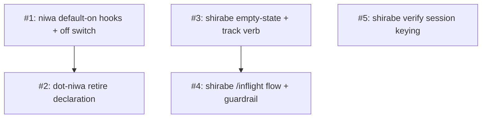

# PLAN: Session Work Summary Defect Fixes

## Status

Active

This plan decomposes the fix for the two defects scoped in the 2026-07-06
amendments to `docs/briefs/BRIEF-session-work-summary.md`,
`docs/prds/PRD-session-work-summary.md`, and
`docs/designs/current/DESIGN-session-work-summary.md`. It is a **coordinated**
multi-repo effort: the work spans niwa, dot-niwa, and shirabe, each landing its
own per-repo PR, sequenced by a merge order. This PR — the one carrying the
scoping docs and this PLAN — is the coordination PR: it indexes the effort, stays
open while the per-repo PRs land, and merges last. No GitHub milestone or issues
are created; per-repo work is tracked by its own PR.

## Scope Summary

Fix the two shipped session-work-summary defects: the ambient hooks are opt-in
and miss any shirabe-using workspace that never registered them, and the
on-demand summary falls back to a non-session-scoped repo listing (the operator's
open PRs in the current repo) that both over- and under-reports the session's
work. Both are cured primarily by making capture default-on in niwa for shirabe
adopters, with the on-demand path reworked in shirabe to drop the repo dump for a
session-scoped empty-state plus a validated agent-submit recovery.

## Decomposition Strategy

**Horizontal by repo and concern, sequenced by one cross-repo constraint.** The
work splits cleanly along repository lines, and each piece has a stable interface
to the others (the `shirabe work-summary` CLI surface and the hook registration),
so there's no integration-risk case for a walking skeleton.

Issue 1 (niwa default-on capture, gated on shirabe-plugin install) is the root:
it's the primary fix for both defects, because the ambient hooks it injects are
what populate the cross-repo session ledger. Issue 2 (dot-niwa cleanup) depends
on it and carries the one real ordering constraint — the explicit declaration
must not be removed until the niwa default exists, or a window opens with no
hooks. The three shirabe issues (3, 4, 5) are independent of niwa; Issue 4
depends on Issue 3, and all three share one shirabe PR.

**Coordinated grouping.** Coarsest-legal grouping is one PR per repo: a niwa PR
(Issue 1), a dot-niwa PR (Issue 2), and one shirabe PR (Issues 3-5). The merge
order is niwa PR → dot-niwa PR (the hook-registration gate); the shirabe PR is
independent; and this coordination PR merges last, once every per-repo PR has
merged.

## Implementation Issues

| Issue | Dependencies | Complexity |
|-------|--------------|------------|
| [#1: niwa — inject work-summary hooks by default for shirabe adopters, with an off switch](#issue-1) | None | critical |
| _Root fix. Make the three hook registrations a niwa built-in default (model on `SessionHooks` in `internal/workspace/materialize.go`), gated on shirabe-plugin install, each script guarded by `command -v shirabe`, with an off switch (`flag > CLAUDE.md-header > default`, default on). Populates the cross-repo ledger, curing both defects._ | | |
| [#2: dot-niwa — retire the explicit work-summary hook declarations](#issue-2) | [#1](#issue-1) | simple |
| _Remove the redundant `[[claude.hooks.*]]` entries from `.niwa/workspace.toml`. MUST merge after #1 or the workspace loses its hooks in the gap — the one cross-repo merge gate._ | | |
| [#3: shirabe — replace the repo-scoped fallback with an empty-state and a validated submit verb](#issue-3) | None | testable |
| _Remove the non-session `gh pr list --repo ... --author @me` fallback; on an empty ledger emit a session-scoped empty-state, and add `shirabe work-summary track <url>` (validated) to recover PRs the hook couldn't capture, into the block._ | | |
| [#4: shirabe — update /inflight for the empty-state/submit flow and the no-references guardrail](#issue-4) | [#3](#issue-3) | simple |
| _Rewrite `skills/inflight/SKILL.md` for the empty-state + submit interaction (recovered PRs flow through `track`, not free-text prose) and keep the no-reference-outside-the-block rule on the relay and dispatch final-message rule._ | | |
| [#5: shirabe — verify session-keying consistency between capture and render](#issue-5) | None | testable |
| _Confirm render's `CLAUDE_CODE_SESSION_ID` and capture's PostToolUse `session_id` match on the default-on path, so a captured session renders its ledger and is never pushed to the empty-state by a keying mismatch (PRD R21)._ | | |

## Issue Outlines

### Issue 1: niwa — inject the work-summary hooks by default for shirabe adopters, with an off switch

**Repo**: tsukumogami/niwa

**Goal**: Make the three work-summary hook registrations a niwa built-in default
materialized into a provisioned instance when that instance installs the shirabe
plugin, gated by an explicit off switch, so a shirabe adopter gets the ambient
summary and a populated cross-repo ledger without declaring anything.

**Acceptance Criteria**:
- [ ] A freshly provisioned instance that installs the shirabe plugin
      materializes all three work-summary hooks (PostToolUse capture on `Bash`,
      UserPromptSubmit absence, SessionStart `compact`) with no workspace-level
      declaration, modeled on the existing `SessionHooks` default-injection path
      in `internal/workspace/materialize.go`.
- [ ] The default is gated on shirabe-plugin installation (read from the
      `[claude]` marketplaces/plugins config niwa already merges): an instance
      that does not install shirabe receives none of the hooks.
- [ ] niwa carries the three thin pass-through scripts, each
      `exec shirabe work-summary <mode>` behind a `command -v shirabe || exit 0`
      guard; where `shirabe` is absent from PATH the hook no-ops and never aborts
      a turn.
- [ ] A documented off switch suppresses all three for an adopting workspace,
      resolved on `flag > CLAUDE.md-header > default` with default on.
- [ ] Default-on injection is idempotent against a workspace that still declares
      the hooks, so no hook double-registers (coordinates with Issue 2).

**Dependencies**: None.

**Type**: code

---

### Issue 2: dot-niwa — retire the explicit work-summary hook declarations

**Repo**: tsukumogami/dot-niwa

**Goal**: Remove the now-redundant work-summary hook entries (and their scripts,
once niwa carries them) from dot-niwa so the registration has a single source and
can't double-register.

**Acceptance Criteria**:
- [ ] The three `[[claude.hooks.*]]` work-summary entries are removed from
      `.niwa/workspace.toml`, and the corresponding `.niwa/hooks/` scripts are
      removed if niwa now provides them.
- [ ] The tsukumogami workspace still emits the ambient summary after the change,
      now via the niwa default rather than the declaration.
- [ ] No work-summary hook is registered twice.
- [ ] The dot-niwa hook tests pass, updated to reflect the source move if needed.

**Dependencies**: Blocked by Issue 1 (must merge after the niwa default exists, or
the workspace loses its hooks in the gap — the plan's one cross-repo merge gate).

**Type**: code

---

### Issue 3: shirabe — replace the repo-scoped fallback with an empty-state and a validated submit verb

**Repo**: tsukumogami/shirabe

**Goal**: Remove the non-session-scoped `render_fallback` (`gh pr list --repo ...
--author @me`) and replace it with a session-scoped empty-state, plus a
`shirabe work-summary track <url>...` verb that validates submitted PR URLs and
appends them to the ledger, so a PR the hook could not capture can be recovered
into the block.

**Acceptance Criteria**:
- [ ] In `crates/shirabe/src/work_summary.rs`, `render` no longer runs the
      repo-and-author `gh pr list` fallback; on an empty/unreachable ledger it
      emits a session-scoped empty-state ("no PRs tracked for this session").
- [ ] A `shirabe work-summary track <url>...` verb validates each URL against the
      anchored PR-URL pattern and a live `gh pr view`, appends valid ones to the
      session ledger (dedup by URL), and rejects fabricated or malformed URLs.
- [ ] A recovered entry renders inside the standardized block, sanitized like any
      other, and is distinguishable as agent-asserted vs hook-captured.
- [ ] Unit tests cover URL validation (accept/reject) and the empty-state output.

**Dependencies**: None.

**Type**: code

---

### Issue 4: shirabe — update /inflight for the empty-state/submit flow and the no-references guardrail

**Repo**: tsukumogami/shirabe

**Goal**: Rewrite the `/inflight` SKILL.md contract for the empty-state + submit
interaction (on an empty ledger, the agent may submit session PRs it opened, which
flow through `track` into the block) and keep the checkable guardrail that no PR
reference appears around the block unless it's a real PR the block lists — on both
the relay and the dispatch final-message rule.

**Acceptance Criteria**:
- [ ] `skills/inflight/SKILL.md` replaces the "repo-scoped fallback" description
      with the empty-state-plus-submit flow, routing recovered PRs through
      `shirabe work-summary track` rather than free-text prose.
- [ ] The no-reference-outside-the-block rule is stated explicitly and applies to
      the relay and the dispatch final-message rule.
- [ ] The rules are phrased so a reviewer or a check can decide conformance
      objectively; the sanctioned channel for a missing PR is submit-then-render.

**Dependencies**: Blocked by Issue 3 (the `track` verb and empty-state the skill
drives must exist first).

**Type**: docs

---

### Issue 5: shirabe — verify session-keying consistency between capture and render

**Repo**: tsukumogami/shirabe

**Goal**: Confirm (and harden if needed) that the session identity `render` keys
on and the identity `capture` keys the ledger by are the same in provisioned and
dispatched sessions, so a captured session renders its complete ledger and is
never pushed to the empty-state by a keying mismatch (PRD R21). Relates to Issue
1's default-on capture path, but doesn't block on it.

**Acceptance Criteria**:
- [ ] The two keying sources (`CLAUDE_CODE_SESSION_ID` for render; the
      PostToolUse stdin `session_id` for capture) are documented as identical on
      the default-on provisioning path, or a mismatch is found and fixed.
- [ ] A test or a documented manual check covers a captured session rendering
      from the ledger rather than the empty-state.

**Dependencies**: None.

**Type**: code

## Dependency Graph

## Implementation Sequence

**Critical path:** Issue 1 (niwa default-on capture) → Issue 2 (dot-niwa
cleanup). This is the only hard cross-repo sequence — the niwa default must exist
and merge before dot-niwa removes its explicit declaration, or the tsukumogami
workspace loses its hooks in the gap.

**Parallel:** Issues 1, 3, and 5 can start immediately; Issue 4 follows Issue 3
(the skill drives the `track` verb and empty-state that Issue 3 adds). The shirabe
issues share one PR (coarsest-legal grouping) and are independent of the
niwa/dot-niwa sequence. Within that PR, Issues 3 and 5 both touch
`work_summary.rs`, so they land in one coherent change rather than racing.

**Priority signal:** Issue 1 is the highest-impact starting point — it's the
primary fix for both defects and unblocks Issue 2. The shirabe issues rework the
on-demand path (drop the wrong-scoped fallback, add the validated recovery) but
don't, on their own, restore completeness for the common case — that comes from
Issue 1's default-on capture.

**Merge order:** niwa PR → dot-niwa PR; shirabe PR independent; this coordination
PR merges last, gated on `shirabe validate --merge-gate --mode=ready` once every
per-repo PR has merged.
