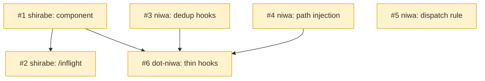

# PLAN: Session Work Summary

## Status

Draft

Decomposition is complete and committed; GitHub issue creation is deliberately
deferred. Coordinated mode has no validated single-command cross-repo issue
fan-out in this skill version, and the three target repos each need their own
issues and (per-repo) milestone. Issue creation happens at implementation time —
per-repo `/work-on` or manual `gh` — at which point the Issue Outlines below
become the created issues and this PLAN transitions to Active. The coordination
PR merges last per the merge order.

## Scope Summary

Implements the deterministic work-in-flight PR summary across three repositories:
the reusable capture/render component and `/inflight` command in shirabe, the
thin hooks in dot-niwa, and the enabling niwa capabilities (materializer fix,
shared-pipeline component-path injection, dispatch-brief rule).

## Decomposition Strategy

**Horizontal.** The components are loosely coupled across repositories with
defined interfaces: the shirabe component is the single implementation everything
else invokes, so it is the prerequisite; the niwa capabilities are independent
enablers; the dot-niwa hooks are thin shims that depend on both. This is a set of
components with clear boundaries built to a settled design, which is the
horizontal case rather than a single end-to-end runtime slice.

**Execution mode: coordinated.** The work spans three separate git repositories
(`tsukumogami/shirabe`, `tsukumogami/niwa`, `tsukumogami/dot-niwa`) and cannot land
as one PR. Each per-repo PR is independently useful — the shirabe PR ships a
working `/inflight` command on its own, the niwa PR repairs a live materializer
bug and adds standalone capabilities, and the dot-niwa PR delivers the ambient
display once its prerequisites land. A coordination PR (this branch) merges last.

## Issue Outlines

### Issue 1: feat: work-summary capture/render component

**Goal**: Ship the single reusable component (capture parsing, ledger, two-level
gate, renderer, terminal-safety sanitizer) in the shirabe plugin that every
surface invokes.

**Acceptance Criteria**:
- [ ] `capture` parses a PR URL from `gh pr create` output, validates it against
      the anchored `^https://github\.com/<owner>/<repo>/pull/[0-9]+$` pattern
      (rejecting non-matches and the `git push` `/pull/new/` hint), and appends a
      ledger row (repo, number, URL, first-seen, `terminal_shown`).
- [ ] `render <session-id>` reads the ledger, refreshes each item via live `gh`,
      and prints the `=== WORK IN FLIGHT ===` block with attention-first ordering,
      terminal-drop, section escalation above six items, and a freshness line.
- [ ] The terminal-safety sanitizer strips control/ANSI bytes (before truncation),
      removes newlines and `|`, and forbids the marker substring in any cell.
- [ ] Two-level gate: cheap ledger-hash check every call; rendered-hash recompute
      only on ledger change or `WS_RENDER_INTERVAL`; `last_activity` refreshed on
      every call including suppressed ones; state writes `flock`-protected.
- [ ] Ledger and gate state stored per-user (dir 0700, files 0600), no symlink
      follow. Offline `gh` degrades to a best-effort ledger-only block.
- [ ] Unit tests cover the capture regex fixtures and the sanitizer.

**Dependencies**: None

**Repo / Group**: tsukumogami/shirabe / default
**Type**: code

### Issue 2: feat: /inflight on-demand work-summary command

**Goal**: A shirabe `/inflight` skill that regenerates the block on demand from
the same component.

**Acceptance Criteria**:
- [ ] Invokes the component via `${CLAUDE_PLUGIN_ROOT}` through `!` dynamic
      injection and relays its output verbatim.
- [ ] On unreachable live state, falls back to a repo-scoped `gh` listing
      (never author-scoped cross-repo) following the same block spec, with F1
      fail-closed redaction for unconfirmed-visibility items.
- [ ] `disable-model-invocation: true` so only the user invokes it.

**Dependencies**: Blocked by <<ISSUE:1>>

**Repo / Group**: tsukumogami/shirabe / default
**Type**: code

### Issue 3: fix: dedup declared and discovered hook registrations

**Goal**: Fix the niwa materializer so a hook registered through both declared
config and auto-discovery is not installed twice with a lost matcher.

**Acceptance Criteria**:
- [ ] `runRepoMaterializers` (or its merge step) dedups by resolved script path so
      a script present in both channels registers once with its declared matcher.
- [ ] Regression test: a hook declared in `workspace.toml` with `matcher: Bash`
      and present under `.niwa/hooks/` materializes exactly one settings entry
      that retains the `Bash` matcher.

**Dependencies**: None

**Repo / Group**: tsukumogami/niwa / default
**Type**: code

### Issue 4: feat: inject resolved plugin component path into hook registrations

**Goal**: Give niwa the capability to resolve the shirabe component path and
inject it into the thin hook registrations, in the shared provisioning pipeline
so every instance-materializing command wires it identically.

**Acceptance Criteria**:
- [ ] The injection lives in the shared `Applier.runPipeline` materialization
      step (the `runRepoMaterializers` / settings-materializer path), NOT in an
      apply-specific codepath — so `niwa create`, `niwa apply`, and `niwa dispatch`
      (which provisions via `Applier.Create` → `runPipeline`) all produce a wired
      instance from the one implementation.
- [ ] Verified for all three entry points: an instance created by `create`, one
      converged by `apply`, and one provisioned by `dispatch` each have the
      resolved component path injected into the materialized work-summary hook
      commands (settings-registered hooks receive only `${CLAUDE_PROJECT_DIR}`, so
      the path cannot be self-resolved).
- [ ] A missing/unresolvable component path yields a hook that fails safe (no
      capture), never an untrusted fallback; the injected path is confined to the
      resolved plugin cache location.
- [ ] Re-provisioning (apply/create) refreshes the path after a plugin bump.

**Dependencies**: None

**Repo / Group**: tsukumogami/niwa / default
**Type**: code

### Issue 5: feat: dispatch-brief work-in-flight final-message rule

**Goal**: Require a dispatched worker's final message to carry the work-in-flight
block, via the niwa dispatch rootskill brief.

**Acceptance Criteria**:
- [ ] The dispatch brief template instructs the worker to end its final message
      with the standardized block (the same sanitization contract applies to the
      model-authored block).
- [ ] The rule references the block spec from the DESIGN, not a duplicated format.

**Dependencies**: None

**Repo / Group**: tsukumogami/niwa / default
**Type**: docs

### Issue 6: feat: thin work-summary hooks and registration

**Goal**: Ship the thin dot-niwa hooks that invoke the shirabe component and emit
the block through the dual channels.

**Acceptance Criteria**:
- [ ] PostToolUse capture hook (matcher on PR-affecting `gh` commands), a
      UserPromptSubmit return hook (`WS_ABSENCE_THRESHOLD`, default 30 min), and a
      SessionStart(`compact`) re-injection hook, registered via one channel in
      `workspace.toml`/`.niwa/hooks/`.
- [ ] Each hook execs the niwa-injected component path with the session id and
      emits `systemMessage` plus a neutral-phrased `additionalContext` echo
      (structured fields; free-text titles omitted or delimited as opaque).
- [ ] Hooks are idempotent and tool-type tolerant (defensive against the
      pre-fix double-registration behavior) and fail safe when the injected path
      is absent.

**Dependencies**: Blocked by <<ISSUE:1>>, <<ISSUE:3>>, <<ISSUE:4>>

**Repo / Group**: tsukumogami/dot-niwa / default
**Type**: code

## Implementation Issues

Issues are not yet created. Coordinated mode has no validated single-command
cross-repo issue fan-out in this skill version, and the three target repos each
require their own issues (GitHub milestones are per-repo). The decomposition,
per-issue `Repo`/`Group` tags, and complexity live in the Issue Outlines above;
the cross-repo landing order lives in the Merge Order block below. At
implementation time each outline becomes a created issue in its target repo and
this table is populated with links, transitioning the PLAN to Active.

## Dependency Graph



**Legend**: done (merged), ready (unblocked), blocked (waiting on a dependency).
All six issues are `ready` (nothing created yet; no blockers exist at rest).

## Merge Order

```merge-order
# Two-node (repo, pr_group)-level DAG, one node per line.
shirabe-default | unopened
niwa-default | unopened
dot-niwa-default | unopened
```

`shirabe-default` and `niwa-default` have no cross-repo predecessors and may land
in parallel. `dot-niwa-default` merges only after both (it needs the component
from shirabe and the materializer fix + path injection from niwa). The
coordination PR merges last, after all three per-repo PRs.

## Implementation Sequence

**Critical path:** Issue 1 (shirabe component) → Issue 6 (dot-niwa hooks) →
coordination PR. The component gates the hooks; the hooks are the last per-repo
work.

**Parallelizable:**
- The niwa work (Issues 3, 4, 5) runs concurrently with the shirabe work
  (Issues 1, 2) — no cross-repo dependency between them.
- Within shirabe, Issue 2 follows Issue 1.
- Within niwa, the three issues are independent of each other.

**Prerequisites first:** Issues 3 (materializer dedup) and 4 (path injection) are
the niwa enablers the dot-niwa hooks require; landing them before Issue 6 keeps
the dot-niwa PR unblocked as soon as shirabe lands.
