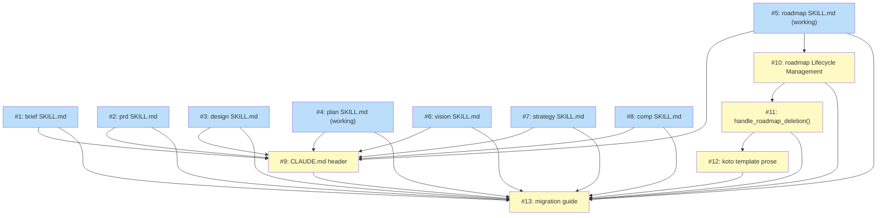

# PLAN: shirabe-artifact-decision-contract

## Status

Active

Single-pr execution mode auto-promotes Draft -> Active on creation per PR #176's
lifecycle template. The 13 atomic issues live inside this PLAN's Implementation
Issues table and ship in one cohesive PR; no GitHub milestone or issues are
filed. The PLAN file is deleted by the work-on cascade's `handle_roadmap_deletion`
plus PLAN-deletion path when the implementing PR merges.

## Scope Summary

Ship the per-skill durable-vs-working artifact-lifecycle contract: eight
producer-skill SKILL.md sections, a CLAUDE.md convention header, the ROADMAP
four-state working-lifecycle update, a `handle_roadmap_deletion` cascade
function plus its koto template reference, and an adopter-facing migration
guide. PR #176's PLAN lifecycle template (`Draft -> Active -> Done -> DELETED`)
and the cascade's pre-`gh pr ready` window are the foundation; this PLAN cites
them rather than re-deriving them.

## Decomposition Strategy

**Horizontal.** The DESIGN groups the work into five batches with loosely-
coupled prose and bash deltas across distinct surfaces (per-skill prose,
CLAUDE.md header, ROADMAP lifecycle skill, cascade script, koto template,
adopter guide). One explicit ordering constraint holds inside the cascade
batch: the koto template references the function by name, so 4b lands after
4a. The eight per-skill sections are independent of each other.

Walking skeleton does not apply: there is no thin end-to-end runtime thread
to thicken. Each issue is a self-contained delta to one file. The whole
cohort ships in one PR (single-pr execution mode) because the surfaced rule
on `skills/plan/SKILL.md` defaults to single-pr and no hard constraint forces
multi-pr -- the cohort delivers one observable value (the contract) and
splitting would produce building-block PRs no reader could use alone.

## Implementation Issues

| Issue | Dependencies | Complexity |
|-------|--------------|------------|
| [#1: docs(brief): add Artifact Lifecycle section to brief SKILL.md](#issue-1-docsbrief-add-artifact-lifecycle-section-to-brief-skillmd) | None | simple |
| _Adds the `## Artifact Lifecycle` H2 to `skills/brief/SKILL.md` using the durable template (DESIGN Decision 2). The section states BRIEF stays in `docs/briefs/` after completion as part of the audit trail. Covers PRD AC1, AC2._ | | |
| [#2: docs(prd): add Artifact Lifecycle section to prd SKILL.md](#issue-2-docsprd-add-artifact-lifecycle-section-to-prd-skillmd) | None | simple |
| _Adds the `## Artifact Lifecycle` H2 to `skills/prd/SKILL.md` using the durable template. PRD stays in `docs/prds/` after completion. Parallel-shape sibling of #1; covers PRD AC1, AC2._ | | |
| [#3: docs(design): add Artifact Lifecycle section to design SKILL.md](#issue-3-docsdesign-add-artifact-lifecycle-section-to-design-skillmd) | None | simple |
| _Adds the `## Artifact Lifecycle` H2 to `skills/design/SKILL.md` using the durable template. DESIGN stays in `docs/designs/` after completion. Covers PRD AC1, AC2._ | | |
| [#4: docs(plan): add Artifact Lifecycle section to plan SKILL.md](#issue-4-docsplan-add-artifact-lifecycle-section-to-plan-skillmd) | None | simple |
| _Adds the `## Artifact Lifecycle` H2 to `skills/plan/SKILL.md` using the working template. PLAN classifies as working with lifecycle `Draft -> Active -> Done -> DELETED`; the section cites `docs/designs/current/DESIGN-lifecycle-draft-ready-discipline.md` as authoritative and does not re-derive the lifecycle. Covers PRD AC1, AC3, AC12._ | | |
| [#5: docs(roadmap): add Artifact Lifecycle section to roadmap SKILL.md](#issue-5-docsroadmap-add-artifact-lifecycle-section-to-roadmap-skillmd) | None | simple |
| _Adds the `## Artifact Lifecycle` H2 to `skills/roadmap/SKILL.md` using the working template. ROADMAP classifies as working with completion condition "all features Done AND all referenced GitHub issues closed" and lifecycle `Draft -> Active -> Done -> DELETED`. The lifecycle machinery update lives in #10; this issue ships the contract section. Covers PRD AC1, AC4._ | | |
| [#6: docs(vision): add Artifact Lifecycle section to vision SKILL.md](#issue-6-docsvision-add-artifact-lifecycle-section-to-vision-skillmd) | None | simple |
| _Adds the `## Artifact Lifecycle` H2 to `skills/vision/SKILL.md` using the durable template. VISION stays in `docs/visions/` after completion. Covers PRD AC1, AC2._ | | |
| [#7: docs(strategy): add Artifact Lifecycle section to strategy SKILL.md](#issue-7-docsstrategy-add-artifact-lifecycle-section-to-strategy-skillmd) | None | simple |
| _Adds the `## Artifact Lifecycle` H2 to `skills/strategy/SKILL.md` using the durable template. STRATEGY stays in `docs/strategies/` after completion. Covers PRD AC1, AC2._ | | |
| [#8: docs(comp): add Artifact Lifecycle section to comp SKILL.md](#issue-8-docscomp-add-artifact-lifecycle-section-to-comp-skillmd) | None | simple |
| _Adds the `## Artifact Lifecycle` H2 to `skills/comp/SKILL.md` using the durable template. COMP stays in `docs/competitive/` after completion, with a one-sentence note that COMP is private-only and the lifecycle contract preserves that constraint. Covers PRD AC1, AC2._ | | |
| [#9: docs(claude-md): add Artifact Lifecycle convention header](#issue-9-docsclaude-md-add-artifact-lifecycle-convention-header) | [#1](#issue-1-docsbrief-add-artifact-lifecycle-section-to-brief-skillmd), [#2](#issue-2-docsprd-add-artifact-lifecycle-section-to-prd-skillmd), [#3](#issue-3-docsdesign-add-artifact-lifecycle-section-to-design-skillmd), [#4](#issue-4-docsplan-add-artifact-lifecycle-section-to-plan-skillmd), [#5](#issue-5-docsroadmap-add-artifact-lifecycle-section-to-roadmap-skillmd), [#6](#issue-6-docsvision-add-artifact-lifecycle-section-to-vision-skillmd), [#7](#issue-7-docsstrategy-add-artifact-lifecycle-section-to-strategy-skillmd), [#8](#issue-8-docscomp-add-artifact-lifecycle-section-to-comp-skillmd) | simple |
| _Adds the `## Artifact Lifecycle: per-skill` convention header to `CLAUDE.md` between `## Planning Context:` and `## Conventions`, paralleling the existing Repo Visibility and Planning Context headers (DESIGN Decision 6). One paragraph names the three-rule durable-vs-working model and points readers at per-skill SKILL.md as authoritative. Depends on #1-#8 so the pointer prose targets concrete sections. Covers PRD AC5._ | | |
| [#10: docs(roadmap): update Lifecycle Management for four-state working lifecycle](#issue-10-docsroadmap-update-lifecycle-management-for-four-state-working-lifecycle) | [#5](#issue-5-docsroadmap-add-artifact-lifecycle-section-to-roadmap-skillmd) | testable |
| _Updates `skills/roadmap/SKILL.md`'s `## Lifecycle Management` section from `Draft -> Active -> Done` to `Draft -> Active -> Done -> DELETED` (DESIGN Decision 3). Adds the Done -> DELETED row to the transition table with verb "cascade" and precondition "all features Done AND all referenced issues closed, triggered by work-on cascade." Updates "Forbidden transitions" to note Done -> DELETED is cascade-only. Distinct from #5 (which adds the `## Artifact Lifecycle` contract section; #10 wires the lifecycle machinery). Covers PRD AC4._ | | |
| [#11: feat(work-on): add handle_roadmap_deletion shell function to run-cascade.sh](#issue-11-featwork-on-add-handle_roadmap_deletion-shell-function-to-run-cascadesh) | [#10](#issue-10-docsroadmap-update-lifecycle-management-for-four-state-working-lifecycle) | testable |
| _Appends `handle_roadmap_deletion()` to `skills/work-on/scripts/run-cascade.sh` implementing the deterministic completion check from DESIGN Decision 5: re-verify all features Done, regex-extract issue URLs, call `check_issue_closed` for each (require all CLOSED), then `shirabe transition <path> Done` and `git rm <path>` in the same staged commit set. Idempotent at every negative branch. Updates the existing `handle_roadmap()` all-features-Done branch to delegate, replacing the inline `gh issue view` loop and renaming the step from `transition_roadmap` to `delete_roadmap`. Covers PRD AC6, AC8, AC9, AC10, AC13, AC14._ | | |
| [#12: docs(work-on): reference handle_roadmap_deletion in work-on-plan koto template](#issue-12-docswork-on-reference-handle_roadmap_deletion-in-work-on-plan-koto-template) | [#11](#issue-11-featwork-on-add-handle_roadmap_deletion-shell-function-to-run-cascadesh) | simple |
| _Updates `skills/work-on/koto-templates/work-on-plan.md`'s `plan_completion` state prose with a parallel reference to the new function (DESIGN Decision 4). One sentence names that the cascade transitions the ROADMAP Active -> Done and `git rm`s the file in the same atomic finalization commit as the PLAN deletion when the upstream walk surfaces a ROADMAP whose features are all Done and whose referenced issues are all closed. Covers PRD AC7, AC13._ | | |
| [#13: docs(guides): add adopter-facing migration guide for the artifact lifecycle contract](#issue-13-docsguides-add-adopter-facing-migration-guide-for-the-artifact-lifecycle-contract) | [#1](#issue-1-docsbrief-add-artifact-lifecycle-section-to-brief-skillmd), [#2](#issue-2-docsprd-add-artifact-lifecycle-section-to-prd-skillmd), [#3](#issue-3-docsdesign-add-artifact-lifecycle-section-to-design-skillmd), [#4](#issue-4-docsplan-add-artifact-lifecycle-section-to-plan-skillmd), [#5](#issue-5-docsroadmap-add-artifact-lifecycle-section-to-roadmap-skillmd), [#6](#issue-6-docsvision-add-artifact-lifecycle-section-to-vision-skillmd), [#7](#issue-7-docsstrategy-add-artifact-lifecycle-section-to-strategy-skillmd), [#8](#issue-8-docscomp-add-artifact-lifecycle-section-to-comp-skillmd), [#9](#issue-9-docsclaude-md-add-artifact-lifecycle-convention-header), [#10](#issue-10-docsroadmap-update-lifecycle-management-for-four-state-working-lifecycle), [#11](#issue-11-featwork-on-add-handle_roadmap_deletion-shell-function-to-run-cascadesh), [#12](#issue-12-docswork-on-reference-handle_roadmap_deletion-in-work-on-plan-koto-template) | simple |
| _Adds `docs/guides/RELEASE-NOTES-artifact-decision-contract.md` explaining the doctrine flip (ROADMAP becoming working) and the per-skill prose template, addressed to skill authors and adopters (DESIGN Decision 7's lazy migration posture: existing ROADMAPs retire on their next /work-on cycle). The guide names the new `## Artifact Lifecycle` H2 contract, the CLAUDE.md header, the cascade extension, and the lazy-migration semantics. Lands last so it can cite the shipped prose. Covers PRD AC1, AC5, AC11._ | | |

## Issue Outlines

### Issue 1: docs(brief): add Artifact Lifecycle section to brief SKILL.md

**Goal**: Add the `## Artifact Lifecycle` H2 to `skills/brief/SKILL.md` using the durable template from DESIGN Decision 2.

**Acceptance Criteria**:
- [ ] `skills/brief/SKILL.md` contains a `## Artifact Lifecycle` H2 section.
- [ ] The section uses the durable template: bold `**Lifecycle:**` label followed by `Durable.` and the one-sentence statement that BRIEF stays in `docs/briefs/` as part of the audit trail.
- [ ] One-paragraph rationale ties the durability to BRIEF's audit-trail role (framing of why a feature was scoped).

**Dependencies**: None

**Type**: docs
**Files**: `skills/brief/SKILL.md`

### Issue 2: docs(prd): add Artifact Lifecycle section to prd SKILL.md

**Goal**: Add the `## Artifact Lifecycle` H2 to `skills/prd/SKILL.md` using the durable template.

**Acceptance Criteria**:
- [ ] `skills/prd/SKILL.md` contains a `## Artifact Lifecycle` H2 section.
- [ ] Section uses the durable template with `docs/prds/` as the directory.
- [ ] Rationale ties to PRD's audit-trail role (what requirements were captured).

**Dependencies**: None

**Type**: docs
**Files**: `skills/prd/SKILL.md`

### Issue 3: docs(design): add Artifact Lifecycle section to design SKILL.md

**Goal**: Add the `## Artifact Lifecycle` H2 to `skills/design/SKILL.md` using the durable template.

**Acceptance Criteria**:
- [ ] `skills/design/SKILL.md` contains a `## Artifact Lifecycle` H2 section.
- [ ] Section uses the durable template with `docs/designs/` as the directory.
- [ ] Rationale ties to DESIGN's audit-trail role (how the architecture was decided).

**Dependencies**: None

**Type**: docs
**Files**: `skills/design/SKILL.md`

### Issue 4: docs(plan): add Artifact Lifecycle section to plan SKILL.md

**Goal**: Add the `## Artifact Lifecycle` H2 to `skills/plan/SKILL.md` using the working template; cite PR #176 as the lifecycle source.

**Acceptance Criteria**:
- [ ] `skills/plan/SKILL.md` contains a `## Artifact Lifecycle` H2 section.
- [ ] Section uses the working template: `**Lifecycle:**` label, `Working.` value, completion condition naming the cascade's verification and PLAN-file deletion, and `Deleted by: the work-on cascade's PLAN deletion step.`
- [ ] Section names the lifecycle as `Draft -> Active -> Done -> DELETED` and cites `docs/designs/current/DESIGN-lifecycle-draft-ready-discipline.md` as authoritative for the lifecycle template.
- [ ] No re-derivation of the lifecycle template in this section's prose.

**Dependencies**: None

**Type**: docs
**Files**: `skills/plan/SKILL.md`

### Issue 5: docs(roadmap): add Artifact Lifecycle section to roadmap SKILL.md

**Goal**: Add the `## Artifact Lifecycle` H2 to `skills/roadmap/SKILL.md` using the working template; name the completion condition and the cascade-deletion step.

**Acceptance Criteria**:
- [ ] `skills/roadmap/SKILL.md` contains a `## Artifact Lifecycle` H2 section.
- [ ] Section uses the working template with completion condition "all features on the ROADMAP at status Done AND all referenced GitHub issues closed" and `Deleted by: the work-on cascade's handle_roadmap_deletion step.`
- [ ] Section names the lifecycle as `Draft -> Active -> Done -> DELETED`, mirroring PLAN's shape, and cites the same authoritative source.
- [ ] Section's lifecycle prose stays in sync with the lifecycle machinery update in #10 (no contradiction between the contract section and the transition table).

**Dependencies**: None

**Type**: docs
**Files**: `skills/roadmap/SKILL.md`

### Issue 6: docs(vision): add Artifact Lifecycle section to vision SKILL.md

**Goal**: Add the `## Artifact Lifecycle` H2 to `skills/vision/SKILL.md` using the durable template.

**Acceptance Criteria**:
- [ ] `skills/vision/SKILL.md` contains a `## Artifact Lifecycle` H2 section.
- [ ] Section uses the durable template with `docs/visions/` as the directory.
- [ ] Rationale ties to VISION's audit-trail role (why the project exists at all).

**Dependencies**: None

**Type**: docs
**Files**: `skills/vision/SKILL.md`

### Issue 7: docs(strategy): add Artifact Lifecycle section to strategy SKILL.md

**Goal**: Add the `## Artifact Lifecycle` H2 to `skills/strategy/SKILL.md` using the durable template.

**Acceptance Criteria**:
- [ ] `skills/strategy/SKILL.md` contains a `## Artifact Lifecycle` H2 section.
- [ ] Section uses the durable template with `docs/strategies/` as the directory.
- [ ] Rationale ties to STRATEGY's audit-trail role (which medium-term bet was placed).

**Dependencies**: None

**Type**: docs
**Files**: `skills/strategy/SKILL.md`

### Issue 8: docs(comp): add Artifact Lifecycle section to comp SKILL.md

**Goal**: Add the `## Artifact Lifecycle` H2 to `skills/comp/SKILL.md` using the durable template; preserve the COMP private-only constraint.

**Acceptance Criteria**:
- [ ] `skills/comp/SKILL.md` contains a `## Artifact Lifecycle` H2 section.
- [ ] Section uses the durable template with `docs/competitive/` as the directory.
- [ ] Section includes one sentence stating COMP is private-only; the lifecycle contract does not loosen that constraint.

**Dependencies**: None

**Type**: docs
**Files**: `skills/comp/SKILL.md`

### Issue 9: docs(claude-md): add Artifact Lifecycle convention header

**Goal**: Add the `## Artifact Lifecycle: per-skill` convention header to `CLAUDE.md`, paralleling the existing Repo Visibility and Planning Context headers.

**Acceptance Criteria**:
- [ ] `CLAUDE.md` contains an `## Artifact Lifecycle: per-skill` H2 header, placed between `## Planning Context:` and `## Conventions`.
- [ ] The header is one paragraph using the wording from DESIGN Decision 6: names the three-rule model (durable artifacts stay in `docs/`; working artifacts retire on completion; each working-artifact skill names its condition in SKILL.md).
- [ ] The paragraph points at per-skill `## Artifact Lifecycle` sections as authoritative and names which artifacts fall into each bucket (PLAN and ROADMAP working; BRIEF, PRD, DESIGN, VISION, STRATEGY, COMP durable).
- [ ] The header parallels the existing convention-header pattern (no inline table; per-skill prose is the single source of truth).

**Dependencies**: Blocked by [#1](#issue-1-docsbrief-add-artifact-lifecycle-section-to-brief-skillmd), [#2](#issue-2-docsprd-add-artifact-lifecycle-section-to-prd-skillmd), [#3](#issue-3-docsdesign-add-artifact-lifecycle-section-to-design-skillmd), [#4](#issue-4-docsplan-add-artifact-lifecycle-section-to-plan-skillmd), [#5](#issue-5-docsroadmap-add-artifact-lifecycle-section-to-roadmap-skillmd), [#6](#issue-6-docsvision-add-artifact-lifecycle-section-to-vision-skillmd), [#7](#issue-7-docsstrategy-add-artifact-lifecycle-section-to-strategy-skillmd), [#8](#issue-8-docscomp-add-artifact-lifecycle-section-to-comp-skillmd)

**Type**: docs
**Files**: `CLAUDE.md`

### Issue 10: docs(roadmap): update Lifecycle Management for four-state working lifecycle

**Goal**: Update `skills/roadmap/SKILL.md`'s `## Lifecycle Management` section to reflect the four-state lifecycle (DESIGN Decision 3). Distinct from #5 (contract section); this issue ships the transition machinery.

**Acceptance Criteria**:
- [ ] `## Lifecycle Management` describes the lifecycle as `Draft -> Active -> Done -> DELETED` (the existing `Draft -> Active -> Done` is replaced).
- [ ] The transition table gains a Done -> DELETED row with verb "cascade" and precondition "all features Done AND all referenced issues closed, triggered by work-on cascade."
- [ ] The "Forbidden transitions" line names Done -> DELETED as cascade-only (not human-invokable; no `shirabe transition <path> DELETED` form exists).
- [ ] No contradiction with the `## Artifact Lifecycle` section landed in #5.

**Dependencies**: Blocked by [#5](#issue-5-docsroadmap-add-artifact-lifecycle-section-to-roadmap-skillmd)

**Type**: docs
**Files**: `skills/roadmap/SKILL.md`

### Issue 11: feat(work-on): add handle_roadmap_deletion shell function to run-cascade.sh

**Goal**: Append `handle_roadmap_deletion()` to `skills/work-on/scripts/run-cascade.sh` per DESIGN Decision 5 and update the existing `handle_roadmap()`'s all-features-Done branch to delegate.

**Acceptance Criteria**:
- [ ] `skills/work-on/scripts/run-cascade.sh` defines a shell function `handle_roadmap_deletion(path, found_in)` after the existing `handle_roadmap()`.
- [ ] The function re-verifies all `**Status:**` rows in the ROADMAP file equal `Done` (idempotency-on-direct-call); a non-Done row produces a no-op return.
- [ ] The function regex-extracts every `https://github.com/<owner>/<repo>/issues/<N>` URL in the ROADMAP file and calls the existing `check_issue_closed` helper for each; an open issue records an `add_step "delete_roadmap" ... "skipped"` step naming the open URL and returns.
- [ ] When all features Done AND all issues CLOSED hold, the function runs `"$SHIRABE_BIN" transition "$path" Done` (Active -> Done audit-trail marker) and `git rm -f "$path"` (Done -> DELETED), then records `add_step "delete_roadmap" ... "ok"` and appends `$path` to `STAGED_FILES`.
- [ ] A `git rm` failure sets `ANY_FAILED=true` and records the step as `failed` with a one-sentence message.
- [ ] The function is idempotent: a missing file returns 0 with no side effects; the no-features-Done branch is a no-op; the open-issue branch is a no-op (modulo the recorded skip step).
- [ ] The existing `handle_roadmap()`'s all-features-Done branch is replaced to call `handle_roadmap_deletion "$path" "$found_in"`; the inline `gh issue view` loop and the old `transition_roadmap` step name are removed.
- [ ] The script's external JSON contract documents `delete_roadmap` as a `steps[].action` value.
- [ ] `run-cascade_test.sh` is updated or extended to cover: (a) no-ROADMAP-in-chain case unchanged; (b) all-features-Done + all-issues-closed triggers the deletion and the atomic commit; (c) any open issue produces a skip; (d) re-invocation on an already-deleted ROADMAP is a no-op.
- [ ] The post-cascade strict-mode lifecycle probe on the PLAN's tactical chain continues to pass on a chain with no ROADMAP and on a chain whose ROADMAP was just deleted.

**Dependencies**: Blocked by [#10](#issue-10-docsroadmap-update-lifecycle-management-for-four-state-working-lifecycle)

**Type**: code
**Files**: `skills/work-on/scripts/run-cascade.sh`, `skills/work-on/scripts/run-cascade_test.sh`

### Issue 12: docs(work-on): reference handle_roadmap_deletion in work-on-plan koto template

**Goal**: Update `skills/work-on/koto-templates/work-on-plan.md`'s `plan_completion` state prose with a parallel reference to the new cascade function.

**Acceptance Criteria**:
- [ ] `skills/work-on/koto-templates/work-on-plan.md`'s `plan_completion` state prose includes a one-sentence reference to `handle_roadmap_deletion` matching the wording from DESIGN Decision 4.
- [ ] The sentence names that the cascade transitions the ROADMAP Active -> Done and `git rm`s the file in the same atomic finalization commit as the PLAN deletion.
- [ ] No state-machine change; the call sits inside `run-cascade.sh`'s existing flow which is already invoked by `plan_completion`.
- [ ] The reference is placed alongside the existing PLAN-deletion prose so a reviewer chasing the cascade behavior reads about both handlers in one section.

**Dependencies**: Blocked by [#11](#issue-11-featwork-on-add-handle_roadmap_deletion-shell-function-to-run-cascadesh)

**Type**: docs
**Files**: `skills/work-on/koto-templates/work-on-plan.md`

### Issue 13: docs(guides): add adopter-facing migration guide for the artifact lifecycle contract

**Goal**: Add `docs/guides/RELEASE-NOTES-artifact-decision-contract.md` documenting the doctrine flip and the per-skill prose template for skill authors and adopters.

**Acceptance Criteria**:
- [ ] `docs/guides/RELEASE-NOTES-artifact-decision-contract.md` exists.
- [ ] The guide names the new `## Artifact Lifecycle` H2 contract, the CLAUDE.md convention header, the ROADMAP working-lifecycle flip, and the cascade extension.
- [ ] The guide states the lazy-migration posture (DESIGN Decision 7): existing ROADMAPs in `docs/roadmaps/` retire on their next /work-on cycle; no bulk migration runs.
- [ ] The guide reproduces the durable template and the working template from DESIGN Decision 2 so a skill author can copy-paste the shape.
- [ ] The guide explicitly states that no new shirabe CLI subcommand, no new validator check, and no new schema field is introduced (PRD AC11).
- [ ] The guide's writing follows FC10 style: no banned words; direct prose; varied sentence length; contractions allowed.

**Dependencies**: Blocked by [#1](#issue-1-docsbrief-add-artifact-lifecycle-section-to-brief-skillmd), [#2](#issue-2-docsprd-add-artifact-lifecycle-section-to-prd-skillmd), [#3](#issue-3-docsdesign-add-artifact-lifecycle-section-to-design-skillmd), [#4](#issue-4-docsplan-add-artifact-lifecycle-section-to-plan-skillmd), [#5](#issue-5-docsroadmap-add-artifact-lifecycle-section-to-roadmap-skillmd), [#6](#issue-6-docsvision-add-artifact-lifecycle-section-to-vision-skillmd), [#7](#issue-7-docsstrategy-add-artifact-lifecycle-section-to-strategy-skillmd), [#8](#issue-8-docscomp-add-artifact-lifecycle-section-to-comp-skillmd), [#9](#issue-9-docsclaude-md-add-artifact-lifecycle-convention-header), [#10](#issue-10-docsroadmap-update-lifecycle-management-for-four-state-working-lifecycle), [#11](#issue-11-featwork-on-add-handle_roadmap_deletion-shell-function-to-run-cascadesh), [#12](#issue-12-docswork-on-reference-handle_roadmap_deletion-in-work-on-plan-koto-template)

**Type**: docs
**Files**: `docs/guides/RELEASE-NOTES-artifact-decision-contract.md`

## Dependency Graph

**Legend**: Green = done, Blue = ready, Yellow = blocked, Purple = needsDesign, Light blue = needsPrd, Red = needsSpike, Indigo = needsDecision, Orange = tracksDesign/tracksPlan

## Implementation Sequence

**Critical path**: #5 -> #10 -> #11 -> #12 -> #13 (length 5). The cascade-extension
chain is the deepest because the koto template prose references the function by
name (11 before 12), the function references the four-state lifecycle (10 before
11), and the lifecycle-machinery update depends on the contract section landing
first (5 before 10). The migration guide (13) lands last because it documents
the shipped contract for adopters.

**Immediate start**: #1, #2, #3, #4, #5, #6, #7, #8 (the eight
per-skill sections; no inter-dependency).

**Parallelization**:
- Sprint 1: eight per-skill sections (#1-#8) in parallel.
- Sprint 2: CLAUDE.md header (#9) and ROADMAP lifecycle-machinery update (#10)
  in parallel (each unblocked once its deps land).
- Sprint 3: cascade function (#11) waits on #10.
- Sprint 4: koto template prose (#12) waits on #11.
- Sprint 5: migration guide (#13) waits on everything.

**Single-PR delivery**: The 13 atomic issues ship as one cohesive commit chain
on one PR. Validator self-checks (`shirabe validate --lifecycle-chain` and the
`validate-docs` workflow) run on each commit incrementally during local
development. The cascade's atomic finalization commit retires this PLAN file
when the implementing PR merges (single-pr lifecycle per PR #176).

## References

- BRIEF: `docs/briefs/BRIEF-shirabe-artifact-decision-contract.md`
- PRD: `docs/prds/PRD-shirabe-artifact-decision-contract.md` (12 R, 14 AC, Complex)
- DESIGN: `docs/designs/DESIGN-shirabe-artifact-decision-contract.md` (7 decisions, 12 components, 5 batches)
- PLAN lifecycle template authority:
  `docs/designs/current/DESIGN-lifecycle-draft-ready-discipline.md`,
  `docs/designs/current/DESIGN-skill-cascade-lifecycle-check.md`,
  `skills/plan/SKILL.md`.
- Cascade implementation: `skills/work-on/scripts/run-cascade.sh`,
  `skills/work-on/koto-templates/work-on-plan.md` (`plan_completion` state).
- Workflow principles: `${CLAUDE_PLUGIN_ROOT}/references/workflow-principles.md`
  (P1: observable value is the unit of work).
