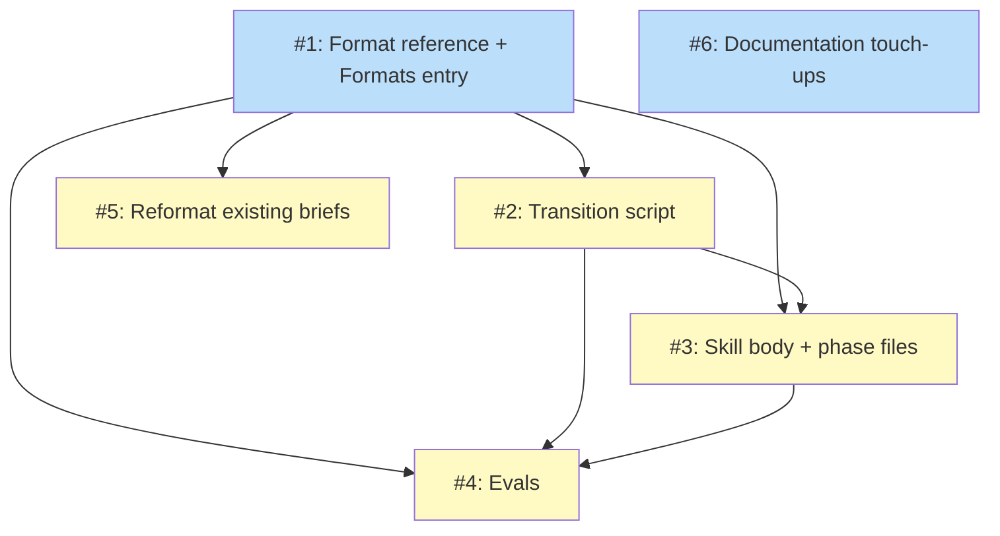

# PLAN: shirabe-brief-skill

## Status

Draft

Single-PR plan decomposing the Accepted DESIGN-shirabe-brief-skill into
six issue outlines. The PLAN stays at Draft until `/work-on` starts the
implementation, at which point it transitions to Active. No GitHub
issues or milestone are created; the outlines below give `/work-on` the
decomposition it needs for one bundled PR.

## Scope Summary

Add BRIEF as a first-class shirabe artifact type by mirroring the
strategy type one altitude lower: one Formats-map entry (no custom
check), a format reference, a transition script, a six-phase skill with
a two-reviewer jury, evals, the reformat of the two existing briefs to
keep FC03 green, and documentation touch-ups. Everything lands in one PR.

## Decomposition Strategy

**Horizontal.** The design describes loosely coupled components with
well-defined boundaries, and one component — the format reference plus
the `brief/v1` Formats-map entry — is the prerequisite for everything
else. This is the textbook horizontal case: build the foundation layer
(what BRIEF *is* and how it validates) before the layers that depend on
it (the script that transitions it, the skill that authors it, the
evals that exercise it). There is no runtime integration risk that a
walking skeleton would surface early — the pieces interact through the
`shirabe validate` CLI and the file system, both of which already exist.

Because this is single-pr mode the whole decomposition lands as one PR,
so the dependency order below is a build sequence within that PR rather
than a sequence of separate merges. One dependency is load-bearing even
within a single PR: the Formats-map entry (Outline 1) and the reformat
of the two existing briefs (Outline 5) are atomic. The shirabe
self-caller validates `docs/**` on PR, so the instant the `brief/v1`
entry exists, the two already-shipped briefs under `docs/briefs/` are
validated against it — and they fail FC03 until reformatted. The
implementer must make both changes in the same change set; they cannot
be split even mentally into "land the entry, reformat later."

## Issue Outlines

### Issue 1: Format reference and Formats-map entry

**Goal**: Establish what a BRIEF is and make `shirabe validate`
recognize it, by adding the format reference, the `brief/v1` Formats-map
entry, and the unit tests that pin its validation behavior.

**Acceptance Criteria**:
- [ ] `skills/brief/references/brief-format.md` exists and follows the
  strategy reference skeleton (Frontmatter, Required Sections, Optional
  Sections, Section Matrix, Content Boundaries, Lifecycle, Validation
  Rules, Quality Guidance), with no Visibility-Gated Sections block.
- [ ] The reference mandates the bare-status-word `## Status` convention
  (status word alone on its own line, blank line, then prose) in both
  the Frontmatter and Validation Rules sections.
- [ ] The reference documents the frontmatter schema: required `status`,
  `problem`, `outcome`; optional `upstream`.
- [ ] The reference documents the five required sections in order
  (Status, Problem Statement, User Outcome, User Journeys, Scope
  Boundary) and the three optional sections (Open Questions, Downstream
  Artifacts, References).
- [ ] `internal/validate/formats.go` contains the `brief/v1` entry
  exactly as the design's Go literal specifies (Name `"Brief"`, Prefix
  `"BRIEF-"`, the three required fields, the three valid statuses, the
  five required sections).
- [ ] No `checkBriefPublic` function, no new error code, and no `case
  "Brief":` arm in `ValidateFile` are added.
- [ ] `internal/validate/checks_test.go` adds: a `DetectFormat("BRIEF-foo.md")`
  test asserting the returned spec is the `brief/v1` spec; an FC04 test
  (a brief missing one required section returns one FC04 error naming
  it); an FC02 test (a brief with an invalid status returns one FC02
  error listing `Draft, Accepted, Done`); and a green-pass test (a brief
  with all five sections, a valid status, all three required fields, and
  a matching body `## Status` first line returns zero errors).
- [ ] `go test ./internal/validate/...` passes.

**Dependencies**: None

**Type**: code
**Files**: `skills/brief/references/brief-format.md`, `internal/validate/formats.go`, `internal/validate/checks_test.go`

### Issue 2: Transition script

**Goal**: Provide the lifecycle transition script the skill's Phase 5
invokes, handling Draft to Accepted and Accepted to Done with in-place
edits and no directory move.

**Acceptance Criteria**:
- [ ] `skills/brief/scripts/transition-status.sh` exists, structured
  after the strategy script (frontmatter status extraction, body
  `## Status` first-line extraction, forward-only validation, portable
  in-place sed, JSON output).
- [ ] Valid transitions Draft to Accepted and Accepted to Done succeed:
  the script rewrites both the frontmatter `status:` field and the body
  `## Status` first line to the bare target status word.
- [ ] The body `## Status` rewrite preserves the bare-word-on-its-own-line
  shape so the document stays FC03-valid after the transition.
- [ ] Invalid transitions are rejected: Accepted to Draft, Done to
  anything, and Draft to Done (must accept first).
- [ ] The script has no `[reason]` argument, no `sanitize_reason`, no
  `sunset_reason:` frontmatter handling, and no `git mv` / directory-move
  path.
- [ ] Manual run against fixture BRIEF files confirms each accepted
  transition and each rejection.

**Dependencies**: Blocked by <<ISSUE:1>>

**Type**: code
**Files**: `skills/brief/scripts/transition-status.sh`

### Issue 3: Skill body and phase files

**Goal**: Deliver the `/brief` authoring workflow — the parent SKILL.md
and all six phase files, with Phase 0 carrying the artifact-decision
prose and Phase 4 specifying the two-reviewer jury.

**Acceptance Criteria**:
- [ ] `skills/brief/SKILL.md` exists, plain-English, following the
  `/strategy` and `/decision` precedent: input modes, context resolution
  (topic-slug constraint, path canonicalization, visibility detection),
  workflow-phases table, resume logic, critical requirements,
  reference-files table.
- [ ] `skills/brief/references/phases/phase-0-setup.md` covers entry-mode
  detection, visibility detection, the `^[a-z0-9-]+$` topic-slug
  constraint, upstream-path canonicalization with a repo-tree bounds
  check, wip/ init, and the brief-specific artifact decision (produce a
  durable brief vs. hand the evidence forward to the PRD). No
  scope (`project`/`org`) detection.
- [ ] `phase-1-discover.md`, `phase-2-draft.md`, and
  `phase-3-structural-fill.md` cover scoping, Problem Statement + User
  Outcome drafting, and User Journeys + Scope Boundary + optional
  sections respectively.
- [ ] `phase-4-validate.md` specifies two parallel reviewers
  (content-quality, structural-format) spawned with `run_in_background:
  true`, each with a self-contained prompt that opens with a fixed
  data-under-review preamble, pins its verdict path to
  `wip/research/brief_<topic>_phase4_<role>.md`, and requires a literal
  `**Verdict:** PASS | FAIL` marker. No altitude reviewer. Aggregation
  uses the all-PASS rule. The known concurrent-invocation limitation and
  the fence-verdicts-at-the-human-gate guidance are documented.
- [ ] `phase-5-finalize.md` surfaces both fenced verdicts, requests
  explicit human approval via AskUserQuestion (jury PASS is a
  precondition, not the trigger), runs the transition script Draft to
  Accepted, cleans up wip/ per the two-part hygiene contract, and
  creates/updates the PR. No Sunset suggestion in next-steps.
- [ ] Phase prose follows the public-visibility rules and shirabe writing
  style.

**Dependencies**: Blocked by <<ISSUE:1>>, <<ISSUE:2>>

**Type**: docs
**Files**: `skills/brief/SKILL.md`, `skills/brief/references/phases/phase-0-setup.md`, `skills/brief/references/phases/phase-1-discover.md`, `skills/brief/references/phases/phase-2-draft.md`, `skills/brief/references/phases/phase-3-structural-fill.md`, `skills/brief/references/phases/phase-4-validate.md`, `skills/brief/references/phases/phase-5-finalize.md`

### Issue 4: Evals

**Goal**: Ship transcript-graded eval scenarios, fixtures, and a
deterministic CLI test that exercise the combined skill, format entry,
and transition script end-to-end.

**Acceptance Criteria**:
- [ ] `skills/brief/evals/evals.json` covers, at minimum: structural
  happy path, missing-required-section rejection (FC04), invalid-status
  rejection (FC02), the artifact-decision case (R7), the two-reviewer
  jury (exactly two parallel reviewers, each with a pinned verdict path
  and verdict marker, no altitude reviewer), a topic-slug rejection, and
  a lifecycle accept-verb transition with no directory move.
- [ ] `skills/brief/evals/fixtures/BRIEF-*.md` includes the fixture set —
  at minimum `BRIEF-happy.md` (all five sections, valid frontmatter,
  matching body status), `BRIEF-missing-section.md` (omits one required
  section), `BRIEF-invalid-status.md` (status `Published` or similar),
  and `BRIEF-accept.md` (Draft starting state) — every fixture using the
  bare-status-word `## Status` convention.
- [ ] `skills/brief/evals/test-cli.sh` is a deterministic CLI test
  mirroring the strategy `test-cli.sh` minus the visibility-gate and
  Sunset cases: happy path validates (exit 0); missing-section rejects
  (exit 1) with `[FC04]`; invalid-status rejects (exit 1) with `[FC02]`;
  the matching-body-status brief passes FC03 (exit 0); transition Draft
  to Accepted succeeds (exit 0, frontmatter becomes `Accepted`, file
  stays in place); transition Accepted to Done succeeds (exit 0);
  downgrade Accepted to Draft rejected (exit 2); Draft to Done rejected
  (exit 2).
- [ ] `scripts/run-evals.sh brief` is delegated to an agent with
  `/skill-creator` loaded and all assertions pass before commit.

**Dependencies**: Blocked by <<ISSUE:1>>, <<ISSUE:2>>, <<ISSUE:3>>

**Type**: code
**Files**: `skills/brief/evals/evals.json`, `skills/brief/evals/test-cli.sh`, `skills/brief/evals/fixtures/BRIEF-happy.md`, `skills/brief/evals/fixtures/BRIEF-missing-section.md`, `skills/brief/evals/fixtures/BRIEF-invalid-status.md`, `skills/brief/evals/fixtures/BRIEF-accept.md`

### Issue 5: Reformat the existing briefs

**Goal**: Reformat the two already-shipped briefs' `## Status` sections
to the bare-status-word convention so they validate green the moment the
`brief/v1` entry lands.

**Acceptance Criteria**:
- [ ] `docs/briefs/BRIEF-shirabe-strategy-skill.md` has its body
  `## Status` section changed to a bare `Draft` on its own line, a blank
  line, then the existing prose as a following paragraph.
- [ ] `docs/briefs/BRIEF-shirabe-brief-skill.md` has the same reformat
  applied to its `Draft. The brief intentionally stops...` line.
- [ ] Both files pass `shirabe validate` with exit code 0 against the new
  `brief/v1` entry (the bootstrapping acceptance criterion).
- [ ] This change is made in the same change set as Issue 1 — the
  Formats-map entry and the reformatted briefs are atomic because the
  self-caller validates `docs/**` on PR.

**Dependencies**: Blocked by <<ISSUE:1>>

**Type**: docs
**Files**: `docs/briefs/BRIEF-shirabe-strategy-skill.md`, `docs/briefs/BRIEF-shirabe-brief-skill.md`

### Issue 6: Documentation touch-ups

**Goal**: Place BRIEF in shirabe's authoring guidance — a CLAUDE.md
paragraph on when to use a brief versus a PRD, and a `/explore`
routing-table row putting the brief between the roadmap and the PRD.

**Acceptance Criteria**:
- [ ] shirabe's `CLAUDE.md` artifact-types section gains a paragraph
  explaining when to reach for a brief (frames a single feature's
  problem, outcome, journeys, and scope before requirements exist)
  versus a PRD (captures requirements once the framing is settled),
  placing the brief between ROADMAP and PRD in the tactical chain.
- [ ] `skills/explore/SKILL.md` gains a light routing-table touch placing
  the brief between the roadmap and the PRD (a row routing "I have a
  feature named but haven't framed it yet" to `/brief <topic>`).
- [ ] Both touch-ups follow the public-visibility rules and shirabe
  writing style.

**Dependencies**: None

**Type**: docs
**Files**: `CLAUDE.md`, `skills/explore/SKILL.md`

## Implementation Issues

_Empty in single-pr mode per the PLAN format spec. The decomposition
lives in the Issue Outlines section above; no GitHub issues are created._

## Dependency Graph

**Legend**: Blue = ready (no blocking dependencies), Yellow = blocked on
a prerequisite outline. Green = done, Purple = needs-design (none here).

## Implementation Sequence

Single PR, so the sequence below is the build order within one change set.

**Foundation first.** Outline 1 (format reference + Formats-map entry +
unit tests) is the prerequisite for everything else: the skill and evals
have nothing to validate against, and the transition script has no FC03
contract to preserve, until BRIEF exists as a recognized format.

**The atomic pair.** Outline 5 (reformat the two existing briefs) must
land in the same change set as Outline 1. The self-caller validates
`docs/**` on every PR, so the moment the `brief/v1` entry exists the two
already-shipped briefs are validated against it and fail FC03 until
reformatted. Make both edits together; do not treat the reformat as
follow-up.

**Then the dependent layers.** Outline 2 (transition script) builds on
Outline 1's FC03 contract. Outline 3 (skill body + phases) depends on
Outline 1 (the format reference it progressively discloses) and Outline
2 (the transition script Phase 5 invokes). Outline 4 (evals) depends on
Outlines 1-3 because it exercises the combined behavior through the real
`shirabe validate` binary and the transition script; running
`scripts/run-evals.sh brief` is the last gate before the PR.

**Parallelizable.** Outline 6 (documentation touch-ups) has no code
dependency and can be written at any point — it is low-risk polish that
references concepts already fixed by the design.

**Closing gate.** Outline 1's `go test ./internal/validate/...`,
Outline 4's `scripts/run-evals.sh brief`, and a confirming `shirabe
validate` run on both reformatted briefs (exit 0) are the verification
obligations before the PR is ready to merge.
