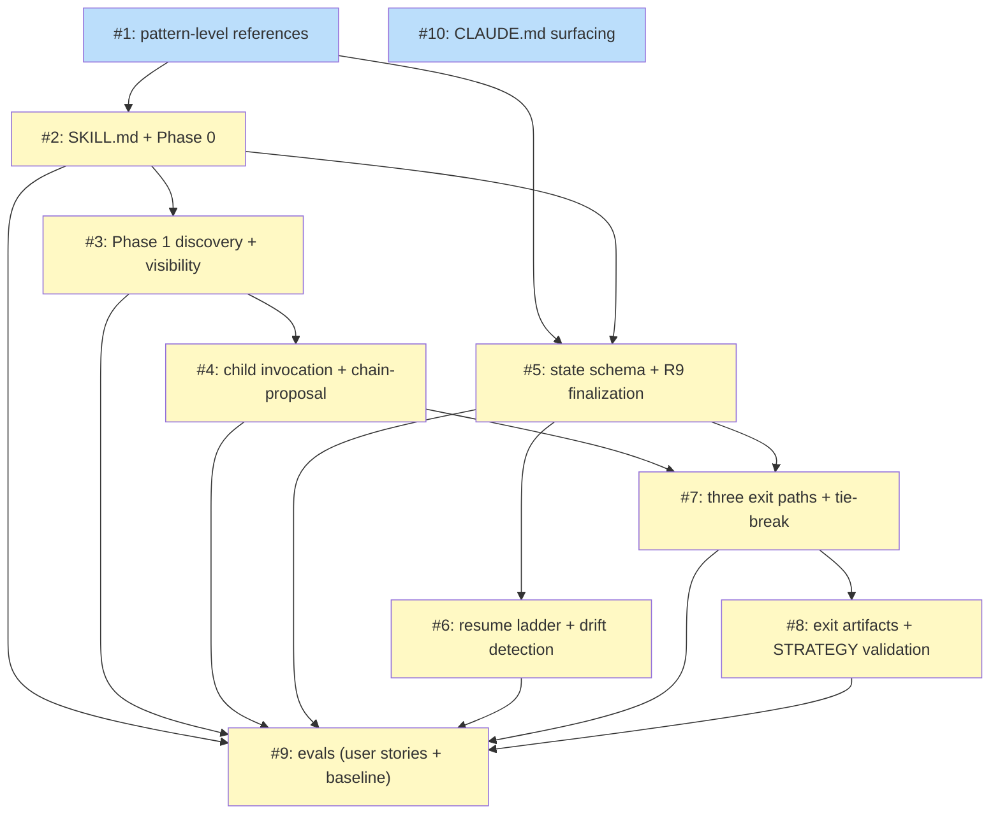

# PLAN: shirabe-charter-skill

## Status

Proposed. The plan was authored 2026-05-24 through 2026-05-25 against the
Accepted shared design at `docs/designs/DESIGN-shirabe-progression-authoring.md`
and the In Progress PRD at `docs/prds/PRD-shirabe-charter-skill.md`. The
fast-path review (categories A scope-gate, B design-fidelity, C
AC-discriminability, D sequencing-integrity) returned PROCEED across all
four reviewers with no critical findings. The plan stops at this status to
let a human reviewer confirm the decomposition before GitHub milestone and
issues are created; once approval lands, the plan transitions to Active and
the issue tracker is populated against this artifact.

The `Proposed` status name is a deviation from the schema's documented `Draft`
and `Active` lifecycle values. See [Open Questions](#open-questions) for the
rationale; the deviation is intentional and surfaces a "doc ready, GitHub
state pending" intermediate state that the documented lifecycle does not
otherwise express.

## Scope Summary

Ship `/charter` as the first parent skill in the shirabe parent-skill
pattern. The plan delivers four new pattern-level reference files at
top-level `references/`, the `/charter` skill loadable at `skills/charter/`
(SKILL.md + phase prose + evals), and CLAUDE.md surfacing so authors
discover `/charter` through the same channels they discover the strategic
chain's existing children. The plan covers `/charter` only — the shared
design also names `/scope` and a future `/work-on` migration as
parent-skill consumers, but each has its own PRD and plan.

## Decomposition Strategy

**Horizontal decomposition.** The design ships as a documentation-only
initiative with three explicitly staged deliverables (Stage 1 pattern-level
references; Stage 2 `/charter` SKILL.md + phase prose + evals; Stage 3
CLAUDE.md surfacing). Each subsequent issue cites the previously landed
ones, and the design's own Implementation Approach is staged dependency
order — horizontal matches the design's discipline. Walking skeleton was
rejected because there is no runtime end-to-end path to exercise: the
deliverables are reference docs, slash-command prose, and CLAUDE.md
additions, with no integration risk to surface via a thin vertical slice.

Issues are organized by deliverable cluster within `/charter`'s
implementation. State-file schema (#5) and resume-ladder logic (#6) are
split out as standalone issues because each is critical-complexity (state
schema is the contract enforcement spine for the R9 finalization check;
resume ladder is the most complex single behavior in the skill).
Decision-Record authoring (#8) is split from exit-path orchestration
logic (#7) because the two answer different questions: "when does each
exit fire?" (logic) versus "what files get written?" (artifact format).

The complexity distribution across the 10 issues is 1 simple, 6 testable,
and 3 critical (Issues 5, 6, 7). Three critical-complexity issues ship
with full Security Checklists per the plan skill's multi-pr ruleset, which
surfaces the public-repo pre-merge visibility of state-file content as
the load-bearing security consideration this design exposes.

## Implementation Issues

### Milestone: Charter Skill

GitHub milestone and issues have not yet been created — the plan is at
`Proposed` status, and milestone / issue creation is gated behind an
explicit go-ahead from the human reviewer (see Status above). The table
below uses internal placeholders `<<ISSUE:N>>` that Phase 7's
`create-issues-batch.sh` substitutes for GitHub issue numbers when the
plan transitions to `Active`.

| Issue | Dependencies | Complexity |
|-------|--------------|------------|
| <<ISSUE:1>>: docs(references): add four parent-skill pattern-level references | None | testable |
| _Author the four new reference files at top-level `references/`: `parent-skill-pattern.md` (contract surface, six semantic invariants including I-6 acknowledged unsatisfied in v1, three exit paths, conditional feeder shape, substitution surfaces, team-shape declarator), `parent-skill-state-schema.md` (five-field minimum vocabulary plus extension discipline), `parent-skill-resume-ladder-template.md` (universal meta-ladder plus parent-specific body slots), and `parent-skill-child-inspection.md` (R14-widened isolation rule plus per-parent surface table). These are the foundation every subsequent issue cites._ | | |
| <<ISSUE:2>>: feat(charter): add SKILL.md with input modes, slug constraint, and Phase 0 wiring | <<ISSUE:1>> | testable |
| _Ship `skills/charter/SKILL.md` with the seven structural elements every parent skill SHALL contain. Wires Phase 0 input parsing: empty arguments triggers a cold-start prompt; freeform topic strings derive a slug that must match the regex `^[a-z0-9-]+$` (rejected at Phase 0 with a clear error). Declares `/charter` as a no-team skill via the prose Team Shape declarator._ | | |
| <<ISSUE:3>>: feat(charter): add Phase 1 discovery, visibility detection, and manual-fallback rule | <<ISSUE:2>> | testable |
| _Author the Phase 1 entry-router prelude: read the repo's visibility from CLAUDE.md's `## Repo Visibility:` header (default to Private with the shipped warning text on missing header), document the manual-fallback non-interference rule, and surface the thesis-shift signal question with its three positive-utterance categories. This issue ships the discovery prose without yet making invocation decisions._ | | |
| <<ISSUE:4>>: feat(charter): add child invocation logic and chain-proposal confirmation prompt | <<ISSUE:3>> | testable |
| _Implement the four child-invocation decisions (`/vision` on the two-OR signal, `/comp` on the three-AND gate with degenerate-silence, `/strategy` always with three valid upstream shapes, `/roadmap` on the STRATEGY shape gates) and the chain-proposal confirmation prompt with literal Proceed / Adjust / Bail options. The /comp degenerate-silence rule ensures the prompt output is byte-identical between public-repo and private-repo-without-/comp invocations._ | | |
| <<ISSUE:5>>: feat(charter): add state file schema and hard finalization check | <<ISSUE:1>>, <<ISSUE:2>> | critical |
| _Specify the full state-file schema at `wip/charter_<topic>_state.md` (pure YAML with a `.md` extension matching shirabe's wip/ convention; eleven fields including the chain-tracking trio, exit field, decision_record_sub_shape, and conditional fields gated by exit type). Author the R9 hard-finalization check that surfaces an error when exit is unset / invalid, when sub-shape is missing for a re-evaluation exit, or when conditional fields are set despite their triggering condition not holding. Critical complexity because the schema is the contract enforcement spine for every other implementation issue._ | | |
| <<ISSUE:6>>: feat(charter): add resume ladder with drift detection and stale-session handling | <<ISSUE:5>> | critical |
| _Implement the ten-row resume ladder with first-match-wins ordering: malformed state → exit set → fresh resume → stale-session (≥ 7 days) → STRATEGY Accepted/Active → STRATEGY Draft → `_discover.md` partial-run → VISION partial-run → on-topic branch → main fallback. The Accepted-STRATEGY row uses "Re-evaluate / Revise / Bail" vocabulary explicitly rejecting "Continue / Start fresh" wording. Child-snapshot dual-check drift detection fires when either frontmatter status or git blob hash differs from the recorded snapshot._ | | |
| <<ISSUE:7>>: feat(charter): add three exit paths and tie-break orchestration | <<ISSUE:4>>, <<ISSUE:5>> | critical |
| _Implement the three exit-path orchestration logic: full-run (Draft STRATEGY plus optional ROADMAP), re-evaluation (with re-evaluation and rejection sub-shapes), abandonment-forced (with the most-recently-running tie-break: last `chain_ran` entry → first `planned_chain` entry with a non-empty wip/ intermediate → clean-cancel fallthrough when neither resolves). The Reject (deliberate Phase 5 finalization) versus Bail (mid-chain abandonment) distinction is load-bearing for the discipline-vs-artifact decoupling and must not be conflated._ | | |
| <<ISSUE:8>>: feat(charter): add exit artifact authoring (Decision Records + abandonment-forced marker + STRATEGY validation pass-through) | <<ISSUE:7>> | testable |
| _Author the exit-artifact templates and authoring rules: Decision Record templates for both re-evaluation and rejection sub-shapes (ADR-style body with named alternatives per sub-shape), the abandonment-forced HTML-comment marker that lives inside the force-materialized artifact's Status section, and the `shirabe validate --visibility=<repo-visibility>` pass-through that gates Draft STRATEGY before declaring chain success._ | | |
| <<ISSUE:9>>: test(charter): add evals covering user stories and shared baseline | <<ISSUE:2>>, <<ISSUE:3>>, <<ISSUE:4>>, <<ISSUE:5>>, <<ISSUE:6>>, <<ISSUE:7>>, <<ISSUE:8>> | testable |
| _Ship `skills/charter/evals/evals.json` with the canonical shared eval baseline (slug rejection, malformed state file, child-internals isolation, visibility default) plus five `/charter`-specific scenarios covering the user stories (cold standalone full-run, re-evaluation, rejection sub-shape, abandonment-forced, reviewer redirect via manual fallback). The shared baseline scenarios are clearly delimited so `/scope` and the future `/work-on` migration can copy-and-adapt them when they land._ | | |
| <<ISSUE:10>>: docs(charter): surface /charter in shirabe and workspace CLAUDE.md | None | simple |
| _Update the shirabe repo's CLAUDE.md to mention `/charter` and include the four trigger phrases (start a strategic conversation, open a charter, think through the bet, direct `/charter <topic>` invocation). The workspace-level CLAUDE.md is composed from per-repo fragments — updating the shirabe-side fragment is sufficient for workspace tooling to assemble the composite._ | | |

## Dependency Graph



**Legend**: Green = done, Blue = ready, Yellow = blocked, Purple = needs-design, Orange = tracks-design/tracks-plan.

## Implementation Sequence

**Critical path** (longest blocked-by chain, 7 issues / 6 edges):

```
#1 -> #2 -> #3 -> #4 -> #7 -> #8 -> #9
```

The alternate path through #5 (`#1 -> #2 -> #5 -> #7 -> #8 -> #9`) is the
same length on the second half but enters at a different leaf; the
critical path above is canonical because the resume ladder branch
(`#5 -> #6 -> #9`) is shorter (5 issues) than the chain branch
(`#3 -> #4 -> #7 -> #8 -> #9`).

**Parallelization opportunities:**

- **Immediate start (Wave 0):** Issues #1 and #10. Issue #1 is the
  foundational reference file set every downstream issue cites. Issue #10
  is fully independent (the CLAUDE.md surfacing only references `/charter`
  by name and can land at any point in the timeline).
- **After #1 (Wave 1):** Issue #2 unblocks.
- **After #2 (Wave 2):** Issues #3 and #5 unblock in parallel. Both
  depend only on completed prerequisites and touch disjoint files.
- **After #3 (Wave 3 — partial):** Issue #4 unblocks. The #5 branch
  (toward #6) is still independent in parallel.
- **After #5 (Wave 3 — partial):** Issue #6 unblocks. Can advance in
  parallel with the #3 → #4 sub-chain.
- **After #4 AND #5 (Wave 4):** Issue #7 unblocks. Issue #6 may still be
  in flight in parallel.
- **After #7 (Wave 5):** Issue #8 unblocks.
- **After #2, #3, #4, #5, #6, #7, #8 all complete (Wave 6):** Issue #9
  (evals) unblocks. This is the final fan-in node.

Peak parallelism occurs in Waves 3-4, when Issue #6 advances alongside
the #3 → #4 → #7 chain and Issue #10 may still be landable.

**Recommended order:** Start Issue #1 and Issue #10 immediately (Wave 0).
After #1 lands, start Issue #2. After #2 lands, work Issues #3 and #5 in
parallel. After #5 lands, start Issue #6 (it advances alongside the
remaining #3 → #4 chain). After both #4 and #5 land, start Issue #7.
After #7 lands, start Issue #8. Issue #9 lands last as the convergence
leaf that exercises the full SKILL.md contract.

## Open Questions

These items are surfaced for human-reviewer attention before the plan
transitions to `Active`. They are intentional choices, not defects — but
each represents a deviation from a documented convention or an
informational finding the fast-path review surfaced.

1. **PLAN status `Proposed` is a custom value.** The schema's documented
   lifecycle is `Draft → Active → Done`. This plan introduces `Proposed`
   to express a "doc fully authored, GitHub milestone and issues not yet
   created, awaiting human reviewer go-ahead" intermediate state. The
   alternative would be to keep the plan at `Draft` and add a
   frontmatter flag like `awaiting_creation: true`, but that conflates
   two distinct meanings of `Draft` ("being authored" versus "authored
   and waiting"). Reviewers may either ratify `Proposed` as a schema
   addition or direct the plan to use one of the documented values; the
   plan transitions to `Active` once GitHub milestone and issues are
   created, regardless of which value lands here.

2. **Milestone name "Charter Skill" deviates from first-heading
   derivation.** The plan skill's documented milestone-naming rule derives
   the title from the source document's first `#` heading
   (`# DESIGN: shirabe-progression-authoring` would produce "Shirabe
   Progression Authoring"). This plan uses "Charter Skill" because the
   design is shared across three parent-skill consumers (`/charter`,
   `/scope`, future `/work-on` migration), and the plan skill's 1:1
   document-to-milestone invariant requires per-parent milestone naming
   when one design fans out to multiple plans. The alternative is
   "Shirabe Progression Authoring (charter)" — same disambiguation,
   more verbose. Reviewers may either ratify "Charter Skill" or direct a
   rename before milestone creation lands.

3. **Issue #1 bundles four reference files in one PR (informational note
   from the Phase 6 scope-gate review).** Issue #1 ships
   `parent-skill-pattern.md`, `parent-skill-state-schema.md`,
   `parent-skill-resume-ladder-template.md`, and
   `parent-skill-child-inspection.md` together with roughly thirty
   acceptance criteria. The reviewer found the bundling defensible at
   this scale because the four files cross-cite each other and reviewing
   them as a coherent set is more valuable than reviewing each file's PR
   in isolation. The alternative — four separate issues — would split
   the cross-citation surface across multiple PRs. If implementer review
   fatigue surfaces during Issue #1 work, a clean post-hoc split into
   four sub-issues is available; until then the bundled shape stands.

## Review Trace

The plan was authored across seven phases (Pre-Phase 0 context resolution,
Phase 1 analysis, Phase 2 milestone, Phase 3 decomposition, Phase 4
parallel issue-body generation by ten decomposers, Phase 5 dependency-DAG
verification, Phase 6 fast-path review). Phase 6 ran four category
reviewers in parallel (scope gate, design fidelity, AC discriminability,
sequencing integrity); all four returned PASS with no critical findings.
The synthesizer's merged verdict is PROCEED with confidence high.
