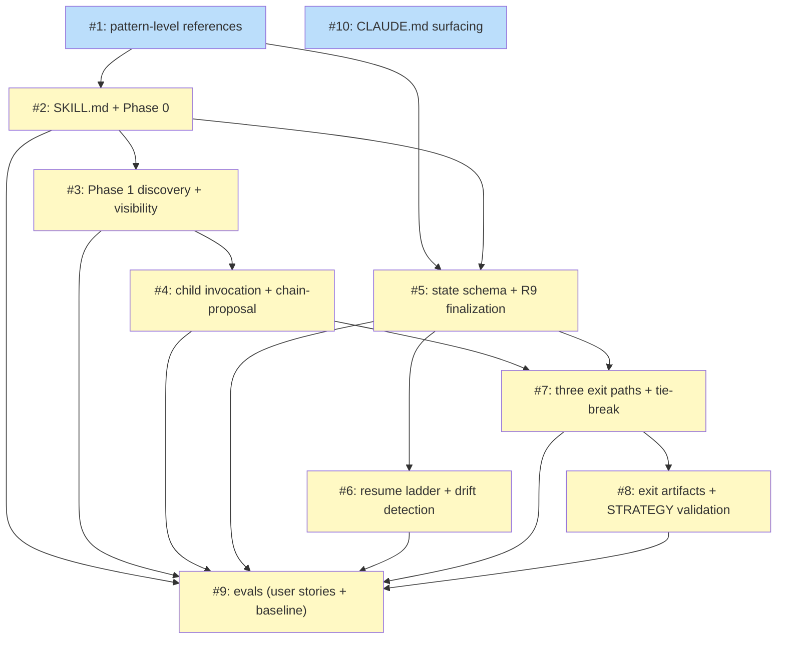

# PLAN: shirabe-charter-skill

## Status

Draft

The plan was authored 2026-05-24 through 2026-05-25 against the
Accepted shared design at `docs/designs/DESIGN-shirabe-progression-authoring.md`
and the In Progress PRD at `docs/prds/PRD-shirabe-charter-skill.md`. The
fast-path review (categories A scope-gate, B design-fidelity, C
AC-discriminability, D sequencing-integrity) returned PROCEED across all
four reviewers with no critical findings.

The plan is **single-pr**: `/charter`'s value lands when the full set of
ten issues ships together (no /charter skill exists until all the
pattern-level references, the SKILL.md body, the state-file schema, the
resume ladder, the exit-path orchestration, the exit-artifact authoring,
the evals, and the CLAUDE.md surfacing are all present). Single-pr is the
right ship shape: all ten issues' implementation work lands as commits on
one feature branch resulting in one pull request against shirabe. No
GitHub issues are created; the outlines below are planning units within
this PLAN doc, not separate trackable tickets. Issue 10's workspace
CLAUDE.md fragment is the only touch outside shirabe — a single small
file in `dot-niwa` — accepted as incidental rather than treated as a
multi-repo split trigger.

## Scope Summary

Ship `/charter` as the first parent skill in the shirabe parent-skill
pattern. The plan delivers four new pattern-level reference files at
top-level `references/`, the `/charter` skill loadable at `skills/charter/`
(SKILL.md + phase prose + evals), and CLAUDE.md surfacing so authors
discover `/charter` through the same channels they discover the strategic
chain's existing children. The plan covers `/charter` only — the shared
design also names `/scope` and a future `/work-on` migration as
parent-skill consumers, but each has its own PRD and plan.

## Decomposition Strategy

**Horizontal decomposition.** The design ships as a documentation-only
initiative with three explicitly staged deliverables (Stage 1 pattern-level
references; Stage 2 `/charter` SKILL.md + phase prose + evals; Stage 3
CLAUDE.md surfacing). Each subsequent issue cites the previously landed
ones, and the design's own Implementation Approach is staged dependency
order — horizontal matches the design's discipline. Walking skeleton was
rejected because there is no runtime end-to-end path to exercise: the
deliverables are reference docs, slash-command prose, and CLAUDE.md
additions, with no integration risk to surface via a thin vertical slice.

Issues are organized by deliverable cluster within `/charter`'s
implementation. State-file schema (#5) and resume-ladder logic (#6) are
split out as standalone issues because each is critical-complexity (state
schema is the contract enforcement spine for the R9 finalization check;
resume ladder is the most complex single behavior in the skill).
Decision-Record authoring (#8) is split from exit-path orchestration
logic (#7) because the two answer different questions: "when does each
exit fire?" (logic) versus "what files get written?" (artifact format).

The complexity distribution across the 10 issues is 1 simple, 6 testable,
and 3 critical (Issues 5, 6, 7). Three critical-complexity issues ship
with full Security Checklists per the plan skill's multi-pr ruleset, which
surfaces the public-repo pre-merge visibility of state-file content as
the load-bearing security consideration this design exposes.

## Implementation Issues

Ten issue outlines that decompose `/charter`'s implementation. Single-pr
mode: these are planning units within this PLAN doc, not GitHub issues to
be filed. The full per-outline bodies authored during Phase 4 persist in
`wip/plan_shirabe-charter-skill_issue_<N>_body.md` and serve as the
detailed implementation reference for whoever lands the work.

| Outline | Dependencies | Complexity |
|---------|--------------|------------|
| 1. docs(references): add four parent-skill pattern-level references | None | testable |
| _Author the four new reference files at top-level `references/`: `parent-skill-pattern.md` (contract surface, **seven** semantic invariants including I-6 acknowledged unsatisfied in v1 and I-7 Active Orchestration, three exit paths, conditional feeder shape, substitution surfaces, team-shape declarator, **and a new Team-Lead Operating Discipline section codifying the sleep-check-nudge loop, the filesystem-evidence-first priority ordering, the three-exit PASS/FAIL/ESCALATE contract, the 5-cycle stagnation patience budget, and the task-class timing table (30s/60s/120s/external-wait); the reviewer-vs-worker role-cardinality distinction; the parents-don't-extend-children's-input-surfaces paragraph; the default-option-wording-as-contract-surface sentence; and the discipline-vs-artifact-decoupling thesis paragraph as the underlying principle behind the three-exit contract**), `parent-skill-state-schema.md` (five-field minimum vocabulary plus extension discipline), `parent-skill-resume-ladder-template.md` (universal meta-ladder plus parent-specific body slots), and `parent-skill-child-inspection.md` (R14-widened isolation rule plus per-parent surface table). These are the foundation every subsequent outline cites._ | | |
| 2. feat(charter): add SKILL.md with input modes, slug constraint, and Phase 0 wiring | 1 | testable |
| _Ship `skills/charter/SKILL.md` with the seven structural elements every parent skill SHALL contain. Wires Phase 0 input parsing: empty arguments triggers a cold-start prompt; freeform topic strings derive a slug that must match the regex `^[a-z0-9-]+$` (rejected at Phase 0 with a clear error). Declares `/charter` as a no-team skill via the prose Team Shape declarator. SKILL.md's orchestrator prelude (the prose introducing Phase 1+ chain orchestration) cites the Team-Lead Operating Discipline section of `references/parent-skill-pattern.md` (invariant I-7) as the contract for how `/charter` runs its child invocations as dispatches; this is a one-line forward reference, not a re-statement of the loop._ | | |
| 3. feat(charter): add Phase 1 discovery, visibility detection, and manual-fallback rule | 2 | testable |
| _Author the Phase 1 entry-router prelude: read the repo's visibility from CLAUDE.md's `## Repo Visibility:` header (default to Private with the shipped warning text on missing header), document the manual-fallback non-interference rule, and surface the thesis-shift signal question with its three positive-utterance categories. This outline ships the discovery prose without yet making invocation decisions._ | | |
| 4. feat(charter): add child invocation logic and chain-proposal confirmation prompt | 3 | testable |
| _Implement the four child-invocation decisions (`/vision` on the two-OR signal, `/comp` on the three-AND gate with degenerate-silence, `/strategy` always with three valid upstream shapes, `/roadmap` on the STRATEGY shape gates) and the chain-proposal confirmation prompt with literal Proceed / Adjust / Bail options. The /comp degenerate-silence rule ensures the prompt output is byte-identical between public-repo and private-repo-without-/comp invocations._ | | |
| 5. feat(charter): add state file schema and hard finalization check | 1, 2 | critical |
| _Specify the full state-file schema at `wip/charter_<topic>_state.md` (pure YAML with a `.md` extension matching shirabe's wip/ convention; eleven fields including the chain-tracking trio, exit field, decision_record_sub_shape, and conditional fields gated by exit type). Author the R9 hard-finalization check that surfaces an error when exit is unset / invalid, when sub-shape is missing for a re-evaluation exit, or when conditional fields are set despite their triggering condition not holding. Critical complexity because the schema is the contract enforcement spine for every other outline._ | | |
| 6. feat(charter): add resume ladder with drift detection and stale-session handling | 5 | critical |
| _Implement the ten-row resume ladder with first-match-wins ordering: malformed state → exit set → fresh resume → stale-session (≥ 7 days) → STRATEGY Accepted/Active → STRATEGY Draft → `_discover.md` partial-run → VISION partial-run → on-topic branch → main fallback. The Accepted-STRATEGY row uses "Re-evaluate / Revise / Bail" vocabulary explicitly rejecting "Continue / Start fresh" wording. Child-snapshot dual-check drift detection fires when either frontmatter status or git blob hash differs from the recorded snapshot._ | | |
| 7. feat(charter): add three exit paths and tie-break orchestration | 4, 5 | critical |
| _Implement the three exit-path orchestration logic: full-run (Draft STRATEGY plus optional ROADMAP), re-evaluation (with re-evaluation and rejection sub-shapes), abandonment-forced (with the most-recently-running tie-break: last `chain_ran` entry → first `planned_chain` entry with a non-empty wip/ intermediate → clean-cancel fallthrough when neither resolves). The Reject (deliberate Phase 5 finalization) versus Bail (mid-chain abandonment) distinction is load-bearing for the discipline-vs-artifact decoupling and must not be conflated._ | | |
| 8. feat(charter): add exit artifact authoring (Decision Records + abandonment-forced marker + STRATEGY validation pass-through) | 7 | testable |
| _Author the exit-artifact templates and authoring rules: Decision Record templates for both re-evaluation and rejection sub-shapes (ADR-style body with named alternatives per sub-shape), the abandonment-forced HTML-comment marker that lives inside the force-materialized artifact's Status section, and the `shirabe validate --visibility=<repo-visibility>` pass-through that gates Draft STRATEGY before declaring chain success._ | | |
| 9. test(charter): add evals covering user stories and shared baseline | 2, 3, 4, 5, 6, 7, 8 | testable |
| _Ship `skills/charter/evals/evals.json` with the canonical shared eval baseline (slug rejection, malformed state file, child-internals isolation, visibility default, **the team-lead-discipline loop ordering — filesystem-check-before-inbox-check — verified via assertion strings on the priority list in `references/parent-skill-pattern.md`**, **the default-option-wording substring requirement — literal "Re-evaluate / Revise / Bail" present at status-aware re-entry against an Accepted/Active child doc; literal "Continue / Start fresh" absent**) plus five `/charter`-specific scenarios covering the user stories (cold standalone full-run, re-evaluation, rejection sub-shape, abandonment-forced, reviewer redirect via manual fallback). The shared baseline scenarios are clearly delimited so `/scope` and the future `/work-on` migration can copy-and-adapt them when they land._ | | |
| 10. docs(charter): surface /charter in shirabe and workspace CLAUDE.md | None | simple |
| _Update the shirabe repo's CLAUDE.md to mention `/charter` and include the four trigger phrases (start a strategic conversation, open a charter, think through the bet, direct `/charter <topic>` invocation). The workspace-level CLAUDE.md is composed from per-repo fragments — updating the shirabe-side fragment is sufficient for workspace tooling to assemble the composite._ | | |

## Dependency Graph



**Legend**: Green = done, Blue = ready, Yellow = blocked, Purple = needs-design, Orange = tracks-design/tracks-plan.

## Implementation Sequence

**Critical path** (longest blocked-by chain, 7 issues / 6 edges):

```
#1 -> #2 -> #3 -> #4 -> #7 -> #8 -> #9
```

The alternate path through #5 (`#1 -> #2 -> #5 -> #7 -> #8 -> #9`) is the
same length on the second half but enters at a different leaf; the
critical path above is canonical because the resume ladder branch
(`#5 -> #6 -> #9`) is shorter (5 issues) than the chain branch
(`#3 -> #4 -> #7 -> #8 -> #9`).

**Parallelization opportunities:**

- **Immediate start (Wave 0):** Issues #1 and #10. Issue #1 is the
  foundational reference file set every downstream issue cites. Issue #10
  is fully independent (the CLAUDE.md surfacing only references `/charter`
  by name and can land at any point in the timeline).
- **After #1 (Wave 1):** Issue #2 unblocks.
- **After #2 (Wave 2):** Issues #3 and #5 unblock in parallel. Both
  depend only on completed prerequisites and touch disjoint files.
- **After #3 (Wave 3 — partial):** Issue #4 unblocks. The #5 branch
  (toward #6) is still independent in parallel.
- **After #5 (Wave 3 — partial):** Issue #6 unblocks. Can advance in
  parallel with the #3 → #4 sub-chain.
- **After #4 AND #5 (Wave 4):** Issue #7 unblocks. Issue #6 may still be
  in flight in parallel.
- **After #7 (Wave 5):** Issue #8 unblocks.
- **After #2, #3, #4, #5, #6, #7, #8 all complete (Wave 6):** Issue #9
  (evals) unblocks. This is the final fan-in node.

Peak parallelism occurs in Waves 3-4, when Issue #6 advances alongside
the #3 → #4 → #7 chain and Issue #10 may still be landable.

**Recommended order:** Start Issue #1 and Issue #10 immediately (Wave 0).
After #1 lands, start Issue #2. After #2 lands, work Issues #3 and #5 in
parallel. After #5 lands, start Issue #6 (it advances alongside the
remaining #3 → #4 chain). After both #4 and #5 land, start Issue #7.
After #7 lands, start Issue #8. Issue #9 lands last as the convergence
leaf that exercises the full SKILL.md contract.

## Open Questions

These items are surfaced for human-reviewer attention. They are
intentional choices, not defects — informational findings the fast-path
review surfaced or known incidental scope items worth naming.

1. **Outline 1 bundles four reference files in one set of commits
   (informational note from the Phase 6 scope-gate review).** Outline 1
   ships `parent-skill-pattern.md`, `parent-skill-state-schema.md`,
   `parent-skill-resume-ladder-template.md`, and
   `parent-skill-child-inspection.md` together with roughly thirty
   acceptance criteria. The reviewer found the bundling defensible at
   this scale because the four files cross-cite each other and landing
   them as a coherent set on the feature branch lets reviewers verify
   the cross-citations directly. The alternative — four separate
   commits / discrete review slices — would force the cross-citation
   surface to be re-read across each slice. If review fatigue surfaces
   during the outline 1 work, a clean split into four commits is
   available; until then the bundled shape stands.

2. **Outline 10 touches a single file outside shirabe (incidental
   cross-repo).** Outline 10 updates `CLAUDE.md` in shirabe AND the
   workspace-level CLAUDE.md fragment in `dot-niwa`. The
   workspace-fragment is ~5 lines and follows the same shape as every
   other shirabe-skill-surfacing fragment in `dot-niwa`. Per the
   single-pr decision, this incidental cross-repo touch is accepted
   rather than split into a separate PR; the workspace fragment ships
   as a small companion change in `dot-niwa` alongside the main
   shirabe PR.

## Review Trace

The plan was authored across seven phases (Pre-Phase 0 context resolution,
Phase 1 analysis, Phase 2 milestone, Phase 3 decomposition, Phase 4
parallel issue-body generation by ten decomposers, Phase 5 dependency-DAG
verification, Phase 6 fast-path review). Phase 6 ran four category
reviewers in parallel (scope gate, design fidelity, AC discriminability,
sequencing integrity); all four returned PASS with no critical findings.
The synthesizer's merged verdict is PROCEED with confidence high.
