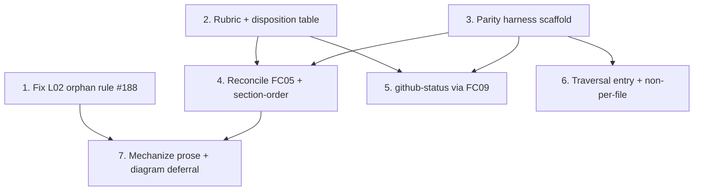

# PLAN: Deterministic check absorption

## Status

Active

Single-pr plan. The seven outlines below are commits within one pull request,
not separate GitHub issues. The PLAN closes when the PR merges and the cascade
transitions the upstream BRIEF, PRD, and DESIGN to their terminal states and
deletes this PLAN.

## Scope Summary

Make the `shirabe-validate` engine the single authority for the in-scope
deterministic document checks: absorb the external CI-script and prose checks
into the existing `checks.rs` dispatch and per-check registry, reconcile the
three overlapping families (frontmatter, required sections, issues table) to one
behavior, prove each absorption with a captured-corpus parity harness, retire
each external copy as its absorption lands, and point mechanized prose at the
engine check by code. Includes the L02 orphan-rule lifecycle fix that currently
reds CI on in-flight, roadmap-less tactical chains.

## Decomposition Strategy

**Horizontal, parity harness as the prerequisite foundation.** The DESIGN states
that its absorption steps are independent per check once the harness exists, and
names the harness as the cutover gate every absorption passes through. The work
surfaces have clear interfaces -- the engine check registry, the harness
fixture/manifest contract, the lifecycle-style traversal entry -- with minimal
runtime interaction, which favors horizontal over a walking skeleton (there is no
end-to-end runtime pipeline to thread; value is delivered per absorbed check).

Two foundations land first: the rubric/disposition table (the scope artifact)
and the parity harness (the gate). The three absorption groups then build on the
harness, and prose mechanization lands once the new codes exist. The L02 fix is
independent of the absorption work and lands first because it unblocks the
lifecycle CI gate on this PR's own planning chain.

## Issue Outlines

### Issue 1: Fix the L02 orphan rule (closes shirabe#188)

**Goal**: Stop `check_orphan` from failing a linked, in-flight tactical chain
(BRIEF<-PRD<-DESIGN) that has no ROADMAP upstream, while preserving the rule's
drift-catching value for a genuinely abandoned single orphan.

**Acceptance Criteria**:
- [ ] A coherent multi-member chain linked by `upstream:` with no ROADMAP root
      and a mid-flight posture (BRIEF Accepted, PRD In Progress, DESIGN Accepted)
      passes `shirabe validate --lifecycle`.
- [ ] A lone non-terminal orphan with nothing downstream and no Active ROADMAP
      upstream still fails L02 (drift-catching value preserved).
- [ ] `docs/decisions/DECISION-orphan-doc-passing-state-rule-2026-06-06.md` is
      updated to record the chain-aware refinement.
- [ ] Regression tests cover both the in-flight-chain pass and the lone-orphan
      fail.

**Dependencies**: None

**Type**: code
**Files**: `crates/shirabe-validate/src/lifecycle.rs`, `docs/decisions/DECISION-orphan-doc-passing-state-rule-2026-06-06.md`

### Issue 2: Record the determinism rubric and disposition table

**Goal**: Land the `Check | Family | Category | Disposition | Engine code |
Rationale` table as the authoritative scope list -- one row per candidate check,
every candidate classified A/B/C/D with its disposition and target engine code.

**Acceptance Criteria**:
- [ ] Every candidate family named in the DESIGN has exactly one table row.
- [ ] The diagram validator is recorded as cost-deferred (category C).
- [ ] The github-status check is recorded as category B, absorbed by extending
      FC09.
- [ ] No candidate is left unclassified; no code change in this issue.

**Dependencies**: None

**Type**: docs
**Files**: `docs/designs/DESIGN-shirabe-check-absorption.md`

### Issue 3: Stand up the parity harness scaffold

**Goal**: Build the captured-corpus rule-set-diff harness
(`absorption_parity.rs` + `absorption-golden/` corpus + `divergences` manifest),
modeled on `transition_parity.rs`, proven with one near-parity frontmatter check.

**Acceptance Criteria**:
- [ ] `crates/shirabe/tests/absorption_parity.rs` compares both sides at
      fired-rule-SET granularity (not pass/fail, not byte-for-byte).
- [ ] `tests/fixtures/absorption-golden/` holds clean plus per-violation docs;
      baselines are committed and asserted against (no live external-script run
      at `cargo test`/CI time).
- [ ] A data-driven `divergences` manifest is consulted for adjudicated edges.
- [ ] The proving frontmatter case is green.

**Dependencies**: None

**Type**: code
**Files**: `crates/shirabe/tests/absorption_parity.rs`

### Issue 4: Reconcile the overlapping families (FC05 + section-order)

**Goal**: Extend FC05 row-shape with the three verified strict-superset gaps
(dependency-link format `[#N](url)`, complexity-value enum, child-design link)
and add a new section-order code (FC04 is presence-only), reconciling by
union-by-default and retiring each external copy in the same change.

**Acceptance Criteria**:
- [ ] FC05 enforces dependency-link format, the complexity-value enum, and the
      child-design link; each new per-file code is registered in
      `is_known_check_code` and selectable via `--check`.
- [ ] Section order is a new code, not an FC04 edit.
- [ ] The parity diff is clean or every deliberate divergence is recorded in the
      manifest; incomparable/scope-widening edges carry a recorded verdict.
- [ ] The external copy of each reconciled family is deleted and CI rewired in
      the same change (no point with the rule in three places); existing FC
      parity is preserved.

**Dependencies**: Blocked by <<ISSUE:2>>, <<ISSUE:3>>

**Type**: code
**Files**: `crates/shirabe-validate/src/checks.rs`, `crates/shirabe-validate/src/validate.rs`

### Issue 5: Absorb the non-overlapping per-file checks (github-status via FC09)

**Goal**: Absorb the category-B github-issue-status edge by extending FC09's
existing orchestrator-injected-state path, plus any other category-A/B per-file
candidate the table lists, each parity-gated and retired in one change.

**Acceptance Criteria**:
- [ ] The github-status edge extends FC09 with no new fetch site or subprocess;
      the injected-state, timeout, output-ceiling, and malformed-payload
      invariants carry over unchanged.
- [ ] Each absorbed check is registered and parity-gated.
- [ ] Each external copy is retired and CI rewired in the same change.

**Dependencies**: Blocked by <<ISSUE:2>>, <<ISSUE:3>>

**Type**: code
**Files**: `crates/shirabe-validate/src/checks.rs`, `crates/shirabe-validate/src/gh.rs`

### Issue 6: Traversal entry and the non-per-file checks

**Goal**: Add a traversal entry modeled on the existing `--lifecycle` modes for
the two checks that are not per-file -- the corpus-wide strikethrough rule and
the document-location-vs-status rule -- with their codes kept out of the per-file
`--check` registry, reusing the traversal's already-contained canonical path.

**Acceptance Criteria**:
- [ ] Both checks run through the lifecycle-style traversal entry.
- [ ] Their codes are excluded from the per-file `--check` registry (like the
      L-family).
- [ ] The location-vs-status check derives its verdict from the traversal's
      already-canonicalized, contained path; it does not re-resolve or join a
      document-supplied path outside the canonical root.
- [ ] Where an external copy exists it is parity-gated and retired atomically.

**Dependencies**: Blocked by <<ISSUE:3>>

**Type**: code
**Files**: `crates/shirabe-validate/src/lifecycle.rs`

### Issue 7: Mechanize the prose and record the diagram deferral

**Goal**: Rewrite mechanized skill/reference prose to reference the engine check
by code instead of restating the rule, and record the diagram validator as a
cost deferral.

**Acceptance Criteria**:
- [ ] Citation swaps land (frontmatter fields -> FC01, valid statuses -> FC02,
      status match -> FC03, section presence -> FC04); each mechanized rule has
      exactly one enumerated definition (in the check).
- [ ] New-check references land (section order, topic-slug regex); runtime steps
      invoke `validate --check <CODE>`; reference prose carries a one-line
      summary plus the code, not a second enumeration.
- [ ] The Phase-0 source-status gate references `--lifecycle-chain` instead of
      restating the per-status stop table.
- [ ] The `wip/` path-hygiene rule stays prose with its reviewer-grep backing.
- [ ] The diagram validator is recorded as a cost deferral.

**Dependencies**: Blocked by <<ISSUE:1>>, <<ISSUE:4>>

**Type**: docs
**Files**: `skills`, `docs/designs/DESIGN-shirabe-check-absorption.md`

## Implementation Issues

Not applicable in single-pr mode -- no GitHub issues are created. The Issue
Outlines above are the commits within one pull request.

## Dependency Graph

## Implementation Sequence

- **Independent first**: Issue 1 (L02 fix) lands first -- it unblocks the
  lifecycle CI gate on this PR's own planning chain and depends on nothing.
- **Foundations**: Issue 2 (scope table) and Issue 3 (parity harness gate) are
  the two prerequisites; they can land in parallel.
- **Absorptions**: Issues 4, 5, and 6 build on the harness. Issue 4 (FC05 +
  section-order) and Issue 5 (github-status) need both foundations; Issue 6
  (traversal) needs the harness only. Once the foundations are green these three
  can land in any order.
- **Mechanization last**: Issue 7 needs Issue 4's section-order code (for its
  citation swap) and is consistent with Issue 1's fixed orphan rule (for the
  `--lifecycle-chain` reference).

Critical path: (Issue 2, Issue 3) -> Issue 4 -> Issue 7.
