# PLAN: shirabe-child-dispatch-contract

## Status

Draft

## Scope Summary

Reconcile the parent-skill pattern's three in-tension passages by landing a single `## Dispatch Contract` section in `references/parent-skill-pattern.md`, propagating cross-references symmetrically from `/scope` and `/charter`, and creating parent-readable `team.yaml` declarations under each of the seven child skill directories. Documentation-only change; introduces no new code paths.

## Decomposition Strategy

**Horizontal decomposition.** The DESIGN's Implementation Approach names sequenced Phases A (3 sub-edits to the pattern reference + state schema), B (5 cross-reference attachment points across two parents), C (7 children × 2 edits each), with D deferred and E folded into A. Phase A creates the cross-reference target; Phases B and C land symmetric edges to it.

Walking skeleton does not apply: this is documentation reconciliation, not a feature with an e2e runtime pipeline to exercise. An artificial e2e-stub would not provide useful integration signal. Each issue stands as a focused, reviewable documentation change.

**Why 13 issues.** Each child in Phase C has tightly-coupled file edits (team.yaml + SKILL.md cross-reference) that split would create trivial half-issues. Phase A's three sub-edits each touch a distinct reference file and can land independently once Issue 1 exists. Phase B splits along the two parents' asymmetric Phase 2 structures: /scope's single `## Child Invocation` section is one attachment point; /charter's four per-child Invocation Rule sections share one file and combine into a single issue.

## Issue Outlines

### [#1: docs(parent-skill-pattern): add Dispatch Contract section](#1-docsparent-skill-pattern-add-dispatch-contract-section)

**Goal**: Land a single new top-level `## Dispatch Contract` section in `references/parent-skill-pattern.md` between `## Team-Shape Declarator` and `## Required SKILL.md Structural Elements`. The section is the single source of truth that every downstream cross-reference (issues 2-13) points at.

**Acceptance Criteria**:
- [ ] Exactly one `## Dispatch Contract` top-level heading exists.
- [ ] Five labelled sub-sections present in order: `### Dispatch Mechanism`, `### Pre-Dispatch State`, `### Observability Surface`, `### Hand-Back Contract`, `### Child Team-Shape Declaration`.
- [ ] Opening paragraph names the contract as a contract, names the Skill tool as the single mechanism, and states symmetric applicability across both parents and all seven children.
- [ ] `### Dispatch Mechanism` names the Skill tool as v1 binding, labels it Layer 2 under `team_primitive`, cross-references R14 for child-isolation.
- [ ] `### Pre-Dispatch State` enumerates four elements: `parent_orchestration:` sentinel (with subfields `invoking_child`, `suppress_status_aware_prompt`, `rationale`), worktree-staleness gate output, state-file fields written before dispatch, and child-side team-shape declaration glob marker. Cross-references `references/parent-skill-state-schema.md`.
- [ ] `### Observability Surface` makes positive statement (durable artifact path polling, `git log`, parent-own wip/ filesystem) AND negative statement (cites R14 for child internals).
- [ ] `### Hand-Back Contract` enumerates: R20 file-existence check, frontmatter `status:` read, git blob hash capture, Phase-N Reject discard-commit detection via `git log <pre_invocation_sha>..HEAD`, validator pass-through, `parent_orchestration:` cleanup, `child_snapshots:` capture.
- [ ] `### Child Team-Shape Declaration` names the glob marker `skills/<name>/team.yaml`, states the schema, states v1 runtime-read semantics (parent does NOT parse at dispatch time; consumed by reviewers, future validator, future amplifier substrate).
- [ ] Closing paragraph carries Layer-1/Layer-2 split label, no-per-parent-override-in-v1 sentence, R11 forward-looking note.
- [ ] Existing `## Team-Shape Declarator` and `## Required SKILL.md Structural Elements` sections are unchanged; I-1 through I-7 wording elsewhere is byte-identical.
- [ ] Section length approximately 110 lines; not split across non-adjacent top-level sections.

**Dependencies**: None

**Type**: docs
**Files**: `references/parent-skill-pattern.md`

### [#2: docs(parent-skill-pattern): rework Binding Notes for /charter and add Binding Notes for /scope](#2-docsparent-skill-pattern-rework-binding-notes-for-charter-and-add-binding-notes-for-scope)

**Goal**: Reword `### Binding Notes for /charter` in `references/parent-skill-pattern.md` to reflect that R19/I-7 binds inside the child against the child's own peers (not at the child-skill-dispatch layer). Add new `### Binding Notes for /scope` symmetrically. Discipline content stays verbatim.

**Acceptance Criteria**:
- [ ] `### Binding Notes for /charter` reworded; binds inside the child.
- [ ] `### Binding Notes for /scope` added symmetrically.
- [ ] Discipline content (sleep-check-nudge loop, terminal exits, timing table, idle-pings rule, nudge content rule, ci_outcome semantics) byte-identical to pre-edit version.
- [ ] Both Binding Notes cite the new `## Dispatch Contract` section as the source of which mechanism the discipline binds against.

**Dependencies**: Blocked by <<ISSUE:1>>

**Type**: docs
**Files**: `references/parent-skill-pattern.md`

### [#3: docs(parent-skill-pattern): annotate state-schema with dispatch-contract cross-reference](#3-docsparent-skill-pattern-annotate-state-schema-with-dispatch-contract-cross-reference)

**Goal**: Add a one-paragraph annotation under the `parent_orchestration:` block schema in `references/parent-skill-state-schema.md` noting that the block is the pre-dispatch state element of the dispatch contract. No schema fields change.

**Acceptance Criteria**:
- [ ] One-paragraph annotation added under `parent_orchestration:` block.
- [ ] Annotation cross-references the new `## Dispatch Contract` section.
- [ ] Names the block as the pre-dispatch state element.
- [ ] Schema fields (`invoking_child`, `suppress_status_aware_prompt`, `rationale`) unchanged; only annotation prose added.

**Dependencies**: Blocked by <<ISSUE:1>>

**Type**: docs
**Files**: `references/parent-skill-state-schema.md`

### [#4: docs(scope,charter): cross-reference Dispatch Contract from parent Team Shape sections](#4-docsscopecharter-cross-reference-dispatch-contract-from-parent-team-shape-sections)

**Goal**: Add a closing cross-reference sentence to `skills/scope/SKILL.md`'s `## Team Shape` section and to `skills/charter/SKILL.md`'s `## Team Shape` section. The cross-reference text is VERBATIM between the two parents.

**Acceptance Criteria**:
- [ ] `skills/scope/SKILL.md`'s `## Team Shape` ends with cross-reference to `${CLAUDE_PLUGIN_ROOT}/references/parent-skill-pattern.md` Dispatch Contract section.
- [ ] `skills/charter/SKILL.md`'s `## Team Shape` ends with the same cross-reference.
- [ ] The cross-reference text differs only in parent name (`/scope` vs `/charter`); pre-formatted diff is empty.
- [ ] Existing prose preserved; cross-reference is additive.
- [ ] Both use `${CLAUDE_PLUGIN_ROOT}/...` form (matches existing idiom in both files).

**Dependencies**: Blocked by <<ISSUE:1>>

**Type**: docs
**Files**: `skills/scope/SKILL.md`, `skills/charter/SKILL.md`

### [#5: docs(scope): cross-reference Dispatch Contract from Phase 2 Child Invocation](#5-docsscope-cross-reference-dispatch-contract-from-phase-2-child-invocation)

**Goal**: Add a leading cross-reference sentence to the `## Child Invocation` section of `skills/scope/references/phases/phase-2-chain-orchestration.md`. Preserves existing "the child's existing input mode" wording.

**Acceptance Criteria**:
- [ ] `## Child Invocation` section begins with cross-reference to `${CLAUDE_PLUGIN_ROOT}/references/parent-skill-pattern.md` Dispatch Contract.
- [ ] Existing "the child's existing input mode: `/<child-name> <topic-slug>`" wording is preserved (or absorbed into the contract section per DESIGN — if absorbed, the Phase 2 step becomes a back-reference).
- [ ] Cross-reference text is identical to Issue 6's cross-reference text.

**Dependencies**: Blocked by <<ISSUE:1>>

**Type**: docs
**Files**: `skills/scope/references/phases/phase-2-chain-orchestration.md`

### [#6: docs(charter): cross-reference Dispatch Contract from Phase 2 per-child Invocation Rules](#6-docscharter-cross-reference-dispatch-contract-from-phase-2-per-child-invocation-rules)

**Goal**: Add a leading cross-reference sentence to each of the four per-child Invocation Rule sections in `skills/charter/references/phases/phase-2-chain-orchestration.md`. The cross-reference text is identical across all four and identical to Issue 5's.

**Acceptance Criteria**:
- [ ] `## /vision Invocation Rule (R4)` begins with the cross-reference.
- [ ] `## /comp Invocation Rule (R5 + R12)` begins with the cross-reference.
- [ ] `## /strategy Invocation Rule (R6)` begins with the cross-reference.
- [ ] `## /roadmap Invocation Rule (R7)` begins with the cross-reference.
- [ ] All four cross-references are byte-identical to each other and to Issue 5's.
- [ ] Per-child Invocation Rule content preserved.

**Dependencies**: Blocked by <<ISSUE:1>>

**Type**: docs
**Files**: `skills/charter/references/phases/phase-2-chain-orchestration.md`

### [#7: docs(brief): add team.yaml and Team Shape section](#7-docsbrief-add-teamyaml-and-team-shape-section)

**Goal**: Create `skills/brief/team.yaml` declaring `parent_layer.peers: []` and `child_layer.peers` with `content-quality-reviewer` and `structural-format-reviewer` (both reviewer cardinality, phase phase-4-validate). Add `## Team Shape` section to `skills/brief/SKILL.md`. Per DESIGN Component 2's verified migration table.

**Acceptance Criteria**:
- [ ] `skills/brief/team.yaml` exists and parses as valid YAML.
- [ ] `parent_layer.peers: []`.
- [ ] `child_layer.peers` lists exactly two reviewer entries with phase `phase-4-validate`: `content-quality-reviewer`, `structural-format-reviewer`.
- [ ] No `upper_bound` field on either entry (reviewer cardinality).
- [ ] `skills/brief/SKILL.md` has `## Team Shape` section cross-referencing `./team.yaml` with v1-not-parsed clarifier.
- [ ] Roster matches DESIGN's verified migration table; do NOT re-derive from SKILL.md skim.

**Dependencies**: Blocked by <<ISSUE:1>>

**Type**: docs
**Files**: `skills/brief/team.yaml`, `skills/brief/SKILL.md`

### [#8: docs(prd): add team.yaml and Team Shape section](#8-docsprd-add-teamyaml-and-team-shape-section)

**Goal**: Create `skills/prd/team.yaml` declaring three reviewers (`completeness-reviewer`, `clarity-reviewer`, `testability-reviewer`) at phase `phase-4-validate`. Add `## Team Shape` to `skills/prd/SKILL.md`. Per DESIGN's verified table.

**Acceptance Criteria**:
- [ ] `skills/prd/team.yaml` exists and parses as valid YAML.
- [ ] `parent_layer.peers: []`.
- [ ] `child_layer.peers` lists exactly three reviewer entries: `completeness-reviewer`, `clarity-reviewer`, `testability-reviewer`.
- [ ] All three at phase `phase-4-validate`, cardinality `reviewer`.
- [ ] No `upper_bound` fields.
- [ ] `skills/prd/SKILL.md` has `## Team Shape` cross-reference.
- [ ] Roster matches DESIGN's verified migration table verbatim.

**Dependencies**: Blocked by <<ISSUE:1>>

**Type**: docs
**Files**: `skills/prd/team.yaml`, `skills/prd/SKILL.md`

### [#9: docs(design): add team.yaml and Team Shape section](#9-docsdesign-add-teamyaml-and-team-shape-section)

**Goal**: Create `skills/design/team.yaml` with the four-peer roster: `decision-researcher` (worker, upper_bound 9, phase-2-execution), `security-researcher` (reviewer, phase-5-security), `architecture-reviewer` (reviewer, phase-6-final-review), `security-reviewer` (reviewer, phase-6-final-review). Add `## Team Shape` to `skills/design/SKILL.md`. THIS IS THE MOST COMPLEX ROSTER — use DESIGN's verified table verbatim; do NOT re-derive (the adversarial review previously caught fabricated role names).

**Acceptance Criteria**:
- [ ] `skills/design/team.yaml` exists and parses as valid YAML.
- [ ] `parent_layer.peers: []`.
- [ ] `child_layer.peers` lists exactly four entries: `decision-researcher` (worker, upper_bound 9, phase-2-execution), `security-researcher` (reviewer, phase-5-security), `architecture-reviewer` (reviewer, phase-6-final-review), `security-reviewer` (reviewer, phase-6-final-review).
- [ ] `decision-researcher` has `upper_bound: 9` (canonical per DESIGN cite).
- [ ] No other entry has `upper_bound`.
- [ ] `skills/design/SKILL.md` has `## Team Shape` cross-reference.
- [ ] Roster matches DESIGN's verified migration table verbatim.

**Dependencies**: Blocked by <<ISSUE:1>>

**Type**: docs
**Files**: `skills/design/team.yaml`, `skills/design/SKILL.md`

### [#10: docs(plan): add team.yaml and Team Shape section](#10-docsplan-add-teamyaml-and-team-shape-section)

**Goal**: Create `skills/plan/team.yaml` with single worker peer `decomposer` (upper_bound 20, phase-4-agent-generation). Critical exclusion: `/review-plan` is a CHILD invocation (Decision 1's contract surface), NOT a peer; must NOT appear. Add `## Team Shape` to `skills/plan/SKILL.md`.

**Acceptance Criteria**:
- [ ] `skills/plan/team.yaml` exists and parses as valid YAML.
- [ ] `parent_layer.peers: []`.
- [ ] `child_layer.peers` lists exactly one entry: `decomposer` (worker, upper_bound 20, phase-4-agent-generation).
- [ ] `/review-plan` is NOT listed as a peer.
- [ ] `skills/plan/SKILL.md` has `## Team Shape` cross-reference.
- [ ] Roster matches DESIGN's verified migration table verbatim.

**Dependencies**: Blocked by <<ISSUE:1>>

**Type**: docs
**Files**: `skills/plan/team.yaml`, `skills/plan/SKILL.md`

### [#11: docs(vision): add team.yaml and Team Shape section](#11-docsvision-add-teamyaml-and-team-shape-section)

**Goal**: Create `skills/vision/team.yaml` with three reviewers (`thesis-quality-reviewer`, `content-boundary-reviewer`, `section-guidance-reviewer`) at phase-4-validate. Add `## Team Shape` to `skills/vision/SKILL.md`.

**Acceptance Criteria**:
- [ ] `skills/vision/team.yaml` exists and parses as valid YAML.
- [ ] `parent_layer.peers: []`.
- [ ] `child_layer.peers` lists exactly three reviewer entries: `thesis-quality-reviewer`, `content-boundary-reviewer`, `section-guidance-reviewer`.
- [ ] All three at phase `phase-4-validate`, cardinality `reviewer`.
- [ ] No `upper_bound` fields.
- [ ] `skills/vision/SKILL.md` has `## Team Shape` cross-reference.
- [ ] Roster matches DESIGN's verified migration table verbatim.

**Dependencies**: Blocked by <<ISSUE:1>>

**Type**: docs
**Files**: `skills/vision/team.yaml`, `skills/vision/SKILL.md`

### [#12: docs(strategy): add team.yaml and Team Shape section](#12-docsstrategy-add-teamyaml-and-team-shape-section)

**Goal**: Create `skills/strategy/team.yaml` with three reviewers (`bet-quality-reviewer`, `altitude-reviewer`, `structural-format-reviewer`) at phase-4-validate. Add `## Team Shape` to `skills/strategy/SKILL.md`.

**Acceptance Criteria**:
- [ ] `skills/strategy/team.yaml` exists and parses as valid YAML.
- [ ] `parent_layer.peers: []`.
- [ ] `child_layer.peers` lists exactly three reviewer entries: `bet-quality-reviewer`, `altitude-reviewer`, `structural-format-reviewer`.
- [ ] All three at phase `phase-4-validate`, cardinality `reviewer`.
- [ ] No `upper_bound` fields.
- [ ] `skills/strategy/SKILL.md` has `## Team Shape` cross-reference.
- [ ] Roster matches DESIGN's verified migration table verbatim.

**Dependencies**: Blocked by <<ISSUE:1>>

**Type**: docs
**Files**: `skills/strategy/team.yaml`, `skills/strategy/SKILL.md`

### [#13: docs(roadmap): add team.yaml and Team Shape section](#13-docsroadmap-add-teamyaml-and-team-shape-section)

**Goal**: Create `skills/roadmap/team.yaml` with three reviewers (`theme-coherence-reviewer`, `sequencing-and-dependency-reviewer`, `annotation-and-boundary-reviewer`) at phase-4-validate. Add `## Team Shape` to `skills/roadmap/SKILL.md`.

**Acceptance Criteria**:
- [ ] `skills/roadmap/team.yaml` exists and parses as valid YAML.
- [ ] `parent_layer.peers: []`.
- [ ] `child_layer.peers` lists exactly three reviewer entries: `theme-coherence-reviewer`, `sequencing-and-dependency-reviewer`, `annotation-and-boundary-reviewer`.
- [ ] All three at phase `phase-4-validate`, cardinality `reviewer`.
- [ ] No `upper_bound` fields.
- [ ] `skills/roadmap/SKILL.md` has `## Team Shape` cross-reference.
- [ ] Roster matches DESIGN's verified migration table verbatim.

**Dependencies**: Blocked by <<ISSUE:1>>

**Type**: docs
**Files**: `skills/roadmap/team.yaml`, `skills/roadmap/SKILL.md`

## Dependency Graph

```mermaid
graph TD
    I1["#1 contract section"]
    I2["#2 Binding Notes"]
    I3["#3 state-schema"]
    I4["#4 parent Team Shape"]
    I5["#5 /scope Phase 2"]
    I6["#6 /charter Phase 2"]
    I7["#7 /brief team.yaml"]
    I8["#8 /prd team.yaml"]
    I9["#9 /design team.yaml"]
    I10["#10 /plan team.yaml"]
    I11["#11 /vision team.yaml"]
    I12["#12 /strategy team.yaml"]
    I13["#13 /roadmap team.yaml"]

    I1 --> I2
    I1 --> I3
    I1 --> I4
    I1 --> I5
    I1 --> I6
    I1 --> I7
    I1 --> I8
    I1 --> I9
    I1 --> I10
    I1 --> I11
    I1 --> I12
    I1 --> I13

    classDef done fill:#c8e6c9,stroke:#2e7d32,color:#1b5e20
    classDef ready fill:#bbdefb,stroke:#1565c0,color:#0d47a1
    classDef blocked fill:#fff9c4,stroke:#f9a825,color:#f57f17
    classDef needsDesign fill:#e1bee7,stroke:#6a1b9a,color:#4a148c
    classDef needsPrd fill:#ffe0b2,stroke:#e65100,color:#bf360c
    classDef needsSpike fill:#d1c4e9,stroke:#4527a0,color:#311b92
    classDef needsDecision fill:#f8bbd0,stroke:#ad1457,color:#880e4f
    classDef tracksDesign fill:#ffccbc,stroke:#bf360c,color:#3e2723
    classDef tracksPlan fill:#b2dfdb,stroke:#00695c,color:#004d40

    class I1 ready
    class I2,I3,I4,I5,I6,I7,I8,I9,I10,I11,I12,I13 blocked
```

**Legend**: Green = done, Blue = ready, Yellow = blocked.

## Implementation Sequence

**Critical path**: Issue 1 alone. Once Issue 1 lands, all other issues unblock simultaneously. The graph has depth 2 with one root and twelve leaves.

**Parallelization**: Issues 2-13 can be implemented in any order after Issue 1. In single-pr mode, they land as sequential commits on a single branch; the commit order is arbitrary. Recommended order to ease review:

1. Issue 1 (contract section) — must land first.
2. Issues 2, 3 (rest of Phase A — pattern reference completes).
3. Issues 4, 5, 6 (Phase B — parent cross-references).
4. Issues 7-13 (Phase C — child team.yaml files; order arbitrary across the seven children).

**Phase D (validator extension)** is deferred per DESIGN and is NOT in this plan. Phase E (forward-looking note) is folded into Issue 1's AC1.9.
