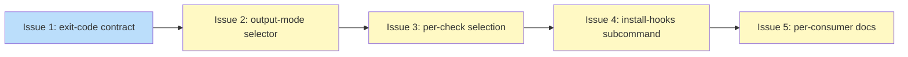

# PLAN: Multi-consumer CLI contract and UX

## Status

Draft

## Scope Summary

Widen `shirabe validate` into the surface three consumers share -- output
modes (`--format annotation|json|human`), per-check selection, a
multi-level exit-code contract aligned with the sibling commands, and an
`install-hooks` subcommand -- layered additively over the existing engine
without changing the annotation bytes CI depends on.

## Decomposition Strategy

**Horizontal.** The design is additive and describes loosely-coupled
components with well-defined boundaries (an exit-code mapping, two new
output renderers, a check-selection filter, a hook installer, and the
contract documentation). Each issue builds one component fully. The
exit-code contract lands first as the shared foundation; the renderers,
the selector, and the hook installer each layer on top; the documentation
follows once the surface is settled.

The five issues form a linear chain rather than a parallel fan-out: Issues
1-4 all extend `crates/shirabe/src/main.rs` (the `ValidateArgs` flags, the
`run_validate` exit mapping, and the `Commands` enum), so sequencing them
keeps a single PR's commits conflict-free and lets each land behind a green
test suite, matching the design's Implementation Approach ordering.

## Issue Outlines

### Issue 1: feat(validate): multi-level exit-code contract

**Goal**: Give `validate` the `0/1/2/3` exit-code contract (clean /
tool-error / violations / I/O) that `transition` and `finalize-chain`
already use.

**Acceptance Criteria**:
- [ ] A clean run exits `0`; a run with error-level violations exits `2`; a
      tool error (unreadable file, bad invocation, parse failure) exits `1`;
      an I/O failure exits `3`.
- [ ] A run producing only notice-level results exits `0` (notices are not
      violations).
- [ ] A run over multiple documents returns the most-severe outcome
      (tool-error outranks violations outranks clean).
- [ ] Existing CI invocations still gate correctly: clean is `0`, any
      non-clean is non-zero.
- [ ] A unit test asserts each exit-code path and the annotation byte-parity
      corpus stays green.

**Dependencies**: None

**Type**: code
**Files**: `crates/shirabe/src/main.rs`

### Issue 2: feat(validate): output-mode selector with versioned JSON and human modes

**Goal**: Add `--format annotation|json|human` (default `annotation`) with a
versioned JSON envelope and a human-readable terminal renderer over the
existing result set.

**Acceptance Criteria**:
- [ ] `--format` defaults to `annotation`; an invocation with no `--format`
      emits byte-identical annotation output (parity corpus green).
- [ ] `--format json` emits a `shirabe-validate/v1` envelope carrying a
      `schema_version`, a summary block, and a flat `findings` array; each
      finding carries `code`, severity (derived from `is_notice()`),
      `message`, `file`, and `line` (`null` when the no-line sentinel is
      present).
- [ ] Every JSON string field is escaped so a crafted field value cannot
      forge sibling fields or extra findings; an adversarial-value test
      corpus (embedded quotes, newlines, control characters) passes.
- [ ] `--format human` emits a terminal-shaped summary with no GitHub
      Actions annotation syntax.

**Dependencies**: Blocked by <<ISSUE:1>>

**Type**: code
**Files**: `crates/shirabe/src/main.rs`, `crates/shirabe-validate/src/lib.rs`

### Issue 3: feat(validate): per-check selection

**Goal**: Add a repeatable, comma-splittable `--check <code>` selector
backed by a known-code registry and a post-filter on emitted results.

**Acceptance Criteria**:
- [ ] `--check FC01` runs only FC01; `--check FC01,FC03` runs exactly those;
      no `--check` runs the full applicable pass for each document's format.
- [ ] A valid but format-inapplicable code (for example `FC05` against a
      BRIEF) is a clean no-op rather than an error.
- [ ] An unknown check code exits with the tool-error code (`1`) and the
      message names the offending code; the message is escaped for whatever
      output channel carries it.

**Dependencies**: Blocked by <<ISSUE:2>>

**Type**: code
**Files**: `crates/shirabe/src/main.rs`, `crates/shirabe-validate/src/validate.rs`

### Issue 4: feat(cli): install-hooks subcommand

**Goal**: Add a flat `install-hooks` subcommand that scaffolds a
self-contained local pre-commit hook calling back into `validate`.

**Acceptance Criteria**:
- [ ] `shirabe install-hooks` writes an executable (`0755`)
      `.git/hooks/pre-commit` that runs `shirabe validate --format human`
      over the staged documents.
- [ ] The hook collects the staged set with `git diff --cached -z
      --name-only --diff-filter=ACMR`, reads it NUL-safely, quotes every
      expansion, and passes paths after a `--` separator; a test with a
      pathologically-named staged file passes without argument-splitting.
- [ ] The hook is fail-closed (any non-zero `validate` exit blocks the
      commit) and exits `0` early when no documents are staged.
- [ ] An existing `pre-commit` hook is left byte-unchanged and the collision
      is reported unless `--force` is given; `--force` overwrites.
- [ ] The installer resolves the real hooks directory (handling the
      worktree/submodule case where `.git` is a file) and emits the resolved
      `shirabe` path at install time.

**Dependencies**: Blocked by <<ISSUE:3>>

**Type**: code
**Files**: `crates/shirabe/src/main.rs`, `crates/shirabe-validate/src/lib.rs`

### Issue 5: docs(validate): per-consumer contract documentation

**Goal**: Document the per-consumer contract (CI, the skills, local hooks)
and update the reusable workflow comments to name the contract they depend
on.

**Acceptance Criteria**:
- [ ] A document under `docs/` states, per consumer, which output mode it
      uses, how it interprets the exit code, and how paths are supplied.
- [ ] The reusable CI workflow's comments name the contract (default
      annotation output, zero/non-zero gate, paths passed in) it relies on.
- [ ] `shirabe validate` passes on the new documentation file.

**Dependencies**: Blocked by <<ISSUE:4>>

**Type**: docs
**Files**: `docs/guides/multi-consumer-cli-contract.md`, `.github/workflows/validate-docs.yml`

## Implementation Issues

Single-pr execution mode: no GitHub issues are created. The work lands as
five sequential commits on one branch, decomposed in the Issue Outlines
section above. This section is intentionally empty in single-pr mode.

## Dependency Graph

**Legend**: Green = done, Blue = ready, Yellow = blocked

## Implementation Sequence

The critical path is the full linear chain: Issue 1 (exit-code contract)
unblocks Issue 2 (output modes), which unblocks Issue 3 (per-check
selection), which unblocks Issue 4 (install-hooks), which unblocks Issue 5
(documentation).

There is no parallelization opportunity: Issues 1-4 all extend
`crates/shirabe/src/main.rs`, so they are deliberately serialized to keep
the single PR's commits conflict-free. Issue 5 is documentation that
describes the settled surface, so it lands last.

Each issue is a self-contained, testable increment that leaves the suite
green, so the PR can be reviewed commit-by-commit.
