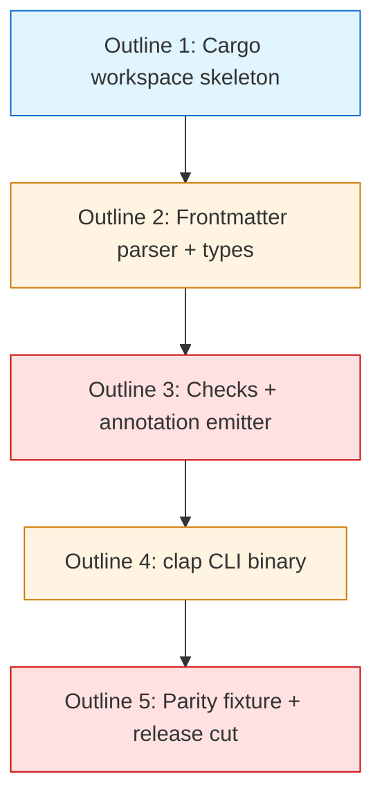

# PLAN: shirabe CLI Rust rewrite

## Status

Draft

This plan decomposes the rewrite into five outline-shaped work units corresponding
to the five sequencing phases in the upstream design's Implementation Approach.
All five outlines ship in **one cohesive replacement PR** per the design's commitment
("There is no cargo feature flag. The two languages coexist as distinct build
targets during outlines 1–4; outline 5 is the cut.").

Single-pr mode applies because the design explicitly forbids a multi-PR rollout
(no Go-Rust feature-flag coexistence window). No GitHub milestone or issues
are created; the outlines below carve the work and the PR commit boundaries
inside the eventual implementation PR.

## Scope Summary

Translate shirabe's `validate` CLI and the underlying validation engine from
~1,417 LOC of Go (`cmd/shirabe/` + `internal/validate/` + `internal/annotation/`)
to Rust as a Cargo workspace (`crates/shirabe-validate` library + `crates/shirabe`
binary), preserving the public output contract byte-for-byte, and atomically
deleting the Go source tree when the rewrite reaches parity.

## Decomposition Strategy

**Horizontal**, layer-by-layer. The design describes five components with stable
interfaces between them (workspace scaffold → frontmatter parser → checks +
annotations → CLI binary → fixtures + release). Each outline builds one layer
fully before the next starts. Walking skeleton was rejected because the design's
sequencing already constrains coexistence: outlines 1–4 build the Rust binary
alongside the Go one without integration risk (parity fixture runs against
the immutable captured baseline, not a live Go binary), and outline 5 is the
non-revertible cut.

## Issue Outlines

### Outline 1 — Cargo workspace skeleton

**Complexity:** simple
**Goal:** establish the Rust build surface alongside the existing Go build.

**Work:**
- Add `Cargo.toml` at repo root with workspace declaration.
- Create `crates/shirabe-validate/` and `crates/shirabe/` with their own
  `Cargo.toml` and empty `src/lib.rs` / `src/main.rs`.
- Add `rust-toolchain.toml` pinning a specific stable Rust version (1.81 or
  newer at implementation time per Decision 6).
- Add a CI step running `cargo build --release` and `cargo test --workspace`
  alongside the existing `go test ./...`. The Rust binary builds as
  `target/release/shirabe-rs` (non-default name) to avoid colliding with the
  Go binary at `./shirabe` during coexistence.

**Acceptance criteria:**
- [ ] `cargo build --workspace` succeeds locally and in CI.
- [ ] `cargo test --workspace` runs (passes trivially — no tests yet).
- [ ] Existing `go test ./...` continues to pass; Go binary still builds.

**Dependencies:** none.

### Outline 2 — Frontmatter parser and Doc/FormatSpec types

**Complexity:** testable
**Goal:** port the YAML frontmatter parser with per-key line-number support,
plus the Doc/FormatSpec type system.

**Work:**
- Port `internal/validate/doc.go` (types) to `crates/shirabe-validate/src/doc.rs`.
- Port `internal/validate/formats.go` (FORMATS map + `detect_format`) to
  `crates/shirabe-validate/src/formats.rs`.
- Implement `parse_doc` using `saphyr` per Decision 1, including the field→line
  reconstruction via per-key `MarkedYamlOwned` markers.
- Port `splitFrontmatter`, `parseYAMLFields`, `bodyAfterLine`, `scanBody` from
  `internal/validate/frontmatter.go`.
- Port every Go table test in `frontmatter_test.go` to `#[test]` cases. All
  must pass.
- Document the saphyr-parser `SpannedEventReceiver` backstop in module-level
  comments per Decision 1's risk-distribution framing.

**Acceptance criteria:**
- [ ] Every Go `frontmatter_test.go` case has a passing Rust equivalent.
- [ ] Per-key `Span` markers correctly populate the field→line map for FC02 and R6
  (the only checks that need them).

**Dependencies:** Outline 1.

### Outline 3 — Validation checks and annotation emitter

**Complexity:** critical
**Goal:** port the seven validation rules and the byte-precise GHA annotation
emitter — the core public contract of `shirabe validate`.

**Work:**
- Port `internal/validate/checks.go` (SCHEMA, FC01–FC04, R6, R7) to
  `crates/shirabe-validate/src/checks.rs`. Each check follows the
  `fn check_<name>(&Doc, &FormatSpec, &Config) -> Vec<ValidationError>` signature
  documented in §Solution Architecture.
- Port `internal/validate/validate.go` (the `validate_file` entry point and
  the format-dispatch switch) to `crates/shirabe-validate/src/validate.rs`.
- Port `internal/annotation/annotation.go` (`format_error`, `format_notice`,
  the GHA byte format) to `crates/shirabe-validate/src/annotation.rs`.
- Implement R6 (`check_plan_upstream`) using `std::process::Command::new("git")`
  with `ls-files --error-unmatch --` — same semantic as the Go `exec.Command`.
- Implement the hand-written `impl std::error::Error` per Decision 4's rationale
  (avoid thiserror leaking through the future-published crate boundary).
- Port every Go test in `checks_test.go` to passing Rust equivalents.

**Acceptance criteria:**
- [ ] Every Go `checks_test.go` case has a passing Rust equivalent.
- [ ] Annotation output matches Go output byte-for-byte for the unit-test corpus.
- [ ] Each check function's signature matches the §Solution Architecture
  documented convention.

**Dependencies:** Outline 2.

### Outline 4 — Binary crate and CLI surface

**Complexity:** testable
**Goal:** wire the clap CLI binary that drives the validate engine and
preserves the public CLI contract byte-for-byte.

**Work:**
- Implement `crates/shirabe/src/main.rs` with the clap `Cli` struct, `Commands`
  enum, and the `run` function per Decision 2's cobra → clap mapping.
- Implement `--version` with the format-matching template (must match Go's
  output byte-for-byte; consumed by the tsuku recipe).
- Implement the `--custom-statuses` 64 KiB cap (mirror the Go guard in
  `main.go`).
- Implement the exit-code contract: 1 on any error annotation; 0 otherwise;
  skip-on-unrecognized-format matches Go's `continue` behavior.
- Add a `build.rs` runtime verification check (per Decision 6) that the
  toolchain matches `rust-toolchain.toml`.
- The binary still builds as `target/release/shirabe-rs` until Outline 5.

**Acceptance criteria:**
- [ ] `shirabe-rs validate <file>` produces identical stdout/stderr/exit-code
  to `shirabe validate <file>` (Go) on the unit-test corpus.
- [ ] `shirabe-rs --version` output matches Go's byte-for-byte.
- [ ] `--custom-statuses` rejects payloads >64 KiB with the same error message
  the Go binary uses.

**Dependencies:** Outline 3.

### Outline 5 — Golden-output fixture, reusable parity workflow, and release pipeline cut

**Complexity:** critical
**Goal:** lock the byte-for-byte preservation contract via the two-layer parity
mechanism, swap the release pipeline to Cargo, and atomically delete the Go
source tree.

**Work:**
- Curate `tests/fixtures/golden/corpus/`: include shirabe's own committed
  artifacts under `docs/` (DESIGN-, PRD-, etc.); build `synthetic/` with edge
  cases enumerated in Decision 3 (sanitize coverage, FC01–FC04 failure paths,
  R6 and R7 paths, parser stress-test inputs, multi-line scalars,
  missing-frontmatter, unrecognized format, mismatched body status).
- Commit `tests/fixtures/capture_go_baseline.sh` (the reproducibility script).
- Run the capture script against `shirabe-go-v0.6.1` (Decision 7's immutable
  baseline) to populate `tests/fixtures/golden/expected/`. Commit `corpus/`
  and `expected/` to the repo.
- Implement `tests/parity_test.rs` asserting byte equality on stdout/stderr/
  exit-code per file.
- Add `.github/workflows/parity-check.yml` as a reusable workflow
  (`on: workflow_call:`) with inputs for `go-baseline-version` and
  `corpus-glob`, downloading matching Go and Rust binaries from shirabe's
  GitHub releases and asserting byte equality on caller corpora.
- Document the workflow's inputs table and failure modes per
  maintainer-reviewer's polish finding.
- Update `.github/workflows/release-binaries.yml` to use Cargo. Verify
  `cargo build --release` produces binaries that pass parity and that the
  release workflow produces matching asset names (per the existing
  `shirabe-<version>-<os>-<arch>` pattern).
- Update `.github/workflows/validate-docs.yml` build step from
  `go build ./cmd/shirabe` to `cargo build --release --bin shirabe`.
- Rename the Rust binary from `shirabe-rs` to `shirabe` in `crates/shirabe/
  Cargo.toml`.
- **Atomic deletion commit:** delete `cmd/`, `internal/`, `go.mod`, `go.sum`
  in the same commit as the binary rename. The deletion is reviewable as
  deletes-plus-one-workflow-line-change in `git log -p`.

**Acceptance criteria:**
- [ ] Every file in `tests/fixtures/golden/corpus/` produces byte-identical
  stdout/stderr/exit-code from the Rust binary as captured in `expected/`.
- [ ] `parity-check.yml` runs successfully as a reusable workflow invoked from
  a test caller workflow.
- [ ] Release pipeline produces `shirabe-<version>-<os>-<arch>` assets
  matching the Go-side asset names byte-for-asset-name.
- [ ] After the deletion commit, no `*.go`, `go.mod`, or `go.sum` files
  remain in the repo.
- [ ] `validate-docs.yml` build step uses `cargo build --release --bin shirabe`.

**Dependencies:** Outline 4.

## Dependency Graph



Strictly linear. Each outline builds on the previous. Outline 5 is the
non-revertible cut — atomic deletion of the Go source tree, release pipeline
swap, and binary rename land together.

## Implementation Sequence

**Critical path:** O1 → O2 → O3 → O4 → O5. All five outlines are on the
critical path; none can parallelize because each ports a layer the next
consumes.

**Estimated effort distribution** (per design's Defensibility Thesis Claim 3
"~1 engineer-week for the CLI proper"):

| Outline | Surface | Effort estimate |
|---------|---------|-----------------|
| O1 | Workspace scaffold | <1 day |
| O2 | Frontmatter + types (~290 LOC + tests, saphyr risk distributed) | 1–2 days |
| O3 | 7 checks + annotation emitter (~570 LOC + tests) | 2–3 days |
| O4 | clap CLI + main glue (~150 LOC + tests) | 1 day |
| O5 | Fixture curation + parity workflow + release cut | 2–3 days |

**Total:** roughly one engineer-week of focused work, consistent with the
upstream design's effort framing.

**Parallelization opportunities:** none within the plan — the chain is
strictly linear. Cross-cutting concerns the implementer can work on in
parallel with any outline:

- Updating `install.sh` to fetch the Rust release asset (no contract change;
  asset names preserved).
- Drafting release-notes wording for the eventual Go → Rust cutover release.

**Single-PR commit structure** (suggested, not prescribed):

```
1. feat(rust): bootstrap Cargo workspace with shirabe-validate + shirabe crates
2. feat(rust): port frontmatter parser and Doc/FormatSpec types
3. feat(rust): port validation checks and annotation emitter
4. feat(rust): wire clap CLI binary with --version and --custom-statuses
5. test(rust): commit golden corpus + capture baseline + parity_test
6. ci: add reusable parity-check.yml workflow
7. ci: swap release-binaries.yml and validate-docs.yml to cargo
8. chore: delete Go source tree, rename shirabe-rs to shirabe (the cut)
```

Reviewers see eight commits but one logical replacement. The cut commit
(#8) is small and obvious by design.
