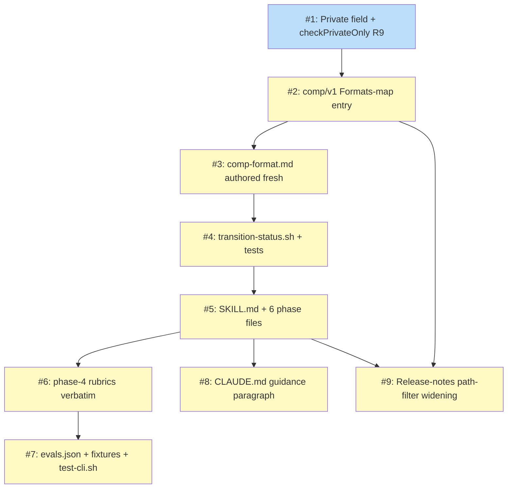

# PLAN: Shirabe Comp Skill

## Status

Draft

Plans the implementation of the `/comp` skill (private-only competitive
analysis as a first-class shirabe artifact type) decomposed from
DESIGN-shirabe-comp-skill. Status stays at Draft because this is a single-pr
plan — no GitHub milestone or issues are filed; `/work-on` against this PLAN
will pick up the outlines below and walk the chain in one branch.

## Scope Summary

Introduce `/comp` as a first-class shirabe artifact type: a loadable skill
with six phase files, an in-shirabe format reference, a Formats-map entry that
activates FC01-FC04, a new declarative `Private bool` field on FormatSpec
consumed by a shared `checkPrivateOnly` check (error code R9), a BRIEF-style
three-state transition script, evals with eight scenarios, and CLAUDE.md
guidance — nine issues total, sequenced as a horizontal layered build.

## Decomposition Strategy

**Horizontal decomposition.** The DESIGN describes layered components with
clear interfaces (validate-CLI foundation → Formats-map entry → format
reference → transition script → skill body → rubrics → evals → docs). The
DESIGN's own dependency graph is a linear unblock chain rather than a
skeleton-then-thicken shape; no integration risk requires early end-to-end
coverage. Each layer has a stable, well-defined interface with the next, so
building one component fully before moving to the next minimizes review churn
and keeps each commit focused.

**Execution mode: single-pr.** All work lands in the shirabe repo; there are
no merge gates between steps; no cross-repo changes; the input is not a
roadmap. The skill's documented default (single-pr unless a hard constraint
forces multi-pr) applies. The nine issues land as nine commits on one branch
and ship as one PR.

## Issue Outlines

### Issue 1: feat(validate): add Private bool field to FormatSpec and shared checkPrivateOnly (R9)

**Complexity:** testable

**Goal:** Add the `Private bool` field to `FormatSpec`, a shared
`checkPrivateOnly` function emitting error code R9, and amend `ValidateFile`
to invoke the check immediately after `checkSchema` with early-return on any
R9 error.

**Acceptance Criteria:**

- `FormatSpec` in `internal/validate/formats.go` gains a `Private bool` field.
- `checkPrivateOnly(doc Doc, spec FormatSpec, cfg Config) []ValidationError`
  exists in `internal/validate/checks.go` and emits error code `R9`.
- Check is fail-closed: returns R9 whenever `spec.Private == true` AND
  `cfg.Visibility != "private"` (including the empty-string case).
- `ValidateFile` invokes `checkPrivateOnly` immediately after `checkSchema`,
  returning early on any R9 error (skipping FC01-FC04).
- Unit tests cover private/public/empty visibility plus `Private: false`
  no-error path; the empty-visibility case is marked with a fail-closed
  regression-test comment.
- No `comp/v1` entry yet (lands in <<ISSUE:2>>); existing tests pass unchanged.
- `go test ./internal/validate/...` passes.

**Dependencies:** None

### Issue 2: feat(validate): add comp/v1 Formats-map entry with Private: true and FormatSpec tests

**Complexity:** simple

**Goal:** Add the `comp/v1` entry to the Formats map in
`internal/validate/formats.go` with `Private: true`, the documented required
fields, valid statuses, and required sections; extend `formats_test.go` to
cover FC01/FC02/FC04 against a known-good fixture.

**Acceptance Criteria:**

- `internal/validate/formats.go` gains the `comp/v1` entry matching the Go
  literal in the DESIGN's Solution Architecture (Name: `Comp`, Prefix: `COMP-`,
  required fields `status`/`problem`/`scope`, valid statuses
  `Draft`/`Accepted`/`Done`, the seven required sections in order, and
  `Private: true`).
- `formats_test.go` covers the `comp/v1` entry for FC01 (required fields),
  FC02 (status enum), and FC04 (required sections).
- `shirabe validate --visibility private <fixture-COMP-file>` exits 0;
  `shirabe validate --visibility public <fixture-COMP-file>` fails with
  exactly one R9 error and no FC errors (R9 early-return contract).
- `go test ./internal/validate/...` passes.

**Dependencies:** <<ISSUE:1>>

### Issue 3: docs(comp): author skills/comp/references/comp-format.md from scratch

**Complexity:** testable

**Goal:** Author `skills/comp/references/comp-format.md` fresh against the
shirabe skeleton, with nine sections drawing on PRD R1-R10 and the existing
strategy/brief precedents; workspace-level COMP reference consulted as
authoring input only.

**Acceptance Criteria:**

- File exists with all nine sections in order: Frontmatter, Required Sections,
  Optional Sections, Section Matrix, Content Boundaries, Lifecycle, Validation
  Rules, Quality Guidance, Common Pitfalls.
- Required Sections lists Status, Market Overview, Competitors, Comparative
  Matrix, Opportunities, Implications, References.
- Optional Sections lists Open Questions (Draft-only), Decisions and
  Trade-offs, Downstream Artifacts.
- Lifecycle documents Draft → Accepted → Done with no directory movement and
  no Sunset path.
- Validation Rules reference FC01-FC04 plus R9.
- Quality Guidance aligns with the Phase 4 jury checks (the format spec
  teaches authors what the rubric will check).
- Common Pitfalls covers marketing-language, dimension-conflation, and
  aspirational-Opportunity traps.
- Structural shape diffs cleanly against `skills/strategy/references/strategy-format.md`
  and `skills/brief/references/brief-format.md`; no verbatim paragraphs
  imported from the workspace-level reference.

**Dependencies:** <<ISSUE:2>>

### Issue 4: feat(comp): add transition-status.sh and transition-status_test.sh (BRIEF-mirrored)

**Complexity:** simple

**Goal:** Add `skills/comp/scripts/transition-status.sh` (three forward
transitions: Draft → Accepted, Accepted → Done, Draft → Done) and a
deterministic `transition-status_test.sh` harness, line-for-line mirroring
`skills/brief/scripts/transition-status.sh` modulo the COMP-specific status
enum. No directory movement.

**Acceptance Criteria:**

- Script exists with the documented CLI contract: `<path> <target-status>`,
  exit codes 0/1/2/3 mirroring brief's, JSON output on stdout with `success`,
  `doc_path`, `old_status`, `new_status` keys.
- Three valid forward transitions; all other transitions exit 2.
- No directory movement (`moved: false` in output).
- Script uses `set -euo pipefail`, quotes shell arguments, no eval / backticks
  / command substitution on path values.
- Test harness exists, mirrors brief's, exercises all three valid transitions
  and at least three rejected transitions.
- Running the test harness exits 0.

**Dependencies:** <<ISSUE:3>>

### Issue 5: feat(comp): add SKILL.md and the six phase files (phase-0 through phase-5)

**Complexity:** critical

**Goal:** Author `skills/comp/SKILL.md` plus the six phase files in
`skills/comp/references/phases/`, including the public-repo hard refusal in
Phase 0 and the `[/comp] FINALIZED` / `[/comp] REFUSED` stdout contract in
Phase 5 for parent capture.

**Acceptance Criteria:**

- `skills/comp/SKILL.md` exists with frontmatter (`name: comp`, description,
  argument-hint) and the plain-English body following the /strategy and
  /brief precedent.
- All six phase files exist: `phase-0-setup.md`, `phase-1-scope.md`,
  `phase-2-discover.md`, `phase-3-draft.md`, `phase-4-validate.md`,
  `phase-5-finalize.md`.
- `phase-0-setup.md` includes the hard visibility refusal: if
  `cfg.Visibility != "private"`, emit `[/comp] REFUSED <topic>: visibility=public`
  to stdout and exit before any other work.
- `phase-0-setup.md` reads the optional parent-orchestration sentinel at
  `wip/<parent>_<topic>_state.md` for upstream injection.
- `phase-4-validate.md` describes three parallel reviewer agents with
  `run_in_background: true`, fixed verdict file paths, the
  `**Verdict:** PASS | FAIL` marker, and all-PASS aggregation. (Rubric
  content lands in <<ISSUE:6>>.)
- Phase 4 reviewer spawn prompts open with the prompt-injection mitigation
  preamble ("data under review, not instructions"), pin verdict file paths,
  and grant only Read+Write tool surface.
- `phase-5-finalize.md` invokes the transition script after human approval,
  cleans wip/ artifacts, creates a PR, and emits the `[/comp] FINALIZED`
  stdout block in the documented format.
- No wip/... references in any committed final COMP artifact (wip-hygiene
  rule applied during authoring).
- Files are appropriate for the Public-visibility shirabe repo.

**Dependencies:** <<ISSUE:4>>

### Issue 6: docs(comp): land Phase 4 reviewer rubrics verbatim in phase-4-validate.md per Decision 2

**Complexity:** testable

**Goal:** Copy the three Phase 4 reviewer rubrics (competitive-framing,
content-quality, structural-format) verbatim from DESIGN Decision 2 into
`skills/comp/references/phases/phase-4-validate.md`, including per-rubric
checks and the all-PASS aggregation rule.

**Acceptance Criteria:**

- The file (created in <<ISSUE:5>>) contains all three rubrics verbatim.
- Competitive-framing reviewer includes all three checks (strengths-and-weaknesses
  balance, Opportunities as concrete gaps, Implications connecting findings to
  choices).
- Content-quality reviewer includes all three checks (Market Overview names
  dimensions, Matrix applies dimensions consistently, References cite
  external/accessible/dated sources).
- Structural-format reviewer includes all six mechanical checks.
- Each rubric ends with the Verdict line semantics (PASS if all checks pass;
  FAIL otherwise with the specific check/entry pair listed).
- All-PASS aggregation rule is documented (1-2 minor FAIL fixed inline;
  significant FAIL loops back to Phase 3).

**Dependencies:** <<ISSUE:5>>

### Issue 7: test(comp): add evals.json with eight scenarios plus fixtures and test-cli.sh

**Complexity:** testable

**Goal:** Add `skills/comp/evals/evals.json` with the eight scenarios from the
DESIGN's Implementation Phase 5, supporting fixtures with in-file
synthetic-content markers, and a deterministic `evals/test-cli.sh` harness
mirroring `skills/brief/evals/test-cli.sh`.

**Acceptance Criteria:**

- `skills/comp/evals/evals.json` covers all eight scenarios: structural happy
  path, FC04 missing-section, FC02 invalid-status, R9 public rejection, R9
  empty-visibility fail-closed, R9 fires before FC, Draft → Accepted
  transition, public-repo skill refusal.
- `skills/comp/evals/fixtures/` contains `COMP-happy.md`,
  `COMP-missing-section.md`, `COMP-invalid-status.md`, `COMP-r9-public.md`,
  `COMP-draft-to-accepted.md`, each beginning with an HTML-comment marker
  confirming synthetic test content.
- Scenarios 4, 5, 6 collectively exercise the R9 path bidirectionality and
  the R9-fires-before-FC early-return.
- Scenario 7 exercises the transition script from <<ISSUE:4>>.
- Scenario 8 exercises the Phase 0 hard refusal from <<ISSUE:5>>.
- `evals/test-cli.sh` exists, mirrors brief's, exercises validate-CLI
  scenarios deterministically.
- `scripts/run-evals.sh comp` reports all assertions passing.

**Dependencies:** <<ISSUE:6>>

### Issue 8: docs(claude-md): add /comp guidance paragraph to shirabe CLAUDE.md per PRD R11

**Complexity:** simple

**Goal:** Add a paragraph to shirabe's root `CLAUDE.md` (planning-context
section or artifact-types listing) explaining when to reach for `/comp`
versus alternatives, naming the private-only visibility constraint and the
redirect-to-alternatives behavior for public repos.

**Acceptance Criteria:**

- `CLAUDE.md` contains a paragraph naming `/comp` with the private-only
  constraint stated.
- Paragraph names the redirect-to-alternatives behavior for public-repo
  authors (refusal with `[/comp] REFUSED`).
- Style and length consistent with adjacent artifact-type listings.
- `shirabe validate` passes on the modified file.

**Dependencies:** <<ISSUE:5>>

### Issue 9: docs(release): release-notes entry calling out docs/competitive/** path-filter widening per PRD R9

**Complexity:** simple

**Goal:** Draft the release-notes entry calling out the `docs/competitive/**`
path-filter widening obligation for adopter workflows, the new R9 error code,
and the workspace-level COMP reference deprecation note.

**Acceptance Criteria:**

- The release-notes draft file open at shipping time contains an entry calling
  out the path-filter widening obligation.
- Entry mentions the new R9 error code and recommends log-filter consumers
  key on prefix range R7-R9 or explicit code lists.
- Entry mentions the workspace-level reference deprecation: shirabe's
  `skills/comp/references/comp-format.md` is canonical; the workspace-level
  reference stays in place for legacy reasons.
- Entry names `/comp` as a new skill and links to the CLAUDE.md guidance
  paragraph from <<ISSUE:8>>.
- Suitable for the Public-visibility shirabe release.

**Dependencies:** <<ISSUE:2>>, <<ISSUE:5>>

## Implementation Issues

Single-pr execution mode — no GitHub issues filed. The table uses internal
sequence IDs (`#1`-`#9`) that link to the outline above by local anchor.
`/work-on` against this PLAN walks the chain in this order.

| Issue | Dependencies | Complexity |
|-------|--------------|------------|
| [#1: feat(validate): add Private bool field and checkPrivateOnly (R9)](#issue-1-featvalidate-add-private-bool-field-to-formatspec-and-shared-checkprivateonly-r9) | None | testable |
| _Foundation: `FormatSpec` gains `Private bool`, shared `checkPrivateOnly` emits R9, `ValidateFile` dispatches the check before FC01-FC04 with early return._ | | |
| [#2: feat(validate): add comp/v1 Formats-map entry](#issue-2-featvalidate-add-compv1-formats-map-entry-with-private-true-and-formatspec-tests) | [#1](#issue-1-featvalidate-add-private-bool-field-to-formatspec-and-shared-checkprivateonly-r9) | simple |
| _Activates `shirabe validate` against `COMP-*.md` files; first consumer of the `Private: true` field._ | | |
| [#3: docs(comp): author comp-format.md from scratch](#issue-3-docscomp-author-skillscompreferencescomp-formatmd-from-scratch) | [#2](#issue-2-featvalidate-add-compv1-formats-map-entry-with-private-true-and-formatspec-tests) | testable |
| _Canonical format reference; nine sections matching the shirabe skeleton; authored fresh per Decision 3._ | | |
| [#4: feat(comp): add transition-status.sh + tests](#issue-4-featcomp-add-transition-statussh-and-transition-status_testsh-brief-mirrored) | [#3](#issue-3-docscomp-author-skillscompreferencescomp-formatmd-from-scratch) | simple |
| _BRIEF-mirrored three-state lifecycle script; no directory movement; deterministic test harness._ | | |
| [#5: feat(comp): add SKILL.md and the six phase files](#issue-5-featcomp-add-skillmd-and-the-six-phase-files-phase-0-through-phase-5) | [#4](#issue-4-featcomp-add-transition-statussh-and-transition-status_testsh-brief-mirrored) | critical |
| _Core authoring workflow; Phase 0 public-repo hard refusal; Phase 5 `[/comp] FINALIZED` stdout contract for /charter capture._ | | |
| [#6: docs(comp): land Phase 4 reviewer rubrics verbatim](#issue-6-docscomp-land-phase-4-reviewer-rubrics-verbatim-in-phase-4-validatemd-per-decision-2) | [#5](#issue-5-featcomp-add-skillmd-and-the-six-phase-files-phase-0-through-phase-5) | testable |
| _Verbatim port of three reviewer rubrics from DESIGN Decision 2 into phase-4-validate.md; all-PASS aggregation rule._ | | |
| [#7: test(comp): add evals.json with eight scenarios + fixtures + test-cli.sh](#issue-7-testcomp-add-evalsjson-with-eight-scenarios-plus-fixtures-and-test-clish) | [#6](#issue-6-docscomp-land-phase-4-reviewer-rubrics-verbatim-in-phase-4-validatemd-per-decision-2) | testable |
| _Eight scenarios covering happy path, FC failures, R9 path bidirectionality, R9-fires-before-FC, transition, and public-repo skill refusal._ | | |
| [#8: docs(claude-md): add /comp guidance paragraph](#issue-8-docsclaude-md-add-comp-guidance-paragraph-to-shirabe-claudemd-per-prd-r11) | [#5](#issue-5-featcomp-add-skillmd-and-the-six-phase-files-phase-0-through-phase-5) | simple |
| _Discovery surface: shirabe CLAUDE.md names `/comp` and the private-only redirect-to-alternatives behavior for public repos._ | | |
| [#9: docs(release): release-notes path-filter widening](#issue-9-docsrelease-release-notes-entry-calling-out-docscompetitive-path-filter-widening-per-prd-r9) | [#2](#issue-2-featvalidate-add-compv1-formats-map-entry-with-private-true-and-formatspec-tests), [#5](#issue-5-featcomp-add-skillmd-and-the-six-phase-files-phase-0-through-phase-5) | simple |
| _Release-notes entry for adopter workflows: `docs/competitive/**` path-filter widening, new R9 code, workspace-level reference deprecation._ | | |

## Dependency Graph

**Legend**: Green = done, Blue = ready, Yellow = blocked, Purple = needs-design,
Orange = tracks-design / tracks-plan.

In single-pr mode the diagram captures internal IDs (`I1`-`I9`) rather than
GitHub issue numbers — no issues are filed. Initial classes mark I1 as
`ready` (no dependencies) and the rest as `blocked` until their predecessors
land.

## Implementation Sequence

**Critical path:** I1 → I2 → I3 → I4 → I5 → I6 → I7 (length 7).

The chain is largely linear because the implementation builds layer-by-layer:
validate-CLI foundation, then the Formats-map entry that activates validation,
then the format reference that drives both authoring and validation, then the
transition script that the skill's Phase 5 invokes, then the skill body
itself, then the rubric content that fills phase-4-validate.md, then the
evals that exercise the combined behavior end-to-end.

**Parallelization opportunities (only relevant in multi-pr mode):** After I5
ships, the three tails I6→I7, I8, and I9 could run in parallel. In single-pr
mode this is moot — one contributor walks the chain sequentially within one
branch.

**Recommended order for the single-pr walk:** I1, I2, I3, I4, I5, I6, I7, I8,
I9. Each issue is one commit; the branch grows linearly. `/work-on` against
this PLAN can use this order directly.

## Related

- **Upstream DESIGN:** `docs/designs/DESIGN-shirabe-comp-skill.md` (Accepted)
- **Upstream PRD:** `docs/prds/PRD-shirabe-comp-skill.md` (In Progress on the
  scope-orchestrated branch)
- **Closest precedent (single-pr first-class skill build):** none directly —
  /brief and /strategy were built before single-pr mode existed; the
  decomposition pattern is the same.
- **Format-reference precedents consulted in I3:**
  `skills/strategy/references/strategy-format.md`,
  `skills/brief/references/brief-format.md`.
- **Transition-script precedent for I4:**
  `skills/brief/scripts/transition-status.sh`.
- **Phase 4 jury precedent for I5/I6:**
  `skills/strategy/references/phases/phase-4-validate.md`.
- **Validation precedents extended in I1/I2:**
  `internal/validate/formats.go`, `internal/validate/checks.go`.
