# PLAN: shirabe pattern v1 ergonomics

## Status

Draft

Phase 6 review verdict: **proceed** as inline-substitute-review under sub-agent dispatch from `/scope`'s chain (`parent_orchestration.invoking_child: plan`, `rationale: fresh-chain`). The revised upstream DESIGN (commit b3a2e9b) applies the lazy-load three-tier preference order; this PLAN's four-batch decomposition mirrors DESIGN D7's revised sequencing. The independence-loss caveat is recorded in the friction log and reproduced on the PR description (cleaned before merge with the rest of wip/ artifacts).

## Scope Summary

Apply the lazy-load principle across the seven pattern-v1 fix classes: extend the Rust validator with six new notice-level checks (Batch 1), author five per-error resolution reference files at `references/fixes/` plus two materialized format references (Batch 2), apply lightweight skill-prose edits — pointer rows, Phase-0 detection lines, format-reference clarifications, CLAUDE.md convention header (Batch 3), and ship validator-pointer-resolution tests (Batch 4). Replaces the original-pass eager-load per-skill subsections with detection-and-pointer rows that the validator dereferences only when the failure fires.

## Decomposition Strategy

**Horizontal decomposition** (four batches per revised DESIGN D7).

Issues are sliced layer-by-layer per the DESIGN's four-batch lazy-load-tier-first sequencing — CLI extensions, reference files, lightweight skill edits, tests. Walking skeleton does not apply: there is no e2e runtime flow to stub. Each batch is independently shippable; R31 backward compatibility holds at every batch boundary because tier-1 checks are notice-level (advisory only, exit-code unchanged) and tier-2 pointers fire only when the validator emits the FC code.

Grouping rules. **Batch 1** (CLI extensions): one issue per validator check function or per CLI sub-command, to bound blast radius per checks.rs change. **Batch 2** (reference files): one issue per file — the seven reference files have distinct content and authoring tone; grouping them would couple unrelated reviews. **Batch 3** (lightweight skill edits): grouped where the edit is identical across skills (per-skill pointer-row + Phase-0 line is the same edit applied eight times; one issue covers all eight). **Batch 4** (tests): one issue covering all new FCs plus the validator-pointer-resolution flow.

Cross-batch edge counts:
- Batch 1 → Batch 2: 6 edges (Batch 2's `references/fixes/*.md` files are dereferenced by Batch 1's FC notice text; the FC codes must exist before the pointers are committed).
- Batch 1 → Batch 3: 2 edges (Batch 3's /scope Phase 0 SKILL prose dereferences Batch 1's slug-prefix CLI extension; CLAUDE.md header lands in Batch 3 but FC-CONVENTIONS detects it from Batch 1).
- Batch 2 → Batch 3: 1 edge (Batch 3's per-skill pointer rows dereference Batch 2's `references/fixes/sub-agent-dispatch.md`).
- Batch 1 → Batch 4: 6 edges (Batch 4's tests dereference all six Batch 1 FCs).
- Batch 2 → Batch 4: 5 edges (Batch 4's pointer-resolution tests dereference all five `references/fixes/*.md` files).

Critical path depth: 3 (Batch-1 Issue → Batch-2 Issue → Batch-4 Issue). Within-batch parallelism: Batch 1's six CLI issues are independent of each other; Batch 2's seven reference files are independent of each other; Batch 3's six skill-edit issues are mostly independent.

## Issue Outlines

### Issue 1: feat(validate): extend check_schema with SCHEMA-MISSING notice and add slug-prefix detection sub-command

**Goal**: Apply DESIGN Batch 1 / R18 / R27 (CLI extension). Extend `crates/shirabe-validate/src/checks.rs` `check_schema` (currently lines 39-51) to emit a SCHEMA-MISSING notice when `doc.schema.is_empty()`. Add the slug-prefix detection capability — either as a new check function reading `docs/` artifact filenames and emitting a notice when an input slug lacks the detected prefix, or as a new validator sub-command (e.g., a separate Rust module exposing `shirabe validate detect-prefix <slug>`). Closes `tsukumogami/shirabe#157` on the validator surface.

**Acceptance Criteria**:
- [ ] `check_schema` emits a SCHEMA-MISSING notice when `doc.schema.is_empty()`.
- [ ] Existing schema-mismatch notice path preserved verbatim.
- [ ] Notice level is "notice" not "error".
- [ ] Slug-prefix detection capability exists (check function or sub-command path).
- [ ] Slug-prefix logic samples `docs/briefs/BRIEF-*.md`, `docs/prds/PRD-*.md`, `docs/designs/DESIGN-*.md`, `docs/plans/PLAN-*.md` filenames; extracts the first hyphenated word after the artifact-type prefix; reports the detected prefix when >50% of artifacts share one.
- [ ] Unit tests cover missing schema / mismatched schema / present schema cases plus slug-prefix detection on a representative fixture set.
- [ ] `tsukumogami/shirabe#157` referenced in code comment or commit message.

**Dependencies**: None

**Type**: code
**Files**: `crates/shirabe-validate/src/checks.rs`, `crates/shirabe-validate/src/validate.rs`

### Issue 2: feat(validate): add FC10 writing-style banned-word check

**Goal**: Apply DESIGN Batch 1 / R20. Add new `check_writing_style` function (FC10) reading banned vocabulary at validate-time from `skills/writing-style/SKILL.md`. Emits notices for each banned-word match including file path, line number, matched word. Notice text references `references/fixes/<placeholder>` if a fixes reference is needed (DESIGN's revised shape suggests writing-style violations fall through to the writing-style reference itself rather than a separate fixes file; the FC10 notice text names the writing-style SKILL.md as the resolution surface).

**Acceptance Criteria**:
- [ ] `check_writing_style` function exists in `crates/shirabe-validate/src/checks.rs`.
- [ ] Function reads banned vocabulary at validate-time (not hardcoded).
- [ ] Function emits notice per match including file path, line number, matched word.
- [ ] Registered in `crates/shirabe-validate/src/validate.rs` dispatch order with FC code FC10.
- [ ] Unit tests cover each of the seven banned words plus clean baseline plus missing-reference graceful path.
- [ ] Notice level matches FC08/FC09 precedent.

**Dependencies**: None

**Type**: code
**Files**: `crates/shirabe-validate/src/checks.rs`, `crates/shirabe-validate/src/validate.rs`

### Issue 3: feat(validate): add FC11 plan-section-structure check dereferencing plan-format.md

**Goal**: Apply DESIGN Batch 1 / R22's validator half. Add new `check_plan_section_structure` function (FC11) reconciling emitted `## Implementation Issues` against the canonical structure from `plan-format.md` (Issue 9 of this PLAN materializes the format reference). Add canonical-structure entries to `crates/shirabe-validate/src/formats.rs` for `plan/v1`. Closes `tsukumogami/shirabe#158` on the validator surface.

**Acceptance Criteria**:
- [ ] `check_plan_section_structure` function exists in `crates/shirabe-validate/src/checks.rs`.
- [ ] Function reconciles emitted `## Implementation Issues` against `plan-format.md` canonical structure.
- [ ] `crates/shirabe-validate/src/formats.rs` contains canonical-structure entries for the `plan/v1` schema.
- [ ] Registered in `crates/shirabe-validate/src/validate.rs` dispatch order with FC code FC11.
- [ ] Notice text includes a pointer to `references/fixes/` if structural drift requires non-deterministic resolution (typically FC11 violations are deterministic, so the notice may be self-contained).
- [ ] `tsukumogami/shirabe#158` referenced in code comment or commit message.

**Dependencies**: Blocked by <<ISSUE:9>>

**Type**: code
**Files**: `crates/shirabe-validate/src/checks.rs`, `crates/shirabe-validate/src/validate.rs`, `crates/shirabe-validate/src/formats.rs`

### Issue 4: feat(validate): add FC12 PLAN/DESIGN field consistency check

**Goal**: Apply DESIGN Batch 1 / R23. Add new `check_plan_design_field_consistency` function (FC12) that greps for field-name conflicts across the PLAN's issue ACs and the upstream DESIGN's structural rubrics. Emits a notice with a pointer to `references/fixes/plan-design-field-consistency.md` (Issue 8 of this PLAN authors the fixes file). The deterministic part (detecting field-name collisions) lives in the validator; the non-deterministic resolution lives in the fixes file.

**Acceptance Criteria**:
- [ ] `check_plan_design_field_consistency` function exists in `crates/shirabe-validate/src/checks.rs`.
- [ ] Function detects field-name conflicts (e.g., a field declared as free-text in one issue and as enum in a sibling issue).
- [ ] Notice text includes a pointer to `references/fixes/plan-design-field-consistency.md`.
- [ ] Registered in `crates/shirabe-validate/src/validate.rs` dispatch order with FC code FC12.
- [ ] Unit tests cover: clean baseline / one conflict / multiple conflicts / no upstream DESIGN (graceful skip).
- [ ] Notice level matches FC08/FC09 precedent.

**Dependencies**: Blocked by <<ISSUE:8>>

**Type**: code
**Files**: `crates/shirabe-validate/src/checks.rs`, `crates/shirabe-validate/src/validate.rs`

### Issue 5: feat(validate): add FC13 eval-fixture frontmatter-line-1 check

**Goal**: Apply DESIGN Batch 1 / R26. Add new `check_eval_fixture_frontmatter` function (FC13) that detects fixtures where `<!--` appears on line 1 before the `---` frontmatter opener. Emits a notice with a pointer to `references/fixes/eval-fixture-frontmatter.md` (Issue 10 of this PLAN authors the fixes file).

**Acceptance Criteria**:
- [ ] `check_eval_fixture_frontmatter` function exists in `crates/shirabe-validate/src/checks.rs`.
- [ ] Function detects `<!--` on line 1 of a fixture file before the `---` opener.
- [ ] Notice text includes a pointer to `references/fixes/eval-fixture-frontmatter.md`.
- [ ] Registered in `crates/shirabe-validate/src/validate.rs` dispatch order with FC code FC13.
- [ ] Unit tests cover: clean baseline / comment-on-line-1 / comment-after-frontmatter (valid) / comment-inside-frontmatter-field (valid).
- [ ] Notice level matches FC08/FC09 precedent.

**Dependencies**: Blocked by <<ISSUE:10>>

**Type**: code
**Files**: `crates/shirabe-validate/src/checks.rs`, `crates/shirabe-validate/src/validate.rs`

### Issue 6: feat(validate): add FC-CONVENTIONS CLAUDE.md headers check

**Goal**: Apply DESIGN Batch 1 / R28. Add new `check_claude_md_conventions` function (FC-CONVENTIONS, or a sub-check folded into an existing convention-check function) that detects missing or malformed `## Release Notes Convention: <path>` header in the per-repo CLAUDE.md. Emits a notice with a pointer to `references/fixes/claude-md-conventions.md` (Issue 11 of this PLAN authors the fixes file).

**Acceptance Criteria**:
- [ ] `check_claude_md_conventions` function exists in `crates/shirabe-validate/src/checks.rs`.
- [ ] Function detects missing or malformed `## Release Notes Convention: <path>` header.
- [ ] Notice text includes a pointer to `references/fixes/claude-md-conventions.md`.
- [ ] Registered in `crates/shirabe-validate/src/validate.rs` dispatch order with FC code FC-CONVENTIONS.
- [ ] Unit tests cover: clean baseline / missing header / malformed header (no path) / valid alternate paths.
- [ ] Notice level matches FC08/FC09 precedent.

**Dependencies**: Blocked by <<ISSUE:11>>

**Type**: code
**Files**: `crates/shirabe-validate/src/checks.rs`, `crates/shirabe-validate/src/validate.rs`

### Issue 7: docs(references): author references/fixes/sub-agent-dispatch.md (merged Decision 1 + Decision 2 resolution)

**Goal**: Author `references/fixes/sub-agent-dispatch.md` per DESIGN Batch 2 / Decision 1 + Decision 2 merged. The file is the canonical resolution prose for sub-agent dispatch fallback selection AND parent_orchestration sentinel consultation. Contents: (a) the five canonical fallback shapes (serial-self-jury, parent-delegated-approval, decision-bypass-with-inline-resolution, inline-substitute-review, deterministic-mode-bypass) with full resolution prose; (b) per-skill binding table mapping each of the eight children to applicable fallback shape(s); (c) sentinel detection convention (three subfields: `invoking_child`, `suppress_status_aware_prompt`, `rationale`); (d) chain-handoff and status-transition routing per rationale (fresh-chain / revise); (e) R8's NOT-covered carve-out paragraph naming `tsukumogami/vision#535` Track B.

**Acceptance Criteria**:
- [ ] `references/fixes/sub-agent-dispatch.md` exists.
- [ ] File documents the five canonical fallback shapes with resolution prose.
- [ ] File contains the per-skill binding table (eight children).
- [ ] File documents the sentinel detection convention (three subfields).
- [ ] File documents the chain-handoff routing per rationale.
- [ ] File contains R8's NOT-covered carve-out (Track B reference).
- [ ] File size is bounded (~50-80 lines target) — designed for lazy-load on demand.

**Dependencies**: None

**Type**: docs
**Files**: `references/fixes/sub-agent-dispatch.md`

### Issue 8: docs(references): author references/fixes/plan-design-field-consistency.md

**Goal**: Author `references/fixes/plan-design-field-consistency.md` per DESIGN Batch 2 / Decision 5 / R23 resolution. The file is the canonical resolution prose for FC12 (Issue 4's check function). Contents: how to interpret an FC12 notice; which side to align to (PLAN vs DESIGN); when to rewrite the AC vs when to revise the DESIGN; when the conflict is intentional and how to suppress.

**Acceptance Criteria**:
- [ ] `references/fixes/plan-design-field-consistency.md` exists.
- [ ] File describes how to interpret FC12 notices.
- [ ] File describes when to align which side.
- [ ] File describes the intentional-conflict suppression path.
- [ ] File size is bounded (~30-50 lines target).

**Dependencies**: None

**Type**: docs
**Files**: `references/fixes/plan-design-field-consistency.md`

### Issue 9: docs(plan): create plan-format.md format reference at canonical altitude

**Goal**: Materialize `skills/plan/references/plan-format.md` per DESIGN Batch 2 / R17. Contents: PLAN frontmatter schema, canonical section list, canonical `## Implementation Issues` structure for single-pr emission (Issues Table with `ID | Title | Status | Notes` columns plus Mermaid dependency diagram), diagram-reconciliation contract (PR #149 precedent), classDef-reconciliation contract (PR #169 precedent). The validator's FC11 check (Issue 3) dereferences this file at validate-time.

**Acceptance Criteria**:
- [ ] `skills/plan/references/plan-format.md` exists.
- [ ] File documents the PLAN frontmatter schema.
- [ ] File lists the canonical PLAN section names.
- [ ] File documents the canonical `## Implementation Issues` structure (table + diagram).
- [ ] File states the diagram-reconciliation contract.
- [ ] File states the classDef-reconciliation contract.
- [ ] File altitude matches brief-format.md / prd-format.md precedent.

**Dependencies**: None

**Type**: docs
**Files**: `skills/plan/references/plan-format.md`

### Issue 10: docs(references): author references/fixes/eval-fixture-frontmatter.md

**Goal**: Author `references/fixes/eval-fixture-frontmatter.md` per DESIGN Batch 2 / Decision 5 / R26 resolution. The file is the canonical resolution prose for FC13 (Issue 5's check function). Contents: the frontmatter parser's `---`-first-non-blank-line requirement, the valid marker placement options (inside a frontmatter field value or after the closing `---` as the first body line), why line-1 markers are forbidden.

**Acceptance Criteria**:
- [ ] `references/fixes/eval-fixture-frontmatter.md` exists.
- [ ] File documents the frontmatter parser's line-1 requirement.
- [ ] File documents the valid marker placement options.
- [ ] File explains why line-1 markers are forbidden.
- [ ] File size is bounded (~20-40 lines target).

**Dependencies**: None

**Type**: docs
**Files**: `references/fixes/eval-fixture-frontmatter.md`

### Issue 11: docs(references): author references/fixes/claude-md-conventions.md

**Goal**: Author `references/fixes/claude-md-conventions.md` per DESIGN Batch 2 / Decision 6 / R28 resolution. The file is the canonical resolution prose for FC-CONVENTIONS (Issue 6's check function). Contents: the canonical `## Release Notes Convention: <path>` header format, the per-repo default (`docs/guides/` for shirabe), cross-references to other CLAUDE.md conventions (`## Repo Visibility:`, `## Planning Context:`, `## Default Scope:`, `## Execution Mode:`).

**Acceptance Criteria**:
- [ ] `references/fixes/claude-md-conventions.md` exists.
- [ ] File documents the canonical `## Release Notes Convention: <path>` header format.
- [ ] File names per-repo defaults.
- [ ] File cross-references other CLAUDE.md conventions.
- [ ] File size is bounded (~20-40 lines target).

**Dependencies**: None

**Type**: docs
**Files**: `references/fixes/claude-md-conventions.md`

### Issue 12: docs(references): author references/fixes/cli-version-preflight.md

**Goal**: Author `references/fixes/cli-version-preflight.md` per DESIGN Batch 2 / Decision 6 / R30 resolution. Located under `references/fixes/` (per the revised DESIGN, renamed from the original-pass `references/cli-version-preflight.md`). Contents: the per-subcommand `shirabe <subcommand> --help` probe convention, the documented manual sed-edit fallback per known-affected subcommand (`shirabe transition` is the v0.6.1 case), the workspace-binary version detection (`shirabe --version`).

**Acceptance Criteria**:
- [ ] `references/fixes/cli-version-preflight.md` exists.
- [ ] File documents the per-subcommand `--help` probe convention.
- [ ] File documents the documented manual sed-edit fallback.
- [ ] File names the workspace-binary version detection mechanism.
- [ ] File size is bounded (~30-60 lines target).

**Dependencies**: None

**Type**: docs
**Files**: `references/fixes/cli-version-preflight.md`

### Issue 13: docs(design): create design-format.md format reference at canonical altitude

**Goal**: Materialize `skills/design/references/design-format.md` per DESIGN Batch 2 / R15. Contents: four-field frontmatter schema (status, problem, decision, rationale, plus optional `upstream:`, `spawned_from:`, `motivating_context:` fields), nine required-section list, context-aware section table (Market Context, Required Tactical Designs, Upstream Design Reference), Implementation Issues ownership convention (table owned by `/plan`, populated during Phase 7 single-pr emission), AND the R25 wip-hygiene carve-out clarification inline (single-rule extension; tier-3 acceptable per DESIGN Decision 5 revised).

**Acceptance Criteria**:
- [ ] `skills/design/references/design-format.md` exists.
- [ ] File documents the four required frontmatter fields and three optional fields.
- [ ] File lists the nine required sections in canonical order.
- [ ] File contains the context-aware section table.
- [ ] File states the Implementation Issues table ownership convention.
- [ ] File contains the R25 wip-hygiene carve-out clarification inline.
- [ ] File altitude matches brief-format.md / prd-format.md precedent.

**Dependencies**: None

**Type**: docs
**Files**: `skills/design/references/design-format.md`

### Issue 14: docs(skills): add detection-and-pointer rows to eight child SKILL.md files

**Goal**: Apply DESIGN Batch 3 lightweight skill edits across all eight child SKILLs in a single mechanical pass. For each of `/brief`, `/prd`, `/design`, `/plan`, `/vision`, `/strategy`, `/roadmap`: add (a) a SHORT Phase-0 (or earliest state-reading phase) detection-and-pointer step (~3 lines: "If the `parent_orchestration:` sentinel is present in `wip/scope_<topic>_state.md` (tactical) or `wip/charter_<topic>_state.md` (strategic), see `references/fixes/sub-agent-dispatch.md`."), and (b) a single new Resume Logic table row whose predicate is "sentinel present in <state-file-path>" and whose action is "see `references/fixes/sub-agent-dispatch.md`" — no inline behavior prose. For `/work-on`: add only the Phase-0 detection line (no Resume Logic row, since R9 scopes the seven authoring children only).

**Acceptance Criteria**:
- [ ] Each of the eight child SKILL.md files contains a Phase-0 detection-and-pointer step.
- [ ] Seven non-`/work-on` children contain a new first-row Resume Logic sentinel-consultation row pointing at the fixes file.
- [ ] No per-skill `### Sub-Agent Dispatch Fallback` subsection is added (eager-load surface NOT created).
- [ ] Existing Resume Logic rows preserved verbatim below the new row.
- [ ] Existing Phase-0 prose preserved verbatim; the detection step is additive.
- [ ] R31 backward compatibility preserved: when the sentinel is absent, the new row's predicate is false and behavior is identical to current direct-invocation.

**Dependencies**: Blocked by <<ISSUE:7>>

**Type**: docs
**Files**: `skills/brief/SKILL.md`, `skills/prd/SKILL.md`, `skills/design/SKILL.md`, `skills/plan/SKILL.md`, `skills/vision/SKILL.md`, `skills/strategy/SKILL.md`, `skills/roadmap/SKILL.md`, `skills/work-on/SKILL.md`

### Issue 15: docs(scope): add Phase 0 slug-prefix CLI invocation and Phase 1 cold-start trim

**Goal**: Apply DESIGN Batch 3 / R27 + R29 to `skills/scope/SKILL.md` and `skills/scope/references/phases/phase-1-discovery.md`. Phase 0 prose grows a step that invokes the slug-prefix CLI capability (per Issue 1) and emits the prompt when the CLI returns a mismatch; the actual sampling lives in the validator. Phase 1 prose (in `phase-1-discovery.md`, already lazy-loaded by /scope) is trimmed to the minimum the workflow logic requires: cold-start projected-PRD evaluation, post-`/prd` re-evaluation gate writing `chain_revised`, framing-shift opener short-circuit on cold-start empty discovery.

**Acceptance Criteria**:
- [ ] `skills/scope/SKILL.md` Phase 0 contains the CLI-invocation step (calls the shirabe-validate slug-prefix detection, branches on the result).
- [ ] No standalone sampling logic is duplicated in the SKILL prose (deterministic detection lives in the CLI per the lazy-load principle).
- [ ] `skills/scope/references/phases/phase-1-discovery.md` contains the cold-start projected-PRD evaluation step.
- [ ] Phase 1 contains the post-`/prd` re-evaluation gate writing `chain_revised` to /scope's state file.
- [ ] Phase 1 contains the framing-shift opener short-circuit on cold-start empty discovery.
- [ ] Phase 1 prose is trimmed (the projection-keyword list, the gate, the short-circuit) — no eager-loaded boilerplate.
- [ ] R31 preserved.

**Dependencies**: Blocked by <<ISSUE:1>>

**Type**: docs
**Files**: `skills/scope/SKILL.md`, `skills/scope/references/phases/phase-1-discovery.md`

### Issue 16: docs(design): add structural-format reviewer to Phase 6 jury

**Goal**: Extend `skills/design/references/phases/phase-6-final-review.md` per DESIGN Batch 3 / R21. Step 6.1 grows a third reviewer (structural-format-reviewer) parallel to the existing architecture-reviewer (step 6.1 lines 25-39) and security-reviewer (lines 41-55). The new reviewer's rubric covers artifact-shape conformance against Issue 13's design-format.md, section presence/order, frontmatter field order, and the R19 budget-vs-spec sub-rubric (heuristics + >50% overshoot threshold). Step 6.2 (Process Review Feedback) feedback table extends to three rows.

**Acceptance Criteria**:
- [ ] Step 6.1 spawns three reviewers (architecture, security, structural-format).
- [ ] Structural-format reviewer's rubric documents the four named items including R19 budget-vs-spec.
- [ ] R19 sub-rubric specifies heuristics and threshold (>50% overshoot).
- [ ] Step 6.2 feedback table extends to three rows.
- [ ] Reviewer is "in addition to" existing reviewers per AC4.4.
- [ ] Serial-self-jury fallback under sub-agent dispatch holds for the new reviewer set (the reviewer dereferences `references/fixes/sub-agent-dispatch.md` when the sentinel is present).

**Dependencies**: Blocked by <<ISSUE:13>>

**Type**: docs
**Files**: `skills/design/references/phases/phase-6-final-review.md`

### Issue 17: docs(plan): add Phase 4 AC anchor-existence prompt step

**Goal**: Apply DESIGN Batch 3 / R24. Add a Phase 4 agent-prompt enrichment step in `skills/plan/references/phases/phase-4-agent-generation.md` covering the per-AC anchor-existence grep: for each AC claiming "annotation only" or "schema fields unchanged", grep the target file at PLAN-authoring time; if the anchor exists, the AC remains; if absent, the AC is rewritten defensively ("annotation added; if anchor missing, this issue includes the minimal anchor definition"). Tier-3 placement; the check is per-AC at generation time, not detectable by the validator (the validator does not have visibility into AC-generation-time intent).

**Acceptance Criteria**:
- [ ] `phase-4-agent-generation.md` contains the AC anchor-existence prompt step.
- [ ] Step describes the grep procedure and the defensive-rewrite path.
- [ ] Step lives in the already-lazy-loaded phase reference (no eager-load into /plan SKILL body).
- [ ] R31 preserved.

**Dependencies**: None

**Type**: docs
**Files**: `skills/plan/references/phases/phase-4-agent-generation.md`

### Issue 18: docs(brief,prd,claude): apply format-reference clarifications and CLAUDE.md Release Notes Convention header

**Goal**: Apply DESIGN Batch 3 mechanical edits across three files in one mechanical pass: (a) `skills/brief/references/brief-format.md` per R11/R12/R13 — insert "private" before "issue numbers" at lines 310-311 with rationale; document the optional `motivating_context:` frontmatter field; name "the downstream PRD's Decisions and Trade-offs section" as the canonical BRIEF Open-Questions closure surface. (b) `skills/prd/references/prd-format.md` per R11/R12/R14/R16 — same private-issue-numbers disambiguation parallel; document `motivating_context:`; surface "Decisions and Trade-offs" in the Optional Sections description as conventional BRIEF Open-Questions closure section; distinguish "competitive findings" from "competitive-analysis-as-an-artifact-type" in Content Boundaries. (c) `CLAUDE.md` per R28 — add `## Release Notes Convention: docs/guides/` header, paralleling existing `## Repo Visibility:`, `## Planning Context:`, `## Default Scope:`, `## Execution Mode:` headers.

**Acceptance Criteria**:
- [ ] `skills/brief/references/brief-format.md` lines 310-311 have "private" inserted before "issue numbers" with rationale.
- [ ] `brief-format.md` documents the optional `motivating_context:` frontmatter field.
- [ ] `brief-format.md` names "the downstream PRD's Decisions and Trade-offs section" as the canonical BRIEF Open-Questions closure surface.
- [ ] `skills/prd/references/prd-format.md` has the parallel private-issue-numbers disambiguation.
- [ ] `prd-format.md` documents `motivating_context:`.
- [ ] `prd-format.md` Optional Sections description names "Decisions and Trade-offs" as the conventional closure section.
- [ ] `prd-format.md` Content Boundaries distinguishes competitive findings from competitive-analysis-as-an-artifact-type.
- [ ] `CLAUDE.md` contains `## Release Notes Convention: docs/guides/` header.
- [ ] New CLAUDE.md header parallels existing convention headers; no new mechanism.

**Dependencies**: None

**Type**: docs
**Files**: `skills/brief/references/brief-format.md`, `skills/prd/references/prd-format.md`, `CLAUDE.md`

## Implementation Issues

Summary table of the 18 atomic issues sequenced across four batches. Local-anchor links jump to each issue's detailed outline above. In single-pr mode, no GitHub issues are created at the time of writing; the table format here mirrors the canonical multi-pr profile so the validator's FC08/FC11 checks (when Issues 3 + 9 land) can reconcile structure without surface-shape adjustments.

| Issue | Dependencies | Complexity |
|-------|--------------|------------|
| [#1: feat(validate): check_schema SCHEMA-MISSING + slug-prefix detection](#issue-1-featvalidate-extend-check_schema-with-schema-missing-notice-and-add-slug-prefix-detection-sub-command) | None | testable |
| _Extend `check_schema` to emit a SCHEMA-MISSING notice when `doc.schema.is_empty()`, and add a slug-prefix detection capability that samples existing artifact filenames and emits a notice when a candidate slug lacks the detected prefix. Closes `tsukumogami/shirabe#157` on the validator surface._ | | |
| [#2: feat(validate): FC10 writing-style check](#issue-2-featvalidate-add-fc10-writing-style-banned-word-check) | None | testable |
| _Add a new FC10 check that reads banned vocabulary at validate-time from `skills/writing-style/SKILL.md` and emits notices for each banned-word match with file path, line number, and matched word._ | | |
| [#3: feat(validate): FC11 plan-section-structure check](#issue-3-featvalidate-add-fc11-plan-section-structure-check-dereferencing-plan-formatmd) | [#9](#issue-9-docsplan-create-plan-formatmd-format-reference-at-canonical-altitude) | testable |
| _Add an FC11 check reconciling the emitted `## Implementation Issues` against the canonical structure from `plan-format.md`, and add canonical-structure entries to `formats.rs` for `plan/v1`. Closes `tsukumogami/shirabe#158` on the validator surface._ | | |
| [#4: feat(validate): FC12 PLAN/DESIGN field consistency check](#issue-4-featvalidate-add-fc12-plandesign-field-consistency-check) | [#8](#issue-8-docsreferences-author-referencesfixesplan-design-field-consistencymd) | testable |
| _Add an FC12 check that detects field-name conflicts across a PLAN's issue ACs and its upstream DESIGN's structural rubrics, with a notice pointing to `references/fixes/plan-design-field-consistency.md` for the non-deterministic resolution prose._ | | |
| [#5: feat(validate): FC13 eval-fixture frontmatter-line-1 check](#issue-5-featvalidate-add-fc13-eval-fixture-frontmatter-line-1-check) | [#10](#issue-10-docsreferences-author-referencesfixeseval-fixture-frontmattermd) | testable |
| _Add an FC13 check that detects eval fixtures where `<!--` appears on line 1 before the `---` frontmatter opener, with a notice pointing to `references/fixes/eval-fixture-frontmatter.md`._ | | |
| [#6: feat(validate): FC-CONVENTIONS CLAUDE.md headers check](#issue-6-featvalidate-add-fc-conventions-claudemd-headers-check) | [#11](#issue-11-docsreferences-author-referencesfixesclaude-md-conventionsmd) | testable |
| _Add an FC-CONVENTIONS check that detects missing or malformed `## Release Notes Convention: <path>` headers in per-repo CLAUDE.md files, with a notice pointing to `references/fixes/claude-md-conventions.md`._ | | |
| [#7: docs(references): author references/fixes/sub-agent-dispatch.md](#issue-7-docsreferences-author-referencesfixessub-agent-dispatchmd-merged-decision-1--decision-2-resolution) | None | testable |
| _Author the canonical resolution prose for sub-agent dispatch fallback selection and `parent_orchestration` sentinel consultation: the five fallback shapes, the per-skill binding table for the eight children, the sentinel detection convention, chain-handoff routing, and the R8 not-covered carve-out._ | | |
| [#8: docs(references): author references/fixes/plan-design-field-consistency.md](#issue-8-docsreferences-author-referencesfixesplan-design-field-consistencymd) | None | simple |
| _Author the canonical resolution prose for FC12: how to interpret an FC12 notice, which side to align (PLAN vs DESIGN), when to rewrite the AC vs revise the DESIGN, and when the conflict is intentional and how to suppress._ | | |
| [#9: docs(plan): create plan-format.md](#issue-9-docsplan-create-plan-formatmd-format-reference-at-canonical-altitude) | None | testable |
| _Materialize `skills/plan/references/plan-format.md` with the PLAN frontmatter schema, canonical section list, canonical `## Implementation Issues` structure for single-pr emission, and the diagram- and classDef-reconciliation contracts. FC11 dereferences this file at validate-time._ | | |
| [#10: docs(references): author references/fixes/eval-fixture-frontmatter.md](#issue-10-docsreferences-author-referencesfixeseval-fixture-frontmattermd) | None | simple |
| _Author the canonical resolution prose for FC13: the frontmatter parser's `---`-first-non-blank-line requirement, valid marker placement options (inside a field value or after the closing `---`), and why line-1 markers are forbidden._ | | |
| [#11: docs(references): author references/fixes/claude-md-conventions.md](#issue-11-docsreferences-author-referencesfixesclaude-md-conventionsmd) | None | simple |
| _Author the canonical resolution prose for FC-CONVENTIONS: the `## Release Notes Convention: <path>` header format, per-repo default (`docs/guides/` for shirabe), and cross-references to other CLAUDE.md convention headers._ | | |
| [#12: docs(references): author references/fixes/cli-version-preflight.md](#issue-12-docsreferences-author-referencesfixescli-version-preflightmd) | None | simple |
| _Author the canonical preflight reference under `references/fixes/`: the per-subcommand `shirabe <subcommand> --help` probe, the documented manual sed-edit fallback for known-affected subcommands, and the workspace-binary version detection via `shirabe --version`._ | | |
| [#13: docs(design): create design-format.md](#issue-13-docsdesign-create-design-formatmd-format-reference-at-canonical-altitude) | None | testable |
| _Materialize `skills/design/references/design-format.md` with the four-field frontmatter schema plus optional fields, the nine required-section list, the context-aware section table, the Implementation Issues ownership convention, and the inline R25 wip-hygiene carve-out clarification._ | | |
| [#14: docs(skills): pointer rows in 8 child SKILLs](#issue-14-docsskills-add-detection-and-pointer-rows-to-eight-child-skillmd-files) | [#7](#issue-7-docsreferences-author-referencesfixessub-agent-dispatchmd-merged-decision-1--decision-2-resolution) | simple |
| _Apply Batch 3 lightweight skill edits across all eight child SKILLs in one mechanical pass: a short Phase-0 detection-and-pointer step plus a single Resume Logic row pointing at `references/fixes/sub-agent-dispatch.md` (with `/work-on` getting only the Phase-0 line)._ | | |
| [#15: docs(scope): Phase 0 CLI invocation + Phase 1 cold-start trim](#issue-15-docsscope-add-phase-0-slug-prefix-cli-invocation-and-phase-1-cold-start-trim) | [#1](#issue-1-featvalidate-extend-check_schema-with-schema-missing-notice-and-add-slug-prefix-detection-sub-command) | simple |
| _Grow `/scope` Phase 0 with a step that invokes the slug-prefix CLI capability and emits the prompt on mismatch, and trim `phase-1-discovery.md` to the minimum the workflow requires (cold-start projected-PRD evaluation, post-`/prd` re-evaluation gate, framing-shift short-circuit)._ | | |
| [#16: docs(design): Phase 6 structural-format reviewer](#issue-16-docsdesign-add-structural-format-reviewer-to-phase-6-jury) | [#13](#issue-13-docsdesign-create-design-formatmd-format-reference-at-canonical-altitude) | testable |
| _Extend `/design` Phase 6 step 6.1 with a third reviewer (structural-format-reviewer) parallel to the existing architecture and security reviewers, covering shape conformance against `design-format.md` plus the R19 budget-vs-spec sub-rubric. Step 6.2's feedback table extends to three rows._ | | |
| [#17: docs(plan): Phase 4 AC anchor-existence prompt](#issue-17-docsplan-add-phase-4-ac-anchor-existence-prompt-step) | None | simple |
| _Add a Phase 4 agent-prompt enrichment step covering the per-AC anchor-existence grep: for each AC claiming "annotation only" or "schema fields unchanged", grep the target file at PLAN-authoring time, and rewrite the AC defensively if the anchor is absent._ | | |
| [#18: docs(brief,prd,claude): format clarifications + CLAUDE.md header](#issue-18-docsbriefprdclaude-apply-format-reference-clarifications-and-claudemd-release-notes-convention-header) | None | simple |
| _Apply Batch 3 mechanical edits across three files: brief-format.md and prd-format.md private-issue-numbers disambiguation plus `motivating_context:` and BRIEF-Open-Questions-closure surfacing, and a `## Release Notes Convention: docs/guides/` header in CLAUDE.md._ | | |

## Dependency Graph

```mermaid
graph TD
  I1["#1: check_schema + slug-prefix"]
  I2["#2: FC10 writing-style"]
  I3["#3: FC11 plan-section-structure"]
  I4["#4: FC12 field consistency"]
  I5["#5: FC13 eval-fixture"]
  I6["#6: FC-CONVENTIONS"]
  I7["#7: fixes/sub-agent-dispatch.md"]
  I8["#8: fixes/plan-design-field-consistency.md"]
  I9["#9: plan-format.md"]
  I10["#10: fixes/eval-fixture-frontmatter.md"]
  I11["#11: fixes/claude-md-conventions.md"]
  I12["#12: fixes/cli-version-preflight.md"]
  I13["#13: design-format.md"]
  I14["#14: 8 child SKILL pointer rows"]
  I15["#15: /scope Phase 0 + Phase 1"]
  I16["#16: /design Phase 6 reviewer"]
  I17["#17: /plan Phase 4 prompt"]
  I18["#18: brief/prd/CLAUDE.md edits"]

  I9 --> I3
  I8 --> I4
  I10 --> I5
  I11 --> I6
  I7 --> I14
  I1 --> I15
  I13 --> I16

  classDef done fill:#c8e6c9
  classDef ready fill:#bbdefb
  classDef blocked fill:#fff9c4
  classDef needsDesign fill:#e1bee7
  classDef needsPrd fill:#b3e5fc
  classDef needsSpike fill:#ffcdd2
  classDef needsDecision fill:#d1c4e9
  classDef tracksDesign fill:#FFE0B2,stroke:#F57C00,color:#000
  classDef tracksPlan fill:#FFE0B2,stroke:#F57C00,color:#000

  class I1,I2,I7,I8,I9,I10,I11,I12,I13,I17,I18 ready
  class I3,I4,I5,I6,I14,I15,I16 blocked
```

**Legend**: Green = done, Blue = ready, Yellow = blocked, Purple = needs-design, Orange = tracks-design/tracks-plan.

## Implementation Sequence

**Critical path** (depth 3): Issue 9 → Issue 3 → tests (subsumed by the Batch-1-CLI completion-check, which depends on every FC including FC11).

Issue 9 (plan-format.md) is the load-bearing root: Issue 3's FC11 validator check dereferences it at validate-time. Closing the #158 contract drift on the validator surface requires Issue 9 first.

Issue 13 (design-format.md) is the load-bearing root for Issue 16 (Phase 6 structural-format reviewer rubric dereferences it).

**Immediate-start (ready, no dependencies)**: Issues 1, 2, 7, 8, 9, 10, 11, 12, 13, 17, 18. Eleven independent issues; can be parallelized fully.

**After Issue 1**: Issue 15 (/scope Phase 0 invokes the Batch-1 slug-prefix CLI capability).

**After Issue 7**: Issue 14 (eight SKILL pointer rows dereference `references/fixes/sub-agent-dispatch.md`).

**After Issue 8**: Issue 4 (FC12 notice text dereferences `references/fixes/plan-design-field-consistency.md`).

**After Issue 9**: Issue 3 (FC11 dereferences plan-format.md at validate-time).

**After Issue 10**: Issue 5 (FC13 notice text dereferences `references/fixes/eval-fixture-frontmatter.md`).

**After Issue 11**: Issue 6 (FC-CONVENTIONS notice text dereferences `references/fixes/claude-md-conventions.md`).

**After Issue 13**: Issue 16 (Phase 6 structural-format reviewer dereferences design-format.md).

**Recommended order** (single-pr mode lands all in one PR; the order is for the implementing agent's sequencing inside that PR):

1. Open with Batch 2 reference files (Issues 7, 8, 9, 10, 11, 12, 13) — these are pure-docs and unblock the validator checks plus skill edits that dereference them.
2. Land Batch 1 CLI extensions (Issues 1, 2, 3, 4, 5, 6) once their referenced fixes files exist.
3. Apply Batch 3 lightweight skill edits (Issues 14, 15, 16, 17, 18) once their referenced reference files and CLI capabilities exist.
4. (Batch 4 tests are folded into the same PR for single-pr mode; each Batch-1 issue's AC requires unit tests as a sub-requirement.)

This ordering matches DESIGN D7-revised's four-batch lazy-load-tier-first sequencing.

## References

- Upstream DESIGN: `docs/designs/DESIGN-shirabe-pattern-v1-ergonomics.md` (Accepted, revised at commit b3a2e9b).
- Upstream PRD: `docs/prds/PRD-shirabe-pattern-v1-ergonomics.md` (Accepted, cascade-edited at commit 4617bd2).
- Upstream BRIEF: `docs/briefs/BRIEF-shirabe-pattern-v1-ergonomics.md` (Accepted).
- `tsukumogami/vision#514` — Track A scope; the consolidated set of inside-pattern observations.
- `tsukumogami/vision#535` — Track B (amplifier-layer mandate refinement), out of scope here.
- `tsukumogami/shirabe#157` — validator schema silent-skip bug; closed by Issue 1.
- `tsukumogami/shirabe#158` — `/plan` single-pr `## Implementation Issues` contract drift; closed by Issues 3 + 9.
