# PLAN: shirabe pattern v1 ergonomics

## Status

Draft

Phase 6 review verdict: **proceed** as inline-substitute-review under sub-agent dispatch from `/scope`'s chain (`parent_orchestration.invoking_child: plan`, `rationale: fresh-chain`); the v0.9.1-dev `/plan` SKILL.md doesn't yet ship the inline-substitute-review variant that Issue 13 of this PLAN documents — the fallback was walked under this PLAN's own R6 contract ahead of landing, dogfooded the same way the upstream DESIGN's Phase 6 ran. The independence-loss caveat is recorded in the friction log and reproduced on the PR description (cleaned before merge with the rest of wip/ artifacts).

## Scope Summary

Land one canonical contract per fix-class at the pattern level plus per-skill citations, materialize the two missing format references at the canonical altitude, extend `/design` Phase 6 jury with a structural-format reviewer, grow `/plan` Phase 3/4/7 with consistency checks, grow `/scope` Phase 0/1 with convention + cold-start handling, add a shared CLI-version preflight reference, and extend the Rust validator with three notice-level checks. Sequenced in three batches per DESIGN D7 (pattern upstream → per-skill consumers → validator downstream) so per-skill citations dereference canonical statements that already exist at the moment of citation.

## Decomposition Strategy

**Horizontal decomposition** (three batches per DESIGN D7).

Issues are sliced layer-by-layer per the DESIGN's three-batch sequencing — pattern-level upstream, per-skill consumers, validator downstream. Walking skeleton does not apply: there is no e2e runtime flow to stub. Each layer is independently shippable; R31 backward compatibility holds at every layer boundary because the `parent_orchestration:` sentinel gates every new fallback path (absent sentinel falls through to existing behavior).

Grouping rule for Batch 2: one issue per SKILL.md (Resume Logic sentinel-consultation row + `### Sub-Agent Dispatch Fallback` subsection bundled together for each skill), to bound blast radius per file. For Batch 3: one issue per validator-feature (FC code or single check function change).

Cross-batch edge counts:
- Batch 1 → Batch 2: 16 edges (per-skill citations dereference pattern-level statements)
- Batch 1 → Batch 3: 1 edge (FC11 dereferences plan-format.md at validate-time)
- Batch 2 → Batch 3: 0 edges (validator operates on artifact contents, not on per-skill consumer prose)

Critical path depth: 3 (Issue 5 → Issue 14 → Issue 22). Within-batch parallelism: 11 issues are depth-0.

## Issue Outlines

### Issue 1: docs(references): add `## Sub-Agent Dispatch Fallbacks` section to parent-skill-pattern.md

**Goal**: Land the canonical contract for the five sub-agent dispatch fallback shapes (serial-self-jury, parent-delegated-approval, decision-bypass-with-inline-resolution, inline-substitute-review, deterministic-mode-bypass) plus R8's NOT-covered carve-out at the pattern level so per-skill citations can dereference one source of truth.

**Acceptance Criteria**:
- [ ] `references/parent-skill-pattern.md` contains a top-level `## Sub-Agent Dispatch Fallbacks` section positioned after `## Team-Lead Operating Discipline`.
- [ ] Section names all five canonical fallback shapes with the operating conditions for each.
- [ ] Section's serial-self-jury subsection states "verdict-preamble surfaces operating context and independence-loss caveat".
- [ ] Section's decision-bypass-with-inline-resolution subsection states the two engagement conditions and the DESIGN-side recording requirement.
- [ ] Section closes with a carve-out paragraph naming `tsukumogami/vision#535` Track B.
- [ ] Direct-invocation behavior preserved.

**Dependencies**: None

**Type**: docs
**Files**: `references/parent-skill-pattern.md`

### Issue 2: docs(references): add `### Child-Side Sentinel Consultation Row Convention` subsection to parent-skill-pattern.md

**Goal**: Add the canonical Resume Logic sentinel-consultation row template plus the per-skill state-file-path table inside the existing `## Conditional Feeder Invocation Shape` section so seven child Resume Logic tables can copy one canonical row template verbatim.

**Acceptance Criteria**:
- [ ] `references/parent-skill-pattern.md` contains a `### Child-Side Sentinel Consultation Row Convention` subsection inside `## Conditional Feeder Invocation Shape`.
- [ ] Subsection provides a canonical row template (predicate + action + three subfield reads).
- [ ] Subsection's template names the three subfields (`invoking_child`, `suppress_status_aware_prompt`, `rationale`) and the routing action (per rationale: fresh-chain | revise).
- [ ] Subsection includes a per-skill state-file-path table mapping seven children to `wip/scope_<topic>_state.md` (tactical) or `wip/charter_<topic>_state.md` (strategic).
- [ ] Absent-sentinel fall-through behavior is stated explicitly.

**Dependencies**: None

**Type**: docs
**Files**: `references/parent-skill-pattern.md`

### Issue 3: docs(references): create cli-version-preflight.md shared reference

**Goal**: Create `references/cli-version-preflight.md` as a new shared reference describing the per-subcommand preflight contract (`shirabe <subcommand> --help` as the capability probe) plus the documented manual-sed-edit fallback path.

**Acceptance Criteria**:
- [ ] `references/cli-version-preflight.md` exists.
- [ ] Reference describes the per-subcommand preflight contract.
- [ ] Reference describes the documented fallback path.
- [ ] Reference establishes the prose template each citing child SKILL copies.
- [ ] No network calls, downloads, or permission escalations.

**Dependencies**: None

**Type**: docs
**Files**: `references/cli-version-preflight.md`

### Issue 4: docs(design): create design-format.md format reference at canonical altitude

**Goal**: Materialize `skills/design/references/design-format.md` per Decision 3 / R15 with the four-field frontmatter schema, the nine required-section list, context-aware section table, and Implementation Issues ownership convention (table owned by `/plan`, not `/design`).

**Acceptance Criteria**:
- [ ] `skills/design/references/design-format.md` exists.
- [ ] File documents the four required frontmatter fields and three optional fields.
- [ ] File lists the nine required sections in canonical order.
- [ ] File contains the context-aware section table.
- [ ] File states the Implementation Issues table ownership convention explicitly.
- [ ] File altitude matches the brief-format.md / prd-format.md precedent.

**Dependencies**: None

**Type**: docs
**Files**: `skills/design/references/design-format.md`

### Issue 5: docs(plan): create plan-format.md format reference at canonical altitude

**Goal**: Materialize `skills/plan/references/plan-format.md` per Decision 3 / R17 with the PLAN frontmatter schema, the section list, and the canonical `## Implementation Issues` structure for single-pr emission (Issues Table with `ID | Title | Status | Notes` columns plus Mermaid diagram). Closes `tsukumogami/shirabe#158` on the spec surface.

**Acceptance Criteria**:
- [ ] `skills/plan/references/plan-format.md` exists.
- [ ] File documents the PLAN frontmatter schema.
- [ ] File lists the canonical PLAN section names.
- [ ] File documents the canonical `## Implementation Issues` structure.
- [ ] File states the diagram-reconciliation contract (PR #149 precedent).
- [ ] File states the classDef-reconciliation contract (PR #169 precedent).
- [ ] File altitude matches brief-format.md / prd-format.md precedent.

**Dependencies**: None

**Type**: docs
**Files**: `skills/plan/references/plan-format.md`

### Issue 6: docs(brief): apply R11/R12/R13 clarifications to brief-format.md

**Goal**: Apply three brief-format clarifications per Decision 3: R11 disambiguate public issue numbers at lines 310-311 with rationale; R12 document the optional `motivating_context:` frontmatter field; R13 name "the downstream PRD's Decisions and Trade-offs section" as the canonical BRIEF Open-Questions closure surface.

**Acceptance Criteria**:
- [ ] `skills/brief/references/brief-format.md:310-311` has "private" inserted before "issue numbers" with rationale.
- [ ] File documents the optional `motivating_context:` frontmatter field (cross-repo reference; visibility-crossing allowed).
- [ ] File names "the downstream PRD's Decisions and Trade-offs section" as the canonical BRIEF Open-Questions closure surface.
- [ ] No additional R11/R12/R13 changes to other files.

**Dependencies**: None

**Type**: docs
**Files**: `skills/brief/references/brief-format.md`

### Issue 7: docs(prd): apply R11/R12/R14/R16 clarifications to prd-format.md

**Goal**: Apply four prd-format clarifications per Decision 3: R11 grammar disambiguation; R12 `motivating_context:` field; R14 "Decisions and Trade-offs" as conventional closure section; R16 distinguish "competitive findings" from "competitive-analysis-as-an-artifact-type" in Content Boundaries.

**Acceptance Criteria**:
- [ ] `skills/prd/references/prd-format.md` has "private" inserted before "issue numbers" parallel to brief-format.
- [ ] File documents the optional `motivating_context:` frontmatter field.
- [ ] Optional Sections description names "Decisions and Trade-offs" as the conventional BRIEF Open-Questions closure section.
- [ ] Content Boundaries distinguishes competitive findings from competitive-analysis-as-an-artifact-type.
- [ ] No additional R11/R12/R14/R16 changes to other files.

**Dependencies**: None

**Type**: docs
**Files**: `skills/prd/references/prd-format.md`

### Issue 8: docs(design): extend wip-hygiene carve-out wording in phase-6-final-review.md plus CLAUDE.md Release Notes Convention header

**Goal**: Apply Decision 5 / R25 (extend the wip-hygiene rule at phase-6-final-review.md:104-106 with the skill-implementation carve-out) plus Decision 6 / R28 (add `## Release Notes Convention: docs/guides/` CLAUDE.md header).

**Acceptance Criteria**:
- [ ] phase-6-final-review.md:104-106 wip-hygiene rule extends with the skill-implementation carve-out.
- [ ] Carve-out wording contains the "skill-implementation purposes" qualifier.
- [ ] CLAUDE.md contains `## Release Notes Convention: docs/guides/` header.
- [ ] New header parallels existing convention headers; no new mechanism.
- [ ] `/prd` and `/design` Phase 0 behavior preserved (the new header just becomes a new field they may consult).

**Dependencies**: None

**Type**: docs
**Files**: `skills/design/references/phases/phase-6-final-review.md`, `CLAUDE.md`

### Issue 9: docs(brief): cite sentinel + fallback contracts in brief SKILL.md

**Goal**: Add `### Sub-Agent Dispatch Fallback` subsection citing Issue 1's pattern reference (binding: Phase 4 two-reviewer jury → serial-self-jury). Add first-row Resume Logic sentinel-consultation row per Issue 2's canonical template (`wip/scope_<topic>_state.md`).

**Acceptance Criteria**:
- [ ] `skills/brief/SKILL.md` contains a `### Sub-Agent Dispatch Fallback` subsection citing the pattern reference.
- [ ] Subsection names the brief-specific binding and the independence-loss caveat surface.
- [ ] Subsection contains the R8 carve-out reference.
- [ ] Resume Logic table contains a new first row consulting `parent_orchestration:`.
- [ ] New row names the three subfields and the routing action.
- [ ] Existing Resume Logic rows preserved verbatim above-them positioning.
- [ ] R31 preserved.

**Dependencies**: Blocked by <<ISSUE:1>>, <<ISSUE:2>>, <<ISSUE:6>>

**Type**: docs
**Files**: `skills/brief/SKILL.md`

### Issue 10: docs(prd): cite sentinel + fallback contracts in prd SKILL.md

**Goal**: Add `### Sub-Agent Dispatch Fallback` subsection citing Issue 1's pattern reference (binding: Phase 4 three-reviewer jury → serial-self-jury). Add first-row Resume Logic sentinel-consultation row.

**Acceptance Criteria**:
- [ ] `skills/prd/SKILL.md` contains the `### Sub-Agent Dispatch Fallback` subsection citing the pattern reference.
- [ ] Subsection names the prd-specific binding.
- [ ] Subsection contains the R8 carve-out reference.
- [ ] Resume Logic table contains a new first row consulting `parent_orchestration:`.
- [ ] New row names the three subfields and the routing action.
- [ ] Existing Resume Logic rows preserved.
- [ ] R31 preserved.

**Dependencies**: Blocked by <<ISSUE:1>>, <<ISSUE:2>>, <<ISSUE:7>>

**Type**: docs
**Files**: `skills/prd/SKILL.md`

### Issue 11: docs(design): cite sentinel + fallback contracts in design SKILL.md and migrate format prose

**Goal**: Add `### Sub-Agent Dispatch Fallback` subsection citing Issue 1's pattern reference (binding: Phase 6 jury plus Phases 1-3 decision loop → serial-self-jury plus decision-bypass-with-inline-resolution). Add first-row Resume Logic sentinel-consultation row. Migrate inline format prose at lines 24-95 to Issue 4's design-format.md with back-reference.

**Acceptance Criteria**:
- [ ] `skills/design/SKILL.md` contains the `### Sub-Agent Dispatch Fallback` subsection.
- [ ] Subsection names the design-specific binding (serial-self-jury plus decision-bypass).
- [ ] Subsection contains the R8 carve-out reference.
- [ ] Resume Logic table contains a new first row consulting `parent_orchestration:`.
- [ ] New row names the three subfields and the routing action.
- [ ] Structure section contains back-reference to `references/design-format.md`.
- [ ] All previous inline format prose content preserved in design-format.md.
- [ ] R31 preserved.

**Dependencies**: Blocked by <<ISSUE:1>>, <<ISSUE:2>>, <<ISSUE:4>>

**Type**: docs
**Files**: `skills/design/SKILL.md`

### Issue 12: docs(design): add structural-format reviewer to Phase 6 jury

**Goal**: Extend `skills/design/references/phases/phase-6-final-review.md` per Decision 4 / R21 — step 6.1 grows a third reviewer (structural-format-reviewer) parallel to architecture-reviewer and security-reviewer; rubric covers artifact-shape conformance against Issue 4's design-format.md, section presence/order, frontmatter field order, and the R19 budget-vs-spec sub-rubric.

**Acceptance Criteria**:
- [ ] Step 6.1 spawns three reviewers (architecture, security, structural-format).
- [ ] Structural-format reviewer's rubric documents the four named items including R19 budget-vs-spec.
- [ ] R19 sub-rubric specifies heuristics and threshold (>50% overshoot).
- [ ] Step 6.2 feedback table extends to three rows.
- [ ] Serial-self-jury fallback under sub-agent dispatch holds for the new reviewer set.
- [ ] Reviewer is "in addition to" existing reviewers per AC4.4.

**Dependencies**: Blocked by <<ISSUE:4>>

**Type**: docs
**Files**: `skills/design/references/phases/phase-6-final-review.md`

### Issue 13: docs(plan): cite sentinel + fallback contracts in plan SKILL.md and migrate format prose

**Goal**: Add `### Sub-Agent Dispatch Fallback` subsection citing Issue 1's pattern reference (binding: Phase 6 `/review-plan` plus Phase 3 AskUserQuestion → inline-substitute-review plus execution-mode-hint). Add first-row Resume Logic sentinel-consultation row. Migrate plan format prose to Issue 5's plan-format.md with back-reference.

**Acceptance Criteria**:
- [ ] `skills/plan/SKILL.md` contains the `### Sub-Agent Dispatch Fallback` subsection.
- [ ] Subsection names the plan-specific binding (inline-substitute-review plus execution-mode-hint).
- [ ] Subsection contains the R8 carve-out reference.
- [ ] Resume Logic table contains a new first row consulting `parent_orchestration:`.
- [ ] New row names the three subfields and the routing action.
- [ ] Structure section contains back-reference to `references/plan-format.md`.
- [ ] All previous inline format prose content preserved in plan-format.md.
- [ ] R31 preserved.

**Dependencies**: Blocked by <<ISSUE:1>>, <<ISSUE:2>>, <<ISSUE:5>>

**Type**: docs
**Files**: `skills/plan/SKILL.md`

### Issue 14: docs(plan): add Phase 3.6 cross-issue consistency, Phase 4 AC anchor grep, Phase 7 emission self-check

**Goal**: Apply Decision 4 / R22's emission half plus Decision 5 / R23 + R24 + R26. Phase 3 sub-step 3.6 (Cross-Issue Field Consistency Pre-Flight). Phase 4 AC anchor-existence grep step. Phase 7 emission self-check reconciling `## Implementation Issues` against plan-format.md canonical structure. Eval-fixture HTML-comment marker placement convention update.

**Acceptance Criteria**:
- [ ] phase-3-decomposition.md contains a new sub-step 3.6 describing the cross-issue field consistency pass.
- [ ] phase-4-agent-generation.md contains a new step covering the AC anchor-existence grep and defensive rewrite path.
- [ ] phase-7-creation.md contains a new emission self-check reconciling against plan-format.md canonical structure.
- [ ] Eval-fixture authoring guidance reconciles HTML-comment marker placement with the frontmatter parser's `---`-first-non-blank-line requirement (markers inside frontmatter or after closing `---`, never on line 1).
- [ ] R31 preserved (skill-internal quality checks fire under all invocation modes).

**Dependencies**: Blocked by <<ISSUE:5>>

**Type**: docs
**Files**: `skills/plan/references/phases/phase-3-decomposition.md`, `skills/plan/references/phases/phase-4-agent-generation.md`, `skills/plan/references/phases/phase-7-creation.md`, `skills/plan/references/templates/`

### Issue 15: docs(vision): cite sentinel + fallback contracts in vision SKILL.md

**Goal**: Add `### Sub-Agent Dispatch Fallback` subsection citing Issue 1's pattern reference (Phase 4 jury → serial-self-jury). Add first-row Resume Logic sentinel-consultation row using `wip/charter_<topic>_state.md` (strategic chain).

**Acceptance Criteria**:
- [ ] `skills/vision/SKILL.md` contains the `### Sub-Agent Dispatch Fallback` subsection.
- [ ] Subsection names the vision-specific binding and the independence-loss caveat.
- [ ] Subsection contains the R8 carve-out reference.
- [ ] Resume Logic table contains a new first row consulting `parent_orchestration:` in `wip/charter_<topic>_state.md`.
- [ ] New row names the three subfields and the routing action.
- [ ] Existing Resume Logic rows preserved.
- [ ] R31 preserved.

**Dependencies**: Blocked by <<ISSUE:1>>, <<ISSUE:2>>

**Type**: docs
**Files**: `skills/vision/SKILL.md`

### Issue 16: docs(strategy): cite sentinel + fallback contracts in strategy SKILL.md

**Goal**: Add `### Sub-Agent Dispatch Fallback` subsection citing Issue 1 (Phase 4 jury → serial-self-jury). Add first-row Resume Logic sentinel-consultation row using `wip/charter_<topic>_state.md`.

**Acceptance Criteria**:
- [ ] `skills/strategy/SKILL.md` contains the `### Sub-Agent Dispatch Fallback` subsection.
- [ ] Subsection names the strategy-specific binding.
- [ ] Subsection contains the R8 carve-out reference.
- [ ] Resume Logic table contains a new first row consulting `parent_orchestration:` in `wip/charter_<topic>_state.md`.
- [ ] New row names the three subfields and the routing action.
- [ ] Existing Resume Logic rows preserved.
- [ ] R31 preserved.

**Dependencies**: Blocked by <<ISSUE:1>>, <<ISSUE:2>>

**Type**: docs
**Files**: `skills/strategy/SKILL.md`

### Issue 17: docs(roadmap): cite sentinel + fallback contracts in roadmap SKILL.md

**Goal**: Add `### Sub-Agent Dispatch Fallback` subsection citing Issue 1 (Phase 4 jury → serial-self-jury). Add first-row Resume Logic sentinel-consultation row using `wip/charter_<topic>_state.md`.

**Acceptance Criteria**:
- [ ] `skills/roadmap/SKILL.md` contains the `### Sub-Agent Dispatch Fallback` subsection.
- [ ] Subsection names the roadmap-specific binding.
- [ ] Subsection contains the R8 carve-out reference.
- [ ] Resume Logic table contains a new first row consulting `parent_orchestration:` in `wip/charter_<topic>_state.md`.
- [ ] New row names the three subfields and the routing action.
- [ ] Existing Resume Logic rows preserved.
- [ ] R31 preserved.

**Dependencies**: Blocked by <<ISSUE:1>>, <<ISSUE:2>>

**Type**: docs
**Files**: `skills/roadmap/SKILL.md`

### Issue 18: docs(work-on): cite deterministic-mode-bypass fallback in work-on SKILL.md

**Goal**: Add `### Sub-Agent Dispatch Fallback` subsection to `skills/work-on/SKILL.md` citing Issue 1's pattern reference (binding: koto plan-orchestrator → deterministic-mode-bypass). State the three engagement conditions (parent supplies decomposition + cascade timing + push timing) and what the audit trail records. No Resume Logic row added (R9 scopes the seven authoring children only).

**Acceptance Criteria**:
- [ ] `skills/work-on/SKILL.md` contains the `### Sub-Agent Dispatch Fallback` subsection.
- [ ] Subsection names the work-on-specific binding (koto plan-orchestrator → deterministic-mode-bypass).
- [ ] Subsection states the three engagement conditions.
- [ ] Subsection states what is recorded in the audit trail.
- [ ] Subsection contains the R8 carve-out reference.
- [ ] No Resume Logic row added to `/work-on`.
- [ ] R31 preserved.

**Dependencies**: Blocked by <<ISSUE:1>>

**Type**: docs
**Files**: `skills/work-on/SKILL.md`

### Issue 19: docs(scope): add Phase 0 slug-prefix sampling and Phase 1 cold-start projected-PRD eval

**Goal**: Apply Decision 6 / R27 + R29 to `skills/scope/SKILL.md`. Phase 0 slug-prefix sampling step (sample artifacts; if >50% share a prefix, prompt author on slug mismatch). Phase 1 R29 three parts: cold-start projected-PRD evaluation; post-`/prd` re-evaluation gate writing `chain_revised` to /scope state; framing-shift opener short-circuit on cold-start empty discovery. Cite Issue 3's cli-version-preflight.md.

**Acceptance Criteria**:
- [ ] `skills/scope/SKILL.md` Phase 0 contains the slug-prefix sampling step (sampling locations, extraction rule, >50% threshold, prompt-before-commit behavior).
- [ ] Phase 1 R6 contains the cold-start projected-PRD evaluation step.
- [ ] Phase 1 R6 contains the post-`/prd` re-evaluation gate writing `chain_revised`.
- [ ] Phase 1 contains the framing-shift opener short-circuit on cold-start empty discovery.
- [ ] SKILL.md cites `references/cli-version-preflight.md` if it prescribes a `shirabe` subcommand.
- [ ] R31 preserved (the new steps fire under all invocation modes; default-case path identical).

**Dependencies**: Blocked by <<ISSUE:3>>

**Type**: docs
**Files**: `skills/scope/SKILL.md`

### Issue 20: feat(validate): extend check_schema with SCHEMA-MISSING notice

**Goal**: Apply Decision 4 / R18. Extend `crates/shirabe-validate/src/checks.rs:39-51` `check_schema` to emit a SCHEMA-MISSING notice when `doc.schema.is_empty()`. Notice level matches FC08/FC09 precedent. Closes `tsukumogami/shirabe#157`.

**Acceptance Criteria**:
- [ ] `check_schema` emits a notice when `doc.schema.is_empty()`.
- [ ] Notice text references SCHEMA-MISSING and names the missing field path.
- [ ] Existing SCHEMA notice on mismatch preserved verbatim.
- [ ] Notice level is "notice" not "error".
- [ ] Unit tests cover missing / mismatched / present-and-matching shapes.
- [ ] `tsukumogami/shirabe#157` referenced in code comment or commit message.

**Dependencies**: None

**Type**: code
**Files**: `crates/shirabe-validate/src/checks.rs`

### Issue 21: feat(validate): add FC10 writing-style banned-word check

**Goal**: Apply Decision 4 / R20. Add new `check_writing_style` function (FC10) reading banned vocabulary at validate-time from `skills/writing-style/SKILL.md`. Emits notices for each banned-word match. Register in `validate.rs` dispatch order.

**Acceptance Criteria**:
- [ ] `check_writing_style` function exists in checks.rs.
- [ ] Function reads banned vocabulary at validate-time (not hardcoded).
- [ ] Function emits notice per match including file path, line number, matched word.
- [ ] Registered in validate.rs dispatch order with FC code FC10.
- [ ] Unit tests cover each of the seven banned words plus clean baseline plus missing-reference graceful path.
- [ ] Notice level matches FC08/FC09 precedent.

**Dependencies**: None

**Type**: code
**Files**: `crates/shirabe-validate/src/checks.rs`, `crates/shirabe-validate/src/validate.rs`

### Issue 22: feat(validate): add FC11 plan-section-structure check dereferencing plan-format.md

**Goal**: Apply Decision 4 / R22's validator half. Add new `check_plan_section_structure` function (FC11) reconciling emitted `## Implementation Issues` against Issue 5's canonical structure from plan-format.md. Add canonical-structure entries to formats.rs. Register in validate.rs. Closes `tsukumogami/shirabe#158` on the validator surface.

**Acceptance Criteria**:
- [ ] `check_plan_section_structure` function exists in checks.rs.
- [ ] Function reconciles emitted `## Implementation Issues` against plan-format.md canonical structure.
- [ ] formats.rs contains canonical-structure entries for the `plan/v1` schema.
- [ ] Registered in validate.rs dispatch order with FC code FC11.
- [ ] Unit tests cover canonical / missing-diagram / missing-column / missing-section / valid-alternative cases.
- [ ] `tsukumogami/shirabe#158` referenced in code comment or commit message.
- [ ] Notice level matches FC08/FC09 precedent.

**Dependencies**: Blocked by <<ISSUE:5>>

**Type**: code
**Files**: `crates/shirabe-validate/src/checks.rs`, `crates/shirabe-validate/src/validate.rs`, `crates/shirabe-validate/src/formats.rs`

## Implementation Issues

Summary table of the 22 atomic issues sequenced across three batches. Local-anchor links jump to each issue's detailed outline above. In single-pr mode, no GitHub issues are created at the time of writing; the table format here mirrors the canonical multi-pr profile so the validator's FC08/FC11 checks (when Issue 22 lands) can reconcile structure without surface-shape adjustments.

| Issue | Dependencies | Complexity |
|-------|--------------|------------|
| [I1: docs(references): add `## Sub-Agent Dispatch Fallbacks` section](#issue-1-docsreferences-add--sub-agent-dispatch-fallbacks-section-to-parent-skill-patternmd) | None | testable |
| [I2: docs(references): add Sentinel Row Convention subsection](#issue-2-docsreferences-add--child-side-sentinel-consultation-row-convention-subsection-to-parent-skill-patternmd) | None | testable |
| [I3: docs(references): create cli-version-preflight.md](#issue-3-docsreferences-create-cli-version-preflightmd-shared-reference) | None | simple |
| [I4: docs(design): create design-format.md](#issue-4-docsdesign-create-design-formatmd-format-reference-at-canonical-altitude) | None | testable |
| [I5: docs(plan): create plan-format.md](#issue-5-docsplan-create-plan-formatmd-format-reference-at-canonical-altitude) | None | testable |
| [I6: docs(brief): brief-format clarifications](#issue-6-docsbrief-apply-r11r12r13-clarifications-to-brief-formatmd) | None | simple |
| [I7: docs(prd): prd-format clarifications](#issue-7-docsprd-apply-r11r12r14r16-clarifications-to-prd-formatmd) | None | simple |
| [I8: docs(design): wip-hygiene carve-out + CLAUDE.md Release Notes Convention](#issue-8-docsdesign-extend-wip-hygiene-carve-out-wording-in-phase-6-final-reviewmd-plus-claudemd-release-notes-convention-header) | None | simple |
| [I9: docs(brief): /brief SKILL.md citations](#issue-9-docsbrief-cite-sentinel--fallback-contracts-in-brief-skillmd) | I1, I2, I6 | simple |
| [I10: docs(prd): /prd SKILL.md citations](#issue-10-docsprd-cite-sentinel--fallback-contracts-in-prd-skillmd) | I1, I2, I7 | simple |
| [I11: docs(design): /design SKILL.md citations + format migration](#issue-11-docsdesign-cite-sentinel--fallback-contracts-in-design-skillmd-and-migrate-format-prose) | I1, I2, I4 | testable |
| [I12: docs(design): Phase 6 structural-format reviewer](#issue-12-docsdesign-add-structural-format-reviewer-to-phase-6-jury) | I4 | testable |
| [I13: docs(plan): /plan SKILL.md citations + format migration](#issue-13-docsplan-cite-sentinel--fallback-contracts-in-plan-skillmd-and-migrate-format-prose) | I1, I2, I5 | testable |
| [I14: docs(plan): Phase 3.6 + Phase 4 grep + Phase 7 self-check](#issue-14-docsplan-add-phase-36-cross-issue-consistency-phase-4-ac-anchor-grep-phase-7-emission-self-check) | I5 | testable |
| [I15: docs(vision): /vision SKILL.md citations](#issue-15-docsvision-cite-sentinel--fallback-contracts-in-vision-skillmd) | I1, I2 | simple |
| [I16: docs(strategy): /strategy SKILL.md citations](#issue-16-docsstrategy-cite-sentinel--fallback-contracts-in-strategy-skillmd) | I1, I2 | simple |
| [I17: docs(roadmap): /roadmap SKILL.md citations](#issue-17-docsroadmap-cite-sentinel--fallback-contracts-in-roadmap-skillmd) | I1, I2 | simple |
| [I18: docs(work-on): /work-on SKILL.md deterministic-mode-bypass](#issue-18-docswork-on-cite-deterministic-mode-bypass-fallback-in-work-on-skillmd) | I1 | simple |
| [I19: docs(scope): /scope Phase 0 sampling + Phase 1 cold-start](#issue-19-docsscope-add-phase-0-slug-prefix-sampling-and-phase-1-cold-start-projected-prd-eval) | I3 | testable |
| [I20: feat(validate): check_schema SCHEMA-MISSING notice](#issue-20-featvalidate-extend-check_schema-with-schema-missing-notice) | None | testable |
| [I21: feat(validate): FC10 writing-style check](#issue-21-featvalidate-add-fc10-writing-style-banned-word-check) | None | testable |
| [I22: feat(validate): FC11 plan-section-structure check](#issue-22-featvalidate-add-fc11-plan-section-structure-check-dereferencing-plan-formatmd) | I5 | testable |

## Dependency Graph

```mermaid
graph TD
  I1["#1: parent-skill-pattern fallbacks"]
  I2["#2: sentinel row convention"]
  I3["#3: cli-version-preflight.md"]
  I4["#4: design-format.md"]
  I5["#5: plan-format.md"]
  I6["#6: brief-format clarifications"]
  I7["#7: prd-format clarifications"]
  I8["#8: wip-hygiene + Release Notes"]
  I9["#9: /brief SKILL.md citations"]
  I10["#10: /prd SKILL.md citations"]
  I11["#11: /design SKILL.md + migration"]
  I12["#12: /design Phase 6 reviewer"]
  I13["#13: /plan SKILL.md + migration"]
  I14["#14: /plan phase additions"]
  I15["#15: /vision SKILL.md citations"]
  I16["#16: /strategy SKILL.md citations"]
  I17["#17: /roadmap SKILL.md citations"]
  I18["#18: /work-on SKILL.md citation"]
  I19["#19: /scope Phase 0+1 additions"]
  I20["#20: check_schema SCHEMA-MISSING"]
  I21["#21: FC10 writing-style check"]
  I22["#22: FC11 plan-section-structure"]

  I1 --> I9
  I2 --> I9
  I6 --> I9
  I1 --> I10
  I2 --> I10
  I7 --> I10
  I1 --> I11
  I2 --> I11
  I4 --> I11
  I4 --> I12
  I1 --> I13
  I2 --> I13
  I5 --> I13
  I5 --> I14
  I1 --> I15
  I2 --> I15
  I1 --> I16
  I2 --> I16
  I1 --> I17
  I2 --> I17
  I1 --> I18
  I3 --> I19
  I5 --> I22

  classDef done fill:#c8e6c9
  classDef ready fill:#bbdefb
  classDef blocked fill:#fff9c4
  classDef needsDesign fill:#e1bee7
  classDef needsPrd fill:#b3e5fc
  classDef needsSpike fill:#ffcdd2
  classDef needsDecision fill:#d1c4e9
  classDef tracksDesign fill:#FFE0B2,stroke:#F57C00,color:#000
  classDef tracksPlan fill:#FFE0B2,stroke:#F57C00,color:#000

  class I1,I2,I3,I4,I5,I6,I7,I8,I20,I21 ready
  class I9,I10,I11,I12,I13,I14,I15,I16,I17,I18,I19,I22 blocked
```

**Legend**: Green = done, Blue = ready, Yellow = blocked, Purple = needs-design, Orange = tracks-design/tracks-plan.

## Implementation Sequence

**Critical path** (depth 3): Issue 5 → Issue 14 → Issue 22.

Issue 5 (plan-format.md) is the load-bearing root: Issue 14's Phase 7 emission self-check reconciles against it, and Issue 22's FC11 validator check dereferences it at validate-time. Closing the #158 contract drift on both surfaces requires Issue 5 first.

**Immediate-start (Batch 1, ready)**: Issues 1, 2, 3, 4, 5, 6, 7, 8. Eight independent issues; can be parallelized fully.

**Independent-from-Batch-1 (Batch 3, ready)**: Issues 20, 21. Two validator extensions that don't dereference canonical references from Batch 1; can start immediately in parallel with Batch 1.

**After Issue 1 + Issue 2 + their per-skill format-reference sibling**: Batch 2's eleven per-skill issues fan out. Most pairs of Batch 2 issues are independent of each other (each touches one skill's files), enabling within-batch parallelism.

**After Issue 5**: Issue 14 and Issue 22 can start once plan-format.md exists.

**Recommended order** (single-pr mode lands all in one PR; the order is for the implementing agent's sequencing inside that PR):

1. Open with Batch 1 issues 1-8 to establish canonical contracts.
2. Walk Batch 2 issues 9-19 grouped per skill, citing the canonical statements from Batch 1.
3. Close with Batch 3 issues 20-22 to land the validator extensions that dereference the canonical references.

This ordering matches DESIGN D7's three-batch sequencing and the R32 dependency direction.

## References

- Upstream DESIGN: `docs/designs/DESIGN-shirabe-pattern-v1-ergonomics.md` (Accepted, commit 2f506cb).
- Upstream PRD: `docs/prds/PRD-shirabe-pattern-v1-ergonomics.md` (Accepted, commit 96df058).
- Upstream BRIEF: `docs/briefs/BRIEF-shirabe-pattern-v1-ergonomics.md` (Accepted, commit 7f36c21).
- `tsukumogami/vision#514` — Track A scope; the consolidated set of inside-pattern observations.
- `tsukumogami/vision#535` — Track B (amplifier-layer mandate refinement), out of scope here.
- `tsukumogami/shirabe#157` — validator schema silent-skip bug; closed by Issue 20.
- `tsukumogami/shirabe#158` — `/plan` single-pr `## Implementation Issues` contract drift; closed by Issues 5 + 14 + 22.
