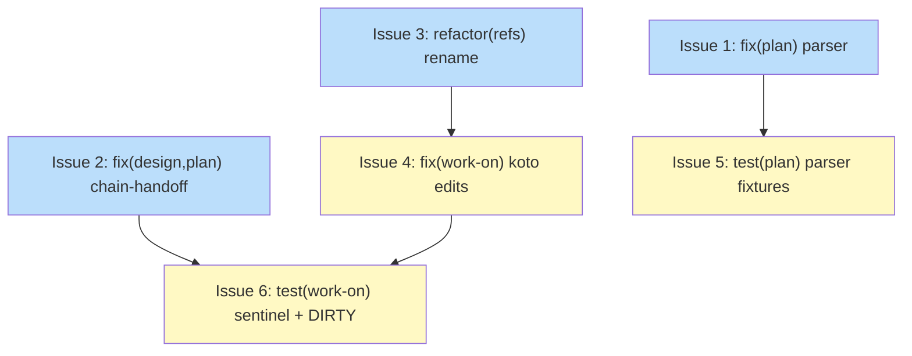

# PLAN: shirabe pattern-v1 workflow friction sweep

## Status

Draft

## Scope Summary

Sweep that ships three substrate-disjoint fixes for pattern-v1
workflow friction in shirabe's tactical chain: parser silent-empty-
deps (#156), chain-handoff status-gate asymmetry (#159), and
`/work-on` upstream-drift + `ci_monitor` DIRTY-vs-pending distinction
(#162). One shared rename of
`references/parent-skill-worktree-discipline.md` to
`references/worktree-discipline.md` lands as companion work to #162.

## Decomposition Strategy

**Horizontal decomposition.** The DESIGN's three components are
substrate-disjoint (bash script, phase-prose markdown, koto template
+ reference rename); there is no shared runtime flow whose end-to-end
integration risk would justify a walking-skeleton vertical slice. Each
fix is locally complete on its native substrate, so horizontal slicing
mirrors the architecture: one implementation issue per bug (3),
one rename issue (companion to #162), and two test issues covering
the verifiable surfaces the DESIGN's acceptance criteria cite. The
substrate-disjointness preserves R13's independent-shippability
within single-pr execution mode — commits remain reviewable as
separate units within the same branch.

## Implementation Issues

Single-pr summary table. Detailed outlines live below in
[Issue Outlines](#issue-outlines); local-anchor links jump to each.

| Issue | Dependencies | Complexity |
|-------|--------------|------------|
| [Issue 1: fix(plan): accept both Dependencies colon placements and warn on asymmetric empty-deps](#issue-1-fixplan-accept-both-dependencies-colon-placements-and-warn-on-asymmetric-empty-deps) | None | testable |
| _Loosen the line-288 regex in `plan-to-tasks.sh` so it captures both `**Dependencies**:` and `**Dependencies:**` colon placements, and emit a stderr warning when a multi-issue single-pr PLAN has asymmetric empty deps._ | | |
| [Issue 2: fix(design,plan): sentinel-gated chain-handoff auto-transition](#issue-2-fixdesignplan-sentinel-gated-chain-handoff-auto-transition) | None | testable |
| _Add a sentinel-gated auto-transition branch before the existing hard-stop in `/design` Phase 0 step 0.2 and `/plan` Phase 1 step 1.1, reading the `parent_orchestration:` block from `wip/*_<topic>_state.md` and invoking `shirabe transition` when the sentinel matches the current child name._ | | |
| [Issue 3: refactor(refs): rename parent-skill-worktree-discipline to worktree-discipline](#issue-3-refactorrefs-rename-parent-skill-worktree-discipline-to-worktree-discipline) | None | simple |
| _Rename `references/parent-skill-worktree-discipline.md` to `references/worktree-discipline.md` and update every cross-reference in the repo; the reference's prose content is unchanged._ | | |
| [Issue 4: fix(work-on): per-child worktree-discipline check and ci_monitor DIRTY-vs-pending distinction](#issue-4-fixwork-on-per-child-worktree-discipline-check-and-ci_monitor-dirty-vs-pending-distinction) | [Issue 3](#issue-3-refactorrefs-rename-parent-skill-worktree-discipline-to-worktree-discipline) | critical |
| _Add a `worktree_discipline_check` state in the per-child loop of `work-on-plan.md` and edit `ci_monitor` to distinguish DIRTY merge state from pending checks via a new `merge_state_clean` gate and a `dirty_merge_state` enum value plus two terminal escalation states._ | | |
| [Issue 5: test(plan): parser fixtures for colon-placement and asymmetric-empty-deps coverage](#issue-5-testplan-parser-fixtures-for-colon-placement-and-asymmetric-empty-deps-coverage) | [Issue 1](#issue-1-fixplan-accept-both-dependencies-colon-placements-and-warn-on-asymmetric-empty-deps) | testable |
| _Extend `plan-to-tasks_test.sh` (or add fixtures under `test-fixtures/`) covering both colon placements parsing identically, asymmetric-empty-deps triggering the stderr warning, all-empty-deps not triggering, single-issue not triggering, and the `### Dependencies` accumulator parsing unchanged._ | | |
| [Issue 6: test(work-on): sentinel-detection and ci_monitor DIRTY fixtures](#issue-6-testwork-on-sentinel-detection-and-ci_monitor-dirty-fixtures) | [Issue 2](#issue-2-fixdesignplan-sentinel-gated-chain-handoff-auto-transition), [Issue 4](#issue-4-fixwork-on-per-child-worktree-discipline-check-and-ci_monitor-dirty-vs-pending-distinction) | testable |
| _Add tests for Issue 2's sentinel-gated auto-transition (present-matching, present-mismatched, absent fixtures) and Issue 4's `ci_monitor` DIRTY routing (a mock or controlled-state PR fixture verifying routing to `escalate_dirty_merge_state` within bounded duration)._ | | |

## Issue Outlines

### Issue 1: fix(plan): accept both Dependencies colon placements and warn on asymmetric empty-deps

**Goal**: Loosen the `**Dependencies**:` line regex in
`skills/plan/scripts/plan-to-tasks.sh` so it captures both colon
placements (`**Dependencies**:` outside-bold AND `**Dependencies:**`
inside-bold), and emit a stderr warning when a multi-issue single-pr
PLAN has asymmetric empty deps (some issues empty, some not) — the
asymmetry that indicates the regex previously silently dropped edges.

**Acceptance Criteria**:
- [ ] Line 288 of `plan-to-tasks.sh` now matches the regex
      `\*\*Dependencies:?\*\*:?[[:space:]]*(.+)$` (loosened form
      accepting either colon placement, AC1.2).
- [ ] A test fixture PLAN containing both `**Dependencies**:` and
      `**Dependencies:**` lines parses identically — both lines
      populate `current_deps` correctly (AC1.1).
- [ ] After the main parsing loop and before the `waits_on`
      resolution at line 448, a new block iterates the issue arrays
      and emits a single stderr warning when the multi-issue
      single-pr PLAN has SOME issues with empty deps AND SOME with
      non-empty deps (asymmetric-empty-deps case, AC2.1).
- [ ] The warning text explicitly names both colon placements as
      the likely authoring root cause (AC2.2).
- [ ] The warning does NOT fire when every issue has empty deps
      (strictly-independent multi-issue set — legitimate pattern).
- [ ] The warning does NOT fire on single-issue PLANs.
- [ ] The existing `### Dependencies` multi-line accumulator at
      lines 312-339 is not modified and continues to parse
      `### Dependencies` sections unchanged (AC3.1, R3 protection).
- [ ] The multi-pr / GitHub-issue parsing path at lines 104-141 is
      not modified.

**Dependencies**: None

**Type**: code
**Files**: `skills/plan/scripts/plan-to-tasks.sh`

### Issue 2: fix(design,plan): sentinel-gated chain-handoff auto-transition

**Goal**: Add a sentinel-gated auto-transition branch before the
existing hard-stop in `/design` Phase 0 step 0.2
(`skills/design/references/phases/phase-0-setup-prd.md`) and `/plan`
Phase 1 step 1.1
(`skills/plan/references/phases/phase-1-analysis.md`). The new branch
reads the `parent_orchestration:` block from any
`wip/*_<topic>_state.md` file matching the current topic, and when
the sentinel's `invoking_child:` matches the current child name
(`design` or `plan`) AND the upstream artifact is at the expected
pre-transition status, invokes `shirabe transition` to advance the
upstream forward by one status, then proceeds. When the sentinel is
absent or mismatched, the existing hard-stop fires unchanged
(R6 preservation).

**Acceptance Criteria**:
- [ ] `skills/design/references/phases/phase-0-setup-prd.md` step 0.2
      contains a clearly-named "Parent-orchestration auto-transition
      (sentinel-gated)" block positioned BEFORE the existing
      hard-stop check (AC4.1, AC4.2).
- [ ] `skills/plan/references/phases/phase-1-analysis.md` step 1.1
      contains the analogous sentinel-gated block for DESIGN-input
      mode positioned BEFORE the existing hard-stop table (AC5.1,
      AC5.2).
- [ ] Both branches use a glob pattern (`wip/*_<topic>_state.md`),
      NOT a hardcoded `wip/scope_<topic>_state.md`, to remain
      forward-compatible with future parent skills beyond `/scope`.
- [ ] Both branches invoke `shirabe transition <upstream-path>
      <next-status>`: `/design` transitions PRD to `In Progress`;
      `/plan` transitions DESIGN to `Planned`.
- [ ] When the sentinel is ABSENT (no matching state file or no
      `parent_orchestration:` block), the auto-transition does NOT
      fire and the existing hard-stop is reachable (R6 preserved,
      AC6.1).
- [ ] When the sentinel is PRESENT but its `invoking_child:` value
      does NOT match the current child name (e.g., `invoking_child:
      brief` when reached from `/design` Phase 0), the auto-transition
      does NOT fire and the hard-stop is reachable (R6 preserved).
- [ ] `skills/prd/SKILL.md` lines 132-138 are NOT modified — `/prd`
      remains the symmetric reference behavior all three skills align
      to (AC7.1, R12 blast radius).
- [ ] The DESIGN body contract paragraph ("When a chain-context
      signal is present...") is copied into the new prose blocks so
      future operators reading either phase file see the symmetric
      three-skill contract.

**Dependencies**: None

**Type**: docs
**Files**: `skills/design/references/phases/phase-0-setup-prd.md`, `skills/plan/references/phases/phase-1-analysis.md`

### Issue 3: refactor(refs): rename parent-skill-worktree-discipline to worktree-discipline

**Goal**: Rename
`references/parent-skill-worktree-discipline.md` to
`references/worktree-discipline.md` reflecting the reference's
already-substrate-agnostic content (per its own lines 11-14) and
preparing it for a second consumer (`/work-on` in Issue 4). Update
every cross-reference in the repo to the new path; the reference's
prose content is NOT modified.

**Acceptance Criteria**:
- [ ] `references/parent-skill-worktree-discipline.md` no longer
      exists at the old path.
- [ ] `references/worktree-discipline.md` exists with content
      byte-identical to the renamed file (no prose edits).
- [ ] `skills/scope/SKILL.md` cross-reference updated from the old
      path to `references/worktree-discipline.md`.
- [ ] `skills/scope/references/phases/phase-2-chain-orchestration.md`
      cross-reference updated from the old path to
      `references/worktree-discipline.md`.
- [ ] `grep -r 'parent-skill-worktree-discipline'` returns NO matches
      across the repo (no orphan references remain).
- [ ] The renamed reference's lines 11-14 (the
      substrate-agnostic-content note) are unchanged.

**Dependencies**: None

**Type**: task
**Files**: `references/parent-skill-worktree-discipline.md`, `references/worktree-discipline.md`, `skills/scope/SKILL.md`, `skills/scope/references/phases/phase-2-chain-orchestration.md`

### Issue 4: fix(work-on): per-child worktree-discipline check and ci_monitor DIRTY-vs-pending distinction

**Goal**: In `skills/work-on/koto-templates/work-on-plan.md`, add a
new state `worktree_discipline_check` positioned in the per-child
dispatch loop that classifies upstream impact (None / Informational /
Intent-changing) per the renamed `references/worktree-discipline.md`
and routes intent-changing classifications to a new
`escalate_upstream_drift` terminal state. Edit the existing
`ci_monitor` state (lines 84-111) to add a `merge_state_clean` gate
querying `gh pr view --json mergeStateStatus`, add `dirty_merge_state`
as an enum value in the `ci_outcome` accepts block, add a new
`escalate_dirty_merge_state` terminal state routing to `done_blocked`
with a DIRTY-specific `failure_reason`. Add the per-child
classification instruction to a `skills/work-on/references/phases/`
file (extend an existing phase file or add
`phase-2.5-worktree-discipline.md` per prose-flow fit).

**Acceptance Criteria**:
- [ ] `skills/work-on/koto-templates/work-on-plan.md` contains a new
      state `worktree_discipline_check` with a gate
      `impact_classified` (file existence check on
      `wip/work-on_${PLAN_SLUG}_impact.json`), an `accepts.impact`
      enum with values `[none, informational, intent-changing]`,
      and three transitions: `none` -> next child dispatch,
      `informational` -> next child dispatch, `intent-changing` ->
      `escalate_upstream_drift` (AC8.1, AC8.2).
- [ ] A new terminal state `escalate_upstream_drift` exists with an
      `accepts.rationale` string field and transitions to
      `done_blocked` carrying an `upstream-drift`-specific
      `failure_reason` (AC9.1).
- [ ] `ci_monitor` state (lines 84-111) gains a second gate
      `merge_state_clean` running
      `gh pr view --json mergeStateStatus --jq .mergeStateStatus`
      and checking `!= "DIRTY"`.
- [ ] `ci_monitor` `accepts.ci_outcome` enum now includes
      `dirty_merge_state` alongside the existing `passing`,
      `failing_fixed`, `failing_unresolvable` values.
- [ ] `ci_monitor` transitions include one new entry: `ci_outcome:
      dirty_merge_state` routes to `escalate_dirty_merge_state` with
      `failure_reason` naming "PR merge state is DIRTY; checks
      suppressed" (AC10.1).
- [ ] A new terminal state `escalate_dirty_merge_state` routes to
      `done_blocked` carrying the DIRTY-specific `failure_reason`
      with rationale required (AC11.1).
- [ ] The `## ci_monitor` prose section (line 226) gains an explicit
      DIRTY-handling paragraph instructing agents to submit
      `ci_outcome: dirty_merge_state` with rationale naming conflict
      files when `mergeStateStatus` is DIRTY, and explicitly NOT to
      loop on `ci_passing` (R11).
- [ ] A `skills/work-on/references/phases/` file (existing or new
      `phase-2.5-worktree-discipline.md`) contains the per-child
      instruction: fetch origin, rebase the shared branch, classify
      impact per `references/worktree-discipline.md`, write
      `wip/work-on_${PLAN_SLUG}_impact.json`.
- [ ] All references to the worktree-discipline reference in any new
      prose use the renamed path `references/worktree-discipline.md`
      (NOT the old `parent-skill-worktree-discipline.md` path).

**Dependencies**: Blocked by <<ISSUE:3>>

**Type**: code
**Files**: `skills/work-on/koto-templates/work-on-plan.md`, `skills/work-on/references/phases/phase-2.5-worktree-discipline.md`

### Issue 5: test(plan): parser fixtures for colon-placement and asymmetric-empty-deps coverage

**Goal**: Extend `skills/plan/scripts/plan-to-tasks_test.sh` (or add
new fixtures under `skills/plan/scripts/test-fixtures/` if that
infrastructure exists) covering Issue 1's surfaces: both colon
placements (`**Dependencies**:` and `**Dependencies:**`) parse
identically; an asymmetric-empty-deps multi-issue PLAN triggers the
stderr warning whose text names both colon placements as the likely
authoring root cause; the legacy `### Dependencies` multi-line
section accumulator parses unchanged.

**Acceptance Criteria**:
- [ ] Test fixture `colon-outside.md` (a single-pr PLAN with two
      issues, both using `**Dependencies**:` outside-bold colon)
      parses with `plan-to-tasks.sh` and produces the expected
      JSON with populated `waits_on` for both issues.
- [ ] Test fixture `colon-inside.md` (the same PLAN shape but with
      `**Dependencies:**` inside-bold colon) parses to identical
      JSON byte-for-byte under the loosened regex (AC1.1).
- [ ] A grep test against the script body confirms line 288 matches
      `\*\*Dependencies:?\*\*:?` (AC1.2).
- [ ] Test fixture `asymmetric-empty-deps.md` (a multi-issue PLAN
      where Issue 1 has populated deps and Issue 2 has empty deps)
      triggers a stderr warning when run through `plan-to-tasks.sh`;
      the test asserts the warning fires (AC2.1).
- [ ] The warning text grep-asserts on both colon placements being
      named as the likely authoring cause (AC2.2).
- [ ] Test fixture `all-empty-deps.md` (a multi-issue PLAN where
      every issue has `None` deps — strictly-independent set) does
      NOT trigger the warning (legitimate-pattern suppression).
- [ ] Test fixture `single-issue.md` does NOT trigger the warning
      (only multi-issue PLANs are subject to the asymmetric check).
- [ ] Test fixture `section-format.md` using the `### Dependencies`
      multi-line accumulator format parses unchanged (AC3.1, R3
      protection).
- [ ] All new tests pass under the existing test-runner invocation
      (`bash plan-to-tasks_test.sh` or equivalent).

**Dependencies**: Blocked by <<ISSUE:1>>

**Type**: code
**Files**: `skills/plan/scripts/plan-to-tasks_test.sh`

### Issue 6: test(work-on): sentinel-detection and ci_monitor DIRTY fixtures

**Goal**: Add tests covering Issue 2's sentinel-gated auto-transition
(the three scenarios required by R6 preservation) and Issue 4's
`ci_monitor` DIRTY-vs-pending routing. Sentinel tests verify the
correct branch fires for present-matching, present-mismatched, and
absent cases; DIRTY tests verify routing to
`escalate_dirty_merge_state` within a bounded test duration.

**Acceptance Criteria**:
- [ ] Sentinel-present-matching fixture: a
      `wip/scope_<topic>_state.md` with
      `parent_orchestration.invoking_child: design` plus a PRD at
      status `Accepted` causes `/design` Phase 0 to invoke
      `shirabe transition` (or its mock) and proceed past the
      hard-stop (AC4.1, AC4.2).
- [ ] Sentinel-present-matching fixture for `/plan`: a
      `wip/scope_<topic>_state.md` with
      `parent_orchestration.invoking_child: plan` plus a DESIGN at
      status `Accepted` causes `/plan` Phase 1 to invoke
      `shirabe transition` and proceed past the hard-stop (AC5.1,
      AC5.2).
- [ ] Sentinel-present-mismatched fixture: the sentinel exists but
      its `invoking_child:` value does NOT match the current child
      name; the auto-transition does NOT fire and the hard-stop is
      reachable (R6 preservation).
- [ ] Sentinel-absent fixture: no `wip/*_<topic>_state.md` file
      exists for the topic; the hard-stop fires unchanged (AC6.1,
      R6 preservation).
- [ ] The glob pattern `wip/*_<topic>_state.md` resolves correctly
      when the parent's identity is something other than `scope`
      (forward-compatibility check) — e.g., a fixture file named
      `wip/charter_<topic>_state.md` is discovered.
- [ ] DIRTY fixture: a mock or controlled-state PR where
      `gh pr view --json mergeStateStatus` returns `DIRTY` causes the
      `ci_monitor` state's `merge_state_clean` gate to fail; the
      agent submits `ci_outcome: dirty_merge_state`; koto routes to
      `escalate_dirty_merge_state` within the bounded test duration
      (AC10.1, AC11.1).
- [ ] DIRTY routing arrives at `done_blocked` carrying the
      DIRTY-specific `failure_reason` text (AC9.1, AC8.1, AC8.2 for
      the equivalent intent-changing-upstream surface).
- [ ] All tests are executable under the repo's existing test-runner
      conventions (`koto` template tests via the koto CLI or
      equivalent harness).

**Dependencies**: Blocked by <<ISSUE:2>>, <<ISSUE:4>>

**Type**: code
**Files**: `skills/work-on/koto-templates/work-on-plan.md`, `skills/design/references/phases/phase-0-setup-prd.md`, `skills/plan/references/phases/phase-1-analysis.md`

## Dependency Graph

**Legend**: Green = done, Blue = ready, Yellow = blocked,
Purple = needs-design, Light blue = needs-prd, Red = needs-spike,
Indigo = needs-decision, Orange = tracks-design/tracks-plan

## Implementation Sequence

**Critical path:** Issue 3 -> Issue 4 -> Issue 6 (3 issues)

The critical path runs through the work-on substrate: Issue 4 must
wait for Issue 3's rename to land before its prose can reference
`references/worktree-discipline.md`, and Issue 6's tests verify
Issue 4's koto edits. Issues 1 and 2 (and their corresponding test
Issue 5) can complete in parallel alongside this critical path
without contention.

**Recommended order:**

1. **Immediate start (parallel):** Issues 1, 2, 3 — the three
   substrate-disjoint root issues. Each modifies a different
   substrate (bash, phase-prose, references) and shares no runtime
   state with the others.
2. **After Issue 1:** Issue 5 — parser tests verifying the loosened
   regex and asymmetric-empty-deps warning.
3. **After Issue 3:** Issue 4 — work-on koto edits referencing the
   renamed worktree-discipline path.
4. **After Issues 2 and 4 both complete:** Issue 6 — combined
   integration tests covering sentinel-detection scenarios and the
   DIRTY-merge-state ci_monitor routing.

**Parallelization:** Three implementation surfaces (Issues 1, 2,
3+4) ship in parallel because the three substrates do not share
runtime infrastructure. Within single-pr execution mode,
parallelism means commits can be authored independently within the
same branch; sequencing only binds the test issues to their
corresponding implementation issues and Issue 4 to Issue 3's
rename.
