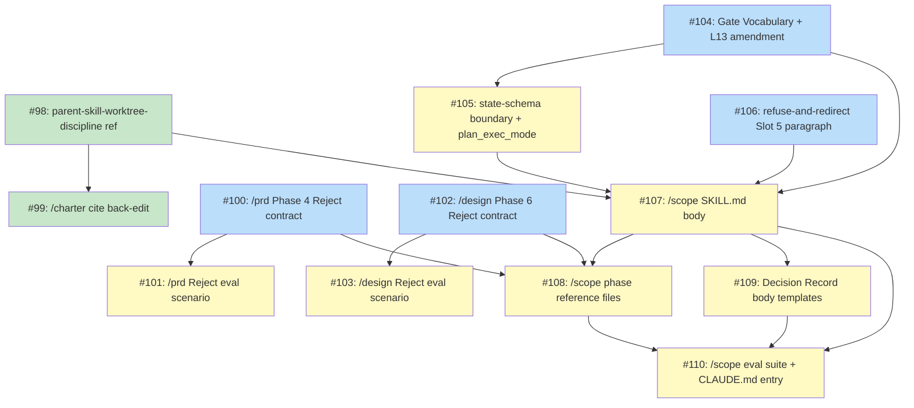

# PLAN: Shirabe Scope Skill

## Status

Active

## Scope Summary

`/scope` ships as the second parent skill in shirabe, binding the parent-skill pattern v1 (already ratified by `/charter`) to the tactical chain (`/brief → /prd → /design → /plan`) while extending the pattern doc with the new vocabulary the three tactical-chain asymmetries force (a fourth gate shape, a sub-shape discriminator for two settled-upstream boundaries, and an output-mode-aware terminal child). Delivery includes the `/scope` loadable skill body, three surgical pattern-doc edits, one new top-level worktree-discipline reference, and two child-side Phase-N Reject contract extensions on `/prd` and `/design`.

## Decomposition Strategy

**Horizontal decomposition.** The design's 8 components and supporting deliverables decompose into 13 atomic issues across 4 PRs. Each issue ships a single well-bounded artifact (one pattern-reference file edit, one SKILL.md body, one phase reference, one eval-scenario surface). The PRs aggregate issues by the design's own Implementation Approach phases (A/B/C/D) plus the team-lead's PR-1/2/3/4 boundary.

Walking-skeleton was considered and rejected: the design is documentation + configuration (pattern-doc edits, new SKILL.md body, eval scenarios) with internally-coupled but externally-bounded components. A walking-skeleton skeleton issue ("minimal e2e flow with stubs") would invert the real dependency chain — the pattern-doc edits (Components 1-4) MUST exist before any `/scope` body can cite them, and the child-side Phase-N Reject contracts (Component 8) MUST exist before `/scope` Phase 2 can observe their `git log` discard-commit signal. The Phase 6 reviewer validated the horizontal choice.

**Multi-pr execution mode.** this work delivers incremental value across multiple shippable units: PR-1 ships the new worktree-discipline reference so `/charter` benefits immediately; PR-2 and PR-3 ship `/prd` and `/design` Phase-N Reject contracts so direct-invocation authors get a Reject verdict before `/scope` lands; PR-4 ships `/scope` as the integrated parent skill. Cross-PR dependencies are explicit: PR-4 cites the discard-commit observability surface that PR-2 and PR-3 ship.

## Implementation Issues

### Milestone: [Shirabe Scope Skill](https://github.com/tsukumogami/shirabe/milestone/5)

| Issue | Dependencies | Complexity |
|-------|--------------|------------|
| [#98: docs(refs): add parent-skill-worktree-discipline reference](https://github.com/tsukumogami/shirabe/issues/98) | None | simple |
| _New top-level pattern reference at `references/parent-skill-worktree-discipline.md` codifying how a parent skill handles upstream change across a multi-child chain. Six body sections (Trigger Condition / Rebase phase / Impact-analysis phase / Escalation phase / Recording / Binding Notes) encode the contract: escalation is driven by contextual impact (does the change invalidate intent?), not mechanical conflict status. Sub-agents handle rebase + impact classification (None / Informational / Intent-changing); team lead arbitrates intent-changing impacts; the author is bothered only when intent has genuinely shifted. Parent-agnostic prose — per-parent specifics live in Binding Notes so future parents inherit the discipline without re-deriving it._ | | |
| [#99: docs(charter): cite worktree-discipline reference in /charter](https://github.com/tsukumogami/shirabe/issues/99) | [#98](https://github.com/tsukumogami/shirabe/issues/98) | simple |
| _Single-row addition to `/charter`'s Reference Files table citing the new top-level reference. Scoped tightly to the back-edit per the design's Phase D; does NOT include the `--parent-orchestrated` → `parent_orchestration:` sentinel migration (separate concern, deferred to a follow-on PR per-child)._ | | |
| [#100: feat(prd): ship Phase 4 step 4.5 3-option Reject contract](https://github.com/tsukumogami/shirabe/issues/100) | None | testable |
| _Replaces `/prd` Phase 4 step 4.5's existing 2-option AskUserQuestion (Approved / Needs iteration) with a 3-option gate (Approved / Reject / Continue-revising). Reject branch asks for rationale, runs `git rm docs/prds/PRD-<topic>.md`, removes `wip/prd_<topic>_*.md`, and commits `docs(prd): discard PRD draft for <topic>` via `git commit -F -` (stdin) per the Security Considerations mitigation. Includes the disclaimer substring "Rationale will be committed to git history"._ | | |
| [#101: test(prd): add Phase 4 Reject contract eval scenario](https://github.com/tsukumogami/shirabe/issues/101) | [#100](https://github.com/tsukumogami/shirabe/issues/100) | testable |
| _Adds an eval scenario to `skills/prd/evals/evals.json` verifying the 3-option gate, the discard commit message format, the `git rm` of the durable artifact, the wip cleanup, the commit-via-stdin behavior, and AC30c in-chain vs out-of-chain symmetry. Asserts the discard commit is the durable observable signal regardless of context._ | | |
| [#102: feat(design): ship Phase 6 step 6.7 3-option Reject contract](https://github.com/tsukumogami/shirabe/issues/102) | None | testable |
| _Symmetric to #100 for `/design` Phase 6 step 6.7. Discards via `git rm docs/designs/DESIGN-<topic>.md`, removes both `wip/design_<topic>_*.md` AND `wip/research/design_<topic>_*.md`, commits `docs(design): discard DESIGN draft for <topic>`. Gate fires after the commit step (preserves Draft durability across interruptions per Decision 1 Option C rejection)._ | | |
| [#103: test(design): add Phase 6 Reject contract eval scenario](https://github.com/tsukumogami/shirabe/issues/103) | [#102](https://github.com/tsukumogami/shirabe/issues/102) | testable |
| _Parallel eval to #101 for `/design`. Verifies the wider wip cleanup set (both `wip/design_*` and `wip/research/design_*`), the post-commit ordering invariant, and identical in-chain vs out-of-chain semantics._ | | |
| [#104: docs(refs): add Gate Vocabulary section and L13 amendment to parent-skill-pattern.md](https://github.com/tsukumogami/shirabe/issues/104) | None | testable |
| _Inserts a NEW Gate Vocabulary section between "Three Exit Paths" and "Conditional Feeder Invocation Shape" listing all four gate shapes (EITHER-signal / ALWAYS / shape-dependent / Mandatory-with-auto-skip) with one canonical example each. Rewrites L13 per Decision 3's amendment text permitting the pattern-level `parent_orchestration:` state-file sentinel as the sole permitted parent-orchestration primitive._ | | |
| [#105: docs(refs): extend parent-skill-state-schema.md with boundary, plan_execution_mode, and R9 additions](https://github.com/tsukumogami/shirabe/issues/105) | [#104](https://github.com/tsukumogami/shirabe/issues/104) | testable |
| _Adds two new conditional-field bullets in Field Semantics (`boundary:` gated by `exit: re-evaluation`; `plan_execution_mode:` gated by `/plan` in `chain_ran`), a Chain-tracking paragraph addition, R9 Part 2 multi-discriminator addition, and R9 Part 3 chain-membership-gated I-5 addition._ | | |
| [#106: docs(refs): append refuse-and-redirect slot 5 paragraph to parent-skill-resume-ladder-template.md](https://github.com/tsukumogami/shirabe/issues/106) | None | simple |
| _Appends a single paragraph to the Slot 5 spec documenting the refuse-and-redirect prompt shape (literal substring `redirect to /<skill-name>` case-insensitive; MUST NOT contain Re-evaluate / Revise / Bail triad). Preserves the 9-row meta-ladder count._ | | |
| [#107: feat(scope): add /scope SKILL.md body](https://github.com/tsukumogami/shirabe/issues/107) | [#98](https://github.com/tsukumogami/shirabe/issues/98), [#104](https://github.com/tsukumogami/shirabe/issues/104), [#105](https://github.com/tsukumogami/shirabe/issues/105), [#106](https://github.com/tsukumogami/shirabe/issues/106) | critical |
| _The keystone deliverable. Creates `skills/scope/SKILL.md` with the seven pattern-level structural elements and `/scope`-specific bindings — Input Modes, execution-mode flags (`--max-rounds=5`), topic-slug regex citation, Workflow Phases diagram (five phases), Resume Logic ladder (9-row Slot 5 + 4-row Slot 6 + vacuous Slot 7), Phase Execution list, Reference Files table. Carries the four security mitigations as prose contracts: slug re-validation on resume, closed write-target set, state-file enum re-validation, and stale-`parent_orchestration:` self-heal._ | | |
| [#108: feat(scope): add /scope phase reference files (Phase 0-4)](https://github.com/tsukumogami/shirabe/issues/108) | [#107](https://github.com/tsukumogami/shirabe/issues/107), [#100](https://github.com/tsukumogami/shirabe/issues/100), [#102](https://github.com/tsukumogami/shirabe/issues/102) | critical |
| _Five phase reference files under `skills/scope/references/phases/` covering setup, discovery + chain proposal (with R6 structured walk + 3-4 worked examples per predicate), chain orchestration (worktree-staleness check + sentinel write/clear + child invocation + structural file-existence check + child-snapshot capture + Phase-N Reject observability via `git log` + validator pass-through), exit finalization (three exits + abandonment-forced HTML-comment marker), and cleanup. The load-bearing security surface — depends on #100 and #102 because Phase 2 observes their canonical discard-commit subjects via `git log`._ | | |
| [#109: feat(scope): add Decision Record body templates for re-evaluation and rejection at both boundaries](https://github.com/tsukumogami/shirabe/issues/109) | [#107](https://github.com/tsukumogami/shirabe/issues/107) | simple |
| _Four Decision Record body templates under `skills/scope/references/` covering the four combinations (PRD-boundary / DESIGN-boundary × re-evaluation / rejection). Each ~50-80 lines with ADR-style frontmatter. Re-evaluation templates reference the existing PRD/DESIGN path at `referenced_artifact:` (NOT the Decision Record's own path, preserving drift-detection well-definedness). Rejection templates reference the discard commit SHA._ | | |
| [#110: test(scope): add /scope eval suite + shirabe CLAUDE.md tactical-chain entry section](https://github.com/tsukumogami/shirabe/issues/110) | [#107](https://github.com/tsukumogami/shirabe/issues/107), [#108](https://github.com/tsukumogami/shirabe/issues/108), [#109](https://github.com/tsukumogami/shirabe/issues/109) | testable |
| _Creates `skills/scope/evals/evals.json` with 11+ scenarios covering US-1 through US-6 (R18 / AC24b) plus targeted assertions for Phase-N Reject in-chain/out-of-chain (AC30c), abandonment-forced HTML-comment marker uniformity (AC13), drift-detection three-option prompt vocabulary (AC18a/AC18b), refuse-and-redirect literal substring contract (AC17c), and slug re-validation on resume. Edits shirabe `CLAUDE.md` to add a "Tactical Chain Entry: /scope" section paralleling the existing `/charter` section._ | | |

## Dependency Graph

**Legend**: Green = done, Blue = ready, Yellow = blocked, Purple = needs-design, Orange = tracks-design/tracks-plan

## Implementation Sequence

### Critical Path

The longest dependency chain is 5 issues deep:

`#104 → #105 → #107 → #108 → #110`

Estimated sequential wall time: ~5-7 hours. With parallel execution of independent tiers below, total wall-clock compresses significantly.

### Parallelization Tiers

**Tier 0 — Immediate start (4 issues, fully parallel; #98 done in PR-1)**

- ~~#98~~ done — new `references/parent-skill-worktree-discipline.md`
- #100 — `/prd` Phase 4 Reject contract
- #102 — `/design` Phase 6 Reject contract
- #104 — Gate Vocabulary + L13 amendment in `parent-skill-pattern.md`
- #106 — refuse-and-redirect Slot 5 paragraph in `parent-skill-resume-ladder-template.md`

**Tier 1 — After Tier 0 (3 issues remaining; #99 done in PR-1)**

- ~~#99 after #98~~ done — `/charter` cite back-edit
- #101 after #100 — `/prd` Reject eval scenario
- #103 after #102 — `/design` Reject eval scenario
- #105 after #104 — `parent-skill-state-schema.md` extension

**Tier 2 — /scope keystone**

- #107 after #98, #104, #105, #106 — `/scope` SKILL.md body

**Tier 3 — /scope auxiliary (2 issues, parallel)**

- #108 after #107, #100, #102 — five phase reference files (cites SKILL.md + observes discard commits)
- #109 after #107 — four Decision Record body templates

**Tier 4 — /scope verification**

- #110 after #107, #108, #109 — eval suite + CLAUDE.md tactical-chain entry section

### Cross-PR Merge Order

The 13 issues aggregate into 4 PRs with the following merge order:

1. **PR-1** (issues #98, #99): independent — worktree-discipline reference + `/charter` back-edit
2. **PR-2** (#100, #101) and **PR-3** (#102, #103) in parallel: independent of each other and of PR-1; both ship before PR-4 merges so the SKILL.md body and Phase 2 reference in PR-4 cite consistent durable child contracts
3. **PR-4** (#104, #105, #106, #107, #108, #109, #110): depends on PR-2 + PR-3 + cites #98 from PR-1; ships three pattern-doc edits + `/scope` SKILL.md + 5 phase references + 4 Decision Record templates + eval suite + shirabe CLAUDE.md tactical-chain entry section

### Downstream Follow-on (out of scope for this plan)

**PR-5** (vision repo): a separate downstream PR in the `tsukumogami/vision` repo updates the strategic roadmap to mark this work as Done. Out of scope for this `/plan` because it lives in a different repository; tracked separately per the team-lead's decomposition plan.

### Recommended Starting Issues

PR-1 is complete (#98 + #99 done). Continue with the four remaining Tier 0 issues (marked `ready` in the dependency graph):

- [#104](https://github.com/tsukumogami/shirabe/issues/104): unblocks #105 and the entire `/scope` body cluster
- [#100](https://github.com/tsukumogami/shirabe/issues/100) and [#102](https://github.com/tsukumogami/shirabe/issues/102): unblock #108 (phase references' git-log observability) and their respective eval scenarios
- [#106](https://github.com/tsukumogami/shirabe/issues/106): refuse-and-redirect Slot 5 paragraph (smallest remaining; quick land)
