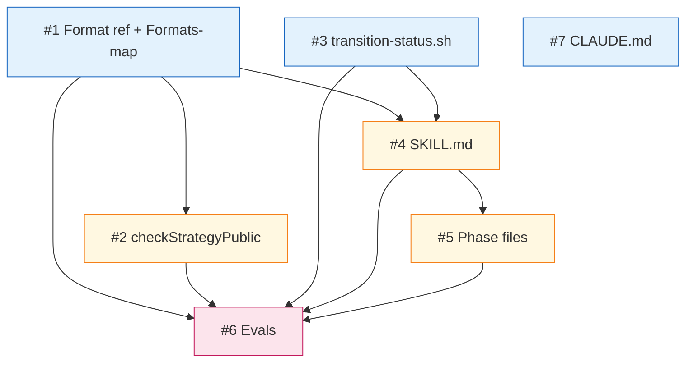

# PLAN: shirabe-strategy-skill

## Status

Draft

Single-PR plan derived from
`docs/designs/DESIGN-shirabe-strategy-skill.md` (Accepted). The
seven issue outlines below describe the sub-tasks within the
implementing PR, ordered by build dependency.

## Scope Summary

Implement STRATEGY as a first-class shirabe artifact type by adding
exactly one new entry at each of seven touch points: the format
reference, the Go-side Formats map, the visibility-gating custom
check, the transition-status script, the `/strategy` parent skill,
its phase files, and the evals. Plus a documentation touch-up on
shirabe's CLAUDE.md.

## Decomposition Strategy

**Horizontal.** The components have clear, stable interfaces — the
Go-side validate entry consumes the format reference's required-
sections list; the skill's Phase 5 invokes `transition-status.sh`;
the evals exercise the combined behavior. Each issue builds one
component fully before the next layer depends on it. No runtime
integration risk warrants a walking-skeleton thin vertical slice
because validate and skill are decoupled at the layer level.

Issue boundaries follow the design's `Implementation Approach` six
phases, with format reference and Formats-map entry combined into
one issue (they're tightly coupled — the required-sections list must
match across both) and skill body / phase files split into two
issues (different files, different review surface).

## Issue Outlines

### Issue 1: Format reference and Formats-map entry

**Goal**: Add `strategy/v1` as a recognized artifact type in
`shirabe validate` with a complete format reference document.

**Acceptance Criteria**:
- [ ] `skills/strategy/references/strategy-format.md` exists with
  Frontmatter, Required Sections, Optional Sections,
  Visibility-Gated Sections, Content Boundaries, Lifecycle,
  Validation Rules, and Quality Guidance sub-sections, mirroring
  the skeleton of `skills/vision/references/vision-format.md`.
- [ ] Per-section content rules per Design Decision 1: Strategic
  Context required content properties with free sub-structure;
  Building Blocks heading + lead description + free expansion;
  Coordination Dependencies prose + author-chosen visual (ASCII or
  Mermaid); Bet-Specific Falsifiability bullet template with
  `*If <condition>* ... → *Corrective: ...*` markers; Downstream
  Artifacts typed link list.
- [ ] Building Blocks granularity rubric (5-8 typical count, 1-2
  designs per block minimum, under-20% cross-product threshold) is
  documented in the Quality Guidance section, with an explicit
  revisability note (defaults adjustable in this reference file
  without PRD amendment).
- [ ] New `strategy/v1` entry added to `Formats` map in
  `internal/validate/formats.go` with `Name: "Strategy"`, prefix
  `"STRATEGY-"`, required fields `status`, `bet`, `scope`, valid
  statuses `Draft, Accepted, Active, Sunset`, and the eight
  required sections per design Solution Architecture.
- [ ] Unit tests in `formats_test.go` exercise FC01–FC04 against a
  known-good STRATEGY fixture (mirroring existing artifact-type
  tests).

**Dependencies**: None.

**Type**: code

**Files**: `skills/strategy/references/strategy-format.md`,
`internal/validate/formats.go`, `internal/validate/formats_test.go`

### Issue 2: checkStrategyPublic custom check and dispatch

**Goal**: Enforce the visibility-gated `Competitive Considerations`
section per design Decision 4.

**Acceptance Criteria**:
- [ ] `checkStrategyPublic(doc Doc, cfg Config) []ValidationError`
  function added to `internal/validate/checks.go`, mirroring
  `checkVisionPublic` structure line-for-line.
- [ ] Error code `R8` (new, one-code-per-rule convention preserved).
- [ ] Function returns early (no errors) when
  `cfg.Visibility == "private"`; treats all other values including
  empty string as public-gated (fail-closed semantics per Security
  Considerations).
- [ ] New `case "Strategy":` arm added to `ValidateFile`'s
  format-specific switch in `internal/validate/validate.go`. Include
  an inline comment noting the mixed-case `"Strategy"` is
  intentional per the Formats-map entry (existing map mixes casing:
  `"VISION"` vs `"Roadmap"` vs `"PRD"`).
- [ ] Unit tests in `checks_test.go` cover three paths:
  public-rejection (R8 error emitted), private-acceptance (no
  errors), and explicit empty-visibility-rejection (locks in the
  fail-closed default).

**Dependencies**: Blocked by `<<ISSUE:1>>` (the Formats-map entry
must exist before the dispatch switch can route to the new check).

**Type**: code

**Files**: `internal/validate/checks.go`,
`internal/validate/validate.go`, `internal/validate/checks_test.go`

### Issue 3: Transition status script

**Goal**: Implement the `/strategy` skill's per-skill lifecycle
transition script per design Decision 3.

**Acceptance Criteria**:
- [ ] `skills/strategy/scripts/transition-status.sh` exists with
  CLI `<path> <target> [reason]`, mirroring
  `skills/vision/scripts/transition-status.sh` structure.
- [ ] Valid transitions supported: Draft → Accepted, Accepted →
  Active, Active → Sunset, **Accepted → Sunset** (lifecycle
  refinement per design Decision 3).
- [ ] Downgrade transitions (e.g., Accepted → Draft) rejected with
  non-zero exit code and a clear error message.
- [ ] For Sunset transitions: script `mkdir -p
  docs/strategies/sunset/` defensively, then `git mv` the file. The
  `[reason]` argument is required for Sunset; rejected without it.
- [ ] The `[reason]` argument is sanitized before splicing into
  the body Status section: reject or escape sed/awk metacharacters
  (`/`, `&`, `\`, newlines) and frontmatter delimiters (`---`) per
  the Security Considerations hardening checklist.
- [ ] Manual smoke test against fixture STRATEGY files for each
  valid transition (Draft→Accepted, Accepted→Active,
  Active→Sunset, Accepted→Sunset).

**Dependencies**: None (the script doesn't depend on the validate
or skill layers; it operates on markdown directly).

**Type**: code

**Files**: `skills/strategy/scripts/transition-status.sh`

### Issue 4: /strategy parent SKILL.md

**Goal**: Author the parent `/strategy` skill body per design
Decision 2.

**Acceptance Criteria**:
- [ ] `skills/strategy/SKILL.md` exists as plain-English markdown
  with YAML frontmatter declaring the skill name, description,
  argument hint, and `@.claude/shirabe-extensions/` includes per
  the `/vision` and `/decision` SKILL.md precedent.
- [ ] SKILL.md describes the artifact type, six-phase structure,
  input modes (cold start, freeform topic, PRD/VISION upstream
  path), execution mode flags, and the routing to phase reference
  files.
- [ ] Resume logic specified analogous to `/vision`'s resume
  logic, keyed on wip/ artifacts produced by each phase.
- [ ] Critical requirements section names: topic-scoped wip/
  artifacts, the topic slug constraint `[a-z0-9-]+` (per Security
  Considerations hardening), the canonicalization of any
  user-supplied PRD path (per Security Considerations hardening),
  Phase 4 jury parallelism (run_in_background: true), and the
  human-approval gate at Phase 5.
- [ ] Reference Files table at the bottom maps each phase to its
  reference file under `references/phases/`.

**Dependencies**: Blocked by `<<ISSUE:1>>` (the SKILL.md
progressively discloses the format reference) and `<<ISSUE:3>>`
(the SKILL.md describes the Phase 5 transition).

**Type**: code

**Files**: `skills/strategy/SKILL.md`

### Issue 5: /strategy phase reference files

**Goal**: Author the six phase reference files per design Decision 2.

**Acceptance Criteria**:
- [ ] `skills/strategy/references/phases/phase-0-setup.md` exists
  covering entry-mode detection (cold, freeform topic, PRD/VISION
  upstream path), visibility/scope detection from CLAUDE.md, wip/
  initialization, and the topic-slug + path-canonicalization
  security checks.
- [ ] `phase-1-discover.md` exists covering the scoping conversation
  (especially the org-scope-without-upstream-VISION case).
- [ ] `phase-2-draft.md` exists covering Strategic Context,
  Defensibility Thesis, and Bet-Specific Falsifiability authoring.
  Includes prose warning authors about quoting private-upstream
  content into a public-visibility STRATEGY (per Security
  Considerations).
- [ ] `phase-3-structural-fill.md` exists covering Building Blocks,
  Coordination Dependencies, Non-Goals, and Downstream Artifacts.
- [ ] `phase-4-validate.md` exists with the three reviewer agent
  prompts (bet quality, altitude, structural format) landed
  verbatim from Decision 2's research. Each prompt opens with a
  fixed preamble framing STRATEGY content as data-under-review,
  pins the verdict file path, requires a structured `**Verdict:**
  PASS | FAIL` marker, and documents the minimum-tool-surface
  intent (with the future-hardening caveat about Agent-tool
  capability per Security Considerations).
- [ ] The structural-format reviewer prompt includes the
  visibility-hygiene check (flag verbatim private-upstream content
  in non-gated sections) per Security Considerations.
- [ ] `phase-5-finalize.md` exists covering the explicit
  human-approval AskUserQuestion, the Draft → Accepted transition
  via the script, wip/ cleanup, and PR creation.
- [ ] Concurrent-invocation race is documented in
  `phase-4-validate.md` as a known limitation (per Security
  Considerations).

**Dependencies**: Blocked by `<<ISSUE:4>>` (the phase files
reference SKILL.md's context and structure).

**Type**: code

**Files**: `skills/strategy/references/phases/phase-0-setup.md`,
`skills/strategy/references/phases/phase-1-discover.md`,
`skills/strategy/references/phases/phase-2-draft.md`,
`skills/strategy/references/phases/phase-3-structural-fill.md`,
`skills/strategy/references/phases/phase-4-validate.md`,
`skills/strategy/references/phases/phase-5-finalize.md`

### Issue 6: Evals scenarios and fixtures

**Goal**: End-to-end coverage of the format spec and skill behavior
per design Decision 5.

**Acceptance Criteria**:
- [ ] `skills/strategy/evals/evals.json` exists with eight scenarios
  named per Decision 5: structural happy path, FC04 missing-section,
  FC02 invalid-status, public R8 rejection, private R8 acceptance,
  Accepted→Active transition, Active→Sunset transition,
  Accepted→Sunset transition.
- [ ] `skills/strategy/evals/fixtures/` contains the eight fixture
  files with the names pinned in the design's Implementation
  Approach (`STRATEGY-happy.md`, `STRATEGY-missing-section.md`,
  `STRATEGY-invalid-status.md`, `STRATEGY-public-leak.md`,
  `STRATEGY-private-allowed.md`, `STRATEGY-accepted-to-active.md`,
  `STRATEGY-active-to-sunset.md`, `STRATEGY-accepted-to-sunset.md`).
- [ ] The `STRATEGY-private-allowed.md` fixture includes an in-file
  comment confirming the `Competitive Considerations` content is
  synthetic test material (per Security Considerations).
- [ ] `scripts/run-evals.sh strategy` reports all assertions passing.

**Dependencies**: Blocked by `<<ISSUE:1>>`, `<<ISSUE:2>>`,
`<<ISSUE:3>>`, `<<ISSUE:4>>`, `<<ISSUE:5>>` (evals exercise the
combined behavior of validate, custom check, transition script, and
skill).

**Type**: code

**Files**: `skills/strategy/evals/evals.json`,
`skills/strategy/evals/fixtures/STRATEGY-*.md`

### Issue 7: shirabe CLAUDE.md guidance

**Goal**: Add the planning-context paragraph per PRD R10.

**Acceptance Criteria**:
- [ ] `public/shirabe/CLAUDE.md` includes a new paragraph (within
  the planning-context section) explaining when to reach for
  STRATEGY versus VISION, ROADMAP, or PRD.
- [ ] The paragraph names the altitude framing (medium-term
  defensibility between VISION and ROADMAP) and the trigger
  heuristic (operationalizes a piece of an upstream VISION without
  pivoting the long-term thesis).
- [ ] The paragraph notes the scoping decision: this guidance is
  shirabe-scoped; workspace-level CLAUDE.md authoring is downstream
  design territory (per PRD R10 narrowing rationale).

**Dependencies**: None (text-only; independent of all other issues).

**Type**: docs

**Files**: `CLAUDE.md`

## Implementation Issues

This PLAN is in single-pr mode. GitHub issues are not created; the
Issue Outlines section above is the implementation contract. The
implementing PR is tracked at #94 (or its successor) as a single
unit.

When `/work-on` consumes this PLAN, it should work through the
issue outlines in dependency order, marking checkboxes within each
outline as acceptance criteria are met.

## Dependency Graph

Edge legend: solid arrows are hard dependencies (downstream issue
cannot start until upstream merges). Independent issues (blue) have
no dependencies; chained issues (yellow) depend on one or two
others; the integration issue (pink) depends on the full surface.

## Implementation Sequence

**Critical path:** Issue 1 → Issue 4 → Issue 5 → Issue 6 (format
reference → SKILL.md → phase files → evals). Four issues, each
gates the next.

**Parallelization opportunities:**

- Issues 1, 3, and 7 have no dependencies and can be done in any
  order or in parallel at the start of the PR.
- Issue 2 depends only on Issue 1 (the Formats-map entry's
  `Name: "Strategy"` must exist before the dispatch switch can
  route to `checkStrategyPublic`); can be done alongside Issue 3.
- Issue 4 (SKILL.md) requires Issues 1 and 3 (it references the
  format reference and describes invoking the transition script).
- Issue 5 (phase files) requires Issue 4; the phase files build on
  SKILL.md's framing and resume logic.
- Issue 6 (evals) is the integration gate — depends on Issues 1–5
  being complete.
- Issue 7 (CLAUDE.md) is independent docs work; can land first,
  last, or anywhere in between.

**Recommended ordering within the PR:**

1. Issue 1 (format reference + Formats-map) — foundation
2. Issue 2 (checkStrategyPublic) + Issue 3 (transition script) —
   independent of each other, can interleave
3. Issue 4 (SKILL.md) — pulls together the format reference and
   transition script in the skill's instructions
4. Issue 5 (phase files) — most content-heavy; consumes Issue 4
5. Issue 6 (evals) — proves the combined behavior; final gate
6. Issue 7 (CLAUDE.md) — small touch-up; can land anytime

The PR is ready to merge when Issue 6's evals pass and all
acceptance criteria checkboxes in Issues 1–7 are checked.
