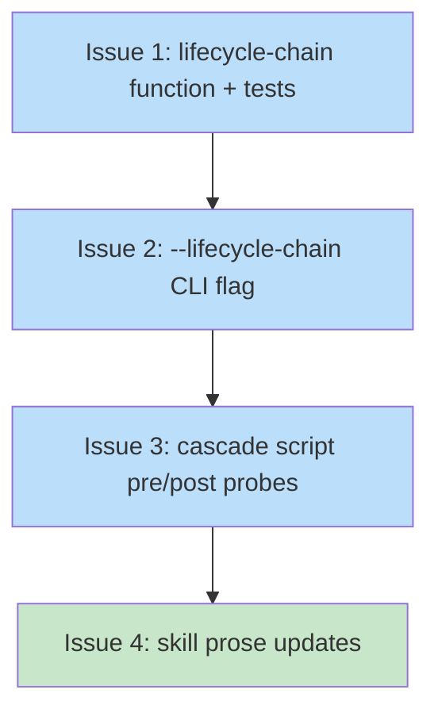

# PLAN: skill-cascade-lifecycle-check

## Status

Draft

The plan sequences the work for a single ephemeral PR. The doc is
ephemeral — /work-on drives the outlines to completion and deletes
this file in the same PR per the single-pr at-merge posture defined
by the parent DESIGN.

## Scope Summary

Bake the chain-aware lifecycle check into shirabe's work-on cascade
script for deterministic enforcement. Adds the `--lifecycle-chain
<DOC-PATH>` CLI flag plus its lifecycle-module implementation, wires
the cascade script with pre-probe and post-verify functions that
invoke the new mode, and updates skill prose to describe the
script-driven model. The CI workflow stays unchanged; the new mode
ships with the shirabe plugin as the deterministic enforcement path
for repos that adopt `/work-on` without adopting the reusable CI
workflow.

## Decomposition Strategy

Horizontal layer-by-layer decomposition. The DESIGN's components are
loosely coupled — the lifecycle module's new function is a single
public entry-point with reused helpers; the CLI flag is a clap
field addition with a new dispatch arm; the cascade script's probes
are inline shell functions; the skill prose updates are
documentation edits. No integration risk to surface early; the
seams are drawn by the DESIGN.

Phase 3.5a value-confirmation guard: every outline below is a
building block of one coherent delivery, not an independently-
shippable increment. The upstream issue explicitly bundles them as a
single closure of the script-side enforcement gap. Under `--auto`
the guard records `confirmed` for the single-pr decision and
proceeds.

## Issue Outlines

### Issue 1: chain-targeted lifecycle-check function and tests

**Goal**: Add `run_lifecycle_chain_check(doc_path, cfg, strict)` to
`crates/shirabe-validate/src/lifecycle.rs`, re-export from
`lib.rs`, and add unit tests covering the behaviors the PRD's R9
enumerates.

**Acceptance Criteria**:
- [ ] New public function `run_lifecycle_chain_check(doc_path:
      &Path, cfg: &Config, strict: bool) -> Vec<ValidationError>`
      in `crates/shirabe-validate/src/lifecycle.rs`.
- [ ] The function canonicalizes the doc-path, derives the implied
      root by stripping the matching `docs/{...}/` suffix, builds
      the doc index against that root, looks up the doc in the
      index, and filters discovered chains to those containing the
      doc.
- [ ] Non-doc-path inputs (missing file, unrecognized prefix, path
      outside docs/) produce a single L05 error with a clear message
      naming the expected location set.
- [ ] An orphan doc (no chain participation, no inverse-upstream
      reference) is checked via `check_orphan`; pass-state and
      fail-state both behave the same as the whole-tree mode's
      orphan handling.
- [ ] When `strict` is set and the matched chain has posture
      `SinglePrMidPR`, the chain re-targets to `SinglePrAtMerge` —
      same shape as the whole-tree mode's strict-mode re-target.
- [ ] Multi-pr postures are unchanged regardless of strict mode.
- [ ] `lib.rs` re-exports `run_lifecycle_chain_check`.
- [ ] Unit tests cover seven shapes:
      - Single-pr chain mid-PR with strict=true: fails on the
        present PLAN.
      - Single-pr chain at terminal (PLAN absent, BRIEF/PRD Done,
        DESIGN Current) starting from a BRIEF doc with strict=true:
        passes.
      - Single-pr chain mid-PR with strict=false: passes (current
        behavior preserved on the chain-targeted mode).
      - Multi-pr chain in-flight with strict=true: passes.
      - Non-doc-path input (a directory): returns a single L05
        error.
      - Doc-path with unrecognized prefix (e.g. `README.md` inside
        `docs/briefs/`): returns a single L05 error.
      - Orphan doc at target state: passes.
      - Orphan doc at non-target state: fails with L02.
- [ ] `cargo build --release` passes.
- [ ] `cargo test -p shirabe-validate` passes.

**Dependencies**: None (foundational change).

**Complexity**: testable

### Issue 2: --lifecycle-chain CLI flag wiring

**Goal**: Add the `lifecycle_chain` field to `ValidateArgs` in
`crates/shirabe/src/main.rs`, extend the mutual-exclusion check in
`run_validate`, and add the dispatch function `run_lifecycle_chain`
that mirrors `run_lifecycle` but calls
`run_lifecycle_chain_check`.

**Acceptance Criteria**:
- [ ] `ValidateArgs` in `crates/shirabe/src/main.rs` gains
      `#[arg(long, value_name = "DOC")] lifecycle_chain: Option<String>`.
- [ ] The `--help` output includes the new flag's description
      naming the chain-targeted scope and its mutual-exclusion
      with `--lifecycle` and positional files.
- [ ] `run_validate`'s mutual-exclusion check extends:
      - `--lifecycle-chain` plus `--lifecycle` => clear error.
      - `--lifecycle-chain` plus positional files => clear error.
      - `--lifecycle-chain` plus `--strict` => allowed (passes
        through to the function).
- [ ] A new dispatch arm calls `run_lifecycle_chain(doc, &args.visibility, args.strict)`.
- [ ] `run_lifecycle_chain` matches `run_lifecycle`'s shape:
      validates the input path exists, builds the Config, calls
      the new function, formats annotations to stdout, returns the
      exit code.
- [ ] Integration tests cover the CLI surface:
      - `shirabe validate --lifecycle-chain docs/plans/PLAN-foo.md
        --strict` exits non-zero on a mid-PR chain.
      - `shirabe validate --lifecycle-chain docs/plans/PLAN-foo.md
        --strict --lifecycle .` exits non-zero with the mutual-
        exclusion error.
      - `shirabe validate --lifecycle-chain /tmp/not-in-docs.md`
        exits non-zero with the path-not-in-docs error.
- [ ] `cargo build --release` passes.
- [ ] `cargo test` passes (full workspace).

**Dependencies**: Issue 1 (the new lifecycle-module function must
exist before the CLI can call it).

**Complexity**: testable

### Issue 3: cascade script pre-probe and post-verify

**Goal**: Add the `lifecycle_probe` function and its two invocation
points to `skills/work-on/scripts/run-cascade.sh`. The pre-probe
runs before any transitions and signals "skip cascade" if it sees a
clean pass (chain already terminal). The post-verify runs after the
final commit and exits the script non-zero if it sees a failure
(cascade bug).

**Acceptance Criteria**:
- [ ] `skills/work-on/scripts/run-cascade.sh` gains a
      `lifecycle_probe` function that invokes
      `"$SHIRABE_BIN" validate --lifecycle-chain "$PLAN_DOC"
      --strict`, captures the exit code, and returns the
      caller-appropriate signal (pre-probe: 0 on expected failure,
      1 on early-exit; post-verify: 0 on expected pass, 1 on
      cascade bug).
- [ ] The pre-probe runs immediately after the setup block (after
      `SHIRABE_BIN` and `PLAN_DOC` are resolved) and before the
      `git rm $PLAN_DOC` step. On early-exit (clean pass at
      pre-probe), the script emits `cascade_status: skipped` with
      a step naming the already-terminal state and exits 0.
- [ ] The post-verify runs immediately after the `git commit` when
      `--push` is set. On unexpected failure, the script logs the
      validator's stderr, emits `cascade_status: partial` with a
      step naming the verification failure, and exits non-zero.
- [ ] When `--push` is not set (dry-run), the post-verify is
      skipped — the transitions have not been committed, so the
      chain has not actually finalized. The pre-probe still runs.
- [ ] The shell test harness `run-cascade_test.sh` gains scenarios:
      - Mid-PR chain: pre-probe fails (expected), cascade runs,
        post-verify passes (with `--push`). Exit 0.
      - Already-terminal chain: pre-probe passes (early-exit
        signal), cascade does not run. Exit 0,
        `cascade_status: skipped`.
      - Cascade-bug shape: pre-probe fails (expected), cascade
        runs but leaves the chain in a bad state (the test mocks
        the transitions to a known-bad outcome), post-verify
        fails. Exit non-zero, `cascade_status: partial`.
- [ ] The shell tests use the existing stub-shirabe pattern but
      with a real shirabe binary built from this PR for the
      `validate --lifecycle-chain` invocation. The test sets
      `SHIRABE_BIN` to the locally-built binary path.
- [ ] `bash skills/work-on/scripts/run-cascade_test.sh` passes.

**Dependencies**: Issues 1 and 2 (the CLI flag must work end-to-end
before the script can invoke it).

**Complexity**: testable

### Issue 4: skill prose updates and Decision Record cross-links

**Goal**: Rewrite the Completion Cascade section in
`skills/work-on/SKILL.md` to describe the script-driven enforcement
model. Extend the lifecycle reference in `skills/plan/SKILL.md` to
describe both whole-tree and chain-targeted modes. Add a cross-link
to the new Decision Record.

**Acceptance Criteria**:
- [ ] `skills/work-on/SKILL.md` Completion Cascade section is
      rewritten. The four-step sequence becomes a two-step
      sequence: (1) invoke the cascade script with `--push`, (2)
      `gh pr ready`. The agent-directed
      `shirabe validate --lifecycle . --strict` invocations are
      removed.
- [ ] The new prose names the script as the load-bearing element
      and explains that the script runs the pre-probe internally
      (before transitions) and the post-verify internally (after
      the commit).
- [ ] The new prose names the cascade behavior on an already-
      terminal chain: `cascade_status: skipped`, the agent
      proceeds to `gh pr ready` without re-running the cascade.
- [ ] `skills/plan/SKILL.md`'s lifecycle reference mentions both
      `--lifecycle <ROOT>` (whole-tree, CI backstop) and
      `--lifecycle-chain <DOC>` (chain-targeted, cascade-bundled).
- [ ] At least one cross-link points readers at
      `DECISION-chain-targeted-lifecycle-cli-shape-2026-06-06.md`
      so future readers can find the CLI-shape rationale.
- [ ] `grep -rn 'shirabe validate --lifecycle \. --strict' skills/`
      returns no matches in agent-directed prose contexts
      (matches inside Decision Record cross-links or reference
      examples are allowed).

**Dependencies**: Issue 3 (the script must work before the prose
can describe it).

**Complexity**: simple

## Implementation Issues

Empty for single-pr execution mode. The Issue Outlines section
above is the load-bearing decomposition; /work-on drives the
outlines as commits inside the single PR rather than as separate
GitHub issues.

## Dependency Graph

**Legend**: Blue = testable, Green = simple

## Implementation Sequence

**Critical path**: Issue 1 → Issue 2 → Issue 3 → Issue 4 (length 4).
The lifecycle module's new function is the foundation; the CLI flag
consumes it; the script consumes the CLI flag; the prose describes
the script.

**Immediate start**: Issue 1 (the only no-dependency code change).

**Recommended commit sequence**: Issue 1 first (the foundation),
then Issue 2 (CLI wiring), then Issue 3 (script integration), then
Issue 4 (prose updates). Single PR; the commits do not need to be
split into multiple PRs because each issue's scope is bounded and
the whole delivery is one closure of the script-side enforcement
gap.

**Single-pr finalization**: At the end of /work-on, the PLAN is
deleted, the BRIEF and PRD transition Accepted to Done, and the
DESIGN promotes from `docs/designs/` to `docs/designs/current/`
with status Current. The whole transition is one atomic commit
before `gh pr ready` fires — the cascade this PLAN is itself
delivering performs the gesture.
